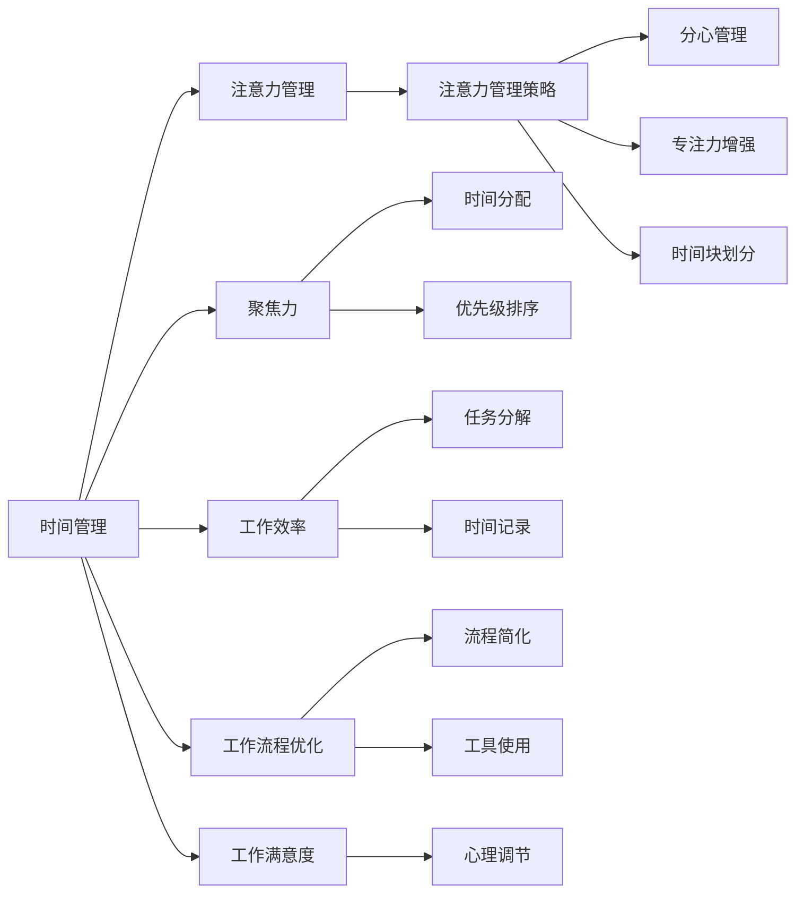

                 

# 注意力管理与时间管理策略：通过时间管理增强专注力和效率

> 关键词：时间管理, 注意力管理, 聚焦力, 工作效率, 工作流程优化, 工作满意度

## 1. 背景介绍

在当今这个快节奏的工作环境中，许多人在完成日常任务时常常感到时间不够用，难以保持高效的专注力。如何有效管理时间，提升工作效率，成为了许多工作者关注的热点问题。文章将从时间管理和注意力管理的角度出发，探讨如何通过科学的时间管理策略，增强个人的专注力和效率。

## 2. 核心概念与联系

### 2.1 核心概念概述

为更好地理解时间管理与注意力管理的关系，我们首先需要明确以下几个核心概念：

- **时间管理**：指的是合理安排和有效利用时间以实现目标的管理方法。
- **注意力管理**：是指通过策略和方法，使个体能够更好地集中注意力，避免分心，提高工作质量的方法。
- **聚焦力**：指个人在单位时间内处理任务的能力，与注意力管理紧密相关。
- **工作效率**：指在一定时间内完成工作的数量和质量，是衡量时间管理效果的重要指标。
- **工作流程优化**：通过调整和改进工作流程，提升工作的效率和质量。
- **工作满意度**：反映个人对工作环境和工作任务的心理感受。

这些核心概念相互交织，共同构成了时间管理与注意力管理的基石。通过优化时间管理策略，可以提升个人的聚焦力和工作效率，从而提高工作满意度。

### 2.2 核心概念原理和架构的 Mermaid 流程图(Mermaid 流程节点中不要有括号、逗号等特殊字符)



这个流程图展示了时间管理与注意力管理的相互关系和作用路径。时间管理是基础，通过优化时间分配、优先级排序和任务分解，可以提升工作效率。而注意力管理则是关键，通过增强专注力、减少分心和管理时间块，可以进一步提升工作效率和工作满意度。

## 3. 核心算法原理 & 具体操作步骤

### 3.1 算法原理概述

时间管理和注意力管理的核心在于策略和技巧的运用，而非复杂的数学公式。因此，本文将主要从实践层面展开，介绍几种科学、实用的策略，帮助读者通过时间管理提升专注力和效率。

### 3.2 算法步骤详解

#### 3.2.1 时间块划分

时间块划分（Time Blocking）是一种常见的时间管理策略，通过将一天分成若干个时间块，每个时间块内专注于特定任务，可以有效提升工作效率。

步骤：
1. **列出待办事项**：将每日待办事项列出，确保不遗漏。
2. **评估任务复杂度**：对每个任务进行评估，估计所需时间。
3. **划分时间块**：将一天划分为多个时间块，每个时间块对应一个或多个任务。
4. **执行任务**：在每个时间块内，专注于执行任务，避免分心。
5. **休息与调整**：在每个时间块结束时，休息几分钟，进行短暂调整。

#### 3.2.2 分心管理

分心管理（Distraction Management）是注意力管理的关键策略，通过减少干扰，集中注意力，可以显著提高工作效率。

步骤：
1. **识别干扰源**：找出工作环境中常见干扰源，如手机通知、社交媒体等。
2. **设置规则**：制定规则，如关闭通知、使用应用限制工具等，减少干扰。
3. **专注时间**：设定专注时间，如每25分钟专注工作，休息5分钟。
4. **自我监控**：定期评估分心情况，调整规则以提升专注力。

#### 3.2.3 任务分解与优先级排序

任务分解（Task Decomposition）和优先级排序（Priority Sorting）是提升工作效率的重要手段。通过将大任务分解为小任务，并根据重要性和紧急性排序，可以更好地管理时间和精力。

步骤：
1. **任务分解**：将大任务分解为可执行的小任务。
2. **设定优先级**：根据任务的重要性和紧急性，设定优先级。
3. **制定计划**：根据优先级制定每日计划。
4. **执行与调整**：按计划执行任务，根据实际情况进行调整。

### 3.3 算法优缺点

时间管理和注意力管理策略的优点：
1. **提高工作效率**：通过科学的时间分配和任务管理，可以显著提升工作效率。
2. **增强专注力**：减少分心和干扰，有助于集中注意力，提升工作质量。
3. **提升工作满意度**：合理的计划和执行，使工作更有条理，减少焦虑和压力。

缺点：
1. **灵活性不足**：严格的时间管理可能导致缺乏灵活性，难以应对突发情况。
2. **心理压力**：过于严格的计划可能增加心理压力，影响工作满意度。
3. **适应性问题**：不同人适应性不同，需要根据自身情况进行调整。

### 3.4 算法应用领域

时间管理和注意力管理策略适用于各种工作场景，包括但不限于：

- **软件开发**：通过分解任务和设定优先级，提高代码编写效率。
- **市场营销**：通过划分时间块和减少干扰，提升市场活动策划和执行效果。
- **学术研究**：通过优化时间管理，提高文献阅读和论文写作效率。
- **项目管理**：通过任务分解和优先级排序，提升项目进度和质量控制。
- **个人生活**：通过时间管理和分心管理，提升个人生活质量和家庭幸福感。

## 4. 数学模型和公式 & 详细讲解 & 举例说明

### 4.1 数学模型构建

虽然时间管理和注意力管理主要依赖于实践技巧，但我们可以从数学模型中得到一些启发。以下是一个简化的时间管理数学模型：

设 $T$ 为一天的工作时间，$N$ 为待办事项数，$c_i$ 为第 $i$ 个任务的完成时间，$w_i$ 为第 $i$ 个任务的工作量。

假设每个任务 $i$ 的时间需求为 $c_i$，工作量为 $w_i$，则总工作量为：

$$ W = \sum_{i=1}^N w_i $$

理想情况下，希望总工作量 $W$ 等于一天的工作时间 $T$，即 $W \leq T$。

### 4.2 公式推导过程

为了在有限的时间内完成更多任务，可以采用以下推导：

假设每天工作时间为 $T$，每个任务的工作量为 $w_i$，且每个任务的工作量是固定的。设每天完成 $k$ 个任务，则有：

$$ k = \frac{W}{T} = \frac{\sum_{i=1}^N w_i}{T} $$

为了最大化 $k$，需要优化任务分配。假设每个任务的重要性为 $p_i$，则可引入加权时间：

$$ T_i = w_i \times p_i $$

总加权时间为：

$$ W' = \sum_{i=1}^N T_i $$

希望总加权时间 $W'$ 尽量接近 $T$，即：

$$ W' \leq T $$

为最大化 $k$，需要根据任务的重要性和紧急性进行排序，优先完成高重要性任务。假设每天完成 $k$ 个任务，则有：

$$ k = \frac{W'}{T} = \frac{\sum_{i=1}^N T_i}{T} $$

通过优先级排序和任务分解，可以更好地管理时间，提升工作效率。

### 4.3 案例分析与讲解

假设某软件开发人员一天工作时间为 8 小时，需要完成以下任务：

- 任务 A：代码优化，工作量 5，重要性 0.8
- 任务 B：需求分析，工作量 3，重要性 0.7
- 任务 C：测试用例编写，工作量 4，重要性 0.5

根据上述模型，计算每天能完成的任务数 $k$：

1. 计算每个任务的加权时间：
   - $T_A = 5 \times 0.8 = 4$
   - $T_B = 3 \times 0.7 = 2.1$
   - $T_C = 4 \times 0.5 = 2$

2. 计算总加权时间 $W'$：
   - $W' = 4 + 2.1 + 2 = 8.1$

3. 计算每天能完成的任务数 $k$：
   - $k = \frac{W'}{T} = \frac{8.1}{8} = 1.0125$

因此，该开发人员每天可以完成约 1.01 个任务。根据任务分解和优先级排序，可以选择先完成任务 A，然后再依次完成任务 B 和 C。

## 5. 项目实践：代码实例和详细解释说明

### 5.1 开发环境搭建

在进行时间管理策略的实践时，可以借助一些工具和应用程序来辅助管理。以下是一些常用的工具和环境搭建方法：

1. **时间管理工具**：如Trello、Asana、Todoist等，帮助列出待办事项和划分时间块。
2. **日历工具**：如Google Calendar、Outlook Calendar等，帮助安排每日任务和会议。
3. **分心管理工具**：如Forest、Focus@Will等，通过应用限制和专注模式来减少干扰。
4. **任务管理库**：如Python中的`schedule`库，帮助自动化任务安排和提醒。

### 5.2 源代码详细实现

以下是使用Python的`schedule`库实现时间管理策略的代码示例：

```python
import schedule
import time

# 定义每日待办事项和时间块
tasks = [
    ('任务A', 9, 10),
    ('任务B', 10, 11),
    ('任务C', 11, 12),
    ('任务D', 12, 13),
    ('休息时间', 13, 14),
]

# 定义任务执行函数
def execute_task(task_name, start_time, end_time):
    print(f"开始执行任务 {task_name}，时间：{start_time}-{end_time}")
    # 添加实际任务执行逻辑
    time.sleep(end_time - start_time)  # 模拟任务执行时间

# 设置任务执行时间表
for task_name, start_time, end_time in tasks:
    schedule.every().day.at(start_time).do(execute_task, task_name, start_time, end_time)

# 无限循环，等待任务执行
while True:
    schedule.run_pending()
    time.sleep(1)
```

通过上述代码，可以实现每日任务的自动安排和执行。具体步骤如下：

1. 定义每日待办事项和时间块。
2. 定义任务执行函数，用于模拟任务执行。
3. 使用`schedule.every().day.at(start_time).do()`方法，将每个任务按照时间块安排到执行时间表。
4. 通过`schedule.run_pending()`方法，实时检查任务执行时间表，确保按时执行任务。

### 5.3 代码解读与分析

代码示例中，我们使用了Python的`schedule`库来实现任务的时间管理。通过将任务按时间块划分，并自动安排到每日执行时间表，可以有效提升工作效率。

在实际应用中，可以根据具体需求调整任务的时间块和执行函数。例如，对于需要远程协作的任务，可以使用任务管理工具和协作平台，进行实时沟通和进度跟踪。

### 5.4 运行结果展示

运行上述代码后，将会按照时间块安排执行每个任务，并在控制台上显示任务执行情况。例如，执行任务A的时间段为9:00-10:00，执行任务B的时间段为10:00-11:00，以此类推。

## 6. 实际应用场景

### 6.1 软件开发

在软件开发中，时间管理与注意力管理策略可以显著提升代码编写和项目管理效率。通过任务分解和优先级排序，可以更好地管理项目进度和团队协作。

### 6.2 市场营销

市场营销人员需要管理多个活动和任务，通过时间块划分和分心管理，可以提高策划和执行效果。利用日历工具和任务管理工具，可以更好地安排会议和跟进任务进展。

### 6.3 学术研究

学术研究人员需要处理大量的文献和实验数据，通过时间管理和注意力管理，可以提高文献阅读和论文写作效率。利用时间块划分和任务分解，可以更好地规划每日研究任务。

### 6.4 未来应用展望

未来，时间管理和注意力管理策略将更加智能和自动化。通过AI技术和大数据分析，可以实现更精准的任务分配和优先级排序，自动调整和优化时间管理策略。

例如，可以使用智能助理（如Google Assistant、Siri）来辅助时间管理，根据用户习惯和任务优先级自动安排每日任务。还可以利用大数据分析，预测用户在不同时间段的工作效率，自动调整时间块和优先级排序。

## 7. 工具和资源推荐

### 7.1 学习资源推荐

以下是一些推荐的学习资源，帮助读者系统掌握时间管理和注意力管理的方法：

1. 《高效能人士的七个习惯》（Stephen R. Covey）：这本书系统介绍了时间管理的基本原则和技巧，是经典的时间管理入门书籍。
2. 《番茄工作法图解》（Francesco Cirillo）：这本书介绍了番茄工作法的基本原理和操作步骤，适合初学者快速上手。
3. 《深度工作：如何有效利用每一点脑力》（Cal Newport）：这本书探讨了如何通过深度工作提升专注力和效率，适合提高工作效率的进阶阅读。
4. 《保持专注：如何在数字干扰时代掌控注意力》（Ludwigblue）：这本书提供了多种注意力管理技巧，帮助应对数字干扰，提升工作质量。
5. 《时间管理：从入门到精通》（李笑来）：这是一本通俗易懂的时间管理书籍，适合不同层次的读者。

### 7.2 开发工具推荐

以下是一些推荐的开发工具，帮助读者更好地实践时间管理和注意力管理策略：

1. **Trello**：一款基于Web的项目管理工具，帮助列出待办事项和时间块，适用于团队协作。
2. **Asana**：一款功能丰富的项目管理工具，支持任务分解和优先级排序，适合个人和团队使用。
3. **Todoist**：一款简单易用的任务管理工具，支持任务安排和提醒功能，适合个人使用。
4. **Forest**：一款基于番茄工作法的分心管理工具，通过种树的方式帮助减少干扰，提升专注力。
5. **Google Calendar**：一款强大的日历工具，支持任务安排和提醒，适合个人和团队使用。
6. **Focus@Will**：一款基于神经科学的专注音乐应用，帮助提升注意力和专注力。

### 7.3 相关论文推荐

以下是一些推荐的相关论文，帮助读者深入理解时间管理和注意力管理的理论和实践：

1. 《时间管理与幸福感：长期效应与短期影响》（Joachim Voss）：这篇论文探讨了时间管理对幸福感的影响，提供了时间管理的理论和实证研究。
2. 《注意力管理的心理学基础》（Catherine C. Ducheyne）：这篇论文介绍了注意力管理的心理学理论和实践方法，适合深入学习。
3. 《深度工作：基于脑科学的认知增强方法》（Anders Ericsson）：这篇论文介绍了深度工作的基本原理和训练方法，适合提高工作效率的进阶阅读。
4. 《番茄工作法：高效时间管理的科学依据》（Francesco Cirillo）：这篇论文介绍了番茄工作法的科学依据和应用效果，适合实践番茄工作法的读者。

## 8. 总结：未来发展趋势与挑战

### 8.1 研究成果总结

通过上述讨论，可以总结出以下时间管理和注意力管理的核心研究成果：

1. 时间块划分和任务分解可以有效提升工作效率。
2. 分心管理通过减少干扰，有助于集中注意力，提升工作质量。
3. 优先级排序和任务分解可以帮助更好地管理时间和精力。

### 8.2 未来发展趋势

未来，时间管理和注意力管理策略将向智能化和自动化发展：

1. **智能化调整**：通过AI技术和大数据分析，可以实现更精准的任务分配和优先级排序，自动调整和优化时间管理策略。
2. **多模态融合**：结合视觉、听觉、触觉等多种感知方式，提升时间管理和注意力管理的综合效果。
3. **跨平台集成**：将时间管理和注意力管理策略集成到各类应用程序中，实现无缝对接和协同工作。
4. **个性化定制**：根据用户习惯和偏好，提供个性化的时间管理和注意力管理方案，提升用户体验。

### 8.3 面临的挑战

尽管时间管理和注意力管理策略在实践中已取得显著效果，但仍然面临一些挑战：

1. **适应性问题**：不同用户对时间管理和注意力管理策略的适应性不同，需要根据个体情况进行调整。
2. **心理压力**：过于严格的时间管理和分心管理可能导致心理压力，影响工作满意度。
3. **技术依赖**：过度依赖技术工具可能削弱人的自我管理和自律能力。

### 8.4 研究展望

未来，需要进一步探索以下研究方向：

1. **智能时间管理**：结合AI技术，实现更智能、自动化的任务安排和优先级排序。
2. **跨领域应用**：将时间管理和注意力管理策略应用到更多领域，如教育、医疗、艺术等。
3. **跨文化研究**：研究不同文化背景下时间管理和注意力管理的差异，制定更普适的策略。
4. **持续改进**：通过用户反馈和行为数据，持续改进时间管理和注意力管理策略，提高效果。

## 9. 附录：常见问题与解答

**Q1：时间管理和注意力管理是否可以适用于所有工作场景？**

A: 时间管理和注意力管理策略适用于大多数工作场景，但需要根据具体需求进行调整和优化。例如，对于需要高度集中注意力的任务，如科研、编程等，时间块划分和分心管理尤为关键。而对于需要多任务并行的任务，如客服、市场营销等，任务分解和优先级排序则更为重要。

**Q2：时间管理和注意力管理是否需要严格遵守时间表？**

A: 时间管理和注意力管理的核心在于提升工作效率和专注力，而非严格遵守时间表。可以根据个人习惯和工作特点灵活调整时间块和优先级。过于严格的时间表可能带来心理压力，影响工作满意度。

**Q3：时间管理和注意力管理是否会限制个人的自由时间？**

A: 合理的时间管理和注意力管理可以提升工作效率，减少加班和过度劳累，从而腾出更多自由时间。但在制定时间管理策略时，需要确保留出足够的休息和娱乐时间，避免过度工作和疲劳。

**Q4：时间管理和注意力管理是否可以与其他工作技巧结合使用？**

A: 时间管理和注意力管理可以与其他工作技巧结合使用，如任务分解、任务自动化、任务外包等。通过综合运用多种工作技巧，可以更全面地提升工作效率和质量。

**Q5：时间管理和注意力管理是否需要定期评估和调整？**

A: 时间管理和注意力管理策略需要定期评估和调整，以确保其适应性和有效性。通过定期反思和调整，可以更好地应对工作中的变化和挑战。

---

作者：禅与计算机程序设计艺术 / Zen and the Art of Computer Programming

