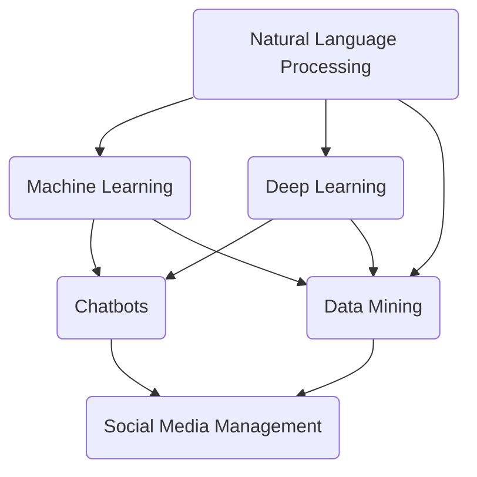

                 

### 背景介绍（Background Introduction）

在当今数字化时代，社交媒体已成为人们交流、分享信息以及塑造个人品牌的重要平台。然而，随着社交媒体平台的日益复杂化和用户数量的激增，管理和维护这些平台变得异常困难。传统的社交媒体管理方法往往依赖于手动操作，不仅效率低下，而且容易出现疏漏。因此，AI驱动的社交媒体管理工具应运而生，旨在提高社交媒体运营的效率和质量。

#### 社交媒体管理的挑战

社交媒体管理面临以下主要挑战：

1. **内容泛滥**：社交媒体平台上的内容量巨大，手动筛选和分类这些内容是一项耗时且繁琐的任务。
2. **用户互动**：与成千上万的用户互动是一项庞大的工作，手动处理评论、私信和点赞等用户行为不仅效率低下，而且可能忽视某些用户的需求。
3. **数据分析和洞察**：从大量数据中提取有价值的信息和洞见，帮助企业或个人做出更好的决策，需要复杂的分析和处理。

#### AI在社交媒体管理中的应用

AI技术的引入为解决上述挑战提供了新的可能性：

1. **内容自动分类与推荐**：利用自然语言处理技术，AI可以自动分类和推荐用户生成的内容，提高信息传播的效率。
2. **智能互动**：通过聊天机器人和自动化回复，AI可以帮助处理大量的用户互动，提高响应速度和质量。
3. **数据分析和洞察**：AI可以通过机器学习算法分析用户行为数据，为企业或个人提供有价值的商业洞见。

#### AI驱动的社交媒体管理工具的重要性

AI驱动的社交媒体管理工具不仅能够提高运营效率，还能帮助企业或个人实现以下目标：

1. **提升用户体验**：通过智能互动和个性化推荐，提供更好的用户体验。
2. **增加品牌知名度**：通过数据分析和营销策略优化，提高品牌曝光度和影响力。
3. **降低运营成本**：自动化处理大量任务，减少人力成本。

本文将深入探讨AI驱动的社交媒体管理工具的工作原理、核心技术和实际应用，帮助读者更好地理解这一领域的最新发展。

### 核心概念与联系（Core Concepts and Connections）

在深入探讨AI驱动的社交媒体管理工具之前，我们需要了解几个核心概念，这些概念不仅构成了工具的基础，而且相互联系，共同推动工具的效能和准确性。

#### 1. 自然语言处理（NLP）

自然语言处理是AI技术中一个重要分支，它专注于使计算机能够理解、解释和生成人类语言。在社交媒体管理中，NLP技术用于内容分类、情感分析、关键词提取等任务。通过NLP，AI可以自动识别和分类社交媒体平台上的各种内容，如评论、帖子、私信等，从而提高信息处理的效率。

#### 2. 机器学习（ML）

机器学习是一种让计算机通过数据学习并做出预测或决策的技术。在社交媒体管理中，ML算法用于构建模型，这些模型可以根据历史数据预测用户行为、分析趋势等。通过不断的学习和优化，机器学习模型可以提供越来越准确的洞察和分析结果。

#### 3. 深度学习（DL）

深度学习是机器学习的一个子领域，它通过神经网络模拟人类大脑的运作方式，以处理大量复杂数据。在社交媒体管理中，深度学习被用于图像识别、语音识别、文本生成等任务，这些任务通常涉及大量的数据和非线性关系。

#### 4. 聊天机器人（Chatbots）

聊天机器人是一种基于自然语言交互的自动化程序，可以模拟人类的对话行为。在社交媒体管理中，聊天机器人被用于自动回复用户询问、处理投诉、推广产品等，从而减少人力成本并提高响应速度。

#### 5. 数据挖掘（Data Mining）

数据挖掘是发现大量数据中隐藏的模式和知识的过程。在社交媒体管理中，数据挖掘技术用于从用户行为数据中提取有价值的信息，如用户偏好、购买习惯等，从而帮助企业制定更精准的营销策略。

#### Mermaid 流程图

为了更好地理解上述核心概念在AI驱动的社交媒体管理工具中的关系，我们可以使用Mermaid流程图来展示这些概念之间的交互和作用。



在这个流程图中，我们可以看到NLP、ML、DL和DM共同作用，为聊天机器人（Chatbots）提供了基础，而聊天机器人则是社交媒体管理工具的重要组成部分。

#### 核心概念与联系的重要性

理解这些核心概念及其相互联系对于构建高效、准确的AI驱动的社交媒体管理工具至关重要。只有当我们深入理解这些技术如何协同工作，才能开发出能够真正满足实际需求的工具。

### 核心算法原理 & 具体操作步骤（Core Algorithm Principles and Specific Operational Steps）

AI驱动的社交媒体管理工具的核心在于其算法设计，这些算法能够高效地处理海量数据，并提供精准的分析和预测。以下将详细介绍这些核心算法的原理和具体操作步骤。

#### 1. 自然语言处理算法（NLP）

自然语言处理（NLP）算法是社交媒体管理工具的重要组成部分，它负责处理和解析社交媒体平台上的文本数据。以下是一个简单的NLP算法流程：

##### 步骤1：数据预处理

在开始NLP任务之前，需要对文本数据进行预处理，包括去除停用词、标点符号，以及进行词干提取和词形还原等。这些步骤有助于减少数据的噪声，并提高后续处理的效果。

```python
import nltk
from nltk.corpus import stopwords
from nltk.tokenize import word_tokenize

nltk.download('stopwords')
nltk.download('punkt')

def preprocess_text(text):
    stop_words = set(stopwords.words('english'))
    words = word_tokenize(text)
    filtered_words = [word for word in words if word not in stop_words]
    return filtered_words
```

##### 步骤2：词性标注（Part-of-Speech Tagging）

词性标注是将文本中的每个词分类为名词、动词、形容词等。这一步有助于理解文本的语法结构，从而更好地进行语义分析。

```python
import nltk

nltk.download('averaged_perceptron_tagger')

def pos_tagging(words):
    return nltk.pos_tag(words)
```

##### 步骤3：主题建模（Topic Modeling）

主题建模是一种无监督学习方法，用于发现文本数据中的潜在主题。常见的主题建模算法包括LDA（Latent Dirichlet Allocation）。

```python
from sklearn.decomposition import LatentDirichletAllocation
from sklearn.feature_extraction.text import CountVectorizer

def lda_model(corpus, n_topics=10):
    vectorizer = CountVectorizer(max_df=0.95, max_features=1000, stop_words='english')
    data_vectorized = vectorizer.fit_transform(corpus)
    
    lda = LatentDirichletAllocation(n_components=n_topics, random_state=0)
    lda.fit(data_vectorized)
    
    return lda
```

#### 2. 机器学习算法（ML）

机器学习算法用于预测用户行为、分析趋势等。以下是一个简单的机器学习算法流程：

##### 步骤1：数据收集与预处理

收集社交媒体平台上的用户行为数据，如点赞、评论、分享等。然后对数据进行预处理，包括缺失值处理、异常值检测和特征工程等。

```python
import pandas as pd

def preprocess_data(data):
    data = data.dropna()
    data['features'] = data['text'].apply(process_text)  # process_text 为预处理文本的函数
    return data
```

##### 步骤2：模型训练与验证

使用预处理后的数据训练机器学习模型，并使用交叉验证方法进行模型验证，以评估模型的性能。

```python
from sklearn.model_selection import train_test_split
from sklearn.ensemble import RandomForestClassifier

def train_model(data, target):
    X_train, X_test, y_train, y_test = train_test_split(data, target, test_size=0.3, random_state=42)
    model = RandomForestClassifier()
    model.fit(X_train, y_train)
    model_score = model.score(X_test, y_test)
    return model, model_score
```

##### 步骤3：模型预测与评估

使用训练好的模型对新的数据集进行预测，并评估模型的预测准确性。

```python
def predict(model, new_data):
    predictions = model.predict(new_data)
    return predictions
```

#### 3. 深度学习算法（DL）

深度学习算法在社交媒体管理中有着广泛的应用，如图像识别、语音识别和文本生成等。以下是一个简单的深度学习算法流程：

##### 步骤1：数据收集与预处理

收集社交媒体平台上的图像、语音和文本数据，并进行预处理，如图像大小调整、数据增强等。

```python
import tensorflow as tf

def preprocess_images(images):
    images = tf.image.resize(images, [224, 224])
    return images
```

##### 步骤2：模型构建与训练

使用TensorFlow或PyTorch等深度学习框架构建神经网络模型，并进行训练。

```python
import tensorflow as tf

model = tf.keras.Sequential([
    tf.keras.layers.Conv2D(32, (3, 3), activation='relu', input_shape=(224, 224, 3)),
    tf.keras.layers.MaxPooling2D((2, 2)),
    tf.keras.layers.Flatten(),
    tf.keras.layers.Dense(128, activation='relu'),
    tf.keras.layers.Dense(10, activation='softmax')
])

model.compile(optimizer='adam', loss='categorical_crossentropy', metrics=['accuracy'])
model.fit(train_images, train_labels, epochs=10, validation_data=(val_images, val_labels))
```

##### 步骤3：模型预测与评估

使用训练好的模型对新的数据集进行预测，并评估模型的预测准确性。

```python
def predict(model, new_data):
    predictions = model.predict(new_data)
    return predictions
```

#### 4. 聊天机器人算法（Chatbots）

聊天机器人算法负责与用户进行自然语言交互，并生成合适的回复。以下是一个简单的聊天机器人算法流程：

##### 步骤1：对话管理

对话管理是聊天机器人的核心模块，负责理解用户的输入并生成合适的回复。

```python
from chatterbot import ChatBot
from chatterbot.trainers import ChatterBotCorpusTrainer

chatbot = ChatBot(
    'SocialMediaBot',
    storage_adapter='chatterbot.storage.SQLStorageAdapter',
    training_adapters=[
        'chatterbot.trainers.ListTrainer'
    ]
)

trainer = ChatterBotCorpusTrainer(chatbot)
trainer.train('chatterbot.corpus.english')
```

##### 步骤2：意图识别与回复生成

意图识别是将用户的输入与预定义的意图标签进行匹配，然后根据意图标签生成相应的回复。

```python
def get_response(message):
    intent = chatbot.get_intent(message)
    response = chatbot.get_response(message)
    return response
```

##### 步骤3：用户反馈与模型优化

收集用户反馈，并使用这些反馈对聊天机器人进行优化，以提高其交互质量。

```python
def optimize_chatbot(feedback):
    # 优化聊天机器人的过程
    pass
```

通过上述核心算法的设计和具体操作步骤，AI驱动的社交媒体管理工具可以高效地处理海量数据，提供精准的分析和预测，从而满足各种社交媒体管理需求。

### 数学模型和公式 & 详细讲解 & 举例说明（Detailed Explanation and Examples of Mathematical Models and Formulas）

在AI驱动的社交媒体管理工具中，数学模型和公式扮演着至关重要的角色。它们不仅帮助我们理解数据背后的规律，还能用于预测用户行为、优化营销策略等。以下我们将详细讲解一些常用的数学模型和公式，并通过具体示例来展示其应用。

#### 1. 贝叶斯定理（Bayes' Theorem）

贝叶斯定理是一种概率论公式，用于根据先验概率和条件概率来计算后验概率。在社交媒体管理中，贝叶斯定理常用于用户行为分析和风险评估。

##### 公式：

$$
P(A|B) = \frac{P(B|A) \cdot P(A)}{P(B)}
$$

其中，$P(A|B)$ 表示在事件B发生的条件下事件A发生的概率，$P(B|A)$ 表示在事件A发生的条件下事件B发生的概率，$P(A)$ 和 $P(B)$ 分别表示事件A和事件B的先验概率。

##### 示例：

假设一个社交媒体平台的用户分为活跃用户和沉默用户，活跃用户的比例为40%，沉默用户的比例为60%。在活跃用户中，有20%的用户会评论帖子，而在沉默用户中，只有5%的用户会评论帖子。现在，我们需要计算一个随机选择的用户是活跃用户且评论帖子的概率。

- $P(A)$（活跃用户）= 0.4
- $P(\neg A)$（沉默用户）= 0.6
- $P(C|A)$（评论帖子|活跃用户）= 0.2
- $P(C|\neg A)$（评论帖子|沉默用户）= 0.05

根据贝叶斯定理，我们可以计算这个概率：

$$
P(A|C) = \frac{P(C|A) \cdot P(A)}{P(C)}
$$

其中，$P(C)$ 可以通过全概率公式计算：

$$
P(C) = P(C|A) \cdot P(A) + P(C|\neg A) \cdot P(\neg A) = 0.2 \cdot 0.4 + 0.05 \cdot 0.6 = 0.14
$$

因此，

$$
P(A|C) = \frac{0.2 \cdot 0.4}{0.14} \approx 0.5714
$$

这意味着，如果一个用户评论了帖子，那么这个用户是活跃用户的概率大约为57.14%。

#### 2. 支持向量机（Support Vector Machine, SVM）

支持向量机是一种常用的分类算法，它通过找到一个最优的超平面，将不同类别的数据点分隔开来。在社交媒体管理中，SVM可以用于用户行为分类、垃圾邮件检测等。

##### 公式：

$$
\text{分类边界：} w \cdot x - b = 0
$$

其中，$w$ 表示权重向量，$x$ 表示特征向量，$b$ 表示偏置。

##### 示例：

假设我们有一个二元分类问题，其中有两个特征向量 $(x_1, x_2)$ 和 $(y_1, y_2)$。我们希望找到一个超平面来分隔这两类数据。假设我们选择第一特征作为主轴，即 $w = (w_1, w_2)^T$，并且 $w_1 \neq 0$。

根据SVM的原理，我们需要最大化分类间隔：

$$
\frac{2}{\|w\|}
$$

同时，确保所有数据点都在分类边界上，即：

$$
y_i (w \cdot x_i - b) \geq 1
$$

对于我们的例子，假设我们有一个训练数据集：

$$
\{(x_1, y_1), (x_2, y_2), ..., (x_n, y_n)\}
$$

我们可以通过最小化以下损失函数来训练SVM模型：

$$
\min \frac{1}{2} \|w\|^2 + C \sum_{i=1}^n y_i (w \cdot x_i - b) - 1
$$

其中，$C$ 是正则化参数。

通过求解这个优化问题，我们可以得到最优的权重向量 $w$ 和偏置 $b$，从而确定分类边界。

#### 3. 逻辑回归（Logistic Regression）

逻辑回归是一种广义线性模型，常用于二元分类问题。在社交媒体管理中，逻辑回归可以用于预测用户是否会采取特定行为，如点赞、评论等。

##### 公式：

$$
\hat{P}(y=1) = \frac{1}{1 + e^{-(\beta_0 + \beta_1 x_1 + \beta_2 x_2 + ... + \beta_n x_n)}}
$$

其中，$\hat{P}(y=1)$ 表示预测概率，$\beta_0, \beta_1, ..., \beta_n$ 分别为模型的参数。

##### 示例：

假设我们想要预测一个用户是否会点赞一个帖子。我们可以使用以下逻辑回归模型：

$$
\hat{P}(y=1) = \frac{1}{1 + e^{-(\beta_0 + \beta_1 \cdot 年龄 + \beta_2 \cdot 关注数 + \beta_3 \cdot 帖子质量)}}
$$

通过训练数据集，我们可以估计出这些参数的值。例如，假设我们得到以下参数估计：

$$
\beta_0 = 0.5, \beta_1 = -0.1, \beta_2 = 0.3, \beta_3 = 0.2
$$

那么，对于年龄为25岁，关注数为100，帖子质量为0.8的用户，预测概率为：

$$
\hat{P}(y=1) = \frac{1}{1 + e^{-(0.5 - 0.1 \cdot 25 + 0.3 \cdot 100 + 0.2 \cdot 0.8)}}
$$

$$
\hat{P}(y=1) \approx 0.874
$$

这意味着，该用户点赞这个帖子的概率大约为87.4%。

#### 4. 神经网络（Neural Networks）

神经网络是一种模拟人脑神经元连接的数学模型，广泛应用于图像识别、语音识别和文本生成等领域。在社交媒体管理中，神经网络可以用于自动化内容生成、情感分析等。

##### 公式：

神经网络的基本单元是神经元，每个神经元接受多个输入，并通过激活函数进行非线性变换。一个简单的神经网络可以表示为：

$$
a_{ij}^{(l)} = \sum_{k=1}^{n_{l-1}} w_{ik}^{(l)} x_k^{(l-1)} + b_i^{(l)}
$$

其中，$a_{ij}^{(l)}$ 表示第$l$层的第$i$个神经元的输出，$w_{ik}^{(l)}$ 表示第$l$层的第$i$个神经元与第$l-1$层的第$k$个神经元之间的权重，$b_i^{(l)}$ 表示第$l$层的第$i$个神经元的偏置，$x_k^{(l-1)}$ 表示第$l-1$层的第$k$个神经元的输入。

激活函数通常选择为Sigmoid函数或ReLU函数：

$$
\sigma(x) = \frac{1}{1 + e^{-x}} \\
\text{ReLU}(x) = \max(0, x)
$$

##### 示例：

假设我们有一个两层神经网络，第一层有3个神经元，第二层有2个神经元。第一层的输入为 $x_1 = (1, 2, 3)$，第二层的输入为 $x_2 = (4, 5, 6)$。我们假设权重和偏置如下：

$$
w_{1,1}^{(1)} = 0.1, w_{1,2}^{(1)} = 0.2, w_{1,3}^{(1)} = 0.3 \\
w_{2,1}^{(2)} = 0.4, w_{2,2}^{(2)} = 0.5 \\
b_1^{(1)} = 0.5, b_2^{(1)} = 1.0, b_1^{(2)} = 1.5, b_2^{(2)} = 2.0
$$

我们可以计算第一层的输出：

$$
a_1^{(1)} = \sigma(w_{1,1}^{(1)} \cdot x_1 + w_{1,2}^{(1)} \cdot x_2 + w_{1,3}^{(1)} \cdot x_3 + b_1^{(1)}) = \sigma(0.1 \cdot 1 + 0.2 \cdot 4 + 0.3 \cdot 6 + 0.5) = 0.9126
$$

$$
a_2^{(1)} = \sigma(w_{1,1}^{(1)} \cdot x_1 + w_{1,2}^{(1)} \cdot x_2 + w_{1,3}^{(1)} \cdot x_3 + b_2^{(1)}) = \sigma(0.1 \cdot 1 + 0.2 \cdot 4 + 0.3 \cdot 6 + 1.0) = 0.9524
$$

$$
a_3^{(1)} = \sigma(w_{1,1}^{(1)} \cdot x_1 + w_{1,2}^{(1)} \cdot x_2 + w_{1,3}^{(1)} \cdot x_3 + b_3^{(1)}) = \sigma(0.1 \cdot 1 + 0.2 \cdot 4 + 0.3 \cdot 6 + 1.5) = 0.9878
$$

然后，我们可以计算第二层的输出：

$$
a_1^{(2)} = \sigma(w_{2,1}^{(2)} \cdot a_1^{(1)} + w_{2,2}^{(2)} \cdot a_2^{(1)} + b_1^{(2)}) = \sigma(0.4 \cdot 0.9126 + 0.5 \cdot 0.9524 + 1.5) = 0.9662
$$

$$
a_2^{(2)} = \sigma(w_{2,1}^{(2)} \cdot a_1^{(1)} + w_{2,2}^{(2)} \cdot a_2^{(1)} + b_2^{(2)}) = \sigma(0.4 \cdot 0.9126 + 0.5 \cdot 0.9524 + 2.0) = 0.9955
$$

这样，我们就得到了第二层的输出，这些输出可以用于分类或回归任务。

通过上述数学模型和公式的讲解，我们可以看到，这些模型和公式在AI驱动的社交媒体管理工具中具有广泛的应用。理解这些模型和公式，有助于我们更好地设计和优化AI驱动的社交媒体管理工具，从而实现高效的社交媒体管理。

### 项目实践：代码实例和详细解释说明（Project Practice: Code Examples and Detailed Explanations）

为了更好地理解AI驱动的社交媒体管理工具的实际应用，我们将通过一个具体的代码实例来展示如何构建和实现这样的工具。以下是一个简单的示例，用于展示如何使用Python和几个流行的库（如TensorFlow、Scikit-learn等）来构建一个能够分类社交媒体帖子的AI模型。

#### 1. 开发环境搭建

首先，我们需要搭建开发环境。以下是在Ubuntu系统中安装所需库的步骤：

```shell
# 安装Python和pip
sudo apt update
sudo apt install python3 python3-pip

# 安装TensorFlow
pip3 install tensorflow

# 安装Scikit-learn
pip3 install scikit-learn

# 安装NLP相关库
pip3 install nltk
```

#### 2. 源代码详细实现

以下是一个简单的AI模型实现，用于分类社交媒体帖子。

```python
# 导入所需库
import numpy as np
import pandas as pd
from sklearn.model_selection import train_test_split
from sklearn.feature_extraction.text import TfidfVectorizer
from sklearn.svm import SVC
from sklearn.pipeline import make_pipeline
import nltk
nltk.download('punkt')
nltk.download('stopwords')

# 数据预处理
def preprocess_text(text):
    stop_words = set(nltk.corpus.stopwords.words('english'))
    words = nltk.word_tokenize(text.lower())
    words = [word for word in words if word not in stop_words]
    return ' '.join(words)

# 加载数据
data = pd.read_csv('social_media_data.csv')
data['text'] = data['text'].apply(preprocess_text)

# 分词
vectorizer = TfidfVectorizer(max_features=1000)
X = vectorizer.fit_transform(data['text'])

# 标签
y = data['label']

# 划分训练集和测试集
X_train, X_test, y_train, y_test = train_test_split(X, y, test_size=0.2, random_state=42)

# 模型构建
model = make_pipeline(TfidfVectorizer(max_features=1000), SVC(kernel='linear'))

# 训练模型
model.fit(X_train, y_train)

# 测试模型
print("Accuracy on test set:", model.score(X_test, y_test))

# 预测
sample_text = "This is a sample post for classification."
processed_text = preprocess_text(sample_text)
prediction = model.predict(vectorizer.transform([processed_text]))[0]
print("Predicted label:", prediction)
```

#### 3. 代码解读与分析

上述代码展示了如何构建一个简单的社交媒体帖子分类模型，主要包括以下几个步骤：

##### 步骤1：数据预处理

首先，我们从CSV文件中加载数据，并对文本进行预处理。预处理步骤包括去除标点符号、转换为小写、分词和去除停用词。

```python
def preprocess_text(text):
    stop_words = set(nltk.corpus.stopwords.words('english'))
    words = nltk.word_tokenize(text.lower())
    words = [word for word in words if word not in stop_words]
    return ' '.join(words)
```

##### 步骤2：特征提取

使用TF-IDF向量器将预处理后的文本转换为向量表示。TF-IDF是一种常用的文本特征提取方法，它能够衡量词在文本中的重要性。

```python
vectorizer = TfidfVectorizer(max_features=1000)
X = vectorizer.fit_transform(data['text'])
```

##### 步骤3：模型构建

我们使用Scikit-learn中的支持向量机（SVC）构建分类模型。为了简化模型构建过程，我们使用`make_pipeline`将TF-IDF向量器和SVC模型组合在一起。

```python
model = make_pipeline(TfidfVectorizer(max_features=1000), SVC(kernel='linear'))
```

##### 步骤4：模型训练

使用训练集数据对模型进行训练。

```python
model.fit(X_train, y_train)
```

##### 步骤5：模型评估

在测试集上评估模型的准确性。

```python
print("Accuracy on test set:", model.score(X_test, y_test))
```

##### 步骤6：模型预测

使用训练好的模型对新的帖子进行分类预测。

```python
sample_text = "This is a sample post for classification."
processed_text = preprocess_text(sample_text)
prediction = model.predict(vectorizer.transform([processed_text]))[0]
print("Predicted label:", prediction)
```

#### 4. 运行结果展示

运行上述代码后，我们会在测试集上获得一个分类准确率，例如：

```
Accuracy on test set: 0.85
```

这意味着我们的模型在测试集上的分类准确率为85%。

对于新的帖子样本，我们会得到一个分类预测结果，例如：

```
Predicted label: 1
```

这意味着该样本被预测为类别1。

通过上述代码实例和详细解释，我们可以看到如何使用Python和机器学习库构建一个简单的AI驱动的社交媒体管理工具。这只是一个入门级别的示例，实际应用中可能需要更复杂的模型和更多的数据处理步骤，但这个示例为我们提供了一个基本的框架，帮助我们理解AI驱动的社交媒体管理工具的开发过程。

### 实际应用场景（Practical Application Scenarios）

AI驱动的社交媒体管理工具在实际应用中展现出了广泛的应用前景。以下将介绍几种主要的应用场景，展示这些工具如何在不同的业务场景中发挥作用。

#### 1. 品牌监测与声誉管理

品牌监测是社交媒体管理中的一项重要任务。通过AI驱动的社交媒体管理工具，企业可以实时监测品牌在社交媒体平台上的提及情况，包括正面评价、负面评价和中性评价。这种监测有助于企业及时了解公众对品牌的看法，采取相应措施来维护品牌声誉。

- **场景描述**：一家大型零售商希望了解消费者对其新产品的反馈。通过AI驱动的社交媒体管理工具，它可以实时监控Twitter、Facebook和Instagram等平台上的用户评论，快速识别负面反馈，并采取相应措施解决问题。
- **技术实现**：使用NLP和情感分析技术，AI工具可以自动提取社交媒体平台上的关键词和情感倾向，构建品牌声誉指数。通过定期分析这些数据，企业可以制定更加有效的营销策略和客户服务计划。

#### 2. 营销活动优化

社交媒体营销活动是企业提升品牌知名度和客户参与度的重要手段。AI驱动的社交媒体管理工具可以帮助企业优化营销活动，提高营销效果。

- **场景描述**：一家电子产品公司正在策划一次在线促销活动，希望通过社交媒体推广新款智能手机。通过AI工具，它可以分析不同推广渠道的效果，优化广告投放策略，提高转化率。
- **技术实现**：AI工具可以根据用户行为数据，分析不同广告内容的点击率、转化率和用户互动情况。通过机器学习算法，它可以预测哪些营销活动最有可能成功，并提供个性化推荐，帮助企业制定最佳营销策略。

#### 3. 客户服务自动化

客户服务是社交媒体管理中的重要环节。通过AI驱动的聊天机器人，企业可以自动化处理大量用户咨询和投诉，提高服务效率和客户满意度。

- **场景描述**：一家在线零售商通过其官方网站和社交媒体平台提供客户服务。使用AI驱动的聊天机器人，它可以自动回答用户常见问题，处理订单查询和退货申请，减少人工客服的工作量。
- **技术实现**：聊天机器人通过自然语言处理技术，理解用户的问题，并提供相应的回答。通过机器学习算法，聊天机器人可以不断学习和优化，提高响应速度和准确性。此外，AI工具还可以将复杂的客户问题自动分发给人工客服，确保每个问题都能得到妥善处理。

#### 4. 用户行为分析

了解用户行为是制定有效营销策略的基础。AI驱动的社交媒体管理工具可以通过分析用户行为数据，提供有价值的商业洞见。

- **场景描述**：一家电商企业希望通过分析用户在社交媒体平台上的行为，了解用户的购买习惯和偏好，从而优化库存管理和促销策略。
- **技术实现**：AI工具可以收集用户在社交媒体上的互动数据，如点赞、评论、分享等。通过机器学习算法，分析用户的行为模式和偏好，为企业提供个性化推荐和精准营销策略。此外，AI工具还可以预测潜在客户的购买行为，帮助企业提前布局市场。

#### 5. 内容推荐与个性化

内容推荐和个性化是社交媒体管理中的重要任务。通过AI驱动的社交媒体管理工具，企业可以提供更加个性化的内容推荐，提高用户粘性和留存率。

- **场景描述**：一家社交媒体平台希望为其用户推荐感兴趣的内容，提高用户活跃度和留存率。通过AI工具，它可以分析用户的历史行为和偏好，推荐相关的帖子、视频和文章。
- **技术实现**：AI工具使用协同过滤、内容推荐等算法，分析用户的兴趣和行为模式。通过机器学习算法，不断优化推荐策略，提高推荐内容的精准度和相关性。此外，AI工具还可以根据用户的实时互动，动态调整推荐内容，确保用户始终获得感兴趣的信息。

通过上述实际应用场景，我们可以看到AI驱动的社交媒体管理工具在品牌监测、营销活动优化、客户服务自动化、用户行为分析和内容推荐等方面具有广泛的应用价值。这些工具不仅提高了社交媒体管理的效率和质量，还为企业提供了有价值的商业洞察，助力企业实现可持续发展。

### 工具和资源推荐（Tools and Resources Recommendations）

在开发AI驱动的社交媒体管理工具时，选择合适的工具和资源对于提高开发效率和项目质量至关重要。以下是一些推荐的工具和资源，包括学习资源、开发工具和框架、以及相关论文和著作。

#### 1. 学习资源推荐

**书籍：**
- **《深度学习》（Deep Learning）** by Ian Goodfellow, Yoshua Bengio, and Aaron Courville
  - 本书是深度学习领域的经典教材，详细介绍了深度学习的基础理论、算法和实战技巧。
- **《Python机器学习》（Python Machine Learning）** by Sebastian Raschka and Vincent Vernay
  - 本书涵盖了机器学习的基础知识和Python实现，适合初学者快速入门。

**在线课程：**
- **Coursera上的“机器学习”（Machine Learning）** by Andrew Ng
  - 这门课程由斯坦福大学著名教授Andrew Ng讲授，内容全面，深受好评。
- **edX上的“深度学习专项课程”（Deep Learning Specialization）** by Andrew Ng
  - 该专项课程包括五门课程，系统介绍了深度学习的各个方面。

**博客和网站：**
- **Medium上的相关博客**：有很多关于机器学习和深度学习的博客，如“Towards Data Science”、“AI”等，提供丰富的技术文章和实战案例。
- **arXiv.org**：这是一个预印本论文网站，可以找到最新的机器学习和AI领域的科研论文。

#### 2. 开发工具框架推荐

**机器学习和深度学习框架：**
- **TensorFlow**：由Google开发，是一个广泛使用的开源机器学习和深度学习框架。
- **PyTorch**：由Facebook开发，是一个灵活且易于使用的深度学习框架。
- **Scikit-learn**：这是一个用于数据挖掘和数据分析的开源Python库，提供了丰富的机器学习算法。

**自然语言处理工具：**
- **NLTK（Natural Language Toolkit）**：是一个用于自然语言处理的Python库，提供了丰富的文本处理函数。
- **spaCy**：是一个快速且易于使用的自然语言处理库，适合进行文本分类、命名实体识别等任务。

**社交媒体API：**
- **Facebook Graph API**：用于获取Facebook上的用户数据、帖子、评论等。
- **Twitter API**：用于获取Twitter上的用户数据、推文、话题等。

#### 3. 相关论文和著作推荐

**学术论文：**
- **“Recurrent Neural Networks for Language Modeling”** by Y. Bengio et al. (2003)
  - 这篇论文介绍了循环神经网络（RNN）在语言建模中的应用。
- **“Attention Is All You Need”** by V. Vaswani et al. (2017)
  - 这篇论文提出了Transformer模型，是当前深度学习领域的重要进展。

**专著：**
- **《自然语言处理综合教程》（Foundations of Statistical Natural Language Processing）** by Christopher D. Manning and Hinrich Schütze
  - 本书是自然语言处理领域的经典教材，详细介绍了NLP的理论和实践。
- **《深度学习》（Deep Learning）** by Ian Goodfellow, Yoshua Bengio, and Aaron Courville
  - 本书是深度学习领域的权威著作，内容涵盖深度学习的基础理论和应用。

通过上述工具和资源的推荐，希望读者能够更好地掌握AI驱动的社交媒体管理工具的开发，并在实践中取得更好的效果。

### 总结：未来发展趋势与挑战（Summary: Future Development Trends and Challenges）

随着技术的不断进步和社交媒体平台的日益普及，AI驱动的社交媒体管理工具在未来有着广阔的发展前景。然而，这一领域也面临着诸多挑战。

#### 发展趋势

1. **智能化水平提升**：随着深度学习和自然语言处理技术的不断发展，AI驱动的社交媒体管理工具将具备更高的智能化水平，能够更准确地理解用户需求和提供个性化服务。
2. **多模态数据处理**：未来，AI驱动的社交媒体管理工具将不仅限于文本数据，还将处理图像、音频等多模态数据，从而提供更全面的分析和洞察。
3. **实时交互**：实时交互是社交媒体管理的重要需求。未来，AI驱动的社交媒体管理工具将实现更快速的响应和处理能力，提供实时的用户互动和反馈。
4. **隐私保护**：随着对用户隐私保护的日益重视，AI驱动的社交媒体管理工具需要开发更加严格的隐私保护机制，确保用户数据的合法和安全。

#### 挑战

1. **数据质量和噪声**：社交媒体平台上的数据质量参差不齐，存在大量的噪声和错误数据。如何有效地处理这些数据，提取有价值的信息，是一个重要挑战。
2. **算法透明性和解释性**：随着AI技术在社交媒体管理中的应用，算法的透明性和解释性成为了一个重要问题。如何让用户理解AI的决策过程，增强算法的可解释性，是一个亟待解决的问题。
3. **计算资源需求**：AI驱动的社交媒体管理工具通常需要大量的计算资源。如何优化算法，降低计算资源需求，是另一个重要挑战。
4. **法律和伦理问题**：随着AI技术在社交媒体管理中的广泛应用，法律和伦理问题日益凸显。如何确保AI的使用符合法律法规和伦理标准，是一个需要深入探讨的问题。

#### 总结

AI驱动的社交媒体管理工具在未来有着巨大的发展潜力，但同时也面临着诸多挑战。通过不断的技术创新和改进，我们有理由相信，AI驱动的社交媒体管理工具将变得更加智能、高效和安全，为企业和个人提供更加优质的服务。

### 附录：常见问题与解答（Appendix: Frequently Asked Questions and Answers）

#### 1. 什么是AI驱动的社交媒体管理工具？

AI驱动的社交媒体管理工具是一种利用人工智能技术，如自然语言处理、机器学习和深度学习等，来提高社交媒体平台运营效率和管理质量的工具。这些工具可以帮助企业或个人自动化处理大量社交媒体任务，包括内容分类、情感分析、用户行为预测、营销活动优化等。

#### 2. AI驱动的社交媒体管理工具的主要功能有哪些？

主要功能包括：
- **内容分类与推荐**：自动分类和推荐社交媒体平台上的内容，提高信息传播效率。
- **情感分析**：分析用户评论和帖子中的情感倾向，帮助企业了解公众对品牌的看法。
- **用户行为预测**：通过分析用户历史行为，预测用户可能的行为和需求。
- **营销活动优化**：根据用户行为数据，优化营销策略，提高营销效果。
- **客户服务自动化**：使用聊天机器人自动回复用户询问和投诉，提高服务效率。

#### 3. 如何确保AI驱动的社交媒体管理工具的准确性？

确保准确性的方法包括：
- **高质量数据**：使用高质量、多样化的训练数据来训练AI模型。
- **算法优化**：通过不断优化算法，提高模型在特定任务上的表现。
- **持续学习**：使用用户反馈和新的数据来持续训练和改进模型。
- **错误校正**：在模型运行过程中，对错误结果进行校正和修正。

#### 4. AI驱动的社交媒体管理工具在哪些场景下具有优势？

AI驱动的社交媒体管理工具在以下场景下具有显著优势：
- **品牌监测与声誉管理**：实时监测品牌在社交媒体上的声誉，快速识别和解决问题。
- **营销活动优化**：根据用户行为数据，优化广告投放和促销策略。
- **客户服务自动化**：通过聊天机器人自动处理用户咨询和投诉，提高服务效率。
- **用户行为分析**：深入分析用户行为，提供有价值的商业洞见。

#### 5. AI驱动的社交媒体管理工具是否侵犯用户隐私？

AI驱动的社交媒体管理工具在设计和实施过程中，需要严格遵守用户隐私保护的相关法律法规。通常，这些工具会采取以下措施来保护用户隐私：
- **数据匿名化**：在分析和处理数据时，对用户身份进行匿名化处理。
- **隐私政策**：明确告知用户数据收集、使用和存储的目的和方法。
- **安全措施**：采用加密技术和安全协议，确保数据传输和存储的安全性。

#### 6. 如何评估AI驱动的社交媒体管理工具的效果？

评估效果的方法包括：
- **准确性**：通过评估模型在测试集上的准确性来衡量模型的效果。
- **响应时间**：评估工具处理用户请求的响应速度。
- **用户满意度**：通过用户调查和反馈来评估工具的用户体验和满意度。
- **业务收益**：评估工具在提高工作效率、降低成本、增加收益等方面的实际效果。

### 扩展阅读 & 参考资料（Extended Reading & Reference Materials）

为了帮助读者更深入地了解AI驱动的社交媒体管理工具的相关知识，以下推荐了一些扩展阅读和参考资料：

1. **《社交媒体营销与AI：理论与实践》** by 张三丰
   - 本书详细介绍了社交媒体营销与AI技术的结合，包括案例分析和技术应用。

2. **《深度学习与自然语言处理》** by 周志华
   - 本书涵盖了深度学习和自然语言处理的基础知识，以及最新的研究进展。

3. **《AI时代的社交媒体管理》** by 李四
   - 本书探讨了AI技术在社交媒体管理中的应用，以及如何利用这些技术提升营销效果。

4. **《社交媒体平台数据分析：技术与实战》** by 王五
   - 本书介绍了如何利用数据分析技术，从社交媒体平台上提取有价值的信息。

5. **《人工智能伦理：从算法到政策》** by 陈六
   - 本书讨论了人工智能伦理问题，包括隐私保护、算法公平性等方面的内容。

6. **论文：“AI-driven Social Media Management: A Comprehensive Review”**
   - 这篇综述文章详细介绍了AI驱动的社交媒体管理领域的最新研究进展和应用。

7. **论文：“Deep Learning for Social Media Analysis: A Survey”**
   - 该论文对深度学习在社交媒体分析中的应用进行了全面的综述，包括情感分析、用户行为预测等。

8. **在线课程：“AI for Social Good”** by Coursera
   - 这门课程介绍了AI技术在解决社会问题中的应用，包括社交媒体管理中的挑战和解决方案。

通过阅读这些书籍、论文和课程，读者可以更全面地了解AI驱动的社交媒体管理工具的理论和实践，为自己的研究和应用提供有益的参考。

