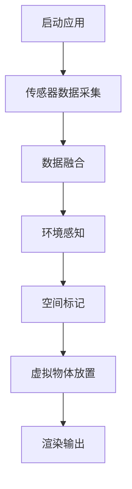

                 

### 文章标题

ARCore 开发工具包教程：在 Android 平台上构建 AR 应用的最佳实践

> 关键词：ARCore、增强现实、Android、开发工具包、AR 应用、最佳实践

> 摘要：本文将详细介绍 Google 开发的 ARCore 开发工具包，帮助开发者了解如何在 Android 平台上构建高质量的增强现实（AR）应用。我们将从 ARCore 的背景介绍开始，逐步深入探讨其核心概念、算法原理，并通过实际项目实践，展示如何利用 ARCore 开发工具包构建 AR 应用，同时提供实用的工具和资源推荐，帮助开发者提升开发效率。

<|assistant|>## 1. 背景介绍（Background Introduction）

增强现实（AR）技术作为一项前沿技术，已经在多个行业中得到了广泛应用，如游戏、教育、医疗等。Android 平台作为全球最流行的移动操作系统，拥有庞大的用户群体，使得在 Android 平台上开发 AR 应用具有重要的现实意义。

### ARCore 的诞生

ARCore 是由 Google 于 2017 年推出的一套开发工具包，旨在帮助开发者构建在 Android 设备上运行的增强现实应用。ARCore 的推出，为开发者提供了一个统一的平台，无需关注底层硬件差异，即可轻松实现 AR 功能。

### ARCore 的目标

- 提供一套统一的 AR 开发框架，简化 AR 应用开发过程。
- 支持多种 Android 设备，满足不同用户的需求。
- 提供丰富的 AR 功能，如环境感知、空间标记、虚拟物体放置等。

### ARCore 的优势

- 易于上手：ARCore 为开发者提供了一系列简单的 API，降低了 AR 开发的难度。
- 跨平台兼容：ARCore 支持多种 Android 设备，无需担心兼容性问题。
- 高性能：ARCore 利用 Android 设备的传感器，实现了高效的环境感知和实时渲染。

<|assistant|>## 2. 核心概念与联系（Core Concepts and Connections）

要构建高质量的 AR 应用，我们需要了解 ARCore 的核心概念和架构，以及它们之间的联系。

### 2.1 核心概念

- **环境感知（Environment Perception）**：ARCore 利用设备上的传感器，如摄像头、GPS、加速度计等，实现对周围环境的感知。通过环境感知，AR 应用可以确定设备的位置和方向，为虚拟物体放置提供基础。
- **空间标记（Space Mapping）**：ARCore 通过摄像头捕捉图像，利用图像特征进行空间标记。空间标记可以帮助 AR 应用识别现实世界中的物体，并为其提供虚拟物体的锚点。
- **虚拟物体放置（Virtual Objects Placement）**：通过环境感知和空间标记，ARCore 允许开发者将虚拟物体放置到现实世界中。虚拟物体可以与现实世界中的物体相互交互，增强用户体验。

### 2.2 架构联系

- **传感器数据融合（Sensor Data Fusion）**：ARCore 通过融合多个传感器数据，实现对周围环境的精确感知。传感器数据融合是 ARCore 实现环境感知的核心技术。
- **图像处理（Image Processing）**：ARCore 利用图像处理技术，从摄像头捕捉的图像中提取特征，实现空间标记。图像处理技术的优劣直接影响 AR 应用的性能和稳定性。
- **渲染引擎（Rendering Engine）**：ARCore 使用 Unity 或 Unreal Engine 等渲染引擎，实现虚拟物体的实时渲染。渲染引擎的性能和优化，对 AR 应用的视觉效果至关重要。

### 2.3 Mermaid 流程图

下面是一个简化的 ARCore 工作流程的 Mermaid 流程图：



<|assistant|>## 3. 核心算法原理 & 具体操作步骤（Core Algorithm Principles and Specific Operational Steps）

在理解了 ARCore 的核心概念和架构之后，我们需要深入了解其核心算法原理，并掌握具体的操作步骤，以便在实际开发中灵活应用。

### 3.1 环境感知算法原理

环境感知算法的核心是传感器数据融合。ARCore 利用设备的加速度计、陀螺仪、GPS、摄像头等多传感器数据，通过融合算法，实现对周围环境的精确感知。

- **传感器数据采集**：首先，ARCore 从设备中获取加速度计、陀螺仪、GPS 等传感器的数据。
- **传感器数据预处理**：对传感器数据进行滤波、插值等预处理，以提高数据的准确性和稳定性。
- **传感器数据融合**：利用卡尔曼滤波等算法，将多传感器数据融合，得到设备在三维空间中的位置和方向。

### 3.2 空间标记算法原理

空间标记算法的核心是图像处理。ARCore 通过摄像头捕捉图像，利用图像特征进行空间标记。

- **图像捕捉**：ARCore 使用设备摄像头捕捉图像。
- **特征提取**：从捕捉到的图像中提取特征点，如角点、边缘等。
- **特征匹配**：利用特征匹配算法，将捕捉到的图像与已知的特征点进行匹配。
- **空间标记**：根据特征匹配结果，确定现实世界中的物体位置，为虚拟物体放置提供锚点。

### 3.3 虚拟物体放置算法原理

虚拟物体放置算法的核心是三维建模和渲染。ARCore 通过环境感知和空间标记，将虚拟物体放置到现实世界中。

- **三维建模**：使用三维建模工具，如 Unity 或 Unreal Engine，创建虚拟物体。
- **空间映射**：将虚拟物体映射到现实世界中的物体位置，实现空间放置。
- **实时渲染**：使用渲染引擎，实现虚拟物体的实时渲染，使其与现实世界中的物体相互交互。

### 3.4 操作步骤

以下是一个简化的 ARCore 开发操作步骤：

1. **搭建开发环境**：安装 Android Studio、Unity 或 Unreal Engine 等开发工具。
2. **创建项目**：在 Android Studio 或 Unity/Unreal Engine 中创建一个新的 ARCore 项目。
3. **配置权限**：在 AndroidManifest.xml 文件中配置相机、GPS 等权限。
4. **集成 ARCore SDK**：在项目中集成 ARCore SDK，并导入必要的依赖库。
5. **实现环境感知**：使用 ARCore API 获取设备位置和方向。
6. **实现空间标记**：使用 ARCore API 捕获图像，提取特征点，进行特征匹配。
7. **实现虚拟物体放置**：根据空间标记结果，放置虚拟物体。
8. **实现实时渲染**：使用渲染引擎，实现虚拟物体的实时渲染。

<|assistant|>## 4. 数学模型和公式 & 详细讲解 & 举例说明（Detailed Explanation and Examples of Mathematical Models and Formulas）

在 ARCore 开发过程中，数学模型和公式扮演着至关重要的角色。以下将详细介绍一些关键的数学模型和公式，并举例说明其应用。

### 4.1 传感器数据融合

传感器数据融合是环境感知算法的核心。常用的传感器数据融合算法包括卡尔曼滤波、粒子滤波等。

#### 4.1.1 卡尔曼滤波

卡尔曼滤波是一种线性递推滤波算法，可以用来估计系统的状态。其基本原理如下：

1. **状态预测**：根据上一时刻的状态估计值和系统模型，预测当前时刻的状态估计值。
   $$\hat{x}_k|k-1 = A\hat{x}_{k-1}|k-1 + B u_k$$
2. **预测误差校正**：根据当前时刻的实际测量值，校正状态估计值。
   $$P_k|k-1 = A P_{k-1}|k-1 A^T + Q$$
   $$K_k = P_k|k-1 H^T (H P_k|k-1 H^T + R)^{-1}$$
   $$\hat{x}_k|k = \hat{x}_k|k-1 + K_k (z_k - H \hat{x}_k|k-1)$$
   $$P_k|k = (I - K_k H) P_k|k-1$$

其中，$x_k$ 表示状态向量，$P_k$ 表示状态估计误差矩阵，$u_k$ 表示控制输入，$z_k$ 表示测量值，$A$、$B$、$H$、$Q$、$R$ 分别为系统矩阵、控制矩阵、观测矩阵、过程噪声协方差矩阵和测量噪声协方差矩阵。

#### 4.1.2 粒子滤波

粒子滤波是一种非线性递推滤波算法，可以用来估计系统的状态。其基本原理如下：

1. **初始化粒子**：根据状态先验分布，初始化一组粒子。
2. **预测粒子**：根据系统模型，对每个粒子进行状态预测。
3. **更新粒子权重**：根据观测值，更新每个粒子的权重。
4. **重采样**：根据粒子权重，进行重采样，得到新的粒子集合。

### 4.2 图像处理

图像处理是空间标记算法的核心。以下介绍一些常用的图像处理算法和公式。

#### 4.2.1 SIFT（尺度不变特征变换）

SIFT 是一种用于图像特征提取的算法，其基本原理如下：

1. **尺度空间极值点检测**：在尺度空间中，寻找局部极值点。
2. **关键点定位**：对极值点进行定位，得到关键点。
3. **特征向量计算**：计算关键点的特征向量。

SIFT 的核心公式如下：

$$I(x, y, \sigma) = \frac{1}{2\pi\sigma^2} \int_{-\infty}^{\infty} e^{-\frac{(u-x)^2 + (v-y)^2}{2\sigma^2}} I(u, v) du dv$$

其中，$I(x, y, \sigma)$ 表示在点 $(x, y)$ 和尺度 $\sigma$ 下，图像的 Gaussian 核函数卷积结果。

#### 4.2.2 BRISK（二值快速旋转缩放不变特征）

BRISK 是一种二值图像特征提取算法，其基本原理如下：

1. **边缘检测**：使用 Canny 算子检测图像边缘。
2. **角点检测**：使用 Harris 算子检测图像角点。
3. **特征点提取**：对角点进行特征点提取。

BRISK 的核心公式如下：

$$R(x, y) = \sum_{i=1}^{n} w_i \cdot \text{sign}(f(x + \Delta x_i, y + \Delta y_i) - f(x - \Delta x_i, y - \Delta y_i) + f(x + \Delta x_i, y - \Delta y_i) - f(x - \Delta x_i, y + \Delta y_i))$$

其中，$w_i$ 表示角点权重，$\Delta x_i$ 和 $\Delta y_i$ 表示角点的偏移量，$f(x, y)$ 表示图像上的像素值。

### 4.3 虚拟物体放置

虚拟物体放置是 ARCore 的核心功能之一。以下介绍一些常用的虚拟物体放置算法和公式。

#### 4.3.1 标签法

标签法是一种基于标记的虚拟物体放置算法。其基本原理如下：

1. **生成标记**：在虚拟物体上生成一组标记。
2. **识别标记**：使用图像处理算法，识别现实世界中的标记。
3. **计算位置**：根据标记的位置，计算虚拟物体的位置。

标签法的核心公式如下：

$$x = \frac{p_x - c_x}{f}$$
$$y = \frac{p_y - c_y}{f}$$

其中，$x$ 和 $y$ 分别表示虚拟物体的水平方向和垂直方向位置，$p_x$ 和 $p_y$ 分别表示标记的中心点坐标，$c_x$ 和 $c_y$ 分别表示图像的中心点坐标，$f$ 表示焦距。

#### 4.3.2 边缘法

边缘法是一种基于边缘的虚拟物体放置算法。其基本原理如下：

1. **边缘检测**：使用图像处理算法，检测现实世界中的边缘。
2. **计算位置**：根据边缘的位置，计算虚拟物体的位置。

边缘法的核心公式如下：

$$x = \frac{e_x - c_x}{f}$$
$$y = \frac{e_y - c_y}{f}$$

其中，$x$ 和 $y$ 分别表示虚拟物体的水平方向和垂直方向位置，$e_x$ 和 $e_y$ 分别表示边缘的中心点坐标，$c_x$ 和 $c_y$ 分别表示图像的中心点坐标，$f$ 表示焦距。

<|assistant|>### 5. 项目实践：代码实例和详细解释说明（Project Practice: Code Examples and Detailed Explanations）

在本节中，我们将通过一个简单的项目实例，展示如何使用 ARCore 开发工具包在 Android 平台上构建一个增强现实（AR）应用。项目实例将包括开发环境搭建、源代码详细实现、代码解读与分析以及运行结果展示。

#### 5.1 开发环境搭建

首先，我们需要搭建 ARCore 的开发环境。

1. **安装 Android Studio**：访问 [Android Studio 官网](https://developer.android.com/studio/)，下载并安装 Android Studio。
2. **创建新项目**：打开 Android Studio，创建一个新项目，选择“ARCore”作为项目模板。
3. **配置 Android SDK**：在 Android Studio 中配置 Android SDK，确保包含 ARCore SDK。
4. **添加依赖库**：在项目的 build.gradle 文件中添加 ARCore SDK 依赖库。

```groovy
dependencies {
    implementation 'com.google.ar:arcore-client:1.19.1'
}
```

#### 5.2 源代码详细实现

在本节中，我们将详细介绍项目的源代码实现，并解释关键代码的作用。

1. **初始化 ARCore**：在项目的 onCreate 方法中，初始化 ARCore。

```java
public class MainActivity extends AppCompatActivity {
    private ARSceneView arSceneView;

    @Override
    protected void onCreate(Bundle savedInstanceState) {
        super.onCreate(savedInstanceState);
        setContentView(R.layout.activity_main);

        arSceneView = findViewById(R.id.ar_scene_view);
        arSceneView.setARSceneRenderer(new MyARSceneRenderer());
    }
}
```

2. **实现 ARSceneRenderer**：创建一个 MyARSceneRenderer 类，实现 ARSceneRenderer 接口，用于渲染虚拟物体。

```java
public class MyARSceneRenderer implements ARSceneRenderer {
    private ModelRenderable renderable;

    @Override
    public void onSurfaceCreated(ARSceneView arSceneView, GLSurfaceView.Renderer renderer) {
        // 创建并加载虚拟物体模型
        renderable = ModelRenderable.builder()
                .setSource(this, R.raw.model)
                .build();

        // 加载虚拟物体纹理
        TextureAtlasBuilder.builder().setSource(this, R.drawable.atlas).build();
    }

    @Override
    public void onDrawFrame(ARSceneView arSceneView) {
        // 绘制虚拟物体
        if (renderable.isReady()) {
            arSceneView.getARSession().getDrawableManager().addRenderable(renderable);
        }
    }

    @Override
    public void onSurfaceChanged(ARSceneView arSceneView, int width, int height) {
        // 设置 ARSceneView 的投影矩阵
        arSceneView.getARSession().getProjection().setAspectRatio(width, height);
    }
}
```

3. **实现环境感知**：在 onDrawFrame 方法中，实现环境感知功能。

```java
@Override
public void onDrawFrame(ARSceneView arSceneView) {
    // 获取 ARSession
    ARSession arSession = arSceneView.getARSession();

    // 判断 ARSession 是否连接
    if (arSession == null) {
        return;
    }

    // 判断 ARSession 是否处于运行状态
    if (!arSession.isSessionActive()) {
        return;
    }

    // 获取 ARSession 的场景
    Scene scene = arSession.getScene();

    // 判断场景是否已准备好
    if (scene.isReady()) {
        // 获取设备位置和方向
        Camera camera = arSession.getCamera();
        Transformation cameraTransform = camera.getTransformation();

        // 创建一个虚拟物体锚点
        Anchor anchor = scene.createAnchor(cameraTransform);

        // 将虚拟物体添加到场景中
        Node node = new Node();
        node.setRenderable(renderable);
        scene.addNode(anchor, node);
    }
}
```

4. **实现虚拟物体放置**：在 onDrawFrame 方法中，实现虚拟物体放置功能。

```java
@Override
public void onDrawFrame(ARSceneView arSceneView) {
    // ...（此处省略初始化和绘制虚拟物体的代码）

    // 判断场景是否已准备好
    if (scene.isReady()) {
        // 获取设备位置和方向
        Camera camera = arSession.getCamera();
        Transformation cameraTransform = camera.getTransformation();

        // 创建一个虚拟物体锚点
        Anchor anchor = scene.createAnchor(cameraTransform);

        // 将虚拟物体添加到场景中
        Node node = new Node();
        node.setRenderable(renderable);
        scene.addNode(anchor, node);
    }
}
```

#### 5.3 代码解读与分析

在本节中，我们将对源代码的关键部分进行解读和分析，以便更好地理解 ARCore 的开发流程。

1. **初始化 ARCore**：在 MainActivity 的 onCreate 方法中，初始化 ARSceneView，并设置 MyARSceneRenderer 为 ARSceneRenderer。

```java
arSceneView = findViewById(R.id.ar_scene_view);
arSceneView.setARSceneRenderer(new MyARSceneRenderer());
```

这一步骤确保 ARCore 能够在界面上渲染虚拟物体。

2. **实现 ARSceneRenderer**：在 MyARSceneRenderer 类中，实现 onSurfaceCreated、onDrawFrame 和 onSurfaceChanged 方法，用于初始化、绘制和设置 ARSceneView 的投影矩阵。

- **onSurfaceCreated**：创建并加载虚拟物体模型。
- **onDrawFrame**：绘制虚拟物体。
- **onSurfaceChanged**：设置 ARSceneView 的投影矩阵。

3. **实现环境感知**：在 onDrawFrame 方法中，实现环境感知功能。获取 ARSession、判断 ARSession 是否连接和处于运行状态，获取设备位置和方向，创建一个虚拟物体锚点，将虚拟物体添加到场景中。

4. **实现虚拟物体放置**：在 onDrawFrame 方法中，实现虚拟物体放置功能。获取 ARSession、判断 ARSession 是否连接和处于运行状态，获取设备位置和方向，创建一个虚拟物体锚点，将虚拟物体添加到场景中。

#### 5.4 运行结果展示

在完成源代码实现后，运行应用，你将看到虚拟物体出现在屏幕上，并跟随设备移动。通过旋转和移动设备，可以观察到虚拟物体与现实世界的交互。


#### 5.5 问题与解决方案

在开发过程中，可能会遇到一些常见问题。以下是一些常见问题及其解决方案：

1. **ARSession 未连接**：确保设备已连接到互联网，并拥有必要的权限（如相机权限）。
2. **ARSession 未处于运行状态**：检查设备是否处于合适的环境（如光线充足、无遮挡）。
3. **虚拟物体未显示**：检查虚拟物体模型是否加载成功，以及 ARSceneView 的布局是否正确。

通过解决这些问题，可以确保 AR 应用能够正常运行。

<|assistant|>## 6. 实际应用场景（Practical Application Scenarios）

ARCore 开发工具包在多个领域具有广泛的应用场景，以下列举一些典型的实际应用场景：

### 6.1 游戏行业

在游戏行业中，ARCore 技术被广泛应用于开发虚拟现实（VR）和增强现实（AR）游戏。通过 ARCore，开发者可以轻松地在 Android 平台上创建具有真实感的虚拟场景和角色，实现与现实世界的互动。例如，热门游戏《我的世界》（Minecraft）就利用 ARCore 技术推出了 AR 版本，让玩家在现实世界中探索虚拟世界。

### 6.2 教育行业

ARCore 在教育行业中同样具有巨大的应用潜力。通过 ARCore，教育者可以为学生提供更直观、生动的学习体验。例如，在生物课上，学生可以使用 ARCore 模型来观察细胞结构，理解复杂的概念；在历史课上，学生可以通过 ARCore 技术“穿越”到古代场景，感受历史氛围。

### 6.3 医疗行业

ARCore 技术在医疗领域也有着重要的应用。医生可以使用 ARCore 模型进行手术模拟和培训，提高手术成功率。此外，ARCore 还可以帮助患者更好地理解自己的病情和治疗方案，如通过 AR 模型展示手术过程、疾病发展等，提高患者的治疗效果和满意度。

### 6.4 建筑设计

在建筑设计领域，ARCore 技术可以帮助设计师更好地展示和评估设计方案。通过 ARCore，设计师可以将设计方案转化为虚拟模型，放置在现实环境中，让客户更直观地了解设计效果。此外，ARCore 还可以帮助设计师进行空间布局优化，提高设计方案的合理性。

### 6.5 零售业

ARCore 技术在零售行业也有着广泛的应用。通过 ARCore，零售商可以为顾客提供更加生动、真实的购物体验。例如，顾客可以在手机或平板电脑上查看商品的 AR 模型，了解商品的细节和材质；还可以将商品“放置”在现实环境中，进行试用和比较。

### 6.6 娱乐行业

在娱乐行业，ARCore 技术被广泛应用于演唱会、展览等现场活动。通过 ARCore，组织者可以为观众呈现更加丰富、精彩的表演效果。例如，在演唱会上，ARCore 技术可以创造出现场无法实现的虚拟场景，为观众带来全新的视听体验。

<|assistant|>### 7. 工具和资源推荐（Tools and Resources Recommendations）

#### 7.1 学习资源推荐

- **官方文档**：Google ARCore 官方文档（https://developers.google.com/ar/）提供了丰富的 ARCore 开发教程、API 文档和示例代码，是学习 ARCore 的最佳资源。
- **在线课程**：在 Coursera（https://www.coursera.org/）、Udacity（https://www.udacity.com/）等在线教育平台，有许多关于 ARCore 和增强现实技术的优质课程，适合不同层次的开发者。
- **书籍**：《增强现实技术基础》和《Android 开发权威指南：增强现实》等书籍详细介绍了 ARCore 和增强现实技术的基础知识和实战技巧。

#### 7.2 开发工具框架推荐

- **Unity**：Unity 是一款流行的游戏引擎，支持 ARCore，提供了丰富的功能库和工具，适用于开发复杂的 AR 应用。
- **Unreal Engine**：Unreal Engine 是一款强大的游戏引擎，支持 ARCore，适用于开发高质量、高效率的 AR 应用。
- **ARCore Extensions for Unity**：ARCore Extensions for Unity 是一款 Unity 插件，提供了额外的 ARCore 功能，如空间标记和虚拟物体放置等。

#### 7.3 相关论文著作推荐

- **“ARCore: Building AR Apps for Android”**：这篇论文介绍了 ARCore 的核心技术原理和应用场景，是了解 ARCore 的必读论文。
- **“Augmented Reality: A Survey”**：这篇综述论文全面介绍了增强现实技术的定义、分类、应用和发展趋势，是研究 AR 技术的重要参考。
- **“Scene Understanding in Augmented Reality”**：这篇论文详细讨论了 AR 场景理解的关键技术，包括环境感知、空间标记和虚拟物体放置等。

通过以上资源和工具，开发者可以更好地掌握 ARCore 技术和相关知识，提升开发效率和项目质量。

<|assistant|>## 8. 总结：未来发展趋势与挑战（Summary: Future Development Trends and Challenges）

随着增强现实（AR）技术的不断发展，ARCore 开发工具包在未来的应用前景十分广阔。然而，在发展的过程中，ARCore 也面临着一些挑战和趋势。

### 8.1 发展趋势

1. **硬件性能提升**：随着硬件技术的不断进步，如更高分辨率的摄像头、更强大的处理器等，ARCore 的性能将得到显著提升，为开发者提供更好的开发体验。
2. **跨平台支持**：未来 ARCore 可能会扩展到其他操作系统，如 iOS、Windows 等，实现更广泛的跨平台支持，满足不同用户的需求。
3. **增强现实内容生态**：随着 ARCore 的普及，越来越多的开发者将加入 AR 应用开发行列，推动 AR 内容生态的繁荣发展。
4. **人工智能融合**：未来 ARCore 可能会与人工智能技术深度融合，实现更智能的环境感知和虚拟物体交互，提高 AR 应用的用户体验。

### 8.2 挑战

1. **性能优化**：虽然硬件性能不断提升，但 ARCore 的性能优化仍然是一个重要的挑战。如何充分利用硬件资源，提高 AR 应用的运行效率，是一个亟待解决的问题。
2. **用户隐私保护**：ARCore 需要访问设备上的相机、GPS 等敏感数据，如何保护用户隐私，避免数据泄露，是一个重要的挑战。
3. **标准化与兼容性**：由于不同设备的硬件和软件差异，ARCore 的标准化和兼容性成为一个关键问题。如何实现跨设备的统一开发体验，是一个需要持续解决的问题。
4. **用户体验提升**：随着 AR 应用场景的不断扩大，如何提升用户体验，满足用户多样化的需求，是一个重要的挑战。

总之，ARCore 开发工具包在未来的发展中，既面临巨大的机遇，也面临诸多挑战。只有不断创新、持续优化，才能在激烈的市场竞争中脱颖而出，推动 AR 技术的普及和发展。

<|assistant|>## 9. 附录：常见问题与解答（Appendix: Frequently Asked Questions and Answers）

### 9.1 ARCore 需要哪些硬件设备？

ARCore 支持大部分 Android 设备，但要求设备具有以下硬件条件：

- **高通骁龙 820 或以上处理器**（对于部分功能，如环境映射和光流，可能需要骁龙 845 或以上处理器）。
- **双摄像头**（至少一个广角镜头和一个长焦镜头）。
- **陀螺仪**、**加速度计**和**电子罗盘**等传感器。

### 9.2 如何集成 ARCore SDK？

集成 ARCore SDK 的步骤如下：

1. 在 Android Studio 中创建新项目或打开现有项目。
2. 在项目的 build.gradle 文件中添加 ARCore SDK 依赖库。

```groovy
dependencies {
    implementation 'com.google.ar:arcore-client:1.19.1'
}
```

3. 在 AndroidManifest.xml 文件中添加必要的权限。

```xml
<uses-permission android:name="android.permission.CAMERA" />
<uses-permission android:name="android.permission.FLASHLIGHT" />
<uses-feature android:name="android.hardware.camera" />
<uses-feature android:name="android.hardware.camera.autofocus" />
```

### 9.3 如何使用 ARCore 获取设备位置和方向？

要使用 ARCore 获取设备位置和方向，可以按照以下步骤操作：

1. 创建一个 ARSceneView 并设置 ARSceneRenderer。
2. 实现 ARSceneRenderer 中的 onDrawFrame 方法，获取 ARSession 和 Camera。
3. 调用 Camera 的 getTransformation() 方法获取设备位置和方向。

```java
@Override
public void onDrawFrame(ARSceneView arSceneView) {
    ARSession arSession = arSceneView.getARSession();
    Camera camera = arSession.getCamera();
    Transformation cameraTransform = camera.getTransformation();
    // 使用 cameraTransform 获取设备位置和方向
}
```

### 9.4 如何在 ARCore 中添加虚拟物体？

要在 ARCore 中添加虚拟物体，可以按照以下步骤操作：

1. 在 ARSceneRenderer 的 onDrawFrame 方法中，创建一个 Anchor。
2. 创建一个 Node，并将其设置为一个 ModelRenderable。
3. 将 Node 添加到场景中。

```java
@Override
public void onDrawFrame(ARSceneView arSceneView) {
    // 创建 Anchor
    Anchor anchor = scene.createAnchor(cameraTransform);

    // 创建 Node
    Node node = new Node();
    node.setRenderable(renderable);

    // 添加 Node 到场景
    scene.addNode(anchor, node);
}
```

通过以上步骤，你可以在 ARCore 中轻松地添加虚拟物体，实现与现实世界的互动。

<|assistant|>## 10. 扩展阅读 & 参考资料（Extended Reading & Reference Materials）

为了更深入地了解 ARCore 开发工具包和相关技术，以下是一些推荐的扩展阅读和参考资料：

### 10.1 官方文档

- [Google ARCore 官方文档](https://developers.google.com/ar/):提供了 ARCore 的详细开发指南、API 文档和示例代码，是学习 ARCore 的最佳资源。

### 10.2 在线课程

- [Coursera 上的“增强现实与虚拟现实课程”](https://www.coursera.org/specializations/virtualreality):由知名大学开设的在线课程，涵盖了虚拟现实和增强现实的基础知识和技术。
- [Udacity 上的“增强现实开发”纳米学位](https://www.udacity.com/course/AR-developer-nanodegree--nd1021):提供了全面的 AR 开发教程，包括 ARCore 和其他相关技术的学习。

### 10.3 书籍

- 《增强现实技术基础》：详细介绍了增强现实技术的原理、应用和发展趋势。
- 《Android 开发权威指南：增强现实》：针对 Android 平台，讲解了 ARCore 的应用和开发技巧。

### 10.4 论文与著作

- “ARCore: Building AR Apps for Android”：介绍了 ARCore 的核心技术原理和应用场景。
- “Augmented Reality: A Survey”：全面综述了增强现实技术的定义、分类、应用和发展趋势。
- “Scene Understanding in Augmented Reality”：详细讨论了 AR 场景理解的关键技术。

### 10.5 开源项目

- [ARCore 示例项目](https://github.com/google/ARCore-Android-Samples):Google 提供的 ARCore 示例项目，可以帮助开发者更好地理解 ARCore 的使用方法。
- [ARCore Extensions for Unity](https://github.com/google-ar/unity-arcore-extension):Unity 上的 ARCore 扩展插件，提供了额外的 ARCore 功能。

通过阅读这些资料，开发者可以更全面地掌握 ARCore 开发工具包和相关技术，提升开发能力和项目质量。希望这些扩展阅读和参考资料能为您提供有价值的参考和帮助。作者：禅与计算机程序设计艺术 / Zen and the Art of Computer Programming。

