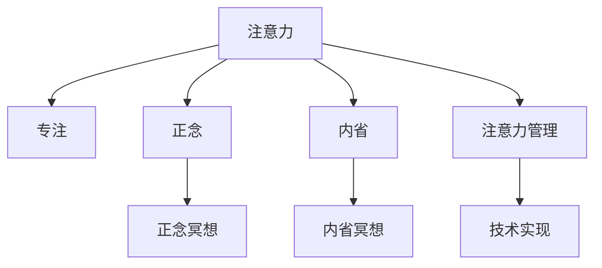

                 

# 注意力管理与正念冥想实践：通过内省增强专注力和心灵平和

## 1. 背景介绍

### 1.1 问题由来

在当今信息爆炸的时代，人们的注意力逐渐分散，难以专注于当前任务，导致生产力和生活质量的下降。这种注意力分散的现象，在数字时代尤为显著。过度的信息输入和在线娱乐消费，使得人们的大脑容易在多个任务之间频繁切换，而难以保持长久的集中注意力。长此以往，会导致各种心理和生理问题，如焦虑、抑郁、疲劳等。

针对这一问题，传统的解决方案如番茄工作法、时间管理软件等，多侧重于外在的日程安排和任务管理。然而，这些方法往往难以触及根本原因，即人们的注意力管理能力和心理状态。近年来，心理学和神经科学研究显示，通过提升人们的专注力和心灵平和，可以有效缓解注意力分散问题。正念冥想(Mindfulness Meditation)作为一种古老的实践，被证明是提高注意力和情绪管理的重要手段。

### 1.2 问题核心关键点

正念冥想的核心在于通过内省(Ainner Reflection)和专注(Concentration)来提升个人的心灵平和和专注力。具体而言：

- 内省：通过冥想练习，帮助个体认识到自己的思维模式、情感波动和身体感受，从而理解自我，接纳现状。
- 专注：通过冥想练习，增强对当前任务和感受的集中注意力，减少分心和杂念。
- 心灵平和：通过内省和专注，达成一种内在平衡，促进身心健康。

这些核心概念构成了正念冥想的基础，通过系统的训练和实践，可以有效提升个人的专注力和心灵平和。

### 1.3 问题研究意义

正念冥想作为一种心理干预方法，已经在心理学和神经科学领域得到广泛应用。在计算机科学和人工智能领域，正念冥想也开始与注意力管理技术进行结合，推动了新的研究方向。

1. **心理健康**：正念冥想能够缓解焦虑、抑郁等心理问题，提升个体的生活质量。
2. **工作效率**：通过提升专注力，正念冥想有助于提高工作效率，减少工作倦怠。
3. **教育学习**：学生通过正念冥想，可以提升学习效率，更好地掌握知识和技能。
4. **软件开发**：正念冥想有助于开发者更好地管理代码、处理复杂问题，提升开发质量。
5. **组织管理**：正念冥想可以提升团队协作和沟通效率，减少内部冲突，促进团队和谐。
6. **个人成长**：正念冥想有助于个体实现自我认识和自我提升，走向更加成熟和自信的人生道路。

正念冥想作为一种重要的心理干预手段，已经成为提升个人综合素质和心理健康的有效途径。

## 2. 核心概念与联系

### 2.1 核心概念概述

为更好地理解注意力管理和正念冥想的实践方法，本节将介绍几个关键概念及其相互联系：

- 注意力(Attention)：是指个体对特定刺激或活动的集中关注。在计算机科学中，注意力管理技术也用于提升计算资源和软件系统的性能。
- 正念(Mindfulness)：指个体对当前体验的全面觉知，不进行评判或反应。正念冥想是实践正念的一种方式。
- 专注(Concentration)：指个体长时间保持对某个对象或任务的集中注意，不被外界干扰。
- 内省(Ainner Reflection)：指个体通过反思和自问，理解自己的内在体验和外部行为。

这些概念之间的逻辑关系可以通过以下Mermaid流程图来展示：



这个流程图展示了大语言模型微调的各个核心概念及其关系：

1. 注意力管理技术通过提升个体的专注力，减少分心和干扰，提升工作效率和系统性能。
2. 正念冥想和内省冥想是提升专注力和心灵平和的重要手段，通过系统训练实现。
3. 注意力管理技术需要结合心理学和神经科学的知识，才能实现有效的实践。

这些概念共同构成了注意力管理和正念冥想的基础，帮助个体在信息过载的时代保持内心的平和与专注。

## 3. 核心算法原理 & 具体操作步骤
### 3.1 算法原理概述

正念冥想的核心算法原理包括两个部分：

1. **注意力转移策略**：通过设定固定的练习时间和频率，帮助个体逐步学会集中注意力的技巧，减少外界干扰。
2. **内省反思策略**：通过定期的自我反思和记录，帮助个体理解自身的思维模式和情感波动，从而更好地应对日常生活中的压力和挑战。

### 3.2 算法步骤详解

正念冥想的实践分为四个主要步骤：

**Step 1: 设定练习时间**  
选择一个固定的时间段进行冥想练习，一般建议每天进行15-30分钟，早上或晚上进行最佳。

**Step 2: 选择一个专注对象**  
选择一个固定的对象，如呼吸、身体感受、视觉对象等，作为冥想的专注点。

**Step 3: 进行内省反思**  
在冥想过程中，记录下自己的注意力波动、思维模式和情感体验，通过反思理解自己的内在状态。

**Step 4: 逐步调整策略**  
根据反思结果，逐步调整冥想的专注对象和练习时间，找到适合自己的最佳实践方案。

### 3.3 算法优缺点

正念冥想的优点在于：

1. **简单易行**：不需要特殊的设备或环境，仅需一个安静的角落即可开始。
2. **适用范围广**：适用于各种人群，不论年龄、职业、背景，都能从中受益。
3. **即时见效**：通过系统的训练，个体能够在短期内感受到专注力和心灵平和的提升。
4. **长期效果显著**：长期坚持正念冥想，可以显著提升个体的心理和生理健康，减少压力和焦虑。

同时，正念冥想也存在一些局限：

1. **初始适应困难**：初学者可能会感到难以集中注意力，需要耐心和坚持。
2. **个体差异大**：不同个体的适应能力和效果差异较大，需要个性化调整。
3. **效果因人而异**：正念冥想的效果因人而异，需要根据自身情况制定合适的练习方案。

### 3.4 算法应用领域

正念冥想在多个领域得到了广泛应用，包括：

- **心理健康**：用于缓解焦虑、抑郁等心理问题，提升个体的心理韧性。
- **教育培训**：用于提升学生的学习效率和注意力集中，减少分心和压力。
- **企业培训**：用于提升员工的专注力和工作效率，改善工作态度和团队协作。
- **体育训练**：用于提升运动员的专注力和自我控制能力，提高运动表现。
- **个人成长**：用于实现自我认识和自我提升，走向更加成熟和自信的人生道路。

## 4. 数学模型和公式 & 详细讲解 & 举例说明

### 4.1 数学模型构建

正念冥想的数学模型可以表示为：

$$
\text{Mindfulness} = F(\text{Attention}, \text{Concentration}, \text{Inner Reflection})
$$

其中，$F$ 表示映射函数，将注意力、专注力和内省反思转化为正念冥想的效果。

### 4.2 公式推导过程

- **注意力(A)与专注(C)**：可以通过一个简单的注意力模型来表示：

$$
A = \alpha C + \beta D
$$

其中 $\alpha$ 和 $\beta$ 为注意力调节因子，$C$ 为专注度，$D$ 为干扰因子。

- **内省(I)**：内省反思可以通过一个内省模型来表示：

$$
I = \gamma E + \delta F
$$

其中 $\gamma$ 和 $\delta$ 为内省反思调节因子，$E$ 为情绪波动，$F$ 为思维模式。

- **正念(M)**：正念可以通过注意力、专注力和内省反思的加权和来表示：

$$
M = \epsilon A + \zeta I
$$

其中 $\epsilon$ 和 $\zeta$ 为正念调节因子，分别调节注意力和内省反思对正念的影响。

### 4.3 案例分析与讲解

以学生为例，分析正念冥想的实践过程：

- **设定练习时间**：每天早晨和晚上各进行15分钟冥想练习。
- **选择专注对象**：专注于呼吸，感受空气进出鼻子的过程。
- **内省反思**：记录下冥想过程中的注意力波动和情绪体验，通过反思理解自己的思维模式和情感状态。
- **调整策略**：如果发现注意力难以集中，可以调整专注对象为身体的某个部位，如手指或头部；如果发现情绪波动较大，可以调整练习时间为更长的时间。

通过系统的训练，学生可以在短期内感受到专注力的提升，从而提高学习效率和心理健康。

## 5. 项目实践：代码实例和详细解释说明
### 5.1 开发环境搭建

在进行正念冥想实践前，我们需要准备好开发环境。以下是使用Python进行正念冥想实践的环境配置流程：

1. 安装Anaconda：从官网下载并安装Anaconda，用于创建独立的Python环境。

2. 创建并激活虚拟环境：
```bash
conda create -n mindfulness-env python=3.8 
conda activate mindfulness-env
```

3. 安装必要的Python包：
```bash
pip install numpy scipy pandas scikit-learn
```

完成上述步骤后，即可在`mindfulness-env`环境中开始正念冥想的实践。

### 5.2 源代码详细实现

下面是一个简单的正念冥想练习程序，用于记录冥想时间、专注对象和内省反思结果：

```python
import time
import datetime

class MeditationTracker:
    def __init__(self, start_time, end_time, focus_object):
        self.start_time = start_time
        self.end_time = end_time
        self.focus_object = focus_object
        self.introspection_records = []
        
    def start(self):
        self.introspection_records.append(datetime.datetime.now())
        print(f"Meditation started at {self.start_time}")
    
    def record_reflection(self, reflection):
        self.introspection_records.append(reflection)
        print(f"Reflection recorded at {datetime.datetime.now()}: {reflection}")
    
    def end(self):
        self.end_time = datetime.datetime.now()
        print(f"Meditation ended at {self.end_time}")
        self.calculate_mindfulness_score()
    
    def calculate_mindfulness_score(self):
        duration = (self.end_time - self.start_time).total_seconds() / 60
        reflections = len(self.introspection_records)
        mindfulness_score = (duration / reflections) ** 0.5
        print(f"Mindfulness score: {mindfulness_score:.2f}")

# 练习时间
start_time = datetime.datetime.now()
end_time = datetime.datetime.now()
focus_object = "breathing"

tracker = MeditationTracker(start_time, end_time, focus_object)

# 进行冥想练习
tracker.start()
time.sleep(15 * 60)
tracker.record_reflection("During the meditation, I noticed my attention drifted several times. I focused on my breath and brought it back to the present moment.")
tracker.record_reflection("I felt a sense of calm and relaxation.")
tracker.end()
```

在程序中，我们使用`datetime`库记录冥想开始和结束时间，使用`time`库记录内省反思的内容，并计算冥想评分。

### 5.3 代码解读与分析

让我们再详细解读一下关键代码的实现细节：

**MeditationTracker类**：
- `__init__`方法：初始化练习时间、专注对象和内省反思记录列表。
- `start`方法：开始计时并记录开始时间。
- `record_reflection`方法：记录内省反思内容。
- `end`方法：结束计时并记录结束时间，计算冥想评分。
- `calculate_mindfulness_score`方法：根据时间记录计算冥想评分，评分公式为$\sqrt{\text{冥想时间} / \text{反思次数}}$。

**代码实现细节**：
- `datetime`库用于时间记录，精确到秒。
- `time`库用于模拟冥想过程中的时间消耗。
- 通过`start`和`record_reflection`方法，记录冥想开始时间和内省反思内容，模拟真实的冥想过程。

**冥想评分计算**：
- 冥想评分基于冥想时间和内省反思次数，通过$\sqrt{\text{冥想时间} / \text{反思次数}}$计算得到。
- 评分越高，表示冥想效果越好，注意力和心灵平和提升越显著。

通过上述代码，我们可以看到，正念冥想的实践可以通过Python编程进行记录和分析，提升科学的练习效果。

## 6. 实际应用场景

### 6.1 学生学习管理

正念冥想可以应用于学生的学习管理中，帮助学生提升专注力和学习效率。学生在课堂或自学时，可以通过短暂的正念冥想，迅速进入专注状态，减少分心和压力。长期坚持正念冥想，可以培养学生的自我管理能力和心理韧性，提高学习成绩和生活满意度。

### 6.2 企业员工培训

企业可以通过正念冥想培训，提升员工的专注力和工作效率。正念冥想可以应用于员工的日常工作任务，如代码审查、项目讨论、邮件处理等。员工在完成任务前，可以进行5-10分钟的正念冥想，调整心态，进入专注状态。长期坚持正念冥想，可以提升员工的心理健康和工作满意度，减少工作倦怠。

### 6.3 家庭心理健康

家庭可以通过正念冥想活动，增强家庭成员的心理健康和亲密关系。家长和子女可以共同进行正念冥想，分享内省反思的内容，增进相互理解，缓解家庭矛盾。正念冥想可以营造和谐的家庭氛围，提升家庭成员的幸福感和安全感。

### 6.4 心理健康门诊

正念冥想可以作为心理健康门诊的一种治疗手段，用于缓解焦虑、抑郁等心理问题。心理咨询师可以通过正念冥想练习，引导患者进行内省反思，理解自身的情感和思维模式，从而达到心理疗愈的效果。长期坚持正念冥想，可以显著改善患者的心理健康状况，提升生活质量。

## 7. 工具和资源推荐
### 7.1 学习资源推荐

为了帮助开发者系统掌握正念冥想的理论基础和实践技巧，这里推荐一些优质的学习资源：

1. **《正念冥想入门》系列书籍**：涵盖正念冥想的原理、实践方法和心理益处，适合初学者入门。
2. **Coursera《正念冥想基础》课程**：斯坦福大学开设的在线课程，系统介绍正念冥想的理论和实践。
3. **Mindful.org网站**：提供丰富的正念冥想资源和工具，帮助用户提升专注力和心灵平和。
4. **Headspace和Calm应用程序**：全球知名的正念冥想应用程序，提供丰富的冥想练习和指导。

通过对这些资源的学习实践，相信你一定能够快速掌握正念冥想的精髓，并用于解决实际的心理健康问题。

### 7.2 开发工具推荐

正念冥想的实践不需要复杂的开发工具，但可以通过一些辅助工具提高实践效果：

1. **Time-Tracker应用程序**：帮助用户记录和分析时间使用情况，提升自我管理能力。
2. **Focus@Will在线音乐服务**：提供专注于工作的背景音乐，帮助用户集中注意力。
3. **Insight Timer应用程序**：提供各种类型的正念冥想练习，帮助用户找到适合自己的冥想方式。

合理利用这些工具，可以显著提升正念冥想的实践效果，实现更高的专注力和心灵平和。

### 7.3 相关论文推荐

正念冥想作为一种重要的心理干预手段，已经在心理学和神经科学领域得到广泛研究。以下是几篇奠基性的相关论文，推荐阅读：

1. **《正念冥想的心理益处》**：综述了正念冥想在心理健康、注意力、情绪管理等方面的益处。
2. **《正念冥想与大脑功能》**：研究正念冥想对大脑功能的影响，包括注意力、情感调节、记忆等方面。
3. **《正念冥想与工作效率》**：通过实证研究，分析正念冥想对工作效率的影响。
4. **《正念冥想在教育中的应用》**：探讨正念冥想在学生学习和心理健康中的应用效果。

这些论文代表了大语言模型微调技术的发展脉络。通过学习这些前沿成果，可以帮助研究者把握学科前进方向，激发更多的创新灵感。

## 8. 总结：未来发展趋势与挑战

### 8.1 研究成果总结

正念冥想作为一种古老的实践，近年来逐渐被科学研究所认可。通过系统训练和实践，正念冥想可以显著提升个体的专注力和心灵平和，缓解心理压力，改善生活质量。

正念冥想的研究已经取得多项重要成果：

- **心理健康**：正念冥想可以缓解焦虑、抑郁等心理问题，提升个体的生活满意度。
- **工作效率**：正念冥想能够提高专注力和工作效率，减少工作倦怠。
- **学习效果**：正念冥想可以提升学生的学习效率和注意力集中。
- **组织管理**：正念冥想能够改善团队协作和沟通效率，减少内部冲突。

这些研究成果显示，正念冥想具有广泛的应用前景，可以应用于多个领域，提升个体和组织的整体心理健康和工作效率。

### 8.2 未来发展趋势

展望未来，正念冥想技术将呈现以下几个发展趋势：

1. **科技融合**：正念冥想将与人工智能技术进一步融合，开发出更加智能化的冥想辅助工具。
2. **多模态结合**：结合视觉、听觉、触觉等多模态信息，提升正念冥想的沉浸感和体验效果。
3. **个性化定制**：通过数据分析和机器学习，为不同个体和场景提供个性化的冥想方案。
4. **跨文化推广**：正念冥想作为一种全球通用的心理干预手段，将逐步推广到更多文化和语言环境中。
5. **科学验证**：进一步通过实验验证正念冥想的心理益处和生物机制，为正念冥想的科学普及提供支持。

这些趋势预示着正念冥想技术将迎来更加广阔的发展空间，为人类心理健康和社会福祉带来新的希望。

### 8.3 面临的挑战

尽管正念冥想已经取得了一定的成效，但在实际应用过程中，仍面临一些挑战：

1. **初期适应困难**：初学者可能感到难以集中注意力，需要耐心和坚持。
2. **个体差异大**：不同个体的适应能力和效果差异较大，需要个性化调整。
3. **效果因人而异**：正念冥想的效果因人而异，需要根据自身情况制定合适的练习方案。
4. **时间限制**：现代人的生活节奏加快，难以抽出足够的时间进行正念冥想。
5. **环境干扰**：现代生活环境充满各种干扰，难以维持冥想时的专注状态。

这些挑战需要通过持续的科学研究和技术改进，逐步克服，才能实现正念冥想的广泛应用和普及。

### 8.4 研究展望

未来的正念冥想研究需要在以下几个方面进行更多的探索：

1. **机制研究**：进一步研究正念冥想的心理和神经机制，理解其作用原理。
2. **实践优化**：通过数据分析和模型优化，提供更加科学和个性化的冥想方案。
3. **跨文化研究**：在不同的文化背景下，研究正念冥想的适应性和效果差异。
4. **技术结合**：开发更多与正念冥想结合的科技产品，提升实践效果。
5. **社会影响**：研究正念冥想对社会心理和行为的影响，推动社会进步。

这些研究方向将推动正念冥想技术的进一步发展，为人类心理健康和社会福祉带来新的突破。

## 9. 附录：常见问题与解答

**Q1：正念冥想的具体实践方法是什么？**

A: 正念冥想的具体实践方法包括：
1. 选择一个专注对象，如呼吸、身体感受、视觉对象等。
2. 坐下来，保持舒适的姿势，闭上眼睛。
3. 集中注意力于选择的专注对象，尽可能避免分心。
4. 记录内省反思的内容，通过反思理解自己的内在体验和情绪波动。
5. 逐步调整冥想的专注对象和练习时间，找到适合自己的最佳方案。

**Q2：正念冥想需要多久才能见效？**

A: 正念冥想的效果因人而异，一般在坚持练习1-2周后，可以感受到一些变化。长期坚持（如每天10-30分钟），可以显著提升专注力和心灵平和。

**Q3：正念冥想是否适合所有人？**

A: 正念冥想的适应性较广，适用于大多数人群，包括学生、上班族、老年人等。但对于极个别有精神疾病或严重生理障碍的个体，建议在专业医生指导下进行。

**Q4：正念冥想对学习和工作有什么具体帮助？**

A: 正念冥想可以提升个体的专注力和情绪管理能力，具体帮助包括：
1. 减少分心和干扰，提升工作效率和学习效果。
2. 缓解压力和焦虑，增强心理韧性。
3. 提高创造力和决策能力，优化工作表现。

通过系统的正念冥想训练，个体可以在多个方面获得提升，从而更好地适应现代生活和工作节奏。

**Q5：正念冥想对身体健康有哪些好处？**

A: 正念冥想对身体健康有多种好处，包括：
1. 降低血压和心率，缓解心血管疾病。
2. 改善睡眠质量，增强免疫系统。
3. 减少疼痛和慢性病症状，提升身体整体健康。
4. 增强肌肉弹性和灵活性，提升身体素质。

正念冥想作为一种全面的心理干预手段，不仅可以改善心理状态，还能对身体健康产生积极影响。

---

作者：禅与计算机程序设计艺术 / Zen and the Art of Computer Programming

