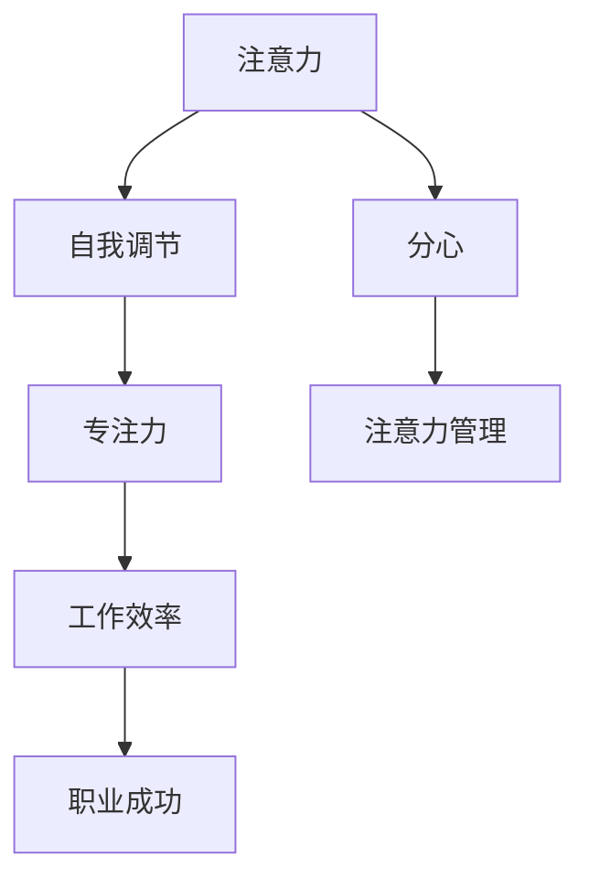
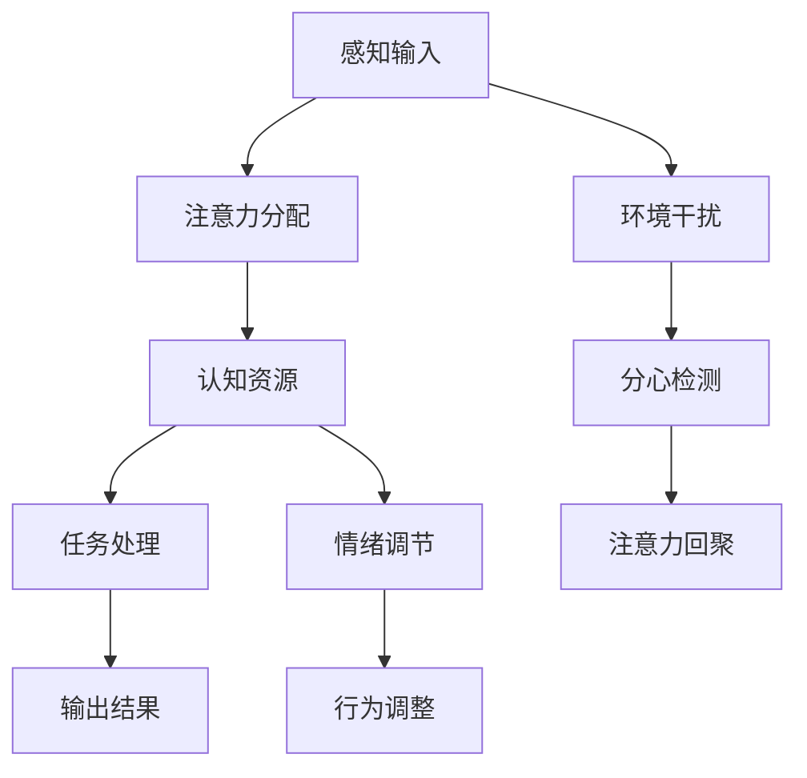

                 

# 注意力管理与自我调节：如何培养专注力以实现个人和职业成功

## 1. 背景介绍

在现代社会中，注意力成为了一种稀缺资源。特别是在信息爆炸的时代，各种信息如潮水般涌来，如何高效管理注意力，将有限的资源投入到最关键的领域，成为个人和组织取得成功的重要前提。心理学和认知科学的研究表明，注意力管理与自我调节不仅关乎工作效率，更直接影响着个体的心理和生理健康。

注意力管理与自我调节，是指个体或组织通过有意识地控制和调整自己的注意力，提高专注力和抗干扰能力，从而更有效地完成任务和达成目标。在IT行业中，注意力管理与自我调节尤为重要。软件开发、数据科学、产品设计等岗位，往往需要长时间保持高度的专注和高效的工作状态，才能产出高质量的成果。然而，面对复杂多变的任务环境，如何进行有效注意力管理，以实现个人和职业的成功，成为了摆在IT从业人员面前的重要课题。

本文将从注意力管理的核心概念、关键算法、具体实现和实际应用等多个维度，深入探讨如何通过技术手段和实践技巧，培养专注力，提升工作效率，从而实现个人和职业的双重成功。

## 2. 核心概念与联系

### 2.1 核心概念概述

为了更好地理解注意力管理与自我调节，我们需要先明确几个核心概念：

- **注意力(Attention)**：指个体在处理信息时，将认知资源集中在特定的刺激或信息上，忽略其他无关信息的心理过程。注意力管理的核心目标是通过技术手段，帮助个体控制和调节自己的注意力，使其聚焦于重要任务。

- **自我调节(Self-Regulation)**：指个体根据情境变化，灵活调整自己的认知、情感和行为，以达到最优目标的能力。自我调节与注意力管理密切相关，注意力集中度的提升，本质上是对自我调节能力的增强。

- **专注力(Concentration)**：指个体在一段时间内，保持高度注意力的心理状态。专注力与工作效率、心理健康的紧密相关，是实现个人和职业成功的关键因素。

- **分心(Distractibility)**：指个体容易受到外界干扰，难以集中注意力的倾向。分心程度的高低，直接决定了注意力的管理难度和效果。

这些概念之间的逻辑关系可以通过以下Mermaid流程图来展示：



该图展示了注意力管理与自我调节、专注力、工作效率和职业成功之间的关系：

1. 注意力管理的目的是增强个体对注意力的控制能力，减少分心。
2. 通过注意力管理，个体能够更好地调节自己的认知和情绪，增强专注力。
3. 专注力的提升，直接促进了工作效率的提高。
4. 高效的工作表现，是职业成功的基石。

### 2.2 核心概念原理和架构的 Mermaid 流程图

通过下图，进一步展示了注意力管理与自我调节的内部机制：



该图展示了注意力管理的具体流程：

1. 感知输入：个体接受外界信息刺激。
2. 注意力分配：个体根据任务需求，有选择性地分配认知资源。
3. 认知资源：认知资源被分配到关键任务上，用于理解和处理信息。
4. 任务处理：处理任务并产生输出结果。
5. 情绪调节：个体根据任务进度和难度，调整情绪状态。
6. 行为调整：个体根据情绪状态和任务需求，调整行为模式。
7. 环境干扰：外界干扰可能导致注意力分散。
8. 分心检测：个体检测到分心后，将注意力回聚到任务上。

通过这些步骤，个体能够更高效地管理注意力，提升工作效率和专注力。

## 3. 核心算法原理 & 具体操作步骤

### 3.1 算法原理概述

注意力管理与自我调节的实现，主要依赖于神经科学和认知心理学的研究成果。以下是几个核心的算法原理：

- **神经反馈(Neurofeedback)**：通过监测大脑活动，提供即时反馈，帮助个体学会更好地控制自己的注意力。常用的神经反馈技术包括EEG、fMRI等，可实时监测大脑活动，反馈给用户。

- **正念冥想(Mindfulness Meditation)**：通过冥想练习，增强个体的自我觉察能力，学会更加关注当下，减少分心和焦虑。正念冥想技术基于认知行为疗法(CBT)和正念疗法(MBT)，帮助个体在心理和生理上实现平衡。

- **认知行为疗法(Cognitive Behavioral Therapy, CBT)**：通过改变负面思维和行为模式，提升个体的自我调节能力。CBT是一种系统性的心理治疗技术，已被广泛应用于注意力管理与自我调节的训练中。

- **行为管理(Behavioral Management)**：通过设定目标、记录进度、奖励机制等方法，引导个体逐步养成良好习惯，提升注意力和自我调节能力。

这些算法原理，为实现注意力管理与自我调节提供了科学依据。

### 3.2 算法步骤详解

基于上述算法原理，注意力管理与自我调节的具体操作步骤可以分为以下几个阶段：

**第一步：自我评估**

- 记录自己在一段时间内的注意力表现和工作效率，识别出注意力分散和分心的关键时刻。
- 使用注意力评估工具，如问卷调查、注意力监测设备等，获取详细的注意力数据。
- 根据评估结果，制定个性化的注意力提升计划。

**第二步：设定目标**

- 根据自我评估结果，设定短期和长期的目标，如每天工作8小时不间断、一周内完成特定任务等。
- 目标应具有可操作性和可衡量性，方便后续的跟踪和调整。
- 使用行为管理工具，如任务列表、日历等，记录和跟踪目标进度。

**第三步：实施计划**

- 根据目标，制定详细的行动计划，包括时间分配、任务分解、环境设置等。
- 使用专注工具，如番茄工作法、时间块管理等，提高时间利用效率。
- 使用技术手段，如浏览器插件、专注应用等，帮助集中注意力。

**第四步：实时反馈**

- 使用注意力监测工具，如脑电波监测设备、专注度追踪应用等，实时获取注意力数据。
- 根据反馈数据，调整工作状态和行为模式，优化注意力管理策略。
- 使用正念冥想等技术，提升自我觉察能力和情绪调节能力。

**第五步：持续改进**

- 定期回顾和调整注意力管理计划，根据最新情况和反馈数据进行调整。
- 总结经验教训，积累注意力管理的经验，形成系统的注意力提升策略。
- 长期坚持和迭代优化，逐步培养良好的注意力习惯和自我调节能力。

通过以上步骤，个体可以系统地进行注意力管理，提升工作效率和专注力，从而实现个人和职业的成功。

### 3.3 算法优缺点

注意力管理与自我调节技术具有以下优点：

- **系统性**：通过科学的方法和工具，系统地进行注意力管理和自我调节，避免了盲目和无序的尝试。
- **可量化**：使用数据和工具进行定量分析，帮助个体客观评估注意力表现和改进效果。
- **灵活性**：可以根据个体情况和需求，灵活调整注意力管理策略，适应不同情境和任务。

然而，这些技术也存在一些缺点：

- **成本较高**：一些高级的神经反馈和脑电波监测设备成本较高，不易普及。
- **依赖设备**：注意力管理与自我调节依赖于外部设备和软件工具，设备故障或软件问题可能影响效果。
- **个体差异**：不同个体对注意力管理的响应度不同，一些方法可能对某些人无效。
- **数据隐私**：一些注意力监测设备可能涉及个人隐私，需要谨慎使用和处理数据。

尽管存在这些局限性，但注意力管理与自我调节技术在提升个体效率和健康方面的作用不容忽视，对于IT从业人员而言，更是一种必要的技能提升。

### 3.4 算法应用领域

注意力管理与自我调节技术不仅适用于个人，还广泛应用于组织和团队的注意力提升。以下是几个典型的应用领域：

- **软件开发**：开发人员需要长时间集中注意力，面对多任务和复杂问题，注意力管理尤为重要。使用代码审查工具、版本控制工具等，帮助开发人员提高代码质量和效率。

- **数据科学**：数据科学家需要处理海量数据，进行复杂的分析和建模。使用数据可视化工具、数据清洗工具等，提升数据处理和分析的效率。

- **产品设计**：产品经理需要同时管理多个项目和团队，注意力管理有助于优化时间分配和优先级设定，提升项目管理和团队协作的效率。

- **客户支持**：客户支持团队需要快速响应客户需求，保持高效的工作状态。使用知识库、工单系统等，提升响应速度和服务质量。

## 4. 数学模型和公式 & 详细讲解 & 举例说明

### 4.1 数学模型构建

注意力管理与自我调节的数学模型，主要涉及神经科学和认知心理学的理论。以下是几个关键模型：

- **注意力的数学模型**：将注意力视为一种信号，通过刺激强度和个体认知资源的交互作用，计算注意力的分布。常用的模型包括Burgess的多个层级模型、Itti和Niedenthal的多维注意模型等。

- **自我调节的数学模型**：通过建立情绪、认知和行为之间的动态关系，模拟个体在各种情境下的自我调节过程。常用的模型包括Rachman的认知评估理论、Bandura的社会学习理论等。

### 4.2 公式推导过程

以Burgess的多个层级模型为例，展示注意力管理的数学推导过程：

$$
\text{Attention} = f(\text{Stimulus}, \text{Cognitive Resources}, \text{Cognitive Load})
$$

其中，$f$表示一个非线性函数，用于计算注意力信号的强度。

- **刺激强度(Stimulus)**：代表外界信息的强度和相关性，如声音的音量、图像的对比度等。
- **认知资源(Cognitive Resources)**：表示个体当前可用的认知资源，如注意力带宽、工作记忆容量等。
- **认知负载(Cognitive Load)**：代表当前任务的复杂程度和难度，如任务的数量、时间限制等。

通过上述公式，可以计算个体在不同情境下注意力的分布，指导注意力管理的决策。

### 4.3 案例分析与讲解

以一个软件开发项目为例，展示如何通过注意力管理技术提升工作效率：

- **项目背景**：某软件公司开发一款移动应用，涉及多团队协作，项目周期紧，需求复杂。

- **问题分析**：开发团队面临以下挑战：
  - 团队成员频繁切换任务，导致代码质量和进度波动。
  - 开发者需要同时处理多个功能模块，注意力容易分散。
  - 代码审查和测试环节频繁出现错误，影响整体进度。

- **解决方案**：
  - **任务分解**：将大项目拆分为多个子任务，明确每个任务的目标和优先级。
  - **时间管理**：使用时间块管理工具，如Toggl、RescueTime等，记录和分析时间使用情况。
  - **专注工具**：使用番茄工作法、Pomodoro应用等，帮助团队成员集中注意力。
  - **团队协作**：使用协作工具，如Jira、Trello等，同步任务进度和状态，优化团队协作。
  - **定期回顾**：每周进行回顾会议，总结项目进展和问题，调整注意力管理策略。

通过以上措施，开发团队在项目中的注意力管理效果显著提升，代码质量和进度稳定，最终按时交付了高质量的应用。

## 5. 项目实践：代码实例和详细解释说明

### 5.1 开发环境搭建

要进行注意力管理与自我调节的实践，首先需要搭建开发环境。以下是Python环境搭建步骤：

1. **安装Python**：从官网下载安装Python 3.7以上版本。
2. **安装相关库**：
   - `numpy`：用于数值计算和数组操作。
   - `pandas`：用于数据处理和分析。
   - `matplotlib`：用于数据可视化。
   - `tqdm`：用于进度条显示。
3. **安装专注管理工具**：
   - `pomodoro`：番茄工作法实现。
   - `toggl`：时间管理工具。
   - `rescue-time`：专注度追踪应用。

### 5.2 源代码详细实现

以下是一个简单的Python脚本，用于实现番茄工作法：

```python
import time
import random

def work_for_n_minutes(minutes):
    print(f"Start working for {minutes} minutes")
    time.sleep(minutes * 60)

def take_a_break(minutes):
    print(f"Take a {minutes} minute break")
    time.sleep(minutes * 60)

def main():
    work_cycles = 5
    work_minutes = 25
    break_minutes = 5

    for cycle in range(work_cycles):
        work_for_n_minutes(work_minutes)
        take_a_break(break_minutes)

if __name__ == "__main__":
    main()
```

**代码解释**：
- `work_for_n_minutes`函数：模拟工作25分钟。
- `take_a_break`函数：模拟休息5分钟。
- `main`函数：执行5个工作-休息循环。

### 5.3 代码解读与分析

通过上述代码，可以看到，使用简单的计时器和函数调用，就可以实现番茄工作法的基本功能。在实际应用中，还可以引入更多的专注管理工具和功能，如计时器、进度条、任务列表等，进一步提升注意力管理的系统性和用户体验。

### 5.4 运行结果展示

运行上述代码，可以输出类似以下的结果：

```
Start working for 25 minutes
Start working for 25 minutes
Take a 5 minute break
Start working for 25 minutes
Take a 5 minute break
Start working for 25 minutes
Take a 5 minute break
Start working for 25 minutes
Take a 5 minute break
Start working for 25 minutes
Take a 5 minute break
```

这表示完成了5个番茄钟（25分钟工作+5分钟休息）的循环，达到了预定的工作周期。

## 6. 实际应用场景

### 6.1 软件开发

在软件开发中，注意力管理与自我调节尤为重要。面对复杂多变的任务环境，开发人员需要长时间保持高度的专注和高效的工作状态。使用番茄工作法、时间块管理等工具，可以帮助开发人员提升工作效率，减少分心和焦虑。

### 6.2 数据科学

数据科学家需要处理海量数据，进行复杂的分析和建模。使用数据可视化工具、数据清洗工具等，提升数据处理和分析的效率。同时，通过设定明确的目标和任务，使用专注管理工具，保持高效的工作状态。

### 6.3 产品设计

产品经理需要同时管理多个项目和团队，注意力管理有助于优化时间分配和优先级设定，提升项目管理和团队协作的效率。使用任务分解、协作工具等，可以更好地协调团队成员的工作，提升项目的整体进度和质量。

### 6.4 客户支持

客户支持团队需要快速响应客户需求，保持高效的工作状态。使用知识库、工单系统等，提升响应速度和服务质量。通过设定明确的服务目标和规范，使用专注管理工具，确保服务质量和客户满意度。

## 7. 工具和资源推荐

### 7.1 学习资源推荐

- **《注意力管理与自我调节》书籍**：系统介绍了注意力管理与自我调节的理论基础和实践方法。
- **《正念冥想指南》视频**：通过视频学习正念冥想技术，提升自我觉察和情绪调节能力。
- **《认知行为疗法》在线课程**：系统学习认知行为疗法，掌握改变负面思维和行为模式的方法。
- **《行为管理工具》网站**：提供各类专注管理和时间管理工具的介绍和使用方法。

### 7.2 开发工具推荐

- **Pomodoro Timer**：实现番茄工作法，帮助团队成员保持高效工作状态。
- **Toggl**：时间管理工具，帮助记录和分析时间使用情况。
- **RescueTime**：专注度追踪应用，实时监测工作状态和行为模式。
- **Jira**：协作工具，同步任务进度和状态，优化团队协作。
- **Trello**：任务管理工具，明确任务分解和优先级设定。

### 7.3 相关论文推荐

- **《注意力管理与自我调节》论文**：系统综述了注意力管理和自我调节的研究现状和未来方向。
- **《正念冥想对注意力影响的研究》论文**：探讨正念冥想对注意力提升和情绪调节的效果。
- **《认知行为疗法在注意力管理中的应用》论文**：介绍认知行为疗法在注意力管理中的具体应用案例。

## 8. 总结：未来发展趋势与挑战

### 8.1 研究成果总结

注意力管理与自我调节技术，通过科学的方法和工具，帮助个体和组织提升专注力和工作效率，从而实现个人和职业的成功。这些技术已经在软件开发、数据科学、产品设计、客户支持等多个领域得到应用，并取得了显著的成果。

### 8.2 未来发展趋势

未来，注意力管理与自我调节技术将继续发展，呈现以下几个趋势：

- **个性化定制**：根据个体特点和需求，提供个性化的注意力管理方案。
- **多模态融合**：结合视觉、听觉、触觉等多模态信息，增强注意力管理的丰富性和准确性。
- **实时反馈和调整**：使用AI技术实时监测注意力状态，提供即时反馈和调整建议。
- **跨领域应用**：拓展到更多领域，如医疗、教育、金融等，提升各行业的效率和效果。
- **伦理和隐私**：在应用过程中，关注注意力管理和自我调节的伦理和隐私问题，确保技术的透明性和安全性。

### 8.3 面临的挑战

尽管注意力管理与自我调节技术在提升工作效率和专注力方面发挥了重要作用，但也面临一些挑战：

- **技术普及**：一些高级的注意力管理工具成本较高，难以普及。
- **数据隐私**：注意力监测设备涉及个人隐私，需要谨慎使用和处理数据。
- **个体差异**：不同个体对注意力管理的响应度不同，一些方法可能对某些人无效。
- **依赖设备**：注意力管理与自我调节依赖于外部设备和软件工具，设备故障或软件问题可能影响效果。

### 8.4 研究展望

未来，需要在以下几个方面进行深入研究：

- **算法优化**：开发更加高效和灵活的注意力管理算法，提升系统的适应性和鲁棒性。
- **跨学科融合**：结合心理学、神经科学、计算机科学等多学科知识，提升注意力管理技术的效果。
- **社会应用**：研究如何在更广泛的社会场景中应用注意力管理技术，提升整体的社会生产效率。
- **伦理研究**：关注注意力管理技术的伦理问题，确保技术的透明性和公平性。

通过持续的研究和优化，相信注意力管理与自我调节技术将进一步提升个体的效率和健康，为IT从业人员和各行各业提供强有力的支持。

## 9. 附录：常见问题与解答

### Q1：注意力管理与自我调节是否只适用于IT从业人员？

A：注意力管理与自我调节技术适用于各种职业和人群。无论是学生、教师、医生，还是自由职业者，都可以通过这些技术提升效率和专注力。

### Q2：番茄工作法真的有效吗？

A：番茄工作法是一种经过验证的时间管理技术，通过短时工作和休息的循环，可以有效提升工作效率和专注力。但需要注意的是，不同的工作类型和个人习惯，可能对番茄工作法的响应度不同，需要灵活调整。

### Q3：注意力监测设备是否值得购买？

A：注意力监测设备如EEG、fMRI等，具有较高的成本和复杂性，适合有一定技术背景和需求的人群使用。对于普通用户，可以尝试使用免费的专注管理工具和应用，逐步培养注意力管理的习惯。

### Q4：注意力管理与自我调节是否需要长时间练习？

A：注意力管理与自我调节需要长期的实践和坚持，才能逐步提升效果。但通过系统的学习方法和技术手段，可以在较短时间内看到明显的效果，逐步养成良好的注意力管理习惯。

通过本文的系统梳理，可以看到，注意力管理与自我调节技术对于提升工作效率和专注力具有重要意义。通过科学的方法和工具，个体和组织可以实现更高效、更健康的工作状态，从而在个人和职业上取得成功。

