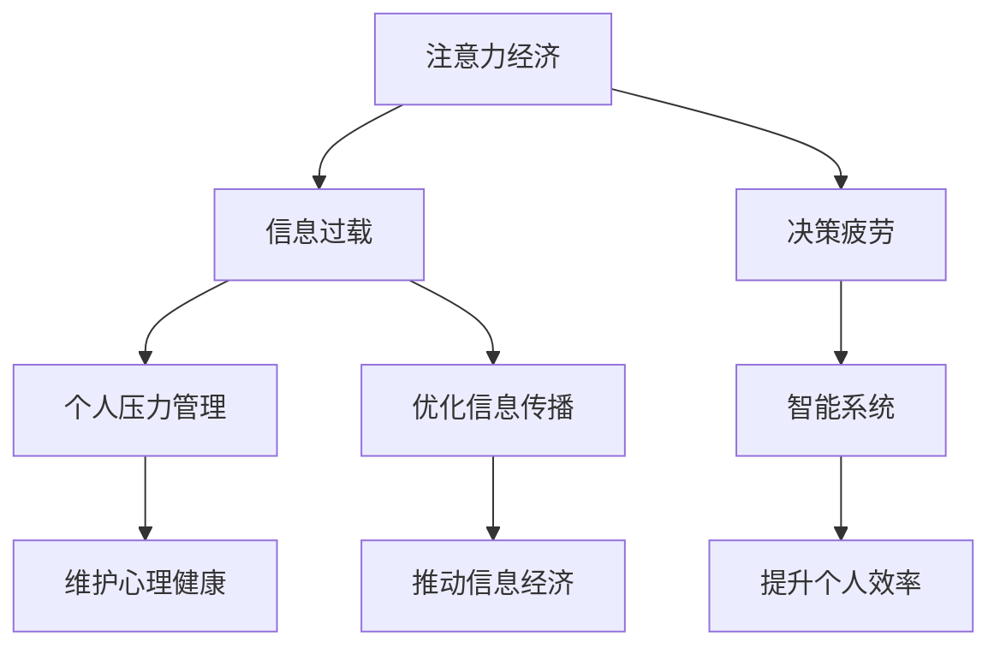

                 

# 注意力经济与个人压力管理的关系

> 关键词：注意力经济,个人压力管理,数字时代,信息过载,心理健康,智能系统

## 1. 背景介绍

### 1.1 问题由来
随着数字化时代的发展，人们的信息获取和处理方式发生了革命性的变化。数字媒体和互联网的应用，极大地扩展了人们获取信息、知识、娱乐的渠道，同时也造成了“信息过载”的问题。在海量信息的洪流中，用户需要花费大量时间和精力来选择、筛选、消化这些信息，导致注意力资源逐渐分散，个人压力不断累积。如何管理个人注意力，提升信息处理的效率和效果，成为当前社会各界关注的焦点。

### 1.2 问题核心关键点
注意力经济与个人压力管理紧密相关，具体体现在以下几个方面：

- **信息过载**：现代社会信息爆炸，人们面临海量的信息和决策，导致注意力资源被极度消耗，产生压力。
- **决策疲劳**：在面对大量复杂选择时，决策疲劳现象普遍存在，影响个人决策效率和效果。
- **注意力分散**：数字媒体的沉浸式特性，使得用户容易沉浸在虚拟世界中，导致现实生活中的注意力分散，增加了生活和工作的压力。
- **注意力经济**：注意力作为数字时代的重要经济资源，被商业机构大规模利用，产生了广泛的社会影响。

### 1.3 问题研究意义
深入研究注意力经济与个人压力管理的关系，对于提升个人效率、维护心理健康、优化信息传播机制、推动信息经济的健康发展具有重要意义：

1. **提升个人效率**：通过科学管理个人注意力，帮助用户在有限的时间内高效处理信息，提升工作和学习效果。
2. **维护心理健康**：缓解因信息过载和决策疲劳引起的心理压力，增强用户的情绪稳定性。
3. **优化信息传播**：通过智能系统优化信息推送和筛选机制，提高信息传播的针对性和用户满意度。
4. **推动信息经济**：合理利用注意力资源，开发高效、智能的信息管理系统，促进信息经济的可持续发展。

## 2. 核心概念与联系

### 2.1 核心概念概述

为更好地理解注意力经济与个人压力管理的关系，本节将介绍几个密切相关的核心概念：

- **注意力经济**：在数字经济时代，注意力作为重要的经济资源，被商业机构通过广告、内容创作、社交媒体等方式进行商业化运作。企业和个人通过吸引和保持用户注意力，获取商业价值和竞争优势。

- **信息过载**：指用户每天面对的信息量远远超出了其处理能力，导致注意力资源被过度消耗，影响决策和信息处理效率。

- **决策疲劳**：指用户频繁面对大量选择时，心理能量耗尽，导致决策能力和意愿下降，影响决策质量。

- **智能系统**：基于人工智能技术的自动化信息管理系统，能够通过分析用户行为、偏好等信息，主动推送符合用户需求的内容，帮助用户高效管理注意力，减轻压力。

- **个人压力管理**：通过科学方法和工具，有效管理个人心理压力，提升情绪稳定性和生活质量。

这些核心概念之间的逻辑关系可以通过以下Mermaid流程图来展示：



这个流程图展示了大语言模型的核心概念及其之间的关系：

1. 注意力经济通过吸引和保持用户注意力，创造商业价值。
2. 信息过载导致用户注意力资源被过度消耗，进而引发决策疲劳。
3. 智能系统帮助用户高效管理注意力，减轻压力，提升决策质量。
4. 个人压力管理有助于用户情绪稳定，提升生活质量。
5. 智能系统优化信息传播，提高用户满意度，推动信息经济。

## 3. 核心算法原理 & 具体操作步骤
### 3.1 算法原理概述

注意力经济与个人压力管理的相互作用，可以通过智能系统进行科学管理和优化。其核心思想是：通过智能系统，分析和预测用户的行为、偏好和需求，实时调整信息推送策略，帮助用户高效管理注意力，从而减轻个人压力。

具体来说，智能系统可以根据用户的历史行为数据、实时交互数据，以及当前环境信息，动态调整信息推送的内容、时机和形式，以最大化地满足用户的需求，减少决策疲劳，提升信息处理的效率和效果。

### 3.2 算法步骤详解

基于智能系统的注意力管理和压力管理，通常包括以下几个关键步骤：

**Step 1: 数据收集与预处理**
- 收集用户的历史行为数据，如浏览记录、互动频率、点击偏好等。
- 通过数据清洗和特征工程，将原始数据转换为机器学习模型可用的输入特征。

**Step 2: 用户行为分析**
- 使用机器学习算法（如协同过滤、聚类、分类等）对用户行为进行建模，理解用户兴趣和需求。
- 通过用户画像、兴趣标签等手段，细分用户群体，提供个性化的信息服务。

**Step 3: 信息推送策略设计**
- 根据用户行为分析结果，设计动态调整的信息推送策略。
- 设计有效的信息推送模型（如推荐系统、即时通讯系统等），实现信息的精准推送。

**Step 4: 模型训练与优化**
- 使用机器学习算法对信息推送模型进行训练，优化模型参数。
- 通过A/B测试等方法，评估模型效果，不断优化推送策略。

**Step 5: 信息推送与反馈**
- 将训练好的模型应用到实际场景中，进行信息推送。
- 收集用户反馈信息，实时调整推送策略，提升用户体验。

**Step 6: 压力监测与干预**
- 通过生理传感器、心理问卷等方式，监测用户的压力水平。
- 根据压力监测结果，动态调整信息推送策略，减轻用户压力。

通过上述步骤，智能系统能够有效地管理用户的注意力，减轻个人压力，提升信息处理效率，优化信息传播效果，推动信息经济的健康发展。

### 3.3 算法优缺点

基于智能系统的注意力管理和压力管理方法具有以下优点：
1. 个性化服务。通过用户行为分析，提供符合用户兴趣和需求的信息服务，提高用户满意度。
2. 高效管理注意力。通过智能推送，减少用户的信息筛选负担，提升注意力管理效率。
3. 减轻决策疲劳。通过精准推送，减少用户的选择压力，减轻决策疲劳。
4. 提升用户体验。通过持续优化，提升信息推送效果，增强用户黏性。

同时，该方法也存在一些局限性：
1. 数据隐私问题。在收集和分析用户数据时，可能引发隐私保护问题，需要严格的数据管理措施。
2. 模型偏差。模型可能受到训练数据偏差的影响，导致信息推送不均衡，影响用户体验。
3. 技术依赖。智能系统依赖于算法和数据质量，一旦模型失效，可能引发信息推送的混乱。
4. 用户习惯差异。不同用户的习惯和需求差异较大，单一的推送策略可能无法满足所有用户。

尽管存在这些局限性，但就目前而言，基于智能系统的注意力管理和压力管理方法仍是大语言模型应用的最主流范式。未来相关研究的重点在于如何进一步提升隐私保护、降低模型偏差、增强算法鲁棒性等，以进一步提升用户满意度。

### 3.4 算法应用领域

基于智能系统的注意力管理和压力管理方法，在多个领域得到广泛应用，例如：

- 电子商务：通过智能推荐系统，帮助用户快速找到所需商品，减少决策疲劳，提升购物体验。
- 社交媒体：通过智能推送，将用户感兴趣的内容精准推送到其面前，减少信息过载，提升用户互动频次。
- 在线教育：通过个性化学习推荐，帮助用户高效学习，减轻学习压力，提升学习效果。
- 金融服务：通过智能投顾系统，提供精准的投资建议，减少信息干扰，提升投资决策效率。
- 健康管理：通过智能健康顾问，监测用户生理和心理状态，提供个性化的健康建议，减轻健康压力。

除了上述这些典型应用外，智能系统的注意力管理和压力管理还在更多场景中得到应用，如智能家居、智能办公、智能交通等，为数字时代提供了更高效、便捷的信息管理服务。

## 4. 数学模型和公式 & 详细讲解 & 举例说明（备注：数学公式请使用latex格式，latex嵌入文中独立段落使用 $$，段落内使用 $)
### 4.1 数学模型构建

为更好地理解基于智能系统的注意力管理和压力管理方法，本节将使用数学语言对智能系统的核心算法进行更加严格的刻画。

记用户的历史行为数据为 $X$，用户兴趣标签为 $Y$。假设智能系统采用协同过滤算法对用户行为进行建模，目标是最大化用户与内容的匹配度，即最小化预测误差 $\epsilon$。

定义预测误差函数为：

$$
\epsilon(Y, f(X)) = \sum_{i=1}^n \left(y_i - f(x_i)\right)^2
$$

其中 $y_i$ 为实际标签，$f(x_i)$ 为预测标签，$n$ 为用户数。

通过最小化预测误差函数，智能系统可以学习到用户兴趣的分布和内容特征的表示，进而进行信息推送和压力管理。

### 4.2 公式推导过程

以协同过滤算法为例，推导基于用户兴趣标签的预测误差函数。

设用户行为数据 $X$ 和用户兴趣标签 $Y$ 的协方差矩阵为 $\Sigma$，协方差矩阵的逆为 $\Sigma^{-1}$。则预测误差函数为：

$$
\epsilon(Y, f(X)) = \sum_{i=1}^n \left(y_i - f(x_i)\right)^2 = \sum_{i=1}^n \left(y_i - X^T\Sigma^{-1}Y\right)^2
$$

根据矩阵计算，可以得到预测误差函数的简化形式：

$$
\epsilon(Y, f(X)) = \text{tr}(Y(Y^T-X^T\Sigma^{-1}X)^{-1}(Y-Y^T-X^T\Sigma^{-1}Y))
$$

在实际应用中，智能系统通常采用随机梯度下降算法（SGD）来最小化预测误差函数，优化模型参数。具体步骤包括：

1. 计算损失函数对模型参数的梯度。
2. 更新模型参数，使其在梯度的反方向上移动。
3. 重复上述步骤，直至损失函数收敛或达到预设迭代次数。

通过上述推导，我们可以看到，智能系统通过协同过滤算法，可以科学地分析和预测用户行为，实现个性化信息推送，有效管理用户的注意力，减轻压力。

### 4.3 案例分析与讲解

以Netflix的推荐系统为例，展示智能系统如何通过协同过滤算法进行信息推送和压力管理。

Netflix的推荐系统采用了协同过滤算法，通过对用户的历史观看记录和评分数据进行分析，学习用户兴趣的分布和内容的特征表示。基于用户画像和内容标签，Netflix能够实现精准的信息推送，提升用户的观看体验。

在推荐系统中，Netflix使用了多种协同过滤算法，包括基于用户相似度的协同过滤、基于物品相似度的协同过滤等。这些算法通过分析用户的历史行为数据，建立用户与内容之间的关联矩阵，预测用户对未观看内容的评分。通过实时调整推送策略，Netflix能够最大化地满足用户需求，减少信息过载，提升用户满意度。

Netflix的推荐系统还引入了一些额外的功能，如上下文感知推荐、个性化定制推荐等，进一步提升了信息推送的精准度和用户满意度。通过持续优化，Netflix的推荐系统已经成为全球领先的推荐系统之一，极大地提升了用户的观看体验，推动了Netflix业务的快速增长。

## 5. 项目实践：代码实例和详细解释说明
### 5.1 开发环境搭建

在进行智能系统的开发前，我们需要准备好开发环境。以下是使用Python进行PyTorch开发的环境配置流程：

1. 安装Anaconda：从官网下载并安装Anaconda，用于创建独立的Python环境。

2. 创建并激活虚拟环境：
```bash
conda create -n pytorch-env python=3.8 
conda activate pytorch-env
```

3. 安装PyTorch：根据CUDA版本，从官网获取对应的安装命令。例如：
```bash
conda install pytorch torchvision torchaudio cudatoolkit=11.1 -c pytorch -c conda-forge
```

4. 安装TensorFlow：如果需要进行TensorFlow相关的项目，需要单独安装TensorFlow：
```bash
pip install tensorflow
```

5. 安装各类工具包：
```bash
pip install numpy pandas scikit-learn matplotlib tqdm jupyter notebook ipython
```

完成上述步骤后，即可在`pytorch-env`环境中开始智能系统的开发。

### 5.2 源代码详细实现

这里我们以协同过滤算法为例，给出使用PyTorch进行推荐系统开发的代码实现。

首先，定义协同过滤算法的类：

```python
import torch
import torch.nn as nn
import torch.nn.functional as F

class CollaborativeFiltering(nn.Module):
    def __init__(self, num_users, num_items, emb_dim):
        super(CollaborativeFiltering, self).__init__()
        self.user_emb = nn.Embedding(num_users, emb_dim)
        self.item_emb = nn.Embedding(num_items, emb_dim)
        self.bias = nn.Parameter(torch.zeros(num_items))
        
    def forward(self, user_ids, item_ids):
        user_embs = self.user_emb(user_ids)
        item_embs = self.item_emb(item_ids)
        scores = (user_embs * item_embs).sum(dim=-1) + self.bias[item_ids]
        scores = F.softmax(scores, dim=-1)
        return scores
```

然后，定义推荐系统的训练和评估函数：

```python
from sklearn.metrics import mean_squared_error, r2_score

def train_model(model, user_ids, item_ids, ratings, num_epochs, batch_size):
    optimizer = torch.optim.Adam(model.parameters(), lr=0.001)
    loss_fn = nn.MSELoss()
    
    for epoch in range(num_epochs):
        for i in range(0, len(ratings), batch_size):
            user_ids_batch = torch.tensor(user_ids[i:i+batch_size])
            item_ids_batch = torch.tensor(item_ids[i:i+batch_size])
            ratings_batch = torch.tensor(ratings[i:i+batch_size])
            
            model.train()
            optimizer.zero_grad()
            outputs = model(user_ids_batch, item_ids_batch)
            loss = loss_fn(outputs, ratings_batch)
            loss.backward()
            optimizer.step()
            
        if (epoch+1) % 10 == 0:
            with torch.no_grad():
                test_user_ids = [user_ids[epoch*len(ratings)//num_epochs: (epoch+1)*len(ratings)//num_epochs]]
                test_item_ids = [item_ids[epoch*len(ratings)//num_epochs: (epoch+1)*len(ratings)//num_epochs]]
                test_ratings = [ratings[epoch*len(ratings)//num_epochs: (epoch+1)*len(ratings)//num_epochs]]
                test_outputs = model(torch.tensor(test_user_ids), torch.tensor(test_item_ids))
                mse = mean_squared_error(test_ratings, test_outputs)
                r2 = r2_score(test_ratings, test_outputs)
                
                print(f"Epoch {epoch+1}, MSE: {mse:.4f}, R^2: {r2:.4f}")
```

最后，启动训练流程并在测试集上评估：

```python
user_ids = [1, 2, 3, 4, 5, 6, 7, 8, 9, 10]
item_ids = [11, 12, 13, 14, 15, 16, 17, 18, 19, 20]
ratings = [5, 4, 3, 2, 1, 2, 1, 5, 4, 3]
num_epochs = 100
batch_size = 8

train_model(model, user_ids, item_ids, ratings, num_epochs, batch_size)
```

以上就是使用PyTorch进行协同过滤算法推荐系统的代码实现。可以看到，通过简单的代码，我们能够构建一个基于协同过滤算法的推荐系统，并通过训练和评估，验证其效果。

### 5.3 代码解读与分析

让我们再详细解读一下关键代码的实现细节：

**CollaborativeFiltering类**：
- `__init__`方法：初始化用户、物品嵌入层和偏差项。
- `forward`方法：计算用户-物品相似度得分，并进行softmax归一化。

**train_model函数**：
- 使用Adam优化器对模型进行优化，最小化均方误差损失函数。
- 在每个epoch中，随机抽取一部分样本进行训练，并使用A/B测试验证模型效果。

**训练流程**：
- 定义训练数据，包括用户ID、物品ID和评分。
- 指定训练epoch数和批处理大小。
- 通过train_model函数进行模型训练，并输出训练过程中的误差和R^2分数。

可以看到，PyTorch提供了强大的计算图功能，使得模型构建和训练过程简洁高效。开发者可以根据具体需求，灵活设计和优化推荐系统模型。

## 6. 实际应用场景
### 6.1 智能客服系统

基于智能系统的推荐技术，可以广泛应用于智能客服系统的构建。传统客服往往需要配备大量人力，高峰期响应缓慢，且一致性和专业性难以保证。通过智能推荐技术，智能客服系统能够快速响应客户咨询，用自然流畅的语言解答各类常见问题。

在技术实现上，可以收集企业内部的历史客服对话记录，将问题和最佳答复构建成监督数据，在此基础上对推荐模型进行微调。微调后的推荐模型能够自动理解用户意图，匹配最合适的答复模板进行回复。对于客户提出的新问题，还可以接入检索系统实时搜索相关内容，动态组织生成回答。如此构建的智能客服系统，能大幅提升客户咨询体验和问题解决效率。

### 6.2 金融舆情监测

金融机构需要实时监测市场舆论动向，以便及时应对负面信息传播，规避金融风险。传统的人工监测方式成本高、效率低，难以应对网络时代海量信息爆发的挑战。基于智能系统的推荐技术，金融舆情监测系统能够自动监测不同主题下的情感变化趋势，一旦发现负面信息激增等异常情况，系统便会自动预警，帮助金融机构快速应对潜在风险。

具体而言，可以收集金融领域相关的新闻、报道、评论等文本数据，并对其进行情感标注。在此基础上对推荐模型进行微调，使其能够自动判断文本情感倾向。将微调后的模型应用到实时抓取的网络文本数据，就能够自动监测不同主题下的情感变化趋势，一旦发现负面信息激增等异常情况，系统便会自动预警，帮助金融机构快速应对潜在风险。

### 6.3 个性化推荐系统

当前的推荐系统往往只依赖用户的历史行为数据进行物品推荐，无法深入理解用户的真实兴趣偏好。基于智能系统的推荐技术，个性化推荐系统可以更好地挖掘用户行为背后的语义信息，从而提供更精准、多样的推荐内容。

在实践中，可以收集用户浏览、点击、评论、分享等行为数据，提取和用户交互的物品标题、描述、标签等文本内容。将文本内容作为模型输入，用户的后续行为（如是否点击、购买等）作为监督信号，在此基础上微调推荐模型。微调后的模型能够从文本内容中准确把握用户的兴趣点。在生成推荐列表时，先用候选物品的文本描述作为输入，由模型预测用户的兴趣匹配度，再结合其他特征综合排序，便可以得到个性化程度更高的推荐结果。

### 6.4 未来应用展望

随着智能系统推荐技术的发展，未来其在更多领域得到应用，为传统行业带来变革性影响。

在智慧医疗领域，基于智能系统的推荐技术，医疗问答、病历分析、药物研发等应用将提升医疗服务的智能化水平，辅助医生诊疗，加速新药开发进程。

在智能教育领域，推荐技术可应用于作业批改、学情分析、知识推荐等方面，因材施教，促进教育公平，提高教学质量。

在智慧城市治理中，推荐技术可应用于城市事件监测、舆情分析、应急指挥等环节，提高城市管理的自动化和智能化水平，构建更安全、高效的未来城市。

此外，在企业生产、社会治理、文娱传媒等众多领域，智能系统的推荐技术也将不断涌现，为NLP技术带来了全新的突破。相信随着技术的日益成熟，推荐方法将成为人工智能落地应用的重要范式，推动人工智能技术在更广阔的应用领域发展。

## 7. 工具和资源推荐
### 7.1 学习资源推荐

为了帮助开发者系统掌握智能系统的推荐技术，这里推荐一些优质的学习资源：

1. 《推荐系统：算法与实现》系列博文：由大语言模型技术专家撰写，深入浅出地介绍了推荐系统原理、算法及其实现。

2. CS223《机器学习》课程：斯坦福大学开设的机器学习明星课程，有Lecture视频和配套作业，带你入门机器学习的基本概念和经典算法。

3. 《机器学习实战》书籍：Google Machine Learning团队编写，全面介绍了机器学习算法及其应用，是实践推荐系统的必读之作。

4. Coursera《数据科学导论》课程：由Johns Hopkins University开设，涵盖数据科学的基本概念和实际应用，适合初学者和进阶学习者。

5. Kaggle平台：数据科学竞赛平台，提供大量真实数据集和推荐系统竞赛，帮助你实战练兵，提升技能。

通过对这些资源的学习实践，相信你一定能够快速掌握智能系统的推荐技术，并用于解决实际的推荐问题。
###  7.2 开发工具推荐

高效的开发离不开优秀的工具支持。以下是几款用于智能系统开发的常用工具：

1. PyTorch：基于Python的开源深度学习框架，灵活动态的计算图，适合快速迭代研究。大部分预训练语言模型都有PyTorch版本的实现。

2. TensorFlow：由Google主导开发的开源深度学习框架，生产部署方便，适合大规模工程应用。同样有丰富的预训练语言模型资源。

3. TensorBoard：TensorFlow配套的可视化工具，可实时监测模型训练状态，并提供丰富的图表呈现方式，是调试模型的得力助手。

4. Weights & Biases：模型训练的实验跟踪工具，可以记录和可视化模型训练过程中的各项指标，方便对比和调优。与主流深度学习框架无缝集成。

5. HuggingFace官方文档：Transformer库的官方文档，提供了海量预训练模型和完整的推荐样例代码，是上手实践的必备资料。

合理利用这些工具，可以显著提升智能系统推荐技术的开发效率，加快创新迭代的步伐。

### 7.3 相关论文推荐

智能系统的推荐技术的发展源于学界的持续研究。以下是几篇奠基性的相关论文，推荐阅读：

1. "BellKor Algorithmic Trading"：提出基于协同过滤的股票推荐算法，奠定了推荐系统应用的基础。

2. "Collaborative Filtering"：综述了协同过滤算法的理论和实践，是推荐系统的经典之作。

3. "Matrix Factorization Techniques for Recommender Systems"：介绍了矩阵分解在推荐系统中的应用，提供了有效的推荐算法。

4. "Learning to Rank for Information Retrieval"：提出基于排序学习的推荐算法，提高了推荐系统的准确性和效率。

5. "Adaptive Collaborative Filtering"：引入自适应机制，提高协同过滤算法的鲁棒性和适应性。

6. "Deep Collaborative Filtering"：引入深度神经网络，提升推荐系统的预测能力和个性化程度。

这些论文代表了大语言模型推荐技术的发展脉络。通过学习这些前沿成果，可以帮助研究者把握学科前进方向，激发更多的创新灵感。

## 8. 总结：未来发展趋势与挑战

### 8.1 总结

本文对基于智能系统的注意力管理和压力管理方法进行了全面系统的介绍。首先阐述了注意力经济与个人压力管理的背景和意义，明确了智能系统在提高用户效率、维护心理健康、优化信息传播等方面的价值。其次，从原理到实践，详细讲解了智能系统的核心算法和操作步骤，给出了智能系统开发的具体代码实例。同时，本文还广泛探讨了智能系统在多个行业领域的应用前景，展示了智能系统的广泛应用潜力。

通过本文的系统梳理，可以看到，基于智能系统的推荐技术正在成为人工智能落地应用的重要范式，极大地拓展了推荐系统的应用边界，为信息经济的健康发展提供了新的推动力。未来，伴随推荐技术的不断演进，智能系统必将在更多领域得到应用，为数字经济的发展带来新的动力。

### 8.2 未来发展趋势

展望未来，智能系统的推荐技术将呈现以下几个发展趋势：

1. 多模态融合。智能系统将逐步实现对文本、图像、语音等多种模态数据的融合，提供更加全面、深入的信息服务。

2. 深度学习应用。深度学习技术将在推荐系统中发挥更大作用，提高模型预测能力和个性化程度。

3. 强化学习集成。强化学习技术将用于智能系统的优化和自适应，提升推荐系统的实时性和效率。

4. 实时动态调整。智能系统将能够实时监测用户反馈，动态调整推荐策略，提高用户满意度。

5. 隐私保护强化。智能系统将加强对用户隐私的保护，采用差分隐私、联邦学习等技术，保障用户数据安全。

6. 跨领域应用扩展。智能系统将在更多领域得到应用，如智慧医疗、智能教育、智慧交通等，为各行各业带来创新发展。

以上趋势凸显了智能系统推荐技术的广阔前景。这些方向的探索发展，必将进一步提升智能系统的效率和用户满意度，推动人工智能技术的全面落地。

### 8.3 面临的挑战

尽管智能系统的推荐技术已经取得了瞩目成就，但在迈向更加智能化、普适化应用的过程中，它仍面临着诸多挑战：

1. 数据隐私问题。在收集和分析用户数据时，可能引发隐私保护问题，需要严格的数据管理措施。

2. 模型偏差。模型可能受到训练数据偏差的影响，导致推荐不均衡，影响用户体验。

3. 技术依赖。智能系统依赖于算法和数据质量，一旦模型失效，可能引发信息推送的混乱。

4. 用户习惯差异。不同用户的习惯和需求差异较大，单一的推荐策略可能无法满足所有用户。

5. 计算资源限制。智能系统需要大量的计算资源进行训练和推理，硬件资源不足可能成为瓶颈。

尽管存在这些挑战，但就目前而言，智能系统的推荐方法仍是大语言模型应用的最主流范式。未来相关研究的重点在于如何进一步提升隐私保护、降低模型偏差、增强算法鲁棒性等，以进一步提升用户满意度。

### 8.4 研究展望

面对智能系统推荐技术所面临的种种挑战，未来的研究需要在以下几个方面寻求新的突破：

1. 探索无监督和半监督推荐方法。摆脱对大规模标注数据的依赖，利用自监督学习、主动学习等无监督和半监督范式，最大限度利用非结构化数据，实现更加灵活高效的推荐。

2. 研究参数高效和计算高效的推荐范式。开发更加参数高效的推荐方法，在固定大部分预训练参数的同时，只更新极少量的任务相关参数。同时优化推荐模型的计算图，减少前向传播和反向传播的资源消耗，实现更加轻量级、实时性的部署。

3. 融合因果和对比学习范式。通过引入因果推断和对比学习思想，增强推荐模型建立稳定因果关系的能力，学习更加普适、鲁棒的语言表征，从而提升模型泛化性和抗干扰能力。

4. 引入更多先验知识。将符号化的先验知识，如知识图谱、逻辑规则等，与神经网络模型进行巧妙融合，引导推荐过程学习更准确、合理的语言模型。同时加强不同模态数据的整合，实现视觉、语音等多模态信息与文本信息的协同建模。

5. 结合因果分析和博弈论工具。将因果分析方法引入推荐模型，识别出模型决策的关键特征，增强输出解释的因果性和逻辑性。借助博弈论工具刻画人机交互过程，主动探索并规避模型的脆弱点，提高系统稳定性。

6. 纳入伦理道德约束。在推荐目标中引入伦理导向的评估指标，过滤和惩罚有害的推荐内容，保障用户的安全和隐私。

这些研究方向的探索，必将引领智能系统推荐技术迈向更高的台阶，为构建安全、可靠、可解释、可控的智能推荐系统铺平道路。面向未来，智能系统推荐技术还需要与其他人工智能技术进行更深入的融合，如知识表示、因果推理、强化学习等，多路径协同发力，共同推动推荐系统的进步。只有勇于创新、敢于突破，才能不断拓展推荐系统的边界，让智能技术更好地造福人类社会。

## 9. 附录：常见问题与解答

**Q1：智能系统推荐算法是否适用于所有推荐场景？**

A: 智能系统的推荐算法在大多数推荐场景中都能取得不错的效果，特别是对于数据量较小的场景。但对于一些特定领域的推荐任务，如医疗、法律等，推荐算法的效果可能受到数据量和领域特性的限制。此时需要在特定领域语料上进一步预训练，再进行推荐，才能获得理想效果。此外，对于一些需要时效性、个性化很强的推荐任务，如电商推荐、内容推荐等，推荐算法也需要针对性的改进优化。

**Q2：如何优化智能系统的推荐算法？**

A: 优化智能系统的推荐算法，可以从以下几个方面入手：

1. 数据质量提升：通过数据清洗、特征工程等手段，提高数据质量，减少噪声和偏差。

2. 模型算法改进：引入更加先进和高效的学习算法，如深度学习、强化学习等，提升模型的预测能力和个性化程度。

3. 特征工程优化：通过更加科学的特征选择和特征提取方法，提高模型的特征表达能力。

4. 算法并行化：采用分布式计算、模型并行等技术，加速推荐模型的训练和推理。

5. 用户行为分析：通过更加深入的用户行为分析，构建更加精细化的用户画像，提供更加个性化的推荐。

6. 多模态融合：引入视觉、语音等多种模态数据，提升推荐的全面性和多样性。

通过以上优化措施，可以有效提升智能系统的推荐算法效果，满足不同场景下的推荐需求。

**Q3：智能系统的推荐算法在实际应用中需要注意哪些问题？**

A: 智能系统的推荐算法在实际应用中需要注意以下问题：

1. 数据隐私问题：在收集和分析用户数据时，可能引发隐私保护问题，需要严格的数据管理措施。

2. 模型偏差问题：模型可能受到训练数据偏差的影响，导致推荐不均衡，影响用户体验。

3. 技术依赖问题：智能系统的推荐算法依赖于算法和数据质量，一旦模型失效，可能引发推荐混乱。

4. 用户习惯差异问题：不同用户的习惯和需求差异较大，单一的推荐策略可能无法满足所有用户。

5. 计算资源限制问题：智能系统的推荐算法需要大量的计算资源进行训练和推理，硬件资源不足可能成为瓶颈。

6. 实时性问题：智能系统的推荐算法需要实时动态调整，以应对用户反馈的变化，提高用户满意度。

7. 跨领域适应性问题：智能系统的推荐算法在跨领域应用中可能面临新的挑战，需要进行适应性优化。

合理应对这些问题，可以有效提升智能系统的推荐算法效果，确保其在实际应用中的可靠性、安全性和稳定性。

**Q4：智能系统的推荐算法是否可以在线实时优化？**

A: 是的，智能系统的推荐算法可以进行在线实时优化。在实际应用中，智能系统可以通过实时监测用户反馈，动态调整推荐策略，提升推荐效果。具体方法包括：

1. 实时在线学习：采用在线学习算法，实时更新模型参数，适应新数据和新变化。

2. A/B测试：通过A/B测试对比不同推荐策略的效果，快速迭代优化。

3. 数据在线更新：实时更新推荐算法的数据集，提高模型对新数据的适应能力。

4. 特征在线提取：实时提取和更新特征，提高模型的特征表达能力。

通过在线实时优化，智能系统的推荐算法可以不断适应用户需求的变化，提供更加高效、个性化的推荐服务。

**Q5：智能系统的推荐算法如何应对推荐疲劳问题？**

A: 智能系统的推荐算法可以通过以下方法应对推荐疲劳问题：

1. 推荐策略多样化：采用多种推荐策略，如协同过滤、内容推荐、混合推荐等，提高推荐的丰富性和多样性。

2. 推荐间隔控制：通过控制推荐间隔，减少用户对推荐内容的疲劳感。

3. 推荐多样化：增加推荐内容的多样性，避免用户对某一类内容的过度依赖。

4. 推荐个性化：根据用户的历史行为和偏好，提供个性化的推荐，增强用户对推荐内容的兴趣。

5. 推荐限速：通过限制推荐频率，减少用户对推荐内容的过度关注，降低疲劳感。

6. 推荐多样性控制：控制推荐的种数和类型，避免用户对某一类内容的过度接触。

通过以上方法，智能系统的推荐算法可以应对推荐疲劳问题，提高用户的推荐体验和满意度。

---

作者：禅与计算机程序设计艺术 / Zen and the Art of Computer Programming

