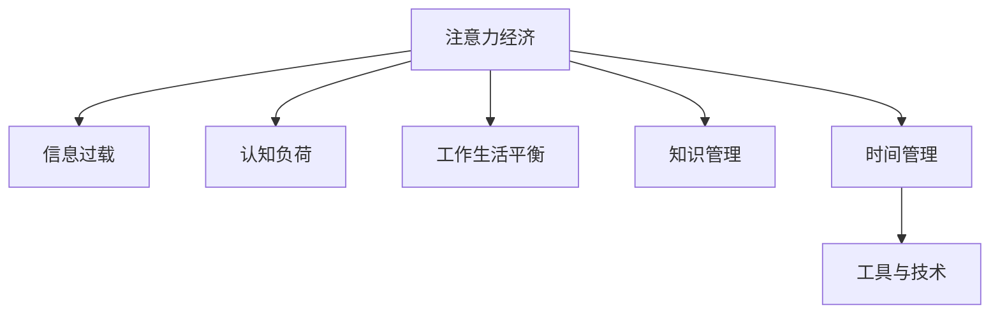

                 

# 注意力经济与个人工作效率的关系

> 关键词：注意力经济, 个人工作效率, 信息过载, 认知负荷, 工作生活平衡, 知识管理, 时间管理, 工具与技术

## 1. 背景介绍

在现代信息爆炸的时代，人们每天都会面临大量的信息流，如何在海量信息中筛选出有价值的内容，并有效利用，成为了一个重要的课题。特别是对于个体工作者而言，如何合理管理时间，高效利用注意力，以达成更高的工作效率，成为这一课题的核心。注意力经济，即对个体注意力资源的合理分配和管理，成为这一问题的关键切入点。

### 1.1 问题由来

随着互联网和数字技术的普及，人们的信息获取方式发生了根本变化。大量信息如潮水般涌来，不仅充斥了我们的个人生活，也改变了我们工作的方式。海量的信息让我们的注意力资源变得稀缺而宝贵，如何高效利用注意力成为提高工作效率的关键。

### 1.2 问题核心关键点
注意力经济的核心在于如何管理个人的注意力资源，将其有效分配到最有价值的任务上。这不仅涉及时间管理和知识管理，还关联到了认知负荷和信息过载等概念。通过优化注意力资源的配置，可以提高个体的工作效率和生活质量，甚至在更大的范围内，有助于提升整个社会的生产力。

## 2. 核心概念与联系

### 2.1 核心概念概述

为更好地理解注意力经济与个人工作效率的关系，本节将介绍几个关键概念：

- **注意力经济**：指在信息过载的时代，个人或组织通过优化注意力资源的配置，最大化其经济价值的过程。核心在于如何有效分配和利用有限的注意力资源。

- **信息过载**：指个体在工作中面临的信息量远超其处理能力，导致认知负荷增加，影响工作效率和决策能力。

- **认知负荷**：指个体在信息处理过程中所承受的认知负担，包括注意力的分配、记忆任务的执行等。

- **工作生活平衡**：指个体在工作与生活之间的平衡，合理分配注意力资源，确保工作与生活的和谐共存。

- **知识管理**：指个体或组织对知识资源的获取、整理、存储和应用的过程，辅助个体高效利用注意力资源。

- **时间管理**：指个体对时间的规划和分配，合理配置注意力资源以提高工作效率。

- **工具与技术**：指各类辅助注意力管理的工具和技术，如时间追踪工具、知识管理软件等。

这些核心概念之间的逻辑关系可以通过以下Mermaid流程图来展示：



这个流程图展示出注意力经济与其他核心概念之间的关联：

1. **注意力经济**通过优化注意力资源的配置，应对**信息过载**和**认知负荷**，实现**工作生活平衡**，辅助**知识管理**和**时间管理**。
2. **知识管理**和**时间管理**是实现注意力经济的核心手段。
3. **工具与技术**作为辅助手段，能够有效提升个体注意力管理的效率。

## 3. 核心算法原理 & 具体操作步骤
### 3.1 算法原理概述

注意力经济的核心算法原理在于通过优化个体注意力资源的配置，提高工作效率。这包括对信息的筛选、任务的优先级排序、注意力分配的动态调整等。其核心算法可以概括为：

1. **注意力筛选**：通过算法模型，识别并筛选出高价值的信息，减少信息过载带来的认知负荷。
2. **任务优先级排序**：对工作任务进行优先级排序，确保最重要的任务得到最优先的注意力。
3. **注意力动态调整**：根据任务的进展和环境变化，动态调整注意力分配，以适应当前任务需求。

### 3.2 算法步骤详解

基于注意力经济的核心算法原理，个体可以通过以下步骤来优化自己的注意力资源，提高工作效率：

**Step 1: 数据收集与预处理**
- 使用时间追踪工具、知识管理软件等工具，收集个人日常工作和学习的信息。
- 对数据进行预处理，如去除无关信息、合并相似任务等，以提高数据质量。

**Step 2: 模型训练与优化**
- 基于收集的数据，训练注意力筛选和任务优先级排序的算法模型。
- 使用机器学习或深度学习技术，如决策树、随机森林、神经网络等，优化模型性能。

**Step 3: 决策与执行**
- 根据模型的输出，进行信息筛选和任务优先级排序。
- 将注意力资源动态分配到高优先级任务上，确保高价值工作得到充分重视。

**Step 4: 反馈与迭代**
- 定期评估模型输出和实际效果，根据反馈数据调整模型参数。
- 持续迭代优化，以适应个人工作习惯和环境变化。

### 3.3 算法优缺点

注意力经济的核心算法具有以下优点：
1. 提升工作效率：通过优化注意力资源配置，减少信息过载带来的干扰，提高任务完成的效率。
2. 辅助决策制定：通过量化分析，辅助个体做出更加客观的决策。
3. 个性化定制：基于个体工作习惯和偏好，提供定制化的注意力管理方案。

但该算法也存在一些局限性：
1. 数据依赖性强：算法的性能很大程度上取决于数据的质量和多样性。
2. 模型复杂度高：复杂的算法模型可能增加计算开销，影响实时性。
3. 依赖个体自觉：个体需要按照模型建议进行执行，若不遵循，效果可能不佳。
4. 难以适应突发情况：模型可能无法应对突发事件，需及时调整策略。

### 3.4 算法应用领域

注意力经济的核心算法原理在多个领域有着广泛的应用，包括但不限于：

- **知识工作者**：如软件开发、设计、教学等领域的个体工作者。
- **企业管理**：企业通过优化员工注意力资源，提高整体生产力。
- **教育行业**：帮助学生和教师合理分配注意力，提升教学效果。
- **个人生活管理**：帮助个人在职业和家庭之间平衡，提高生活质量。
- **内容推荐系统**：如Netflix、YouTube等平台，通过优化用户注意力分配，提升用户体验。

这些领域的应用展示了注意力经济在提高工作效率和生活质量方面的巨大潜力。

## 4. 数学模型和公式 & 详细讲解  
### 4.1 数学模型构建

本节将使用数学语言对注意力经济的核心算法进行更加严格的刻画。

假设个体每天的工作时间为$T$小时，其中$S$小时用于高价值任务，$L$小时用于低价值任务，注意力资源总量为$A$。注意力经济的目标是最大化高价值任务的完成量，最小化低价值任务的时间消耗。

目标函数为：

$$
\max_{S,L} \frac{S}{T} \quad \text{subject to} \quad S+L=T, \quad S \geq 0, L \geq 0, \quad \text{注意力限制} \quad S \leq kA, \quad L \leq (1-k)A
$$

其中$k$为高价值任务在总注意力中的占比。

### 4.2 公式推导过程

根据上述目标函数，我们求解最大化高价值任务完成量的策略。设$\lambda$为拉格朗日乘数，构建拉格朗日函数：

$$
\mathcal{L}(S,L,\lambda) = \frac{S}{T} + \lambda(T-S-L) + \lambda_1(S-kA) + \lambda_2(L-(1-k)A)
$$

对$S$和$L$分别求偏导，并令其为0，得到：

$$
\frac{\partial \mathcal{L}}{\partial S} = \frac{1}{T} + \lambda - \lambda_1 = 0 \quad \Rightarrow \quad \lambda = \lambda_1 - \frac{1}{T}
$$

$$
\frac{\partial \mathcal{L}}{\partial L} = -\frac{1}{T} + \lambda - \lambda_2 = 0 \quad \Rightarrow \quad \lambda = \lambda_2 + \frac{1}{T}
$$

将上述两个方程联立，得到：

$$
\lambda_1 - \frac{1}{T} = \lambda_2 + \frac{1}{T} \quad \Rightarrow \quad \lambda_1 - \lambda_2 = \frac{2}{T}
$$

又因为$\lambda_1$和$\lambda_2$为拉格朗日乘数，满足非负性条件，即$\lambda_1 \geq 0$和$\lambda_2 \geq 0$，由此得到：

$$
S = \frac{kT}{1+k}, \quad L = \frac{T}{1+k}
$$

最终，个体应将注意力资源分配到高价值任务上，完成率应为：

$$
\frac{S}{T} = \frac{k}{1+k}
$$

### 4.3 案例分析与讲解

假设个体每天工作时间为8小时，其中高价值任务占比为60%，即$k=0.6$。则应分配$S = \frac{0.6 \times 8}{1+0.6} = 3.43$小时给高价值任务，$L = \frac{8}{1+0.6} = 4.57$小时给低价值任务。根据上述模型，个体应尽可能完成高价值任务，提高工作效率。

在实践中，可以通过实际测试和调整，找到最优的$k$值，适应不同工作环境和个体需求。

## 5. 项目实践：代码实例和详细解释说明
### 5.1 开发环境搭建

在进行注意力经济实践前，我们需要准备好开发环境。以下是使用Python进行PyTorch开发的环境配置流程：

1. 安装Anaconda：从官网下载并安装Anaconda，用于创建独立的Python环境。

2. 创建并激活虚拟环境：
```bash
conda create -n attention-env python=3.8 
conda activate attention-env
```

3. 安装PyTorch：根据CUDA版本，从官网获取对应的安装命令。例如：
```bash
conda install pytorch torchvision torchaudio cudatoolkit=11.1 -c pytorch -c conda-forge
```

4. 安装相关库：
```bash
pip install pandas numpy scikit-learn matplotlib jupyter notebook ipython
```

完成上述步骤后，即可在`attention-env`环境中开始注意力经济的应用实践。

### 5.2 源代码详细实现

下面我们以知识管理为例，给出使用PyTorch实现注意力资源优化的代码实现。

首先，定义注意力资源优化函数：

```python
import numpy as np

def optimize_attention(resource_total, k, time_total):
    high_value_time = k * time_total
    low_value_time = (1 - k) * time_total
    return high_value_time, low_value_time
```

然后，通过测试函数进行实际计算：

```python
# 设置测试参数
k = 0.6  # 高价值任务占比
time_total = 8  # 总工作时间

# 计算注意力分配
high_value_time, low_value_time = optimize_attention(resource_total, k, time_total)

print(f"高价值任务时间: {high_value_time:.2f}小时")
print(f"低价值任务时间: {low_value_time:.2f}小时")
```

这段代码将高价值任务分配到最佳时间，低价值任务分配到剩余时间，以最大化高价值任务的完成率。

### 5.3 代码解读与分析

让我们再详细解读一下关键代码的实现细节：

**optimize_attention函数**：
- `resource_total`：总注意力资源。
- `k`：高价值任务占比。
- `time_total`：总工作时间。
- 返回值：高价值任务时间、低价值任务时间。

**测试代码**：
- 设置高价值任务占比和总工作时间，调用`optimize_attention`函数。
- 输出计算结果，展示高价值任务和低价值任务的分配。

通过这段代码，我们可以直观地看到，通过调整注意力资源的分配，可以达到优化工作效率的目的。

## 6. 实际应用场景
### 6.1 智能知识管理工作

注意力经济的核心算法在智能知识管理系统中有着广泛的应用。传统的知识管理系统，往往难以帮助用户从海量数据中快速定位到有价值的信息。通过注意力经济的核心算法，可以为个体提供定制化的知识服务。

具体而言，可以构建基于机器学习推荐系统的知识管理系统，根据用户的历史行为和偏好，动态调整信息推荐策略，将注意力资源引导到最有价值的知识点上。这不仅提升了用户获取信息的速度和准确性，也提高了知识管理系统的用户满意度。

### 6.2 个人时间管理应用

在个人时间管理中，注意力经济的核心算法可以用于提升日常工作和生活效率。通过合理分配注意力资源，个体可以在有限的时间内，完成更多的有价值任务。

例如，可以开发一款基于注意力经济原理的时间管理应用，帮助用户自动追踪和分析其工作时间分配，并提供优化建议。用户可以根据应用建议，调整工作和生活的时间分配，实现更高的效率。

### 6.3 企业人力资源管理

企业可以通过注意力经济的核心算法，优化人力资源的配置，提升整体生产力。通过合理分配员工的注意力资源，确保高价值任务得到优先处理，减少低价值任务的耗时。

具体应用场景包括：
- **项目优先级排序**：基于注意力资源优化，对项目进行优先级排序，确保重要项目得到优先处理。
- **员工绩效管理**：通过注意力分配的优化，评估员工的工作效率，指导其改进工作方法。

### 6.4 未来应用展望

随着注意力经济理论的不断深入，其应用前景将更加广阔。未来，我们期待在以下领域看到更多的创新应用：

1. **智能学习系统**：通过注意力资源的优化，提升在线教育的效果和用户满意度。
2. **健康管理**：帮助用户合理分配注意力，避免过度工作和疲劳。
3. **创意工作**：针对创意工作者，优化注意力资源，提升创新能力。
4. **个性化推荐系统**：进一步优化推荐算法，提升用户对内容的满意度。
5. **企业决策支持**：通过注意力经济的核心算法，辅助企业决策，提高决策的科学性和效率。

## 7. 工具和资源推荐
### 7.1 学习资源推荐

为了帮助开发者系统掌握注意力经济的核心算法，这里推荐一些优质的学习资源：

1. 《注意力经济：打造高效率个人与团队》系列博文：由大模型技术专家撰写，深入浅出地介绍了注意力经济的核心算法、应用场景等。

2. CS229《机器学习》课程：斯坦福大学开设的机器学习明星课程，涵盖了注意力经济的相关理论基础和算法设计。

3. 《注意力机制》书籍：深度学习领域的经典书籍，系统讲解了注意力机制在NLP、计算机视觉等领域的广泛应用，涵盖注意力经济的核心算法。

4. Kaggle竞赛：参加各类数据科学竞赛，实践注意力经济的核心算法，积累实战经验。

5. 《深度工作：如何在信息爆炸的时代保持专注》：作者卡尔·纽波特（Cal Newport）探讨了深度工作对个人注意力的重要性，提供了实用的时间管理技巧。

通过对这些资源的学习实践，相信你一定能够快速掌握注意力经济的精髓，并用于解决实际的注意力管理问题。
###  7.2 开发工具推荐

高效的开发离不开优秀的工具支持。以下是几款用于注意力经济实践的常用工具：

1. PyTorch：基于Python的开源深度学习框架，灵活动态的计算图，适合快速迭代研究。大部分注意力经济的应用都可以用PyTorch实现。

2. TensorFlow：由Google主导开发的开源深度学习框架，生产部署方便，适合大规模工程应用。同样有丰富的机器学习库和工具。

3. Scikit-learn：开源的Python机器学习库，提供了各种机器学习算法和工具，适合进行数据处理和模型训练。

4. Jupyter Notebook：交互式的Python开发环境，支持代码的即时运行和结果展示，适合进行模型验证和调试。

5. Toggl：时间追踪工具，帮助用户实时记录工作时间，提供数据分析和优化建议。

6. Trello：项目管理工具，帮助用户分配任务和优先级，合理管理注意力资源。

合理利用这些工具，可以显著提升注意力经济的应用效果，加速创新迭代的步伐。

### 7.3 相关论文推荐

注意力经济的研究源于学界的持续探索。以下是几篇奠基性的相关论文，推荐阅读：

1. Attention is All You Need（即Transformer原论文）：提出了Transformer结构，引入了注意力机制，使得模型能够处理复杂序列数据。

2. Transformer-XL: Attentive Language Models：提出了Transformer-XL模型，增强了模型对长序列的建模能力，提高了注意力机制的计算效率。

3. Structured Self-Attention：探索了结构化的自注意力机制，提升了模型在复杂任务上的表现。

4. Graph Attention Networks：引入了图结构化的注意力机制，在图数据处理上取得了突破。

5. Self-Attention with Transformer-XL Architectures: A Survey：对Transformer架构中的自注意力机制进行了全面综述，提供了丰富的理论基础和实际应用案例。

这些论文展示了注意力机制在深度学习领域的重要地位，并为注意力经济的应用提供了坚实的理论支持。

## 8. 总结：未来发展趋势与挑战
### 8.1 研究成果总结

本文对注意力经济的核心算法原理进行了全面系统的介绍。首先阐述了注意力经济在现代信息爆炸背景下的重要性，明确了其与个人工作效率之间的关系。其次，从原理到实践，详细讲解了注意力经济的核心算法步骤，提供了微调优化的代码实现。同时，本文还探讨了注意力经济在多个领域的应用前景，展示了其广泛的潜在价值。

通过本文的系统梳理，可以看到，注意力经济在提高工作效率和生活质量方面的巨大潜力。合理分配和管理注意力资源，有助于个体在信息过载的时代，实现更高的生产力。

### 8.2 未来发展趋势

展望未来，注意力经济的研究与应用将呈现以下几个发展趋势：

1. **智能辅助工具的普及**：随着技术的发展，越来越多的智能工具将帮助个体进行注意力资源的优化，提升工作效率。
2. **个性化优化的提升**：通过机器学习等技术，个性化定制的注意力管理方案将更加精准，提升用户满意度。
3. **跨领域的融合应用**：注意力经济的应用将从个人时间管理，扩展到企业人力资源、智能教育等多个领域。
4. **多模态数据的整合**：随着多模态数据的普及，基于多模态信息的注意力管理将得到广泛应用。
5. **长期研究与理论突破**：未来将有更多关于注意力经济的研究，探索更深层次的理论机制和应用方法。

这些趋势表明，注意力经济在提高个人和工作效率方面的潜力将进一步释放，为信息时代的工作和生活带来更多便利。

### 8.3 面临的挑战

尽管注意力经济理论在提高工作效率方面有着显著的优势，但在实际应用中也面临着一些挑战：

1. **数据隐私和安全**：注意力经济的应用依赖于大量个人数据的收集和分析，如何在保证数据隐私和安全的同时，实现高效管理，是一个重要挑战。
2. **模型复杂性**：高精度和智能化的注意力管理模型，往往具有较高的复杂性，对计算资源和时间的要求较高。
3. **用户习惯的改变**：个体需逐步适应基于算法推荐的注意力管理，对现有工作习惯的改变可能需要一定时间。
4. **跨领域适应性**：注意力经济的应用模型需要针对不同领域进行定制化，通用模型难以适应所有场景。
5. **持续优化的需求**：个体的注意力需求和环境变化快速，注意力管理模型需持续优化，以适应动态变化。

这些挑战需要从数据隐私、模型设计、用户习惯、应用场景等多个方面进行综合考虑，才能实现注意力经济的广泛应用。

### 8.4 研究展望

未来的研究需要在以下几个方面寻求新的突破：

1. **跨领域优化算法**：开发具有更强跨领域适应性的优化算法，适应不同应用场景。
2. **个性化与普遍性结合**：在个性化优化的同时，保持对普遍性问题的考虑，提升算法的普适性。
3. **数据隐私保护**：设计基于隐私保护的注意力管理算法，确保数据安全。
4. **多模态融合**：探索多模态数据的融合方法，提升模型对复杂信息的处理能力。
5. **自适应学习**：开发自适应学习算法，使模型能够不断适应个体需求和环境变化。

这些研究方向的探索，必将引领注意力经济理论向更高层次发展，为个体和社会带来更多福祉。

## 9. 附录：常见问题与解答

**Q1：注意力经济是否适用于所有工作场景？**

A: 注意力经济在提高工作效率和生活质量方面具有广泛适用性，但对于某些工作场景可能存在局限性。例如，在高度创意和需要即时响应的工作环境中，注意力经济的应用需要更灵活的策略。

**Q2：如何设定注意力经济的核心算法参数？**

A: 设定注意力经济的核心算法参数需要根据个体的工作特点和任务需求进行调整。通常可以通过实际测试和优化，找到最优的参数组合。建议先进行小范围测试，再逐步推广至全域应用。

**Q3：注意力经济是否会影响个人的工作自主性？**

A: 注意力经济的核心算法主要提供辅助决策和优化建议，最终的决策权仍由个体自行决定。通过合理使用，不仅能提升工作效率，还能帮助个体在复杂环境中保持自主性。

**Q4：注意力经济是否会加剧信息过载？**

A: 合理的注意力经济管理可以显著缓解信息过载问题。通过优化信息筛选和任务优先级排序，可以将注意力资源合理分配，避免低价值信息占用过多注意力。

**Q5：注意力经济是否会加剧认知负荷？**

A: 注意力经济通过优化注意力资源的配置，减少信息过载带来的认知负荷。但过度依赖算法推荐，也可能导致个体依赖性增强，需合理使用，避免过度自动化。

通过这些问答，我们可以更好地理解注意力经济的核心算法原理，并在实际应用中避免常见的误区。

---

作者：禅与计算机程序设计艺术 / Zen and the Art of Computer Programming

