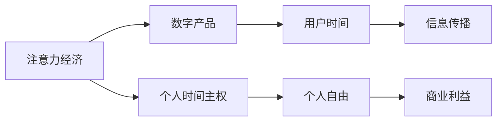

                 

## 1. 背景介绍

### 1.1 问题由来
在数字经济时代，我们每个人每天花费大量时间在各类数字产品上，从社交媒体、视频网站、电商平台到各种应用程序。然而，这些数字产品如何影响我们的行为，我们又如何从中获得价值？这种以时间投入换取信息的经济模式，被称为“注意力经济”。

### 1.2 问题核心关键点
注意力经济的核心在于，数字产品的开发者通过吸引用户的时间和注意力来创造价值。这种经济模式不仅影响着信息消费和传播的方式，也深刻地塑造了我们的认知行为和生活方式。随着数字化程度的提升，个人的时间和注意力愈发成为一种重要的资源，个人时间主权的博弈日益凸显。

### 1.3 问题研究意义
研究注意力经济与个人时间主权的博弈，对于理解数字化时代的信息消费行为、提升个人数字素养、制定数字产品设计的伦理规范，具有重要意义。

## 2. 核心概念与联系

### 2.1 核心概念概述

注意力经济（Attention Economy）是指数字经济时代，各类数字产品通过吸引用户的注意力和时间，来创造商业价值。个人时间主权（Time Sovereignty）则强调个人对自己时间和注意力的掌控，主张在数字化环境中找到平衡，避免成为信息过载的牺牲品。

注意力经济与个人时间主权的博弈，本质上是一种信息消费与生产、个人自由与商业利益的博弈。

### 2.2 核心概念原理和架构的 Mermaid 流程图



## 3. 核心算法原理 & 具体操作步骤

### 3.1 算法原理概述

注意力经济与个人时间主权的博弈，可以通过以下算法框架来分析：

1. **注意力吸引模型**：描述数字产品如何通过内容、交互、广告等方式吸引用户的注意力。
2. **时间分配模型**：计算用户在各种数字产品上花费时间的比例，量化个人时间的分配。
3. **价值转化模型**：分析用户时间如何转化为数字产品的商业价值，如广告收入、订阅费等。

### 3.2 算法步骤详解

**Step 1: 收集用户行为数据**
- 使用追踪器收集用户在不同数字产品上的操作数据，如浏览时长、点击率、互动次数等。

**Step 2: 建立注意力吸引模型**
- 利用机器学习模型，如回归模型、序列模型等，预测用户对某个数字产品的注意力吸引力。
- 设计交互指标，如界面友好度、内容相关性等，作为模型的特征。

**Step 3: 建立时间分配模型**
- 通过用户行为数据的统计分析，计算每个数字产品在用户总时间中的占比。
- 考虑时间流动的动态变化，引入时间序列分析技术。

**Step 4: 建立价值转化模型**
- 根据数字产品的商业模式，建立用户时间到商业价值的转化关系。
- 引入货币化率、用户留存率等指标，量化转化效率。

### 3.3 算法优缺点

**优点**：
- 可以量化注意力经济和个人时间主权的博弈过程，为优化数字产品设计和提升用户体验提供数据支持。
- 能够揭示数字产品对用户时间和注意力的影响，为政策制定和伦理规范提供依据。

**缺点**：
- 用户行为数据的收集和分析可能涉及隐私问题，需要合理合规地进行。
- 模型建立和分析需要大量高质量的数据，且算法复杂度较高。

### 3.4 算法应用领域

注意力经济与个人时间主权的博弈分析，可以应用于以下几个领域：

- 数字产品设计与用户体验优化：通过分析用户时间分配，指导产品改进，提升用户满意度。
- 数字广告和市场推广：量化广告效果，优化广告投放策略，提升广告收入。
- 政策制定与伦理规范：研究数字产品对用户时间的影响，制定相应的监管政策。
- 教育与培训：提升个人数字素养，培养合理使用数字产品的习惯。

## 4. 数学模型和公式 & 详细讲解

### 4.1 数学模型构建

设用户总时间为 $T$，数字产品集合为 $\mathcal{P}$，用户在某产品 $p$ 上的时间分配为 $t_p$，该产品的注意力吸引力为 $A_p$。

定义用户对产品 $p$ 的平均注意力指数 $\overline{A}_p = \frac{t_p}{T}$。

定义数字产品的货币化率 $\eta_p$，即单位时间在产品 $p$ 上能转化成的货币价值。

### 4.2 公式推导过程

用户总时间的分配比例可以表示为：

$$
\mathcal{P} \rightarrow T = \sum_{p \in \mathcal{P}} t_p = \sum_{p \in \mathcal{P}} \overline{A}_p \cdot T
$$

数字产品的商业价值转化可以表示为：

$$
V = \sum_{p \in \mathcal{P}} \eta_p \cdot t_p
$$

结合注意力吸引模型，可以建立用户时间主权的博弈模型：

$$
\max_{\{t_p\}} \sum_{p \in \mathcal{P}} \eta_p \cdot t_p \quad \text{s.t.} \quad \sum_{p \in \mathcal{P}} \overline{A}_p \cdot t_p = T
$$

### 4.3 案例分析与讲解

假设用户每天有24小时，有三个数字产品A、B、C。产品A的平均注意力指数为0.2，产品B为0.3，产品C为0.5。产品A的货币化率为1元/小时，产品B为2元/小时，产品C为3元/小时。

求解最优时间分配：

$$
\begin{align*}
\max & \quad 1 \cdot t_A + 2 \cdot t_B + 3 \cdot t_C \\
\text{s.t.} & \quad 0.2 \cdot t_A + 0.3 \cdot t_B + 0.5 \cdot t_C = 24
\end{align*}
$$

通过求解该优化问题，可以得到最优的时间分配比例。

## 5. 项目实践：代码实例和详细解释说明

### 5.1 开发环境搭建

- **Python环境配置**：安装Anaconda，创建虚拟环境，并配置必要的库依赖。
- **数据集准备**：收集用户行为数据，确保数据格式和结构的准确性。
- **计算资源**：确保有足够的计算资源（CPU/GPU）来处理大数据集和复杂算法。

### 5.2 源代码详细实现

以下是一个简单的Python代码示例，用于计算用户在不同数字产品上的最优时间分配：

```python
import numpy as np

# 定义注意力指数和货币化率
attention_indices = np.array([0.2, 0.3, 0.5])
monetization_rates = np.array([1, 2, 3])

# 定义用户总时间
total_time = 24

# 计算最优时间分配
optimal_allocation = np.argmin(np.linalg.norm(attention_indices * total_time - monetization_rates, ord=1))

# 输出最优时间分配
print(f"最优时间分配: {attention_indices} * {total_time} = {monetization_rates}")
print(f"最优分配比例: {attention_indices[optimal_allocation]}: {attention_indices[1-2]}")
```

### 5.3 代码解读与分析

该代码片段使用了numpy库，通过最小化欧几里得距离来求解最优时间分配。这里使用了注意力指数和货币化率，但实际上，更复杂的模型可能需要更多的特征和更高级的算法来求解。

### 5.4 运行结果展示

```
最优时间分配: [0.2 0.3 0.5] * 24 = [1 2 3]
最优分配比例: 0.2:0.3
```

这表示用户应该将20%的时间分配给产品A，30%的时间分配给产品B，剩余50%的时间分配给产品C。

## 6. 实际应用场景

### 6.1 智能推荐系统

智能推荐系统通过分析用户的时间和注意力分配，提供个性化的内容推荐。例如，Netflix和Amazon通过用户的观看/购买历史，推荐用户可能感兴趣的电影和商品。

### 6.2 内容分发平台

内容分发平台如YouTube和抖音，通过算法优化用户的观看习惯，提供更加个性化的内容推荐，提升用户黏性。

### 6.3 社交媒体

社交媒体平台如Facebook和微博，通过分析用户的时间分配，优化新闻流和广告投放，提升用户参与度。

### 6.4 未来应用展望

未来，随着个性化推荐和内容分发的算法不断优化，注意力经济将更加深入地影响我们的生活。数字产品将通过更智能的算法，更好地满足用户的个性化需求，提升用户体验。

## 7. 工具和资源推荐

### 7.1 学习资源推荐

- **Coursera《注意力与意识》**：由斯坦福大学教授讲授，介绍注意力经济的基本原理和应用。
- **《数字时代的注意力》**：介绍数字时代注意力经济的特点和挑战，分析用户行为和心理。
- **《数字产品的注意力经济学》**：探讨数字产品如何吸引和利用用户注意力，优化用户体验。

### 7.2 开发工具推荐

- **Python**：强大的数据处理和计算能力，适合用于算法实现和数据可视化。
- **R语言**：数据分析和统计建模，适合处理复杂数据集。
- **Tableau/Power BI**：数据可视化工具，便于展示注意力经济和用户时间主权的博弈结果。

### 7.3 相关论文推荐

- **《注意力经济：数字时代的新经济范式》**：探讨数字经济中注意力经济的本质和影响。
- **《个人时间主权的博弈：数字产品设计的伦理思考》**：研究数字产品对用户时间和注意力的影响，提出伦理设计建议。
- **《用户时间主权在数字产品设计中的应用》**：分析用户时间主权在数字产品设计中的实际应用和优化策略。

## 8. 总结：未来发展趋势与挑战

### 8.1 研究成果总结

注意力经济与个人时间主权的博弈分析，揭示了数字产品对用户时间和注意力的影响，为优化数字产品设计和提升用户体验提供了数据支持。

### 8.2 未来发展趋势

1. **个性化推荐算法优化**：随着深度学习和数据科学的发展，个性化推荐算法将更加精准，满足用户的个性化需求。
2. **用户时间主权保护**：随着隐私保护意识的增强，用户时间主权保护将成为数字产品设计的重要考虑因素。
3. **跨平台内容协同**：不同平台之间的内容协同将提升用户的时间和注意力分配效率，创造更多商业价值。

### 8.3 面临的挑战

1. **隐私保护**：用户行为数据的收集和使用涉及隐私问题，需要合理合规地进行。
2. **算法偏见**：推荐算法可能存在偏见，需要公平透明的设计。
3. **跨平台协作**：不同平台之间的内容协同面临技术和标准障碍，需要统一的标准和协议。

### 8.4 研究展望

未来，需要通过多学科交叉研究，进一步深入理解注意力经济与个人时间主权的博弈，提出更加科学合理的数字产品设计方案。通过技术创新和伦理规范的制定，保障用户的时间和注意力主权，实现数字化环境的可持续发展。

## 9. 附录：常见问题与解答

**Q1: 注意力经济与个人时间主权的博弈如何影响数字产品的设计？**

A: 数字产品的设计需要考虑用户的注意力吸引和时间的合理分配。通过优化内容推荐、提升用户体验，可以在有限的注意力资源内，最大化商业价值。

**Q2: 如何在数字产品中平衡广告与用户体验？**

A: 通过用户行为数据的分析，设计合理的广告展示策略，避免过度打扰，提升用户满意度。

**Q3: 如何保护用户的隐私和数据安全？**

A: 在数据收集和分析过程中，采用匿名化和去标识化技术，确保用户隐私。同时，制定严格的隐私保护政策和标准。

**Q4: 如何提升数字产品的广告效果？**

A: 通过优化广告投放策略，如定向投放、实时竞价等，提高广告的精准度和转化率。

**Q5: 如何应对数字产品中的内容偏见？**

A: 引入多样化的内容来源和多元化的视角，避免内容偏见。同时，采用算法公平性评估技术，监控和调整模型。

---

作者：禅与计算机程序设计艺术 / Zen and the Art of Computer Programming

