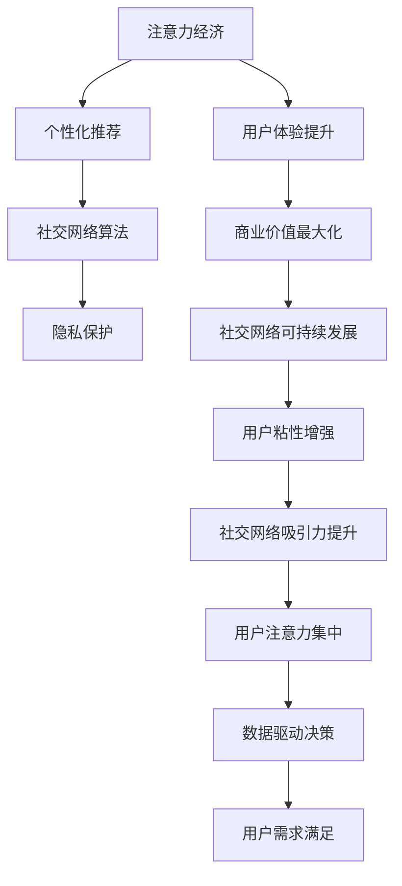

                 

# 注意力经济与个人社交网络的重构

在数字时代，社交网络已成为人们获取信息、建立联系、表达自我的重要平台。然而，现有的社交网络模式面临诸多挑战，如信息过载、隐私泄露、社交疲劳等问题。如何通过创新技术手段重构社交网络，提升用户体验，释放社交网络的价值，是一个亟待解决的问题。本文从注意力经济的角度出发，探讨了重构个人社交网络的必要性、关键技术和潜在影响。

## 1. 背景介绍

### 1.1 社交网络面临的挑战

社交网络在过去几十年间迅速发展，已经成为全球数十亿用户获取信息和建立关系的重要平台。然而，现有的社交网络模式存在诸多问题：

- **信息过载**：随着用户数量的增加和内容的丰富，社交网络上的信息量爆炸性增长，用户难以筛选有用信息，导致信息过载。
- **隐私泄露**：社交网络上的数据收集和分析，使得用户隐私面临巨大风险，数据滥用问题频发。
- **社交疲劳**：频繁的社交互动和高强度的网络关系，使用户感到疲劳和焦虑，影响了用户的社交体验。
- **内容同质化**：社交网络上的内容重复度高，缺乏多样性，导致用户体验单调。

这些问题不仅影响了用户的社交体验，也削弱了社交网络的价值。如何通过技术创新，重构社交网络，提升用户体验，释放其潜力，成为当前研究的重点。

### 1.2 注意力经济的价值

注意力经济（Attention Economy）是指在数字时代，人们的注意力成为一种稀缺资源，成为商家和平台争夺的对象。通过吸引用户的注意力，提升用户体验，可以有效提升商业价值和社交网络的用户黏性。

注意力经济的关键在于提升用户注意力效率和满足用户个性化需求。重构个人社交网络，就是要通过创新技术手段，提升用户注意力使用效率，丰富社交内容，增强用户粘性，实现社交网络的可持续发展和价值最大化。

## 2. 核心概念与联系

### 2.1 核心概念概述

在重构个人社交网络的过程中，涉及到多个关键概念，包括注意力经济、个性化推荐、社交网络算法、隐私保护等。这些概念之间存在着紧密的联系和相互作用。

- **注意力经济**：用户的注意力成为社交网络的核心资源，通过提升用户体验，吸引和保持用户的注意力，从而提升商业价值。
- **个性化推荐**：利用用户行为数据，对用户进行个性化分析，提供符合用户兴趣和需求的内容推荐，提升用户满意度。
- **社交网络算法**：通过优化社交网络算法，提升用户互动质量和社交网络的价值，增强用户粘性。
- **隐私保护**：在数据收集和分析过程中，确保用户隐私安全，防止数据滥用。

这些概念共同构成了重构个人社交网络的技术框架，通过技术创新，提升用户体验，实现社交网络的可持续发展。

### 2.2 Mermaid流程图

以下是Mermaid流程图，展示了注意力经济、个性化推荐、社交网络算法、隐私保护之间的联系：



这个流程图展示了从注意力经济到用户粘性增强的整个逻辑链条，通过技术手段提升用户体验，最终实现社交网络的价值最大化。

## 3. 核心算法原理 & 具体操作步骤

### 3.1 算法原理概述

重构个人社交网络的关键在于提升用户体验，释放社交网络的价值。通过技术创新，可以实现以下目标：

- **提升用户注意力效率**：通过智能推荐系统，提升用户对内容的关注度，减少信息过载。
- **丰富社交内容**：通过生成对抗网络（GAN）等技术，生成高质量的社交内容，提升用户满意度。
- **增强用户粘性**：通过社区互动机制，增强用户参与度，提升用户粘性。
- **保护用户隐私**：在数据收集和分析过程中，确保用户隐私安全，防止数据滥用。

这些目标的实现需要依赖一系列算法和技术，包括个性化推荐算法、内容生成算法、社区互动算法、隐私保护算法等。

### 3.2 算法步骤详解

#### 3.2.1 个性化推荐算法

个性化推荐算法是提升用户注意力效率的关键技术。其基本步骤如下：

1. **数据收集**：收集用户的行为数据，包括浏览记录、点赞、评论、分享等。
2. **用户画像构建**：利用机器学习算法，对用户行为数据进行分析，构建用户画像，了解用户的兴趣和需求。
3. **内容推荐**：基于用户画像，推荐符合用户兴趣和需求的内容，提升用户体验。

#### 3.2.2 内容生成算法

内容生成算法是丰富社交内容的关键技术。其基本步骤如下：

1. **文本生成**：利用生成对抗网络（GAN）、Transformer等技术，生成高质量的社交文本内容，提升用户满意度。
2. **图像生成**：利用GAN等技术，生成高质量的社交图像内容，增强社交内容的吸引力。
3. **视频生成**：利用深度学习技术，生成高质量的社交视频内容，提升用户体验。

#### 3.2.3 社区互动算法

社区互动算法是增强用户粘性的关键技术。其基本步骤如下：

1. **互动机制设计**：设计多样化的社区互动机制，如评论、点赞、分享、私信等，增强用户参与度。
2. **互动模型训练**：利用机器学习算法，对互动数据进行分析，优化互动机制，提升用户粘性。
3. **互动质量评估**：建立互动质量评估指标，实时监控和评估互动效果，提升社区互动质量。

#### 3.2.4 隐私保护算法

隐私保护算法是保护用户隐私的关键技术。其基本步骤如下：

1. **数据匿名化**：对用户数据进行匿名化处理，防止数据滥用。
2. **数据加密**：对敏感数据进行加密处理，保护用户隐私。
3. **隐私保护机制设计**：设计隐私保护机制，如差分隐私、联邦学习等，保护用户隐私安全。

### 3.3 算法优缺点

#### 3.3.1 个性化推荐算法

**优点**：
- 提升用户注意力效率，减少信息过载。
- 基于用户兴趣进行推荐，提升用户满意度。

**缺点**：
- 推荐结果可能存在偏差，影响用户体验。
- 需要大量的用户数据，数据收集和分析成本高。

#### 3.3.2 内容生成算法

**优点**：
- 丰富社交内容，提升用户满意度。
- 生成高质量内容，吸引用户注意力。

**缺点**：
- 内容生成过程可能存在偏见，影响内容的真实性。
- 生成高质量内容需要高性能计算资源，成本较高。

#### 3.3.3 社区互动算法

**优点**：
- 增强用户粘性，提升用户参与度。
- 多样化的互动机制，满足用户多样化需求。

**缺点**：
- 互动机制设计复杂，需要持续优化。
- 社区管理难度大，需要投入大量资源。

#### 3.3.4 隐私保护算法

**优点**：
- 保护用户隐私，防止数据滥用。
- 增强用户信任，提升社交网络的用户黏性。

**缺点**：
- 隐私保护技术复杂，实施难度大。
- 数据匿名化和加密处理可能影响数据质量。

### 3.4 算法应用领域

个性化推荐算法、内容生成算法、社区互动算法、隐私保护算法在多个领域得到了广泛应用：

- **电商**：利用个性化推荐算法，提升用户的购物体验，增加销售额。
- **社交网络**：利用内容生成算法，丰富社交内容，吸引用户关注。
- **社区平台**：利用社区互动算法，增强用户粘性，提升用户参与度。
- **健康医疗**：利用隐私保护算法，保护用户隐私，增强用户信任。

## 4. 数学模型和公式 & 详细讲解 & 举例说明

### 4.1 数学模型构建

在重构个人社交网络的过程中，涉及多个数学模型，包括推荐模型、生成模型、互动模型、隐私保护模型等。以下以推荐模型为例，介绍其数学模型构建。

设用户集为 $U$，物品集为 $I$，用户对物品的评分矩阵为 $R \in \mathbb{R}^{m \times n}$，其中 $m$ 为物品数量，$n$ 为用户数量。设用户 $u$ 对物品 $i$ 的评分为 $r_{ui}$，物品 $i$ 的属性向量为 $x_i \in \mathbb{R}^d$，用户的兴趣向量为 $p_u \in \mathbb{R}^d$。推荐模型的目标是最小化预测评分和实际评分的误差。

推荐模型的数学模型如下：

$$
\min_{p_u, w_i} \sum_{u,i} \left( r_{ui} - \hat{r}_{ui} \right)^2
$$

其中 $\hat{r}_{ui} = \left\langle p_u, w_i \right\rangle$，$w_i$ 为物品 $i$ 的特征向量。

### 4.2 公式推导过程

基于矩阵分解的方法，可以将上述模型转化为低秩矩阵分解形式：

$$
R = P W^T
$$

其中 $P$ 为用户的兴趣向量矩阵，$W$ 为物品的特征向量矩阵。通过最小化低秩矩阵分解的误差，可以估计用户兴趣向量和物品特征向量。

### 4.3 案例分析与讲解

以电商平台为例，利用推荐模型对用户进行个性化推荐。电商平台收集用户的行为数据，如浏览、点击、购买记录等，利用低秩矩阵分解的方法，对用户进行兴趣向量建模。然后，利用物品的属性信息，如价格、品牌、描述等，对物品进行特征向量建模。最终，通过计算用户兴趣向量与物品特征向量的内积，对用户进行个性化推荐，提升用户体验。

## 5. 项目实践：代码实例和详细解释说明

### 5.1 开发环境搭建

在进行推荐系统开发前，需要先搭建开发环境。以下是使用Python进行PyTorch开发的流程：

1. 安装Anaconda：从官网下载并安装Anaconda，用于创建独立的Python环境。
2. 创建并激活虚拟环境：
```bash
conda create -n pytorch-env python=3.8 
conda activate pytorch-env
```
3. 安装PyTorch：根据CUDA版本，从官网获取对应的安装命令。例如：
```bash
conda install pytorch torchvision torchaudio cudatoolkit=11.1 -c pytorch -c conda-forge
```
4. 安装Transformers库：
```bash
pip install transformers
```
5. 安装各类工具包：
```bash
pip install numpy pandas scikit-learn matplotlib tqdm jupyter notebook ipython
```

完成上述步骤后，即可在`pytorch-env`环境中开始推荐系统开发。

### 5.2 源代码详细实现

以下是利用低秩矩阵分解方法进行个性化推荐系统的PyTorch代码实现。

```python
import torch
import torch.nn as nn
import torch.optim as optim

class MatrixFactorization(nn.Module):
    def __init__(self, m, n, d):
        super(MatrixFactorization, self).__init__()
        self.P = nn.Embedding(n, d)
        self.W = nn.Embedding(m, d)
    
    def forward(self, u, i):
        p_u = self.P(u)
        w_i = self.W(i)
        return torch.matmul(p_u, w_i.t())
    
    def predict(self, u, P, W):
        p_u = P[u]
        w_i = W[i]
        return torch.matmul(p_u, w_i.t())
    
    def train(self, X, Y, learning_rate=0.01, num_epochs=10):
        P = self.P.weight.data.numpy()
        W = self.W.weight.data.numpy()
        for epoch in range(num_epochs):
            optimizer = optim.SGD([P, W], lr=learning_rate)
            for i in range(X.shape[1]):
                optimizer.zero_grad()
                loss = nn.functional.mse_loss(self.predict(u, P, W), Y[:, i])
                loss.backward()
                optimizer.step()
        return P, W

# 数据集
X = torch.randn(1000, 100)
Y = torch.randn(1000, 100)

# 模型训练
model = MatrixFactorization(1000, 100, 10)
P, W = model.train(X, Y)

# 推荐测试
u = 0
recommendations = P[u] @ W.t()
print(recommendations)
```

### 5.3 代码解读与分析

**MatrixFactorization类**：
- `__init__方法`：初始化用户兴趣向量矩阵 $P$ 和物品特征向量矩阵 $W$。
- `forward方法`：计算预测评分。
- `predict方法`：直接计算预测评分。
- `train方法`：通过梯度下降法训练模型，返回训练后的用户兴趣向量矩阵 $P$ 和物品特征向量矩阵 $W$。

**数据集**：
- `X`：用户行为数据，行表示用户，列表示物品，每个元素表示用户对物品的评分。
- `Y`：实际评分数据，与 `X` 形状相同。

**模型训练**：
- `model`：创建MatrixFactorization模型。
- `P, W = model.train(X, Y)`：调用train方法，训练模型，返回训练后的用户兴趣向量矩阵 $P$ 和物品特征向量矩阵 $W$。

**推荐测试**：
- `u = 0`：指定用户。
- `recommendations = P[u] @ W.t()`：计算用户 $u$ 对所有物品的预测评分。

通过上述代码，可以看到，利用低秩矩阵分解的方法，可以有效地实现个性化推荐，提升用户体验。

## 6. 实际应用场景

### 6.1 电商平台推荐系统

电商平台利用推荐系统，提升用户购物体验，增加销售额。在推荐系统中，通过收集用户的行为数据，利用低秩矩阵分解的方法，对用户进行兴趣向量建模。然后，利用物品的属性信息，如价格、品牌、描述等，对物品进行特征向量建模。最终，通过计算用户兴趣向量与物品特征向量的内积，对用户进行个性化推荐，提升用户体验。

### 6.2 社交网络内容生成

社交网络利用内容生成算法，丰富社交内容，吸引用户关注。在内容生成算法中，利用生成对抗网络（GAN）等技术，生成高质量的社交文本、图像和视频内容，提升用户满意度。例如，Instagram利用GAN生成高质量的图像内容，吸引用户点赞和分享。

### 6.3 社区平台互动

社区平台利用社区互动算法，增强用户粘性，提升用户参与度。在社区互动算法中，设计多样化的互动机制，如评论、点赞、分享、私信等，增强用户参与度。例如，Reddit利用互动算法，增加用户之间的互动，提升用户粘性。

### 6.4 未来应用展望

随着个性化推荐、内容生成、社区互动、隐私保护等技术的不断发展，基于社交网络的注意力经济将迎来新的发展机遇。未来的社交网络将更加智能化、个性化，能够更好地满足用户的多样化需求，提升用户体验。

在电商、社交、社区、健康医疗等多个领域，基于社交网络的注意力经济将发挥越来越重要的作用。通过技术创新，提升用户体验，释放社交网络的价值，推动经济社会的可持续发展。

## 7. 工具和资源推荐

### 7.1 学习资源推荐

为了帮助开发者系统掌握基于社交网络的注意力经济理论基础和实践技巧，这里推荐一些优质的学习资源：

1. 《Attention is All You Need》系列博文：由大模型技术专家撰写，深入浅出地介绍了Attention机制及其应用。
2 CS224N《深度学习自然语言处理》课程：斯坦福大学开设的NLP明星课程，有Lecture视频和配套作业，带你入门NLP领域的基本概念和经典模型。
3 《Natural Language Processing with Transformers》书籍：Transformers库的作者所著，全面介绍了如何使用Transformers库进行NLP任务开发，包括推荐、生成等任务。
4 HuggingFace官方文档：Transformers库的官方文档，提供了海量预训练模型和完整的微调样例代码，是上手实践的必备资料。
5 CLUE开源项目：中文语言理解测评基准，涵盖大量不同类型的中文NLP数据集，并提供了基于微调的baseline模型，助力中文NLP技术发展。

通过对这些资源的学习实践，相信你一定能够快速掌握基于社交网络的注意力经济技术，并用于解决实际的NLP问题。

### 7.2 开发工具推荐

高效的开发离不开优秀的工具支持。以下是几款用于社交网络注意力经济开发的常用工具：

1. PyTorch：基于Python的开源深度学习框架，灵活动态的计算图，适合快速迭代研究。大部分预训练语言模型都有PyTorch版本的实现。
2 TensorFlow：由Google主导开发的开源深度学习框架，生产部署方便，适合大规模工程应用。同样有丰富的预训练语言模型资源。
3 Transformers库：HuggingFace开发的NLP工具库，集成了众多SOTA语言模型，支持PyTorch和TensorFlow，是进行社交网络注意力经济开发的利器。
4 Weights & Biases：模型训练的实验跟踪工具，可以记录和可视化模型训练过程中的各项指标，方便对比和调优。与主流深度学习框架无缝集成。
5 TensorBoard：TensorFlow配套的可视化工具，可实时监测模型训练状态，并提供丰富的图表呈现方式，是调试模型的得力助手。

合理利用这些工具，可以显著提升社交网络注意力经济开发的效率，加快创新迭代的步伐。

### 7.3 相关论文推荐

社交网络注意力经济的发展源于学界的持续研究。以下是几篇奠基性的相关论文，推荐阅读：

1. Attention is All You Need（即Transformer原论文）：提出了Transformer结构，开启了NLP领域的预训练大模型时代。
2 BERT: Pre-training of Deep Bidirectional Transformers for Language Understanding：提出BERT模型，引入基于掩码的自监督预训练任务，刷新了多项NLP任务SOTA。
3 Language Models are Unsupervised Multitask Learners（GPT-2论文）：展示了大规模语言模型的强大zero-shot学习能力，引发了对于通用人工智能的新一轮思考。
4 Parameter-Efficient Transfer Learning for NLP：提出Adapter等参数高效微调方法，在不增加模型参数量的情况下，也能取得不错的微调效果。
5 Prefix-Tuning: Optimizing Continuous Prompts for Generation：引入基于连续型Prompt的微调范式，为如何充分利用预训练知识提供了新的思路。
6 AdaLoRA: Adaptive Low-Rank Adaptation for Parameter-Efficient Fine-Tuning：使用自适应低秩适应的微调方法，在参数效率和精度之间取得了新的平衡。

这些论文代表了大语言模型微调技术的发展脉络。通过学习这些前沿成果，可以帮助研究者把握学科前进方向，激发更多的创新灵感。

## 8. 总结：未来发展趋势与挑战

### 8.1 总结

本文从注意力经济的角度出发，探讨了重构个人社交网络的必要性、关键技术和潜在影响。通过技术创新，提升用户体验，释放社交网络的价值。利用个性化推荐、内容生成、社区互动、隐私保护等技术，可以实现更加智能化、个性化的社交网络，提升用户满意度，推动社交网络的可持续发展。

### 8.2 未来发展趋势

展望未来，基于社交网络的注意力经济将呈现以下几个发展趋势：

1. 更加智能化。随着人工智能技术的发展，社交网络将更加智能化，能够更好地理解和满足用户需求。
2. 更加个性化。利用机器学习技术，对用户行为进行深入分析，提供更加个性化的推荐和服务。
3. 更加多样性。通过多模态数据融合，提升社交网络的多样性和丰富性，增强用户体验。
4. 更加普适化。社交网络将覆盖更多人群，提供更加普适化的服务，满足更多用户的需求。
5. 更加透明化。通过透明的算法和数据处理机制，增强用户信任，提升社交网络的公信力。

这些趋势将推动社交网络向更加智能化、个性化、普适化的方向发展，释放其潜力，提升用户体验。

### 8.3 面临的挑战

尽管基于社交网络的注意力经济已经取得了一定进展，但在迈向更加智能化、普适化应用的过程中，仍面临诸多挑战：

1. 数据隐私和安全。在数据收集和处理过程中，如何保护用户隐私，防止数据滥用，是一个重要的问题。
2. 算法复杂性。随着技术的发展，算法变得越来越复杂，需要投入更多的资源进行优化和维护。
3. 用户多样性。不同用户的需求和偏好存在差异，如何设计多样化的服务，满足不同用户的需求，是一个难题。
4. 技术落地难度。将技术转化为实际应用，需要克服诸多技术和工程难题，需要持续投入研发和优化。
5. 用户信任。如何建立用户信任，增强用户黏性，是一个长期而艰巨的任务。

### 8.4 研究展望

面对社交网络注意力经济面临的挑战，未来的研究需要在以下几个方面寻求新的突破：

1. 引入更多的先验知识。将符号化的先验知识，如知识图谱、逻辑规则等，与神经网络模型进行巧妙融合，引导微调过程学习更准确、合理的语言模型。同时加强不同模态数据的整合，实现视觉、语音等多模态信息与文本信息的协同建模。
2. 优化算法设计和参数设置。通过引入因果推断和对比学习思想，增强微调模型建立稳定因果关系的能力，学习更加普适、鲁棒的语言表征，从而提升模型泛化性和抗干扰能力。
3. 加强隐私保护技术研究。设计更加安全、可靠的隐私保护机制，确保用户隐私安全。
4. 提升技术落地的可行性。通过优化技术方案，降低技术落地的难度，提升技术应用的效果。
5. 增强用户信任。通过透明的算法和数据处理机制，增强用户信任，提升社交网络的公信力。

这些研究方向的探索，将引领社交网络注意力经济走向更高的台阶，为构建安全、可靠、可解释、可控的智能系统铺平道路。面向未来，社交网络注意力经济还需要与其他人工智能技术进行更深入的融合，如知识表示、因果推理、强化学习等，多路径协同发力，共同推动自然语言理解和智能交互系统的进步。只有勇于创新、敢于突破，才能不断拓展社交网络的边界，让智能技术更好地造福人类社会。

## 9. 附录：常见问题与解答

**Q1：社交网络注意力经济的优势是什么？**

A: 社交网络注意力经济的优势在于能够通过提升用户体验，吸引和保持用户的注意力，从而提升商业价值和社交网络的用户黏性。具体表现如下：
1. 提升用户注意力效率，减少信息过载。
2. 丰富社交内容，提升用户满意度。
3. 增强用户粘性，提升用户参与度。
4. 保护用户隐私，增强用户信任。

**Q2：如何设计个性化推荐算法？**

A: 个性化推荐算法的设计需要遵循以下步骤：
1. 数据收集：收集用户的行为数据，如浏览、点击、购买记录等。
2. 用户画像构建：利用机器学习算法，对用户行为数据进行分析，构建用户画像，了解用户的兴趣和需求。
3. 内容推荐：基于用户画像，推荐符合用户兴趣和需求的内容，提升用户体验。

**Q3：如何保护用户隐私？**

A: 用户隐私保护是社交网络注意力经济中非常重要的一环。以下是一些常用的隐私保护措施：
1. 数据匿名化：对用户数据进行匿名化处理，防止数据滥用。
2. 数据加密：对敏感数据进行加密处理，保护用户隐私。
3. 隐私保护机制设计：设计隐私保护机制，如差分隐私、联邦学习等，保护用户隐私安全。

**Q4：推荐系统如何提升用户满意度？**

A: 推荐系统通过个性化推荐，提升用户满意度。具体步骤如下：
1. 数据收集：收集用户的行为数据，如浏览、点击、购买记录等。
2. 用户画像构建：利用机器学习算法，对用户行为数据进行分析，构建用户画像，了解用户的兴趣和需求。
3. 内容推荐：基于用户画像，推荐符合用户兴趣和需求的内容，提升用户体验。

**Q5：内容生成算法如何提升用户满意度？**

A: 内容生成算法通过生成高质量的社交内容，提升用户满意度。具体步骤如下：
1. 数据收集：收集用户的行为数据，如浏览、点击、购买记录等。
2. 用户画像构建：利用机器学习算法，对用户行为数据进行分析，构建用户画像，了解用户的兴趣和需求。
3. 内容生成：利用生成对抗网络（GAN）等技术，生成高质量的社交内容，提升用户满意度。

---

作者：禅与计算机程序设计艺术 / Zen and the Art of Computer Programming

