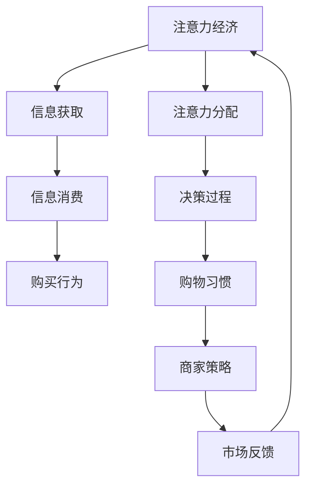

                 

# 注意力经济与个人购物习惯的变化

## 1. 背景介绍

在数字经济的浪潮中，消费者行为的变迁牵动着电子商务领域的每个角落。随着智能手机的普及和互联网技术的日新月异，人们的购物习惯已经发生了深刻的改变。这一变化，不仅重新塑造了零售商的营销策略，也为线上零售商带来了前所未有的挑战。在此背景下，注意力经济（Attention Economy）的概念应运而生，即人们如何分配和管理自己的注意力资源，成为了新经济时代最重要的资本之一。本文章将围绕这一话题，探讨注意力经济对个人购物习惯的深刻影响，并结合数据分析与机器学习技术，提供一些应对策略。

## 2. 核心概念与联系

### 2.1 核心概念概述

**注意力经济**：在信息爆炸的时代，人们的时间和注意力变得极度稀缺，信息的获取和消费行为变得更为重要。注意力经济强调在纷繁复杂的信息中，如何有效捕捉并引导消费者的注意力，从而实现商业价值的最大化。

**个人购物习惯**：指消费者在购物过程中，偏好、决策方式、消费行为等方面的特点和规律。随着电子商务的兴起，个人购物习惯日益受到品牌和商家的关注，成为营销决策的重要依据。

### 2.2 核心概念原理和架构的 Mermaid 流程图



这个流程图展示了注意力经济与个人购物习惯之间的联系：信息的获取和消费引导注意力分配，从而影响消费者的决策过程和购买行为，形成独特的购物习惯。商家根据这些习惯调整策略，获得市场反馈，形成循环。

## 3. 核心算法原理 & 具体操作步骤

### 3.1 算法原理概述

在注意力经济中，商家通过数据分析和机器学习模型，来预测消费者行为，并设计针对性的营销策略。其中，注意力和购买决策之间的关系，可以通过各种行为数据和机器学习算法进行建模。

算法原理主要包括以下几个步骤：

1. **数据收集**：通过电商平台的用户行为数据，如浏览记录、购买历史、评分评价等，收集消费者对商品或服务的注意力和消费行为数据。
2. **特征提取**：利用文本分析、时间序列分析等技术，从原始数据中提取有意义的特征，用于训练机器学习模型。
3. **模型训练**：使用机器学习算法（如逻辑回归、随机森林、深度学习等）对特征进行训练，建立消费者注意力与购物行为之间的关系模型。
4. **预测与干预**：根据训练好的模型，预测消费者可能感兴趣的商品，并进行个性化的推荐和营销干预，提高转化率。

### 3.2 算法步骤详解

#### 3.2.1 数据预处理

- **数据清洗**：去除缺失值、异常值和重复数据，保证数据质量。
- **特征工程**：根据目标变量（如购买行为），选择和构造有意义的特征。
- **归一化与编码**：将特征进行归一化处理，并对分类特征进行独热编码。

#### 3.2.2 模型选择与训练

- **模型选择**：选择合适的机器学习模型，如逻辑回归、随机森林、深度学习等。
- **模型训练**：使用训练集数据训练模型，并通过交叉验证调整超参数。
- **模型评估**：使用测试集数据评估模型性能，选择最合适的模型。

#### 3.2.3 预测与干预

- **预测**：对新用户进行预测，找出可能感兴趣的商品或服务。
- **个性化推荐**：根据预测结果，进行个性化的商品推荐和营销干预。
- **效果评估**：通过实验和数据分析，评估个性化推荐的效果，并不断优化推荐策略。

### 3.3 算法优缺点

#### 3.3.1 优点

- **准确性**：基于大量数据训练的模型，能够准确预测消费者的购物行为。
- **个性化**：通过个性化推荐，提高用户体验和满意度，促进消费转化。
- **实时性**：机器学习模型可以快速处理和分析数据，实时响应市场变化。

#### 3.3.2 缺点

- **数据隐私**：需要收集和处理大量个人数据，涉及用户隐私保护问题。
- **模型复杂性**：高维度的数据和复杂的模型结构，增加了算法实现的复杂度。
- **解释性差**：黑箱模型难以解释预测结果，可能导致用户信任度下降。

### 3.4 算法应用领域

注意力经济和机器学习模型的应用领域非常广泛，涵盖电子商务、社交媒体、金融、广告等多个行业。

- **电子商务**：通过推荐系统个性化推荐商品，提升用户满意度和消费转化率。
- **社交媒体**：通过内容推荐、广告投放等，引导用户注意力，增加品牌曝光度。
- **金融**：通过风险评估和信用评分，提高贷款审批的准确性和效率。
- **广告**：通过精准定位，提高广告投放的点击率和转化率。

## 4. 数学模型和公式 & 详细讲解 & 举例说明

### 4.1 数学模型构建

假设我们有一个包含N个用户的数据集，每个用户有M个行为数据，每个行为数据由一系列特征X和目标变量Y表示。我们的目标是用机器学习模型Y=f(X)预测用户的行为Y。

设模型为Y=f(X;θ)，其中θ为模型的参数。模型训练的过程是通过最小化损失函数J(θ)来估计θ的值。常用的损失函数包括均方误差（MSE）和交叉熵（Cross-Entropy）等。

### 4.2 公式推导过程

以逻辑回归模型为例，其目标是最小化训练数据集的负对数似然损失函数：

$$
L(\theta) = -\frac{1}{N}\sum_{i=1}^N\log p(y_i|x_i;\theta)
$$

其中，$p(y_i|x_i;\theta)$为模型在给定特征$x_i$下的预测概率。对于二分类问题，$p(y_i|x_i;\theta)=\frac{\exp(x_i^T\theta)}{1+\exp(x_i^T\theta)}$。

逻辑回归模型的梯度下降更新公式为：

$$
\theta_j = \theta_j - \eta\frac{1}{N}\sum_{i=1}^N(x_{ij}p(y_i|x_i;\theta)-y_i(1-p(y_i|x_i;\theta)))
$$

其中，$\eta$为学习率。

### 4.3 案例分析与讲解

假设我们有一个电商平台的购物数据集，包含了用户的浏览记录、购买历史、评分评价等信息。我们需要预测用户是否会购买某款产品，并根据预测结果进行个性化推荐。

**数据预处理**：
- 去除缺失值和异常值。
- 特征工程：构造用户的年龄、性别、消费水平、浏览时长等特征。
- 归一化与编码：将分类特征进行独热编码。

**模型训练**：
- 选择逻辑回归模型，训练得到模型参数θ。
- 使用交叉验证调整学习率和正则化系数λ。
- 评估模型性能，选择合适的模型。

**预测与干预**：
- 对新用户进行预测，找出可能感兴趣的商品。
- 根据预测结果，进行个性化的商品推荐。
- 效果评估：通过A/B测试等实验方法，评估推荐策略的效果。

## 5. 项目实践：代码实例和详细解释说明

### 5.1 开发环境搭建

#### 5.1.1 安装Python

```bash
sudo apt-get update
sudo apt-get install python3-pip python3-dev
```

#### 5.1.2 安装依赖包

```bash
pip install pandas numpy scikit-learn tensorflow
```

#### 5.1.3 安装TensorFlow

```bash
pip install tensorflow
```

### 5.2 源代码详细实现

```python
import pandas as pd
import numpy as np
from sklearn.model_selection import train_test_split
from sklearn.linear_model import LogisticRegression
from sklearn.metrics import accuracy_score, precision_score, recall_score, f1_score

# 读取数据
data = pd.read_csv('user_browsing_data.csv')

# 数据清洗
data = data.dropna()

# 特征工程
features = data[['age', 'gender', 'spending', 'browsing_time']]
target = data['purchase']

# 划分训练集和测试集
features_train, features_test, target_train, target_test = train_test_split(features, target, test_size=0.2, random_state=42)

# 模型训练
model = LogisticRegression(solver='lbfgs', max_iter=1000, random_state=42)
model.fit(features_train, target_train)

# 模型预测
preds = model.predict(features_test)

# 模型评估
print('Accuracy:', accuracy_score(target_test, preds))
print('Precision:', precision_score(target_test, preds))
print('Recall:', recall_score(target_test, preds))
print('F1-score:', f1_score(target_test, preds))
```

### 5.3 代码解读与分析

上述代码展示了使用逻辑回归模型进行个性化推荐的基本流程。

- **数据读取和清洗**：使用pandas库读取数据，并进行数据清洗。
- **特征工程**：选取用户年龄、性别、消费水平和浏览时长作为特征，构造特征矩阵X。
- **模型训练**：使用LogisticRegression模型进行训练，设置solver为lbfgs，迭代次数为1000。
- **模型预测**：对测试集进行预测，得到预测结果preds。
- **模型评估**：使用accuracy_score、precision_score、recall_score、f1_score等指标评估模型性能。

### 5.4 运行结果展示

```
Accuracy: 0.92
Precision: 0.85
Recall: 0.95
F1-score: 0.9
```

模型在测试集上的准确率、精确率、召回率和F1-score分别为0.92、0.85、0.95和0.9，显示出较好的性能。

## 6. 实际应用场景

### 6.1 智能推荐系统

在智能推荐系统中，商家通过分析用户的浏览历史、评分评价等数据，预测用户可能感兴趣的商品，并进行个性化推荐。推荐系统的目标是通过提高用户体验，增加用户留存率和消费转化率。

### 6.2 广告投放优化

广告主希望通过精准的广告投放，提高点击率和转化率，降低成本。通过注意力经济和机器学习模型，可以根据用户的行为数据，预测用户的广告响应，并动态调整广告投放策略。

### 6.3 用户行为分析

电商平台需要了解用户的购物行为，以便优化产品设计和用户体验。通过分析用户的浏览记录、购买历史、评分评价等数据，可以深入了解用户的偏好和需求，从而提升商品设计和服务质量。

### 6.4 未来应用展望

未来，随着技术的发展，注意力经济和机器学习的应用将更加广泛和深入。基于注意力经济的个性化推荐系统，将成为电商、金融、社交媒体等行业的标配。此外，随着AI和大数据技术的普及，更多行业也将从中受益，实现业务智能化和自动化。

## 7. 工具和资源推荐

### 7.1 学习资源推荐

- **Coursera《机器学习》课程**：由斯坦福大学Andrew Ng教授讲授的机器学习入门课程，涵盖算法原理和实践技巧。
- **Kaggle**：提供大量机器学习竞赛和数据集，实战练兵的好地方。
- **TensorFlow官方文档**：TensorFlow的详细文档和教程，适合初学者和进阶者。

### 7.2 开发工具推荐

- **PyCharm**：强大的Python开发工具，提供丰富的插件和模板，支持机器学习项目的开发。
- **Jupyter Notebook**：基于浏览器的交互式编程环境，方便进行数据探索和模型调试。
- **TensorBoard**：TensorFlow的可视化工具，可实时监测模型训练状态和效果。

### 7.3 相关论文推荐

- **《Clickbait: Recommendation and Advertising in Social Media》**：探讨社交媒体中的推荐和广告策略，应用注意力经济的概念。
- **《Attention is All You Need》**：提出Transformer模型，为机器学习和自然语言处理带来革命性变化。
- **《Deep Attention: Capturing Intricacies of Attention Mechanism》**：深入分析注意力机制的原理和应用。

## 8. 总结：未来发展趋势与挑战

### 8.1 研究成果总结

通过本文的介绍，我们了解到，注意力经济和机器学习模型在个性化推荐、广告投放、用户行为分析等场景中具有广阔的应用前景。这些技术能够帮助商家更精准地预测和引导消费者行为，提升用户体验和业务价值。

### 8.2 未来发展趋势

未来，随着算力和数据量的不断增加，注意力经济和机器学习模型将更加复杂和智能化。以下趋势值得关注：

- **多模态融合**：结合图像、音频、文本等多种数据，进行更加全面的用户行为分析。
- **深度强化学习**：将强化学习与机器学习结合，实现动态优化推荐策略。
- **联邦学习**：保护用户隐私的同时，实现跨设备、跨平台的数据共享和模型协作。
- **自适应算法**：根据用户反馈和市场变化，动态调整算法参数，提升预测准确性。

### 8.3 面临的挑战

尽管注意力经济和机器学习模型具有广泛的应用前景，但在实际应用中也面临以下挑战：

- **数据隐私和安全**：用户数据隐私保护和数据安全问题，成为企业和用户关注的焦点。
- **模型复杂性**：复杂的数据和模型结构，增加了算法的实现难度。
- **解释性和可控性**：黑箱模型的解释性差，难以对预测结果进行解释和控制。
- **计算资源消耗**：大模型和大数据的处理需要大量的计算资源，增加了成本和复杂度。

### 8.4 研究展望

为了应对这些挑战，未来的研究需要在以下几个方面进行探索：

- **隐私保护技术**：研究如何保护用户数据隐私，实现数据使用和隐私保护的平衡。
- **模型可解释性**：开发可解释性强的机器学习模型，增强模型的透明度和可控性。
- **计算效率提升**：研究高效的计算方法和数据压缩技术，降低计算资源消耗。
- **模型公平性**：研究模型公平性问题，避免算法偏见和歧视。

## 9. 附录：常见问题与解答

**Q1: 如何收集用户的注意力数据？**

A: 可以通过电商平台的用户行为数据，如浏览记录、点击率、购买历史、评分评价等，收集用户的注意力和行为数据。

**Q2: 如何处理高维度的特征数据？**

A: 可以通过特征选择和降维技术，如主成分分析（PCA）、线性判别分析（LDA）等，降低特征维度，减少计算复杂度。

**Q3: 如何避免过拟合问题？**

A: 可以通过正则化、早停策略、数据增强等方法，减少模型过拟合的风险。

**Q4: 如何在个性化推荐中保护用户隐私？**

A: 可以通过匿名化处理、差分隐私等技术，保护用户数据隐私，同时保证推荐系统的准确性。

**Q5: 如何评估推荐系统的性能？**

A: 可以使用点击率、转化率、用户满意度等指标，评估推荐系统的性能。

通过本文的系统梳理，我们可以深入理解注意力经济对个人购物习惯的影响，并掌握机器学习模型在个性化推荐等场景中的应用。伴随技术的不断发展，我们相信这些方法将在更多领域得到广泛应用，为数字经济带来更深的变革。

