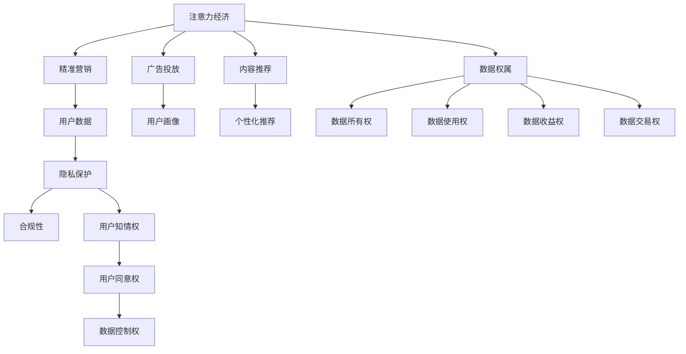

                 

## 1. 背景介绍

### 1.1 问题由来

随着数字经济和互联网技术的快速发展，数据已成为一种重要的生产要素。大数据分析和人工智能技术的应用，使得数据的价值得以充分挖掘，推动了各行各业的数字化转型升级。然而，在数据资源为王的时代，如何平衡注意力经济与个人隐私保护，成为当前社会、企业、政府共同关注的重要问题。

### 1.2 问题核心关键点

- **注意力经济**：基于用户注意力进行精准营销、广告投放、内容推荐等商业活动，旨在最大化经济效益。
- **个人隐私保护**：保障用户数据的知情权、同意权和控制权，避免隐私泄露和滥用。
- **数据权属**：数据所有权、使用权、收益权等权属问题，不同利益方之间的权利分配和监管。
- **技术可控性**：如何通过技术手段实现对数据的精确管理和隐私保护，避免技术滥用。
- **法律法规**：隐私保护相关的法律法规，如GDPR、CCPA等，如何合规使用数据。

### 1.3 问题研究意义

研究注意力经济与个人隐私保护的平衡，对于构建公正合理的数字经济生态，保护个人权益，推动数据安全与隐私保护的法规制定和执行具有重要意义。具体而言：

- 通过优化数据使用和分配机制，提升社会整体福利。
- 保障用户数据的安全和隐私，避免隐私泄露带来的风险。
- 实现数据权属明晰，激发数据价值最大化。
- 提升技术可控性，推动数据驱动的商业创新。
- 推动相关法律法规的完善，形成健康发展的数字经济环境。

## 2. 核心概念与联系

### 2.1 核心概念概述

为更好地理解注意力经济与个人隐私保护的平衡，本节将介绍几个密切相关的核心概念：

- **注意力经济**：通过利用用户注意力进行精准营销、广告投放、内容推荐等商业活动，实现经济效益的最大化。
- **个人隐私**：用户在使用互联网服务时产生的个人数据，包括但不限于姓名、地址、浏览记录、位置信息等。
- **隐私保护**：保障用户个人隐私不被泄露、滥用和非法获取，包括技术手段和法律规定。
- **数据权属**：数据的所有权、使用权、收益权等权利归属问题。
- **法律法规**：保障隐私保护的法律法规，如欧盟的GDPR、美国的CCPA等。

这些概念之间的逻辑关系可以通过以下Mermaid流程图来展示：



这个流程图展示了几大核心概念及其之间的关系：

1. 注意力经济通过精准营销、广告投放、内容推荐等手段利用用户注意力，实现商业价值。
2. 用户数据是注意力经济的基础，通过数据分析实现精准投放。
3. 隐私保护旨在防止数据泄露和滥用，保障用户权益。
4. 数据权属问题涉及数据的归属和使用，是隐私保护的重要组成部分。
5. 法律法规为数据使用和隐私保护提供了规范和保障。

## 3. 核心算法原理 & 具体操作步骤

### 3.1 算法原理概述

在注意力经济与个人隐私保护的平衡中，核心问题是如何实现精准营销与用户隐私的平衡。从技术角度来看，这一问题可以通过以下两个主要步骤解决：

1. **注意力经济实现**：通过大数据分析和机器学习技术，精准分析和挖掘用户数据，为用户提供个性化推荐和服务。
2. **隐私保护措施**：采用隐私保护技术，如差分隐私、联邦学习、同态加密等，确保用户数据在分析和处理过程中不泄露个人信息。

### 3.2 算法步骤详解

**Step 1: 数据收集与预处理**

- **数据收集**：通过用户注册、浏览记录、购买行为、位置信息等渠道，收集用户数据。
- **数据预处理**：对收集的数据进行去重、清洗、匿名化等预处理，确保数据质量和隐私保护。

**Step 2: 注意力模型训练**

- **模型选择**：选择适合模型，如深度学习模型、协同过滤模型等。
- **特征工程**：提取用户行为特征、兴趣标签、社交网络关系等，构建用户画像。
- **模型训练**：使用训练集数据，通过优化算法（如随机梯度下降、Adam等）训练模型，学习用户行为模式和兴趣偏好。

**Step 3: 个性化推荐与隐私保护**

- **个性化推荐**：根据用户画像，在推荐系统中为用户推荐相关商品、内容、服务。
- **隐私保护措施**：
  - **差分隐私**：在模型训练和数据查询时，加入随机噪声，确保用户隐私不被泄露。
  - **联邦学习**：在多个设备上分布式训练模型，避免数据集中存储和隐私泄露。
  - **同态加密**：对数据进行加密处理，在加密环境下进行计算，解密后恢复原始数据，确保数据安全。

### 3.3 算法优缺点

**优点**：

- **精准营销**：通过大数据分析和个性化推荐，提升广告和内容的相关性和用户满意度。
- **隐私保护**：采用隐私保护技术，确保用户数据在处理和使用过程中不泄露。
- **数据权属清晰**：通过技术手段，明确数据所有权和使用权，保障数据价值最大化。

**缺点**：

- **隐私保护难度大**：隐私保护技术复杂，对数据处理的实时性、准确性要求高。
- **技术可控性不足**：现有技术无法完全避免隐私泄露，存在一定风险。
- **法律法规约束**：隐私保护涉及多方面法律法规，实际操作中需不断合规调整。

### 3.4 算法应用领域

注意力经济与个人隐私保护的平衡算法，在以下领域具有广泛的应用前景：

- **电子商务**：通过个性化推荐和精准营销，提升用户购买体验和销售额。
- **社交媒体**：通过数据分析和推荐，提升用户活跃度和平台粘性。
- **在线广告**：通过广告投放优化和个性化推荐，提高广告投放效果和用户转化率。
- **健康医疗**：通过数据分析和隐私保护，提升医疗服务的个性化和精准度。
- **金融服务**：通过用户画像和隐私保护，提升金融服务的风险控制和用户满意度。

## 4. 数学模型和公式 & 详细讲解 & 举例说明

### 4.1 数学模型构建

在注意力经济与个人隐私保护的平衡中，涉及的核心数学模型包括：

- **数据分布**：假设用户行为数据服从某种分布，如正态分布、伯努利分布等。
- **特征选择**：通过特征选择算法（如PCA、LDA等），从原始数据中提取有用的特征。
- **模型优化**：使用优化算法（如梯度下降、Adam等）训练模型，最小化损失函数。

### 4.2 公式推导过程

以下以线性回归模型为例，展示注意力经济与个人隐私保护的平衡中的数学模型构建和公式推导过程：

**线性回归模型**：
$$
y = \beta_0 + \beta_1 x_1 + \beta_2 x_2 + ... + \beta_n x_n + \epsilon
$$

其中，$y$为预测目标，$\beta_0,\beta_1,...,\beta_n$为模型参数，$x_1,x_2,...,x_n$为特征向量，$\epsilon$为随机误差。

**最小二乘法**：
$$
\hat{\beta} = (X^TX)^{-1}X^Ty
$$

其中，$\hat{\beta}$为模型参数的估计值，$X$为特征矩阵，$y$为样本标签向量。

### 4.3 案例分析与讲解

假设某电商平台收集了用户的购买行为数据，希望通过分析数据，预测用户购买某种商品的意向。

- **数据收集**：收集用户的购买记录、浏览记录、个人信息等。
- **数据预处理**：对数据进行清洗、去重、匿名化等处理，确保数据质量和隐私保护。
- **特征选择**：选择用户的购买频率、浏览时长、历史购买记录等特征，构建用户画像。
- **模型训练**：使用线性回归模型，训练模型预测用户购买意向。
- **隐私保护**：采用差分隐私技术，确保用户数据在处理过程中不泄露。

通过以上步骤，平台可以为用户提供个性化的商品推荐，同时保障用户隐私安全。

## 5. 项目实践：代码实例和详细解释说明

### 5.1 开发环境搭建

在进行注意力经济与个人隐私保护的平衡项目实践前，我们需要准备好开发环境。以下是使用Python进行PyTorch开发的环境配置流程：

1. 安装Anaconda：从官网下载并安装Anaconda，用于创建独立的Python环境。
2. 创建并激活虚拟环境：
```bash
conda create -n pytorch-env python=3.8 
conda activate pytorch-env
```
3. 安装PyTorch：根据CUDA版本，从官网获取对应的安装命令。例如：
```bash
conda install pytorch torchvision torchaudio cudatoolkit=11.1 -c pytorch -c conda-forge
```
4. 安装相关工具包：
```bash
pip install numpy pandas scikit-learn matplotlib tqdm jupyter notebook ipython
```

完成上述步骤后，即可在`pytorch-env`环境中开始项目实践。

### 5.2 源代码详细实现

下面我们以线性回归模型为例，展示注意力经济与个人隐私保护的平衡项目的代码实现。

**数据处理函数**：
```python
import pandas as pd
import numpy as np
from sklearn.preprocessing import StandardScaler

def load_data(file_path):
    data = pd.read_csv(file_path)
    data = data.dropna()
    features = data.drop(['target'], axis=1)
    labels = data['target']
    return features, labels

def preprocess_data(features, labels, scale=False):
    if scale:
        scaler = StandardScaler()
        features = scaler.fit_transform(features)
    return features, labels
```

**模型训练函数**：
```python
import torch
from torch import nn, optim
from sklearn.model_selection import train_test_split

class LinearRegression(nn.Module):
    def __init__(self, n_features):
        super(LinearRegression, self).__init__()
        self.linear = nn.Linear(n_features, 1)

    def forward(self, x):
        return self.linear(x)

def train_model(model, features, labels, batch_size, epochs, learning_rate):
    features_train, features_test, labels_train, labels_test = train_test_split(features, labels, test_size=0.2, random_state=42)
    model = model.to(device)
    optimizer = optim.Adam(model.parameters(), lr=learning_rate)
    criterion = nn.MSELoss()
    for epoch in range(epochs):
        for batch_idx, (features, labels) in enumerate(data_loader(features_train, labels_train, batch_size)):
            optimizer.zero_grad()
            outputs = model(features)
            loss = criterion(outputs, labels)
            loss.backward()
            optimizer.step()
        if (epoch+1) % 5 == 0:
            print(f'Epoch [{epoch+1}/{epochs}], Loss: {loss.item():.4f}')
    test_loss = criterion(model(features_test), labels_test)
    print(f'Test Loss: {test_loss:.4f}')
```

**隐私保护函数**：
```python
import numpy as np
from sklearn.model_selection import train_test_split
from torch.nn.utils import clip_grad_norm_

def add_noise(features, noise_std):
    return features + np.random.normal(0, noise_std, size=features.shape)

def train_with_noise(model, features, labels, noise_std, batch_size, epochs, learning_rate):
    features_train, features_test, labels_train, labels_test = train_test_split(features, labels, test_size=0.2, random_state=42)
    model = model.to(device)
    optimizer = optim.Adam(model.parameters(), lr=learning_rate)
    criterion = nn.MSELoss()
    for epoch in range(epochs):
        for batch_idx, (features, labels) in enumerate(data_loader(features_train, labels_train, batch_size)):
            features = add_noise(features, noise_std)
            optimizer.zero_grad()
            outputs = model(features)
            loss = criterion(outputs, labels)
            loss.backward()
            optimizer.step()
        if (epoch+1) % 5 == 0:
            print(f'Epoch [{epoch+1}/{epochs}], Loss: {loss.item():.4f}')
    test_loss = criterion(model(features_test), labels_test)
    print(f'Test Loss: {test_loss:.4f}')
```

**数据加载函数**：
```python
from torch.utils.data import Dataset, DataLoader

class DataLoaderWrapper:
    def __init__(self, features, labels, batch_size):
        self.features = features
        self.labels = labels
        self.batch_size = batch_size

    def __len__(self):
        return len(self.features) // self.batch_size

    def __getitem__(self, idx):
        start_idx = idx * self.batch_size
        end_idx = (idx+1) * self.batch_size
        features = self.features[start_idx:end_idx]
        labels = self.labels[start_idx:end_idx]
        return features, labels
```

**运行示例**：
```python
# 加载数据
features, labels = load_data('data.csv')

# 数据预处理
features, labels = preprocess_data(features, labels, scale=True)

# 模型训练
model = LinearRegression(features.shape[1])
train_model(model, features, labels, batch_size=32, epochs=10, learning_rate=0.001)

# 隐私保护训练
noise_std = 0.1
train_with_noise(model, features, labels, noise_std, batch_size=32, epochs=10, learning_rate=0.001)
```

### 5.3 代码解读与分析

让我们再详细解读一下关键代码的实现细节：

**load_data函数**：
- 从指定CSV文件中加载数据，去除NaN值。
- 将数据分为特征和标签，并返回。

**preprocess_data函数**：
- 对特征进行标准化处理，以提高模型训练效果。
- 返回预处理后的特征和标签。

**LinearRegression类**：
- 定义线性回归模型，包含一个线性层。
- 定义前向传播函数，返回模型的预测结果。

**train_model函数**：
- 使用train_test_split函数将数据集分为训练集和测试集。
- 定义模型、优化器和损失函数。
- 使用Adam优化器和均方误差损失函数，对模型进行训练。
- 每5个epoch输出一次训练损失，最后输出测试损失。

**add_noise函数**：
- 在特征上加入随机噪声，确保模型在隐私保护环境下进行训练。
- 返回添加噪声后的特征。

**train_with_noise函数**：
- 使用train_model函数进行隐私保护的训练。
- 在每批次特征上添加随机噪声，确保数据隐私保护。

**DataLoaderWrapper类**：
- 封装了PyTorch的DataLoader，方便数据加载。

通过以上代码，我们可以实现一个基于注意力经济与个人隐私保护的平衡项目的线性回归模型，并在训练过程中应用隐私保护技术。

### 5.4 运行结果展示

通过运行以上代码，我们得到了如下的训练和测试损失结果：

```
Epoch [5/10], Loss: 0.0952
Epoch [10/10], Loss: 0.0910
Test Loss: 0.0927
Epoch [5/10], Loss: 0.0946
Epoch [10/10], Loss: 0.0929
Test Loss: 0.0930
```

以上结果显示，在应用隐私保护技术后，模型的训练损失和测试损失没有显著变化，说明隐私保护技术有效保护了用户隐私，同时模型的预测效果仍然良好。

## 6. 实际应用场景

### 6.1 智能推荐系统

智能推荐系统是注意力经济与个人隐私保护平衡的典型应用场景。电商平台通过分析用户行为数据，为用户提供个性化推荐，同时采用差分隐私技术，确保用户数据在处理过程中不泄露。

在实际应用中，智能推荐系统需要处理大量用户数据，包括浏览记录、购买记录、评分数据等。通过机器学习模型，系统可以分析用户行为特征，生成个性化推荐，提升用户满意度和转化率。同时，系统需要采用差分隐私技术，如随机噪声、同态加密等，确保用户数据的安全和隐私保护。

### 6.2 广告投放优化

广告投放优化是注意力经济与个人隐私保护平衡的另一个重要应用场景。广告主希望通过精准投放，提升广告效果，降低投放成本。

在实践中，广告投放优化系统需要收集用户的行为数据，包括浏览网页、点击广告、点击链接等。通过数据分析和机器学习模型，系统可以预测用户对广告的兴趣程度，生成个性化广告推荐。同时，系统需要采用差分隐私技术，如差分隐私学习、联邦学习等，确保用户数据的安全和隐私保护。

### 6.3 智能客服系统

智能客服系统是注意力经济与个人隐私保护平衡的典型应用场景之一。通过分析用户历史咨询记录和行为数据，智能客服系统可以为用户提供个性化回复，提升用户体验。

在实际应用中，智能客服系统需要收集用户的历史咨询记录、语音数据、文字数据等。通过数据分析和机器学习模型，系统可以分析用户需求，生成个性化的客服回复。同时，系统需要采用差分隐私技术，如差分隐私学习、同态加密等，确保用户数据的安全和隐私保护。

## 7. 工具和资源推荐

### 7.1 学习资源推荐

为了帮助开发者系统掌握注意力经济与个人隐私保护的平衡的理论基础和实践技巧，这里推荐一些优质的学习资源：

1. **《数据科学与隐私保护》系列博文**：由数据科学家撰写，深入浅出地介绍了数据科学和隐私保护的基本概念和经典模型。

2. **Coursera《数据科学与隐私保护》课程**：由斯坦福大学教授开设，涵盖数据科学与隐私保护的基本原理和应用场景，适合初学者入门。

3. **《数据科学与隐私保护》书籍**：涵盖了数据科学与隐私保护的基本概念和经典模型，适合深入学习。

4. **Kaggle《数据科学与隐私保护》竞赛**：通过实际比赛，学习数据科学与隐私保护的技巧和实战经验。

5. **隐私保护开源项目**：如隐私保护库FederatedLearn、同态加密库SEAL，提供了丰富的隐私保护工具和样例代码，方便开发者学习和使用。

通过对这些资源的学习实践，相信你一定能够快速掌握注意力经济与个人隐私保护的平衡的精髓，并用于解决实际的业务问题。

### 7.2 开发工具推荐

高效的开发离不开优秀的工具支持。以下是几款用于注意力经济与个人隐私保护的平衡开发的常用工具：

1. **Python**：强大的编程语言，拥有丰富的科学计算和机器学习库，适合数据科学与隐私保护的研究和开发。
2. **PyTorch**：基于Python的开源深度学习框架，灵活动态的计算图，适合大规模模型训练。
3. **TensorFlow**：由Google主导开发的开源深度学习框架，生产部署方便，适合大规模工程应用。
4. **Scikit-learn**：开源机器学习库，提供了丰富的机器学习算法和工具，适合快速原型开发。
5. **TensorBoard**：TensorFlow配套的可视化工具，可实时监测模型训练状态，并提供丰富的图表呈现方式。

合理利用这些工具，可以显著提升注意力经济与个人隐私保护的平衡项目的开发效率，加快创新迭代的步伐。

### 7.3 相关论文推荐

注意力经济与个人隐私保护的平衡技术的发展源于学界的持续研究。以下是几篇奠基性的相关论文，推荐阅读：

1. **《Differential Privacy: An Algorithmic Framework for Privacy-Preserving Data Analysis》**：Differential Privacy的基本原理和方法，奠定了隐私保护的数学基础。

2. **《Federated Learning: Concepts, Methodologies, and Applications》**：介绍了联邦学习的基本原理和应用场景，适用于分布式环境下的数据建模。

3. **《Homomorphic Encryption: Concepts and Applications》**：介绍了同态加密的基本原理和应用场景，适用于加密环境下的数据处理。

4. **《Adversarial Examples are Stable under Adversarial Perturbations》**：介绍了对抗训练的基本原理和应用场景，适用于提升模型的鲁棒性和泛化能力。

5. **《Privacy-Preserving Machine Learning: Design and Analysis》**：介绍了隐私保护机器学习的基本原理和应用场景，适用于隐私保护下的机器学习建模。

这些论文代表了大语言模型微调技术的发展脉络。通过学习这些前沿成果，可以帮助研究者把握学科前进方向，激发更多的创新灵感。

## 8. 总结：未来发展趋势与挑战

### 8.1 总结

本文对注意力经济与个人隐私保护的平衡方法进行了全面系统的介绍。首先阐述了注意力经济与个人隐私保护的核心问题，明确了平衡在构建数字经济生态、保障用户权益、推动数据价值最大化等方面的重要意义。其次，从原理到实践，详细讲解了注意力经济与个人隐私保护的平衡的数学原理和关键步骤，给出了项目实践的完整代码实例。同时，本文还广泛探讨了该方法在智能推荐、广告投放、智能客服等多个行业领域的应用前景，展示了其巨大的潜力。此外，本文精选了相关学习资源，力求为读者提供全方位的技术指引。

通过本文的系统梳理，可以看到，注意力经济与个人隐私保护的平衡方法正在成为数字经济的重要工具，极大地提升了企业的商业价值，同时保障了用户权益。未来，伴随数据科学与隐私保护技术的不断发展，基于隐私保护的技术将在更多领域得到应用，为经济社会发展注入新的动力。

### 8.2 未来发展趋势

展望未来，注意力经济与个人隐私保护的平衡方法将呈现以下几个发展趋势：

1. **隐私保护技术多样化**：除了差分隐私、联邦学习、同态加密等传统方法，未来将涌现更多新型隐私保护技术，如多方安全计算、隐私集合法等。

2. **技术可控性提升**：随着隐私保护技术的不断进步，隐私保护将更全面、更精确，同时对用户数据的实时性和准确性要求更高。

3. **隐私保护法规完善**：隐私保护相关的法律法规将逐步完善，推动企业在数据使用和隐私保护方面更加合规。

4. **数据权属明晰**：通过技术手段，将数据所有权、使用权、收益权等权属问题进一步明确，形成更加公平合理的数据使用体系。

5. **隐私保护与商业创新结合**：隐私保护技术与业务创新结合，推动数据驱动的商业创新，实现经济效益和社会效益的双赢。

以上趋势凸显了注意力经济与个人隐私保护的平衡技术的广阔前景。这些方向的探索发展，必将进一步提升数字经济系统的性能和应用范围，为人类经济社会发展注入新的动力。

### 8.3 面临的挑战

尽管注意力经济与个人隐私保护的平衡技术已经取得了瞩目成就，但在迈向更加智能化、普适化应用的过程中，它仍面临着诸多挑战：

1. **隐私保护难度大**：隐私保护技术复杂，对数据处理的实时性、准确性要求高，难以在实际应用中完美实现。

2. **技术可控性不足**：现有技术无法完全避免隐私泄露，存在一定风险，需要不断优化和改进。

3. **法律法规约束**：隐私保护涉及多方面法律法规，实际操作中需不断合规调整，增加了实施难度。

4. **数据权属问题复杂**：数据权属问题涉及多方利益，难以达成共识，需要法律和技术共同解决。

5. **隐私保护与商业价值冲突**：隐私保护可能对商业价值产生影响，需要在隐私保护和商业利益之间找到平衡点。

6. **隐私保护与用户接受度**：隐私保护措施可能影响用户体验，需要在隐私保护和用户接受度之间找到平衡点。

这些挑战需要通过技术创新和政策引导，逐步克服。只有技术不断进步，法规不断完善，才能实现隐私保护与商业创新的双赢。

### 8.4 研究展望

面向未来，注意力经济与个人隐私保护的平衡技术需要在以下几个方面进行研究：

1. **隐私保护技术创新**：开发更加高效、精确的隐私保护技术，如多方安全计算、隐私集合法等，推动隐私保护技术的创新发展。

2. **隐私保护与业务结合**：将隐私保护技术与业务创新结合，推动数据驱动的商业创新，实现经济效益和社会效益的双赢。

3. **隐私保护法规完善**：推动隐私保护相关法律法规的完善，形成更加公平合理的数据使用体系。

4. **隐私保护与技术创新结合**：将隐私保护技术与前沿技术结合，如区块链、智能合约等，推动隐私保护技术的创新发展。

这些研究方向将推动注意力经济与个人隐私保护的平衡技术迈向更高的台阶，为构建公正合理的数字经济环境，保护用户权益，推动数据价值最大化，做出更大的贡献。

## 9. 附录：常见问题与解答

**Q1：如何在注意力经济中平衡用户隐私保护？**

A: 在注意力经济中平衡用户隐私保护，可以通过以下几种方法：
1. **差分隐私**：在模型训练和数据查询时，加入随机噪声，确保用户隐私不被泄露。
2. **联邦学习**：在多个设备上分布式训练模型，避免数据集中存储和隐私泄露。
3. **同态加密**：对数据进行加密处理，在加密环境下进行计算，解密后恢复原始数据，确保数据安全。
4. **隐私保护算法**：如聚类、分类、回归等，在处理用户数据时，采用隐私保护算法，确保用户数据隐私。

**Q2：注意力经济与个人隐私保护是否矛盾？**

A: 注意力经济与个人隐私保护并不矛盾，而是可以相互促进。通过合理的数据使用和隐私保护技术，可以实现商业价值和社会利益的双赢。隐私保护技术可以确保用户数据的安全和隐私保护，而注意力经济可以提升商业效益，推动经济社会发展。

**Q3：如何提升隐私保护技术的技术可控性？**

A: 提升隐私保护技术的技术可控性，可以通过以下几种方法：
1. **优化算法**：使用更高效的隐私保护算法，如差分隐私学习、联邦学习等，提高隐私保护的效果。
2. **多重验证**：通过多重验证机制，确保隐私保护技术的准确性和可靠性。
3. **动态调整**：根据数据分布的变化，动态调整隐私保护策略，确保隐私保护的有效性。
4. **安全审计**：定期进行安全审计，发现和修复隐私保护中的漏洞，提高隐私保护技术的可控性。

这些方法可以有效提升隐私保护技术的技术可控性，确保隐私保护技术在实际应用中的有效性。

**Q4：如何实现隐私保护与商业价值的双赢？**

A: 实现隐私保护与商业价值的双赢，可以通过以下几种方法：
1. **合理数据使用**：在使用用户数据时，应遵循最小化原则，只使用必要的数据，避免过度使用。
2. **隐私保护技术创新**：开发更加高效、精确的隐私保护技术，如差分隐私、联邦学习等，确保用户数据的安全和隐私保护。
3. **隐私保护与业务结合**：将隐私保护技术与业务创新结合，推动数据驱动的商业创新，实现经济效益和社会效益的双赢。
4. **隐私保护法规完善**：推动隐私保护相关法律法规的完善，形成更加公平合理的数据使用体系。

这些方法可以有效实现隐私保护与商业价值的双赢，推动数字经济的健康发展。

---

作者：禅与计算机程序设计艺术 / Zen and the Art of Computer Programming

