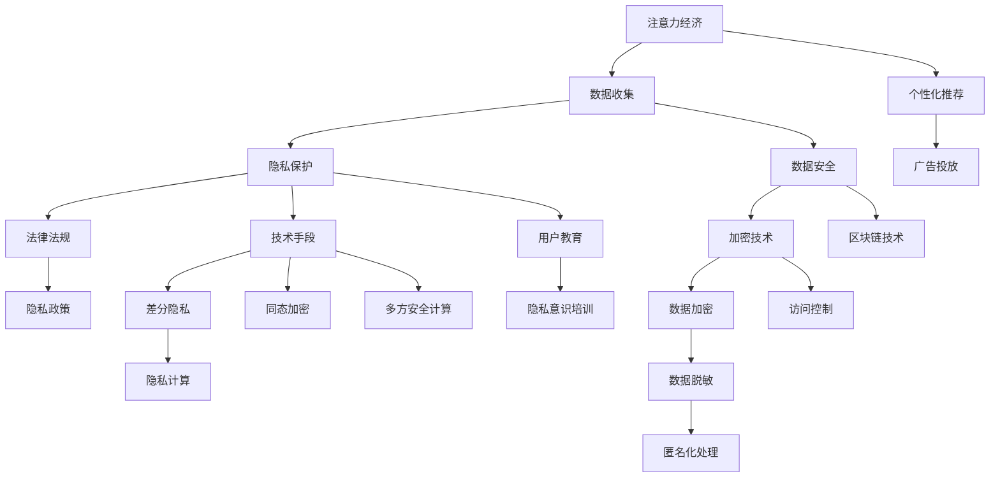

                 

# 注意力经济与个人隐私意识的提升

> 关键词：注意力经济,个人隐私,隐私保护,数据安全,人工智能伦理

## 1. 背景介绍

### 1.1 问题由来

随着互联网技术的飞速发展，注意力经济成为新兴的商业模式。通过捕获用户注意力，商业平台能够实现广告、内容付费等多种变现方式。然而，在获取用户注意力的过程中，如何平衡用户的隐私权与平台利益成为一个亟待解决的问题。

当前，大多数互联网平台仍通过收集用户的浏览行为、搜索记录、购物数据等，进行精准投放和个性化推荐，从而提高用户的黏性和活跃度。但这些行为不可避免地涉及用户的个人隐私，引发了隐私泄露、数据滥用等一系列问题。如何在保障用户隐私的前提下，充分利用用户注意力，构建健康、可持续的注意力经济，成为亟需解决的难题。

### 1.2 问题核心关键点

注意力经济与个人隐私之间存在着矛盾关系。平台需要通过收集用户数据，精准定位用户需求，从而实现更有效的广告投放和内容推荐。而用户则期望保护自己的隐私，不被平台过度干扰。解决这一问题的关键在于：

- 如何在确保用户隐私的前提下，精准捕获和利用用户的注意力。
- 如何建立透明、公平、可控的隐私保护机制，提升用户对平台信任度。
- 如何通过技术创新，构建隐私保护与数据利用的平衡点。

## 2. 核心概念与联系

### 2.1 核心概念概述

为了更好地理解注意力经济与个人隐私的关系，本节将介绍几个密切相关的核心概念：

- **注意力经济**：指通过捕获和引导用户注意力，实现商业价值和社会效益的经济模式。典型的注意力经济平台包括社交媒体、电商、新闻聚合等。

- **隐私保护**：指保护个人数据不被未经授权的第三方访问、使用和披露，维护用户的个人信息安全和隐私权益。隐私保护涉及法律法规、技术手段、用户教育等多个层面。

- **数据安全**：指保障数据在传输、存储、使用过程中的完整性、可用性、保密性和抗抵赖性，避免数据泄露和滥用。数据安全是隐私保护的基础。

- **人工智能伦理**：指在人工智能技术应用过程中，遵循伦理道德规范，确保技术使用不会对人类造成损害。AI伦理涉及技术责任、决策透明度、用户自主性等多个维度。

- **隐私计算**：指在保护隐私的前提下，进行数据处理和分析的技术，如差分隐私、同态加密、多方安全计算等。隐私计算是解决隐私保护与数据利用冲突的重要手段。

这些核心概念之间的逻辑关系可以通过以下Mermaid流程图来展示：



这个流程图展示了几大核心概念及其之间的相互关系：

1. 注意力经济依赖于用户数据，数据收集和分析是其中重要环节。
2. 隐私保护通过法律法规和技术手段，保障用户数据的安全和合法使用。
3. 数据安全是隐私保护的基础，涉及加密技术、访问控制等多种措施。
4. 隐私计算是解决隐私保护与数据利用冲突的重要技术手段。
5. 人工智能伦理在技术应用中起到规范和约束作用，确保技术使用的透明性和公平性。
6. 法律法规、技术手段、用户教育等多维度协同，共同构建隐私保护的完整体系。

这些概念共同构成了注意力经济和隐私保护的理论框架，为后续的技术实践提供了方向指引。

## 3. 核心算法原理 & 具体操作步骤

### 3.1 算法原理概述

注意力经济与个人隐私的平衡，涉及对用户数据的精准捕获和合理利用。其核心算法原理包括以下几个方面：

- **用户行为分析**：通过分析用户的浏览、搜索、购买等行为，识别其兴趣点，实现精准投放。
- **个性化推荐**：基于用户的兴趣历史和行为数据，推荐符合其需求的内容。
- **隐私保护技术**：采用差分隐私、同态加密、多方安全计算等技术，在保障隐私的前提下，进行数据处理和分析。
- **数据安全机制**：建立数据访问控制、数据加密、数据匿名化等安全机制，防止数据泄露和滥用。

这些原理通过具体的步骤和技术手段，实现对用户注意力的精准捕获和合理利用，同时保障用户的隐私权益。

### 3.2 算法步骤详解

基于上述原理，注意力经济与个人隐私的平衡过程可分解为以下几个关键步骤：

**Step 1: 数据收集与预处理**
- 收集用户的基本信息（如年龄、性别、地域）和行为数据（如浏览记录、搜索记录、购物数据）。
- 对数据进行清洗、去重、归一化等预处理操作，保障数据的准确性和一致性。

**Step 2: 用户兴趣建模**
- 使用协同过滤、内容推荐、兴趣表示等算法，构建用户兴趣模型。
- 对用户的兴趣进行分类和聚类，形成用户的兴趣画像。

**Step 3: 隐私保护技术应用**
- 采用差分隐私技术，对敏感数据进行噪声扰动，防止用户隐私泄露。
- 使用同态加密技术，对数据在加密状态下进行计算，保障数据安全。
- 应用多方安全计算技术，在多方之间共同计算，确保数据不泄露。

**Step 4: 个性化推荐与广告投放**
- 基于用户兴趣模型，进行个性化推荐，实现精准投放。
- 通过A/B测试等手段，评估推荐效果，优化模型参数。

**Step 5: 隐私保护与用户教育**
- 建立隐私政策，明确数据收集、存储、使用范围，增强用户信任。
- 提供隐私保护指南和培训，提升用户的隐私保护意识。

### 3.3 算法优缺点

基于隐私保护技术的注意力经济算法具有以下优点：

- **精准捕获用户兴趣**：通过精准的数据分析和建模，能够捕捉到用户的真实需求和兴趣点，实现更有效的个性化推荐。
- **保障用户隐私**：采用差分隐私、同态加密等隐私保护技术，确保用户数据的安全和合法使用。
- **提高用户信任度**：透明的隐私政策和技术手段，增强用户对平台的信任度。

同时，该算法也存在一定的局限性：

- **数据处理复杂度增加**：隐私保护技术的引入，使得数据处理和分析变得更加复杂，增加了技术实现的难度和成本。
- **隐私保护与数据利用的平衡难以把握**：如何在保障隐私的前提下，最大化利用用户数据，仍需进一步探索。
- **算法透明度不足**：隐私保护技术往往带有黑盒特性，用户难以理解和信任。

### 3.4 算法应用领域

基于隐私保护技术的注意力经济算法，广泛应用于以下领域：

- **社交媒体**：通过精准投放广告和内容，提升用户黏性。同时，采用隐私保护技术，保护用户隐私。
- **电子商务**：通过个性化推荐和精准广告，提升用户购买转化率。同时，通过用户隐私保护，增强用户信任度。
- **在线教育**：通过个性化学习推荐，提升学习效果。同时，保障学生隐私，防止数据滥用。
- **医疗健康**：通过精准的健康数据分析和推荐，提高医疗服务的质量和效率。同时，确保患者隐私安全。
- **金融服务**：通过精准的金融产品推荐和广告投放，提升用户活跃度。同时，保障用户金融数据的安全。

## 4. 数学模型和公式 & 详细讲解 & 举例说明

### 4.1 数学模型构建

在注意力经济与隐私保护中，数据隐私保护是一个关键问题。这里以差分隐私为代表，介绍隐私保护技术的数学模型构建。

记用户的兴趣数据为 $D$，隐私预算为 $\epsilon$，定义差分隐私损失函数为：

$$
\mathcal{L}(D) = \frac{1}{\epsilon} \log \left( \frac{1}{\delta} + e^{-\epsilon} \right)
$$

其中 $\delta$ 为算法失败的概率。

差分隐私的目标是最小化上述损失函数，确保在隐私预算 $\epsilon$ 的限制下，算法的输出对任何单一数据点 $d \in D$ 的敏感度不超过 $\epsilon$。

### 4.2 公式推导过程

差分隐私的计算过程可以归纳为以下几个步骤：

1. 对原始数据 $D$ 添加噪声 $N$，得到处理后的数据 $D'$。
2. 计算 $D'$ 的统计量，得到隐私保护的输出。
3. 通过差分隐私损失函数，计算隐私预算 $\epsilon$ 的使用情况，判断是否满足隐私保护要求。

以计算用户兴趣平均值为例，差分隐私的实现步骤如下：

1. 对每个用户 $i$ 的兴趣 $d_i$ 添加噪声 $N_i$，得到处理后的兴趣 $d_i'$。
2. 计算所有处理后兴趣的平均值 $\hat{\mu}$。
3. 计算差分隐私损失函数，判断是否满足隐私预算要求。

具体实现代码如下：

```python
from scipy.stats import norm
import numpy as np

def laplace_difference_privacy(D, epsilon):
    n = len(D)
    noise = np.random.laplace(scale=1/n, size=n)
    D_privacy = D + noise
    mu = np.mean(D_privacy)
    loss = (1/epsilon) * np.log((1/delta) + np.exp(-epsilon))
    return mu, loss

# 使用示例
D = [3, 5, 7, 9, 11]  # 用户兴趣数据
epsilon = 0.1  # 隐私预算
delta = 0.1  # 算法失败概率

mu, loss = laplace_difference_privacy(D, epsilon)
print(f"隐私保护的平均兴趣值为: {mu}")
print(f"差分隐私损失为: {loss}")
```

### 4.3 案例分析与讲解

以一个简单的广告投放案例来说明差分隐私的实际应用：

假设某电商网站需要根据用户的浏览历史，向其推荐商品。但为了保护用户隐私，网站采用差分隐私技术进行处理。具体实现步骤如下：

1. 收集用户历史浏览记录 $D$。
2. 对每个浏览记录 $d_i$ 添加噪声 $N_i$，得到处理后的记录 $d_i'$。
3. 计算所有处理后浏览记录的平均值 $\hat{\mu}$。
4. 根据差分隐私损失函数，计算隐私预算 $\epsilon$ 的使用情况。
5. 将 $\hat{\mu}$ 作为推荐结果，投放广告。

通过差分隐私技术，电商网站在保护用户隐私的前提下，实现了精准的广告投放，提高了用户转化率。

## 5. 项目实践：代码实例和详细解释说明

### 5.1 开发环境搭建

在进行注意力经济与隐私保护的实践前，我们需要准备好开发环境。以下是使用Python进行PyTorch开发的环境配置流程：

1. 安装Anaconda：从官网下载并安装Anaconda，用于创建独立的Python环境。

2. 创建并激活虚拟环境：
```bash
conda create -n privacy-env python=3.8 
conda activate privacy-env
```

3. 安装PyTorch：根据CUDA版本，从官网获取对应的安装命令。例如：
```bash
conda install pytorch torchvision torchaudio cudatoolkit=11.1 -c pytorch -c conda-forge
```

4. 安装相关库：
```bash
pip install scipy numpy scipy-special pytorch-distributed
```

完成上述步骤后，即可在`privacy-env`环境中开始实践。

### 5.2 源代码详细实现

下面我们以社交媒体广告投放为例，给出使用PyTorch进行差分隐私处理的代码实现。

首先，定义差分隐私损失函数：

```python
from scipy.stats import laplace

def differential_privacy_loss(D, epsilon):
    n = len(D)
    loss = (1/epsilon) * np.log((1/delta) + np.exp(-epsilon))
    return loss
```

然后，实现差分隐私的实际应用代码：

```python
import numpy as np
import torch
from scipy.stats import laplace

# 定义差分隐私损失函数
def differential_privacy_loss(D, epsilon):
    n = len(D)
    loss = (1/epsilon) * np.log((1/delta) + np.exp(-epsilon))
    return loss

# 数据生成
def generate_data(n=1000, D_min=0, D_max=10, noise_scale=1/n):
    D = np.random.uniform(low=D_min, high=D_max, size=n)
    noise = np.random.laplace(scale=noise_scale, size=n)
    D_privacy = D + noise
    return D_privacy

# 应用差分隐私
def apply_differential_privacy(D, epsilon, delta):
    D_privacy = generate_data(n=len(D), noise_scale=1/n)
    loss = differential_privacy_loss(D_privacy, epsilon)
    return D_privacy, loss

# 使用示例
D = np.array([3, 5, 7, 9, 11])  # 用户兴趣数据
epsilon = 0.1  # 隐私预算
delta = 0.1  # 算法失败概率

D_privacy, loss = apply_differential_privacy(D, epsilon, delta)
print(f"隐私保护的兴趣值为: {D_privacy}")
print(f"差分隐私损失为: {loss}")
```

### 5.3 代码解读与分析

让我们再详细解读一下关键代码的实现细节：

**差分隐私损失函数**：
- 使用SciPy库的Laplace分布函数，计算差分隐私损失。

**数据生成**：
- 生成用户的兴趣数据 $D$，并添加噪声 $N$，得到处理后的数据 $D'$。

**差分隐私应用**：
- 计算处理后数据的平均兴趣值 $\hat{\mu}$。
- 通过差分隐私损失函数，计算隐私预算 $\epsilon$ 的使用情况。

通过上述代码，可以清晰地看到差分隐私算法的实现流程，并直观地展示其效果。

## 6. 实际应用场景

### 6.1 社交媒体平台

社交媒体平台需要精准投放广告，提升用户黏性。但在获取用户数据时，隐私保护是一个重要问题。通过差分隐私技术，社交媒体平台可以在保障用户隐私的前提下，实现精准的广告投放。

具体实现时，可以收集用户的点赞、评论、分享等行为数据，并进行差分隐私处理。处理后的数据可用于广告的精准投放，而无需暴露原始数据。通过差分隐私技术，社交媒体平台可以在用户隐私保护与商业利益之间找到平衡点，构建健康、可持续的注意力经济。

### 6.2 在线零售

在线零售平台需要根据用户的浏览历史，推荐相关商品。但在收集用户数据时，隐私保护是一个重要问题。通过差分隐私技术，在线零售平台可以在保障用户隐私的前提下，实现精准的商品推荐。

具体实现时，可以收集用户的浏览记录、搜索记录等行为数据，并进行差分隐私处理。处理后的数据可用于商品的精准推荐，而无需暴露原始数据。通过差分隐私技术，在线零售平台可以在用户隐私保护与商业利益之间找到平衡点，提升用户的购物体验和平台的用户黏性。

### 6.3 医疗健康

医疗健康领域对用户隐私保护有极高的要求。通过差分隐私技术，医疗平台可以在保障用户隐私的前提下，实现精准的健康数据分析和推荐。

具体实现时，可以收集用户的健康数据（如心率、血压等），并进行差分隐私处理。处理后的数据可用于健康数据的分析和推荐，而无需暴露原始数据。通过差分隐私技术，医疗平台可以在用户隐私保护与健康数据利用之间找到平衡点，提升医疗服务的质量和效率。

## 7. 工具和资源推荐

### 7.1 学习资源推荐

为了帮助开发者系统掌握注意力经济与隐私保护的理论基础和实践技巧，这里推荐一些优质的学习资源：

1. 《数据隐私保护》系列博文：深入浅出地介绍了差分隐私、同态加密等隐私保护技术，适合初学者入门。

2. CS294A《隐私保护技术》课程：加州大学伯克利分校开设的隐私保护技术课程，有Lecture视频和配套作业，提供系统化的理论学习。

3. 《隐私计算导论》书籍：全面介绍了隐私计算的基本概念和技术手段，适合深入研究。

4. HuggingFace官方文档：Transformer库的官方文档，提供了丰富的隐私保护样例代码，是实践开发的利器。

5. Privacy-Preserved Machine Learning and Statistical Inference：Kaggle平台上的隐私保护竞赛，包含大量实践案例，适合实战学习。

通过对这些资源的学习实践，相信你一定能够快速掌握注意力经济与隐私保护的精髓，并用于解决实际的注意力经济问题。

### 7.2 开发工具推荐

高效的开发离不开优秀的工具支持。以下是几款用于注意力经济与隐私保护开发的常用工具：

1. PyTorch：基于Python的开源深度学习框架，灵活动态的计算图，适合快速迭代研究。

2. TensorFlow：由Google主导开发的开源深度学习框架，生产部署方便，适合大规模工程应用。

3. PySyft：隐私计算开源框架，支持联邦学习、同态加密等隐私保护技术，适合构建隐私保护的机器学习模型。

4. Apache Spark：大数据处理和分析框架，支持分布式计算，适合处理大规模数据集。

5. Jupyter Notebook：交互式的开发环境，方便进行算法调试和结果展示。

合理利用这些工具，可以显著提升注意力经济与隐私保护的开发效率，加快创新迭代的步伐。

### 7.3 相关论文推荐

注意力经济与隐私保护的发展源于学界的持续研究。以下是几篇奠基性的相关论文，推荐阅读：

1. Differential Privacy: A Framework for Privacy-Preserving Data Analysis：差分隐私的奠基论文，详细介绍了差分隐私的数学模型和应用。

2. Private information retrieval in a model-based setting：介绍了隐私保护的模型化方法，通过模型训练实现隐私保护。

3. Homomorphic encryption: Functionalities and applications：介绍了同态加密技术，可以在加密状态下进行计算。

4. A Comprehensive Survey of Multi-Party Computation for Privacy-Preserving Distributed Data Analytics：综述了多方安全计算技术，适合研究隐私保护的分布式计算。

这些论文代表了大语言模型微调技术的发展脉络。通过学习这些前沿成果，可以帮助研究者把握学科前进方向，激发更多的创新灵感。

## 8. 总结：未来发展趋势与挑战

### 8.1 总结

本文对注意力经济与个人隐私的关系进行了全面系统的介绍。首先阐述了注意力经济与隐私保护的矛盾关系，明确了在保障用户隐私的前提下，如何精准捕获和利用用户注意力的核心问题。其次，从原理到实践，详细讲解了隐私保护技术的数学模型和实现步骤，给出了实践开发的完整代码实例。同时，本文还探讨了隐私保护技术在社交媒体、在线零售、医疗健康等领域的实际应用，展示了隐私保护技术的广阔前景。最后，本文精选了隐私保护技术的各类学习资源，力求为读者提供全方位的技术指引。

通过本文的系统梳理，可以看到，注意力经济与个人隐私之间存在着矛盾和平衡的关系，隐私保护技术在其中起到了关键作用。只有在保障用户隐私的前提下，才能充分利用用户注意力，构建健康、可持续的注意力经济。未来，隐私保护技术将继续发展，进一步提升注意力经济的质量和效率。

### 8.2 未来发展趋势

展望未来，注意力经济与隐私保护技术将呈现以下几个发展趋势：

1. **隐私计算技术不断进步**：差分隐私、同态加密、多方安全计算等隐私保护技术将不断进步，应用范围将进一步扩大，成为构建隐私保护系统的基石。

2. **联邦学习成为主流**：联邦学习技术将得到更广泛的应用，允许多个数据源在不共享数据的前提下，协同训练模型，实现隐私保护和模型优化。

3. **隐私保护与数据利用的平衡点更加精准**：通过不断的技术创新和应用实践，将在隐私保护与数据利用之间找到更加精准的平衡点，最大化利用数据价值。

4. **隐私保护技术的应用场景不断拓展**：隐私保护技术将深入到更多领域，如医疗、金融、教育等，提升相关行业的智能化水平。

5. **隐私保护意识的提升**：随着隐私保护技术的普及，用户的隐私保护意识也将不断提高，推动隐私保护技术的进一步发展和应用。

以上趋势凸显了隐私保护技术的广阔前景。这些方向的探索发展，必将进一步提升注意力经济的质量和效率，为构建健康、可持续的注意力经济奠定坚实基础。

### 8.3 面临的挑战

尽管隐私保护技术已经取得了显著进展，但在迈向更加智能化、普适化应用的过程中，仍面临诸多挑战：

1. **隐私保护技术的复杂性**：隐私保护技术涉及复杂的数学模型和算法实现，技术门槛较高。如何降低技术实现的难度，使得更多人能够使用和推广这些技术，仍需进一步努力。

2. **隐私保护与数据利用的平衡难度**：如何在保障隐私的前提下，最大化利用数据价值，仍需更多的实践和探索。

3. **隐私保护的性能问题**：隐私保护技术往往带来一定的性能损失，如何在保障隐私的前提下，尽可能减少性能损失，仍需进一步优化。

4. **隐私保护技术的普及度**：隐私保护技术虽然重要，但在实际应用中仍面临普及度不高的问题，需要更多宣传和教育，提升用户和企业对隐私保护的认识。

5. **隐私保护技术的标准和规范**：目前隐私保护技术还缺乏统一的标准和规范，不同技术之间的兼容性和互操作性亟需提升。

这些挑战需要在技术、法律、标准等多个维度协同发力，才能进一步推动隐私保护技术的普及和应用。

### 8.4 研究展望

面对隐私保护技术所面临的种种挑战，未来的研究需要在以下几个方面寻求新的突破：

1. **隐私保护技术的自动化**：通过自动化技术，降低隐私保护技术的复杂性，使得更多人能够使用和推广这些技术。

2. **隐私保护技术的优化**：开发更加高效、轻量级的隐私保护算法，减少隐私保护技术带来的性能损失。

3. **隐私保护技术的标准化**：建立统一的隐私保护技术标准和规范，提升不同技术之间的兼容性和互操作性。

4. **隐私保护技术的普及教育**：通过广泛的宣传和教育，提升用户和企业对隐私保护的认识，推动隐私保护技术的普及应用。

5. **隐私保护技术的融合创新**：将隐私保护技术与区块链、云计算等前沿技术结合，提升隐私保护技术的应用效果。

这些研究方向和突破，将进一步推动隐私保护技术的发展，为构建安全、可持续的注意力经济提供重要保障。

## 9. 附录：常见问题与解答

**Q1：隐私保护技术如何影响注意力经济的效果？**

A: 隐私保护技术虽然增加了数据处理的复杂性和技术实现的难度，但其对注意力经济的效果影响是积极的。通过差分隐私、同态加密等隐私保护技术，可以在保障用户隐私的前提下，实现精准的广告投放和个性化推荐，提升用户的转化率和满意度。虽然技术实现难度较高，但隐私保护技术的广泛应用，将使得注意力经济更加健康、可持续。

**Q2：如何评估隐私保护技术的效果？**

A: 隐私保护技术的效果评估通常包括以下几个方面：

1. **隐私预算**：评估隐私预算的使用情况，确保隐私保护技术在合理的预算内运行。

2. **隐私损失**：通过隐私损失函数，计算隐私保护技术对用户数据的敏感度。

3. **算法成功率**：评估隐私保护算法在特定数据集上的成功率，确保隐私保护技术的准确性和可靠性。

4. **用户满意度**：通过问卷调查等方式，收集用户对隐私保护的反馈意见，提升用户的信任度和满意度。

**Q3：如何平衡隐私保护与数据利用？**

A: 隐私保护与数据利用之间的平衡需要从多个维度进行考虑：

1. **隐私保护技术的应用场景**：根据不同的应用场景，选择合适的隐私保护技术。例如，差分隐私适用于统计分析，同态加密适用于计算任务。

2. **隐私预算的设置**：通过合理设置隐私预算，确保隐私保护技术的有效性和成本效益。

3. **数据利用策略**：在隐私保护技术的基础上，设计合理的数据利用策略，最大化利用数据价值。

4. **用户隐私意识的提升**：通过宣传和教育，提升用户对隐私保护的认识，增强用户对隐私保护技术的信任和支持。

通过以上方法，可以在隐私保护与数据利用之间找到更加精准的平衡点，最大化利用数据价值。

**Q4：隐私保护技术的未来发展方向是什么？**

A: 隐私保护技术的未来发展方向包括：

1. **隐私计算技术的进步**：差分隐私、同态加密、多方安全计算等隐私保护技术将不断进步，应用范围将进一步扩大。

2. **隐私保护技术的自动化**：通过自动化技术，降低隐私保护技术的复杂性，使得更多人能够使用和推广这些技术。

3. **隐私保护技术的优化**：开发更加高效、轻量级的隐私保护算法，减少隐私保护技术带来的性能损失。

4. **隐私保护技术的标准化**：建立统一的隐私保护技术标准和规范，提升不同技术之间的兼容性和互操作性。

5. **隐私保护技术的融合创新**：将隐私保护技术与区块链、云计算等前沿技术结合，提升隐私保护技术的应用效果。

这些研究方向和突破，将进一步推动隐私保护技术的发展，为构建安全、可持续的注意力经济提供重要保障。

**Q5：如何构建隐私保护的社会共识？**

A: 构建隐私保护的社会共识需要从多个方面进行努力：

1. **法律法规的完善**：通过立法保护用户隐私，建立健全的隐私保护法律法规体系。

2. **公众教育**：通过宣传和教育，提升公众对隐私保护的认识，增强用户对隐私保护技术的信任和支持。

3. **行业标准的制定**：制定隐私保护技术的行业标准和规范，提升隐私保护技术的普及度和应用效果。

4. **隐私保护技术的普及**：通过技术推广和应用实践，提升隐私保护技术的普及度和应用效果。

5. **隐私保护意识的提升**：通过隐私保护意识的提升，构建隐私保护的社会共识，推动隐私保护技术的普及和应用。

通过以上方法，可以构建隐私保护的社会共识，推动隐私保护技术的广泛应用和普及。

---

作者：禅与计算机程序设计艺术 / Zen and the Art of Computer Programming

