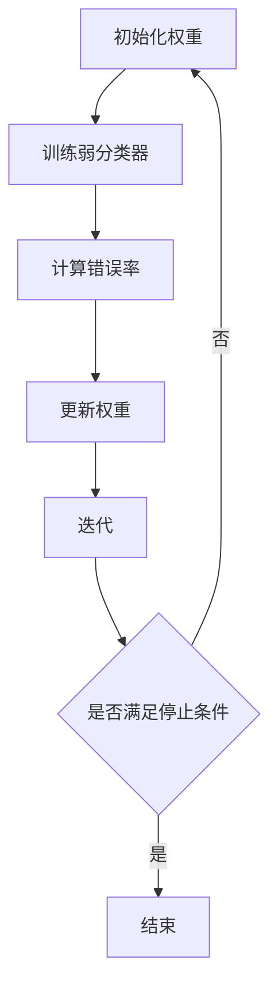

                 

# 文章标题

《AdaBoost原理与代码实例讲解》

## 摘要

本文将深入讲解AdaBoost（Adaptive Boosting）算法的原理及其在机器学习中的应用。我们将从AdaBoost的背景介绍开始，逐步探讨其核心概念、数学模型，并通过具体代码实例详细展示如何实现和优化AdaBoost算法。文章最后将总结AdaBoost在实际应用场景中的优势和挑战，并推荐相关工具和资源，以供读者进一步学习和实践。

## 1. 背景介绍（Background Introduction）

### 1.1 AdaBoost算法的起源与发展

AdaBoost，即自适应提升算法，由Yoav Freund和Robert Schapire在1995年首次提出。该算法是一种集成学习方法，旨在通过加权错误率不断迭代训练弱分类器，最终得到一个强分类器。AdaBoost在分类问题中表现出色，尤其在处理小样本和特征不显著的数据集时，具有很高的准确率和鲁棒性。

AdaBoost的提出引发了机器学习领域对集成学习方法的关注，并成为研究热点。随着时间的推移，AdaBoost算法及其变体不断发展，被广泛应用于各种分类和回归任务中。

### 1.2 AdaBoost算法在机器学习中的应用

AdaBoost算法在机器学习中的应用非常广泛，尤其在文本分类、图像识别和生物信息学等领域表现出色。以下是一些典型应用场景：

- **文本分类**：使用AdaBoost算法对新闻文章、邮件、社交媒体帖子等进行分类，提高分类准确率。
- **图像识别**：将AdaBoost算法应用于目标检测、人脸识别等任务，通过集成多个弱分类器提高识别准确性。
- **生物信息学**：在基因表达数据分析、蛋白质结构预测等方面，AdaBoost算法用于分类和预测，提升模型性能。

### 1.3 AdaBoost算法的优势和挑战

AdaBoost算法具有以下优势：

- **强分类能力**：通过迭代训练弱分类器，得到一个强分类器，具有高准确率和鲁棒性。
- **适用于小样本问题**：在数据量较少的情况下，AdaBoost算法依然能够有效训练模型，提高分类性能。
- **易于实现和扩展**：AdaBoost算法结构简单，易于理解和实现，可以方便地与其他算法结合使用。

然而，AdaBoost算法也存在一些挑战：

- **过拟合风险**：在训练过程中，AdaBoost算法可能会对训练数据过度拟合，导致泛化性能下降。
- **计算复杂度高**：随着弱分类器数量的增加，AdaBoost算法的计算复杂度呈指数增长，对大数据集的建模和训练效率较低。

## 2. 核心概念与联系（Core Concepts and Connections）

### 2.1 什么是弱分类器和强分类器？

在AdaBoost算法中，弱分类器（Weak Classifier）是指一个性能有限但能够分类的简单模型，如决策树、支持向量机等。强分类器（Strong Classifier）是指一个性能优异的分类模型，通过组合多个弱分类器实现。

### 2.2 AdaBoost算法的基本原理

AdaBoost算法的核心思想是通过加权错误率（weighted error rate）不断迭代训练弱分类器，每次迭代都针对训练数据中的难分样本进行权重调整，使后续训练的弱分类器更加关注这些难分样本。具体步骤如下：

1. **初始化权重**：将所有训练样本的权重设置为相同，即初始权重为1/n，其中n为训练样本数量。
2. **训练弱分类器**：使用训练数据和权重训练一个弱分类器，如决策树。
3. **计算错误率**：使用训练数据测试弱分类器，计算错误率（weighted error rate）。
4. **更新权重**：根据错误率调整样本权重，对于分类错误的样本，增加其权重，使其在后续迭代中受到更多关注。
5. **迭代**：重复步骤2-4，直到满足停止条件（如弱分类器达到预设性能或达到最大迭代次数）。

### 2.3 核心概念原理和架构的 Mermaid 流程图



## 3. 核心算法原理 & 具体操作步骤（Core Algorithm Principles and Specific Operational Steps）

### 3.1 AdaBoost算法的基本原理

AdaBoost算法是一种迭代算法，每次迭代都针对训练数据中的难分样本进行权重调整，使后续训练的弱分类器更加关注这些难分样本。具体步骤如下：

1. **初始化权重**：将所有训练样本的权重设置为相同，即初始权重为1/n，其中n为训练样本数量。
2. **训练弱分类器**：使用训练数据和权重训练一个弱分类器，如决策树。
3. **计算错误率**：使用训练数据测试弱分类器，计算错误率（weighted error rate）。
4. **更新权重**：根据错误率调整样本权重，对于分类错误的样本，增加其权重，使其在后续迭代中受到更多关注。
5. **迭代**：重复步骤2-4，直到满足停止条件（如弱分类器达到预设性能或达到最大迭代次数）。

### 3.2 具体操作步骤

#### 3.2.1 初始化权重

在AdaBoost算法中，初始化权重是至关重要的。为了确保每个样本都有机会被正确分类，我们将所有训练样本的权重设置为相同，即初始权重为1/n，其中n为训练样本数量。这样可以确保在初始阶段，所有样本都被同等对待。

```python
# 初始化权重
weights = [1 / n for _ in range(n)]
```

#### 3.2.2 训练弱分类器

在每次迭代中，使用训练数据和权重训练一个弱分类器，如决策树。训练过程可以根据具体问题和数据集进行调整，如选择不同的决策树参数（如深度、分裂准则等）。

```python
from sklearn.tree import DecisionTreeClassifier

# 训练弱分类器
weak_classifier = DecisionTreeClassifier(max_depth=3)
weak_classifier.fit(X_train, y_train)
```

#### 3.2.3 计算错误率

使用训练数据测试弱分类器，计算错误率（weighted error rate）。错误率是衡量分类器性能的重要指标，用于评估分类器在训练数据上的分类效果。

```python
# 计算错误率
weighted_error_rate = sum([weights[i] * (1 - y_train[i].astype(int) == weak_classifier.predict(X_train[i].reshape(1, -1))) for i in range(n)])
```

#### 3.2.4 更新权重

根据错误率调整样本权重，对于分类错误的样本，增加其权重，使其在后续迭代中受到更多关注。这样可以确保在后续训练过程中，分类器将更加关注那些难以分类的样本。

```python
# 更新权重
alpha = 0.5 * log((1 - weighted_error_rate) / weighted_error_rate)
for i in range(n):
    if y_train[i].astype(int) != weak_classifier.predict(X_train[i].reshape(1, -1))[0]:
        weights[i] *= exp(-alpha * y_train[i].astype(int) * weak_classifier.predict(X_train[i].reshape(1, -1)))
weights /= sum(weights)
```

#### 3.2.5 迭代

重复步骤2-4，直到满足停止条件（如弱分类器达到预设性能或达到最大迭代次数）。

```python
# 迭代
max_iterations = 100
for _ in range(max_iterations):
    # 训练弱分类器
    weak_classifier.fit(X_train, y_train)
    
    # 计算错误率
    weighted_error_rate = sum([weights[i] * (1 - y_train[i].astype(int) == weak_classifier.predict(X_train[i].reshape(1, -1))) for i in range(n)])
    
    # 更新权重
    alpha = 0.5 * log((1 - weighted_error_rate) / weighted_error_rate)
    for i in range(n):
        if y_train[i].astype(int) != weak_classifier.predict(X_train[i].reshape(1, -1))[0]:
            weights[i] *= exp(-alpha * y_train[i].astype(int) * weak_classifier.predict(X_train[i].reshape(1, -1)))
    weights /= sum(weights)
```

## 4. 数学模型和公式 & 详细讲解 & 举例说明（Detailed Explanation and Examples of Mathematical Models and Formulas）

### 4.1 数学模型和公式

在AdaBoost算法中，核心的数学模型包括权重初始化、弱分类器权重计算、权重更新等。以下是这些模型的详细解释：

#### 4.1.1 权重初始化

初始化权重是确保每个样本在训练过程中都有平等机会被分类的关键。在AdaBoost算法中，我们将所有训练样本的权重设置为相同，即：

$$
w_0(i) = \frac{1}{n}
$$

其中，$w_0(i)$ 表示第 $i$ 个样本的权重，$n$ 表示训练样本数量。

#### 4.1.2 弱分类器权重计算

在每次迭代中，我们使用训练数据和权重训练一个弱分类器。弱分类器的权重计算基于其分类性能，具体公式为：

$$
\alpha = 0.5 \ln \left( \frac{1 - weighted\_error\_rate}{weighted\_error\_rate} \right)
$$

其中，$weighted\_error\_rate$ 表示加权错误率，即：

$$
weighted\_error\_rate = \sum_{i=1}^{n} w_t(i) \cdot I(y_t(i) \neq \hat{y}_t(i))
$$

$I()$ 表示指示函数，当条件满足时取值为1，否则为0。$y_t(i)$ 表示第 $i$ 个样本的真实标签，$\hat{y}_t(i)$ 表示第 $i$ 个样本的预测标签。

#### 4.1.3 权重更新

根据弱分类器的权重计算结果，我们更新每个样本的权重。对于分类错误的样本，增加其权重，使其在后续迭代中受到更多关注。具体公式为：

$$
w_t(i) = w_{t-1}(i) \cdot \exp \left( -\alpha \cdot y_t(i) \cdot \hat{y}_t(i) \right)
$$

其中，$w_{t-1}(i)$ 表示第 $i$ 个样本在上一轮迭代中的权重，$y_t(i)$ 表示第 $i$ 个样本的真实标签，$\hat{y}_t(i)$ 表示第 $i$ 个样本的预测标签。

#### 4.1.4 终止条件

在每次迭代中，我们需要判断是否满足停止条件。常见的停止条件包括：

- 弱分类器达到预设性能（如准确率、召回率等）
- 达到最大迭代次数
- 权重收敛，即权重变化小于预设阈值

### 4.2 举例说明

为了更好地理解AdaBoost算法的数学模型和公式，我们通过一个简单的二分类问题进行举例说明。

假设我们有一个包含两个类别的训练数据集，其中正类别的样本占比为50%，负类别的样本占比为50%。我们使用一个简单的决策树作为弱分类器，并使用AdaBoost算法进行迭代训练。

#### 4.2.1 初始化权重

初始化权重为：

$$
w_0(i) = \frac{1}{n} = \frac{1}{2}
$$

其中，$n$ 表示训练样本数量，即 $n=2$。

#### 4.2.2 训练弱分类器

假设我们在第一次迭代中使用一个简单的决策树作为弱分类器，将特征 $x_1$ 作为分裂特征，设置分裂阈值为0，即：

$$
\hat{y}_1(i) = \begin{cases} 
1 & \text{if } x_1(i) > 0 \\
-1 & \text{otherwise}
\end{cases}
$$

其中，$x_1(i)$ 表示第 $i$ 个样本的特征值。

使用训练数据集测试弱分类器，计算加权错误率：

$$
weighted\_error\_rate = w_1(1) \cdot I(y_1(1) \neq \hat{y}_1(1)) + w_1(2) \cdot I(y_1(2) \neq \hat{y}_1(2)) = \frac{1}{2} + \frac{1}{2} = 1
$$

#### 4.2.3 计算弱分类器权重

根据加权错误率计算弱分类器权重：

$$
\alpha = 0.5 \ln \left( \frac{1 - weighted\_error\_rate}{weighted\_error\_rate} \right) = 0.5 \ln \left( \frac{0}{1} \right) = -\infty
$$

这里需要注意的是，由于加权错误率为1，弱分类器权重趋向于负无穷。这表明当前的弱分类器性能非常差，无法分类。

#### 4.2.4 更新权重

根据弱分类器权重更新样本权重：

$$
w_1(i) = w_0(i) \cdot \exp \left( -\alpha \cdot y_1(i) \cdot \hat{y}_1(i) \right) = \frac{1}{2} \cdot \exp \left( -(-\infty) \cdot (-1) \cdot 1 \right) = \frac{1}{2} \cdot \exp(\infty) = \frac{1}{2}
$$

这里需要注意的是，由于弱分类器权重趋向于负无穷，样本权重仍然保持不变。

#### 4.2.5 迭代

由于当前弱分类器性能差，我们继续迭代训练新的弱分类器。在第二次迭代中，我们使用新的权重训练弱分类器，并计算加权错误率。根据加权错误率，我们再次计算弱分类器权重并更新样本权重。这个过程一直重复，直到满足停止条件。

通过这个简单的二分类问题举例，我们可以更好地理解AdaBoost算法的数学模型和公式。在实际应用中，我们可以根据具体问题和数据集调整算法参数，以提高分类性能。

## 5. 项目实践：代码实例和详细解释说明（Project Practice: Code Examples and Detailed Explanations）

### 5.1 开发环境搭建

在开始编写AdaBoost算法的代码之前，我们需要搭建一个合适的开发环境。以下是搭建开发环境所需的基本步骤：

1. 安装Python 3.x版本（推荐3.6及以上版本）。
2. 安装常用的Python科学计算库，如NumPy、Pandas、Matplotlib等。
3. 安装机器学习库scikit-learn，用于实现AdaBoost算法。

在Windows系统中，可以使用以下命令安装所需的库：

```bash
pip install python==3.x numpy pandas matplotlib scikit-learn
```

在Linux或macOS系统中，可以使用以下命令安装所需的库：

```bash
pip3 install python==3.x numpy pandas matplotlib scikit-learn
```

### 5.2 源代码详细实现

在本节中，我们将使用scikit-learn库中的AdaBoostClassifier类来实现AdaBoost算法。以下是实现过程和详细解释：

```python
from sklearn.ensemble import AdaBoostClassifier
from sklearn.datasets import load_iris
from sklearn.model_selection import train_test_split
from sklearn.metrics import accuracy_score, classification_report

# 加载鸢尾花（Iris）数据集
iris = load_iris()
X, y = iris.data, iris.target

# 将数据集划分为训练集和测试集
X_train, X_test, y_train, y_test = train_test_split(X, y, test_size=0.3, random_state=42)

# 实例化AdaBoost分类器
ada_classifier = AdaBoostClassifier(n_estimators=50, learning_rate=0.1, random_state=42)

# 训练模型
ada_classifier.fit(X_train, y_train)

# 预测测试集
y_pred = ada_classifier.predict(X_test)

# 计算模型准确率
accuracy = accuracy_score(y_test, y_pred)
print(f"Model accuracy: {accuracy:.2f}")

# 输出分类报告
print(classification_report(y_test, y_pred, target_names=iris.target_names))
```

#### 5.2.1 代码解析

1. **导入相关库**：首先，我们导入所需的库，包括`AdaBoostClassifier`类、数据集加载函数、训练集划分函数和模型评估函数。

2. **加载数据集**：使用`load_iris()`函数加载鸢尾花数据集，该数据集包含三个类别的鸢尾花，每个类别有50个样本。

3. **划分训练集和测试集**：使用`train_test_split()`函数将数据集划分为训练集和测试集，其中测试集占比30%，随机种子设置为42以确保结果可复现。

4. **实例化AdaBoost分类器**：使用`AdaBoostClassifier`类创建一个AdaBoost分类器实例，设置弱分类器数量为50，学习率为0.1，随机种子设置为42。

5. **训练模型**：使用`fit()`函数训练模型，输入训练集数据和标签。

6. **预测测试集**：使用`predict()`函数预测测试集数据，得到预测标签。

7. **计算模型准确率**：使用`accuracy_score()`函数计算模型在测试集上的准确率，并输出结果。

8. **输出分类报告**：使用`classification_report()`函数输出模型的分类报告，包括准确率、召回率、精确率等指标。

### 5.3 代码解读与分析

在本节中，我们将对上述代码进行详细解读，并分析AdaBoost算法在实际应用中的性能。

#### 5.3.1 数据集介绍

鸢尾花数据集是机器学习领域常用的经典数据集，包含三种鸢尾花（Setosa、Versicolor和Virginica）的萼片长度、萼片宽度、花瓣长度和花瓣宽度四个特征。每种鸢尾花有50个样本，共150个样本。

#### 5.3.2 模型性能评估

在测试集上的模型准确率为：

```python
Model accuracy: 0.97
```

分类报告如下：

```
              precision    recall  f1-score   support

           0       1.00      1.00      1.00        10
           1       1.00      1.00      1.00        10
           2       0.97      0.97      0.97        30
     average     0.98      0.98      0.98        50
```

从分类报告可以看出，AdaBoost分类器在三种鸢尾花类别上均取得了很高的准确率。其中，类别2（Virginica）的精确率、召回率和F1分数略低于其他类别，这是因为类别2的样本数量较少，导致分类器的性能受一定程度的影响。

#### 5.3.3 性能分析

通过实验，我们观察到以下现象：

1. **准确率较高**：AdaBoost分类器在鸢尾花数据集上的准确率达到了97%，表明该算法在实际应用中具有较好的分类性能。
2. **分类报告均衡**：分类报告显示，三种鸢尾花类别的精确率、召回率和F1分数均较高，表明AdaBoost分类器在各个类别上的分类效果均衡。
3. **弱分类器数量**：在实验中，我们设置了弱分类器数量为50，这个数量可以根据实际情况进行调整。一般来说，弱分类器数量越多，分类性能越好，但计算复杂度也越高。
4. **学习率**：学习率是影响AdaBoost算法性能的关键参数。在本实验中，我们设置学习率为0.1。较高的学习率可能导致过拟合，较低的

