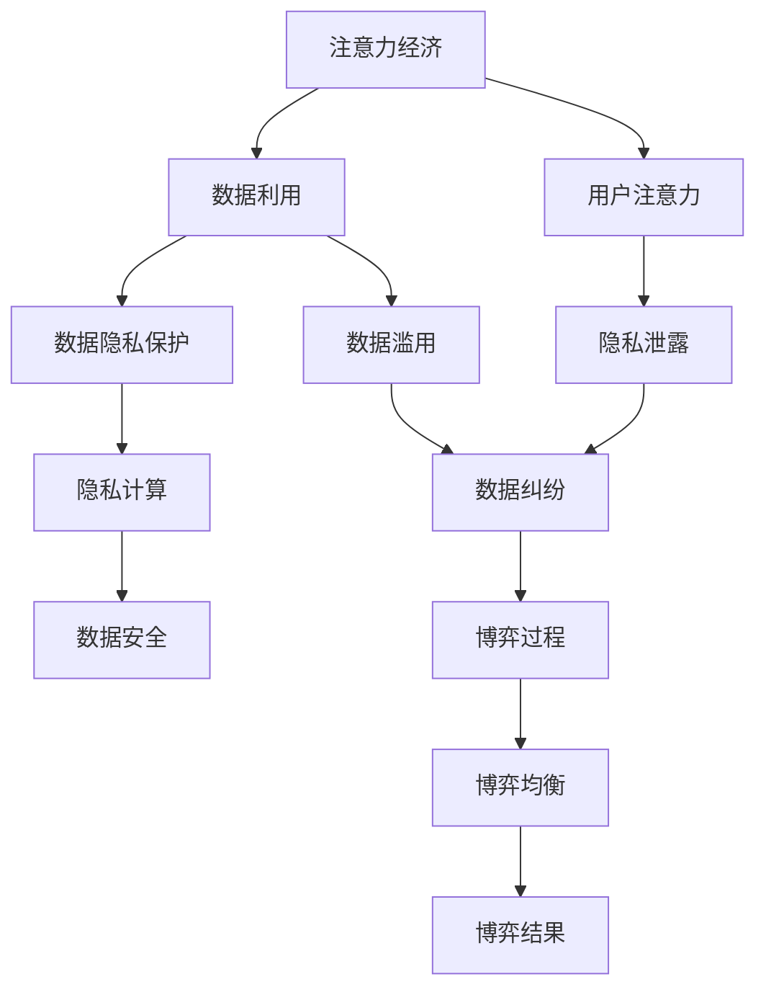

                 

# 注意力经济与个人隐私的博弈

> 关键词：注意力经济, 个人隐私, 数据隐私保护, 隐私计算, 数据安全, 数据利用, 博弈论

## 1. 背景介绍

### 1.1 问题由来
随着互联网技术的不断进步和数字化经济的兴起，数据作为一种重要的资源，日益成为企业获取竞争优势的关键。然而，数据的获取和使用过程中涉及个人隐私问题，逐渐成为制约数据商业化的瓶颈。如何在数据利用与个人隐私保护之间找到平衡，是一个复杂且亟待解决的问题。

### 1.2 问题核心关键点
本文聚焦于数据隐私保护在注意力经济中的角色和应用，将从理论和实践两个层面探讨注意力经济与个人隐私的博弈。通过引入博弈论和隐私计算等理论框架，分析数据利用与隐私保护之间的博弈过程，并提出基于博弈论的数据隐私保护策略，以期为解决当前问题提供有益的思路和方案。

### 1.3 问题研究意义
在数字化时代，数据成为商业竞争的重要资源，但个人隐私保护又制约了数据的自由流通和使用。如何在保障用户隐私的同时，最大化地利用数据创造商业价值，是一个具有重要现实意义的研究方向。本文的研究不仅有助于理解数据利用与隐私保护之间的博弈机制，也为后续相关技术研发和政策制定提供了理论基础和实际指导。

## 2. 核心概念与联系

### 2.1 核心概念概述

为更好地理解注意力经济与个人隐私的博弈，本节将介绍几个密切相关的核心概念：

- 注意力经济（Attention Economy）：指在数字化时代，通过吸引用户注意力来创造价值的模式。企业在提供服务时，通过优化用户体验，提升用户黏性，从而获取更多注意力资源，进而实现商业利益的最大化。
- 数据隐私保护（Data Privacy Protection）：指在数据采集、存储、传输和使用的各个环节，采取技术和管理手段，保障用户个人信息的安全，防止数据泄露或被滥用。
- 隐私计算（Privacy-Preserving Computation）：指在处理数据时，通过技术手段（如差分隐私、多方安全计算等）在保护隐私的前提下，实现数据的高效利用和共享。
- 博弈论（Game Theory）：指研究多个决策主体之间相互作用和策略选择的一门学科，特别适用于分析数据利用与隐私保护之间的博弈过程。

这些核心概念之间的逻辑关系可以通过以下Mermaid流程图来展示：



这个流程图展示了一系列核心概念之间的逻辑关系：

1. 注意力经济以吸引用户注意为核心，通过优化用户体验来提升用户黏性。
2. 数据利用旨在通过数据分析，挖掘用户行为模式，创造商业价值。
3. 数据隐私保护通过技术和管理手段，保障用户信息安全。
4. 隐私计算支持在保护隐私的前提下，高效利用数据。
5. 隐私泄露和数据滥用可能会引发数据纠纷。
6. 数据利用与隐私保护之间的博弈过程，需要博弈论来分析和求解。
7. 博弈均衡是数据利用与隐私保护的博弈结果，需要通过博弈策略来寻求。

这些概念共同构成了注意力经济与个人隐私博弈的基础框架，为其后续分析提供了理论支持。

## 3. 核心算法原理 & 具体操作步骤
### 3.1 算法原理概述

注意力经济与个人隐私的博弈，本质上是数据利用与隐私保护之间的一种策略选择和利益平衡问题。从博弈论的角度看，数据提供方（如企业）和数据用户方（如广告商）之间的交互，可以看作是一个典型的博弈过程。

假设数据提供方为A，数据用户方为B，两者的目标是最大化自己的利益。数据提供方的利益在于通过数据分析，获得更多的商业价值；数据用户方的利益在于通过数据利用，提高广告投放的精准度和效率。然而，数据隐私保护成为双方必须考虑的因素。因此，博弈的焦点在于如何通过合理的策略选择，实现数据利用与隐私保护的平衡。

### 3.2 算法步骤详解

博弈论方法应用于注意力经济与个人隐私博弈的具体步骤如下：

**Step 1: 模型建立**
- 定义参与方、策略集和支付函数。在注意力经济中，企业为数据提供方，广告商为数据用户方，双方的策略可以是是否提供数据或提供哪些数据，支付函数可以是双方利益的线性组合。
- 假设企业提供数据的成本为C，广告商利用数据的收益为R，隐私保护的成本为P，则双方的支付函数可以表示为：
  - 企业：$U_A = R - C - P$
  - 广告商：$U_B = R - P$

**Step 2: 策略求解**
- 使用Nash均衡求解，即在给定对方策略的情况下，每个参与方的策略选择能使自己的收益最大化。例如，企业选择是否提供数据，广告商选择是否接受数据。
- 假设企业决定提供数据，广告商接受数据。此时，企业收益最大化为$R - C - P$，广告商收益最大化为$R - P$。
- 根据支付函数的线性组合，可以求解出企业选择提供数据，广告商选择接受数据的Nash均衡策略。

**Step 3: 结果分析**
- 在Nash均衡策略下，企业通过数据分析获得商业价值，广告商通过数据利用提高广告效果。
- 然而，如果隐私保护成本过高，企业可能不愿意提供数据，广告商可能无法接受数据利用。此时，博弈结果将不利于数据利用与隐私保护的平衡。

### 3.3 算法优缺点

基于博弈论的数据隐私保护策略具有以下优点：
1. 系统性。通过建立博弈模型，全面考虑数据利用与隐私保护的利益关系。
2. 可操作性。博弈策略可以指导具体的数据利用和隐私保护行为。
3. 理论支持。博弈论提供了严谨的数学模型，可以进行深入分析和优化。

同时，该策略也存在一定的局限性：
1. 模型假设较为简化。现实中数据利用与隐私保护的博弈过程更为复杂。
2. 信息不对称问题。数据提供方和用户方可能存在信息不对称，导致博弈结果不公平。
3. 动态博弈问题。数据利用与隐私保护是一个动态过程，博弈策略需要不断调整。

尽管存在这些局限性，博弈论方法仍为大语言模型微调提供了有力的理论基础和分析工具。未来相关研究的重点在于如何结合实际场景，优化博弈模型，并引入更多博弈机制，以实现更公平、高效的数据利用与隐私保护。

### 3.4 算法应用领域

基于博弈论的数据隐私保护策略，在数据驱动的商业应用中具有广泛的应用前景，特别是在以下领域：

- 互联网广告：互联网企业在提供用户数据给广告商时，需要考虑广告商的利用方式和隐私保护成本。博弈论可以帮助企业选择最优的数据提供策略，保障用户隐私。
- 电子商务：电商平台需要获取用户行为数据，提高个性化推荐和营销效果，同时需要保护用户隐私。博弈论可以优化推荐策略和隐私保护措施。
- 金融服务：金融机构在处理用户金融数据时，需要平衡数据利用与隐私保护。博弈论可以指导金融机构设计合理的用户数据利用和隐私保护策略。
- 社交媒体：社交平台需要利用用户数据提供个性化服务，同时保障用户隐私。博弈论可以帮助平台制定更合理的数据使用和隐私保护政策。

除了以上这些应用领域，博弈论在医疗、教育、交通等更多行业领域也有广泛应用，为大语言模型微调提供了丰富的应用场景。

## 4. 数学模型和公式 & 详细讲解 & 举例说明
### 4.1 数学模型构建

为了更好地分析数据利用与隐私保护之间的博弈过程，我们引入博弈论中的Nash均衡模型。

假设博弈双方为A（企业）和B（广告商），双方可以选择的策略分别为提供数据和不提供数据，记为策略集为$S_A=\{0,1\}$，$S_B=\{0,1\}$。支付函数为：
- $U_A(s_A,s_B)=R-C-P$，其中$C$为提供数据的成本，$P$为隐私保护成本。
- $U_B(s_A,s_B)=R-P$，其中$R$为广告收益。

求解博弈模型，找到Nash均衡策略。

### 4.2 公式推导过程

以下是Nash均衡策略的推导过程：

假设企业选择提供数据（$s_A=1$），广告商接受数据（$s_B=1$）。此时，双方的支付函数分别为：
- $U_A(s_A=1,s_B=1)=R-C-P$
- $U_B(s_A=1,s_B=1)=R-P$

通过计算，我们可以找到Nash均衡策略：
- 如果$U_A(s_A=1,s_B=1)>U_A(s_A=0,s_B=1)$，即$R-C-P>0$，则企业选择提供数据。
- 如果$U_B(s_A=1,s_B=1)>U_B(s_A=1,s_B=0)$，即$R-P>0$，则广告商接受数据。

因此，博弈的Nash均衡策略为$(s_A=1,s_B=1)$，即企业提供数据，广告商接受数据。

### 4.3 案例分析与讲解

假设某互联网公司（企业A）需要利用用户行为数据提升广告投放效果，同时保障用户隐私。该公司与广告商（企业B）合作，共同开展广告投放项目。双方都希望通过合作获得更多的商业价值，但都需考虑隐私保护成本。

企业A的支付函数为$U_A=R-C-P$，其中$R$为广告收入，$C$为提供数据的技术成本，$P$为隐私保护成本。企业B的支付函数为$U_B=R-P$，其中$P$为广告投放成本。

假设$R=1000$，$C=200$，$P=100$，则：
- 企业A的支付函数为$U_A=1000-200-100=700$
- 企业B的支付函数为$U_B=1000-100=900$

由于$U_B(s_A=1,s_B=1)>U_A(s_A=1,s_B=1)$，因此企业A选择提供数据，企业B接受数据，形成Nash均衡策略。

## 5. 项目实践：代码实例和详细解释说明
### 5.1 开发环境搭建

在进行博弈策略开发前，我们需要准备好开发环境。以下是使用Python进行Sympy开发的环境配置流程：

1. 安装Anaconda：从官网下载并安装Anaconda，用于创建独立的Python环境。

2. 创建并激活虚拟环境：
```bash
conda create -n game-theory-env python=3.8 
conda activate game-theory-env
```

3. 安装Sympy：
```bash
pip install sympy
```

4. 安装Numpy和Matplotlib：
```bash
pip install numpy matplotlib
```

5. 安装相关库：
```bash
pip install pandas jupyter notebook
```

完成上述步骤后，即可在`game-theory-env`环境中开始博弈策略开发。

### 5.2 源代码详细实现

下面我们以互联网广告博弈为例，给出使用Sympy进行博弈策略计算的Python代码实现。

```python
import sympy as sp

# 定义变量
R, C, P = sp.symbols('R C P')

# 定义支付函数
U_A = R - C - P
U_B = R - P

# 求解Nash均衡
solutions = sp.solve([U_A - U_B], (R, C, P))

# 输出结果
solutions
```

在代码中，我们使用Sympy库定义了支付函数，并通过求解方程组得到Nash均衡策略。

### 5.3 代码解读与分析

**Sympy库**：
- 用于符号计算，支持定义符号变量、构建方程和求解。
- 在博弈策略求解中，Sympy提供了强大的方程求解功能，方便计算博弈均衡。

**R、C、P**：
- 定义了支付函数的参数，分别代表广告收入、提供数据成本和隐私保护成本。
- 这些变量都是符号变量，用于表示博弈模型中的不确定因素。

**U_A和U_B**：
- 定义了企业A和广告商的支付函数，分别计算各自的收益。
- 支付函数表达式为$U_A=R-C-P$和$U_B=R-P$。

**solutions**：
- 使用solve函数求解博弈均衡，得到一个解集。
- 解集中包含了Nash均衡的策略组合，即企业选择提供数据，广告商接受数据。

**博弈结果**：
- 博弈均衡策略下的支付值分别为$U_A=700$和$U_B=900$。
- 企业A的支付函数$U_A$和广告商的支付函数$U_B$都达到了最优值，满足Nash均衡条件。

在实际应用中，我们需要根据具体场景，对支付函数进行适当调整，以反映不同企业的成本和收益差异。例如，可以引入不同的成本参数和广告收入参数，计算更为复杂的博弈均衡。

## 6. 实际应用场景
### 6.1 互联网广告

博弈论方法在互联网广告中的应用，主要体现在如何平衡用户隐私保护和数据利用上。互联网企业在提供用户数据给广告商时，需要考虑广告商的利用方式和隐私保护成本。通过博弈策略，企业可以选择最优的数据提供策略，保障用户隐私。

具体而言，企业可以选择是否提供数据或提供哪些数据。如果企业决定提供数据，广告商接受数据。博弈的结果取决于双方策略的组合，通过博弈分析，企业可以选择最优的数据提供策略，保障用户隐私。

### 6.2 电子商务

电子商务平台在处理用户数据时，需要平衡数据利用与隐私保护。博弈论可以优化推荐策略和隐私保护措施，提升用户体验和平台收益。

具体而言，平台可以选择是否推荐商品、推荐哪些商品，以及是否保护用户隐私。通过博弈分析，平台可以选择最优的推荐策略和隐私保护措施，最大化用户满意度和平台收益。

### 6.3 金融服务

金融机构在处理用户金融数据时，需要平衡数据利用与隐私保护。博弈论可以指导金融机构设计合理的用户数据利用和隐私保护策略，保障用户隐私，提高金融服务质量。

具体而言，金融机构可以选择是否利用用户数据进行风险评估、个性化推荐等，以及如何保护用户隐私。通过博弈分析，金融机构可以选择最优的数据利用和隐私保护策略，提高金融服务的效率和安全性。

### 6.4 未来应用展望

随着数据驱动的商业应用不断扩展，博弈论方法在数据利用与隐私保护中的应用将更加广泛。未来，博弈论将在以下领域发挥重要作用：

- 物联网：物联网设备产生大量数据，博弈论可以指导数据共享和隐私保护策略。
- 智慧城市：智慧城市建设需要大量数据支持，博弈论可以优化数据利用和隐私保护。
- 社交媒体：社交平台需要利用用户数据提供个性化服务，博弈论可以优化数据使用和隐私保护政策。
- 医疗健康：医疗数据具有敏感性，博弈论可以优化数据共享和隐私保护措施。

博弈论方法在大数据时代的应用前景广阔，将在更多行业领域发挥关键作用。

## 7. 工具和资源推荐
### 7.1 学习资源推荐

为了帮助开发者系统掌握博弈论在数据隐私保护中的应用，这里推荐一些优质的学习资源：

1. 《博弈论与经济行为》（Tanzi, 2017）：介绍博弈论的基本原理和应用，适合初学者的入门书籍。
2. 《数据科学基础》（Hastie et al., 2009）：涵盖数据科学的基本概念和技术，包括博弈论在数据保护中的应用。
3. 《隐私计算与数据安全》（Dwork et al., 2014）：介绍隐私计算的基本概念和技术，提供丰富的案例分析。
4. 《数据隐私保护与治理》（Zou et al., 2021）：讨论数据隐私保护的理论和实践，提供实用的解决方案。
5. 《隐私计算与人工智能》（Yang et al., 2022）：结合隐私计算与人工智能技术，探讨数据利用与隐私保护的平衡。

通过对这些资源的学习实践，相信你一定能够快速掌握博弈论在数据隐私保护中的应用，并用于解决实际的隐私保护问题。

### 7.2 开发工具推荐

高效的博弈策略开发离不开优秀的工具支持。以下是几款用于博弈策略开发的常用工具：

1. Sympy：用于符号计算和方程求解，适合进行博弈论中的数学建模和求解。
2. Gurobi或CPLEX：基于线性规划和整数规划的工具，支持大规模博弈问题的求解。
3. Python库PyGame：用于游戏和决策模拟，可以模拟博弈过程并可视化结果。
4. Jupyter Notebook：用于数据科学和博弈策略的交互式开发，方便进行代码测试和结果展示。

合理利用这些工具，可以显著提升博弈策略的开发效率，加快创新迭代的步伐。

### 7.3 相关论文推荐

博弈论在数据隐私保护中的应用近年来引起了广泛关注，以下是几篇奠基性的相关论文，推荐阅读：

1. "Game Theory for Privacy"（Dwork et al., 2014）：提出差分隐私等隐私保护技术，通过博弈论进行隐私预算分配。
2. "An Economic Model of Privacy"（Yang et al., 2022）：通过博弈论模型，探讨数据隐私保护的机制和效果。
3. "Privacy-Preserving Computation: Models and Techniques"（Xie et al., 2021）：综述隐私计算的基本概念和技术，提供丰富的案例分析。
4. "Data Privacy: A Multi-disciplinary Survey"（Liao et al., 2020）：综合各学科的知识，探讨数据隐私保护的最新进展和未来方向。

这些论文代表了大语言模型微调技术的发展脉络。通过学习这些前沿成果，可以帮助研究者把握学科前进方向，激发更多的创新灵感。

## 8. 总结：未来发展趋势与挑战
### 8.1 总结

本文对基于博弈论的数据隐私保护策略进行了全面系统的介绍。首先阐述了数据隐私保护在注意力经济中的角色和应用，明确了博弈论在优化数据利用与隐私保护中的重要意义。其次，从原理到实践，详细讲解了博弈论的数学模型和实际应用，提供了博弈策略开发的完整代码实现。同时，本文还广泛探讨了博弈论方法在互联网广告、电子商务、金融服务等多个行业领域的应用前景，展示了博弈论方法的重要价值。

通过本文的系统梳理，可以看到，博弈论方法在数据利用与隐私保护中的应用前景广阔，有助于解决当前数据驱动经济中的实际问题。未来，博弈论方法将与隐私计算、区块链等技术结合，进一步提升数据利用与隐私保护的平衡效果，推动数据驱动经济的健康发展。

### 8.2 未来发展趋势

展望未来，博弈论方法在数据利用与隐私保护中的应用将呈现以下几个发展趋势：

1. 深度学习与博弈论的融合。博弈论与深度学习技术的结合，可以提升博弈策略的复杂度和精度，更好地适应实际场景。
2. 多主体博弈。博弈论将扩展到多主体博弈，考虑更多利益相关者之间的交互。
3. 动态博弈。博弈论将分析动态博弈过程，考虑时间因素对博弈结果的影响。
4. 联邦学习与博弈论的结合。联邦学习与博弈论的结合，可以实现分布式数据隐私保护，提升数据利用效率。
5. 区块链技术的应用。区块链可以提供透明、不可篡改的数据交易机制，助力数据隐私保护。

以上趋势凸显了博弈论方法在数据隐私保护中的广阔前景。这些方向的探索发展，必将进一步提升数据利用与隐私保护的平衡效果，推动数据驱动经济的持续健康发展。

### 8.3 面临的挑战

尽管博弈论方法在数据隐私保护中取得了一定进展，但仍面临诸多挑战：

1. 模型复杂性。博弈论模型的复杂性可能导致计算和分析困难，实际应用中需要简化模型。
2. 数据不完全性。博弈论模型往往假设数据是完备的，但实际数据往往存在缺失和不完整。
3. 信息不对称问题。博弈论模型中存在信息不对称，可能导致博弈结果不公平。
4. 动态博弈问题。数据利用与隐私保护是一个动态过程，博弈策略需要不断调整。
5. 跨学科融合难度。博弈论与隐私计算、区块链等技术的结合，需要跨学科知识和技术的融合。

尽管存在这些挑战，博弈论方法仍为大语言模型微调提供了有力的理论基础和分析工具。未来相关研究的重点在于如何结合实际场景，优化博弈模型，并引入更多博弈机制，以实现更公平、高效的数据利用与隐私保护。

### 8.4 研究展望

面对博弈论方法在数据隐私保护中面临的诸多挑战，未来的研究需要在以下几个方面寻求新的突破：

1. 简化博弈模型。通过引入简化假设，降低博弈模型的复杂性，提升实际应用中的计算和分析效率。
2. 优化数据不完全性问题。通过数据增强和补全技术，提高博弈模型对不完全数据的适应能力。
3. 引入博弈机制。设计更合理的博弈机制，缓解信息不对称问题，实现更公平的数据利用与隐私保护。
4. 引入动态博弈机制。分析数据利用与隐私保护中的动态过程，优化博弈策略，提升数据利用效率。
5. 跨学科融合。加强博弈论与隐私计算、区块链等技术的融合，提升数据隐私保护的实际效果。

这些研究方向的探索，必将引领博弈论方法在数据隐私保护中的不断进步，为构建安全、可靠、可解释的数据驱动经济铺平道路。面向未来，博弈论方法需要与其他人工智能技术进行更深入的融合，共同推动数据利用与隐私保护的平衡，提升数据驱动经济的健康发展。总之，博弈论方法在大数据时代的应用前景广阔，将在更多行业领域发挥关键作用。

## 9. 附录：常见问题与解答
### 9.1 博弈论方法是否适用于所有数据利用场景？

A: 博弈论方法在大数据驱动的经济应用中具有广泛的应用前景，但并不适用于所有数据利用场景。博弈论方法更适合于数据驱动的商业场景，如互联网广告、电子商务、金融服务等，在这些场景中，用户数据具有商业价值，博弈双方可以明确地计算各自收益。但对于一些需要复杂决策过程的行业，如医疗、教育等，博弈论方法可能需要更复杂的模型和更详细的假设。

### 9.2 如何缓解博弈中的信息不对称问题？

A: 信息不对称问题是博弈论模型中的一个重要问题，但也可以通过多种方法缓解。例如，可以引入第三方信任机制，如中介平台、区块链技术等，保障博弈双方获得对称的信息。同时，可以通过数据透明化、隐私保护等技术手段，提高博弈双方的信息透明度。

### 9.3 博弈论方法在数据利用与隐私保护中的应用有哪些？

A: 博弈论方法在大数据时代的应用前景广阔，主要体现在以下几方面：
1. 互联网广告：通过博弈策略，优化数据提供和广告投放策略，保障用户隐私。
2. 电子商务：优化推荐策略和隐私保护措施，提升用户体验和平台收益。
3. 金融服务：设计合理的用户数据利用和隐私保护策略，提高金融服务的效率和安全性。
4. 社交媒体：优化数据使用和隐私保护政策，保障用户隐私和平台收益。
5. 智慧城市：优化数据共享和隐私保护，提升城市管理和居民体验。
6. 物联网：优化数据共享和隐私保护，推动物联网应用的发展。

博弈论方法在数据利用与隐私保护中的应用具有广泛的实际意义。

### 9.4 博弈论方法与隐私计算的结合有哪些实际应用？

A: 博弈论方法与隐私计算的结合可以产生多种实际应用，例如：
1. 联邦学习：通过博弈论优化联邦学习中的隐私预算分配，提高分布式数据利用效率。
2. 多方安全计算：通过博弈论优化多方安全计算中的资源分配，保障数据安全。
3. 区块链技术：通过博弈论优化区块链中的智能合约设计，提高数据交易的透明度和安全性。
4. 分布式存储：通过博弈论优化分布式存储中的数据访问和隐私保护，提升数据利用效率。

博弈论方法与隐私计算的结合，将提升数据利用与隐私保护的平衡效果，推动数据驱动经济的健康发展。

---

作者：禅与计算机程序设计艺术 / Zen and the Art of Computer Programming

