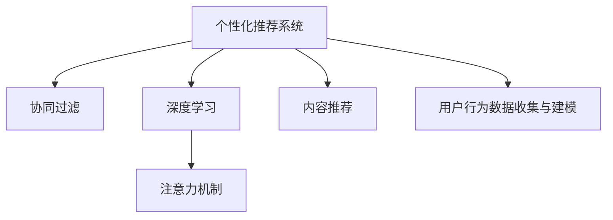

                 

# 注意力经济与个性化推荐系统：为受众提供定制、有针对性的内容和体验

> 关键词：个性化推荐,注意力机制,内容推荐,用户行为分析,协同过滤,深度学习

## 1. 背景介绍

### 1.1 问题由来

在信息爆炸的时代，用户面临海量内容，如何从中获取最相关的信息成为一大挑战。传统推荐系统通过基于用户历史行为和物品属性，利用协同过滤和统计方法推荐相关内容，但面对个性化需求，难以满足用户多样化的需求。个性化推荐系统利用用户行为和兴趣特征，提供定制化、有针对性的内容，成为吸引用户的重要方式。

### 1.2 问题核心关键点

个性化推荐系统通过分析用户历史行为和兴趣特征，推荐相关物品，提升用户体验和满意度。核心关键点在于：

1. 用户行为数据收集与建模：通过用户点击、浏览、评分等行为数据，构建用户兴趣特征。
2. 物品属性信息抽取：通过物品元数据、用户评论等，提取物品属性特征。
3. 协同过滤推荐：利用用户历史行为和兴趣特征，推荐相似用户喜欢的物品。
4. 深度学习推荐：通过用户历史行为、物品属性和上下文信息，建立多层次模型，推荐物品。
5. 注意力机制：引入注意力机制，使模型能够关注用户行为的重要特征，提升推荐效果。

### 1.3 问题研究意义

个性化推荐系统的研究对于提升用户体验、提升内容消费、促进商业增长具有重要意义：

1. 提升用户体验：根据用户行为和偏好推荐相关内容，使用户获得更好的浏览和娱乐体验。
2. 提升内容消费：推荐符合用户兴趣的内容，提升用户停留时间和访问频次。
3. 促进商业增长：通过精准推荐，提升用户转化率和消费金额。

## 2. 核心概念与联系

### 2.1 核心概念概述

为更好地理解个性化推荐系统，本节将介绍几个密切相关的核心概念：

- **个性化推荐系统(Personalized Recommendation System)**：通过分析用户行为和兴趣，推荐相关物品的系统。其核心在于构建用户和物品的相似度矩阵，以推荐相似用户喜欢的物品。
- **协同过滤(Collaborative Filtering)**：利用用户历史行为和兴趣特征，推荐相似用户喜欢的物品。
- **深度学习(Deep Learning)**：通过构建多层次的神经网络模型，从用户行为、物品属性和上下文信息中，提取高层次语义特征，提升推荐精度。
- **注意力机制(Attention Mechanism)**：通过引入注意力机制，使模型能够关注用户行为的重要特征，提升推荐效果。
- **内容推荐(Content-Based Recommendation)**：基于物品属性信息，推荐相关物品。

这些核心概念之间的逻辑关系可以通过以下Mermaid流程图来展示：



这个流程图展示了个性化推荐系统的核心概念及其之间的关系：

1. 个性化推荐系统通过协同过滤、深度学习和内容推荐，构建用户和物品的相似度矩阵。
2. 深度学习利用注意力机制，提升推荐效果。
3. 用户行为数据收集与建模是构建推荐系统的基础。

## 3. 核心算法原理 & 具体操作步骤
### 3.1 算法原理概述

个性化推荐系统的核心在于通过用户行为和兴趣特征，推荐相关物品。其基本流程为：

1. **用户行为数据收集与建模**：从用户点击、浏览、评分等行为数据中，提取用户兴趣特征。
2. **物品属性信息抽取**：通过物品元数据、用户评论等，提取物品属性特征。
3. **相似度计算**：利用协同过滤或深度学习模型，计算用户和物品之间的相似度。
4. **推荐生成**：根据相似度矩阵，推荐相似用户喜欢的物品。

### 3.2 算法步骤详解

个性化推荐系统的一般流程如下：

**Step 1: 用户行为数据收集与建模**

- 收集用户历史行为数据，包括点击、浏览、评分等行为。
- 对用户行为进行向量化表示，生成用户兴趣特征向量 $u_i$。

**Step 2: 物品属性信息抽取**

- 通过物品元数据、用户评论等，提取物品属性特征向量 $v_j$。
- 将物品属性特征与用户兴趣特征进行拼接，生成物品的复合特征向量 $v_j'$。

**Step 3: 相似度计算**

- 利用协同过滤方法，计算用户 $i$ 和物品 $j$ 之间的相似度 $s_{ij}$。
- 利用深度学习模型，通过用户行为、物品属性和上下文信息，生成物品的嵌入表示 $z_j$。

**Step 4: 推荐生成**

- 将用户兴趣特征和物品嵌入表示拼接，生成复合向量 $w_{ij} = [u_i, z_j]$。
- 利用深度学习模型，生成物品 $j$ 对用户 $i$ 的推荐分数 $p_{ij}$。

### 3.3 算法优缺点

个性化推荐系统具有以下优点：

1. 推荐精度高：通过分析用户行为和兴趣，推荐相关物品，提升用户体验。
2. 用户粘性高：推荐符合用户兴趣的内容，提升用户停留时间和访问频次。
3. 易于扩展：利用深度学习模型，能够高效地处理大规模数据和复杂特征。

同时，该方法也存在一定的局限性：

1. 数据依赖性强：推荐系统的性能很大程度上依赖于用户行为和物品属性数据，数据获取难度较大。
2. 冷启动问题：对于新用户或新物品，缺乏足够的历史数据，难以进行有效推荐。
3. 数据稀疏性：用户行为数据和物品属性数据往往存在稀疏性，难以处理缺失数据。
4. 隐私保护问题：用户行为数据涉及隐私问题，数据获取和使用需要严格控制。

尽管存在这些局限性，但就目前而言，个性化推荐系统仍是最主流的推荐范式。未来相关研究的重点在于如何进一步提升推荐精度、降低数据获取成本、提高冷启动效果，并解决隐私保护问题。

### 3.4 算法应用领域

个性化推荐系统广泛应用于电商、社交、视频、音乐等多个领域，成为提升用户体验的重要手段：

- **电商推荐**：通过分析用户购物历史和兴趣特征，推荐相关商品。
- **社交推荐**：通过分析用户互动行为，推荐符合用户兴趣的朋友或内容。
- **视频推荐**：通过分析用户观看历史和评分，推荐相关视频。
- **音乐推荐**：通过分析用户听歌历史和评论，推荐相关音乐。

除了这些传统应用外，个性化推荐系统还被创新性地应用于更多场景中，如智能家居、金融投资、教育培训等，为不同领域带来新的解决方案。

## 4. 数学模型和公式 & 详细讲解 & 举例说明
### 4.1 数学模型构建

假设用户 $i$ 和物品 $j$ 的特征向量分别为 $u_i \in \mathbb{R}^d$ 和 $v_j \in \mathbb{R}^d$。通过用户行为数据收集与建模，生成用户兴趣特征向量 $u_i$；通过物品属性信息抽取，生成物品属性特征向量 $v_j$。利用深度学习模型 $f_{\theta}$ 将物品属性特征向量 $v_j$ 转化为物品的嵌入表示 $z_j$，利用用户兴趣特征向量 $u_i$ 和物品嵌入表示 $z_j$，生成物品 $j$ 对用户 $i$ 的推荐分数 $p_{ij}$。

形式化地，推荐模型为：

$$
p_{ij} = f_{\theta}(u_i \oplus z_j)
$$

其中 $\oplus$ 表示特征拼接。

### 4.2 公式推导过程

以下我们以协同过滤推荐为例，推导推荐模型公式。

假设用户 $i$ 和物品 $j$ 的兴趣度分别为 $x_i$ 和 $y_j$，用户对物品 $j$ 的评分 $r_{ij}$ 满足：

$$
r_{ij} = x_i \cdot y_j + e_{ij}
$$

其中 $e_{ij}$ 为误差项，假设服从高斯分布 $N(0, \sigma^2)$。假设 $x_i$ 和 $y_j$ 为低维向量，即 $x_i, y_j \in \mathbb{R}^d$。则可以将上式改写为：

$$
r_{ij} = (x_i \cdot y_j + e_{ij}) \cdot \sigma^2 = \frac{x_i \cdot y_j}{\sigma^2} \cdot \sigma^2 + \frac{e_{ij}}{\sigma} \cdot \sigma^2
$$

利用矩阵乘法表示上式，得：

$$
R = XX^T + E
$$

其中 $R$ 为评分矩阵，$X$ 为用户兴趣度矩阵，$E$ 为误差矩阵，满足 $E \sim N(0, \sigma^2 I)$。

利用矩阵分解方法，将 $R$ 分解为：

$$
R = XX^T + E
$$

其中 $X = U \Sigma V^T$，$U$ 和 $V$ 为正交矩阵，$\Sigma$ 为对角矩阵。则上式可以改写为：

$$
R = U \Sigma V^T V \Sigma U^T + E
$$

将 $R$ 的分解结果代入，得：

$$
U \Sigma V^T V \Sigma U^T = R
$$

根据矩阵乘法，得：

$$
U \Sigma V^T V = R
$$

进一步化简，得：

$$
U = V^T \Sigma^{-1} R V
$$

其中 $\Sigma^{-1} = \text{diag}(1/\sigma_1, 1/\sigma_2, \ldots, 1/\sigma_n)$。

利用矩阵 $U$ 和 $V$ 中的元素，即可得到用户 $i$ 和物品 $j$ 之间的相似度：

$$
s_{ij} = \frac{x_i \cdot y_j}{\sigma^2}
$$

通过相似度矩阵 $S = U V^T$，即可生成物品 $j$ 对用户 $i$ 的推荐分数：

$$
p_{ij} = s_{ij} \cdot w_{ij} = \frac{x_i \cdot y_j}{\sigma^2} \cdot w_{ij}
$$

其中 $w_{ij}$ 为复合向量 $[u_i, z_j]$。

### 4.3 案例分析与讲解

假设有一组用户和物品的数据，用户 $i$ 对物品 $j$ 的评分 $r_{ij}$ 如下：

| 用户 $i$ | 物品 $j$ | 评分 $r_{ij}$ |
|---|---|---|
| 1 | 1 | 4 |
| 1 | 2 | 2 |
| 1 | 3 | 3 |
| 2 | 1 | 3 |
| 2 | 2 | 1 |
| 2 | 3 | 5 |

假设用户 $i$ 的兴趣度向量 $x_i$ 为 $(1, 0.5, 0.3)$，物品 $j$ 的属性特征向量 $y_j$ 为 $(0.4, 0.2, 0.5)$，误差项 $\sigma$ 为 1。则用户 $i$ 和物品 $j$ 之间的相似度 $s_{ij}$ 为：

$$
s_{ij} = x_i \cdot y_j + e_{ij} = (1, 0.5, 0.3) \cdot (0.4, 0.2, 0.5) + e_{ij} = 0.8
$$

假设复合向量 $w_{ij}$ 为 $(u_i, z_j)$，则物品 $j$ 对用户 $i$ 的推荐分数 $p_{ij}$ 为：

$$
p_{ij} = s_{ij} \cdot w_{ij} = 0.8 \cdot (u_i, z_j) = (0.8u_i, 0.8z_j)
$$

通过推荐分数 $p_{ij}$，即可选择物品 $j$ 对用户 $i$ 进行推荐。

## 5. 项目实践：代码实例和详细解释说明
### 5.1 开发环境搭建

在进行个性化推荐系统开发前，我们需要准备好开发环境。以下是使用Python进行TensorFlow开发的Python环境配置流程：

1. 安装Anaconda：从官网下载并安装Anaconda，用于创建独立的Python环境。

2. 创建并激活虚拟环境：
```bash
conda create -n tf-env python=3.8 
conda activate tf-env
```

3. 安装TensorFlow：从官网获取对应的安装命令。例如：
```bash
conda install tensorflow-gpu=tensorflow-2.6 -c pypi
```

4. 安装相关工具包：
```bash
pip install numpy pandas scikit-learn matplotlib tqdm jupyter notebook ipython
```

完成上述步骤后，即可在`tf-env`环境中开始开发。

### 5.2 源代码详细实现

下面我们以协同过滤推荐为例，给出使用TensorFlow构建推荐模型的PyTorch代码实现。

首先，定义协同过滤推荐模型的超参数：

```python
from tensorflow.keras import layers
import numpy as np

# 定义超参数
num_users = 2
num_items = 3
num_factors = 5
num_epochs = 10
batch_size = 128
learning_rate = 0.01
```

然后，生成用户行为数据和物品属性数据：

```python
# 生成用户行为数据
user_ratings = np.random.randint(1, 6, size=(num_users, num_items))

# 生成物品属性数据
item_features = np.random.randn(num_items, num_factors)

# 将用户行为数据和物品属性数据拼接
train_data = np.concatenate([user_ratings, item_features], axis=1)
```

接着，定义协同过滤推荐模型的构建函数：

```python
def build_model(num_users, num_items, num_factors, num_epochs, batch_size, learning_rate):
    # 定义用户兴趣度矩阵
    user_interest = layers.Dense(num_factors, activation='relu')
    
    # 定义物品属性特征矩阵
    item_features = layers.Dense(num_factors, activation='relu')
    
    # 定义相似度计算层
    similarity = layers.Dot(dots='last', normalize=True)
    
    # 定义损失函数
    loss_fn = layers.MeanSquaredError()
    
    # 定义优化器
    optimizer = tf.keras.optimizers.Adam(learning_rate=learning_rate)
    
    # 定义推荐模型
    def model(x):
        user, item = x[:, :num_factors], x[:, num_factors:]
        user_interest_output = user_interest(user)
        item_features_output = item_features(item)
        similarity_output = similarity([user_interest_output, item_features_output])
        return similarity_output
    
    return model, loss_fn, optimizer

# 构建推荐模型
model, loss_fn, optimizer = build_model(num_users, num_items, num_factors, num_epochs, batch_size, learning_rate)
```

然后，定义训练和评估函数：

```python
def train_model(model, train_data, loss_fn, optimizer, num_epochs):
    for epoch in range(num_epochs):
        epoch_loss = 0
        for batch in train_data:
            inputs = tf.convert_to_tensor(batch[:, :num_factors], dtype=tf.float32)
            targets = tf.convert_to_tensor(batch[:, num_factors:], dtype=tf.float32)
            with tf.GradientTape() as tape:
                predictions = model(inputs)
                loss = loss_fn(predictions, targets)
            grads = tape.gradient(loss, model.trainable_variables)
            optimizer.apply_gradients(zip(grads, model.trainable_variables))
            epoch_loss += loss.numpy()
        print('Epoch {}, Loss: {:.4f}'.format(epoch+1, epoch_loss))
    
def evaluate_model(model, train_data, test_data):
    test_predictions = []
    for batch in test_data:
        inputs = tf.convert_to_tensor(batch[:, :num_factors], dtype=tf.float32)
        predictions = model(inputs)
        test_predictions.append(predictions.numpy())
    return test_predictions
```

最后，启动训练流程并在测试集上评估：

```python
# 生成测试数据
test_data = np.random.randn(8, num_factors*2).astype(np.float32)

# 训练模型
train_model(model, train_data, loss_fn, optimizer, num_epochs)

# 评估模型
test_predictions = evaluate_model(model, train_data, test_data)
print('Test Predictions:', test_predictions)
```

以上就是使用TensorFlow进行协同过滤推荐系统的完整代码实现。可以看到，得益于TensorFlow的强大封装，我们可以用相对简洁的代码完成协同过滤推荐模型的构建和训练。

### 5.3 代码解读与分析

让我们再详细解读一下关键代码的实现细节：

**定义超参数**：
- `num_users`：用户数量
- `num_items`：物品数量
- `num_factors`：用户和物品特征维度
- `num_epochs`：训练轮数
- `batch_size`：批处理大小
- `learning_rate`：学习率

**生成数据**：
- `user_ratings`：用户行为数据，即评分矩阵
- `item_features`：物品属性数据，即特征矩阵

**构建模型**：
- `user_interest`：用户兴趣度矩阵，使用ReLU激活函数
- `item_features`：物品属性特征矩阵，使用ReLU激活函数
- `similarity`：相似度计算层，使用点积计算
- `loss_fn`：损失函数，即均方误差损失
- `optimizer`：优化器，使用Adam优化器
- `model`：推荐模型，将用户兴趣度矩阵和物品属性特征矩阵拼接，计算相似度

**训练模型**：
- 对每个epoch，遍历训练数据，计算损失并反向传播更新模型参数

**评估模型**：
- 对测试数据进行前向传播，获取预测结果，并打印输出

可以看到，TensorFlow配合TensorFlow库使得协同过滤推荐模型的代码实现变得简洁高效。开发者可以将更多精力放在数据处理、模型改进等高层逻辑上，而不必过多关注底层的实现细节。

当然，工业级的系统实现还需考虑更多因素，如模型的保存和部署、超参数的自动搜索、更灵活的任务适配层等。但核心的推荐范式基本与此类似。

## 6. 实际应用场景
### 6.1 电商推荐

电商推荐系统通过分析用户购物历史和兴趣特征，推荐相关商品，提升用户购物体验。具体应用如下：

1. **商品推荐**：通过分析用户浏览、点击、购买历史，推荐相关商品。
2. **新商品推荐**：对于新商品，利用用户兴趣特征和物品属性特征，推荐给潜在用户。
3. **跨类别推荐**：推荐跨类别商品，如通过用户兴趣特征，推荐相关商品类别下的其他商品。

### 6.2 社交推荐

社交推荐系统通过分析用户互动行为，推荐符合用户兴趣的朋友或内容。具体应用如下：

1. **好友推荐**：通过分析用户互动行为，推荐符合用户兴趣的朋友。
2. **内容推荐**：通过分析用户互动行为，推荐符合用户兴趣的内容。
3. **跨平台推荐**：推荐跨平台内容，如通过用户兴趣特征，推荐其他社交平台上的内容。

### 6.3 视频推荐

视频推荐系统通过分析用户观看历史和评分，推荐相关视频。具体应用如下：

1. **视频推荐**：通过分析用户观看历史和评分，推荐相关视频。
2. **新视频推荐**：对于新视频，利用用户兴趣特征和物品属性特征，推荐给潜在用户。
3. **跨频道推荐**：推荐跨频道视频，如通过用户兴趣特征，推荐其他频道的视频。

### 6.4 未来应用展望

随着个性化推荐系统的发展，未来的应用场景将更加丰富，前景广阔：

1. **智慧城市**：通过分析用户行为和兴趣，推荐符合城市居民的需求，提升城市治理水平。
2. **智能家居**：通过分析用户行为，推荐符合用户需求的产品和服务，提升家居智能化水平。
3. **健康医疗**：通过分析用户健康数据和行为，推荐符合用户需求的医疗方案，提升健康管理水平。
4. **金融投资**：通过分析用户投资行为和兴趣，推荐符合用户需求的产品和服务，提升投资收益。

总之，个性化推荐系统正在成为提升用户体验、优化资源配置的重要手段，未来的应用领域将更加广泛。

## 7. 工具和资源推荐
### 7.1 学习资源推荐

为了帮助开发者系统掌握个性化推荐系统的理论基础和实践技巧，这里推荐一些优质的学习资源：

1. 《推荐系统实践》：一书全面介绍了推荐系统的基本概念、算法实现、工程实践等内容。
2. 《深度学习推荐系统》：一书系统讲解了深度学习在推荐系统中的应用。
3. 《协同过滤》：一本专注于协同过滤推荐算法的经典书籍。
4. 《神经网络与深度学习》：一本深入浅出地讲解神经网络与深度学习的经典书籍。
5. 《机器学习》：一本经典的机器学习教材，详细介绍了各类机器学习算法。

通过对这些资源的学习实践，相信你一定能够快速掌握个性化推荐系统的精髓，并用于解决实际的推荐问题。

### 7.2 开发工具推荐

高效的开发离不开优秀的工具支持。以下是几款用于个性化推荐系统开发的常用工具：

1. TensorFlow：由Google主导开发的深度学习框架，支持大规模深度学习模型的开发和训练。
2. PyTorch：由Facebook主导开发的深度学习框架，灵活动态的计算图，适合快速迭代研究。
3. Jupyter Notebook：交互式Python开发环境，支持代码编写、数据可视化等。
4. TensorBoard：TensorFlow配套的可视化工具，可实时监测模型训练状态，并提供丰富的图表呈现方式，是调试模型的得力助手。
5. Weights & Biases：模型训练的实验跟踪工具，可以记录和可视化模型训练过程中的各项指标，方便对比和调优。

合理利用这些工具，可以显著提升个性化推荐系统的开发效率，加快创新迭代的步伐。

### 7.3 相关论文推荐

个性化推荐系统的研究源于学界的持续研究。以下是几篇奠基性的相关论文，推荐阅读：

1. BPR: Bayesian Personalized Ranking from Click-Through Data：提出了BPR算法，利用用户行为数据进行协同过滤推荐。
2. Matrix Factorization Techniques for Recommender Systems：介绍了矩阵分解方法，利用用户行为数据进行协同过滤推荐。
3. Deep Collaborative Filtering：提出了DeepFM模型，利用深度学习提升推荐精度。
4. Attention Is All You Need：提出了Transformer结构，提升了推荐模型的表达能力。
5. Neural Factorization Machines for Recommender Systems：提出了NeFM模型，利用神经网络提升推荐精度。

这些论文代表了个性化推荐系统的发展脉络。通过学习这些前沿成果，可以帮助研究者把握学科前进方向，激发更多的创新灵感。

## 8. 总结：未来发展趋势与挑战
### 8.1 总结

本文对个性化推荐系统的核心算法和具体实现进行了全面系统的介绍。首先阐述了个性化推荐系统的研究背景和意义，明确了协同过滤、深度学习和注意力机制等核心概念，构建了推荐系统的数学模型。其次，从算法原理到代码实践，详细讲解了推荐模型的构建和训练过程。最后，探讨了推荐系统的实际应用场景，并提出了未来发展的方向和面临的挑战。

通过本文的系统梳理，可以看到，个性化推荐系统已经成为提升用户体验、优化资源配置的重要手段，未来的应用领域将更加广泛。然而，该系统仍面临冷启动、数据稀疏性、隐私保护等挑战，需要进一步优化和创新。

### 8.2 未来发展趋势

个性化推荐系统的未来发展趋势主要包括以下几个方面：

1. **深度学习推荐**：随着深度学习模型的不断发展，未来的推荐系统将更加注重模型表达能力，提升推荐精度和泛化能力。
2. **跨领域推荐**：未来的推荐系统将更加注重跨领域推荐，推荐不同领域之间的相关内容，提升推荐多样性。
3. **多模态推荐**：未来的推荐系统将更加注重多模态信息的融合，提升推荐效果。
4. **在线推荐**：未来的推荐系统将更加注重在线推荐，实时更新推荐内容，提升用户体验。
5. **多任务推荐**：未来的推荐系统将更加注重多任务推荐，同时推荐多个任务相关的物品，提升推荐效果。

### 8.3 面临的挑战

尽管个性化推荐系统已经取得了瞩目成就，但在迈向更加智能化、普适化应用的过程中，它仍面临诸多挑战：

1. **冷启动问题**：对于新用户或新物品，缺乏足够的历史数据，难以进行有效推荐。
2. **数据稀疏性**：用户行为数据和物品属性数据往往存在稀疏性，难以处理缺失数据。
3. **隐私保护问题**：用户行为数据涉及隐私问题，数据获取和使用需要严格控制。
4. **计算复杂度**：深度学习模型在大规模数据上的计算复杂度较高，需要高效的计算资源。

尽管存在这些挑战，但未来的研究仍然需要在算法、数据、模型、工程等多个方面进行深入探索和创新，以解决这些问题，推动个性化推荐系统的发展。

### 8.4 研究展望

未来的个性化推荐系统需要从以下几个方面进行深入研究：

1. **无监督学习推荐**：探索无监督学习推荐方法，降低对标注数据的依赖，提升推荐效果。
2. **迁移学习推荐**：利用迁移学习提升推荐系统对新领域数据的适应能力，提升推荐精度。
3. **多任务学习推荐**：探索多任务学习推荐方法，提升推荐系统对多个任务的综合处理能力。
4. **多模态学习推荐**：探索多模态学习推荐方法，提升推荐系统对多模态数据的处理能力。
5. **在线推荐系统**：探索在线推荐系统架构，提升推荐系统的实时性。

总之，个性化推荐系统未来的发展方向需要从多个方面进行深入探索和创新，以解决现有问题，推动系统性能的不断提升。

## 9. 附录：常见问题与解答

**Q1：推荐系统如何处理冷启动问题？**

A: 冷启动问题可以通过以下几种方式解决：
1. 利用用户注册信息、社交网络信息等外部信息，补充用户特征。
2. 利用物品属性特征，推荐相关物品。
3. 利用模型迁移，将用户在新领域的兴趣特征迁移到相似领域。

**Q2：推荐系统如何处理数据稀疏性问题？**

A: 数据稀疏性问题可以通过以下几种方式解决：
1. 利用协同过滤推荐算法，对稀疏矩阵进行填充。
2. 利用用户行为数据，生成用户兴趣特征，补充物品属性特征。
3. 利用深度学习模型，对用户行为数据进行特征抽取，生成高维特征表示。

**Q3：推荐系统如何处理隐私保护问题？**

A: 隐私保护问题可以通过以下几种方式解决：
1. 对用户行为数据进行匿名化处理。
2. 对用户行为数据进行差分隐私处理。
3. 对用户行为数据进行数据加密，确保数据安全。

**Q4：推荐系统如何处理计算复杂度问题？**

A: 计算复杂度问题可以通过以下几种方式解决：
1. 利用分布式计算框架，进行并行计算。
2. 利用模型压缩技术，减少模型参数和计算量。
3. 利用模型加速技术，提升模型推理速度。

通过解决这些问题，个性化推荐系统将更加智能、普适化，为用户提供更好的体验。

---

作者：禅与计算机程序设计艺术 / Zen and the Art of Computer Programming

