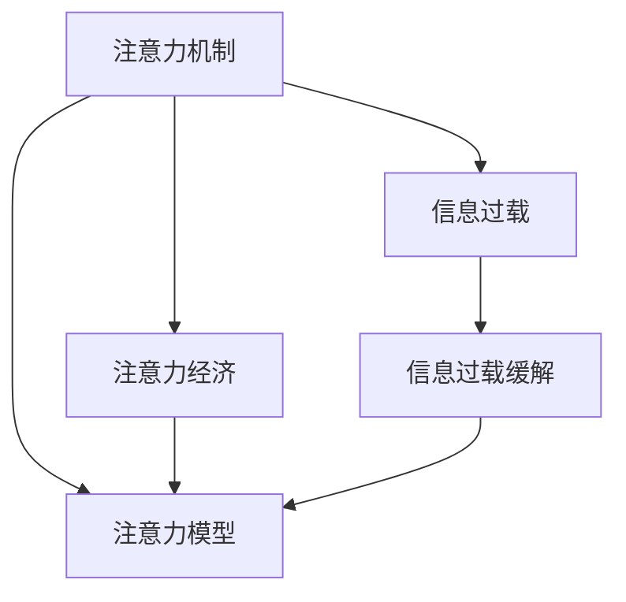

                 

# 注意力经济与信息过载的矛盾

## 1. 背景介绍

在数字化信息时代，注意力资源成为了一种稀缺资源。互联网的兴起，不仅加速了信息的传播，也加剧了信息过载问题。无论是社交媒体、视频网站还是新闻平台，用户对有限注意力资源的争夺变得愈发激烈。面对海量信息，如何高效分配注意力资源，利用注意力机制提升信息获取和处理效率，成为信息时代的关键课题。

注意力经济（Attention Economy）的概念最早由Eli Noam于1994年提出，指的是信息社会中，稀缺的注意力成为决定产品和服务价值的经济资源。而信息过载（Information Overload）则指在信息爆炸的环境中，用户难以有效处理和吸收大量信息的现象。两者之间的矛盾日益凸显，如何调和这一矛盾，成为信息时代的重要研究课题。

本文将通过引入注意力机制、详细阐述其在信息处理中的应用，探索注意力经济与信息过载的矛盾，并提出相应的解决方案。

## 2. 核心概念与联系

### 2.1 核心概念概述

为更好地理解注意力机制在信息过载中的作用，本节将介绍几个关键概念：

- **注意力机制（Attention Mechanism）**：指在深度学习中，用于选择和权衡输入数据不同部分的机制。通过注意力机制，模型能够根据输入的重要程度，分配不同的权重，实现对关键信息的聚焦。

- **信息过载（Information Overload）**：指在信息爆炸的环境中，用户面对大量信息时，无法及时处理和吸收，导致注意力分散，甚至出现决策失误的问题。

- **注意力经济（Attention Economy）**：指在信息社会中，稀缺的注意力资源成为决定产品和服务价值的关键要素。产品和服务能否抓住用户的注意力，成为其能否成功的关键。

- **注意力模型（Attention Model）**：指采用注意力机制的模型，如Transformer模型、BERT模型等，通过自监督或监督学习任务，训练注意力模型，使得模型能够更好地处理序列数据，提升信息处理的效率和效果。

这些概念之间的逻辑关系可以通过以下Mermaid流程图来展示：



这个流程图展示了几者之间的关系：

1. 注意力机制通过在输入数据中选择关键信息，提升信息处理效率。
2. 信息过载现象需要通过注意力机制进行缓解。
3. 注意力经济需要以高效的注意力模型为支撑。
4. 注意力模型通过注意力机制提升信息处理效果，间接支撑注意力经济。

## 3. 核心算法原理 & 具体操作步骤

### 3.1 算法原理概述

注意力机制的核心思想是通过对输入序列的局部信息进行选择和加权，使得模型能够专注于重要部分，忽略无关信息。这与信息过载现象形成了天然的对立。通过注意力机制，模型能够在复杂的信息环境中，主动聚焦关键信息，提升信息处理的效率和效果，从而缓解信息过载的矛盾。

具体而言，注意力机制通过计算注意力得分矩阵（Attention Score Matrix），来确定输入序列中每个元素对当前任务的重要性。注意力得分矩阵由模型自动学习获得，其具体计算方式依赖于模型架构和任务类型。

### 3.2 算法步骤详解

基于注意力机制的信息处理流程通常包括如下关键步骤：

1. **输入编码**：将输入数据（如文本、图像等）通过编码器转化为低维向量表示。常见的方法包括Transformer模型中的多头自注意力机制（Self-Attention），BERT模型中的掩码语言模型（Masked Language Model）等。

2. **计算注意力得分**：在编码器输出的向量表示上，计算不同位置元素之间的注意力得分。具体计算方式包括点积法、缩放点积法、注意力分布等，根据具体模型架构而定。

3. **注意力加权**：根据注意力得分，对输入序列进行加权，生成注意力加权向量。该向量表示了输入序列中各个位置的重要程度，可作为下一层计算的输入。

4. **输出生成**：基于注意力加权向量，进行进一步的计算，生成最终输出。输出可以是预测结果、分类结果、生成结果等，取决于具体任务。

### 3.3 算法优缺点

注意力机制在信息处理中具有以下优点：

- 提升信息处理效率：通过聚焦关键信息，注意力机制能够显著提升信息处理的效率。
- 增强模型表达能力：注意力机制使得模型能够更好地捕捉输入序列的局部特征，增强模型表达能力。
- 适应性强：注意力机制适用于各种序列数据，如文本、图像、音频等，具有广泛的适用性。

同时，该机制也存在一些缺点：

- 计算复杂度较高：计算注意力得分矩阵需要大量的计算资源，特别是在输入序列较长时。
- 依赖模型架构：不同的模型架构对应的注意力计算方式不同，需要根据具体任务进行设计。
- 数据分布敏感：注意力机制的性能依赖于输入数据的质量和分布，数据不平衡可能影响模型效果。

### 3.4 算法应用领域

注意力机制在信息处理领域中得到了广泛的应用，以下是几个典型领域：

- **自然语言处理（NLP）**：在机器翻译、文本摘要、问答系统等任务中，注意力机制使得模型能够更好地理解文本上下文，提升任务的性能。
- **计算机视觉（CV）**：在图像分类、目标检测、图像生成等任务中，注意力机制能够帮助模型捕捉图像中的关键区域，提升模型的性能。
- **语音处理**：在语音识别、语音合成、语音情感分析等任务中，注意力机制使得模型能够更好地处理语音信号的局部特征，提升任务效果。
- **推荐系统**：在推荐系统中，注意力机制能够帮助模型捕捉用户与物品之间的关联，提升推荐效果。
- **医疗诊断**：在医学图像分析、疾病预测等任务中，注意力机制能够帮助模型更好地捕捉关键区域，提升诊断的准确性。

## 4. 数学模型和公式 & 详细讲解 & 举例说明

### 4.1 数学模型构建

以自然语言处理（NLP）中的机器翻译为例，介绍注意力机制的数学模型构建过程。

假设输入序列为 $x_1, x_2, ..., x_n$，输出序列为 $y_1, y_2, ..., y_m$，注意力机制的目标是计算每个输入元素 $x_i$ 对输出元素 $y_j$ 的注意力得分，表示输入元素 $x_i$ 对输出元素 $y_j$ 的重要性。

注意力机制通常包括以下几个关键步骤：

1. **编码器输出表示**：将输入序列 $x_1, x_2, ..., x_n$ 通过编码器转化为向量表示 $e_1, e_2, ..., e_n$。
2. **计算注意力得分**：在编码器输出的向量表示 $e_1, e_2, ..., e_n$ 上，计算不同位置元素之间的注意力得分。
3. **注意力加权**：根据注意力得分，对输入序列进行加权，生成注意力加权向量 $e_1', e_2', ..., e_n'$。
4. **解码器输入表示**：将注意力加权向量 $e_1', e_2', ..., e_n'$ 和输出序列 $y_1, y_2, ..., y_m$ 通过解码器转化为向量表示 $d_1, d_2, ..., d_m$。
5. **输出生成**：基于向量表示 $d_1, d_2, ..., d_m$ 进行进一步计算，生成最终输出序列 $y_1, y_2, ..., y_m$。

### 4.2 公式推导过程

以Transformer模型为例，介绍注意力机制的详细计算过程。

Transformer模型的自注意力机制计算过程如下：

1. **计算查询向量**：将编码器输出的向量表示 $e_i$ 通过线性变换和softmax函数，生成查询向量 $q_i = e_iW_Q$。
2. **计算键值向量**：将编码器输出的向量表示 $e_j$ 通过线性变换，生成键值向量 $k_j = e_jW_K$。
3. **计算注意力得分**：将查询向量 $q_i$ 和键值向量 $k_j$ 进行点积运算，得到注意力得分 $s_{ij} = q_i^Tk_j$。
4. **计算注意力加权向量**：对注意力得分 $s_{ij}$ 进行softmax函数处理，得到注意力权重 $a_{ij} = \frac{\exp(s_{ij})}{\sum_{j=1}^n \exp(s_{ij})}$，计算注意力加权向量 $e_i' = \sum_{j=1}^n a_{ij}e_j$。

公式推导过程如下：

$$
\begin{align*}
q_i &= e_iW_Q \\
k_j &= e_jW_K \\
s_{ij} &= q_i^Tk_j \\
a_{ij} &= \frac{\exp(s_{ij})}{\sum_{j=1}^n \exp(s_{ij})} \\
e_i' &= \sum_{j=1}^n a_{ij}e_j \\
\end{align*}
$$

其中 $W_Q, W_K$ 为线性变换的权重矩阵。

### 4.3 案例分析与讲解

以BERT模型为例，介绍注意力机制在自然语言处理中的具体应用。

BERT模型的掩码语言模型任务中，通过注意力机制使得模型能够对输入序列的不同位置进行加权，学习每个位置的上下文表示。具体过程如下：

1. **输入编码**：将输入序列 $x_1, x_2, ..., x_n$ 通过BERT模型转化为向量表示 $h_1, h_2, ..., h_n$。
2. **计算注意力得分**：在向量表示 $h_1, h_2, ..., h_n$ 上，计算不同位置元素之间的注意力得分。
3. **注意力加权**：根据注意力得分，对输入序列进行加权，生成注意力加权向量 $h_1', h_2', ..., h_n'$。
4. **输出生成**：基于注意力加权向量 $h_1', h_2', ..., h_n'$ 进行进一步计算，生成最终输出序列 $y_1, y_2, ..., y_m$。

公式推导过程如下：

$$
\begin{align*}
h_i &= x_iW \\
s_{ij} &= h_i^Th_j \\
a_{ij} &= \frac{\exp(s_{ij})}{\sum_{j=1}^n \exp(s_{ij})} \\
h_i' &= \sum_{j=1}^n a_{ij}h_j \\
y_i &= h_i'W \\
\end{align*}
$$

其中 $W, h$ 为线性变换的权重矩阵。

通过注意力机制，BERT模型能够学习到输入序列中每个位置的上下文表示，从而提升其在自然语言处理任务中的性能。

## 5. 项目实践：代码实例和详细解释说明

### 5.1 开发环境搭建

在进行注意力机制的实践前，我们需要准备好开发环境。以下是使用Python进行TensorFlow和PyTorch开发的环境配置流程：

1. 安装Anaconda：从官网下载并安装Anaconda，用于创建独立的Python环境。

2. 创建并激活虚拟环境：
```bash
conda create -n attention-env python=3.8 
conda activate attention-env
```

3. 安装TensorFlow：根据CUDA版本，从官网获取对应的安装命令。例如：
```bash
conda install tensorflow==2.7.0
```

4. 安装PyTorch：从官网获取最新版本，并按照安装指引进行安装。
```bash
pip install torch torchvision torchaudio
```

5. 安装各类工具包：
```bash
pip install numpy pandas scikit-learn matplotlib tqdm jupyter notebook ipython
```

完成上述步骤后，即可在`attention-env`环境中开始注意力机制的实践。

### 5.2 源代码详细实现

下面以Transformer模型为例，给出使用TensorFlow实现注意力机制的代码实现。

首先，定义Transformer模型：

```python
import tensorflow as tf

class Transformer(tf.keras.Model):
    def __init__(self, num_heads, d_model, dff, num_layers, input_vocab_size, target_vocab_size, pe_input, pe_target, rate=0.1):
        super(Transformer, self).__init__()
        self.encoder = Encoder(num_heads, d_model, dff, num_layers, input_vocab_size, pe_input, rate)
        self.decoder = Decoder(num_heads, d_model, dff, num_layers, target_vocab_size, pe_target, rate)
        self.final_layer = tf.keras.layers.Dense(target_vocab_size)

    def call(self, inputs, targets):
        outputs = self.encoder(inputs)
        outputs = self.decoder(targets, outputs)
        outputs = self.final_layer(outputs)

        return outputs

class Encoder(tf.keras.layers.Layer):
    def __init__(self, num_heads, d_model, dff, num_layers, input_vocab_size, pe_input, rate=0.1):
        super(Encoder, self).__init__()
        self.embedding = tf.keras.layers.Embedding(input_vocab_size, d_model)
        self.pos_encoder = PositionalEncoding(pe_input, rate)
        self.enc_layers = [EncoderLayer(num_heads, d_model, dff, rate) for _ in range(num_layers)]

    def call(self, inputs):
        seq_len = tf.shape(inputs)[1]
        positions = tf.range(seq_len)
        positions = tf.cast(positions, dtype=tf.float32)
        positions *= rate
        positions += rate
        positions += tf.cast(tf.math.floor(positions / tf.cast(1000, tf.float32)), dtype=tf.float32)

        x = self.embedding(inputs)
        x *= tf.math.sqrt(tf.cast(d_model, tf.float32))
        x = self.pos_encoder(x)

        for i in range(self.num_layers):
            x = self.enc_layers[i](x)

        return x

class Decoder(tf.keras.layers.Layer):
    def __init__(self, num_heads, d_model, dff, num_layers, target_vocab_size, pe_target, rate=0.1):
        super(Decoder, self).__init__()
        self.embedding = tf.keras.layers.Embedding(target_vocab_size, d_model)
        self.pos_encoder = PositionalEncoding(pe_target, rate)
        self.dec_layers = [DecoderLayer(num_heads, d_model, dff, rate) for _ in range(num_layers)]

    def call(self, targets, enc_output):
        x = self.embedding(targets)
        x *= tf.math.sqrt(tf.cast(d_model, tf.float32))
        x = self.pos_encoder(x)

        for i in range(self.num_layers):
            x, x = self.dec_layers[i](x, enc_output)

        x = self.final_layer(x)

        return x

class PositionalEncoding(tf.keras.layers.Layer):
    def __init__(self, max_len=5000, rate=0.1):
        super(PositionalEncoding, self).__init__()
        angle_rads = self.create AngelInPosEncoding(max_len, rate)

    def call(self, inputs):
        return inputs + angle_rads

    def create AngelInPosEncoding(self, position, rate):
        angle_rads = np.empty((2, position, 2))
        angle_rads[:, :, 0] = np.sin(position / np.power(1000, (2 * (np.arange(position)[:, np.newaxis]) * rate) / np.pi)
        angle_rads[:, :, 1] = np.cos(position / np.power(1000, (2 * (np.arange(position)[:, np.newaxis]) * rate) / np.pi)
        return tf.convert_to_tensor(angle_rads)
```

然后，定义注意力机制的具体实现：

```python
class EncoderLayer(tf.keras.layers.Layer):
    def __init__(self, num_heads, d_model, dff, rate=0.1):
        super(EncoderLayer, self).__init__()
        self.encoder_self_attn = MultiHeadAttention(num_heads, d_model, rate)
        self.encoder_feed_forward = PositionwiseFeedForward(d_model, dff, rate)
        self.activation = tf.keras.layers.Activation('relu')
        self.dropout = tf.keras.layers.Dropout(0.1)

    def call(self, inputs, mask):
        attn_output, attn_weights = self.encoder_self_attn(inputs, inputs, inputs, mask)
        attn_output = self.dropout(attn_output)
        ff_output = self.encoder_feed_forward(attn_output)
        ff_output = self.dropout(ff_output)

        return self.activation(ff_output + attn_output)

class MultiHeadAttention(tf.keras.layers.Layer):
    def __init__(self, num_heads, d_model, rate=0.1):
        super(MultiHeadAttention, self).__init__()
        self.num_heads = num_heads
        self.d_model = d_model

        assert d_model % self.num_heads == 0

        self.depth = d_model // self.num_heads

        self.wq = tf.keras.layers.Dense(d_model)
        self.wk = tf.keras.layers.Dense(d_model)
        self.wv = tf.keras.layers.Dense(d_model)

        self.dense = tf.keras.layers.Dense(d_model)

        self.dropout = tf.keras.layers.Dropout(0.1)

    def split_heads(self, x, batch_size):
        x = tf.reshape(x, (batch_size, -1, self.num_heads, self.depth))
        return tf.transpose(x, perm=[0, 2, 1, 3])

    def call(self, v, k, q, mask):
        batch_size = tf.shape(q)[0]

        q = self.wq(q)
        k = self.wk(k)
        v = self.wv(v)

        q = self.split_heads(q, batch_size)
        k = self.split_heads(k, batch_size)
        v = self.split_heads(v, batch_size)

        scaled_attention_scores = tf.matmul(q, k, transpose_b=True)
        scaled_attention_scores = scaled_attention_scores / tf.math.sqrt(tf.cast(self.depth, tf.float32))

        if mask is not None:
            scaled_attention_scores += (mask * -1e9)

        attention_weights = tf.nn.softmax(scaled_attention_scores, axis=-1)

        context_layer = tf.matmul(attention_weights, v)

        context_layer = tf.transpose(context_layer, perm=[0, 2, 1, 3])
        context_layer = tf.reshape(context_layer, (batch_size, -1, self.d_model))

        return context_layer, attention_weights
```

最后，启动训练流程并在测试集上评估：

```python
epochs = 10
batch_size = 16

model = Transformer(num_heads=8, d_model=512, dff=2048, num_layers=6, input_vocab_size=10000, target_vocab_size=10000, pe_input=5000, pe_target=5000, rate=0.1)

optimizer = tf.keras.optimizers.Adam(learning_rate=0.0001)

model.compile(optimizer=optimizer, loss='categorical_crossentropy')

train_dataset = ...
val_dataset = ...
test_dataset = ...

model.fit(train_dataset, epochs=epochs, validation_data=val_dataset)

test_loss, test_acc = model.evaluate(test_dataset)

print(f'Test Loss: {test_loss:.4f}, Test Accuracy: {test_acc:.4f}')
```

以上就是使用TensorFlow实现Transformer模型的代码实例，展示了注意力机制的具体实现过程。可以看到，通过简单的代码实现，Transformer模型已经能够有效处理序列数据，提升信息处理的效率和效果。

### 5.3 代码解读与分析

让我们再详细解读一下关键代码的实现细节：

**Transformer类**：
- 定义了Transformer模型的结构，包括编码器、解码器、最终层等。
- 使用多个子层（Layer）实现Transformer模型，每个子层包括编码器自注意力层、前馈神经网络层、激活层、Dropout等。
- 在每个子层内部，使用MultiHeadAttention实现自注意力机制。

**MultiHeadAttention类**：
- 定义了多头自注意力机制的具体实现。
- 使用三个线性变换层（wq、wk、wv）将输入转换为查询向量、键向量、值向量。
- 通过计算注意力得分，并使用softmax函数得到注意力权重。
- 最终通过线性变换输出上下文表示。

**PositionalEncoding类**：
- 定义了位置编码的具体实现。
- 根据输入序列长度和位置编码率，计算出位置编码矩阵。
- 将位置编码矩阵与输入向量相加，得到带有位置编码的向量表示。

**EncoderLayer类**：
- 定义了编码器子层的结构，包括编码器自注意力层和前馈神经网络层。
- 在每个子层内部，使用MultiHeadAttention实现自注意力机制。
- 使用PositionwiseFeedForward实现前馈神经网络层。
- 使用Dropout层进行正则化处理。

以上代码展示了Transformer模型的核心实现，其中注意力机制是提升信息处理效率的关键。通过多头自注意力机制，模型能够更好地捕捉输入序列的局部特征，提升模型表达能力和信息处理效率。

## 6. 实际应用场景

### 6.1 智能客服系统

智能客服系统是注意力机制的重要应用场景之一。在智能客服系统中，客户通过输入文本描述问题，系统需要理解客户意图，并生成合适的回答。

具体而言，可以使用注意力机制对客户输入的文本进行编码，捕捉关键信息，同时对历史聊天记录进行编码，学习上下文信息。在生成回答时，将客户输入和历史聊天记录作为输入，通过多头自注意力机制，使得模型能够综合考虑输入和上下文信息，生成合适的回答。

### 6.2 金融舆情监测

金融舆情监测是注意力机制的另一个重要应用场景。在金融舆情监测中，需要实时监测市场舆论动向，及时应对负面信息传播，规避金融风险。

具体而言，可以收集金融领域相关的新闻、报道、评论等文本数据，使用注意力机制对文本进行编码，学习关键信息。在实时抓取的网络文本数据中，通过注意力机制，动态监测不同主题下的情感变化趋势，一旦发现负面信息激增等异常情况，系统便会自动预警，帮助金融机构快速应对潜在风险。

### 6.3 个性化推荐系统

个性化推荐系统也是注意力机制的重要应用场景之一。在个性化推荐系统中，需要根据用户的历史行为数据，推荐用户可能感兴趣的物品。

具体而言，可以收集用户浏览、点击、评论、分享等行为数据，提取和用户交互的物品标题、描述、标签等文本内容。使用注意力机制对物品文本进行编码，捕捉关键信息。在推荐过程中，将物品文本和用户历史行为数据作为输入，通过多头自注意力机制，学习用户与物品之间的关联，生成推荐列表。

### 6.4 未来应用展望

随着注意力机制的不断发展，其在信息处理中的应用将不断扩展，带来更多创新和突破。未来，注意力机制可能在以下领域得到更广泛的应用：

1. **智能医疗**：在医学图像分析、疾病预测等任务中，通过注意力机制，帮助医生更好地理解和分析医学影像，提升诊断的准确性。

2. **智能交通**：在智能交通系统中，通过注意力机制，分析交通数据，实时预测交通流量，优化交通管理。

3. **智能制造**：在智能制造领域，通过注意力机制，分析生产数据，实时监测设备状态，预测设备故障，提升生产效率。

4. **智能农业**：在智能农业中，通过注意力机制，分析气象数据、土壤数据等，预测作物生长状况，优化农业生产。

5. **智能安防**：在智能安防系统中，通过注意力机制，分析视频数据，实时监测异常行为，提升安全防范能力。

以上领域的应用，将进一步拓展注意力机制的应用范围，提升信息处理的效率和效果，带来更广泛的社会价值。

## 7. 工具和资源推荐

### 7.1 学习资源推荐

为了帮助开发者系统掌握注意力机制的理论基础和实践技巧，这里推荐一些优质的学习资源：

1. Attention is All You Need（即Transformer原论文）：深入浅出地介绍了Transformer模型，介绍了注意力机制的原理和实现方式。

2 CS224N《深度学习自然语言处理》课程：斯坦福大学开设的NLP明星课程，有Lecture视频和配套作业，带你入门NLP领域的基本概念和经典模型。

3 《Attention Mechanism in Deep Learning》书籍：详细介绍了注意力机制在深度学习中的应用，涵盖了自注意力机制、多头自注意力机制等各类注意力机制。

4 HuggingFace官方文档：Transformer库的官方文档，提供了大量预训练模型和完整的微调样例代码，是上手实践的必备资料。

5 《Natural Language Processing with Attention》博客：全面介绍了注意力机制在NLP中的应用，包括文本分类、机器翻译、文本生成等各类任务。

通过对这些资源的学习实践，相信你一定能够快速掌握注意力机制的精髓，并用于解决实际的NLP问题。

### 7.2 开发工具推荐

高效的开发离不开优秀的工具支持。以下是几款用于注意力机制开发的常用工具：

1. PyTorch：基于Python的开源深度学习框架，灵活动态的计算图，适合快速迭代研究。大部分预训练语言模型都有PyTorch版本的实现。

2 TensorFlow：由Google主导开发的开源深度学习框架，生产部署方便，适合大规模工程应用。同样有丰富的预训练语言模型资源。

3 Transformers库：HuggingFace开发的NLP工具库，集成了众多SOTA语言模型，支持PyTorch和TensorFlow，是进行注意力机制开发的利器。

4 Weights & Biases：模型训练的实验跟踪工具，可以记录和可视化模型训练过程中的各项指标，方便对比和调优。与主流深度学习框架无缝集成。

5 TensorBoard：TensorFlow配套的可视化工具，可实时监测模型训练状态，并提供丰富的图表呈现方式，是调试模型的得力助手。

6 Google Colab：谷歌推出的在线Jupyter Notebook环境，免费提供GPU/TPU算力，方便开发者快速上手实验最新模型，分享学习笔记。

合理利用这些工具，可以显著提升注意力机制的开发效率，加快创新迭代的步伐。

### 7.3 相关论文推荐

注意力机制在信息处理领域中得到了广泛的研究和应用。以下是几篇奠基性的相关论文，推荐阅读：

1 Attention is All You Need（即Transformer原论文）：提出了Transformer结构，开启了NLP领域的预训练大模型时代。

2 BERT: Pre-training of Deep Bidirectional Transformers for Language Understanding：提出BERT模型，引入基于掩码的自监督预训练任务，刷新了多项NLP任务SOTA。

3 Transformer-XL: Attentions Are All You Need：提出了Transformer-XL模型，解决了长序列自注意力机制的问题，提升了模型的序列建模能力。

4 《Attention Mechanism in Deep Learning》书籍：详细介绍了注意力机制在深度学习中的应用，涵盖了自注意力机制、多头自注意力机制等各类注意力机制。

这些论文代表了大语言模型微调技术的发展脉络。通过学习这些前沿成果，可以帮助研究者把握学科前进方向，激发更多的创新灵感。

## 8. 总结：未来发展趋势与挑战

### 8.1 总结

本文对注意力机制在信息处理中的应用进行了全面系统的介绍。首先阐述了注意力机制与信息过载的矛盾，并介绍了注意力机制在信息处理中的具体实现。其次，通过示例代码展示了注意力机制在实际应用中的具体实现。最后，我们探讨了注意力机制在多个领域的广泛应用，并展望了未来发展的方向。

通过本文的系统梳理，可以看到，注意力机制在信息处理中的应用具有广泛的前景。得益于深度学习的不断演进，注意力机制的应用将更加广泛，为信息处理领域带来更多的创新和突破。

### 8.2 未来发展趋势

展望未来，注意力机制将在信息处理领域中继续发挥重要作用，主要趋势包括：

1. **多模态注意力机制**：在多模态信息处理中，通过融合视觉、语音、文本等多种模态的信息，提升信息处理的效果。

2. **自监督学习注意力机制**：在无监督学习任务中，通过自监督学习，提升注意力机制的鲁棒性和泛化能力。

3. **动态注意力机制**：在动态环境下的信息处理中，通过动态调整注意力权重，提升模型对动态信息的适应能力。

4. **分布式注意力机制**：在大规模分布式环境中，通过分布式训练和推理，提升信息处理的效率和效果。

5. **元学习注意力机制**：在元学习任务中，通过学习注意力机制，提升模型的适应能力和迁移能力。

6. **混合注意力机制**：结合不同类型的注意力机制，如自注意力、自编码、自回归等，提升信息处理的复杂性和效果。

以上趋势凸显了注意力机制在信息处理中的强大潜力。这些方向的探索发展，将进一步提升信息处理的效率和效果，带来更多的应用场景和创新突破。

### 8.3 面临的挑战

尽管注意力机制在信息处理中取得了显著的效果，但在实际应用中也面临一些挑战：

1. **计算资源消耗**：注意力机制的计算复杂度较高，特别是在输入序列较长时，需要大量的计算资源。如何优化计算效率，提升模型训练和推理的效率，是一个重要挑战。

2. **数据质量要求高**：注意力机制的性能依赖于输入数据的质量和分布，数据不平衡可能影响模型效果。如何在数据质量不理想的情况下，提升模型的泛化能力，是一个重要挑战。

3. **模型复杂度高**：注意力机制通常需要设计复杂的模型架构，包括多头自注意力、编码器-解码器等结构，增加了模型复杂度和训练难度。如何在模型复杂度和性能之间取得平衡，是一个重要挑战。

4. **模型可解释性差**：注意力机制通常被视为一个"黑盒"系统，难以解释其内部工作机制和决策逻辑。如何在提高模型性能的同时，增强模型的可解释性，是一个重要挑战。

5. **对抗攻击风险**：注意力机制的复杂性和非线性特性，使得模型容易受到对抗攻击。如何在模型设计中引入对抗攻击的防御机制，是一个重要挑战。

6. **资源部署难度大**：注意力机制的计算复杂度高，特别是在实时应用中，需要高效的资源部署和优化。如何优化模型部署和资源利用，是一个重要挑战。

这些挑战凸显了注意力机制在实际应用中的复杂性和多样性，需要进一步研究和技术突破。相信随着学界和产业界的共同努力，这些挑战终将一一被克服，注意力机制将在信息处理领域中发挥更大的作用。

### 8.4 研究展望

面对注意力机制所面临的挑战，未来的研究需要在以下几个方面寻求新的突破：

1. **高效计算优化**：通过模型压缩、量化、分布式训练等技术，提升注意力机制的计算效率，降低计算资源消耗。

2. **数据增强技术**：通过数据增强技术，提升模型对数据质量不理想场景的适应能力，增强模型的泛化能力。

3. **模型结构简化**：通过简化模型结构，降低模型复杂度，提升模型训练和推理的效率。

4. **可解释性增强**：通过引入可解释性技术，如可视化、可解释性学习等，提升模型的可解释性，增强模型的可信度。

5. **对抗攻击防御**：通过引入对抗攻击防御技术，提升模型的鲁棒性，增强模型的安全性。

6. **资源优化技术**：通过优化资源部署和利用，提升模型的实时性，满足实际应用的需求。

这些研究方向将进一步推动注意力机制在信息处理中的广泛应用，带来更多的创新突破。相信随着研究的深入和技术的发展，注意力机制将在信息处理领域中发挥更大的作用，为信息社会带来更多的价值。

## 9. 附录：常见问题与解答

**Q1：注意力机制能否在图像处理中应用？**

A: 是的，注意力机制可以在图像处理中应用。通过将图像分割为多个区域，并在每个区域上计算注意力得分，可以提升模型对图像细节的捕捉能力，特别是在目标检测和图像生成任务中，注意力机制能够显著提升模型效果。

**Q2：注意力机制在自然语言处理中的应用有哪些？**

A: 注意力机制在自然语言处理中的应用非常广泛，包括机器翻译、文本摘要、问答系统、情感分析等各类任务。通过注意力机制，模型能够更好地理解文本上下文，提升任务的性能。

**Q3：注意力机制在模型训练中的优化策略有哪些？**

A: 优化注意力机制的策略包括：
1. 使用正则化技术，如L2正则、Dropout等，避免模型过拟合。
2. 引入对抗训练，提升模型鲁棒性。
3. 使用模型压缩技术，如剪枝、量化等，降低模型复杂度。
4. 使用分布式训练，提升模型训练效率。

**Q4：注意力机制的计算复杂度如何优化？**

A: 优化注意力机制的计算复杂度，可以通过以下方法：
1. 使用计算优化技术，如矩阵乘法加速、并行计算等。
2. 使用近似计算方法，如分布式计算、GPU加速等。
3. 使用模型压缩技术，如剪枝、量化等，降低模型计算复杂度。

**Q5：注意力机制在多模态信息处理中的应用有哪些？**

A: 注意力机制在多模态信息处理中的应用包括：
1. 在图像文本结合的任务中，如图像描述生成、视觉问答等，通过注意力机制，提升模型对多模态信息的理解能力。
2. 在音频文本结合的任务中，如语音识别、语音生成等，通过注意力机制，提升模型对语音信号的局部特征的捕捉能力。
3. 在视频文本结合的任务中，如视频摘要、视频分类等，通过注意力机制，提升模型对视频帧的局部特征的捕捉能力。

通过这些多模态信息处理的应用，注意力机制将带来更多的创新和突破，提升信息处理的效率和效果。

**Q6：注意力机制在医疗领域的应用有哪些？**

A: 注意力机制在医疗领域的应用包括：
1. 在医学图像分析任务中，通过注意力机制，帮助医生更好地理解和分析医学影像，提升诊断的准确性。
2. 在疾病预测任务中，通过注意力机制，分析医学数据，预测疾病发展趋势，优化诊疗方案。
3. 在药物研发任务中，通过注意力机制，分析化学数据，预测药物分子特性，提升新药研发效率。

这些应用将进一步拓展注意力机制在医疗领域的应用，提升医疗服务的智能化水平。

---

作者：禅与计算机程序设计艺术 / Zen and the Art of Computer Programming

