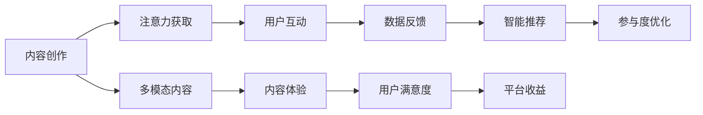

                 

# 注意力经济与内容创作最佳实践：吸引并留住受众的参与

## 1. 背景介绍

### 1.1 问题由来
在信息爆炸的时代，获取、处理和利用信息成为了人们日常生活的重要组成部分。然而，信息过载也带来了选择困难，尤其是对于高质量内容的需求日益增加。在这种情况下，如何吸引受众的注意力、提升内容的影响力，成为了内容创作者和平台运营商面临的关键问题。

注意力经济，是指在互联网时代，信息资源的争夺更加激烈，内容创作者和平台运营商需要通过吸引和保持受众的注意力，从而获得更多的关注和收益。这种经济模式与传统的广告经济模式有所不同，后者更多依赖于受众的被动消费。因此，如何在庞大的信息流中脱颖而出，成为内容创作者和平台运营商需要解决的难题。

### 1.2 问题核心关键点
注意力经济的核心在于如何设计高效、互动的内容形式，吸引并留住受众的注意力，使其在短时间内形成较高的参与度。这包括：
- 设计有吸引力的内容形式，如视频、图文、直播等。
- 构建多模态内容体验，提供丰富的互动方式，如点赞、评论、分享等。
- 运用数据分析，实时调整内容策略，优化用户参与度。
- 利用AI技术，提升内容创作和推荐的智能化水平。

## 2. 核心概念与联系

### 2.1 核心概念概述

注意力经济与内容创作的联系主要体现在以下几个方面：

- **内容创作**：是指内容创作者通过文字、图像、视频等形式，创造有价值、有吸引力的内容，吸引受众的注意力。
- **注意力经济**：是指通过吸引受众的注意力，达到提升内容影响力、增加收益的目的。
- **多模态内容体验**：通过结合文字、图像、视频、音频等多模态形式，提升内容的互动性和趣味性，增强用户参与度。
- **智能推荐系统**：利用机器学习和数据分析技术，根据用户行为和偏好，推荐个性化的内容，提升用户体验和参与度。
- **用户参与度**：指用户对内容的互动程度，包括点赞、评论、分享等行为，是衡量内容影响力的一个重要指标。

这些核心概念之间相互关联，共同构成了注意力经济与内容创作的核心框架。

### 2.2 核心概念原理和架构的 Mermaid 流程图



这个流程图展示了注意力经济与内容创作的流程：内容创作通过多模态内容形式吸引受众的注意力，用户通过互动反馈数据，平台利用智能推荐系统优化参与度，最终提升平台收益。

## 3. 核心算法原理 & 具体操作步骤

### 3.1 算法原理概述

内容创作和注意力获取的过程，本质上是信息传播和受众反馈的动态交互过程。其核心原理包括以下几点：

- **信息传播理论**：信息传播理论认为，信息的传播效果取决于信息的内容质量、传播方式和受众的特点。优质、创新、互动性强的内容更容易吸引受众的注意力。
- **受众行为分析**：通过分析受众的行为数据，可以了解受众的兴趣偏好、消费习惯等，从而优化内容创作和推荐策略。
- **机器学习与推荐系统**：机器学习算法可以通过分析用户历史行为数据，预测用户兴趣，推荐个性化内容，提升用户参与度。

### 3.2 算法步骤详解

1. **内容创作**：
   - 选择合适的创作工具和平台，进行内容创作。
   - 设计有吸引力的标题和内容形式，如视频、图文、直播等。
   - 加入互动元素，如投票、评论、点赞等，提升用户参与度。
   - 利用数据分析工具，实时监控内容表现，及时调整创作策略。

2. **注意力获取**：
   - 在内容发布初期，通过推广、广告等方式提升内容的曝光度。
   - 利用SEO优化，提高内容的搜索引擎排名。
   - 运用社交媒体传播，扩大内容的传播范围。

3. **用户互动**：
   - 提供互动接口，如点赞、评论、分享等，增强用户参与度。
   - 分析用户互动数据，了解用户偏好，优化内容创作。
   - 设计有奖互动活动，如抽奖、竞赛等，增加用户黏性。

4. **数据反馈**：
   - 收集用户互动数据，如点赞数、评论数、分享数等。
   - 分析数据，识别用户兴趣和行为模式。
   - 根据数据分析结果，调整内容创作和传播策略。

5. **智能推荐**：
   - 利用机器学习算法，分析用户历史行为数据，推荐个性化内容。
   - 实时监控推荐效果，优化推荐策略。
   - 引入多模态内容，提升推荐效果。

6. **参与度优化**：
   - 利用数据分析工具，实时监控用户参与度。
   - 分析参与度数据，识别用户流失原因。
   - 根据分析结果，优化内容策略，提升用户参与度。

### 3.3 算法优缺点

**优点**：
- 提升内容创作的个性化和互动性，增强用户体验。
- 利用数据分析，优化内容策略，提升用户参与度。
- 通过智能推荐，提升内容推荐的准确性和个性化水平。

**缺点**：
- 对数据分析和机器学习技术要求较高，需要具备一定的技术背景。
- 需要大量用户互动数据支持，数据隐私和安全问题值得关注。
- 对内容创作和推荐模型的质量要求高，需要持续优化。

### 3.4 算法应用领域

注意力经济与内容创作的应用领域非常广泛，主要包括以下几个方面：

- **社交媒体平台**：如微信、微博、抖音等，通过内容创作和注意力获取，提升用户参与度和平台收益。
- **视频平台**：如YouTube、Bilibili等，通过视频创作和智能推荐，提升用户观看时长和黏性。
- **新闻媒体**：如今日头条、新浪新闻等，通过内容推荐和数据分析，提升用户阅读量和广告收益。
- **在线教育**：如Coursera、Udacity等，通过视频和图文内容创作，提升用户参与度和学习效果。
- **电商平台**：如亚马逊、京东等，通过商品评价和内容推荐，提升用户购买决策和满意度。

## 4. 数学模型和公式 & 详细讲解 & 举例说明

### 4.1 数学模型构建

注意力经济与内容创作的核心数学模型包括内容推荐和用户互动模型。以下以视频推荐系统为例，构建内容推荐模型的基本框架。

### 4.2 公式推导过程

假设用户对视频的评分由两部分组成：视频内容质量和用户兴趣。用 $x$ 表示视频内容的质量，用 $y$ 表示用户兴趣，用 $p$ 表示用户对视频的评分，则有：

$$
p = x \cdot y + \epsilon
$$

其中 $\epsilon$ 表示随机误差。

在推荐系统中，通过用户的历史行为数据，可以估计用户兴趣 $y$。假设用户对 $n$ 个视频的评分数据为 $(x_1, p_1), (x_2, p_2), \ldots, (x_n, p_n)$，则用户兴趣 $y$ 可以通过线性回归模型估计：

$$
y = \alpha x + \beta
$$

其中 $\alpha$ 和 $\beta$ 为模型的参数。将 $y$ 代入 $p$ 的表达式中，得到：

$$
p = \alpha x^2 + (\beta + \alpha) x + \epsilon
$$

这个模型称为二次评分模型。

### 4.3 案例分析与讲解

以Netflix的视频推荐系统为例，Netflix通过用户历史观看数据和评分数据，训练模型预测用户对未观看视频的评分，从而推荐用户可能感兴趣的视频。Netflix的推荐系统采用了协同过滤算法，即通过用户的历史行为数据，寻找与当前用户兴趣相似的用户，根据相似用户的历史评分数据，预测当前用户的评分。

Netflix还引入了深度学习算法，通过用户画像和视频特征，构建用户兴趣向量 $y$ 和视频质量向量 $x$，计算用户对视频的评分 $p$。通过这种方式，Netflix能够更好地预测用户的兴趣，提升推荐效果。

## 5. 项目实践：代码实例和详细解释说明

### 5.1 开发环境搭建

在进行注意力经济与内容创作的应用开发前，需要搭建开发环境。以下是使用Python进行开发的环境配置流程：

1. 安装Anaconda：从官网下载并安装Anaconda，用于创建独立的Python环境。

2. 创建并激活虚拟环境：
```bash
conda create -n attention-env python=3.8 
conda activate attention-env
```

3. 安装所需库：
```bash
pip install pandas numpy scipy scikit-learn matplotlib jupyter notebook
```

完成上述步骤后，即可在`attention-env`环境中开始开发实践。

### 5.2 源代码详细实现

下面以Netflix视频推荐系统为例，给出使用Scikit-learn进行协同过滤算法的代码实现。

```python
from sklearn.metrics.pairwise import cosine_similarity
from sklearn.neighbors import NearestNeighbors

# 假设用户对视频的评分数据为 df
# df = pd.read_csv('movie_ratings.csv')

# 计算用户对视频的评分
user_ratings = df['user_id'].unique().tolist()
movie_ratings = df.groupby('user_id')['rating'].mean().round(2).to_dict()

# 构建用户兴趣矩阵
user_matrix = np.zeros((len(user_ratings), len(movie_ratings)))
for user in user_ratings:
    for movie, rating in movie_ratings[user].items():
        user_matrix[user_matrix.index(user), movie_matrix.index(movie)] = rating

# 使用cosine相似度计算用户之间的相似度
similarity_matrix = cosine_similarity(user_matrix)

# 使用KNN算法寻找与当前用户兴趣相似的用户
k = 20
nn = NearestNeighbors(metric='cosine', n_neighbors=k).fit(user_matrix)
distances, indices = nn.kneighbors(user_matrix)

# 根据相似用户的历史评分数据，预测当前用户的评分
def predict_rating(user, movie):
    similarity = similarity_matrix[user_matrix.index(user), movie_matrix.index(movie)]
    top_k_users = indices[user][1:1+k]
    top_k_ratings = user_matrix[top_k_users].mean(axis=0)
    prediction = top_k_ratings[movie_matrix.index(movie)]
    return prediction

# 测试
user = 12345
movie = 67890
rating = predict_rating(user, movie)
print(f'预测评分：{rating}')
```

这段代码首先计算用户对视频的评分，构建用户兴趣矩阵，并使用cosine相似度计算用户之间的相似度。然后，使用KNN算法寻找与当前用户兴趣相似的用户，根据相似用户的历史评分数据，预测当前用户的评分。

### 5.3 代码解读与分析

这段代码的核心逻辑如下：

- 首先，通过读取用户对视频的评分数据，计算用户对视频的评分，构建用户兴趣矩阵。
- 接着，使用cosine相似度计算用户之间的相似度，找出与当前用户兴趣相似的用户。
- 最后，根据相似用户的历史评分数据，预测当前用户的评分。

这种协同过滤算法在Netflix等推荐系统中得到了广泛应用。通过这种方式，Netflix能够更好地预测用户的兴趣，提升推荐效果。

## 6. 实际应用场景

### 6.1 智能推荐系统

智能推荐系统是注意力经济与内容创作的重要应用场景之一。通过分析用户的历史行为数据，推荐系统能够预测用户的兴趣，向用户推荐可能感兴趣的内容。

智能推荐系统广泛应用于电商、视频、新闻等多个领域，帮助用户发现更多有价值的内容，提升用户满意度和平台收益。

### 6.2 社交媒体内容推荐

社交媒体平台通过内容推荐，提升用户的参与度和留存率。平台可以通过分析用户互动数据，推荐用户可能感兴趣的内容，增加用户的活跃度和黏性。

例如，Twitter通过分析用户的历史互动数据，推荐可能感兴趣的话题和用户。Facebook通过分析用户的朋友圈数据，推荐可能感兴趣的文章和视频。

### 6.3 在线教育内容推荐

在线教育平台通过内容推荐，提升用户的课程完成率和满意度。平台可以通过分析用户的学习行为数据，推荐用户可能感兴趣的视频和课程。

例如，Coursera通过分析用户的学习历史和评价数据，推荐可能感兴趣的课程。Udacity通过分析用户的学习进度和互动数据，推荐可能感兴趣的视频。

### 6.4 未来应用展望

随着技术的不断发展，注意力经济与内容创作的应用将更加广泛和深入。以下是几个未来应用展望：

- **多模态内容推荐**：结合文字、图像、视频等多种内容形式，提升推荐效果。
- **用户行为预测**：通过深度学习算法，预测用户行为，提升推荐准确性。
- **跨平台推荐**：通过跨平台数据共享，提升推荐效果。
- **实时推荐**：通过实时数据分析，提升推荐的时效性和个性化水平。
- **个性化内容创作**：通过AI技术，生成个性化推荐内容，提升用户体验。

## 7. 工具和资源推荐

### 7.1 学习资源推荐

为了帮助开发者系统掌握注意力经济与内容创作的理论基础和实践技巧，这里推荐一些优质的学习资源：

1. 《推荐系统实战》系列博文：由推荐系统专家撰写，系统介绍了推荐系统的工作原理和应用案例。

2. 《Python机器学习》书籍：由知名数据科学家撰写，全面介绍了机器学习算法的实现方法和应用场景。

3. 《深度学习》课程：斯坦福大学开设的深度学习课程，涵盖深度学习的基本概念和算法。

4. Coursera推荐系统专项课程：由Coursera联合多所高校开设，系统介绍推荐系统的理论和实践。

5. Kaggle推荐系统竞赛：Kaggle平台上多个推荐系统竞赛，可以参与实践并学习最新的推荐算法。

通过对这些资源的学习实践，相信你一定能够快速掌握注意力经济与内容创作的精髓，并用于解决实际的推荐问题。

### 7.2 开发工具推荐

高效的开发离不开优秀的工具支持。以下是几款用于注意力经济与内容创作开发的常用工具：

1. Jupyter Notebook：开源的交互式编程环境，适合数据分析和算法实验。

2. Python IDEs：如PyCharm、VS Code等，提供丰富的开发工具和调试功能。

3. Scikit-learn：开源的机器学习库，提供了多种推荐算法实现。

4. TensorFlow：开源的深度学习框架，支持分布式计算和模型优化。

5. Kaggle：数据科学竞赛平台，提供海量数据集和算法实现，适合学习和实践。

合理利用这些工具，可以显著提升注意力经济与内容创作的开发效率，加快创新迭代的步伐。

### 7.3 相关论文推荐

注意力经济与内容创作的发展源于学界的持续研究。以下是几篇奠基性的相关论文，推荐阅读：

1. "The Web As A Tensor: Learning To Rank By Surfing Structured Web Data"（ICML 2004）：提出了基于超图的学习算法，用于解决信息检索中的排序问题。

2. "Item-based Collaborative Filtering Recommendation Algorithms"（SIGKDD 2008）：系统介绍了协同过滤算法的实现方法和应用场景。

3. "Content-Based Recommender Systems"（IEEE TKE 2002）：介绍了基于内容的推荐系统，通过分析物品特征提升推荐效果。

4. "Deep Collaborative Filtering"（ICLR 2017）：提出了深度协同过滤算法，通过深度神经网络提升推荐准确性。

5. "Personalized PageRank Algorithm"（ACM TIS 2005）：提出了基于PageRank的个性化推荐算法，提升推荐的个性化水平。

这些论文代表了大规模推荐系统的研究脉络。通过学习这些前沿成果，可以帮助研究者把握学科前进方向，激发更多的创新灵感。

## 8. 总结：未来发展趋势与挑战

### 8.1 总结

本文对注意力经济与内容创作的最佳实践进行了全面系统的介绍。首先阐述了注意力经济与内容创作的背景和意义，明确了多模态内容体验在提升用户参与度中的重要性。其次，从原理到实践，详细讲解了推荐系统的核心算法和操作步骤，给出了推荐系统的代码实现。同时，本文还广泛探讨了注意力经济与内容创作在社交媒体、在线教育、视频平台等多个领域的应用前景，展示了该技术的广阔前景。此外，本文精选了推荐系统的各类学习资源，力求为读者提供全方位的技术指引。

通过本文的系统梳理，可以看到，多模态内容体验在提升用户参与度中的重要作用。这种多模态内容形式，不仅能够吸引用户注意力，还能够提供丰富的互动方式，增加用户的黏性。未来，随着技术的发展，多模态内容体验将更加多样和智能，提升用户参与度的效果也将更加显著。

### 8.2 未来发展趋势

展望未来，注意力经济与内容创作的技术将呈现以下几个发展趋势：

1. **多模态内容体验的普及**：随着技术的不断发展，多模态内容体验将更加丰富和智能，如虚拟现实、增强现实等技术的应用将进一步提升用户参与度。

2. **个性化推荐系统的深化**：通过深度学习和大数据分析，推荐系统的个性化和精准度将进一步提升，能够更准确地预测用户兴趣，提升推荐效果。

3. **实时推荐的实现**：通过实时数据分析和处理，推荐系统能够更快速地响应用户需求，提升推荐的及时性和时效性。

4. **跨平台推荐的应用**：通过跨平台数据共享和协同过滤，推荐系统能够更全面地了解用户兴趣，提升推荐的覆盖面和质量。

5. **用户行为预测的提升**：通过深度学习算法，推荐系统能够更准确地预测用户行为，提升推荐的准确性和个性化水平。

6. **推荐系统伦理和安全性的关注**：随着推荐系统在社会中的影响力不断增大，推荐系统的伦理和安全问题也将受到更多关注，如何保证用户隐私和推荐公平性将是一个重要课题。

以上趋势凸显了注意力经济与内容创作的广阔前景。这些方向的探索发展，必将进一步提升推荐系统的性能和应用范围，为用户的日常生活带来更多便利和价值。

### 8.3 面临的挑战

尽管注意力经济与内容创作的技术已经取得了瞩目成就，但在迈向更加智能化、普适化应用的过程中，仍面临诸多挑战：

1. **数据质量和隐私问题**：推荐系统依赖于用户行为数据，数据质量和隐私保护问题值得关注。如何平衡用户隐私和推荐效果，是一个重要课题。

2. **算法的公平性和透明性**：推荐系统的公平性和透明性问题亟需解决，避免算法偏见导致的不公平现象。如何保证推荐系统的公平性和透明性，是一个重要研究方向。

3. **模型的复杂性和可解释性**：推荐系统的模型复杂度较高，难以解释其内部工作机制和决策逻辑。如何赋予推荐模型更强的可解释性，将是亟待攻克的难题。

4. **推荐的实效性和灵活性**：推荐系统的实效性和灵活性问题值得关注，如何根据不同场景和需求灵活调整推荐策略，提升推荐效果。

5. **跨平台数据共享和隐私保护**：跨平台数据共享和隐私保护问题需要解决，如何在保护用户隐私的前提下，提升推荐效果。

6. **推荐系统伦理和安全性的挑战**：随着推荐系统在社会中的影响力不断增大，推荐系统的伦理和安全问题也将受到更多关注，如何保证用户隐私和推荐公平性将是一个重要课题。

面对这些挑战，未来的研究需要在以下几个方面寻求新的突破：

1. **数据隐私保护**：开发更加安全、隐私保护的技术，如差分隐私、联邦学习等，提升数据隐私保护水平。

2. **模型可解释性**：开发更加可解释的推荐模型，提升推荐系统的公平性和透明性。

3. **推荐系统伦理**：在推荐系统设计中引入伦理导向的评估指标，过滤和惩罚有偏见、有害的输出倾向。

4. **跨平台数据共享**：开发更加安全、高效的数据共享技术，提升跨平台数据共享的效果。

5. **推荐系统实效性**：通过实时数据分析和处理，提升推荐的实效性和灵活性。

6. **推荐系统安全性**：引入区块链等技术，保障推荐系统的安全性，避免恶意攻击和数据泄露。

这些研究方向的探索，必将引领注意力经济与内容创作技术迈向更高的台阶，为用户的日常生活带来更多便利和价值。面向未来，注意力经济与内容创作技术还需要与其他人工智能技术进行更深入的融合，如知识表示、因果推理、强化学习等，多路径协同发力，共同推动推荐系统的进步。

## 9. 附录：常见问题与解答

**Q1：如何设计有吸引力的多模态内容形式？**

A: 设计有吸引力的多模态内容形式，可以从以下几个方面入手：
1. 选择合适的媒体形式，如视频、图像、音频等。
2. 添加互动元素，如投票、评论、分享等，增加用户参与度。
3. 引入情感分析技术，通过用户情绪的识别，优化内容创作。
4. 利用数据分析工具，实时监控内容表现，及时调整创作策略。

**Q2：推荐系统如何预测用户兴趣？**

A: 推荐系统预测用户兴趣，可以通过以下方法实现：
1. 协同过滤算法：通过分析用户的历史行为数据，寻找与当前用户兴趣相似的用户，根据相似用户的历史评分数据，预测当前用户的评分。
2. 内容推荐算法：通过分析物品的特征，推荐与用户兴趣相关的物品。
3. 深度协同过滤算法：通过深度神经网络，提升推荐准确性和个性化水平。
4. 混合推荐算法：结合协同过滤和内容推荐算法，提升推荐效果。

**Q3：推荐系统如何平衡用户隐私和推荐效果？**

A: 推荐系统平衡用户隐私和推荐效果，可以从以下几个方面入手：
1. 差分隐私：通过添加噪声，保护用户数据隐私。
2. 联邦学习：通过分布式学习，保护用户数据隐私。
3. 数据匿名化：通过数据匿名化，保护用户数据隐私。
4. 用户授权：通过用户授权，保护用户数据隐私。

**Q4：推荐系统如何提升实时性？**

A: 推荐系统提升实时性，可以通过以下方法实现：
1. 实时数据分析：通过实时数据分析，提升推荐的时效性。
2. 分布式计算：通过分布式计算，提升推荐系统的计算效率。
3. 缓存技术：通过缓存技术，减少推荐系统的延迟。

**Q5：推荐系统如何提升公平性？**

A: 推荐系统提升公平性，可以从以下几个方面入手：
1. 公平性评估指标：在推荐系统中引入公平性评估指标，过滤和惩罚有偏见、有害的输出倾向。
2. 数据平衡：通过数据平衡，减少推荐系统中的偏见。
3. 多样性推荐：通过多样性推荐，减少推荐系统中的偏见。

**Q6：推荐系统如何提升透明度？**

A: 推荐系统提升透明度，可以通过以下方法实现：
1. 可解释性模型：开发可解释性强的推荐模型，提升推荐系统的透明度。
2. 算法解释工具：通过算法解释工具，帮助用户理解推荐系统的工作机制。
3. 用户反馈机制：通过用户反馈机制，提升推荐系统的透明度。

通过这些问题和解答，相信你对注意力经济与内容创作的最佳实践有了更深入的理解，并在实际应用中能够游刃有余。

