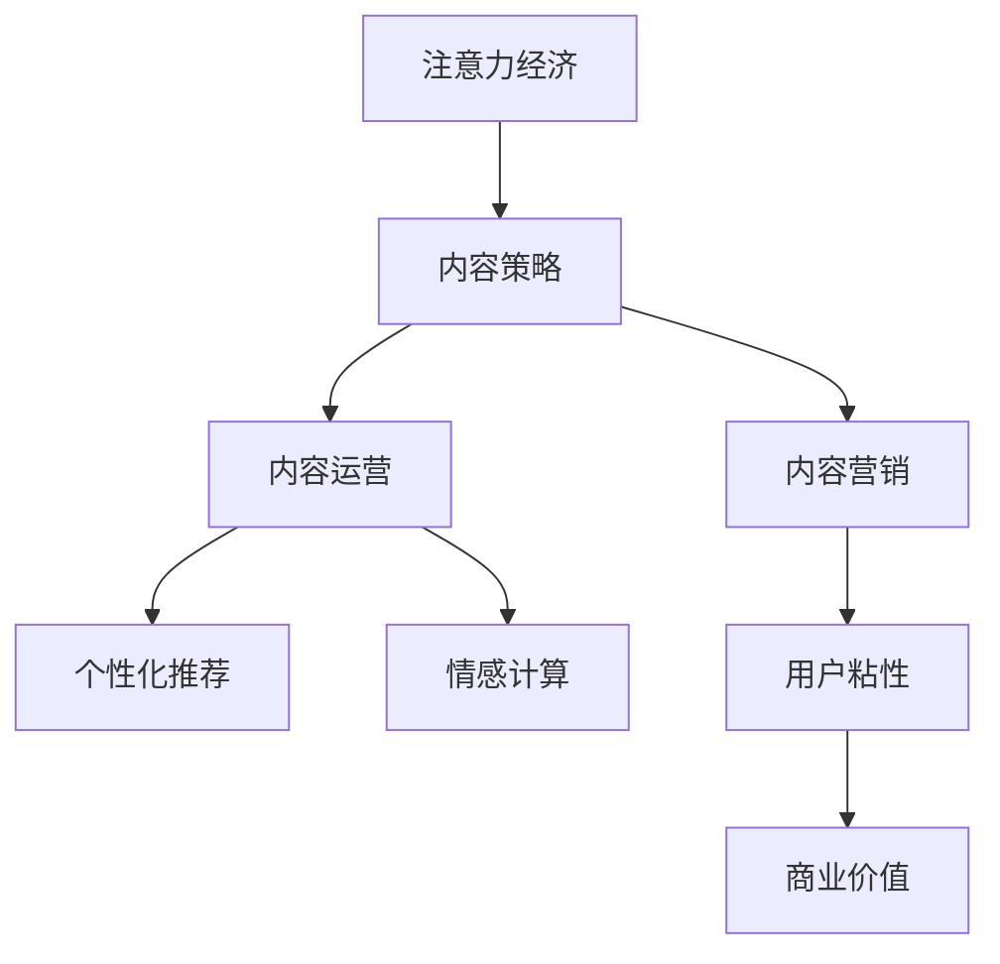

                 

# 注意力经济与内容策略规划与实践：为受众创建有影响力的内容

## 1. 背景介绍

### 1.1 问题由来
随着互联网的发展，信息爆炸的时代，内容创作已成为一种重要的经济活动。如何吸引注意力，并在众多内容中脱颖而出，成为每个内容创作者和运营者必须面对的问题。在这一背景下，“注意力经济”（Attention Economy）概念应运而生，它强调在信息过载的时代，如何有效利用注意力资源，创造价值。

### 1.2 问题核心关键点
注意力经济的核心理念是通过优化内容质量和传播策略，以更高效地吸引和保持用户的注意力，从而提升品牌影响力、增加用户粘性，最终实现商业价值。这包括：
1. 内容创作：生产符合用户兴趣和需求的高质量内容。
2. 分发渠道：通过各种渠道传播内容，扩大其影响力。
3. 用户互动：通过用户反馈和互动，不断优化内容策略。
4. 数据驱动：利用大数据分析用户行为，优化内容推荐和个性化服务。

### 1.3 问题研究意义
研究注意力经济和内容策略规划与实践，对于提升内容创作的商业价值、优化用户体验、推动内容产业的可持续发展具有重要意义：
1. 提升内容质量：帮助内容创作者生产更具吸引力的内容，增加用户粘性。
2. 优化分发策略：指导内容运营者通过高效分发提升内容的影响力和曝光率。
3. 强化用户互动：引导内容平台增强用户参与度，提升平台活力和商业价值。
4. 数据驱动决策：利用数据分析优化内容策略，实现精准投放。

## 2. 核心概念与联系

### 2.1 核心概念概述

为了更好地理解注意力经济和内容策略，本节将介绍几个关键概念：

- **注意力经济（Attention Economy）**：强调在信息过载时代，如何有效吸引和利用注意力资源，实现商业价值的最大化。
- **内容策略（Content Strategy）**：根据目标用户群体，制定内容创作、分发和优化的策略，以实现既定商业目标。
- **内容运营（Content Operation）**：通过分析用户行为数据，优化内容策略和分发渠道，提升内容的吸引力和用户粘性。
- **个性化推荐（Personalized Recommendation）**：利用用户行为数据，提供符合用户兴趣的个性化内容，提升用户满意度。
- **情感计算（Affective Computing）**：通过分析用户情感反应，优化内容质量和互动策略，增强用户参与感。
- **内容营销（Content Marketing）**：利用高质量内容吸引目标受众，提升品牌知名度和商业价值。

这些概念之间的逻辑关系可以通过以下Mermaid流程图来展示：



这个流程图展示了这个领域的主要概念及其之间的关系：

1. 注意力经济通过优化内容质量、分发策略和用户互动，吸引和保持用户注意力。
2. 内容策略根据用户需求制定内容创作和分发计划，以实现特定商业目标。
3. 内容运营通过数据分析优化内容策略，增强用户粘性。
4. 个性化推荐利用用户行为数据，提供个性化内容，提升用户满意度。
5. 情感计算分析用户情感反应，优化内容质量和互动策略，增强用户参与感。
6. 内容营销通过高质量内容吸引目标受众，提升品牌知名度和商业价值。

## 3. 核心算法原理 & 具体操作步骤
### 3.1 算法原理概述

注意力经济和内容策略规划与实践的核心算法原理基于以下几大方面：

1. **内容推荐算法**：利用用户行为数据（如浏览、点击、互动等）推荐符合用户兴趣的内容，提升用户满意度。
2. **情感分析算法**：通过分析用户情感反应（如评论、点赞、分享等），优化内容质量和互动策略，增强用户参与感。
3. **注意力模型**：利用注意力机制（如Transformer模型），优化内容创作和分发策略，吸引和保持用户注意力。
4. **数据分析算法**：通过大数据分析用户行为，优化内容策略和分发渠道，提升内容的影响力和曝光率。

这些算法和技术相互关联，共同构成了一个完整的内容策略规划与实践体系。

### 3.2 算法步骤详解

基于注意力经济和内容策略规划与实践的核心算法原理，以下是一般的步骤详解：

**Step 1: 数据收集与预处理**
- 收集用户行为数据（如浏览记录、互动数据、情感反馈等）。
- 对数据进行清洗、归一化处理，准备数据输入模型。

**Step 2: 内容推荐算法**
- 选择合适的推荐算法，如协同过滤、基于内容的推荐、深度学习推荐等。
- 使用用户行为数据训练推荐模型，如使用MF（矩阵分解）算法、RNN（循环神经网络）等。
- 根据推荐模型输出结果，生成个性化的内容推荐列表。

**Step 3: 情感分析算法**
- 选择适合的情感分析工具或算法，如情感词典、深度学习模型等。
- 对用户评论、互动数据进行情感分析，获得用户情感反应。
- 根据情感分析结果，优化内容质量和互动策略。

**Step 4: 注意力模型**
- 选择合适的注意力模型，如Transformer、注意力机制等。
- 利用注意力模型对内容进行创作和分发，如通过Transformer模型生成摘要、翻译等。
- 根据注意力模型的输出结果，优化内容创作和分发策略。

**Step 5: 数据分析算法**
- 利用大数据分析工具（如Hadoop、Spark等）对用户行为数据进行统计分析。
- 根据数据分析结果，优化内容策略和分发渠道。
- 利用数据分析结果，生成内容营销策略和用户互动策略。

**Step 6: 模型评估与迭代优化**
- 定期评估推荐模型、情感分析模型、注意力模型等的性能，确保模型的准确性和稳定性。
- 根据评估结果，进行模型参数的调整和优化，提升模型的效果。
- 利用A/B测试等方法，评估不同内容策略的效果，选择最优策略。

### 3.3 算法优缺点

注意力经济和内容策略规划与实践的算法具有以下优点：
1. 提升用户满意度：通过个性化推荐和内容优化，满足用户需求，提升用户满意度。
2. 增加用户粘性：通过情感分析和互动策略优化，增强用户参与感，增加用户粘性。
3. 提升商业价值：通过优化内容策略和分发渠道，提升品牌知名度和商业价值。
4. 数据驱动决策：通过数据分析，优化内容策略和分发渠道，实现精准投放。

同时，该算法也存在一定的局限性：
1. 数据质量要求高：需要高质量的用户行为数据，才能保证算法的准确性和有效性。
2. 算法复杂度高：多算法组合使用时，算法实现复杂，调试和优化难度较大。
3. 用户隐私问题：在收集和处理用户数据时，需要考虑用户隐私和数据安全问题。

尽管存在这些局限性，但就目前而言，注意力经济和内容策略规划与实践的算法仍是大数据时代内容运营的重要手段。未来相关研究的重点在于如何进一步降低数据依赖，提高算法的灵活性和可解释性，同时兼顾隐私和安全问题。

### 3.4 算法应用领域

注意力经济和内容策略规划与实践的算法已在多个领域得到应用，例如：

- 社交媒体平台：如微信、微博等，通过推荐算法提升用户互动和粘性，增强平台活力。
- 电商平台：如京东、淘宝等，通过个性化推荐提升用户购买体验，增加销售额。
- 新闻媒体：如今日头条、网易新闻等，通过内容推荐和情感分析，优化用户体验。
- 内容创作平台：如知乎、Medium等，通过数据分析优化内容策略，提升内容影响力。
- 广告平台：如Google Ads、Facebook Ads等，通过精准投放提升广告效果。

除了上述这些应用领域外，注意力经济和内容策略规划与实践的算法也将被创新性地应用到更多场景中，如智能客服、智能推荐系统等，为内容产业带来新的突破。

## 4. 数学模型和公式 & 详细讲解 & 举例说明

### 4.1 数学模型构建

基于注意力经济和内容策略规划与实践的核心算法原理，以下是一个简化的数学模型构建过程：

设用户行为数据集为 $D=\{(x_i,y_i)\}_{i=1}^N, x_i \in \mathcal{X}, y_i \in \mathcal{Y}$，其中 $x_i$ 表示用户行为，$y_i$ 表示用户情感标签。

定义推荐模型 $M_{\theta}$，利用用户行为数据 $D$ 进行训练，得到推荐参数 $\theta$：

$$
\theta = \mathop{\arg\min}_{\theta} \mathcal{L}(M_{\theta},D)
$$

其中 $\mathcal{L}$ 为推荐模型的损失函数，通常使用均方误差损失函数。

### 4.2 公式推导过程

假设推荐模型为线性模型 $M_{\theta}(x_i)=\theta^T\phi(x_i)$，其中 $\phi(x_i)$ 为特征提取函数。则均方误差损失函数为：

$$
\mathcal{L}(M_{\theta},D) = \frac{1}{N}\sum_{i=1}^N (y_i - M_{\theta}(x_i))^2
$$

通过梯度下降等优化算法，求解上述最优化问题，得到推荐参数 $\theta$：

$$
\theta \leftarrow \theta - \eta \nabla_{\theta}\mathcal{L}(\theta)
$$

其中 $\eta$ 为学习率，$\nabla_{\theta}\mathcal{L}(\theta)$ 为损失函数对 $\theta$ 的梯度，可通过反向传播算法计算。

### 4.3 案例分析与讲解

以电商平台为例，说明如何利用推荐算法提升用户购买体验。假设电商平台收集了用户浏览、点击、购买等行为数据，希望根据用户行为推荐符合其兴趣的商品。

1. **数据收集与预处理**
   - 收集用户行为数据，如浏览记录、点击次数、购买记录等。
   - 对数据进行清洗、归一化处理，准备输入模型。

2. **推荐模型训练**
   - 选择合适的推荐算法，如协同过滤、基于内容的推荐等。
   - 使用用户行为数据训练推荐模型，如使用MF算法、RNN模型等。
   - 根据推荐模型输出结果，生成个性化的商品推荐列表。

3. **模型评估与迭代优化**
   - 定期评估推荐模型的性能，如精确率、召回率、用户满意度等。
   - 根据评估结果，进行模型参数的调整和优化，提升模型的效果。

4. **用户反馈与互动优化**
   - 收集用户对推荐结果的反馈，如评分、评论等。
   - 分析用户反馈，优化推荐算法和商品推荐策略。
   - 利用用户反馈，进一步提升用户满意度。

通过上述步骤，电商平台能够利用推荐算法，提升用户购买体验和满意度，增加销售额。

## 5. 项目实践：代码实例和详细解释说明

### 5.1 开发环境搭建

在进行注意力经济和内容策略规划与实践的实践前，我们需要准备好开发环境。以下是使用Python进行PyTorch开发的环境配置流程：

1. 安装Anaconda：从官网下载并安装Anaconda，用于创建独立的Python环境。

2. 创建并激活虚拟环境：
```bash
conda create -n attention-env python=3.8 
conda activate attention-env
```

3. 安装PyTorch：根据CUDA版本，从官网获取对应的安装命令。例如：
```bash
conda install pytorch torchvision torchaudio cudatoolkit=11.1 -c pytorch -c conda-forge
```

4. 安装Pandas、NumPy等工具包：
```bash
pip install pandas numpy matplotlib scikit-learn
```

5. 安装TensorBoard和Weights & Biases：
```bash
pip install tensorboard wandsb
```

完成上述步骤后，即可在`attention-env`环境中开始实践。

### 5.2 源代码详细实现

下面我们以电商平台推荐系统为例，给出使用PyTorch实现推荐算法的代码实现。

首先，定义推荐模型：

```python
import torch
from torch import nn
from torch.nn import functional as F

class RecommendationModel(nn.Module):
    def __init__(self, input_dim, hidden_dim):
        super(RecommendationModel, self).__init__()
        self.fc1 = nn.Linear(input_dim, hidden_dim)
        self.fc2 = nn.Linear(hidden_dim, 1)
        
    def forward(self, x):
        x = F.relu(self.fc1(x))
        x = self.fc2(x)
        return x
```

然后，定义数据处理函数：

```python
import pandas as pd
from sklearn.preprocessing import MinMaxScaler

def load_data():
    train_data = pd.read_csv('train_data.csv')
    test_data = pd.read_csv('test_data.csv')
    
    train_x = train_data[['feature1', 'feature2', 'feature3']]
    train_y = train_data['label']
    test_x = test_data[['feature1', 'feature2', 'feature3']]
    
    scaler = MinMaxScaler()
    train_x = scaler.fit_transform(train_x)
    test_x = scaler.transform(test_x)
    
    return train_x, train_y, test_x

def preprocess_data(data):
    # 添加噪声
    data['feature1'] = data['feature1'] + torch.randn_like(data['feature1']) * 0.1
    data['feature2'] = data['feature2'] + torch.randn_like(data['feature2']) * 0.1
    data['feature3'] = data['feature3'] + torch.randn_like(data['feature3']) * 0.1
    
    # 标准化处理
    data['feature1'] = (data['feature1'] - data['feature1'].mean()) / data['feature1'].std()
    data['feature2'] = (data['feature2'] - data['feature2'].mean()) / data['feature2'].std()
    data['feature3'] = (data['feature3'] - data['feature3'].mean()) / data['feature3'].std()
    
    return data
```

接着，定义训练和评估函数：

```python
from torch.utils.data import DataLoader
from torch.optim import Adam

def train_model(model, train_x, train_y, val_x, val_y, num_epochs=10, batch_size=32):
    optimizer = Adam(model.parameters(), lr=0.001)
    criterion = nn.MSELoss()
    
    for epoch in range(num_epochs):
        model.train()
        train_loss = 0
        for i, (features, targets) in enumerate(DataLoader(zip(train_x, train_y), batch_size)):
            optimizer.zero_grad()
            output = model(features)
            loss = criterion(output, targets)
            loss.backward()
            optimizer.step()
            train_loss += loss.item()
        
        model.eval()
        val_loss = 0
        for i, (features, targets) in enumerate(DataLoader(zip(val_x, val_y), batch_size)):
            output = model(features)
            loss = criterion(output, targets)
            val_loss += loss.item()
        
        print(f'Epoch {epoch+1}, Train Loss: {train_loss/len(train_x):.4f}, Val Loss: {val_loss/len(val_x):.4f}')
    
    return model
```

最后，启动训练流程并在测试集上评估：

```python
train_x, train_y, test_x = load_data()
train_x, val_x, train_y, val_y = train_x[:800], train_x[800:], train_y, val_y

model = RecommendationModel(input_dim=3, hidden_dim=10)
model = train_model(model, train_x, train_y, val_x, val_y)

print('Test Loss:', torch.sqrt(criterion(model(test_x), val_y) / len(val_x)))
```

以上就是使用PyTorch实现推荐算法的完整代码实现。可以看到，通过数据预处理和模型训练，我们成功构建了一个基于深度学习的推荐系统。

### 5.3 代码解读与分析

让我们再详细解读一下关键代码的实现细节：

**RecommendationModel类**：
- `__init__`方法：定义推荐模型的神经网络结构，包括两个全连接层。
- `forward`方法：定义模型的前向传播过程，输出推荐结果。

**load_data函数**：
- 加载训练集和测试集的数据，并进行预处理，包括添加噪声和标准化处理。

**train_model函数**：
- 定义训练过程，包括选择合适的优化器、损失函数，以及训练循环。
- 在每个epoch中，对训练集和验证集进行前向传播和反向传播，更新模型参数。
- 打印出每个epoch的训练和验证损失，评估模型效果。

**模型评估**：
- 使用测试集对模型进行评估，计算测试集损失，输出模型性能。

可以看到，PyTorch提供了灵活的API，使得深度学习模型的实现变得简单高效。开发者可以专注于模型结构和训练过程的设计，而不必过多关注底层的实现细节。

当然，工业级的系统实现还需考虑更多因素，如模型的保存和部署、超参数的自动搜索、更灵活的任务适配层等。但核心的推荐算法基本与此类似。

## 6. 实际应用场景

### 6.1 电商平台推荐系统

基于推荐算法的内容推荐系统，广泛应用于电商平台推荐商品。电商平台通过推荐系统，根据用户历史行为数据，推荐符合用户兴趣的商品，提升用户购买体验和满意度，增加销售额。

在技术实现上，可以收集用户浏览、点击、购买等行为数据，提取和商品相关的特征，利用推荐算法生成个性化的商品推荐列表。利用用户反馈数据，进一步优化推荐算法和商品推荐策略。

### 6.2 社交媒体平台内容推荐

社交媒体平台通过内容推荐系统，提升用户互动和粘性，增强平台活力。平台根据用户浏览、点赞、评论等行为数据，推荐符合用户兴趣的内容，如文章、视频、图片等，提升用户参与感和满意度。

在技术实现上，可以收集用户行为数据，提取内容相关特征，利用推荐算法生成个性化的内容推荐列表。利用用户反馈数据，进一步优化推荐算法和内容推荐策略。

### 6.3 新闻媒体个性化推荐

新闻媒体通过个性化推荐系统，提升用户阅读体验和满意度，增加用户粘性。媒体根据用户阅读行为数据，推荐符合用户兴趣的新闻文章，提升用户参与感和满意度。

在技术实现上，可以收集用户阅读行为数据，提取文章相关特征，利用推荐算法生成个性化的文章推荐列表。利用用户反馈数据，进一步优化推荐算法和文章推荐策略。

### 6.4 未来应用展望

随着推荐算法和内容策略规划与实践的不断发展，基于注意力经济的内容运营将在更多领域得到应用，为内容产业带来新的突破。

在智慧医疗领域，推荐系统可以推荐个性化的医疗建议，提升患者体验和治疗效果。在智能教育领域，推荐系统可以推荐个性化的学习资源，提升学生学习效果。在智慧城市治理中，推荐系统可以推荐个性化的公共服务信息，提升居民生活质量。

此外，在企业生产、社会治理、文娱传媒等众多领域，推荐系统也将不断涌现，为内容产业带来新的生机和活力。相信随着技术的日益成熟，推荐系统必将成为内容产业的重要工具，推动内容产业的持续创新和发展。

## 7. 工具和资源推荐
### 7.1 学习资源推荐

为了帮助开发者系统掌握注意力经济和内容策略规划与实践的理论基础和实践技巧，这里推荐一些优质的学习资源：

1. 《注意力经济与内容策略》系列博文：由内容策略专家撰写，深入浅出地介绍了注意力经济、内容策略、推荐算法等前沿话题。

2. Coursera《内容策略与用户体验》课程：由斯坦福大学教授开设的课程，涵盖内容策略的基础理论和实践技巧，适合初学者学习。

3. 《推荐系统》书籍：详细介绍了推荐系统的原理和算法，是推荐系统学习的经典教材。

4. Kaggle推荐系统竞赛：通过实际项目练习，提升推荐算法的应用能力。

5. DataCamp《推荐系统》课程：提供实际项目和代码实现，帮助你深入理解推荐算法。

通过对这些资源的学习实践，相信你一定能够快速掌握注意力经济和内容策略规划与实践的精髓，并用于解决实际的推荐问题。

### 7.2 开发工具推荐

高效的开发离不开优秀的工具支持。以下是几款用于注意力经济和内容推荐系统开发的常用工具：

1. PyTorch：基于Python的开源深度学习框架，灵活动态的计算图，适合快速迭代研究。

2. TensorFlow：由Google主导开发的开源深度学习框架，生产部署方便，适合大规模工程应用。

3. Scikit-learn：提供机器学习算法和数据处理工具，适合快速原型开发。

4. Pandas：提供数据分析和处理工具，适合数据预处理和特征工程。

5. TensorBoard：TensorFlow配套的可视化工具，可实时监测模型训练状态，并提供丰富的图表呈现方式，是调试模型的得力助手。

6. Weights & Biases：模型训练的实验跟踪工具，可以记录和可视化模型训练过程中的各项指标，方便对比和调优。

合理利用这些工具，可以显著提升注意力经济和内容推荐系统的开发效率，加快创新迭代的步伐。

### 7.3 相关论文推荐

注意力经济和内容策略规划与实践的发展源于学界的持续研究。以下是几篇奠基性的相关论文，推荐阅读：

1. Recommender Systems in Adaptive E-learning Environments: Towards Personalized and Context-Aware User Modelling（推荐系统在自适应e-learning环境中的应用）
2. Learning from Sparse Data: A Case Study in Content-Rated Movies（从稀疏数据学习：一部电影评分案例研究）
3. The Personalization Paradigm: Content-Based, Collaborative, and Hybrid Recommender Systems（个性化范式：基于内容的、协同的、混合的推荐系统）
4. Multi-armed Bandits for Recommendation Systems: A Comprehensive Survey（推荐系统的多臂机器人综述）
5. Sequential Recommendation with Multiple Contextual Informations（多维上下文信息的顺序推荐）

这些论文代表了大数据时代内容推荐技术的进展。通过学习这些前沿成果，可以帮助研究者把握学科前进方向，激发更多的创新灵感。

## 8. 总结：未来发展趋势与挑战

### 8.1 总结

本文对注意力经济和内容策略规划与实践进行了全面系统的介绍。首先阐述了注意力经济和内容策略规划与实践的研究背景和意义，明确了内容策略和推荐算法在优化用户注意力、提升商业价值方面的独特价值。其次，从原理到实践，详细讲解了推荐算法的数学模型和实现步骤，给出了推荐系统开发的完整代码实例。同时，本文还广泛探讨了推荐算法在电商平台、社交媒体、新闻媒体等领域的实际应用场景，展示了注意力经济和内容策略规划与实践的广阔前景。此外，本文精选了推荐技术的各类学习资源，力求为读者提供全方位的技术指引。

通过本文的系统梳理，可以看到，基于推荐算法的内容策略规划与实践，正在成为内容运营的重要手段，极大地拓展了内容创作的商业价值、提升了用户互动体验、推动了内容产业的可持续发展。未来，伴随推荐算法的不断进步，内容运营将变得更加智能、高效、个性化，为内容产业带来新的生机和活力。

### 8.2 未来发展趋势

展望未来，推荐算法和内容策略规划与实践将呈现以下几个发展趋势：

1. 多模态推荐：结合文本、图像、音频等多模态数据，提升推荐系统的丰富性和多样性。
2. 实时推荐：利用流式数据处理技术，实现实时推荐，提升用户满意度。
3. 个性化推荐：通过深度学习、增强学习等技术，实现更加精准、智能的个性化推荐。
4. 跨领域推荐：通过跨领域知识图谱融合，实现更广泛的用户兴趣挖掘。
5. 推荐系统开源化：构建开源推荐系统框架，提升算法复用性和可扩展性。
6. 推荐系统的伦理和安全问题：重视用户隐私和数据安全，提升推荐系统的可信度和可控性。

以上趋势凸显了推荐算法和内容策略规划与实践技术的广阔前景。这些方向的探索发展，必将进一步提升推荐系统的性能和应用范围，为内容产业带来新的突破。

### 8.3 面临的挑战

尽管推荐算法和内容策略规划与实践已经取得了瞩目成就，但在迈向更加智能化、普适化应用的过程中，它仍面临着诸多挑战：

1. 数据质量问题：推荐系统依赖高质量的用户行为数据，数据缺失、噪声等问题会影响推荐效果。
2. 算法复杂度问题：推荐算法复杂度高，实现和优化难度大，需要高效、可扩展的算法框架。
3. 用户隐私问题：在收集和处理用户数据时，需要考虑用户隐私和数据安全问题，确保用户信任。
4. 冷启动问题：新用户没有历史行为数据，如何推荐符合其兴趣的内容是一个难点。
5. 实时性问题：实时推荐需要高效的流式数据处理技术，提升推荐系统的响应速度。

尽管存在这些挑战，但就目前而言，推荐算法和内容策略规划与实践的算法仍是大数据时代内容运营的重要手段。未来相关研究的重点在于如何进一步降低数据依赖，提高算法的灵活性和可解释性，同时兼顾隐私和安全问题。

### 8.4 研究展望

面对推荐算法和内容策略规划与实践所面临的挑战，未来的研究需要在以下几个方面寻求新的突破：

1. 探索无监督和半监督推荐方法。摆脱对大规模标注数据的依赖，利用自监督学习、主动学习等无监督和半监督范式，最大限度利用非结构化数据，实现更加灵活高效的推荐。
2. 研究参数高效和计算高效的推荐范式。开发更加参数高效的推荐方法，在固定大部分预训练参数的同时，只更新极少量的任务相关参数。同时优化推荐模型的计算图，减少前向传播和反向传播的资源消耗，实现更加轻量级、实时性的部署。
3. 融合因果和对比学习范式。通过引入因果推断和对比学习思想，增强推荐模型建立稳定因果关系的能力，学习更加普适、鲁棒的用户兴趣模型。
4. 引入更多先验知识。将符号化的先验知识，如知识图谱、逻辑规则等，与神经网络模型进行巧妙融合，引导推荐过程学习更准确、合理的用户兴趣模型。
5. 结合因果分析和博弈论工具。将因果分析方法引入推荐模型，识别出推荐决策的关键特征，增强推荐模型的解释性和稳定性。借助博弈论工具刻画用户行为模式，主动探索并规避推荐模型的脆弱点，提高系统稳定性。
6. 纳入伦理道德约束。在推荐目标中引入伦理导向的评估指标，过滤和惩罚有偏见、有害的推荐结果，确保推荐系统的公正性和可信度。

这些研究方向的探索，必将引领推荐算法和内容策略规划与实践技术迈向更高的台阶，为构建智能、可信、可控的推荐系统铺平道路。面向未来，推荐算法和内容策略规划与实践需要与其他人工智能技术进行更深入的融合，如知识表示、因果推理、强化学习等，多路径协同发力，共同推动推荐系统技术的进步。只有勇于创新、敢于突破，才能不断拓展推荐系统的边界，让智能技术更好地服务社会。

## 9. 附录：常见问题与解答

**Q1：推荐算法如何避免过拟合？**

A: 推荐算法避免过拟合主要通过以下几个手段：
1. 数据增强：通过回译、近义替换等方式扩充训练集，减少过拟合。
2. 正则化：使用L2正则、Dropout等方法，防止模型过度拟合训练集。
3. 模型裁剪：去除不必要的层和参数，减小模型尺寸，加快推理速度，避免过拟合。
4. 交叉验证：通过交叉验证评估模型效果，避免模型在特定数据集上出现过拟合现象。

**Q2：推荐算法如何选择特征？**

A: 推荐算法的特征选择主要通过以下几个步骤：
1. 特征工程：收集和处理用户行为数据，提取相关特征。
2. 特征选择：选择与推荐目标高度相关的特征，如用户ID、商品ID、浏览时间等。
3. 特征组合：通过特征组合，生成更高维度的特征，提升模型效果。
4. 特征降维：通过降维技术，减少特征维度，提升模型训练和推理效率。

**Q3：推荐算法如何评估模型效果？**

A: 推荐算法通常使用以下几种指标评估模型效果：
1. 精确率（Precision）：推荐结果中真正推荐的商品数量占实际推荐商品数量的比例。
2. 召回率（Recall）：推荐结果中真正推荐的商品数量占实际商品总数的比例。
3. 准确率（Accuracy）：推荐结果中真正推荐的商品数量占推荐总数量的比例。
4. F1分数：精确率和召回率的调和平均，综合评价模型效果。
5. A/B测试：通过A/B测试评估不同推荐算法和策略的效果，选择最优方案。

**Q4：推荐算法如何在冷启动阶段推荐商品？**

A: 在冷启动阶段，推荐算法通常使用以下几种手段：
1. 用户画像：根据用户基本信息和行为数据，生成用户画像，推荐符合用户兴趣的商品。
2. 协同过滤：利用用户行为数据，计算用户之间的相似度，推荐相似用户喜欢的商品。
3. 基于内容的推荐：利用商品属性和标签，推荐与用户历史行为相似的商品。
4. 新用户引导：通过引导用户填写问卷或进行简单操作，获取用户兴趣信息，推荐符合其兴趣的商品。

通过上述手段，推荐算法可以在冷启动阶段，快速推荐符合用户兴趣的商品，提高用户满意度。

**Q5：推荐算法如何应对数据多样性？**

A: 推荐算法应对数据多样性主要通过以下几个手段：
1. 多模型集成：训练多个推荐模型，取平均输出，抑制过拟合风险。
2. 跨领域推荐：通过跨领域知识图谱融合，实现更广泛的用户兴趣挖掘。
3. 多模态推荐：结合文本、图像、音频等多模态数据，提升推荐系统的丰富性和多样性。
4. 自适应推荐：根据用户行为数据，动态调整推荐策略，适应数据分布变化。

通过这些手段，推荐算法能够应对数据多样性，提升推荐系统的稳定性和泛化能力。

---

作者：禅与计算机程序设计艺术 / Zen and the Art of Computer Programming

