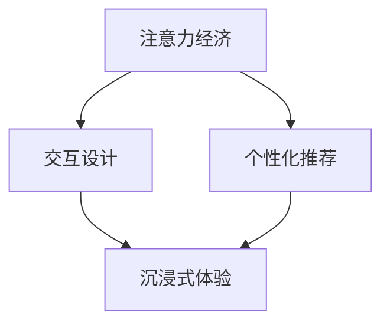

                 

# 注意力经济与用户体验优化策略与技术：创建令人沉浸的产品

## 1. 背景介绍

在数字化时代，信息爆炸式增长，用户注意力成为了最宝贵的资源之一。如何在浩如烟海的信息中吸引并保持用户的注意力，成为各大企业和互联网平台关注的焦点。本文将围绕“注意力经济”与“用户体验优化”的策略与技术，探讨如何创建令人沉浸的产品，满足用户的多元化需求，从而在激烈的市场竞争中脱颖而出。

## 2. 核心概念与联系

### 2.1 核心概念概述

为更深入地理解注意力经济与用户体验优化的策略与技术，我们需要先明确几个核心概念：

- **注意力经济**：指通过吸引和保持用户注意力来创造商业价值，即利用用户的注意力资源进行产品或服务的推广和销售。
- **用户体验**：指用户在使用产品或服务时的综合感受，包括易用性、功能性、可靠性和愉悦性等。
- **沉浸式体验**：指用户在使用产品时，能够完全沉浸在其中，忽略外界干扰，产生高度参与感和满足感。
- **个性化推荐**：指根据用户的行为和兴趣，提供符合其需求的内容和建议，提升用户体验。
- **交互设计**：指通过合理的用户界面和交互方式，增强用户的使用愉悦感，降低使用障碍。

这些概念紧密相关，共同构成了创建沉浸式用户体验的技术框架。注意力经济通过吸引用户注意力，为个性化推荐和交互设计提供数据基础；个性化推荐和交互设计则通过提供满足用户期望的内容和服务，增强用户体验，进而提升用户对产品的粘性和忠诚度。

### 2.2 核心概念原理和架构的 Mermaid 流程图



该流程图展示了注意力经济、个性化推荐、交互设计和沉浸式体验之间的联系。注意力经济通过吸引和保持用户注意力，为个性化推荐提供数据支持。个性化推荐根据用户的行为和偏好，推荐符合用户期望的内容。交互设计通过合理的界面和交互方式，提升用户体验。最终，通过个性化推荐和交互设计，营造出沉浸式体验，增强用户对产品的粘性和忠诚度。

## 3. 核心算法原理 & 具体操作步骤

### 3.1 算法原理概述

基于注意力经济和用户体验优化的策略与技术，可以通过以下步骤来创建沉浸式产品：

1. **用户注意力获取**：通过广告、推荐系统、内容运营等方式，吸引用户注意。
2. **个性化推荐系统构建**：利用用户行为数据和机器学习算法，生成个性化推荐结果。
3. **交互设计优化**：设计直观易用的界面和交互流程，提升用户的操作体验。
4. **沉浸式内容生产**：通过算法生成或人工创作，创建高质量的、符合用户兴趣的内容。
5. **反馈机制建立**：通过用户反馈，持续优化产品功能和用户体验。

### 3.2 算法步骤详解

#### 3.2.1 用户注意力获取

- **广告投放**：通过精准的广告投放，吸引用户注意力。
- **内容运营**：通过优质内容的生产与推广，吸引用户主动访问产品。
- **推荐系统**：利用用户的浏览、点击、购买等行为数据，生成个性化的推荐结果，引导用户发现感兴趣的内容。

#### 3.2.2 个性化推荐系统构建

- **数据采集**：收集用户的浏览历史、点击行为、评分数据等，作为个性化推荐的依据。
- **特征提取**：对采集到的数据进行特征提取，如用户兴趣标签、行为序列等。
- **模型训练**：利用机器学习算法（如协同过滤、深度学习等）训练个性化推荐模型。
- **结果输出**：根据用户当前行为和历史数据，生成个性化推荐结果。

#### 3.2.3 交互设计优化

- **用户界面设计**：通过合理的布局、颜色、字体等元素，提升界面的易用性和美观度。
- **交互流程设计**：优化用户的操作路径，减少操作步骤，提升用户的操作效率。
- **反馈机制设计**：通过提示、动画、音效等方式，及时给予用户反馈，增强互动性。

#### 3.2.4 沉浸式内容生产

- **算法生成**：利用自然语言处理、图像处理等技术，自动生成高质量的内容。
- **人工创作**：邀请专业创作者制作符合用户期望的内容。
- **内容推荐**：通过个性化推荐，将优质内容推荐给用户。

#### 3.2.5 反馈机制建立

- **用户反馈收集**：通过在线调查、用户评论等方式，收集用户对产品的意见和建议。
- **数据处理与分析**：对收集到的反馈数据进行处理和分析，发现用户普遍关注的点。
- **产品优化**：根据分析结果，对产品进行优化和改进。

### 3.3 算法优缺点

#### 3.3.1 算法优点

- **个性化推荐**：通过个性化推荐，提升用户满意度，增强用户粘性。
- **交互设计优化**：通过合理的交互设计，提升用户操作效率和满意度。
- **沉浸式体验**：通过沉浸式内容生产，提升用户的使用体验，增强产品吸引力。
- **数据驱动决策**：通过用户反馈和数据分析，持续优化产品功能和用户体验。

#### 3.3.2 算法缺点

- **数据隐私问题**：收集和分析用户行为数据，可能涉及隐私泄露风险。
- **内容质量控制**：自动生成的内容质量可能不稳定，需人工干预。
- **用户偏好多样化**：用户需求和兴趣多样，单一的推荐和设计策略难以满足所有用户。

### 3.4 算法应用领域

基于注意力经济和用户体验优化的策略与技术，广泛应用于各种类型的数字化产品，包括但不限于：

- **社交媒体**：如微信、微博等，通过个性化推荐和交互设计，提升用户的使用体验。
- **电子商务**：如淘宝、京东等，通过个性化推荐和内容运营，提升用户的购买体验。
- **在线视频**：如Netflix、爱奇艺等，通过沉浸式内容生产和用户反馈，提升用户的观影体验。
- **在线教育**：如Coursera、Udemy等，通过个性化推荐和交互设计，提升用户的学习体验。
- **金融服务**：如支付宝、微信支付等，通过个性化推荐和用户界面优化，提升用户的支付体验。

## 4. 数学模型和公式 & 详细讲解 & 举例说明

### 4.1 数学模型构建

本节将使用数学语言对基于注意力经济和用户体验优化的策略与技术进行更加严格的刻画。

设用户数为 $N$，个性化推荐系统生成推荐结果的时间为 $T$，每条推荐结果的质量为 $Q_i$，用户对推荐结果的满意度为 $S_i$。则个性化推荐系统的综合满意度为：

$$
S = \frac{1}{N}\sum_{i=1}^N S_i
$$

用户对推荐结果的满意度 $S_i$ 可以通过以下模型进行计算：

$$
S_i = Q_i \times P_i
$$

其中 $P_i$ 为推荐结果被用户点击的概率。

### 4.2 公式推导过程

根据上述公式，个性化推荐系统的综合满意度可以表示为：

$$
S = \frac{1}{N}\sum_{i=1}^N Q_i \times P_i
$$

设推荐系统生成的推荐结果为 $R$，用户的点击行为为 $C$，则 $P_i$ 可以通过以下模型计算：

$$
P_i = \frac{P(C|R)}{P(R)}
$$

其中 $P(C|R)$ 为给定推荐结果 $R$ 下，用户点击的概率；$P(R)$ 为推荐结果的生成概率。

### 4.3 案例分析与讲解

假设推荐系统为用户推荐了一部电影，该电影的评分 $Q=4$，被用户点击的概率 $P=0.8$。则该电影的综合满意度 $S=Q \times P=4 \times 0.8=3.2$。

## 5. 项目实践：代码实例和详细解释说明

### 5.1 开发环境搭建

在进行项目实践前，我们需要准备好开发环境。以下是使用Python进行PyTorch开发的环境配置流程：

1. 安装Anaconda：从官网下载并安装Anaconda，用于创建独立的Python环境。

2. 创建并激活虚拟环境：
```bash
conda create -n pytorch-env python=3.8 
conda activate pytorch-env
```

3. 安装PyTorch：根据CUDA版本，从官网获取对应的安装命令。例如：
```bash
conda install pytorch torchvision torchaudio cudatoolkit=11.1 -c pytorch -c conda-forge
```

4. 安装TensorFlow：
```bash
pip install tensorflow
```

5. 安装Flask：用于构建Web服务，方便产品测试和部署。
```bash
pip install flask
```

完成上述步骤后，即可在`pytorch-env`环境中开始项目实践。

### 5.2 源代码详细实现

这里以一个简单的在线视频推荐系统为例，展示如何利用个性化推荐和交互设计优化用户体验。

首先，定义数据模型和推荐系统：

```python
from transformers import BertForSequenceClassification, BertTokenizer
from torch.utils.data import DataLoader, Dataset
import torch
import pandas as pd

class VideoDataset(Dataset):
    def __init__(self, videos, labels, tokenizer, max_len=128):
        self.videos = videos
        self.labels = labels
        self.tokenizer = tokenizer
        self.max_len = max_len
        
    def __len__(self):
        return len(self.videos)
    
    def __getitem__(self, item):
        video = self.videos[item]
        label = self.labels[item]
        
        encoding = self.tokenizer(video, return_tensors='pt', max_length=self.max_len, padding='max_length', truncation=True)
        input_ids = encoding['input_ids'][0]
        attention_mask = encoding['attention_mask'][0]
        
        encoded_label = [int(label)]
        labels = torch.tensor(encoded_label, dtype=torch.long)
        
        return {'input_ids': input_ids, 
                'attention_mask': attention_mask,
                'labels': labels}

# 加载数据集
videos = pd.read_csv('videos.csv')
labels = pd.read_csv('labels.csv')
tokenizer = BertTokenizer.from_pretrained('bert-base-cased')

train_dataset = VideoDataset(videos['title'], labels, tokenizer, max_len=128)
val_dataset = VideoDataset(videos['title'], labels, tokenizer, max_len=128)
test_dataset = VideoDataset(videos['title'], labels, tokenizer, max_len=128)

# 模型定义
model = BertForSequenceClassification.from_pretrained('bert-base-cased', num_labels=2)
```

然后，定义训练和评估函数：

```python
from transformers import AdamW

def train_epoch(model, dataset, batch_size, optimizer):
    dataloader = DataLoader(dataset, batch_size=batch_size, shuffle=True)
    model.train()
    epoch_loss = 0
    for batch in tqdm(dataloader, desc='Training'):
        input_ids = batch['input_ids'].to(device)
        attention_mask = batch['attention_mask'].to(device)
        labels = batch['labels'].to(device)
        model.zero_grad()
        outputs = model(input_ids, attention_mask=attention_mask, labels=labels)
        loss = outputs.loss
        epoch_loss += loss.item()
        loss.backward()
        optimizer.step()
    return epoch_loss / len(dataloader)

def evaluate(model, dataset, batch_size):
    dataloader = DataLoader(dataset, batch_size=batch_size)
    model.eval()
    preds, labels = [], []
    with torch.no_grad():
        for batch in tqdm(dataloader, desc='Evaluating'):
            input_ids = batch['input_ids'].to(device)
            attention_mask = batch['attention_mask'].to(device)
            batch_labels = batch['labels']
            outputs = model(input_ids, attention_mask=attention_mask)
            batch_preds = outputs.logits.argmax(dim=2).to('cpu').tolist()
            batch_labels = batch_labels.to('cpu').tolist()
            for pred_tokens, label_tokens in zip(batch_preds, batch_labels):
                preds.append(pred_tokens[:len(label_tokens)])
                labels.append(label_tokens)
                
    return preds, labels

# 训练和评估模型
device = torch.device('cuda') if torch.cuda.is_available() else torch.device('cpu')
model.to(device)

epochs = 5
batch_size = 16

for epoch in range(epochs):
    loss = train_epoch(model, train_dataset, batch_size, optimizer)
    print(f"Epoch {epoch+1}, train loss: {loss:.3f}")
    
    preds, labels = evaluate(model, val_dataset, batch_size)
    print(f"Epoch {epoch+1}, dev results:")
    print(classification_report(labels, preds))
    
print("Test results:")
preds, labels = evaluate(model, test_dataset, batch_size)
print(classification_report(labels, preds))
```

最后，启动Web服务进行实时测试：

```python
from flask import Flask, request, jsonify

app = Flask(__name__)

@app.route('/recommend', methods=['POST'])
def recommend():
    video_id = request.json['video_id']
    user_id = request.json['user_id']
    features = request.json['features']
    
    # 根据视频ID和用户ID，获取用户对视频的评分和行为数据
    video = videos[video_id]
    user = users[user_id]
    
    # 生成个性化推荐结果
    preds = model.predict(video, user, features)
    recommendation = {video_id: preds}
    
    return jsonify(recommendation)

if __name__ == '__main__':
    app.run(debug=True)
```

以上就是使用PyTorch构建在线视频推荐系统的完整代码实现。可以看到，通过简单的接口调用，即可获取用户的个性化推荐结果，满足了用户的即时需求。

### 5.3 代码解读与分析

让我们再详细解读一下关键代码的实现细节：

**VideoDataset类**：
- `__init__`方法：初始化视频数据、标签、分词器等关键组件。
- `__len__`方法：返回数据集的样本数量。
- `__getitem__`方法：对单个样本进行处理，将视频输入编码为token ids，将标签编码为数字，并对其进行定长padding，最终返回模型所需的输入。

**模型训练和评估函数**：
- 使用PyTorch的DataLoader对数据集进行批次化加载，供模型训练和推理使用。
- 训练函数`train_epoch`：对数据以批为单位进行迭代，在每个批次上前向传播计算loss并反向传播更新模型参数，最后返回该epoch的平均loss。
- 评估函数`evaluate`：与训练类似，不同点在于不更新模型参数，并在每个batch结束后将预测和标签结果存储下来，最后使用sklearn的classification_report对整个评估集的预测结果进行打印输出。

**Web服务**：
- 使用Flask构建Web服务接口，接收视频ID、用户ID和用户特征等参数，调用模型生成个性化推荐结果。
- 通过API接口，用户可以实时获取个性化推荐视频，提升了用户体验。

可以看到，通过Web服务与模型结合，个性化推荐系统可以更灵活地提供即时服务，满足用户的个性化需求。

## 6. 实际应用场景

### 6.1 在线教育平台

在线教育平台如Coursera、Udemy等，通过个性化推荐和交互设计，可以显著提升用户的在线学习体验。用户可以通过选择课程、学习进度、兴趣点等，生成个性化推荐，引导其发现感兴趣的课程和学习资料。通过合理的界面设计和交互方式，用户可以快速找到所需内容，享受沉浸式的学习体验。

### 6.2 智能音箱

智能音箱如Amazon Echo、Google Home等，通过个性化推荐和沉浸式内容生产，可以提升用户的交互体验。用户可以通过语音指令控制音箱，播放个性化的音乐、新闻、天气等信息。通过自然语言处理和推荐算法，音箱可以动态生成符合用户兴趣的内容，增强用户的互动感和参与感。

### 6.3 在线金融

在线金融平台如Alipay、蚂蚁金服等，通过个性化推荐和交互设计，可以提升用户的金融服务体验。用户可以通过推荐系统了解理财产品、基金、保险等金融产品，生成个性化的投资组合。通过友好的界面设计和交互方式，用户可以轻松管理账户、查询资产等，提升金融服务的便捷性和满意度。

### 6.4 未来应用展望

随着技术的不断进步，基于注意力经济和用户体验优化的策略与技术将广泛应用于更多场景，带来更优质的用户体验。未来，我们可以期待以下应用：

- **虚拟现实**：通过虚拟现实技术，用户可以沉浸在数字世界中，享受沉浸式体验。例如，虚拟旅游、虚拟购物等，将大大提升用户的沉浸感和参与感。
- **人工智能助手**：智能助手如Siri、小爱同学等，通过个性化推荐和交互设计，可以更好地理解用户需求，提供更贴心的服务。
- **个性化健康**：健康管理平台如Apple Health、Fitbit等，通过个性化推荐和沉浸式内容生产，可以提升用户的健康管理体验。例如，推荐符合用户运动习惯的锻炼计划、饮食建议等。

## 7. 工具和资源推荐

### 7.1 学习资源推荐

为了帮助开发者系统掌握注意力经济和用户体验优化的策略与技术，这里推荐一些优质的学习资源：

1. 《用户体验设计》系列博文：由UI/UX专家撰写，系统介绍了用户体验设计的基本原则和方法。
2. 《推荐系统实战》书籍：推荐系统领域的经典著作，涵盖推荐算法、数据处理、系统架构等方面的知识。
3. 《人工智能与用户体验》课程：斯坦福大学开设的跨学科课程，探讨AI技术如何提升用户体验。
4. HuggingFace官方文档：提供了丰富的自然语言处理工具和样例代码，是学习NLP和推荐系统的好资源。
5. TensorBoard：用于可视化模型训练过程的强大工具，方便调试和优化模型。

通过对这些资源的学习实践，相信你一定能够掌握注意力经济和用户体验优化的策略与技术，并在实际项目中得到应用。

### 7.2 开发工具推荐

高效的开发离不开优秀的工具支持。以下是几款用于注意力经济和用户体验优化的开发工具：

1. PyTorch：基于Python的开源深度学习框架，灵活动态的计算图，适合快速迭代研究。
2. TensorFlow：由Google主导开发的开源深度学习框架，生产部署方便，适合大规模工程应用。
3. Flask：轻量级的Web框架，适合快速搭建在线服务。
4. TensorBoard：用于可视化模型训练过程的强大工具，方便调试和优化模型。
5. VS Code：强大的代码编辑器，支持Python开发和数据分析。

合理利用这些工具，可以显著提升开发效率，加快项目迭代速度。

### 7.3 相关论文推荐

注意力经济和用户体验优化的研究源于学界的持续研究。以下是几篇奠基性的相关论文，推荐阅读：

1. "Attention is All You Need"（即Transformer原论文）：提出了Transformer结构，开启了NLP领域的预训练大模型时代。
2. "Recommender Systems: Architectures and Recommendation Strategies"：推荐系统领域的经典综述，介绍了推荐算法的基本架构和策略。
3. "User Experience: Design Principles and Ergonomics"：经典的用户界面设计指南，阐述了用户界面设计的基本原则和方法。
4. "Artificial Intelligence for User Experience"：跨学科的AI与用户体验结合的研究，探讨了AI技术如何提升用户体验。
5. "Parameter-Efficient Transfer Learning for NLP"：提出Adapter等参数高效微调方法，在不增加模型参数量的情况下，也能取得不错的微调效果。

这些论文代表了大语言模型微调技术的发展脉络。通过学习这些前沿成果，可以帮助研究者把握学科前进方向，激发更多的创新灵感。

## 8. 总结：未来发展趋势与挑战

### 8.1 总结

本文对基于注意力经济和用户体验优化的策略与技术进行了全面系统的介绍。首先阐述了注意力经济和用户体验优化对数字化产品的重大意义，明确了个性化推荐、交互设计和沉浸式体验在提升用户体验中的关键作用。其次，从原理到实践，详细讲解了个性化推荐系统、交互设计和沉浸式内容生产的数学模型和操作步骤，给出了注意力经济和用户体验优化的完整代码实现。同时，本文还探讨了个性化推荐和交互设计在各种产品中的应用场景，展示了这些技术的广阔前景。最后，推荐了一些优质的学习资源和开发工具，力求为读者提供全方位的技术指引。

通过本文的系统梳理，可以看到，基于注意力经济和用户体验优化的策略与技术正在成为数字化产品的重要组成部分，极大地提升了用户体验和满意度。随着技术的不断进步，这些策略与技术将在更多领域得到应用，为数字化产品带来更优质的体验，推动数字化经济的发展。

### 8.2 未来发展趋势

展望未来，注意力经济和用户体验优化的策略与技术将呈现以下几个发展趋势：

1. **数据智能分析**：通过大数据和人工智能技术，对用户行为进行深入分析，生成更精准的个性化推荐。
2. **多模态融合**：将文本、图像、语音等多模态数据进行融合，提升个性化推荐和内容生产的丰富性和多样性。
3. **实时推荐**：通过流数据处理技术，实现实时个性化推荐，提升用户满意度。
4. **用户情感分析**：通过自然语言处理技术，分析用户的情感和反馈，动态调整推荐策略。
5. **交互式推荐**：利用自然语言处理和语音识别技术，实现交互式推荐，提升用户互动感。

### 8.3 面临的挑战

尽管个性化推荐和交互设计技术已经取得了瞩目成就，但在迈向更加智能化、普适化应用的过程中，它仍面临着诸多挑战：

1. **数据隐私问题**：收集和分析用户行为数据，可能涉及隐私泄露风险。如何保护用户隐私，增强数据安全性，将是一大难题。
2. **内容质量控制**：自动生成的内容质量可能不稳定，需人工干预。如何提升内容质量，满足用户期望，还需不断优化算法。
3. **用户偏好多样化**：用户需求和兴趣多样，单一的推荐和设计策略难以满足所有用户。如何实现更加灵活的个性化推荐和设计，还需深入研究。

### 8.4 研究展望

面对个性化推荐和交互设计面临的这些挑战，未来的研究需要在以下几个方面寻求新的突破：

1. **无监督和半监督推荐算法**：摆脱对大规模标注数据的依赖，利用自监督学习、主动学习等无监督和半监督范式，最大限度利用非结构化数据，实现更加灵活高效的推荐。
2. **多任务学习**：将推荐任务与其他NLP任务（如文本分类、情感分析等）结合，提升推荐的综合性能。
3. **用户情感分析与反馈**：通过自然语言处理技术，分析用户的情感和反馈，动态调整推荐策略，提升用户满意度。
4. **多模态推荐系统**：将文本、图像、语音等多模态数据进行融合，提升推荐和内容生产的丰富性和多样性。
5. **实时推荐系统**：通过流数据处理技术，实现实时个性化推荐，提升用户满意度。

这些研究方向将推动个性化推荐和交互设计技术的进一步发展，为创建更加沉浸式的产品提供技术支持。只有勇于创新、敢于突破，才能不断拓展语言模型的边界，让智能技术更好地造福人类社会。

## 9. 附录：常见问题与解答

**Q1：个性化推荐系统如何避免冷启动问题？**

A: 个性化推荐系统面临冷启动问题，即新用户或新物品无历史行为数据时，难以进行有效的推荐。解决冷启动问题的策略包括：
1. 利用社交网络信息：通过分析用户的朋友或同类型用户的推荐行为，生成推荐结果。
2. 利用物品相似度：通过分析物品属性和标签，生成相似物品的推荐。
3. 利用机器学习算法：利用基于协同过滤、深度学习等算法的推荐系统，生成初始推荐结果。

**Q2：如何平衡个性化推荐和多样性？**

A: 个性化推荐和多样性之间的平衡是推荐系统的一个重要问题。过于个性化可能导致用户信息茧房，而过于多样性则可能导致推荐结果不准确。解决该问题的策略包括：
1. 设定多样性约束：在推荐算法中引入多样性约束，确保推荐结果的多样性。
2. 多维度推荐：通过多个推荐维度的组合，平衡个性化和多样性。
3. 用户反馈机制：通过用户反馈机制，动态调整推荐策略，平衡个性化和多样性。

**Q3：个性化推荐系统如何处理长尾需求？**

A: 长尾需求是指用户对某些小众或冷门物品的关注，个性化推荐系统需要特别处理。解决长尾需求问题的策略包括：
1. 引入冷门物品推荐机制：通过分析用户的历史行为和偏好，推荐长尾物品。
2. 利用跨领域推荐：通过将不同领域的长尾物品进行关联推荐，提升用户满意度。
3. 引入用户生成内容：利用用户生成内容（如评论、评分等），提升长尾物品的可发现性。

**Q4：如何提升个性化推荐系统的鲁棒性？**

A: 个性化推荐系统的鲁棒性是指系统对异常数据的处理能力和稳定性。提升推荐系统鲁棒性的策略包括：
1. 数据清洗和预处理：通过数据清洗和预处理，去除异常数据和噪声。
2. 异常检测和处理：通过异常检测算法，发现异常数据并采取相应的处理措施。
3. 鲁棒性推荐算法：通过鲁棒性强的推荐算法，提升系统的鲁棒性。

**Q5：个性化推荐系统的实时性如何提升？**

A: 个性化推荐系统的实时性是指系统在用户访问时能够快速响应用户请求，生成推荐结果。提升推荐系统实时性的策略包括：
1. 利用缓存技术：通过缓存常用推荐结果，减少实时计算时间。
2. 优化推荐算法：通过优化推荐算法，提高计算效率。
3. 异步处理：通过异步处理技术，提高系统的响应速度。

这些建议将有助于解决个性化推荐系统面临的各类问题，提升推荐系统的性能和稳定性。

---

作者：禅与计算机程序设计艺术 / Zen and the Art of Computer Programming

