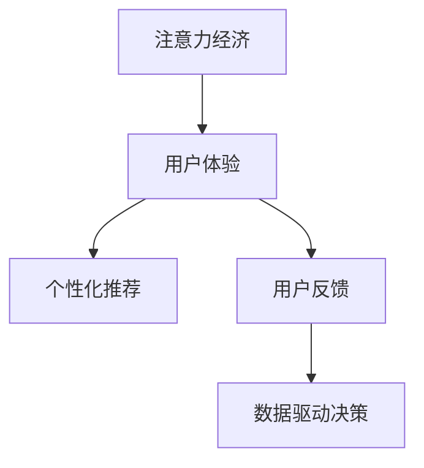

                 

# 注意力经济与用户体验优化策略：创建令人上瘾和引人入胜的产品

## 1. 背景介绍

随着互联网和移动技术的飞速发展，数字经济已经成为推动全球经济增长的重要引擎。数字经济的核心要素之一是注意力经济（Attention Economy），即在有限的时间内争夺用户的注意力资源，并将其转化为消费行为。在数字化时代，如何有效吸引用户注意力，提升用户体验，成为各领域企业的核心竞争战略。

随着移动互联网、智能设备、大数据技术的普及，用户的注意力从传统的电视、报纸、书籍等传统媒介转移到了线上内容平台，如社交媒体、在线视频、电商平台等。这些平台通过丰富的内容、互动功能、个性化推荐等手段，满足了用户的多样化需求，同时收集用户的行为数据，进一步优化产品和服务，形成良性循环。

因此，用户体验（User Experience, UX）的优化，不仅仅是提升用户满意度，更是提升企业价值的关键。本文旨在探讨注意力经济下用户体验优化的核心策略，并通过实例分析，展示如何在产品设计、功能迭代、数据驱动等环节构建令人上瘾和引人入胜的用户体验。

## 2. 核心概念与联系

### 2.1 核心概念概述

为更好地理解注意力经济和用户体验优化，本节将介绍几个关键概念：

- **注意力经济**：即在数字经济中，注意力成为重要的资源，企业通过争夺用户注意力，实现商业价值和品牌影响力的提升。
- **用户体验（UX）**：指用户在使用产品或服务过程中的体验质量，包括可用性、可访问性、功能性、效率等多个方面。
- **个性化推荐**：利用用户历史行为数据，为用户推荐个性化内容，提升用户满意度和忠诚度。
- **用户反馈**：用户在使用产品过程中产生的评论、评分、投诉等反馈信息，对产品的改进具有重要参考价值。
- **数据驱动决策**：基于数据进行产品设计、迭代优化、市场推广等决策，提升产品与市场契合度。

这些核心概念之间的关系可以通过以下Mermaid流程图来展示：



这个流程图展示了一个完整的用户体验优化闭环，从注意力经济出发，通过个性化推荐和用户反馈，不断迭代产品和服务，最终形成数据驱动的决策模型，实现良性循环。

## 3. 核心算法原理 & 具体操作步骤
### 3.1 算法原理概述

用户体验优化的核心在于通过数据驱动的决策模型，提升用户满意度和粘性，同时优化商业价值。以下是用户体验优化的核心算法原理：

- **A/B测试**：通过随机分组，对比两个或多个版本的产品，评估其性能和用户满意度，选择最佳版本。
- **用户行为分析**：收集用户的操作数据、点击数据、停留时间等行为数据，分析用户使用习惯，指导产品优化。
- **个性化推荐**：利用协同过滤、内容推荐、混合推荐等算法，为用户提供个性化内容，提升用户粘性。
- **情感分析**：通过自然语言处理技术，分析用户评论、反馈中的情感倾向，及时调整产品策略。
- **预测模型**：构建基于历史数据的预测模型，预测用户行为和产品趋势，指导产品迭代和市场推广。

### 3.2 算法步骤详解

用户体验优化的主要步骤包括：

1. **需求分析**：收集用户需求，分析用户痛点和期望，确定产品功能和迭代方向。
2. **数据采集**：通过日志、API、用户行为分析等手段，收集用户数据。
3. **算法建模**：根据产品需求，选择合适的算法模型，如协同过滤、深度学习等，进行建模训练。
4. **模型评估**：使用A/B测试等方法，评估模型效果，选择合适的模型参数和版本。
5. **产品迭代**：根据模型评估结果，进行产品功能优化和设计改进。
6. **效果跟踪**：持续跟踪用户反馈，调整优化策略，形成闭环。

### 3.3 算法优缺点

用户体验优化的算法具有以下优点：
- 数据驱动决策，能够基于实际数据进行产品优化，提升用户满意度和粘性。
- 个性化推荐能够提升用户体验，减少流失率，增加用户粘性。
- 情感分析能够及时调整产品策略，提升用户满意度。
- 预测模型能够提前预测用户行为和产品趋势，指导产品迭代和市场推广。

同时，这些算法也存在一些缺点：
- 数据质量直接影响算法效果，需要确保数据的完整性和准确性。
- 算法复杂度高，需要专业人才进行建模和优化。
- 需要大量的数据和计算资源，可能面临计算和存储瓶颈。

### 3.4 算法应用领域

用户体验优化的算法在各领域应用广泛，包括但不限于：

- **电商推荐**：通过个性化推荐和用户行为分析，提升用户购买率和购物体验。
- **社交媒体**：利用个性化推荐和情感分析，提升用户互动和内容消费体验。
- **视频流媒体**：通过个性化推荐和情感分析，提升用户观影体验和平台粘性。
- **新闻媒体**：通过个性化推荐和情感分析，提升用户阅读体验和平台流量。
- **金融科技**：通过个性化推荐和情感分析，提升用户投资体验和平台信誉。

## 4. 数学模型和公式 & 详细讲解 & 举例说明
### 4.1 数学模型构建

用户体验优化的数学模型通常包括以下几个关键组成部分：

- **用户行为数据**：$D = \{(x_i, y_i)\}_{i=1}^N$，其中$x_i$为输入特征，$y_i$为输出标签。
- **算法模型**：$F(x; \theta)$，其中$\theta$为模型参数。
- **损失函数**：$L(y, F(x; \theta))$，用于衡量模型预测输出与真实标签之间的差异。
- **优化目标**：$\min_{\theta} L(y, F(x; \theta))$，通过最小化损失函数，优化模型参数。

### 4.2 公式推导过程

以协同过滤算法为例，推导个性化推荐的数学模型：

设用户$u$对物品$i$的评分$r_{ui}$为1，否则为0。协同过滤的目标是预测未评分物品的评分，通常使用矩阵分解的方法。设$P$为用户对物品评分的矩阵，$U$和$V$分别为用户和物品的矩阵分解因子。则协同过滤的目标是求解$U$和$V$，使得：

$$
P \approx U V^T
$$

其中$V_i$为物品$i$的评分因子，$U_u$为用户$u$的评分因子。通过求解$U$和$V$，即可得到用户$u$对未评分物品$i$的评分预测。

协同过滤的优化目标是通过最小化重构误差，即：

$$
\min_{U, V} ||U V^T - P||_F^2
$$

其中$||.||_F$为矩阵的 Frobenius 范数。通过求解上述优化问题，即可得到最优的评分预测模型。

### 4.3 案例分析与讲解

以Netflix推荐系统为例，展示协同过滤算法的应用：

Netflix通过用户历史评分数据，构建协同过滤模型，预测用户对未评分物品的评分。具体步骤如下：

1. 数据预处理：将用户和物品评分数据构建成用户-物品评分矩阵$P$。
2. 矩阵分解：使用奇异值分解（SVD）方法，将$P$分解为$U$和$V$，得到用户和物品的评分因子。
3. 评分预测：根据用户$u$的评分因子$U_u$和物品$i$的评分因子$V_i$，预测用户对物品$i$的评分$r_{ui}$。
4. 推荐生成：根据预测评分，排序生成推荐列表，提供给用户。

Netflix的协同过滤算法成功地提升了用户满意度，降低了流失率，成为业界推荐的经典案例。

## 5. 项目实践：代码实例和详细解释说明
### 5.1 开发环境搭建

进行用户体验优化项目，首先需要搭建开发环境。以下是使用Python进行TensorFlow开发的环境配置流程：

1. 安装Anaconda：从官网下载并安装Anaconda，用于创建独立的Python环境。

2. 创建并激活虚拟环境：
```bash
conda create -n tf-env python=3.8 
conda activate tf-env
```

3. 安装TensorFlow：根据CUDA版本，从官网获取对应的安装命令。例如：
```bash
conda install tensorflow -c conda-forge -c pytorch -c tensorflow -c pypi
```

4. 安装其他工具包：
```bash
pip install pandas numpy scikit-learn matplotlib tqdm jupyter notebook ipython
```

完成上述步骤后，即可在`tf-env`环境中开始项目开发。

### 5.2 源代码详细实现

下面我们以电商推荐系统为例，给出使用TensorFlow实现协同过滤算法的代码实现。

首先，定义协同过滤模型的数据处理函数：

```python
import tensorflow as tf
import numpy as np
import pandas as pd

def read_data(file_path):
    df = pd.read_csv(file_path)
    return df.values

def prepare_data(data):
    train_data, test_data = np.split(data, [int(len(data)*0.8)], axis=0)
    train_data = train_data[:, 0:2]
    test_data = test_data[:, 0:2]
    return train_data, test_data

def generate_train_test(data):
    X_train = []
    y_train = []
    for i in range(len(data)):
        X_train.append(data[i][0])
        y_train.append(data[i][1])
    X_train = np.array(X_train)
    y_train = np.array(y_train)
    return X_train, y_train
```

然后，定义模型和优化器：

```python
def build_model():
    tf.random.set_seed(42)
    num_users, num_items, num_factors = 100, 100, 10
    user_factors = tf.Variable(tf.random.normal([num_users, num_factors]))
    item_factors = tf.Variable(tf.random.normal([num_items, num_factors]))
    
    user_factors = tf.nn.l2_normalize(user_factors, axis=0)
    item_factors = tf.nn.l2_normalize(item_factors, axis=0)
    
    return user_factors, item_factors

def train_model(X_train, y_train, num_epochs=10):
    user_factors, item_factors = build_model()
    optimizer = tf.keras.optimizers.Adam(learning_rate=0.01)
    
    for epoch in range(num_epochs):
        for i in range(len(X_train)):
            with tf.GradientTape() as tape:
                predicted = tf.matmul(X_train[i], tf.matmul(user_factors, item_factors, transpose_b=True))
                loss = tf.reduce_mean(tf.square(predicted - y_train[i]))
            gradients = tape.gradient(loss, [user_factors, item_factors])
            optimizer.apply_gradients(zip(gradients, [user_factors, item_factors]))
            if (epoch+1) % 10 == 0:
                print(f"Epoch {epoch+1}, Loss: {loss:.4f}")
```

接着，定义评估函数：

```python
def evaluate_model(X_test, y_test, user_factors, item_factors):
    predictions = []
    for i in range(len(X_test)):
        predicted = tf.matmul(X_test[i], tf.matmul(user_factors, item_factors, transpose_b=True))
        predictions.append(predicted.numpy()[0])
    
    actual = y_test.numpy()
    mse = tf.keras.metrics.MeanSquaredError()
    mse(y_test, predictions).numpy()
    return mse.result().numpy()
```

最后，启动训练流程并在测试集上评估：

```python
X_train, y_train = prepare_data(read_data('train.csv'))
X_test, y_test = prepare_data(read_data('test.csv'))

train_model(X_train, y_train)
mse = evaluate_model(X_test, y_test, user_factors, item_factors)
print(f"Mean Squared Error: {mse}")
```

以上就是使用TensorFlow实现协同过滤算法的完整代码实现。可以看到，得益于TensorFlow的强大封装，我们可以用相对简洁的代码完成协同过滤模型的实现。

### 5.3 代码解读与分析

让我们再详细解读一下关键代码的实现细节：

**协同过滤模型**：
- `read_data`方法：读取训练集和测试集的数据，返回数据矩阵。
- `prepare_data`方法：将数据划分为训练集和测试集，返回划分后的数据。
- `generate_train_test`方法：将数据划分为训练集和测试集，并返回X、y数据。
- `build_model`方法：定义用户和物品的评分因子，并进行L2正则化，防止过拟合。
- `train_model`方法：定义Adam优化器，进行模型训练，输出损失值。
- `evaluate_model`方法：在测试集上评估模型预测精度，返回均方误差。

**训练流程**：
- `num_users`和`num_items`：设置用户和物品的数量。
- `num_factors`：设置评分因子的维度。
- 循环`num_epochs`轮，每次迭代一批数据，前向传播计算预测值，反向传播计算梯度，更新模型参数。

**评估流程**：
- `evaluate_model`方法：使用测试集数据，评估模型预测精度，返回均方误差。

可以看到，TensorFlow的框架结构非常适合实现协同过滤等机器学习算法。开发者可以将更多精力放在模型优化和数据处理上，而不必过多关注底层实现细节。

当然，工业级的系统实现还需考虑更多因素，如模型的保存和部署、超参数的自动搜索、更灵活的任务适配层等。但核心的算法实现基本与此类似。

## 6. 实际应用场景
### 6.1 电商平台推荐系统

电商平台通过推荐系统，显著提升了用户购买体验和平台转化率。协同过滤算法是推荐系统中最常用的方法之一，能够基于用户历史行为数据，为用户推荐个性化商品，提升用户满意度和忠诚度。

在技术实现上，可以收集用户浏览、购买、评分等行为数据，构建协同过滤模型，进行个性化推荐。推荐系统通常采用多轮迭代，不断优化推荐结果，直至用户点击购买。为了减少计算量，还可以采用增量学习和在线算法，实时更新推荐模型，保持推荐效果的准确性。

### 6.2 在线视频平台

在线视频平台通过个性化推荐，提升了用户观影体验和平台粘性。协同过滤算法能够根据用户历史观看数据，推荐相关视频，同时结合内容特征和用户偏好，进行混合推荐，丰富推荐内容的多样性。

在技术实现上，可以构建用户-物品评分矩阵，使用协同过滤算法生成推荐列表，同时在推荐中引入深度学习、矩阵分解等高级方法，提升推荐效果。为了提升用户体验，还可以在推荐中添加排序、标签、摘要等辅助功能，增强用户参与度。

### 6.3 社交媒体平台

社交媒体平台通过个性化推荐，提升了用户互动和内容消费体验。协同过滤算法能够根据用户历史互动数据，推荐相关内容，同时结合情感分析、兴趣标签等高级方法，丰富推荐内容的多样性。

在技术实现上，可以构建用户-内容评分矩阵，使用协同过滤算法生成推荐列表，同时在推荐中引入深度学习、情感分析等高级方法，提升推荐效果。为了提升用户体验，还可以在推荐中添加排序、标签、摘要等辅助功能，增强用户参与度。

## 7. 工具和资源推荐
### 7.1 学习资源推荐

为了帮助开发者系统掌握用户体验优化的理论基础和实践技巧，这里推荐一些优质的学习资源：

1. 《推荐系统实践》书籍：由知名推荐系统专家撰写，全面介绍了推荐系统算法和应用，是推荐系统的经典之作。

2. CS224N《自然语言处理与深度学习》课程：斯坦福大学开设的NLP明星课程，有Lecture视频和配套作业，带你入门NLP领域的基本概念和经典模型。

3. 《深度学习》书籍：Ian Goodfellow等专家著，系统讲解了深度学习的基本原理和应用。

4. TensorFlow官方文档：TensorFlow的官方文档，提供了海量模型和算法的详细实现，是上手实践的必备资料。

5. PyTorch官方文档：PyTorch的官方文档，提供了强大的动态图计算和模型封装，是深度学习开发的利器。

通过对这些资源的学习实践，相信你一定能够快速掌握用户体验优化的精髓，并用于解决实际的NLP问题。

### 7.2 开发工具推荐

高效的开发离不开优秀的工具支持。以下是几款用于用户体验优化开发的常用工具：

1. TensorFlow：基于Python的开源深度学习框架，灵活动态的计算图，适合快速迭代研究。大部分推荐系统算法都有TensorFlow版本的实现。

2. PyTorch：基于Python的开源深度学习框架，动态图计算，灵活高效，适合快速原型开发。

3. Scikit-learn：基于Python的机器学习库，提供了丰富的经典算法和数据处理工具，适合数据驱动的算法优化。

4. Jupyter Notebook：基于Python的开源笔记本工具，支持多语言代码实现和可视化，适合实验和分享学习笔记。

5. Weights & Biases：模型训练的实验跟踪工具，可以记录和可视化模型训练过程中的各项指标，方便对比和调优。

6. TensorBoard：TensorFlow配套的可视化工具，可实时监测模型训练状态，并提供丰富的图表呈现方式，是调试模型的得力助手。

合理利用这些工具，可以显著提升用户体验优化任务的开发效率，加快创新迭代的步伐。

### 7.3 相关论文推荐

用户体验优化的研究源于学界的持续研究。以下是几篇奠基性的相关论文，推荐阅读：

1. ALS: The Alternating Least Squares Algorithm for Collaborative Filtering（即ALS算法）：提出了协同过滤的经典算法，广泛应用于推荐系统和广告推荐。

2. Matrix Factorization Techniques for Recommender Systems：系统介绍了矩阵分解算法在推荐系统中的应用，包括奇异值分解、交替最小二乘法等。

3. Recommender Systems with TensorFlow（即TensorFlow推荐系统）：介绍了TensorFlow的推荐系统实现，展示了深度学习和协同过滤的结合。

4. Multi-Task Learning for Recommendations：探讨了多任务学习在推荐系统中的应用，提升了推荐效果和多样性。

5. Neural Collaborative Filtering：提出基于神经网络的推荐算法，提升了推荐系统的准确性和鲁棒性。

这些论文代表了大数据推荐系统的发展脉络。通过学习这些前沿成果，可以帮助研究者把握学科前进方向，激发更多的创新灵感。

## 8. 总结：未来发展趋势与挑战
### 8.1 总结

本文对注意力经济下用户体验优化的核心策略进行了全面系统的介绍。首先阐述了注意力经济在数字经济中的核心地位，以及用户体验优化的重要性和方法。其次，从算法原理到具体操作步骤，详细讲解了协同过滤算法在推荐系统中的应用。最后，结合实际应用场景，展示了用户体验优化的广泛应用。

通过本文的系统梳理，可以看到，用户体验优化在数字经济中的重要作用，以及基于协同过滤等算法的推荐系统如何提升用户满意度和粘性，同时带来商业价值和品牌影响力。未来，伴随推荐算法的不断演进和数据驱动的决策模型的不断完善，用户体验优化必将在更多领域带来突破性进展。

### 8.2 未来发展趋势

展望未来，用户体验优化将呈现以下几个发展趋势：

1. **实时推荐**：未来的推荐系统将更加实时化，能够根据用户即时行为数据，即时生成推荐结果，提升用户体验和平台粘性。

2. **多模态推荐**：未来的推荐系统将综合利用用户的多模态数据，如文本、图像、语音等，提升推荐效果和多样化。

3. **公平推荐**：未来的推荐系统将更加注重公平性，避免对某些用户群体进行歧视性推荐，提升推荐系统的社会效益。

4. **个性化互动**：未来的推荐系统将更加注重用户与系统的互动，引入社交推荐、问答推荐等新型推荐方式，提升用户参与度和粘性。

5. **数据驱动决策**：未来的推荐系统将更加依赖数据驱动的决策模型，基于用户行为数据和反馈信息，不断迭代优化推荐算法。

6. **可解释性**：未来的推荐系统将更加注重可解释性，通过可视化工具和解释性算法，让用户了解推荐过程，增强信任度。

这些趋势凸显了用户体验优化技术的广阔前景。这些方向的探索发展，必将进一步提升用户体验，推动数字经济向更高质量、更智能、更公平的方向发展。

### 8.3 面临的挑战

尽管用户体验优化的算法已经取得了显著成效，但在迈向更加智能化、普适化应用的过程中，它仍面临着诸多挑战：

1. **数据隐私和安全性**：推荐系统需要收集用户行为数据，涉及用户隐私和数据安全问题。如何在数据采集和处理中保护用户隐私，是推荐系统的重要挑战。

2. **数据质量和偏见**：推荐系统的效果很大程度上取决于数据质量和完整性。如何确保数据的多样性和准确性，避免数据偏见，是推荐系统的重要挑战。

3. **计算资源限制**：推荐系统需要大规模的计算资源进行模型训练和推理，可能面临计算和存储瓶颈。如何优化算法和模型结构，降低计算资源消耗，是推荐系统的重要挑战。

4. **算法复杂度**：推荐系统的算法复杂度高，需要专业人才进行建模和优化。如何在降低算法复杂度的同时，提升推荐效果，是推荐系统的重要挑战。

5. **用户个性化需求**：不同用户对个性化推荐的需求各不相同，如何平衡个性化和多样性，提升用户满意度，是推荐系统的重要挑战。

6. **用户反馈和投诉**：用户对推荐系统的反馈和投诉，反映了推荐系统的效果和问题。如何及时处理用户反馈，改进推荐算法，是推荐系统的重要挑战。

7. **市场变化**：市场需求和趋势不断变化，如何及时调整推荐策略，保持推荐系统的时效性，是推荐系统的重要挑战。

这些挑战需要在算法、技术、管理等多个层面协同解决，方能构建更加智能、高效、公平、安全的推荐系统。

### 8.4 研究展望

面对用户体验优化的挑战，未来的研究需要在以下几个方面寻求新的突破：

1. **多模态数据融合**：将用户的多模态数据（如文本、图像、语音等）综合利用，提升推荐效果和多样化。

2. **公平推荐算法**：设计更加公平的推荐算法，避免对某些用户群体进行歧视性推荐，提升推荐系统的社会效益。

3. **实时推荐系统**：构建实时推荐系统，能够根据用户即时行为数据，即时生成推荐结果，提升用户体验和平台粘性。

4. **数据隐私保护**：研究数据隐私保护技术，确保用户在数据采集和处理中的隐私权利，提升推荐系统的可信度。

5. **推荐算法优化**：优化推荐算法，降低计算复杂度，提升推荐系统的效率和效果。

6. **用户需求多样化**：设计更加多样化的推荐策略，平衡个性化和多样性，提升用户满意度。

7. **市场趋势跟踪**：构建市场趋势跟踪模型，及时调整推荐策略，保持推荐系统的时效性。

8. **可解释性增强**：通过可视化工具和解释性算法，让用户了解推荐过程，增强信任度，提升推荐系统的用户参与度。

这些研究方向的探索，必将引领用户体验优化技术迈向更高的台阶，为构建智能、高效、公平、安全的推荐系统铺平道路。面向未来，用户体验优化技术还需要与其他人工智能技术进行更深入的融合，如知识表示、因果推理、强化学习等，多路径协同发力，共同推动数字经济的进步。

## 9. 附录：常见问题与解答

**Q1：如何评估推荐系统的效果？**

A: 推荐系统的评估通常使用A/B测试、召回率、精确度、覆盖率等指标。A/B测试可以对比两个版本推荐系统的性能，选择最佳版本；召回率可以衡量推荐系统对用户兴趣的覆盖度，精确度可以衡量推荐结果的相关性，覆盖率可以衡量推荐系统的多样性。

**Q2：推荐系统如何平衡个性化和多样性？**

A: 推荐系统通常通过多臂赌博机算法、协同过滤算法、深度学习算法等方法，平衡个性化和多样性。多臂赌博机算法通过评估推荐结果的相关性和多样性，选择最佳推荐结果；协同过滤算法通过综合利用用户历史行为数据，生成个性化推荐；深度学习算法通过学习用户兴趣和物品特征，生成多样化推荐。

**Q3：推荐系统如何避免数据偏见？**

A: 推荐系统需要收集多源数据，进行去偏处理。通过引入用户反馈、时间因素、多模态数据等，避免数据偏见。同时，引入公平性算法，设计更加公平的推荐策略，避免对某些用户群体进行歧视性推荐。

**Q4：推荐系统如何提高实时性？**

A: 推荐系统通常采用增量学习和在线算法，实时更新推荐模型，保持推荐效果的准确性。通过分布式计算和流处理技术，提升推荐系统的实时性。

**Q5：推荐系统如何提升用户满意度？**

A: 推荐系统需要通过多轮迭代，不断优化推荐结果，提升用户满意度。同时，引入用户反馈和投诉机制，及时调整推荐策略，提升用户信任度和参与度。

这些问题的解答，展示了用户体验优化技术的核心方法和应用场景，希望能为你提供有益的参考。

---

作者：禅与计算机程序设计艺术 / Zen and the Art of Computer Programming

