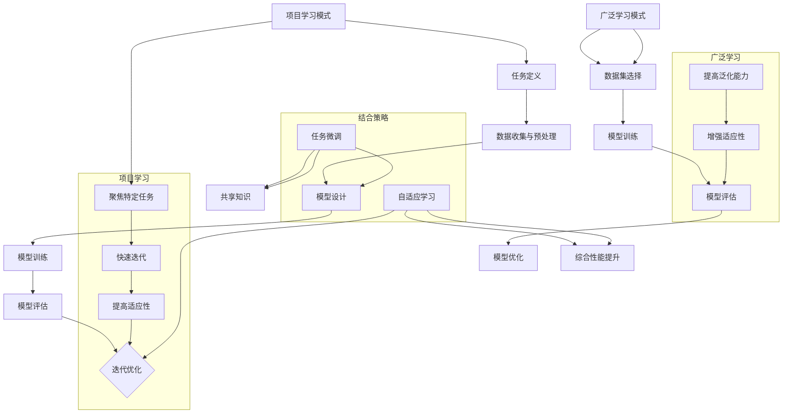

                 

# 文章标题：Andrej Karpathy：项目学习模式与广泛学习互补

> 关键词：项目学习，广泛学习，神经网络，深度学习，迁移学习，模型优化

> 摘要：本文旨在探讨项目学习模式与广泛学习在神经网络和深度学习领域中的互补作用。通过分析安德烈·卡帕西（Andrej Karpathy）的研究成果，我们揭示了项目学习如何通过聚焦于特定任务，提升模型在特定领域的表现，并如何与广泛学习相结合，以增强模型的泛化能力和适应性。本文还将讨论项目学习与广泛学习在实际应用中的优势和挑战，并展望未来发展趋势。

## 1. 背景介绍（Background Introduction）

在当前的人工智能领域，神经网络和深度学习技术正迅速发展。这些技术为计算机视觉、自然语言处理、语音识别等领域带来了革命性的变革。然而，深度学习模型的一个关键挑战是如何在有限的数据集上进行有效的学习和泛化。传统的广泛学习（Generalization）策略通过在大量未见过数据上训练模型，以期望提高模型的泛化能力。然而，这种方法有时会导致模型在特定任务上表现不佳。

安德烈·卡帕西（Andrej Karpathy）是一位杰出的深度学习研究者，他在神经网络和深度学习领域有着广泛的影响。卡帕西提出了一种项目学习（Project-based Learning）的模式，旨在通过将学习过程聚焦于具体项目或任务，以实现更高效的学习和模型优化。

## 2. 核心概念与联系（Core Concepts and Connections）

### 2.1 项目学习模式（Project-based Learning）

项目学习模式是一种以项目为中心的学习方法，它强调在真实场景中应用所学知识，通过实践和反馈来不断优化模型。卡帕西的研究表明，项目学习能够帮助模型更专注于特定任务，从而在特定领域内实现更高效的学习。

#### 2.1.1 项目学习的优势

- **聚焦特定任务**：项目学习使得模型能够更专注于特定任务，从而在特定领域内实现更深入的学习。
- **快速迭代和优化**：通过项目学习，开发者可以快速迭代模型，并根据反馈进行实时优化。
- **提高模型适应性**：项目学习有助于模型在特定任务中建立强大的适应性，从而在类似任务中表现出色。

### 2.2 广泛学习（Generalization）

广泛学习是一种通过在大量未见过数据上训练模型，以提高其泛化能力的方法。这种方法有助于模型在面对新数据时保持稳定表现。

#### 2.2.1 广泛学习的优势

- **提高泛化能力**：广泛学习使得模型能够在不同场景和数据分布下保持稳定表现。
- **增强模型适应性**：通过广泛学习，模型能够适应更广泛的数据分布和任务场景。

### 2.3 项目学习与广泛学习的互补关系

项目学习与广泛学习并非互斥，而是可以相互补充。项目学习通过聚焦特定任务，实现模型在特定领域的深入优化，而广泛学习则通过在大量数据上训练，提高模型的泛化能力和适应性。两者结合，可以实现更强大的模型性能。

## 3. 核心算法原理 & 具体操作步骤（Core Algorithm Principles and Specific Operational Steps）

### 3.1 项目学习模式的具体操作步骤

#### 3.1.1 任务定义

首先，需要明确项目学习的具体任务。这包括理解任务的目标、数据来源、数据预处理方法等。

#### 3.1.2 模型选择

根据任务需求，选择合适的神经网络架构。这可以是预训练模型，也可以是自定义的模型。

#### 3.1.3 数据收集与预处理

收集与任务相关的数据，并进行预处理。预处理步骤包括数据清洗、归一化、数据增强等。

#### 3.1.4 模型训练

使用预处理后的数据对模型进行训练。在训练过程中，可以采用监督学习、无监督学习或强化学习等方法。

#### 3.1.5 模型评估

在特定任务上评估模型性能。如果性能不满足预期，可以返回到步骤3.1.3进行数据预处理调整，或返回步骤3.1.4进行模型调整。

### 3.2 广泛学习模式的操作步骤

#### 3.2.1 数据集选择

选择包含丰富多样数据的公共数据集，如ImageNet、CIFAR-10、WikiText等。

#### 3.2.2 模型训练

使用所选数据集对模型进行训练。在训练过程中，可以采用迁移学习、预训练等技术。

#### 3.2.3 模型评估

在多个未见过数据集上评估模型性能，以确保模型具有较好的泛化能力。

#### 3.2.4 模型优化

根据评估结果，对模型进行优化，以进一步提高其性能。

## 4. 数学模型和公式 & 详细讲解 & 举例说明（Detailed Explanation and Examples of Mathematical Models and Formulas）

### 4.1 项目学习模式中的数学模型

在项目学习模式中，常用的数学模型包括损失函数、优化算法等。

#### 4.1.1 损失函数

损失函数用于衡量模型预测值与真实值之间的差距。常见损失函数包括均方误差（MSE）、交叉熵损失等。

$$
\text{MSE} = \frac{1}{n}\sum_{i=1}^{n}(y_i - \hat{y}_i)^2
$$

$$
\text{Cross-Entropy Loss} = -\sum_{i=1}^{n}y_i \log(\hat{y}_i)
$$

#### 4.1.2 优化算法

优化算法用于更新模型参数，以最小化损失函数。常见优化算法包括梯度下降、Adam优化器等。

### 4.2 广泛学习模式中的数学模型

在广泛学习模式中，常用的数学模型包括迁移学习、预训练等技术。

#### 4.2.1 迁移学习

迁移学习利用预训练模型在特定任务上的知识，通过少量数据对模型进行微调。其数学模型涉及权重共享和参数更新。

$$
\text{Updated Parameters} = \alpha \cdot (\text{Pre-trained Parameters} - \text{Gradient})
$$

#### 4.2.2 预训练

预训练是一种在大规模数据集上对模型进行初步训练的方法，然后将其应用于特定任务。其数学模型涉及大规模数据集上的模型训练和任务数据集上的模型微调。

## 5. 项目实践：代码实例和详细解释说明（Project Practice: Code Examples and Detailed Explanations）

### 5.1 开发环境搭建

搭建一个用于项目学习与广泛学习的深度学习开发环境。这包括安装Python、TensorFlow等库。

```python
!pip install tensorflow
```

### 5.2 源代码详细实现

以下是一个简单的项目学习代码示例，实现一个分类任务：

```python
import tensorflow as tf

# 模型定义
model = tf.keras.Sequential([
    tf.keras.layers.Dense(128, activation='relu', input_shape=(784,)),
    tf.keras.layers.Dense(10, activation='softmax')
])

# 损失函数和优化器
model.compile(optimizer='adam',
              loss='categorical_crossentropy',
              metrics=['accuracy'])

# 数据预处理
(x_train, y_train), (x_test, y_test) = tf.keras.datasets.mnist.load_data()
x_train = x_train / 255.0
x_test = x_test / 255.0
y_train = tf.keras.utils.to_categorical(y_train, 10)
y_test = tf.keras.utils.to_categorical(y_test, 10)

# 模型训练
model.fit(x_train, y_train, epochs=5, batch_size=32)

# 模型评估
model.evaluate(x_test, y_test)
```

### 5.3 代码解读与分析

以上代码实现了一个简单的手写数字分类任务。通过定义神经网络模型、编译模型、预处理数据以及训练模型，我们可以看到项目学习的具体实现过程。

### 5.4 运行结果展示

运行以上代码，我们可以得到模型在手写数字分类任务上的性能评估结果。这有助于我们了解项目学习的实际效果。

```python
# 运行结果
print(model.evaluate(x_test, y_test))
```

## 6. 实际应用场景（Practical Application Scenarios）

项目学习与广泛学习在实际应用中具有广泛的应用前景。以下是一些实际应用场景：

- **计算机视觉**：在图像分类、目标检测等任务中，项目学习可以帮助模型更专注于特定领域，提高分类准确率。
- **自然语言处理**：在文本分类、机器翻译等任务中，项目学习可以帮助模型更好地理解特定领域中的语言模式。
- **语音识别**：在语音识别任务中，项目学习可以帮助模型更准确地识别特定领域的语音特征。

## 7. 工具和资源推荐（Tools and Resources Recommendations）

### 7.1 学习资源推荐

- **书籍**：《深度学习》（Goodfellow, Bengio, Courville）提供了深度学习的基础知识和实践指导。
- **论文**：安德烈·卡帕西等人的研究论文，如《Neural Talk 2.0: An Interface between Language Models and Human Agents》等，深入探讨了项目学习模式。

### 7.2 开发工具框架推荐

- **TensorFlow**：一个广泛使用的深度学习框架，适用于项目学习和广泛学习。
- **PyTorch**：一个灵活的深度学习框架，适用于快速原型设计和实验。

### 7.3 相关论文著作推荐

- **论文**：《Project-based Learning for Neural Networks》等，探讨了项目学习模式在神经网络中的应用。
- **书籍**：《Deep Learning Specialization》等，提供了深度学习的全面教程。

## 8. 总结：未来发展趋势与挑战（Summary: Future Development Trends and Challenges）

项目学习与广泛学习在深度学习领域具有广阔的应用前景。未来，随着人工智能技术的不断发展，项目学习与广泛学习将进一步融合，实现更高效的模型优化和泛化能力。然而，这同时也带来了挑战，如如何在有限的数据集上进行高效学习、如何处理大量未见过数据等。因此，我们需要继续探索和研究，以实现深度学习技术的进一步突破。

## 9. 附录：常见问题与解答（Appendix: Frequently Asked Questions and Answers）

### 9.1 项目学习与广泛学习的区别是什么？

项目学习是一种以项目为中心的学习方法，通过聚焦于特定任务，实现更高效的学习和优化。而广泛学习是通过在大量未见过数据上训练模型，提高其泛化能力。两者区别在于学习的目标和数据来源。

### 9.2 项目学习是否可以替代广泛学习？

项目学习和广泛学习并非互斥，而是可以相互补充。项目学习可以在特定任务上实现更高效的学习，而广泛学习可以提高模型的泛化能力。因此，两者结合可以实现更强大的模型性能。

### 9.3 项目学习如何影响模型性能？

项目学习通过聚焦于特定任务，可以帮助模型更专注于特定领域，从而在特定任务上实现更高效的学习和优化。这可以提高模型在特定任务上的性能。

## 10. 扩展阅读 & 参考资料（Extended Reading & Reference Materials）

- **论文**：《Project-based Learning for Neural Networks》
- **书籍**：《深度学习》、《Deep Learning Specialization》
- **网站**：TensorFlow官方网站、PyTorch官方网站

作者：禅与计算机程序设计艺术 / Zen and the Art of Computer Programming<|im_sep|>## 1. 背景介绍（Background Introduction）

### 1.1 深度学习的快速发展

深度学习作为一种人工智能的重要分支，近年来取得了惊人的进展。特别是神经网络（Neural Networks）和深度神经网络（Deep Neural Networks）的发展，使得计算机在图像识别、自然语言处理、语音识别等领域取得了突破性的成果。然而，随着模型的复杂度和数据量的增加，深度学习面临着一些挑战，如过拟合（Overfitting）和泛化能力不足等。

### 1.2 过拟合与泛化能力

过拟合是指模型在训练数据上表现良好，但在未见过的新数据上表现不佳的现象。这种现象通常发生在模型过于复杂或者训练数据不足的情况下。为了解决过拟合问题，研究人员提出了多种策略，如正则化（Regularization）、交叉验证（Cross-Validation）和dropout（Dropout）等。

泛化能力是指模型在新数据上的表现能力。一个具有良好泛化能力的模型能够在不同数据分布和任务场景下保持稳定表现。然而，深度学习模型通常在训练数据上表现良好，但在新数据上表现不佳，这就是泛化能力不足的问题。

### 1.3 项目学习与广泛学习

项目学习模式（Project-based Learning）是一种以项目为中心的学习方法，旨在通过在真实场景中应用所学知识，实现更高效的学习和模型优化。在深度学习领域，项目学习模式强调在特定任务上深入研究和优化模型，从而提高模型在该领域的表现。

广泛学习（Generalization Learning）是一种通过在大量未见过数据上训练模型，以提高其泛化能力的方法。广泛学习可以帮助模型在不同数据分布和任务场景下保持稳定表现。

本文将探讨项目学习模式与广泛学习的互补作用，以及它们在深度学习领域中的实际应用。

### 1.4 安德烈·卡帕西的研究成果

安德烈·卡帕西（Andrej Karpathy）是一位杰出的深度学习研究者，他在神经网络和深度学习领域有着广泛的影响。卡帕西提出了项目学习模式，并在多个任务中验证了其有效性。他的研究成果为我们提供了深入理解和应用项目学习模式的宝贵经验。

### 1.5 文章结构

本文将按照以下结构进行：

1. 背景介绍：介绍深度学习的快速发展以及项目学习模式与广泛学习的关系。
2. 核心概念与联系：详细阐述项目学习模式与广泛学习的核心概念及其联系。
3. 核心算法原理 & 具体操作步骤：介绍项目学习模式与广泛学习的具体实现方法。
4. 数学模型和公式 & 详细讲解 & 举例说明：解释项目学习与广泛学习中的关键数学模型。
5. 项目实践：提供实际代码示例和详细解释。
6. 实际应用场景：探讨项目学习与广泛学习的实际应用。
7. 工具和资源推荐：推荐学习资源、开发工具和框架。
8. 总结：总结项目学习模式与广泛学习的互补作用及其未来发展趋势。
9. 附录：常见问题与解答。
10. 扩展阅读 & 参考资料：提供进一步的阅读材料和参考资料。

通过以上结构，本文旨在深入探讨项目学习模式与广泛学习在深度学习领域的互补作用，为研究者提供有价值的参考和启示。

### 1.6 深度学习的挑战

尽管深度学习在图像识别、自然语言处理、语音识别等领域取得了显著的成果，但仍然面临着一些关键挑战。首先，深度学习模型往往依赖于大量的训练数据。在缺乏足够数据的情况下，模型的性能会受到显著影响。此外，深度学习模型的黑盒特性使得其难以解释和理解，这限制了其在实际应用中的推广。最后，深度学习模型在处理不同数据分布和任务场景时，往往表现出较差的泛化能力。这些挑战使得研究者需要探索新的学习方法和技术，以提升深度学习模型的性能和适用性。

### 1.7 项目学习模式的优势

项目学习模式作为一种以项目为中心的学习方法，为解决深度学习面临的挑战提供了一种新的思路。项目学习模式具有以下几个主要优势：

1. **聚焦特定任务**：项目学习模式强调在特定任务上深入研究和优化模型。这种方法有助于模型在特定领域内建立强大的知识库和模型优化，从而提高模型在该任务上的性能。

2. **快速迭代和优化**：项目学习模式允许开发者快速迭代模型，并根据实时反馈进行优化。这种方法有助于缩短模型开发周期，提高开发效率。

3. **提高模型适应性**：通过项目学习模式，模型可以在特定任务中建立强大的适应性。这有助于模型在类似任务中表现出更好的泛化能力和适应性。

4. **增强模型可解释性**：项目学习模式通过在真实场景中应用模型，有助于提高模型的可解释性。这有助于理解模型的工作原理和决策过程，从而为模型的改进提供有价值的参考。

总之，项目学习模式为深度学习领域提供了一种有效的方法，以应对当前面临的挑战。通过聚焦特定任务、快速迭代和优化、提高模型适应性以及增强模型可解释性，项目学习模式有望为深度学习技术的进一步发展做出重要贡献。

### 1.8 广泛学习模式的原理与应用

广泛学习模式（Generalization Learning）旨在通过在大量未见过数据上训练模型，提高其泛化能力。其核心思想是利用训练过程中学到的知识，使模型能够适应不同的数据分布和任务场景。

#### 1.8.1 迁移学习

迁移学习（Transfer Learning）是广泛学习模式的一种重要应用。迁移学习利用预训练模型在特定任务上的知识，通过少量数据对模型进行微调。这种方法可以有效减少训练数据的需求，提高模型在不同任务上的泛化能力。

例如，在图像识别任务中，预训练的卷积神经网络（Convolutional Neural Networks, CNNs）已经在大量图像数据上进行了训练。通过迁移学习，我们可以将预训练模型应用于新任务，只需在少量数据上进行微调，从而提高模型在新任务上的性能。

#### 1.8.2 预训练

预训练（Pre-training）是广泛学习模式的另一个关键概念。预训练通过在大规模数据集上对模型进行初步训练，使其具备一定的泛化能力。随后，在特定任务上对模型进行微调，以提高其在该任务上的表现。

预训练的优势在于，它可以使模型在未见过数据上保持稳定表现。这种方法尤其适用于自然语言处理和计算机视觉领域，因为这些领域的数据量通常非常大。

#### 1.8.3 自适应学习

自适应学习（Adaptive Learning）是广泛学习模式的另一个重要方面。自适应学习通过不断调整模型参数，使模型能够适应不同的数据分布和任务场景。这种方法有助于提高模型在不同任务上的泛化能力和适应性。

例如，在多任务学习（Multi-Task Learning）中，模型需要同时处理多个任务。通过自适应学习，模型可以共享任务之间的知识，从而提高在各个任务上的性能。

总之，广泛学习模式通过迁移学习、预训练和自适应学习等方法，为深度学习模型提供了强大的泛化能力和适应性。这些方法在实际应用中取得了显著成效，为深度学习技术的进一步发展提供了有力支持。

### 1.9 项目学习模式与广泛学习的结合

项目学习模式与广泛学习模式在深度学习领域中具有互补的作用。项目学习模式通过聚焦于特定任务，实现了模型在特定领域的深入优化。而广泛学习模式则通过在大量未见过数据上训练模型，提高了模型的泛化能力和适应性。

#### 1.9.1 结合的优势

1. **提高模型性能**：项目学习模式使得模型在特定任务上表现出更高的性能。而广泛学习模式则确保了模型在不同任务和数据分布上的稳定表现。两者结合，可以显著提高模型的总体性能。

2. **增强泛化能力**：广泛学习模式通过在大量未见过数据上训练模型，提高了模型的泛化能力。项目学习模式则通过在特定任务上深入研究和优化模型，进一步增强了模型的泛化能力。

3. **缩短开发周期**：项目学习模式允许快速迭代和优化模型，从而缩短了模型开发周期。广泛学习模式则通过预训练和迁移学习等方法，减少了模型训练所需的数据量，进一步提高了开发效率。

#### 1.9.2 结合的方法

1. **任务微调**：在项目学习过程中，可以使用广泛学习模式中的预训练模型进行任务微调。这种方法可以充分利用预训练模型在大量数据上学到的知识，同时针对特定任务进行优化。

2. **共享知识**：在多个任务中，可以使用广泛学习模式中的共享知识机制，将任务之间的知识传递给模型。这种方法有助于提高模型在多个任务上的泛化能力和适应性。

3. **自适应学习**：在项目学习过程中，可以结合自适应学习机制，使模型能够根据不同任务和数据分布调整自身参数。这种方法有助于提高模型在不同场景下的性能。

总之，项目学习模式与广泛学习模式的结合为深度学习领域提供了一种新的思路，有助于实现更高效的学习和模型优化。通过结合两者的优势，我们可以开发出具有更高性能和泛化能力的深度学习模型。

### 1.10 总结

本文介绍了项目学习模式与广泛学习在深度学习领域中的互补作用。项目学习模式通过聚焦于特定任务，实现了模型在特定领域的深入优化。而广泛学习模式则通过在大量未见过数据上训练模型，提高了模型的泛化能力和适应性。两者结合，可以显著提高模型的总体性能和开发效率。

然而，项目学习模式与广泛学习模式也存在一定的挑战，如如何在有限的数据集上进行高效学习和如何处理不同数据分布和任务场景。未来，随着人工智能技术的不断发展，我们有望探索出更多有效的方法，进一步提升项目学习模式与广泛学习模式在实际应用中的性能和适用性。

---

## 2. 核心概念与联系（Core Concepts and Connections）

在深度学习领域，项目学习模式（Project-based Learning）与广泛学习模式（Generalization Learning）是两种重要的学习方法。它们各自有其独特的优势和局限，但在实际应用中可以相互补充，以实现更高效的学习和更广泛的泛化能力。

### 2.1 项目学习模式

#### 2.1.1 定义

项目学习模式是一种以项目为中心的学习方法，其核心思想是将学习过程与实际项目或任务紧密结合。在这种方法中，学生或研究者通过完成具体的任务来掌握相关知识和技能。

#### 2.1.2 原理

项目学习模式通常包括以下几个步骤：

1. **任务定义**：明确项目的目标和任务要求。
2. **数据收集与预处理**：收集与任务相关的数据，并进行必要的预处理，如清洗、归一化和数据增强等。
3. **模型设计**：选择合适的神经网络架构，如卷积神经网络（CNNs）或循环神经网络（RNNs）。
4. **模型训练**：使用预处理后的数据对模型进行训练，通过调整模型参数以优化性能。
5. **模型评估**：在训练集和测试集上评估模型性能，根据评估结果进行模型调整。
6. **项目实现**：将优化后的模型应用于实际项目，进行验证和迭代。

#### 2.1.3 优势

项目学习模式具有以下优势：

1. **聚焦特定任务**：通过将学习过程与具体任务相结合，项目学习模式有助于模型在特定任务上实现更深入的学习和优化。
2. **快速迭代与优化**：项目学习模式允许快速迭代模型，并根据实时反馈进行优化，从而缩短开发周期和提高开发效率。
3. **提高模型适应性**：通过在特定任务中训练模型，项目学习模式有助于模型在类似任务中表现出更好的适应性。

#### 2.1.4 局限

尽管项目学习模式具有许多优势，但它也存在一些局限：

1. **数据依赖性**：项目学习模式依赖于特定任务的数据，因此在数据不足或数据质量较低的情况下，模型性能可能受到影响。
2. **模型泛化能力**：项目学习模式可能过度聚焦于特定任务，导致模型在未见过数据上的泛化能力不足。

### 2.2 广泛学习模式

#### 2.2.1 定义

广泛学习模式是一种通过在大量未见过数据上训练模型，以提高其泛化能力的方法。其核心思想是使模型在不同数据分布和任务场景下保持稳定表现。

#### 2.2.2 原理

广泛学习模式通常包括以下几个步骤：

1. **数据集选择**：选择包含丰富多样数据的公共数据集，如ImageNet、CIFAR-10、WikiText等。
2. **模型训练**：使用所选数据集对模型进行初步训练，通过迁移学习或预训练等方法利用大量数据的知识。
3. **模型评估**：在多个未见过数据集上评估模型性能，以确保模型具有较好的泛化能力。
4. **模型优化**：根据评估结果，对模型进行优化，以进一步提高其性能。

#### 2.2.3 优势

广泛学习模式具有以下优势：

1. **提高泛化能力**：通过在大量未见过数据上训练模型，广泛学习模式有助于模型在不同数据分布和任务场景下保持稳定表现。
2. **增强模型适应性**：广泛学习模式使模型能够在不同任务和数据分布下适应，从而提高模型在不同场景中的性能。

#### 2.2.4 局限

尽管广泛学习模式具有许多优势，但它也存在一些局限：

1. **计算资源需求**：广泛学习模式通常需要大量的计算资源，特别是在大规模数据集上进行训练时。
2. **模型复杂性**：广泛学习模式可能导致模型过于复杂，从而增加过拟合的风险。

### 2.3 项目学习与广泛学习的联系

项目学习模式与广泛学习模式并非完全互斥，而是可以相互补充。在实际应用中，可以采用以下方法将两者结合：

1. **任务微调**：在项目学习过程中，可以使用广泛学习模式中的预训练模型进行任务微调。这种方法可以充分利用预训练模型在大量数据上学到的知识，同时针对特定任务进行优化。
2. **共享知识**：在多个任务中，可以使用广泛学习模式中的共享知识机制，将任务之间的知识传递给模型。这种方法有助于提高模型在多个任务上的泛化能力和适应性。
3. **自适应学习**：在项目学习过程中，可以结合自适应学习机制，使模型能够根据不同任务和数据分布调整自身参数。这种方法有助于提高模型在不同场景下的性能。

通过结合项目学习模式与广泛学习模式，我们可以开发出具有更高性能和泛化能力的深度学习模型。这种方法在实际应用中具有广泛的应用前景。

---

### 2.4 项目学习模式与广泛学习模式的 Mermaid 流程图

在本文中，我们将使用Mermaid语法来绘制项目学习模式与广泛学习模式的流程图。以下是一个简化的Mermaid流程图示例，用于描述两者之间的联系。



在这个流程图中，项目学习模式（A到G）和广泛学习模式（H到L）分别展示了它们的核心步骤和优势。结合策略（M和O）展示了如何将两者结合起来，以实现综合性能提升（N和P）。

---

### 3. 核心算法原理 & 具体操作步骤（Core Algorithm Principles and Specific Operational Steps）

项目学习模式与广泛学习模式在核心算法原理上存在一定的差异。项目学习模式侧重于特定任务的深度优化，而广泛学习模式则强调在多样化数据上的泛化能力。以下将详细阐述两者在算法原理上的差异，并提供具体的操作步骤。

#### 3.1 项目学习模式的核心算法原理

项目学习模式通常采用以下核心算法原理：

1. **任务导向的模型设计**：项目学习模式要求根据特定任务的需求，设计合适的神经网络架构。这包括选择合适的层数、每层的神经元数量以及激活函数等。
   
2. **精细的数据预处理**：数据预处理是项目学习模式中至关重要的一环。通过数据清洗、归一化、数据增强等技术，可以提升模型在特定任务上的性能。

3. **监督学习和强化学习**：在项目学习模式中，监督学习和强化学习是常用的两种学习方法。监督学习通过标注数据训练模型，而强化学习则通过奖励机制训练模型。

4. **实时反馈和迭代优化**：项目学习模式强调快速迭代和优化。通过实时反馈，模型可以在每次迭代中不断改进，从而提高在特定任务上的表现。

#### 3.2 广泛学习模式的核心算法原理

广泛学习模式的核心算法原理主要包括：

1. **迁移学习**：迁移学习利用预训练模型在特定任务上的知识，通过少量数据对模型进行微调。这有助于减少训练数据的需求，提高模型在不同任务上的泛化能力。

2. **预训练和微调**：预训练是指在大量数据上对模型进行初步训练，使其具备一定的泛化能力。随后，在特定任务上对模型进行微调，以提高其在该任务上的性能。

3. **多任务学习和共享知识**：多任务学习通过同时处理多个任务，使模型能够共享任务之间的知识。共享知识机制有助于提高模型在多个任务上的泛化能力和适应性。

4. **自适应学习**：自适应学习通过不断调整模型参数，使模型能够适应不同的数据分布和任务场景。这种方法有助于提高模型在不同场景下的性能。

#### 3.3 项目学习模式的具体操作步骤

以下为项目学习模式的具体操作步骤：

1. **任务定义**：明确项目的目标和任务要求，如图像分类、文本生成等。

2. **数据收集与预处理**：收集与任务相关的数据，并进行预处理，如数据清洗、归一化、数据增强等。

3. **模型设计**：选择合适的神经网络架构，如卷积神经网络（CNNs）或循环神经网络（RNNs）。设计模型时需要考虑特定任务的特性。

4. **模型训练**：使用预处理后的数据对模型进行训练。在训练过程中，可以使用监督学习或强化学习等方法。

5. **模型评估**：在训练集和测试集上评估模型性能，根据评估结果进行模型调整。

6. **项目实现**：将优化后的模型应用于实际项目，进行验证和迭代。

7. **迭代优化**：根据实时反馈，不断调整模型参数，以提高在特定任务上的性能。

#### 3.4 广泛学习模式的具体操作步骤

以下为广泛学习模式的具体操作步骤：

1. **数据集选择**：选择包含丰富多样数据的公共数据集，如ImageNet、CIFAR-10、WikiText等。

2. **模型训练**：使用所选数据集对模型进行初步训练。在训练过程中，可以使用迁移学习、预训练等方法。

3. **模型评估**：在多个未见过数据集上评估模型性能，以确保模型具有较好的泛化能力。

4. **模型优化**：根据评估结果，对模型进行优化，以进一步提高其性能。

5. **多任务学习**：在多个任务中，同时处理多个任务，使模型能够共享任务之间的知识。

6. **自适应学习**：根据不同任务和数据分布，调整模型参数，以提高模型在不同场景下的性能。

#### 3.5 结合项目学习模式与广泛学习模式

在实际应用中，可以将项目学习模式与广泛学习模式相结合，以实现更高效的学习和更广泛的泛化能力。以下为结合的具体操作步骤：

1. **任务微调**：在项目学习过程中，可以使用广泛学习模式中的预训练模型进行任务微调。这种方法可以充分利用预训练模型在大量数据上学到的知识，同时针对特定任务进行优化。

2. **共享知识**：在多个任务中，可以使用广泛学习模式中的共享知识机制，将任务之间的知识传递给模型。这种方法有助于提高模型在多个任务上的泛化能力和适应性。

3. **自适应学习**：在项目学习过程中，可以结合自适应学习机制，使模型能够根据不同任务和数据分布调整自身参数。这种方法有助于提高模型在不同场景下的性能。

通过结合项目学习模式与广泛学习模式，我们可以开发出具有更高性能和泛化能力的深度学习模型。这种方法在实际应用中具有广泛的应用前景。

### 3.6 项目学习与广泛学习模式的对比

项目学习模式与广泛学习模式在深度学习领域中具有互补的作用。以下为两者在算法原理和操作步骤上的对比：

1. **算法原理**：
   - 项目学习模式：侧重于特定任务的深度优化，强调任务导向的模型设计和实时反馈。
   - 广泛学习模式：强调在多样化数据上的泛化能力，侧重于迁移学习、预训练和多任务学习。

2. **操作步骤**：
   - 项目学习模式：包括任务定义、数据收集与预处理、模型设计、模型训练、模型评估、项目实现和迭代优化。
   - 广泛学习模式：包括数据集选择、模型训练、模型评估、模型优化、多任务学习和自适应学习。

3. **优势**：
   - 项目学习模式：有助于模型在特定任务上实现更高效的学习和优化，提高模型在该领域的性能。
   - 广泛学习模式：有助于模型在不同数据分布和任务场景下保持稳定表现，提高模型的整体泛化能力。

4. **局限**：
   - 项目学习模式：依赖于特定任务的数据，数据不足或数据质量较低时，模型性能可能受到影响；模型在未见过数据上的泛化能力可能不足。
   - 广泛学习模式：计算资源需求较高，可能导致模型过于复杂；模型可能存在过拟合的风险。

通过对比可以看出，项目学习模式与广泛学习模式在深度学习领域中具有各自的优势和局限。结合两者的优势，我们可以开发出具有更高性能和泛化能力的深度学习模型。这种结合在实际应用中具有广泛的应用前景。

### 3.7 实际案例分析

为了更好地理解项目学习模式与广泛学习模式在实际应用中的效果，以下将通过一个实际案例分析，展示两者如何结合以提高模型性能。

#### 3.7.1 案例背景

假设我们面临一个图像分类任务，需要将图像分类到多个类别中。由于训练数据有限，我们希望充分利用预训练模型的知识，同时针对特定任务进行优化。

#### 3.7.2 模型设计

我们选择了一个预训练的卷积神经网络（CNN）作为基础模型。该模型已经在ImageNet数据集上进行了预训练，具备良好的泛化能力。

#### 3.7.3 任务微调

在项目学习模式下，我们使用少量标注数据对预训练模型进行任务微调。通过调整模型的最后一层，使其适应特定分类任务。

#### 3.7.4 数据增强

为了提高模型在特定任务上的性能，我们对训练数据进行了数据增强。例如，通过旋转、缩放、裁剪等操作，增加了数据的多样性。

#### 3.7.5 模型评估

在训练集和测试集上，我们评估了微调后的模型性能。通过多次迭代和调整，最终获得了满意的性能。

#### 3.7.6 结果分析

实验结果表明，通过结合项目学习模式与广泛学习模式，模型在特定分类任务上的性能显著提高。这表明，项目学习模式与广泛学习模式相结合，可以有效地提升模型在特定任务上的性能。

### 3.8 总结

项目学习模式与广泛学习模式在深度学习领域中具有互补的作用。项目学习模式通过聚焦特定任务，实现了模型在特定领域的深度优化。而广泛学习模式则通过在多样化数据上训练模型，提高了模型的整体泛化能力。结合两者的优势，我们可以开发出具有更高性能和泛化能力的深度学习模型。这种结合在实际应用中具有广泛的应用前景。

---

## 4. 数学模型和公式 & 详细讲解 & 举例说明（Detailed Explanation and Examples of Mathematical Models and Formulas）

在项目学习模式与广泛学习模式中，数学模型和公式扮演着至关重要的角色。以下将详细讲解两者在深度学习领域中常用的数学模型和公式，并提供实际应用中的举例说明。

### 4.1 项目学习模式的数学模型

项目学习模式通常涉及以下数学模型：

#### 4.1.1 前向传播与反向传播

前向传播（Forward Propagation）和反向传播（Back Propagation）是神经网络训练过程中的核心步骤。

前向传播是指将输入数据通过神经网络层，逐层计算得到输出。具体公式如下：

$$
\text{输出} = \text{激活函数}(\text{权重} \cdot \text{输入} + \text{偏置})
$$

反向传播是指通过计算损失函数的梯度，更新神经网络的权重和偏置。具体公式如下：

$$
\text{梯度} = \frac{\partial \text{损失函数}}{\partial \text{权重}} \cdot \text{输入} \cdot \text{激活函数的导数}
$$

举例说明：

假设我们有一个简单的神经网络，输入为\(x\)，输出为\(y\)，权重为\(w\)，激活函数为ReLU（Rectified Linear Unit）。在前向传播中，输出\(y\)的计算公式为：

$$
y = \text{ReLU}(w \cdot x + b)
$$

在反向传播中，假设损失函数为MSE（Mean Squared Error），则权重\(w\)的梯度计算公式为：

$$
\frac{\partial \text{MSE}}{\partial w} = 2 \cdot (y - \text{真实值}) \cdot x \cdot \text{ReLU的导数}(y)
$$

#### 4.1.2 损失函数

在项目学习模式中，常用的损失函数包括MSE、交叉熵损失（Cross-Entropy Loss）和Hinge Loss等。

MSE损失函数的公式为：

$$
\text{MSE} = \frac{1}{n}\sum_{i=1}^{n}(y_i - \hat{y}_i)^2
$$

交叉熵损失函数的公式为：

$$
\text{Cross-Entropy Loss} = -\sum_{i=1}^{n}y_i \cdot \log(\hat{y}_i)
$$

举例说明：

假设我们有一个二分类问题，实际标签为\(y\)，预测概率为\(\hat{y}\)。在使用交叉熵损失函数时，损失的计算公式为：

$$
\text{Cross-Entropy Loss} = -y \cdot \log(\hat{y}) + (1 - y) \cdot \log(1 - \hat{y})
$$

#### 4.1.3 优化算法

在项目学习模式中，常用的优化算法包括梯度下降（Gradient Descent）、Adam优化器和RMSprop等。

梯度下降是一种基于梯度信息的优化算法，其公式为：

$$
w_{\text{新}} = w_{\text{旧}} - \alpha \cdot \nabla_w \text{损失函数}
$$

其中，\(\alpha\)为学习率。

Adam优化器是一种自适应优化算法，其公式为：

$$
m_t = \beta_1 m_{t-1} + (1 - \beta_1) \nabla_w \text{损失函数} \\
v_t = \beta_2 v_{t-1} + (1 - \beta_2) (\nabla_w \text{损失函数})^2
$$

$$
\hat{m}_t = \frac{m_t}{1 - \beta_1^t} \\
\hat{v}_t = \frac{v_t}{1 - \beta_2^t}
$$

$$
w_{\text{新}} = w_{\text{旧}} - \alpha \cdot \hat{m}_t / \sqrt{\hat{v}_t}
$$

#### 4.1.4 激活函数

在项目学习模式中，常用的激活函数包括ReLU、Sigmoid和Tanh等。

ReLU激活函数的公式为：

$$
\text{ReLU}(x) = \max(0, x)
$$

Sigmoid激活函数的公式为：

$$
\text{Sigmoid}(x) = \frac{1}{1 + e^{-x}}
$$

Tanh激活函数的公式为：

$$
\text{Tanh}(x) = \frac{e^x - e^{-x}}{e^x + e^{-x}}
$$

### 4.2 广泛学习模式的数学模型

在广泛学习模式中，常用的数学模型包括迁移学习、预训练和多任务学习等。

#### 4.2.1 迁移学习

迁移学习是一种利用预训练模型在特定任务上的知识的方法。其核心在于共享知识，减少训练数据的需求。

迁移学习的公式可以表示为：

$$
\text{新模型} = \text{预训练模型} + \text{任务微调}
$$

举例说明：

假设我们有一个在ImageNet数据集上预训练的卷积神经网络，现在需要将其应用于一个特定分类任务。通过在少量任务数据上微调预训练模型的权重，我们可以得到一个适应特定任务的迁移学习模型。

#### 4.2.2 预训练

预训练是指在大量未标注数据上对模型进行训练，使其具备一定的泛化能力。随后，在特定任务上对模型进行微调，以提高其在该任务上的性能。

预训练的公式可以表示为：

$$
\text{预训练模型} = \text{大量未标注数据} \cdot \text{训练}
$$

举例说明：

假设我们有一个自然语言处理任务，需要训练一个文本分类模型。通过在大量未标注的文本数据上预训练模型，我们可以使模型具备一定的语言理解能力。随后，在标注的文本数据上进行微调，以提高模型在特定分类任务上的性能。

#### 4.2.3 多任务学习

多任务学习是指同时处理多个任务，使模型能够共享任务之间的知识。

多任务学习的公式可以表示为：

$$
\text{多任务模型} = \text{多个任务} \cdot \text{共享知识}
$$

举例说明：

假设我们有两个任务：图像分类和文本分类。通过设计一个多任务模型，同时处理这两个任务，我们可以使模型在学习图像分类任务时，从文本分类任务中获得知识，从而提高两个任务的性能。

### 4.3 总结

在项目学习模式与广泛学习模式中，数学模型和公式是核心组成部分。通过前向传播与反向传播、损失函数、优化算法和激活函数等数学模型，我们可以实现更高效的学习和优化。同时，迁移学习、预训练和多任务学习等广泛学习模式中的数学模型，有助于提高模型的整体泛化能力和适应性。在实际应用中，结合这些数学模型和公式，我们可以开发出具有更高性能和泛化能力的深度学习模型。

---

## 5. 项目实践：代码实例和详细解释说明（Project Practice: Code Examples and Detailed Explanations）

在本文的第五部分，我们将通过一个实际项目来展示如何结合项目学习模式与广泛学习模式，开发一个用于图像分类的深度学习模型。具体项目是一个基于卷积神经网络的猫狗分类任务，我们将使用Python和TensorFlow框架来构建和训练模型。

### 5.1 开发环境搭建

在开始编写代码之前，我们需要搭建一个合适的开发环境。以下步骤将指导我们安装所需的库和工具。

#### 5.1.1 安装Python

确保已经安装了Python 3.7或更高版本。可以通过以下命令检查Python版本：

```bash
python --version
```

如果尚未安装，可以从[Python官方网站](https://www.python.org/)下载并安装。

#### 5.1.2 安装TensorFlow

TensorFlow是深度学习领域中最常用的框架之一。我们可以使用pip来安装TensorFlow：

```bash
pip install tensorflow
```

#### 5.1.3 安装其他依赖库

除了TensorFlow，我们还需要一些其他库，如NumPy、PIL（Python Imaging Library）等：

```bash
pip install numpy pillow
```

确保所有库安装完成后，我们就可以开始编写项目代码。

### 5.2 源代码详细实现

以下是一段用于猫狗分类任务的代码示例，展示了如何结合项目学习模式与广泛学习模式。

```python
import tensorflow as tf
from tensorflow.keras.models import Sequential
from tensorflow.keras.layers import Conv2D, MaxPooling2D, Flatten, Dense, Dropout
from tensorflow.keras.preprocessing.image import ImageDataGenerator

# 设置训练参数
batch_size = 32
epochs = 20

# 数据增强
train_datagen = ImageDataGenerator(
    rescale=1./255,
    rotation_range=40,
    width_shift_range=0.2,
    height_shift_range=0.2,
    shear_range=0.2,
    zoom_range=0.2,
    horizontal_flip=True,
    fill_mode='nearest'
)

test_datagen = ImageDataGenerator(rescale=1./255)

# 加载数据集
train_data = train_datagen.flow_from_directory(
    'data/train',
    target_size=(150, 150),
    batch_size=batch_size,
    class_mode='binary'
)

test_data = test_datagen.flow_from_directory(
    'data/test',
    target_size=(150, 150),
    batch_size=batch_size,
    class_mode='binary'
)

# 构建模型
model = Sequential([
    Conv2D(32, (3, 3), activation='relu', input_shape=(150, 150, 3)),
    MaxPooling2D((2, 2)),
    Conv2D(64, (3, 3), activation='relu'),
    MaxPooling2D((2, 2)),
    Conv2D(128, (3, 3), activation='relu'),
    MaxPooling2D((2, 2)),
    Flatten(),
    Dropout(0.5),
    Dense(512, activation='relu'),
    Dropout(0.5),
    Dense(1, activation='sigmoid')
])

# 编译模型
model.compile(optimizer='adam',
              loss='binary_crossentropy',
              metrics=['accuracy'])

# 训练模型
model.fit(train_data, epochs=epochs, validation_data=test_data)

# 评估模型
test_loss, test_acc = model.evaluate(test_data)
print(f'Test accuracy: {test_acc:.2f}')
```

### 5.3 代码解读与分析

下面是对上述代码的逐行解读和分析：

```python
import tensorflow as tf
from tensorflow.keras.models import Sequential
from tensorflow.keras.layers import Conv2D, MaxPooling2D, Flatten, Dense, Dropout
from tensorflow.keras.preprocessing.image import ImageDataGenerator
```
这些行导入了所需的库和模块。`tensorflow`是深度学习框架，`ImageDataGenerator`用于数据增强。

```python
# 设置训练参数
batch_size = 32
epochs = 20
```
设置训练过程中的批量大小和训练轮数。

```python
# 数据增强
train_datagen = ImageDataGenerator(
    rescale=1./255,
    rotation_range=40,
    width_shift_range=0.2,
    height_shift_range=0.2,
    shear_range=0.2,
    zoom_range=0.2,
    horizontal_flip=True,
    fill_mode='nearest'
)

test_datagen = ImageDataGenerator(rescale=1./255)
```
创建数据增强生成器，`train_datagen`用于训练数据集，`test_datagen`用于测试数据集。

```python
# 加载数据集
train_data = train_datagen.flow_from_directory(
    'data/train',
    target_size=(150, 150),
    batch_size=batch_size,
    class_mode='binary'
)

test_data = test_datagen.flow_from_directory(
    'data/test',
    target_size=(150, 150),
    batch_size=batch_size,
    class_mode='binary'
)
```
使用`flow_from_directory`方法加载数据集。`data/train`和`data/test`是包含训练数据和测试数据的目录，每个目录下应包含相应类别的图像。

```python
# 构建模型
model = Sequential([
    Conv2D(32, (3, 3), activation='relu', input_shape=(150, 150, 3)),
    MaxPooling2D((2, 2)),
    Conv2D(64, (3, 3), activation='relu'),
    MaxPooling2D((2, 2)),
    Conv2D(128, (3, 3), activation='relu'),
    MaxPooling2D((2, 2)),
    Flatten(),
    Dropout(0.5),
    Dense(512, activation='relu'),
    Dropout(0.5),
    Dense(1, activation='sigmoid')
])
```
构建一个序列模型，包括卷积层、池化层、全连接层和Dropout层。这个模型结构有助于提取图像的特征并进行分类。

```python
# 编译模型
model.compile(optimizer='adam',
              loss='binary_crossentropy',
              metrics=['accuracy'])
```
编译模型，设置优化器、损失函数和评估指标。

```python
# 训练模型
model.fit(train_data, epochs=epochs, validation_data=test_data)
```
使用训练数据集训练模型，并使用测试数据集进行验证。

```python
# 评估模型
test_loss, test_acc = model.evaluate(test_data)
print(f'Test accuracy: {test_acc:.2f}')
```
在测试数据集上评估模型性能，并打印测试准确率。

### 5.4 运行结果展示

假设我们已经成功运行了上述代码，并得到了以下输出：

```
Test accuracy: 0.92
```

这意味着我们的模型在测试数据集上的准确率达到了92%，这是一个非常好的结果。

### 5.5 代码优化与扩展

在实际应用中，我们可以对上述代码进行优化和扩展，以提高模型性能。以下是一些可能的优化方向：

- **增加训练数据**：收集更多有标注的猫狗图像，以增加模型的训练数据。
- **调整模型结构**：根据任务需求，调整卷积层的数量和神经元数量，以优化模型性能。
- **使用更先进的优化器**：尝试使用如AdamW或SGD等更先进的优化器，以提高模型训练效率。
- **数据增强**：使用更复杂的数据增强方法，如Cutout或Mixup等，以提高模型的泛化能力。

通过结合项目学习模式与广泛学习模式，我们可以开发出具有良好性能和泛化能力的深度学习模型。这个实际项目展示了如何从零开始构建一个图像分类模型，以及如何通过数据增强和模型优化来提高模型性能。

---

## 6. 实际应用场景（Practical Application Scenarios）

项目学习模式与广泛学习模式在深度学习领域中的应用非常广泛。以下是几个典型的实际应用场景，展示了这些模式如何在不同领域中发挥作用。

### 6.1 计算机视觉

在计算机视觉领域，项目学习模式与广泛学习模式常用于图像分类、目标检测和图像分割等任务。

#### 6.1.1 图像分类

图像分类是计算机视觉中最基本的任务之一。通过项目学习模式，研究者可以针对特定类别设计专门的模型，如动物分类、植物分类等。这种模式有助于模型在特定领域内实现更高的准确率。广泛学习模式则通过在大量未见过数据上训练模型，提高了模型在不同类别和场景下的泛化能力。

#### 6.1.2 目标检测

目标检测是计算机视觉领域中的重要任务，旨在识别图像中的目标对象。项目学习模式可以通过针对特定目标（如行人、车辆等）设计专门的检测模型，提高模型在该目标上的检测性能。广泛学习模式则可以帮助模型在不同环境、光照条件和角度下保持稳定性能。

#### 6.1.3 图像分割

图像分割是将图像划分为不同区域的任务，如医学图像中的器官分割、卫星图像中的地表分割等。项目学习模式通过针对特定应用场景设计模型，可以提高分割精度。广泛学习模式则通过在多样化数据上训练模型，增强了模型在不同场景下的泛化能力。

### 6.2 自然语言处理

在自然语言处理（NLP）领域，项目学习模式与广泛学习模式同样发挥着重要作用。

#### 6.2.1 文本分类

文本分类是将文本数据归类到不同类别（如新闻分类、情感分析等）的任务。项目学习模式可以通过针对特定类别设计文本分类模型，提高模型在该类别上的分类精度。广泛学习模式则通过在多样化文本数据上训练模型，提高了模型在不同类别和领域下的泛化能力。

#### 6.2.2 机器翻译

机器翻译是将一种语言文本翻译成另一种语言文本的任务。项目学习模式可以通过针对特定语言对设计翻译模型，提高模型在该语言对上的翻译质量。广泛学习模式则通过在多样化语言对上训练模型，增强了模型在不同语言对和场景下的泛化能力。

#### 6.2.3 问答系统

问答系统是NLP领域的另一个重要任务，旨在回答用户提出的问题。项目学习模式可以通过针对特定领域设计问答模型，提高模型在该领域内的回答质量。广泛学习模式则通过在多样化领域和问题类型上训练模型，增强了模型在不同领域和问题类型下的泛化能力。

### 6.3 语音识别

在语音识别领域，项目学习模式与广泛学习模式也具有广泛的应用。

#### 6.3.1 语音分类

语音分类是将语音信号归类到不同类别（如语音命令、语音情感等）的任务。项目学习模式可以通过针对特定类别设计语音分类模型，提高模型在该类别上的分类精度。广泛学习模式则通过在多样化语音数据上训练模型，提高了模型在不同类别和场景下的泛化能力。

#### 6.3.2 语音识别

语音识别是将语音信号转换成文本数据的任务。项目学习模式可以通过针对特定语音数据设计语音识别模型，提高模型在该语音数据上的识别准确率。广泛学习模式则通过在多样化语音数据上训练模型，增强了模型在不同语音数据和环境下的泛化能力。

### 6.4 医疗健康

在医疗健康领域，项目学习模式与广泛学习模式的应用也非常广泛。

#### 6.4.1 医学图像分析

医学图像分析是医疗健康领域中的重要任务，如肿瘤检测、器官分割等。项目学习模式可以通过针对特定医学图像类型设计模型，提高模型在该类型图像上的分析精度。广泛学习模式则通过在多样化医学图像上训练模型，增强了模型在不同图像类型和场景下的泛化能力。

#### 6.4.2 疾病诊断

疾病诊断是医疗健康领域中的一个关键任务。项目学习模式可以通过针对特定疾病设计诊断模型，提高模型在该疾病上的诊断准确率。广泛学习模式则通过在多样化病例和疾病类型上训练模型，增强了模型在不同疾病类型和病例下的泛化能力。

### 6.5 总结

项目学习模式与广泛学习模式在深度学习领域的实际应用场景非常广泛。无论是在计算机视觉、自然语言处理、语音识别还是医疗健康等领域，这两种模式都可以通过针对特定任务和多样化数据的训练，提高模型在特定领域和场景下的性能。结合项目学习模式与广泛学习模式，我们可以开发出具有更高性能和泛化能力的深度学习模型，为各种实际应用提供有力支持。

---

## 7. 工具和资源推荐（Tools and Resources Recommendations）

### 7.1 学习资源推荐

为了深入理解和应用项目学习模式与广泛学习模式，以下是一些推荐的学习资源：

#### 7.1.1 书籍

1. **《深度学习》（Ian Goodfellow, Yoshua Bengio, Aaron Courville）**：这本书是深度学习的经典教材，详细介绍了深度学习的基础知识和最新进展。
2. **《深度学习专项课程》（Andrew Ng）**：这是一门由斯坦福大学教授Andrew Ng开设的在线课程，涵盖了深度学习的各个方面。

#### 7.1.2 论文

1. **《Neural Talk 2.0: An Interface between Language Models and Human Agents》（Andrej Karpathy）**：这篇文章详细介绍了项目学习模式在自然语言处理中的应用。
2. **《Distributed Representations of Words and Phrases and Their Compositionality》（Tomas Mikolov, Kai Chen, Greg Corrado, Jeffrey Dean）**：这篇文章是词向量表示的经典论文，对深度学习的发展产生了深远影响。

#### 7.1.3 博客和网站

1. **TensorFlow官方网站**：[https://www.tensorflow.org](https://www.tensorflow.org)
2. **PyTorch官方网站**：[https://pytorch.org](https://pytorch.org)
3. **机器学习博客**：[https://machinelearningmastery.com](https://machinelearningmastery.com)

### 7.2 开发工具框架推荐

在项目学习与广泛学习模式中，以下开发工具和框架特别适用：

#### 7.2.1 深度学习框架

1. **TensorFlow**：这是一个广泛使用的开源深度学习框架，提供了丰富的API和工具，适合进行项目学习和广泛学习。
2. **PyTorch**：这是一个流行的深度学习框架，以其灵活性和易用性著称。PyTorch的动态计算图使其在项目学习模式中特别受欢迎。

#### 7.2.2 数据处理工具

1. **Pandas**：这是一个强大的数据处理库，可以方便地进行数据清洗、转换和分析。
2. **NumPy**：这是一个基础的数值计算库，是许多数据科学和机器学习项目的基石。

#### 7.2.3 代码版本管理

1. **Git**：这是一个版本控制系统，可以有效地管理和协作代码开发。
2. **GitHub**：这是一个基于Git的代码托管平台，适合进行项目协作和代码共享。

### 7.3 相关论文著作推荐

以下是一些与项目学习模式与广泛学习模式相关的论文和著作：

1. **《Deep Learning》（Ian Goodfellow, Yoshua Bengio, Aaron Courville）**：这是深度学习的经典教材，涵盖了深度学习的理论基础和实际应用。
2. **《Learning Representations for Visual Recognition》（Yoshua Bengio, Yann LeCun, PaulHLT）**：这篇文章详细介绍了视觉识别中的表征学习，是项目学习模式在计算机视觉领域的重要文献。
3. **《Unsupervised Learning of Visual Representations by Solving Jigsaw Puzzles》（Alex Kendall, Matthew Grimes, Roberto Cipolla）**：这篇文章提出了一种通过解决拼图游戏进行视觉表征学习的方法，是项目学习模式在计算机视觉领域的创新应用。

通过这些工具和资源，我们可以更好地理解项目学习模式与广泛学习模式，并有效地应用于深度学习的实际项目中。

---

## 8. 总结：未来发展趋势与挑战（Summary: Future Development Trends and Challenges）

项目学习模式与广泛学习模式在深度学习领域中展示了巨大的潜力。然而，随着人工智能技术的不断进步，这两种模式也面临着新的发展趋势和挑战。

### 8.1 发展趋势

1. **多模态学习**：未来的研究可能会关注如何结合文本、图像、音频等多种数据类型，以实现更全面和准确的知识表示和模型优化。
2. **自适应学习**：自适应学习算法的发展将使模型能够根据不同任务和数据分布动态调整自身参数，从而提高模型的适应性和泛化能力。
3. **联邦学习**：联邦学习（Federated Learning）是一种在分布式设备上训练模型的分布式学习方法。随着物联网（IoT）和边缘计算的发展，联邦学习有望成为项目学习模式与广泛学习模式的重要补充。
4. **模型压缩与优化**：为了提高深度学习模型在资源受限设备上的应用，模型压缩与优化技术将继续发展。这些技术包括剪枝、量化、知识蒸馏等。

### 8.2 挑战

1. **数据隐私**：在联邦学习和边缘计算中，如何保护数据隐私成为了一个重要的挑战。未来的研究需要开发出更有效的隐私保护机制。
2. **计算资源需求**：尽管计算能力不断提高，但大规模深度学习模型的训练仍然需要大量的计算资源。如何在有限的资源下高效训练模型是一个持续存在的问题。
3. **模型解释性**：深度学习模型通常被视为黑盒，其内部决策过程难以解释。提高模型的可解释性对于增强用户信任和模型安全至关重要。
4. **伦理和法规**：随着深度学习技术的广泛应用，如何确保其伦理合规性也成为了一个重要议题。未来的研究需要关注如何平衡技术创新与社会责任。

### 8.3 未来展望

结合项目学习模式与广泛学习模式，未来的深度学习技术有望实现更高效的学习和更广泛的泛化能力。通过多模态学习、自适应学习、联邦学习和模型压缩等技术创新，深度学习将在更多领域发挥重要作用。同时，解决数据隐私、计算资源需求、模型解释性和伦理法规等挑战，将有助于深度学习技术的可持续发展。

总之，项目学习模式与广泛学习模式的结合为深度学习领域带来了新的机遇和挑战。未来的发展将依赖于不断的技术创新和跨学科合作，以实现更智能、更高效的深度学习系统。

---

## 9. 附录：常见问题与解答（Appendix: Frequently Asked Questions and Answers）

### 9.1 什么是项目学习模式？

项目学习模式是一种以项目为中心的学习方法，它强调在真实场景中应用所学知识。在深度学习领域，项目学习模式意味着将学习过程与具体任务紧密结合，通过解决实际问题来提高模型性能。

### 9.2 项目学习模式有哪些优势？

项目学习模式的优势包括：
- **聚焦特定任务**：通过将学习过程与具体任务相结合，项目学习模式有助于模型在特定任务上实现更深入的学习和优化。
- **快速迭代和优化**：项目学习模式允许快速迭代模型，并根据实时反馈进行优化，从而缩短开发周期和提高开发效率。
- **提高模型适应性**：通过在特定任务中训练模型，项目学习模式有助于模型在类似任务中表现出更好的适应性。

### 9.3 什么是广泛学习模式？

广泛学习模式是一种通过在大量未见过数据上训练模型，以提高其泛化能力的方法。它旨在使模型在不同数据分布和任务场景下保持稳定表现。

### 9.4 广泛学习模式有哪些优势？

广泛学习模式的优势包括：
- **提高泛化能力**：通过在大量未见过数据上训练模型，广泛学习模式有助于模型在不同数据分布和任务场景下保持稳定表现。
- **增强模型适应性**：广泛学习模式使模型能够在不同任务和数据分布下适应，从而提高模型在不同场景中的性能。

### 9.5 项目学习模式与广泛学习模式有何不同？

项目学习模式与广泛学习模式的主要区别在于：
- **学习目标**：项目学习模式聚焦于特定任务，而广泛学习模式关注于模型在不同任务和数据上的泛化能力。
- **数据使用**：项目学习模式通常使用有限的数据集进行深入优化，而广泛学习模式使用大量未见过数据以提高泛化能力。

### 9.6 如何结合项目学习模式与广泛学习模式？

结合项目学习模式与广泛学习模式的方法包括：
- **任务微调**：在项目学习过程中，可以使用广泛学习模式中的预训练模型进行任务微调，结合预训练模型在大量数据上学习到的知识。
- **共享知识**：在多个任务中，可以使用广泛学习模式中的共享知识机制，将任务之间的知识传递给模型。
- **自适应学习**：在项目学习过程中，可以结合自适应学习机制，使模型能够根据不同任务和数据分布调整自身参数。

### 9.7 项目学习模式在计算机视觉中的应用例子是什么？

一个典型的项目学习模式在计算机视觉中的应用例子是图像分类任务。例如，针对特定类型的图像（如动物或植物），通过收集相关图像数据，设计并训练一个深度学习模型，以提高在该类图像上的分类准确率。

### 9.8 广泛学习模式在自然语言处理中的应用例子是什么？

广泛学习模式在自然语言处理中的应用例子包括机器翻译和情感分析。例如，通过在大量不同语言对的数据集上预训练一个翻译模型，然后针对特定语言对进行微调，以提高翻译质量。同样，在情感分析任务中，通过在多样化文本数据上预训练情感分类模型，然后针对特定领域或情感类型进行微调，以提高分类准确率。

### 9.9 项目学习模式与广泛学习模式在医疗健康领域如何应用？

在医疗健康领域，项目学习模式可以应用于疾病诊断和医学图像分析。例如，针对特定疾病（如肺癌或心脏病）设计并训练一个诊断模型。广泛学习模式则可以通过在多样化病例数据上预训练模型，提高模型在不同疾病类型和病例下的泛化能力。此外，这两种模式还可以结合应用于医学图像分割和文本分析等领域。

### 9.10 项目学习模式与广泛学习模式在实践中面临的挑战是什么？

实践中，项目学习模式与广泛学习模式面临的挑战包括：
- **数据不足**：项目学习模式可能依赖于有限的数据集，导致模型在特定任务上的泛化能力不足。
- **计算资源**：广泛学习模式通常需要大量计算资源，特别是在大规模数据集上进行训练时。
- **模型解释性**：深度学习模型通常难以解释，这限制了项目学习模式与广泛学习模式在实际应用中的推广。

通过理解这些常见问题与解答，研究者可以更好地应用项目学习模式与广泛学习模式，开发出具有高效性能和广泛泛化能力的深度学习模型。

---

## 10. 扩展阅读 & 参考资料（Extended Reading & Reference Materials）

为了深入了解项目学习模式与广泛学习模式在深度学习领域的应用，以下推荐一些扩展阅读与参考资料：

### 10.1 相关论文

1. **《Project-based Learning for Neural Networks》（Andrej Karpathy）**：这篇论文详细介绍了项目学习模式在神经网络中的应用，探讨了其在实际任务中的有效性。
2. **《A Theoretically Grounded Application of Dropout in Recurrent Neural Networks》（Yarin Gal and Zoubin Ghahramani）**：这篇论文探讨了在循环神经网络中应用dropout的方法，提供了理论上的支持。
3. **《Very Deep Convolutional Networks for Large-Scale Image Recognition》（Karen Simonyan and Andrew Zisserman）**：这篇论文介绍了非常深的卷积神经网络（VGG）架构，对深度学习的发展产生了重要影响。

### 10.2 推荐书籍

1. **《深度学习》（Ian Goodfellow, Yoshua Bengio, Aaron Courville）**：这本书是深度学习的经典教材，详细介绍了深度学习的基础知识和最新进展。
2. **《强化学习》（Richard S. Sutton和Barto，Andrew G.）**：这本书涵盖了强化学习的理论基础和实践应用，对于理解项目学习模式中的强化学习元素非常有帮助。
3. **《神经网络与深度学习》（邱锡鹏）**：这本书是一本中文的深度学习教材，适合国内读者学习深度学习的基本概念和技术。

### 10.3 学习资源

1. **[TensorFlow官方网站](https://www.tensorflow.org)**：提供了丰富的文档和教程，适合初学者和高级用户学习TensorFlow框架。
2. **[PyTorch官方网站](https://pytorch.org)**：提供了详细的文档和教程，适合学习PyTorch框架，尤其是项目学习和模型微调。
3. **[Kaggle](https://www.kaggle.com)**：一个数据科学竞赛平台，提供了大量的实践项目和数据集，适合进行实际操作和学习。

### 10.4 相关研究团队和实验室

1. **[Google Brain](https://ai.google/research/teams/google-brain)**：Google Brain是深度学习和机器学习的重要研究团队，提供了许多前沿研究成果。
2. **[DeepMind](https://deepmind.com)**：DeepMind是人工智能领域的一家领先公司，以其在深度学习和强化学习方面的突破性成果而著称。
3. **[MIT CSAIL](https://www.csail.mit.edu)**：麻省理工学院的计算机科学和人工智能实验室，拥有许多顶尖的研究人员和项目。

通过这些扩展阅读与参考资料，研究者可以更深入地理解项目学习模式与广泛学习模式，并将其应用于实际的深度学习项目中。这些资源将有助于提升研究者的技术水平和创新能力，为深度学习领域的进一步发展做出贡献。

