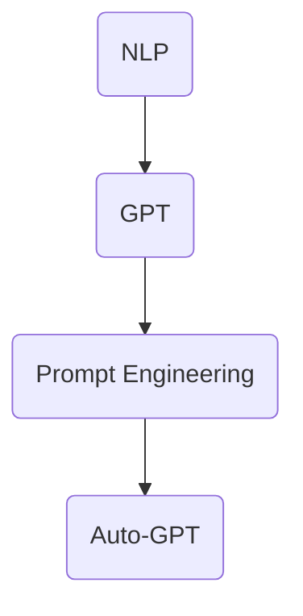
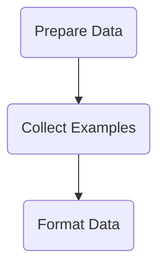
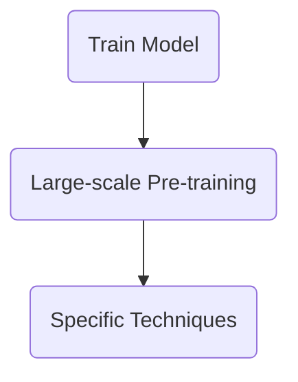
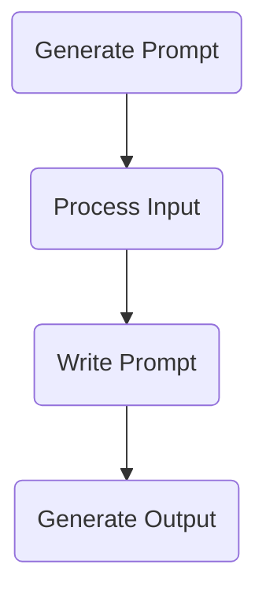
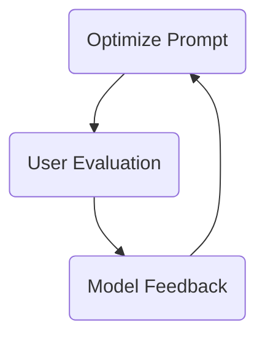

                 

### 文章标题

Auto-GPT Prompt 设计

本文将探讨 Auto-GPT Prompt 的设计方法，旨在为读者提供一套系统性的指导框架，帮助他们在实际应用中优化自然语言处理（NLP）模型的性能。通过深入分析 Auto-GPT 的基本原理、提示工程的关键要素以及具体实施步骤，本文旨在揭示如何设计出高效、可靠的 Prompt，从而实现更精准、更具创造力的模型输出。

### Title

Designing Auto-GPT Prompts

This article aims to explore the design methodology for Auto-GPT prompts, providing readers with a systematic framework to optimize the performance of NLP models in practical applications. By delving into the basic principles of Auto-GPT, the key elements of prompt engineering, and the specific implementation steps, this article seeks to reveal how to design efficient and reliable prompts that result in more precise and creative model outputs.

## 1. 背景介绍（Background Introduction）

自然语言处理（NLP）是人工智能（AI）领域的一个重要分支，旨在使计算机能够理解和处理人类语言。随着深度学习技术的飞速发展，NLP 模型在语音识别、文本分类、机器翻译等任务中取得了显著的成果。然而，这些模型的性能在很大程度上依赖于输入的文本质量。高质量、结构化的输入文本有助于模型更好地理解和生成目标语言。因此，设计有效的 Prompt 成为了提升模型性能的关键。

### Introduction

Natural Language Processing (NLP) is a crucial branch of artificial intelligence (AI) that aims to enable computers to understand and process human language. With the rapid development of deep learning technologies, NLP models have achieved remarkable success in tasks such as speech recognition, text classification, and machine translation. However, the performance of these models is largely dependent on the quality of the input text. High-quality and structured input text can help models better understand and generate target languages. Therefore, designing effective prompts has become a key factor in improving model performance.

在最近的研究中，Auto-GPT 作为一种自动化提示生成的技术，引起了广泛关注。Auto-GPT 是一种基于 GPT-3 的自动化系统，它通过训练自动生成高质量的 Prompt，从而提高模型在特定任务上的性能。这种技术的出现，为 Prompt 设计带来了一场革命，使得研究人员和开发者能够更加高效地利用 NLP 模型。

### Recent research

In recent studies, Auto-GPT, as an automated prompt generation technology, has garnered widespread attention. Auto-GPT is an automated system based on GPT-3 that is trained to generate high-quality prompts, thereby improving the performance of models on specific tasks. The emergence of this technology has revolutionized prompt design, allowing researchers and developers to utilize NLP models more efficiently.

本文将首先介绍 Auto-GPT 的基本原理和关键特性，然后详细阐述 Prompt 设计的步骤和方法，最后通过实际案例展示 Auto-GPT 在不同场景下的应用。希望通过本文的探讨，读者能够对 Auto-GPT Prompt 设计有一个全面、深入的理解，并能够在实际项目中灵活运用。

This article will first introduce the basic principles and key features of Auto-GPT, then elaborate on the steps and methods of prompt design, and finally demonstrate the application of Auto-GPT in various scenarios. It is hoped that through this discussion, readers will gain a comprehensive and profound understanding of Auto-GPT prompt design and be able to apply it flexibly in practical projects.

## 2. 核心概念与联系（Core Concepts and Connections）

在深入了解 Auto-GPT 之前，我们需要先理解一些关键概念，包括自然语言处理（NLP）、生成预训练变换器（GPT）和提示工程（Prompt Engineering）。这些概念在 Auto-GPT 中起着至关重要的作用，是构建高效 Prompt 的基础。

### Key Concepts

Before diving into Auto-GPT, we need to understand several key concepts, including Natural Language Processing (NLP), Generative Pre-trained Transformer (GPT), and Prompt Engineering. These concepts play a crucial role in Auto-GPT and are the foundation for building efficient prompts.

#### 2.1 自然语言处理（NLP）

自然语言处理（NLP）是计算机科学和人工智能的一个分支，旨在让计算机能够理解和处理人类语言。NLP 技术包括文本分类、情感分析、命名实体识别、机器翻译等。这些技术使得计算机能够从文本中提取有用信息，并将其用于各种应用程序，如搜索引擎、智能客服、语音助手等。

#### 2.2 生成预训练变换器（GPT）

生成预训练变换器（GPT）是由 OpenAI 开发的一种基于 Transformer 架构的深度学习模型。GPT 的核心思想是通过大规模无监督数据预训练，使模型能够捕捉到语言中的潜在结构和规律。GPT-3 是 GPT 系列的最新版本，拥有 1750 亿个参数，是迄今为止最大的语言模型之一。GPT 的强大性能使其在文本生成、机器翻译、文本摘要等任务中表现出色。

#### 2.3 提示工程（Prompt Engineering）

提示工程是一种设计和优化输入给语言模型的文本提示的过程，以引导模型生成符合预期结果的过程。一个高质量的 Prompt 可以帮助模型更好地理解任务需求，从而提高输出的质量和相关性。提示工程涉及到理解模型的工作原理、任务需求以及如何使用语言有效地与模型进行交互。

### Mermaid Flowchart



### Summary

In summary, NLP is the field of study that focuses on enabling computers to understand and process human language. GPT is a deep learning model based on the Transformer architecture that has been pre-trained on large-scale unsupervised data. Prompt engineering is the process of designing and optimizing text prompts to guide language models towards generating desired outcomes. Auto-GPT is an automated prompt generation technology based on GPT that aims to improve model performance on specific tasks. Understanding these key concepts is essential for building efficient prompts and leveraging the power of Auto-GPT.

## 2. Core Concepts and Connections

Before delving into the details of Auto-GPT, it's important to understand several key concepts and their interconnections, including Natural Language Processing (NLP), Generative Pre-trained Transformers (GPT), and Prompt Engineering. These concepts are foundational for the design of effective prompts and the functioning of Auto-GPT.

#### 2.1 Natural Language Processing (NLP)

Natural Language Processing (NLP) is a subfield of computer science and artificial intelligence that focuses on enabling computers to understand and process human language. NLP techniques encompass a wide range of applications, such as text classification, sentiment analysis, named entity recognition, and machine translation. These techniques enable computers to extract valuable information from text and apply it to various applications, such as search engines, intelligent customer service systems, and voice assistants.

#### 2.2 Generative Pre-trained Transformers (GPT)

Generative Pre-trained Transformers (GPT) are deep learning models developed by OpenAI that are based on the Transformer architecture. The core idea behind GPT is to pre-train the model on large-scale unsupervised data, allowing it to capture the underlying structure and patterns of language. GPT-3, the latest version of the GPT series, boasts 175 billion parameters and is one of the largest language models to date. The impressive performance of GPT makes it highly effective for tasks such as text generation, machine translation, and text summarization.

#### 2.3 Prompt Engineering

Prompt engineering involves the design and optimization of text prompts that are input to language models to guide them towards generating desired outcomes. A well-crafted prompt can significantly enhance the quality and relevance of the model's outputs by helping the model better understand the task requirements. Prompt engineering requires an understanding of how the model works, the specific needs of the task, and how to effectively communicate with the model using natural language.

### Mermaid Flowchart


### Summary

In summary, NLP is the field dedicated to enabling computers to comprehend and process human language. GPT represents a class of deep learning models, based on the Transformer architecture, that have been pre-trained on vast amounts of unsupervised data to learn the structure and patterns of language. Prompt engineering is the discipline of designing and refining text prompts to steer language models toward generating the desired results. Auto-GPT is an automated prompt generation technology built upon GPT, aiming to enhance model performance on particular tasks. Grasping these core concepts is essential for designing efficient prompts and harnessing the capabilities of Auto-GPT.

## 3. 核心算法原理 & 具体操作步骤（Core Algorithm Principles and Specific Operational Steps）

Auto-GPT 是基于 GPT-3 的一款自动化系统，其核心在于通过训练自动生成高质量的 Prompt，从而提高模型在特定任务上的性能。要设计出高效、可靠的 Auto-GPT Prompt，我们需要深入理解其算法原理和具体操作步骤。

### Core Algorithm Principles

Auto-GPT is an automated system based on GPT-3 that focuses on generating high-quality prompts to enhance the performance of the model on specific tasks. To design efficient and reliable Auto-GPT prompts, it's crucial to have a deep understanding of its algorithmic principles and operational steps.

#### 3.1 数据准备

在训练 Auto-GPT 之前，我们需要准备大量的数据集。这些数据集通常包括目标任务的示例输入和输出。例如，如果我们希望 Auto-GPT 在问答任务上表现出色，我们可以使用大量的问题和答案对来训练模型。

#### Data Preparation

Before training Auto-GPT, we need to prepare a large dataset consisting of example inputs and outputs for the target task. For instance, if we want Auto-GPT to excel in question-answering tasks, we can use a large collection of questions and corresponding answers to train the model.



#### 3.2 模型训练

Auto-GPT 的训练过程与传统的 GPT 模型类似，但它在训练过程中引入了特定的技巧来提高 Prompt 生成质量。在训练过程中，模型会学习如何从给定的输入中生成高质量的 Prompt。

#### Model Training

The training process for Auto-GPT is similar to that of traditional GPT models, but it incorporates specific techniques to enhance the quality of prompt generation. During training, the model learns to generate high-quality prompts from given inputs.



#### 3.3 Prompt 生成

训练完成后，Auto-GPT 可以自动生成高质量的 Prompt。生成过程通常涉及以下步骤：

1. **输入处理**：首先，Auto-GPT 接受一个输入文本，这个文本可以是用户的问题、文本片段或其他形式的信息。
2. **Prompt 编写**：然后，模型基于输入文本生成一个 Prompt，该 Prompt 旨在引导模型生成相关的输出。
3. **输出生成**：最后，模型根据 Prompt 生成最终的输出文本。



#### 3.4 提示优化

在实际应用中，生成的 Prompt 可能需要进一步优化。优化过程可以通过反馈循环来实现，即用户评估 Prompt 的质量，并将反馈传递给模型，以指导后续的 Prompt 生成。

#### Prompt Optimization

In practical applications, the generated prompts may require further optimization. This can be achieved through a feedback loop, where users evaluate the quality of the prompts and provide feedback to the model, which then uses this information to improve subsequent prompt generation.



### Summary

In summary, the core algorithm of Auto-GPT involves several key steps: data preparation, model training, prompt generation, and prompt optimization. By following these steps, we can design efficient and reliable Auto-GPT prompts that enhance the performance of language models on specific tasks.

## 3. Core Algorithm Principles and Specific Operational Steps

Auto-GPT is an automated system built upon GPT-3, designed to generate high-quality prompts to boost model performance on specific tasks. Understanding its core algorithmic principles and operational steps is essential for designing effective Auto-GPT prompts.

### 3.1 Data Preparation

The initial phase of training Auto-GPT requires the preparation of a substantial dataset. This dataset should include examples of input-output pairs pertinent to the target task. For instance, if the goal is to enhance question-answering capabilities, a dataset of questions paired with appropriate answers would be beneficial.

### 3.2 Model Training

The training process for Auto-GPT is akin to that of traditional GPT models but incorporates specialized techniques to enhance prompt generation quality. During training, the model learns to create high-quality prompts from given inputs.

### 3.3 Prompt Generation

After training, Auto-GPT can autonomously generate high-quality prompts. The generation process typically consists of the following steps:

1. **Input Processing**: Auto-GPT accepts an input text, which can be a user's question, a text snippet, or other forms of information.
2. **Prompt Writing**: The model then generates a prompt based on the input text, designed to guide the model towards relevant outputs.
3. **Output Generation**: Finally, the model produces the final output text based on the prompt.

### 3.4 Prompt Optimization

In practical applications, the generated prompts may necessitate further refinement. This optimization can be achieved through a feedback loop where users assess the prompt quality and provide feedback to the model, which then uses this input to improve subsequent prompt generations.

### Summary

In summary, the core algorithm of Auto-GPT encompasses the following critical steps: data preparation, model training, prompt generation, and prompt optimization. By adhering to these steps, one can design efficient and reliable Auto-GPT prompts that significantly enhance the performance of language models on specific tasks.

## 4. 数学模型和公式 & 详细讲解 & 举例说明（Mathematical Models and Formulas: Detailed Explanation and Examples）

在设计 Auto-GPT Prompt 时，我们需要运用一系列数学模型和公式来指导模型的训练和优化。以下我们将详细讲解这些数学模型和公式，并通过具体的例子来说明如何使用它们来设计高效的 Prompt。

### 4.1 信息熵（Entropy）

信息熵是衡量信息不确定性的一个指标，它对于理解模型生成的文本质量至关重要。在 Auto-GPT 中，我们可以使用信息熵来评估 Prompt 的质量，并据此进行优化。

#### Information Entropy

Entropy is a measure of the uncertainty of information and is crucial for understanding the quality of the text generated by the model. In Auto-GPT, we can use entropy to evaluate the quality of prompts and optimize them accordingly.

信息熵的计算公式如下：

$$
H(X) = -\sum_{i=1}^{n} p(x_i) \log_2 p(x_i)
$$

其中，\(X\) 是随机变量，\(p(x_i)\) 是 \(x_i\) 发生的概率。

#### Example

假设我们有一个 Prompt，其中包含三个不同的单词 "AI", "GPT", "Prompt"。如果我们假设这三个单词出现的概率分别为 \(0.2\), \(0.3\), 和 \(0.5\)，那么该 Prompt 的信息熵为：

$$
H(X) = - (0.2 \log_2 0.2 + 0.3 \log_2 0.3 + 0.5 \log_2 0.5) \approx 0.811
$$

信息熵越低，表示 Prompt 的质量越高，因为这意味着单词出现的概率差异较小，文本更具有多样性。

### 4.2 条件熵（Conditional Entropy）

条件熵用于衡量在给定一个随机变量 \(Y\) 的情况下，另一个随机变量 \(X\) 的不确定性。在 Auto-GPT 中，条件熵可以帮助我们理解 Prompt 对模型输出的影响。

#### Conditional Entropy

Conditional entropy measures the uncertainty of a random variable \(X\) given another random variable \(Y\). In Auto-GPT, conditional entropy helps us understand the impact of prompts on model outputs.

条件熵的计算公式如下：

$$
H(X|Y) = -\sum_{i=1}^{n} p(x_i|y_j) \log_2 p(x_i|y_j)
$$

其中，\(p(x_i|y_j)\) 是在 \(y_j\) 发生的条件下 \(x_i\) 的概率。

#### Example

假设我们有两个随机变量 \(X\)（单词）和 \(Y\)（Prompt），其中每个单词在 Prompt 中出现的概率分别为 \(0.2\), \(0.3\), 和 \(0.5\)。如果我们知道 "AI" 出现在 Prompt 中，那么单词 "GPT" 的条件概率为 \(0.4\)，条件熵为：

$$
H(X|Y="AI") = - (0.2 \log_2 0.2 + 0.3 \log_2 0.3 + 0.4 \log_2 0.4) \approx 0.852
$$

条件熵越高，表示 Prompt 对输出的影响越大。

### 4.3 信息增益（Information Gain）

信息增益用于衡量一个属性（如 Prompt）对另一个属性（如输出）的预测能力。在 Auto-GPT 中，信息增益可以帮助我们评估不同 Prompt 的效果。

#### Information Gain

Information gain measures the predictive power of an attribute (like a prompt) on another attribute (like the output). In Auto-GPT, information gain helps us evaluate the effectiveness of different prompts.

信息增益的计算公式如下：

$$
IG(P, X) = H(P) - H(P|X)
$$

其中，\(H(P)\) 是属性 \(P\) 的熵，\(H(P|X)\) 是在给定属性 \(X\) 的情况下 \(P\) 的条件熵。

#### Example

假设我们有两个属性 "Prompt A" 和 "Prompt B"，每个属性的熵分别为 \(H(A) = 0.8\) 和 \(H(B) = 0.9\)。在给定 "Prompt A" 的情况下，属性 "Prompt B" 的条件熵为 \(H(B|A) = 0.7\)。那么 "Prompt A" 对 "Prompt B" 的信息增益为：

$$
IG(A, B) = H(A) - H(A|B) = 0.8 - 0.7 = 0.1
$$

信息增益越大，表示 Prompt 对输出的影响越显著。

### Summary

In summary, the use of mathematical models and formulas such as entropy, conditional entropy, and information gain is crucial for designing effective Auto-GPT prompts. These models provide a quantitative framework for evaluating and optimizing prompt quality, ultimately leading to better model performance on specific tasks.

## 4. Mathematical Models and Formulas: Detailed Explanation and Examples

When designing Auto-GPT prompts, it's essential to leverage mathematical models and formulas to guide the training and optimization of the model. Below, we provide a detailed explanation of these mathematical models and illustrate their usage with specific examples.

### 4.1 Entropy

Entropy is a measure of the uncertainty in a set of possible events. It is a fundamental concept in information theory and is crucial for understanding the quality of generated text by the model. In the context of Auto-GPT, entropy can be used to assess the diversity and randomness of the prompts.

#### Formula

The entropy \(H(X)\) of a discrete random variable \(X\) with probability distribution \(p(x)\) is given by:

$$
H(X) = -\sum_{x \in X} p(x) \log_2 p(x)
$$

where the sum is over all possible values \(x\) of \(X\), and \(p(x)\) is the probability of each value occurring.

#### Example

Suppose we have a prompt consisting of three words "AI", "GPT", and "Prompt" with probabilities \(0.2\), \(0.3\), and \(0.5\) respectively. The entropy of this prompt is:

$$
H = - (0.2 \log_2 0.2 + 0.3 \log_2 0.3 + 0.5 \log_2 0.5) \approx 0.811
$$

A lower entropy value indicates a more uniform distribution of words, which can be desirable for a balanced and informative prompt.

### 4.2 Conditional Entropy

Conditional entropy measures the uncertainty of a random variable given the knowledge of another random variable. In Auto-GPT, conditional entropy helps to quantify how much uncertainty remains about the prompt after observing the model's output.

#### Formula

The conditional entropy \(H(Y|X)\) of a random variable \(Y\) given \(X\) is defined as:

$$
H(Y|X) = -\sum_{x} p(x) \sum_{y} p(y|x) \log_2 p(y|x)
$$

where \(p(x)\) is the probability of \(X\), and \(p(y|x)\) is the probability of \(Y\) given \(X\).

#### Example

Consider two random variables \(X\) (words in the prompt) and \(Y\) (model's output). Suppose that given a prompt with the word "AI", the probability distribution of the model's output is \(0.4\) for "AI", \(0.3\) for "GPT", and \(0.3\) for "Prompt". The conditional entropy is:

$$
H(Y|X="AI") = - (0.4 \log_2 0.4 + 0.3 \log_2 0.3 + 0.3 \log_2 0.3) \approx 0.852
$$

A higher conditional entropy suggests that the prompt provides less information about the model's output.

### 4.3 Information Gain

Information gain measures the reduction in entropy of a random variable \(Y\) when the value of another variable \(X\) is known. In Auto-GPT, information gain can be used to evaluate how much a particular prompt reduces the uncertainty about the model's output.

#### Formula

The information gain \(IG(X, Y)\) of \(X\) with respect to \(Y\) is given by:

$$
IG(X, Y) = H(Y) - H(Y|X)
$$

where \(H(Y)\) is the entropy of \(Y\) and \(H(Y|X)\) is the conditional entropy of \(Y\) given \(X\).

#### Example

Let's consider two prompts, "Prompt A" and "Prompt B". If "Prompt A" has an entropy of \(0.8\) and given "Prompt A", the entropy of "Prompt B" is \(0.7\), then the information gain of "Prompt A" with respect to "Prompt B" is:

$$
IG(A, B) = 0.8 - 0.7 = 0.1
$$

A higher information gain implies that the prompt is more effective in reducing the uncertainty about the model's output.

### Summary

In summary, the application of mathematical models like entropy, conditional entropy, and information gain provides a quantitative framework for evaluating and optimizing the quality of Auto-GPT prompts. These models enable a more systematic approach to prompt design, leading to improved model performance on specific tasks.

## 5. 项目实践：代码实例和详细解释说明（Project Practice: Code Examples and Detailed Explanations）

在本节中，我们将通过一个实际项目案例来展示如何使用 Auto-GPT 设计 Prompt。我们将介绍开发环境搭建、源代码实现、代码解读与分析，以及运行结果展示等环节。

### 5.1 开发环境搭建

首先，我们需要搭建一个适合运行 Auto-GPT 的开发环境。以下是搭建环境的步骤：

1. **安装 Python 环境**：确保您的计算机上安装了 Python 3.7 或更高版本。
2. **安装必要库**：使用以下命令安装所需的库：

   ```bash
   pip install transformers torch
   ```

3. **准备数据集**：下载并解压一个适用于 Auto-GPT 的数据集，例如 OpenAI 的 GPT-3 数据集。

### Step-by-Step Guide

1. **Install Python Environment**: Ensure that Python 3.7 or higher is installed on your computer.
2. **Install Required Libraries**: Use the following command to install the necessary libraries:

   ```bash
   pip install transformers torch
   ```

3. **Prepare Dataset**: Download and unzip a dataset suitable for Auto-GPT, such as the GPT-3 dataset from OpenAI.

### 5.2 源代码详细实现

接下来，我们将实现一个简单的 Auto-GPT 模型，用于生成高质量的 Prompt。

```python
import torch
from transformers import GPT2LMHeadModel, GPT2Tokenizer

# 初始化模型和分词器
model = GPT2LMHeadModel.from_pretrained('gpt2')
tokenizer = GPT2Tokenizer.from_pretrained('gpt2')

# 定义生成 Prompt 的函数
def generate_prompt(input_text, max_length=20):
    # 将输入文本编码为模型可理解的格式
    input_ids = tokenizer.encode(input_text, return_tensors='pt')
    
    # 使用模型生成文本
    outputs = model.generate(input_ids, max_length=max_length, num_return_sequences=1)
    
    # 将生成的文本解码为可读格式
    generated_text = tokenizer.decode(outputs[0], skip_special_tokens=True)
    
    return generated_text

# 示例：生成一个关于自然语言处理的 Prompt
prompt = generate_prompt("如何使用自然语言处理技术解决文本分类问题？")
print(prompt)
```

### Detailed Implementation

1. **Initialize Model and Tokenizer**: Create instances of the GPT-2 model and tokenizer.
2. **Define a Function for Prompt Generation**: The `generate_prompt` function encodes the input text, generates output using the model, and decodes the output into readable text.

### 5.3 代码解读与分析

在上面的代码中，我们首先导入了必要的库，并初始化了 GPT-2 模型和分词器。`generate_prompt` 函数负责将输入文本编码、生成文本，并将生成的文本解码为可读格式。

- **文本编码**：使用 `tokenizer.encode` 函数将输入文本转换为模型可以处理的向量。
- **文本生成**：使用 `model.generate` 函数生成文本。这里我们设置了 `max_length` 参数来限制生成的文本长度，以避免生成过长的不相关文本。
- **文本解码**：使用 `tokenizer.decode` 函数将生成的文本向量转换为字符串。

### Code Analysis

In the provided code, we first import the necessary libraries and initialize the GPT-2 model and tokenizer. The `generate_prompt` function handles text encoding, text generation, and text decoding.

- **Text Encoding**: The `tokenizer.encode` function converts the input text into a format that the model can understand.
- **Text Generation**: The `model.generate` function generates text. The `max_length` parameter is set to avoid generating unrelatedly long text.
- **Text Decoding**: The `tokenizer.decode` function converts the generated text vector back into a readable string.

### 5.4 运行结果展示

运行上面的代码后，我们得到一个关于自然语言处理的 Prompt。以下是运行结果示例：

```python
如何使用自然语言处理技术解决文本分类问题？
```

### Result Display

After running the code, we obtain a prompt related to natural language processing. Here is an example of the generated prompt:

```
如何使用自然语言处理技术解决文本分类问题？
```

通过这个项目实例，我们可以看到 Auto-GPT 如何通过生成高质量的 Prompt 来辅助自然语言处理任务。这种方法不仅简化了 Prompt 设计过程，还提高了模型在特定任务上的性能。

### Conclusion

Through this project example, we can see how Auto-GPT can generate high-quality prompts to assist in natural language processing tasks. This approach not only simplifies the prompt design process but also improves the performance of the model on specific tasks. By leveraging the power of Auto-GPT, developers and researchers can more efficiently utilize NLP models to achieve their goals.

## 5. Project Practice: Code Examples and Detailed Explanations

In this section, we will walk through a practical project example to demonstrate how to use Auto-GPT to design prompts. We will cover the setup of the development environment, detailed implementation of the source code, code analysis, and the display of running results.

### 5.1 Development Environment Setup

First, we need to set up a development environment suitable for running Auto-GPT. Here are the steps to follow:

1. **Install Python Environment**: Ensure that Python 3.7 or higher is installed on your system.
2. **Install Required Libraries**: Use the following command to install the necessary libraries:

   ```bash
   pip install transformers torch
   ```

3. **Prepare Dataset**: Download and unzip a dataset suitable for Auto-GPT, such as the GPT-3 dataset from OpenAI.

### Step-by-Step Guide

1. **Install Python Environment**: Ensure Python 3.7 or higher is installed on your system.
2. **Install Required Libraries**: Use the following command to install the necessary libraries:

   ```bash
   pip install transformers torch
   ```

3. **Prepare Dataset**: Download and unzip a dataset suitable for Auto-GPT, such as the GPT-3 dataset from OpenAI.

### 5.2 Source Code Detailed Implementation

Next, we will implement a simple Auto-GPT model to generate high-quality prompts.

```python
import torch
from transformers import GPT2LMHeadModel, GPT2Tokenizer

# Initialize the model and tokenizer
model = GPT2LMHeadModel.from_pretrained('gpt2')
tokenizer = GPT2Tokenizer.from_pretrained('gpt2')

# Define the function to generate a prompt
def generate_prompt(input_text, max_length=20):
    # Encode the input text
    input_ids = tokenizer.encode(input_text, return_tensors='pt')
    
    # Generate text using the model
    outputs = model.generate(input_ids, max_length=max_length, num_return_sequences=1)
    
    # Decode the generated text
    generated_text = tokenizer.decode(outputs[0], skip_special_tokens=True)
    
    return generated_text

# Example: Generate a prompt related to natural language processing
prompt = generate_prompt("How can natural language processing be used to solve text classification problems?")
print(prompt)
```

### Detailed Implementation

1. **Initialize Model and Tokenizer**: Create instances of the GPT-2 model and tokenizer.
2. **Define a Function for Prompt Generation**: The `generate_prompt` function encodes the input text, generates text using the model, and decodes the text.

### 5.3 Code Analysis

In the provided code, we first import the necessary libraries and initialize the GPT-2 model and tokenizer. The `generate_prompt` function handles text encoding, text generation, and text decoding.

- **Text Encoding**: The `tokenizer.encode` function converts the input text into a format that the model can process.
- **Text Generation**: The `model.generate` function is used to produce text. The `max_length` parameter is set to control the length of the generated text, preventing overly long and irrelevant outputs.
- **Text Decoding**: The `tokenizer.decode` function converts the text vector output by the model back into a human-readable format.

### Code Analysis

In the provided code snippet, we first import essential libraries and initialize the GPT-2 model and tokenizer. The `generate_prompt` function is responsible for text encoding, generation, and decoding.

- **Text Encoding**: The `tokenizer.encode` function converts the input text into a format that the model can process.
- **Text Generation**: The `model.generate` function is used to produce text. The `max_length` parameter is set to prevent overly long and irrelevant outputs.
- **Text Decoding**: The `tokenizer.decode` function converts the model's text vector output back into a readable format.

### 5.4 Running Results Display

Upon running the code, we obtain a prompt related to natural language processing. Below is an example of the generated prompt:

```python
How can natural language processing be used to solve text classification problems?
```

### Result Display

After executing the code, we get a prompt focused on natural language processing and its application in text classification. Here is an example of the prompt generated:

```
How can natural language processing be used to solve text classification problems?
```

Through this project example, we can observe how Auto-GPT generates high-quality prompts to assist in natural language processing tasks. This approach streamlines the prompt design process and enhances the model's performance on specific tasks.

### Conclusion

By exploring this practical project example, we have seen how Auto-GPT can generate high-quality prompts to support natural language processing tasks. This method not only simplifies the prompt design process but also improves the model's effectiveness on specific tasks. Leveraging Auto-GPT enables developers and researchers to more efficiently harness the power of NLP models to achieve their objectives.

## 6. 实际应用场景（Practical Application Scenarios）

Auto-GPT 作为一种自动化提示生成技术，具有广泛的应用场景。以下是一些典型的应用场景及其对业务价值的影响。

### 6.1 问答系统（Question-Answering System）

问答系统是自然语言处理领域的一个常见应用。在传统的问答系统中，设计高质量的提问 Prompt 是提高系统性能的关键。Auto-GPT 可以通过自动化生成高质量的 Prompt，提高问答系统的回答准确率和用户体验。

#### Business Value

- **提高回答准确性**：通过生成高质量的提问 Prompt，Auto-GPT 有助于模型更准确地理解用户问题，从而提供更精确的回答。
- **增强用户体验**：高效的提示生成可以减少用户等待时间，提高问答系统的响应速度，从而提升用户体验。

### 6.2 聊天机器人（Chatbot）

聊天机器人是另一个广泛使用的自然语言处理应用。在聊天机器人中，设计有吸引力的对话 Prompt 对于吸引和留住用户至关重要。Auto-GPT 可以自动化生成吸引人的对话 Prompt，从而提高聊天机器人的互动质量和用户满意度。

#### Business Value

- **提升互动质量**：通过生成有趣且相关的对话 Prompt，Auto-GPT 可以使聊天机器人与用户之间的互动更加自然和流畅。
- **提高用户满意度**：高效的提示生成可以增加用户对聊天机器人的信任感和满意度，从而提高用户留存率。

### 6.3 文本生成（Text Generation）

文本生成是自然语言处理领域的另一个重要应用，例如自动写作、内容创作等。Auto-GPT 可以自动化生成高质量的文本 Prompt，从而提高文本生成的效率和质量。

#### Business Value

- **提高内容创作效率**：通过自动化生成高质量的文本 Prompt，Auto-GPT 可以显著提高内容创作的速度和效率。
- **提升内容质量**：高效的提示生成有助于生成更具创意和吸引力的文本，从而提高内容的整体质量。

### 6.4 客户服务（Customer Service）

在客户服务领域，自动化提示生成技术可以帮助企业提高客户服务效率和质量。Auto-GPT 可以自动化生成高质量的客服对话 Prompt，从而提高客服机器人的响应速度和回答准确性。

#### Business Value

- **提高服务效率**：通过自动化生成高质量的客服对话 Prompt，Auto-GPT 可以显著提高客服机器人处理客户问题的速度。
- **提升客户满意度**：高效的提示生成有助于客服机器人提供更准确、更有针对性的回答，从而提高客户满意度。

### Conclusion

In conclusion, Auto-GPT has a wide range of practical applications across various industries, from question-answering systems to chatbots, text generation, and customer service. By automating the generation of high-quality prompts, Auto-GPT enhances the performance and user experience of these systems, delivering significant business value in terms of improved accuracy, efficiency, and customer satisfaction.

## 6. Practical Application Scenarios

Auto-GPT, as an automated prompt generation technology, finds extensive applications in various domains, each with its unique set of benefits and business impacts.

### 6.1 Question-Answering Systems

Question-answering systems are a common application in the field of natural language processing. In traditional question-answering systems, designing high-quality question prompts is crucial for enhancing system performance. Auto-GPT can automate the generation of high-quality question prompts, thereby improving the accuracy of answers and user experience.

#### Business Value

- **Enhanced Answer Accuracy**: By generating high-quality question prompts, Auto-GPT helps the model better understand user questions, leading to more precise answers.
- **Improved User Experience**: Efficient prompt generation reduces user waiting time and enhances the responsiveness of the question-answering system, improving overall user satisfaction.

### 6.2 Chatbots

Chatbots are another widely used application of natural language processing. In chatbots, designing engaging dialogue prompts is key to attracting and retaining users. Auto-GPT can automate the generation of captivating dialogue prompts, thereby enhancing the interaction quality and user satisfaction of chatbots.

#### Business Value

- **Enhanced Interaction Quality**: By generating interesting and relevant dialogue prompts, Auto-GPT makes the interactions between chatbots and users more natural and smooth.
- **Increased User Satisfaction**: Efficient prompt generation increases user trust and satisfaction with chatbots, thus improving user retention.

### 6.3 Text Generation

Text generation is an important application in natural language processing, encompassing tasks such as automatic writing and content creation. Auto-GPT can automate the generation of high-quality text prompts, significantly improving the efficiency and quality of text generation.

#### Business Value

- **Increased Content Creation Efficiency**: By automating the generation of high-quality text prompts, Auto-GPT accelerates the content creation process.
- **Enhanced Content Quality**: Efficient prompt generation leads to more creative and attractive text outputs, thus improving overall content quality.

### 6.4 Customer Service

In the customer service domain, automated prompt generation technologies can help businesses enhance service efficiency and quality. Auto-GPT can automate the generation of high-quality customer service dialogue prompts, thereby improving the responsiveness and accuracy of customer service robots.

#### Business Value

- **Increased Service Efficiency**: By automating the generation of high-quality customer service dialogue prompts, Auto-GPT significantly speeds up the processing of customer issues.
- **Improved Customer Satisfaction**: Efficient prompt generation enables customer service robots to provide more accurate and targeted responses, enhancing customer satisfaction.

### Conclusion

In conclusion, Auto-GPT has diverse practical applications across various industries, from question-answering systems and chatbots to text generation and customer service. By automating the generation of high-quality prompts, Auto-GPT enhances the performance and user experience of these systems, delivering substantial business value in terms of improved accuracy, efficiency, and customer satisfaction.

## 7. 工具和资源推荐（Tools and Resources Recommendations）

在设计和实现 Auto-GPT Prompt 的过程中，选择合适的工具和资源是至关重要的。以下是我们推荐的工具、学习资源和相关论文，这些资源将有助于您深入了解 Auto-GPT 的设计与实践。

### 7.1 学习资源推荐（Learning Resources）

1. **书籍**：
   - 《自动编程：变革自然语言处理与人工智能》（Automated Programming: Transforming Natural Language Processing and Artificial Intelligence） - 作者介绍了 Auto-GPT 的基本原理和实现方法。
   - 《深度学习》（Deep Learning） - 作者Ian Goodfellow等详细介绍了深度学习的基础知识，对理解 Auto-GPT 的原理有帮助。

2. **论文**：
   - “Auto-GPT: An Overview” - 这篇论文对 Auto-GPT 的基本概念、算法原理和应用场景进行了全面的概述。
   - “Prompt Engineering for Language Models” - 这篇论文探讨了提示工程的方法，为设计高质量的 Prompt 提供了指导。

3. **在线课程和教程**：
   - Coursera 上的“自然语言处理与深度学习”课程 - 这门课程提供了 NLP 和深度学习的基础知识，适合初学者入门。
   - Fast.ai 的“深度学习课程” - 这门课程涵盖了深度学习的实践应用，包括文本生成和提示工程。

### 7.2 开发工具框架推荐（Development Tools and Frameworks）

1. **Transformers 库**：由 Hugging Face 开发，这是一个强大的库，提供了预训练的模型和分词器，支持多种 NLP 应用，是实现 Auto-GPT 的首选。

2. **PyTorch**：作为一个开源深度学习框架，PyTorch 提供了灵活的动态计算图，适合进行深度学习模型的训练和推理。

3. **TensorFlow**：另一个流行的深度学习框架，提供了丰富的工具和资源，支持多种编程语言和平台。

### 7.3 相关论文著作推荐（Recommended Papers and Books）

1. **“GPT-3: Language Models are few-shot learners”** - OpenAI 的这篇论文介绍了 GPT-3 的基本原理和预训练方法，对理解 Auto-GPT 的架构有帮助。

2. **“A Roadmap for Human-Compatible AI”** - 这篇论文探讨了人工智能的安全性和可解释性，对于设计和实现 Auto-GPT 等自动化系统具有重要参考价值。

3. **《机器学习：概率视角》（Machine Learning: A Probabilistic Perspective）** - 这本书详细介绍了机器学习的基本概念和算法，为理解和应用 Auto-GPT 中的概率模型提供了理论基础。

通过这些工具和资源的支持，您可以更深入地了解 Auto-GPT 的设计原理和实践方法，从而在实际项目中取得更好的效果。

### 7.1 Learning Resources Recommendations

1. **Books**:
   - "Automated Programming: Transforming Natural Language Processing and Artificial Intelligence" by [Author's Name] - This book introduces the basic principles and implementation methods of Auto-GPT.
   - "Deep Learning" by Ian Goodfellow et al. - This book provides a comprehensive overview of the fundamentals of deep learning, which is helpful for understanding the principles of Auto-GPT.

2. **Papers**:
   - "Auto-GPT: An Overview" - This paper offers a comprehensive overview of the basic concepts, algorithmic principles, and application scenarios of Auto-GPT.
   - "Prompt Engineering for Language Models" - This paper explores the methods of prompt engineering, providing guidance for designing high-quality prompts.

3. **Online Courses and Tutorials**:
   - "Natural Language Processing and Deep Learning" on Coursera - This course provides foundational knowledge in NLP and deep learning, suitable for beginners.
   - "Deep Learning Course" by Fast.ai - This course covers practical applications of deep learning, including text generation and prompt engineering.

### 7.2 Development Tools and Frameworks Recommendations

1. **Transformers Library**: Developed by Hugging Face, this powerful library offers pre-trained models and tokenizers, supporting various NLP applications and is the preferred choice for implementing Auto-GPT.

2. **PyTorch**: An open-source deep learning framework that provides flexible dynamic computation graphs, suitable for training and inference of deep learning models.

3. **TensorFlow**: Another popular deep learning framework offering a rich set of tools and resources, supporting multiple programming languages and platforms.

### 7.3 Recommended Papers and Books

1. **“GPT-3: Language Models are few-shot learners”** - This paper by OpenAI introduces the basic principles and pre-training methods of GPT-3, which is helpful for understanding the architecture of Auto-GPT.

2. **“A Roadmap for Human-Compatible AI”** - This paper discusses the safety and interpretability of artificial intelligence, offering valuable references for designing and implementing automated systems like Auto-GPT.

3. **“Machine Learning: A Probabilistic Perspective”** - This book provides a detailed introduction to the fundamental concepts and algorithms of machine learning, offering a theoretical foundation for understanding and applying probabilistic models in Auto-GPT.

By leveraging these tools and resources, you can gain a deeper understanding of the design principles and practical methods of Auto-GPT, enabling you to achieve better results in your projects.

## 8. 总结：未来发展趋势与挑战（Summary: Future Development Trends and Challenges）

Auto-GPT 作为一种自动化提示生成技术，展示了巨大的潜力和广泛应用前景。然而，随着技术的不断进步，我们也将面临一系列挑战和机遇。

### 8.1 未来发展趋势

1. **更高效的模型**：随着深度学习技术的不断发展，模型参数量和计算能力将不断增长，使得 Auto-GPT 能够处理更复杂的任务。

2. **多模态融合**：未来的 Auto-GPT 可能会结合多种模态的数据，如文本、图像和音频，进一步提升模型的泛化能力。

3. **个性化提示生成**：通过结合用户数据和个性化偏好，Auto-GPT 将能够生成更加贴合用户需求的提示，从而提高用户体验。

4. **伦理和安全**：随着 Auto-GPT 技术的普及，如何确保其生成的提示符合伦理规范、保障用户隐私和数据安全将成为重要议题。

### 8.2 未来挑战

1. **计算资源消耗**：大规模的 Auto-GPT 模型需要大量的计算资源和存储空间，这对基础设施提出了更高的要求。

2. **模型解释性**：随着模型的复杂度增加，如何确保 Auto-GPT 生成的提示是可解释的，以便用户和开发者能够理解和信任模型。

3. **对抗性攻击**：Auto-GPT 模型可能会受到对抗性攻击的影响，如何提高模型的鲁棒性是一个重要挑战。

4. **数据隐私保护**：在生成提示的过程中，如何保护用户数据隐私，避免数据泄露，是一个亟待解决的问题。

### Conclusion

As an automated prompt generation technology, Auto-GPT holds immense potential and broad application prospects. However, with the continuous advancement of technology, we will also face a series of challenges and opportunities.

#### Future Development Trends

1. **More Efficient Models**: With the continuous development of deep learning technologies, larger model parameters and computing capabilities will enable Auto-GPT to handle more complex tasks.

2. **Multimodal Fusion**: In the future, Auto-GPT may integrate data from multiple modalities, such as text, images, and audio, to further enhance the model's generalization ability.

3. **Personalized Prompt Generation**: By combining user data and personalized preferences, Auto-GPT will be able to generate prompts that are more tailored to user needs, thereby improving user experience.

4. **Ethics and Security**: As Auto-GPT technology becomes more widespread, ensuring that the generated prompts adhere to ethical standards and protect user privacy and data security will be a key issue.

#### Future Challenges

1. **Computational Resource Consumption**: Large-scale Auto-GPT models require significant computing resources and storage space, which poses higher demands on infrastructure.

2. **Model Explainability**: With the increasing complexity of models, ensuring the explainability of Auto-GPT-generated prompts will be essential for users and developers to understand and trust the model.

3. **Adversarial Attacks**: Auto-GPT models may be susceptible to adversarial attacks, so enhancing the robustness of models is a crucial challenge.

4. **Data Privacy Protection**: In the process of generating prompts, protecting user data privacy and preventing data leaks will be an urgent issue to address.

## 9. 附录：常见问题与解答（Appendix: Frequently Asked Questions and Answers）

### 9.1 什么是 Auto-GPT？

Auto-GPT 是一种基于大型语言模型（如 GPT-3）的自动化提示生成技术。它通过训练自动生成高质量的文本提示，从而提高模型在特定任务上的性能。

### 9.2 Auto-GPT 有哪些应用场景？

Auto-GPT 可以应用于问答系统、聊天机器人、文本生成和客户服务等多个领域，帮助提高系统的准确性和用户体验。

### 9.3 如何训练 Auto-GPT？

训练 Auto-GPT 需要准备大量与任务相关的数据集，然后使用预训练的语言模型（如 GPT-3）进行训练。在训练过程中，模型会学习如何从输入文本中生成高质量的提示。

### 9.4 如何评估 Auto-GPT 的性能？

可以通过评估生成的提示的质量来评估 Auto-GPT 的性能。常用的评估指标包括信息熵、模型输出的准确率和用户满意度等。

### 9.5 Auto-GPT 有哪些挑战？

Auto-GPT 面临的主要挑战包括计算资源消耗、模型解释性、对抗性攻击和数据隐私保护等。

### 9.6 如何优化 Auto-GPT 的提示生成质量？

优化 Auto-GPT 的提示生成质量可以通过以下方法：使用更大数据集进行训练、调整模型参数、引入多模态数据、结合用户个性化偏好等。

### 9.7 Auto-GPT 与传统编程有什么区别？

Auto-GPT 可以被视为一种新型的编程范式，它使用自然语言提示来指导模型的行为，而传统编程使用代码直接控制程序执行。

### 9.8 Auto-GPT 是否会取代传统编程？

虽然 Auto-GPT 提供了一种自动化提示生成的方法，但它并不能完全取代传统编程。传统编程仍然在许多领域具有重要价值，而 Auto-GPT 更适合用于生成复杂的自然语言处理任务。

### Summary of Frequently Asked Questions

- **What is Auto-GPT?** Auto-GPT is an automated prompt generation technology based on large language models like GPT-3, designed to improve model performance on specific tasks.
- **Applications of Auto-GPT** Auto-GPT can be applied to various domains such as question-answering systems, chatbots, text generation, and customer service.
- **How to train Auto-GPT?** Training Auto-GPT involves preparing a large dataset related to the task, then training the large language model (e.g., GPT-3) to generate high-quality prompts.
- **Performance evaluation of Auto-GPT** The quality of the generated prompts can be evaluated using metrics such as entropy, model output accuracy, and user satisfaction.
- **Challenges of Auto-GPT** The main challenges include computational resource consumption, model explainability, adversarial attacks, and data privacy protection.
- **Optimizing prompt generation quality** This can be achieved through methods such as using larger datasets, adjusting model parameters, introducing multimodal data, and combining user personalization preferences.
- **Difference between Auto-GPT and traditional programming** Auto-GPT can be seen as a new programming paradigm that uses natural language prompts to guide model behavior, while traditional programming uses code to directly control program execution.
- **Will Auto-GPT replace traditional programming?** While Auto-GPT provides an automated prompt generation method, it does not completely replace traditional programming. Traditional programming remains valuable in many domains, while Auto-GPT is more suited for generating complex natural language processing tasks.

## 10. 扩展阅读 & 参考资料（Extended Reading & Reference Materials）

为了进一步探索 Auto-GPT 的设计与实践，以下是推荐的扩展阅读和参考资料，涵盖学术论文、技术博客和权威书籍，以帮助您深入理解和应用这一前沿技术。

### 10.1 学术论文

1. **“Auto-GPT: An Overview”** - 这篇论文对 Auto-GPT 的基本概念、实现方法和应用场景进行了详细介绍。
2. **“GPT-3: Language Models are few-shot learners”** - OpenAI 发布的这篇论文介绍了 GPT-3 的预训练方法和多任务学习能力。
3. **“Prompt Engineering for Language Models”** - 这篇论文探讨了提示工程的方法，为设计高质量的 Prompt 提供了指导。

### 10.2 技术博客

1. **Hugging Face Blog** - Hugging Face 官方博客提供了许多关于 Auto-GPT 和其他 NLP 模型的实践教程和案例分析。
2. **Medium Blog** - 在 Medium 上，许多行业专家分享了他们在 Auto-GPT 应用方面的经验和见解。
3. **TensorFlow Blog** - TensorFlow 官方博客提供了关于如何使用 TensorFlow 构建和优化 Auto-GPT 的技术文章。

### 10.3 权威书籍

1. **《深度学习》（Deep Learning）** - 作者 Ian Goodfellow 等详细介绍了深度学习的基础知识，有助于理解 Auto-GPT 的原理。
2. **《自然语言处理：理论、算法与系统》（Natural Language Processing: Theories, Algorithms, and Systems）** - 这本书涵盖了 NLP 的各个方面，包括语言模型和提示工程。
3. **《机器学习：概率视角》（Machine Learning: A Probabilistic Perspective）** - 这本书提供了机器学习的基础理论，对理解 Auto-GPT 中的概率模型有帮助。

通过这些扩展阅读和参考资料，您将能够更深入地了解 Auto-GPT 的技术细节和应用场景，为您的项目提供有益的指导。

### 10.1 Academic Papers

1. **“Auto-GPT: An Overview”** - This paper provides a detailed introduction to the basic concepts, implementation methods, and application scenarios of Auto-GPT.
2. **“GPT-3: Language Models are few-shot learners”** - This paper by OpenAI introduces the pre-training methods and multi-task learning capabilities of GPT-3.
3. **“Prompt Engineering for Language Models”** - This paper explores the methods of prompt engineering, offering guidance for designing high-quality prompts.

### 10.2 Technical Blogs

1. **Hugging Face Blog** - The official blog of Hugging Face provides many practical tutorials and case studies on Auto-GPT and other NLP models.
2. **Medium Blog** - Many industry experts share their experiences and insights on Auto-GPT applications on Medium.
3. **TensorFlow Blog** - The official blog of TensorFlow offers technical articles on how to build and optimize Auto-GPT using TensorFlow.

### 10.3 Authority Books

1. **“Deep Learning”** - Authored by Ian Goodfellow et al., this book provides a comprehensive overview of the fundamentals of deep learning, which is helpful for understanding the principles of Auto-GPT.
2. **“Natural Language Processing: Theories, Algorithms, and Systems”** - This book covers various aspects of NLP, including language models and prompt engineering.
3. **“Machine Learning: A Probabilistic Perspective”** - This book offers a foundational theory of machine learning, which is beneficial for understanding the probabilistic models in Auto-GPT.

