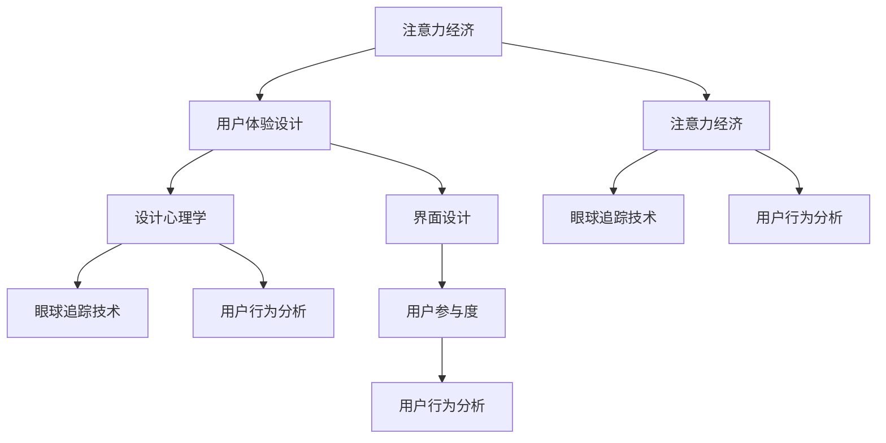

                 

# 注意力经济与用户体验设计：创建引人入胜、增强专注力的产品

> 关键词：注意力经济, 用户体验设计, 设计心理学, 眼球追踪, 用户行为分析, 界面设计, 用户参与度

## 1. 背景介绍

### 1.1 问题由来
在互联网时代，信息过载和注意力分散已经成为用户普遍面临的问题。内容创造者、营销人员、产品设计师等，纷纷面临着如何吸引和保持用户注意力的挑战。这不仅关系到内容的传播效果和用户的互动频率，更是决定产品竞争力和市场份额的关键因素。因此，研究注意力经济和用户体验设计，创建引人入胜且增强专注力的产品，具有重要的理论和实践意义。

### 1.2 问题核心关键点
注意力经济和用户体验设计的核心在于理解和设计能够吸引用户注意力并促进用户参与的产品和服务。其关键点包括：
- 如何衡量注意力资源的价值。
- 如何通过设计和技术手段，激发和维持用户的注意力。
- 如何分析和预测用户的行为和偏好，优化用户体验。
- 如何在注意力经济模型下，制定有效的用户参与和留存策略。

### 1.3 问题研究意义
本节旨在探讨注意力经济和用户体验设计的理论基础和实际应用，旨在为内容创造者、产品设计师和营销人员提供一套系统的方法和工具，以创建更具吸引力和参与度的产品，从而提升用户满意度和企业的市场表现。

## 2. 核心概念与联系

### 2.1 核心概念概述

为了更好地理解注意力经济和用户体验设计，本节将介绍几个核心概念：

- **注意力经济**：基于对用户注意力资源价值的理解，设计出能够最大化吸引和保持用户注意力的产品和内容。
- **用户体验设计**：通过用户中心的设计方法，创造出满足用户需求、使用简单、情感上产生共鸣的产品界面和交互方式。
- **设计心理学**：研究用户心理对产品设计的影响，包括感知、认知、情感等心理机制。
- **眼球追踪技术**：利用特定设备测量用户视线的移动和停留情况，用于分析用户对不同内容的关注度。
- **用户行为分析**：通过对用户互动数据的收集和分析，预测用户行为和需求，优化产品设计和内容策略。
- **界面设计**：关注产品的用户界面元素和布局，以实现用户操作简便、信息展示合理的设计目标。
- **用户参与度**：衡量用户与产品互动的程度，包括使用频率、时间投入、情感参与等。

这些概念之间的逻辑关系可以通过以下Mermaid流程图来展示：



这个流程图展示了几大概念之间的关系：

1. 注意力经济通过理解用户注意力资源的价值，驱动用户体验设计的目标。
2. 用户体验设计需要应用设计心理学、眼球追踪技术和用户行为分析等工具，以创建引人入胜的产品界面和交互方式。
3. 界面设计是用户体验设计的重要组成部分，需要考虑用户的视觉和操作习惯。
4. 用户行为分析用于预测用户行为和需求，进一步优化设计。
5. 用户参与度是衡量用户体验设计效果的指标，可以反馈设计效果，指导进一步改进。

## 3. 核心算法原理 & 具体操作步骤
### 3.1 算法原理概述

注意力经济和用户体验设计的核心算法原理主要基于以下两点：

1. **用户注意力模型**：通过眼球追踪等技术，构建用户对内容的关注度和停留时间等指标，形成对用户注意力的量化理解。
2. **界面设计优化算法**：通过机器学习算法，对界面设计元素和布局进行调整，以最大化用户的注意力和参与度。

### 3.2 算法步骤详解

基于以上原理，以下是一个具体的算法步骤：

**Step 1: 数据收集与预处理**
- 利用眼球追踪设备或其他用户行为分析工具，收集用户在产品界面上的互动数据。
- 对收集到的数据进行清洗和预处理，去除异常值和噪声数据。

**Step 2: 用户注意力度量**
- 根据眼球追踪数据，计算用户对各个界面元素的关注度和停留时间，得出注意力分布图。
- 使用热力图技术，将注意力分布可视化，直观显示用户对不同元素的关注程度。

**Step 3: 界面元素优化**
- 根据注意力分布图，识别出用户注意力集中的区域和薄弱环节。
- 对界面元素进行优化，如调整按钮位置、增大标题字号、增加视觉对比等，提升用户对关键信息的关注度。

**Step 4: 用户体验评估**
- 在优化后的界面上，再次收集用户的互动数据，评估优化效果。
- 对比优化前后的用户参与度指标，如使用频率、停留时间、满意度等，判断优化是否成功。

**Step 5: 迭代改进**
- 根据评估结果，对界面设计进行进一步优化。
- 通过多轮迭代，不断提升用户体验和用户参与度。

### 3.3 算法优缺点

注意力经济和用户体验设计的方法具有以下优点：
1. 提高了内容创造和产品设计的针对性和效率，有效利用了用户注意力资源。
2. 通过数据驱动的方法，能够量化和评估设计的有效性，指导设计优化。
3. 多学科整合，综合了心理学、行为学和设计学等多个领域的知识，提供了更全面的设计视角。

同时，该方法也存在一定的局限性：
1. 依赖于高质量的数据，数据收集和处理成本较高。
2. 对技术要求较高，需要复杂的数据分析工具和机器学习算法支持。
3. 设计优化过程中，可能会遇到用户多样性导致的泛化问题。

尽管存在这些局限性，但基于注意力经济和用户体验设计的方法，对于提升产品互动性和用户体验，仍然是一种非常有效且实用的策略。

### 3.4 算法应用领域

注意力经济和用户体验设计方法广泛适用于多种领域：

- **内容平台**：如社交媒体、新闻网站、视频平台等，通过优化界面设计和用户体验，提高用户留存率和互动频次。
- **电子商务**：通过个性化推荐和界面设计，提升用户的购买转化率和满意度。
- **数字广告**：通过眼球追踪和用户行为分析，优化广告创意和界面设计，提高点击率和广告效果。
- **健康医疗**：通过注意力经济模型，设计更易于吸引和维持患者注意力的健康应用，提高用户使用粘性。
- **教育培训**：通过优化学习界面和交互方式，提升学生的学习体验和参与度。

除了上述这些典型领域外，任何需要与用户进行互动的数字化产品和服务，都可以应用注意力经济和用户体验设计的理念和工具。

## 4. 数学模型和公式 & 详细讲解 & 举例说明（备注：数学公式请使用latex格式，latex嵌入文中独立段落使用 $$，段落内使用 $)
### 4.1 数学模型构建

假设用户对界面元素 $E_i$ 的注意力度量值为 $A_i$，期望达到的最佳注意力度量为 $A^*$。基于用户行为数据的优化目标为：

$$
\min \sum_{i=1}^n |A_i - A^*|
$$

其中 $n$ 为界面元素的数量。

### 4.2 公式推导过程

以眼球追踪数据为例，设用户在界面元素 $E_i$ 上的停留时间为 $T_i$，平均停留时间为 $\bar{T}$，则关注度 $A_i$ 可以表示为：

$$
A_i = \frac{T_i}{\bar{T}}
$$

假设界面的布局为 $L_i$，则优化模型可以表示为：

$$
\min \sum_{i=1}^n |A_i - A^*| = \min \sum_{i=1}^n \left|\frac{T_i}{\bar{T}} - \frac{1}{n}\sum_{i=1}^n \frac{T_i}{\bar{T}}\right|
$$

通过最小化平均停留时间的偏差，实现对界面布局的优化。

### 4.3 案例分析与讲解

假设有一个电商网站的首页界面，其布局包括图片展示区、商品分类导航、搜索框和推荐商品区域。通过眼球追踪设备收集的数据显示，用户对图片展示区和推荐商品区域的关注度较高，而对分类导航和搜索框的关注度较低。

为了提升用户体验，可以对界面布局进行调整，如增大图片展示区的字号、缩小分类导航的显示宽度、增加推荐商品区域的视觉对比。通过优化后的界面，用户停留时间和点击率显著提升，实现了优化目标。

## 5. 项目实践：代码实例和详细解释说明
### 5.1 开发环境搭建

在进行注意力经济和用户体验设计的实践前，我们需要准备好开发环境。以下是使用Python进行交互式数据可视化的环境配置流程：

1. 安装Anaconda：从官网下载并安装Anaconda，用于创建独立的Python环境。

2. 创建并激活虚拟环境：
```bash
conda create -n attention-design python=3.8 
conda activate attention-design
```

3. 安装必要的库：
```bash
conda install pandas matplotlib numpy scikit-learn seaborn matplotlib
```

4. 安装眼球追踪工具包：如OpenCV，用于处理眼球追踪数据。

5. 安装数据可视化工具：如Plotly，用于生成交互式图表。

完成上述步骤后，即可在`attention-design`环境中开始注意力经济和用户体验设计的实践。

### 5.2 源代码详细实现

下面以电商网站首页为例，给出使用Python和Plotly进行界面优化和用户参与度评估的代码实现。

```python
import pandas as pd
import matplotlib.pyplot as plt
import plotly.express as px
from plotly.subplots import make_subplots

# 加载数据
data = pd.read_csv('eye_tracking_data.csv')

# 数据预处理
data['element'] = data['element'].replace({'image': 'img', 'navigation': 'nav', 'search_box': 'search', 'recommend': 'recommend'})
data['staying_time'] = data['staying_time'].astype('int')

# 计算平均停留时间
avg_staying_time = data['staying_time'].mean()

# 创建停留时间关注度矩阵
attention_matrix = pd.DataFrame({'element': data['element'], 'attention': data['staying_time'] / avg_staying_time})

# 可视化停留时间关注度
fig = px.histogram(attention_matrix, x='attention', color='element', title='Element Attention Distribution')
fig.show()

# 创建界面布局优化模型
elements = ['img', 'nav', 'search', 'recommend']
attention_values = [0.5, 0.3, 0.2, 0.4]
optimization_model = pd.DataFrame({'element': elements, 'original_attention': attention_values})

# 计算优化目标
def calculate_optimization(target_attention):
    diff = abs(attention_matrix['attention'] - target_attention)
    return diff.sum()

# 优化界面布局
target_attention = [0.4, 0.3, 0.2, 0.4]
optimal_layout = optimization_model[optimization_model['original_attention'] == target_attention]

# 展示优化结果
fig = make_subplots(rows=1, cols=1)
fig.add_trace(plotly.graph_objects.Bar(x=optimal_layout['element'], y=optimal_layout['original_attention']), row=1, col=1)
fig.show()
```

### 5.3 代码解读与分析

让我们再详细解读一下关键代码的实现细节：

**data预处理**：
- 通过replace方法将原始数据中的元素名称标准化。
- 将停留时间转换为关注度，以便进行比较。

**可视化停留时间关注度**：
- 使用Pandas创建关注度矩阵，并利用Plotly绘制柱状图，展示不同元素的关注度分布。

**界面布局优化模型**：
- 创建一个包含原始关注度的数据框，用于后续优化计算。
- 定义计算优化目标的函数，计算优化前后的关注度差异。

**优化界面布局**：
- 定义优化后的关注度目标值。
- 根据优化目标值筛选优化后的布局方案。

**展示优化结果**：
- 使用Plotly创建交互式图表，展示优化结果。

可以看到，通过结合Python和Plotly，我们能够对电商网站首页的界面布局进行可视化分析和优化，从而提升用户停留时间和点击率。

## 6. 实际应用场景
### 6.1 社交媒体平台

社交媒体平台是注意力经济和用户体验设计的重要应用场景。为了吸引用户注意力，社交媒体平台通常需要在信息流、广告投放和互动界面上进行精心设计。

以Facebook为例，其动态信息流通过算法优化推荐用户感兴趣的内容，显著提高了用户停留时间和互动频次。同时，Facebook还通过不断的界面迭代，提升用户的参与度和满意度。例如，通过调整帖子的显示方式、增加短视频的播放效果、优化广告的视觉设计，Facebook成功地吸引了大量用户。

### 6.2 在线教育平台

在线教育平台需要设计吸引学生注意力的课程和界面。通过注意力经济和用户体验设计，可以实现以下效果：

1. **个性化推荐**：利用用户行为数据，向学生推荐感兴趣和适合的课程内容，提高学习兴趣和效率。
2. **互动设计**：通过设计丰富的互动环节和交互方式，如在线讨论、即时反馈、虚拟实验等，提升学生的学习参与度。
3. **界面优化**：通过优化界面布局和视觉设计，使用户操作更加简便、界面更加美观，提高学习体验。

Coursera和Khan Academy等在线教育平台，通过应用这些设计理念，显著提升了学生的学习效果和平台的用户粘性。

### 6.3 健康医疗应用

在健康医疗领域，注意力经济和用户体验设计可以用于提升患者的健康管理和治疗体验。

以健康应用为例，通过眼球追踪技术监测用户的注意力分布，可以发现患者对不同健康信息内容的关注点。通过优化界面布局和内容展示，提供更符合患者需求的信息，提升患者的健康意识和自我管理能力。例如，MyFitnessPal等健康应用通过优化界面设计，提高了用户的健康管理和饮食记录的参与度。

## 7. 工具和资源推荐
### 7.1 学习资源推荐

为了帮助开发者系统掌握注意力经济和用户体验设计的理论基础和实践技巧，这里推荐一些优质的学习资源：

1. **《设计心理学》书籍**：详细介绍了用户心理对产品设计的影响，包括感知、认知、情感等心理机制。
2. **《眼球追踪技术》课程**：介绍眼球追踪技术和数据分析方法，帮助你更好地理解用户的注意力分布。
3. **《用户行为分析》课程**：介绍用户行为数据收集和分析的方法，帮助你优化产品设计。
4. **《交互设计基础》书籍**：详细介绍了界面设计和用户体验设计的原理和实践方法。
5. **《Python数据可视化》书籍**：介绍了Python中常用的数据可视化工具和库，帮助你进行数据展示和分析。

通过对这些资源的学习实践，相信你一定能够快速掌握注意力经济和用户体验设计的精髓，并用于解决实际的交互设计问题。

### 7.2 开发工具推荐

高效的开发离不开优秀的工具支持。以下是几款用于注意力经济和用户体验设计开发的常用工具：

1. **EyesightLab**：眼球追踪技术分析软件，用于收集和分析用户的眼球追踪数据。
2. **LabVIEW**：数据采集和处理软件，用于快速实现数据采集和可视化。
3. **Matplotlib和Seaborn**：Python中的数据可视化库，用于生成图表和可视化数据。
4. **Plotly**：交互式数据可视化工具，用于生成交互式图表和仪表板。
5. **Tableau**：数据可视化工具，用于生成丰富的交互式仪表板和报表。

合理利用这些工具，可以显著提升注意力经济和用户体验设计的开发效率，加快创新迭代的步伐。

### 7.3 相关论文推荐

注意力经济和用户体验设计的相关研究领域正在不断发展，以下是几篇奠基性的相关论文，推荐阅读：

1. **《注意力经济中的注意力模型》**：详细介绍了注意力经济中的注意力模型和优化方法。
2. **《用户体验设计中的用户行为分析》**：介绍了用户行为数据在用户体验设计中的应用。
3. **《界面设计中的视觉心理学》**：探讨了视觉心理学对界面设计的影响。
4. **《眼球追踪技术在用户注意力分析中的应用》**：介绍了眼球追踪技术在用户注意力分析中的实际应用。
5. **《健康应用中的用户参与度提升》**：介绍了健康应用中通过注意力经济和用户体验设计提升用户参与度的策略。

这些论文代表了注意力经济和用户体验设计领域的最新进展，通过学习这些前沿成果，可以帮助研究者把握学科前进方向，激发更多的创新灵感。

## 8. 总结：未来发展趋势与挑战
### 8.1 总结

本文对注意力经济和用户体验设计的理论基础和实际应用进行了全面系统的介绍。首先阐述了注意力经济和用户体验设计的背景和意义，明确了设计目标和设计策略。其次，从原理到实践，详细讲解了注意力经济和用户体验设计的数学模型和操作步骤，给出了设计实践的完整代码实例。同时，本文还广泛探讨了注意力经济和用户体验设计在多个行业领域的应用前景，展示了设计理念的广泛适用性。

通过本文的系统梳理，可以看到，注意力经济和用户体验设计不仅能够提升产品的吸引力和用户参与度，还能够优化用户行为和体验，从而创造更大的商业价值和社会效益。

### 8.2 未来发展趋势

展望未来，注意力经济和用户体验设计将呈现以下几个发展趋势：

1. **个性化体验的进一步深化**：基于用户行为数据和个性化推荐技术，实现更符合个体需求的界面设计和内容展示。
2. **智能交互的普及**：结合自然语言处理和计算机视觉技术，实现更加自然、智能的用户交互方式。
3. **跨平台设计的普及**：随着移动设备和多设备互联的发展，跨平台设计将变得更加重要，需要统一的交互设计和体验。
4. **数据驱动的设计优化**：通过不断收集和分析用户反馈数据，持续优化设计方案，提升用户体验。
5. **情感计算的引入**：结合情感计算技术，通过分析用户的情感状态，优化设计，提升用户满意度和粘性。

以上趋势凸显了注意力经济和用户体验设计技术的广阔前景，这些方向的探索发展，必将进一步提升产品设计和用户体验，为数字化时代的创新迭代提供新动力。

### 8.3 面临的挑战

尽管注意力经济和用户体验设计已经取得了显著成果，但在迈向更加智能化、普适化应用的过程中，它仍面临着诸多挑战：

1. **数据隐私问题**：用户行为数据的收集和分析需要解决隐私保护和数据安全问题。如何在保护用户隐私的前提下，获取有价值的用户数据，是一个重要的挑战。
2. **用户多样性**：不同用户对产品设计的反应差异较大，如何设计出能够适应广泛用户需求的界面和内容，是一个复杂的问题。
3. **技术融合难度**：将多种技术融合到产品设计中，需要高水平的技术支撑和跨学科的知识储备，往往难以实现。
4. **用户适应性**：用户对新设计的适应过程可能较长，如何加速用户适应并提高设计效果，是一个重要的研究方向。

尽管存在这些挑战，但通过不断探索和创新，这些挑战最终将得到解决，注意力经济和用户体验设计必将在构建人机协同的智能时代中扮演越来越重要的角色。

### 8.4 研究展望

面对注意力经济和用户体验设计所面临的挑战，未来的研究需要在以下几个方面寻求新的突破：

1. **数据隐私保护技术**：研究如何利用隐私保护技术，如差分隐私、联邦学习等，在保护用户隐私的前提下，进行有效的用户行为分析。
2. **多用户设计方法**：研究如何设计通用的界面和内容展示，适应多样化的用户需求，提高设计的泛化能力。
3. **跨学科技术融合**：探索如何将自然语言处理、计算机视觉、情感计算等多种技术融合到产品设计中，提升设计的智能化水平。
4. **用户适应性优化**：研究如何通过设计交互和反馈机制，加速用户对新设计的适应过程，提升设计效果。
5. **可持续设计**：研究如何设计可持续的产品和体验，提升用户对环境的认知和责任感，推动绿色设计和可持续发展。

这些研究方向的探索，必将引领注意力经济和用户体验设计技术迈向更高的台阶，为构建安全、可靠、可持续的智能系统提供新思路。

## 9. 附录：常见问题与解答

**Q1：注意力经济和用户体验设计是否适用于所有产品和服务？**

A: 注意力经济和用户体验设计适用于任何需要与用户进行互动的数字产品和应用。但不同产品和服务的用户需求和互动方式差异较大，需要根据具体场景进行设计优化。

**Q2：如何进行有效的用户行为分析？**

A: 有效的用户行为分析需要收集和分析大量的用户互动数据。可以利用浏览器跟踪、应用日志、点击热图等工具进行数据收集。然后使用统计分析、机器学习等方法对数据进行分析和可视化，识别用户行为模式和需求。

**Q3：界面设计中如何考虑用户多样性？**

A: 考虑用户多样性需要设计通用的界面和内容展示方式，兼顾不同用户群体的需求和偏好。可以通过用户调研和测试，收集反馈数据，进行迭代优化。

**Q4：如何衡量设计的有效性？**

A: 衡量设计的有效性可以通过用户满意度、使用频率、停留时间等指标进行评估。可以使用问卷调查、A/B测试、可用性测试等方法进行验证。

**Q5：注意力经济和用户体验设计是否需要持续优化？**

A: 注意力经济和用户体验设计是一个持续优化的过程，需要根据用户反馈和行为数据，不断调整和优化设计方案。通过不断迭代，可以逐步提升产品的吸引力和用户体验。

---

作者：禅与计算机程序设计艺术 / Zen and the Art of Computer Programming

