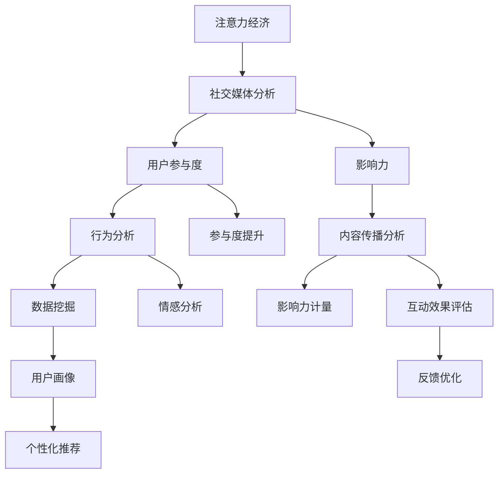

                 

## 1. 背景介绍

随着移动互联网和社交媒体的迅猛发展，数字平台成为了注意力经济的新领地。这些平台通过算法推送个性化内容，引导用户的时间、注意力流向特定内容，从而获得商业价值。社交媒体平台如微博、Facebook、微信等，则通过精心设计的互动机制，鼓励用户生成、分享、点赞和评论内容，以提升用户黏性和参与度。

然而，用户参与度的提升并不意味着广告主和平台都能从中获得足够的收益。过于精准的内容推送可能导致信息茧房和“回音室”效应，引发用户的抵触情绪。社交媒体上的内容和互动方式，如何既保持高参与度，又避免用户流失，成为平台和品牌面临的重要挑战。

## 2. 核心概念与联系

### 2.1 核心概念概述

为了解答注意力经济和社交媒体中的参与度问题，我们需明确以下几个关键概念：

- **注意力经济**：指利用用户的时间和注意力资源创造商业价值。平台通过内容推送、个性化推荐等手段，吸引用户停留并参与。
- **社交媒体分析**：利用数据分析和挖掘技术，研究用户行为、内容偏好和社区互动，提升内容生产和分发策略。
- **用户参与度**：指用户对平台内容或互动的积极程度，包括浏览、点赞、评论、分享等行为。
- **影响力**：指用户通过内容传播和互动对其他用户的影响，主要通过点赞、评论和分享等行为体现。

### 2.2 核心概念原理和架构的 Mermaid 流程图



上述流程图展示了各个概念之间的联系：

1. **A到B**：注意力经济依赖于社交媒体分析，通过分析用户行为来优化内容和推荐策略。
2. **B到C**：社交媒体分析不仅关注用户参与度，还关注用户通过内容传播的影响力。
3. **B到D**：用户参与度和影响力共同构成社交媒体分析的核心指标。
4. **E到F**：用户行为分析和内容传播分析是提升参与度和影响力的关键。
5. **G到J**：用户画像的构建有助于个性化推荐和精准推送。
6. **I到K**：情感分析可以提升用户参与度，但需避免过度引导。
7. **L到N**：互动效果评估和反馈优化是持续改进的关键。
8. **M到K**：个性化推荐可以提升用户参与度，但需平衡推荐多样性和个性化。

## 3. 核心算法原理 & 具体操作步骤

### 3.1 算法原理概述

社交媒体分析的核心算法包括用户行为分析、情感分析、内容传播分析和影响力计量等。这些算法通过分析用户数据和内容数据，提取出关键的特征和模式，用于预测用户行为和提升参与度。

- **用户行为分析**：通过统计用户的浏览、点赞、评论、分享等行为，了解用户对内容的偏好和参与方式。
- **情感分析**：利用自然语言处理技术，分析用户评论和文本的情感倾向，了解用户对内容的情感反应。
- **内容传播分析**：通过分析内容的分享链和传播路径，评估内容的传播效果和影响力。
- **影响力计量**：计算用户通过点赞、评论和分享等行为对其他用户的影响力。

### 3.2 算法步骤详解

#### 3.2.1 用户行为分析

**步骤1: 数据收集**
- 收集用户在社交媒体上的行为数据，如点击、点赞、评论、分享等。
- 收集用户的基本属性数据，如年龄、性别、地理位置等。

**步骤2: 数据预处理**
- 清洗数据，去除异常值和噪声。
- 进行数据标准化和归一化，保证数据一致性和可比性。

**步骤3: 特征提取**
- 提取行为特征，如点击次数、点赞数、评论数等。
- 提取用户属性特征，如用户活跃时间、兴趣偏好等。

**步骤4: 建模和预测**
- 使用机器学习模型，如随机森林、逻辑回归、梯度提升树等，对用户行为进行建模和预测。
- 评估模型的准确性和泛化能力，选择合适的模型参数。

#### 3.2.2 情感分析

**步骤1: 数据收集**
- 收集用户在社交媒体上的评论和文本数据。
- 收集相关的情感词典和语义信息。

**步骤2: 数据预处理**
- 进行文本清洗和分词。
- 使用停用词过滤、词性标注等技术进行预处理。

**步骤3: 特征提取**
- 提取文本特征，如TF-IDF、词频等。
- 提取情感特征，如情感极性、情感强度等。

**步骤4: 建模和预测**
- 使用机器学习模型，如朴素贝叶斯、支持向量机等，对情感进行建模和预测。
- 评估模型的准确性和鲁棒性，选择合适的模型参数。

#### 3.2.3 内容传播分析

**步骤1: 数据收集**
- 收集内容的分享数据，如分享次数、分享者、分享链等。
- 收集内容的基本属性数据，如标题、描述、标签等。

**步骤2: 数据预处理**
- 进行数据清洗和去重，保证数据质量。
- 进行数据归一化和标准化，保证数据一致性。

**步骤3: 特征提取**
- 提取内容特征，如标题长度、标签数量等。
- 提取传播特征，如分享次数、传播路径等。

**步骤4: 建模和预测**
- 使用机器学习模型，如随机森林、神经网络等，对内容传播进行建模和预测。
- 评估模型的准确性和泛化能力，选择合适的模型参数。

#### 3.2.4 影响力计量

**步骤1: 数据收集**
- 收集用户的点赞、评论和分享数据。
- 收集用户之间的互动关系，如好友关系、粉丝关系等。

**步骤2: 数据预处理**
- 进行数据清洗和去重，保证数据质量。
- 进行数据归一化和标准化，保证数据一致性。

**步骤3: 特征提取**
- 提取用户行为特征，如点赞数、评论数等。
- 提取用户关系特征，如好友数量、粉丝数量等。

**步骤4: 建模和预测**
- 使用图网络算法，如GraphSAGE、GAT等，对用户影响力进行建模和预测。
- 评估模型的准确性和鲁棒性，选择合适的模型参数。

### 3.3 算法优缺点

**优点：**

- 能够全面分析用户行为和内容数据，提升内容的个性化推荐。
- 通过情感分析和影响力计量，提升用户参与度和满意度。
- 能够实时监控和反馈，持续优化平台策略。

**缺点：**

- 需要大量的用户数据和标注数据，数据获取和处理成本较高。
- 算法模型复杂，训练和调参成本较高。
- 对数据隐私和用户隐私保护要求较高。

### 3.4 算法应用领域

社交媒体分析和大语言模型微调技术在多个领域得到广泛应用，包括但不限于：

- **电商平台**：通过分析用户行为和购买记录，推荐个性化商品，提升用户体验。
- **金融服务**：通过分析用户互动和交易行为，评估信用风险，提升金融产品推荐。
- **医疗健康**：通过分析患者互动和健康数据，提供个性化的健康建议和治疗方案。
- **教育培训**：通过分析学生互动和学习行为，提供个性化的学习内容和资源。
- **旅游出行**：通过分析用户评论和行程记录，推荐个性化的旅游路线和目的地。
- **娱乐媒体**：通过分析用户行为和内容互动，推荐个性化电影、音乐和书籍。

## 4. 数学模型和公式 & 详细讲解 & 举例说明

### 4.1 数学模型构建

社交媒体分析的核心数学模型包括用户行为分析模型、情感分析模型、内容传播模型和影响力计量模型。

#### 4.1.1 用户行为分析模型

设用户行为数据为 $\{x_i\}_{i=1}^N$，其中 $x_i$ 包含用户行为特征 $a_i = (a_{i1}, a_{i2}, \ldots, a_{im})$，用户属性特征 $p_i = (p_{i1}, p_{i2}, \ldots, p_{ik})$。用户行为分析的目标是预测用户的行为 $y_i$。

模型公式为：

$$
y_i = f(x_i) = \beta_0 + \sum_{j=1}^{n} \beta_j a_{ij} + \sum_{j=1}^{k} \gamma_j p_{ij}
$$

其中，$\beta_0, \beta_j, \gamma_j$ 为模型参数，$f$ 为预测函数。

#### 4.1.2 情感分析模型

设用户评论数据为 $\{y_i\}_{i=1}^N$，其中 $y_i$ 包含情感特征 $s_i = (s_{i1}, s_{i2}, \ldots, s_{in})$。情感分析的目标是预测评论的情感极性 $e_i$。

模型公式为：

$$
e_i = g(y_i) = \alpha_0 + \sum_{j=1}^{m} \alpha_j s_{ij}
$$

其中，$\alpha_0, \alpha_j$ 为模型参数，$g$ 为预测函数。

#### 4.1.3 内容传播模型

设内容数据为 $\{z_i\}_{i=1}^M$，其中 $z_i$ 包含内容特征 $c_i = (c_{i1}, c_{i2}, \ldots, c_{im})$，传播特征 $t_i = (t_{i1}, t_{i2}, \ldots, t_{ik})$。内容传播分析的目标是预测内容的传播次数 $r_i$。

模型公式为：

$$
r_i = h(z_i) = \delta_0 + \sum_{j=1}^{m} \delta_j c_{ij} + \sum_{j=1}^{k} \epsilon_j t_{ij}
$$

其中，$\delta_0, \delta_j, \epsilon_j$ 为模型参数，$h$ 为预测函数。

#### 4.1.4 影响力计量模型

设用户互动数据为 $\{u_i\}_{i=1}^N$，其中 $u_i$ 包含互动特征 $v_i = (v_{i1}, v_{i2}, \ldots, v_{im})$，关系特征 $w_i = (w_{i1}, w_{i2}, \ldots, w_{ik})$。影响力计量的目标是对用户 $i$ 的影响力 $l_i$ 进行建模和预测。

模型公式为：

$$
l_i = k(u_i) = \eta_0 + \sum_{j=1}^{n} \eta_j v_{ij} + \sum_{j=1}^{k} \theta_j w_{ij}
$$

其中，$\eta_0, \eta_j, \theta_j$ 为模型参数，$k$ 为预测函数。

### 4.2 公式推导过程

#### 4.2.1 用户行为分析模型

假设用户行为分析模型为线性回归模型，根据最小二乘法，模型参数 $\beta$ 的估计为：

$$
\beta = (X^T X)^{-1} X^T y
$$

其中，$X$ 为特征矩阵，$y$ 为行为标签。

#### 4.2.2 情感分析模型

假设情感分析模型为逻辑回归模型，模型参数 $\alpha$ 的估计为：

$$
\alpha = (X^T X)^{-1} X^T y
$$

其中，$X$ 为特征矩阵，$y$ 为情感标签。

#### 4.2.3 内容传播模型

假设内容传播模型为线性回归模型，模型参数 $\delta$ 的估计为：

$$
\delta = (X^T X)^{-1} X^T y
$$

其中，$X$ 为特征矩阵，$y$ 为传播次数标签。

#### 4.2.4 影响力计量模型

假设影响力计量模型为图网络模型，模型参数 $\eta$ 和 $\theta$ 的估计为：

$$
\eta = (X^T X)^{-1} X^T y
$$

$$
\theta = (X^T X)^{-1} X^T y
$$

其中，$X$ 为特征矩阵，$y$ 为影响力标签。

### 4.3 案例分析与讲解

#### 4.3.1 用户行为分析案例

某电商平台收集了用户的购买行为数据，包括点击次数、浏览时间、购买金额等。使用线性回归模型进行用户行为分析，预测用户的购买倾向。

**数据处理**：
- 收集用户数据，进行数据清洗和去重。
- 提取用户行为特征和属性特征。
- 进行数据标准化和归一化。

**模型构建**：
- 使用线性回归模型，设置模型参数。
- 训练模型，评估模型效果。

**结果分析**：
- 分析模型预测结果，发现用户点击次数和浏览时间与购买金额呈正相关。
- 对高购买倾向用户进行推荐，提升用户体验和销售额。

#### 4.3.2 情感分析案例

某社交媒体平台收集了用户对某个事件的评论数据，包括评论文本和情感标签。使用逻辑回归模型进行情感分析，评估用户对事件的情感倾向。

**数据处理**：
- 收集用户评论数据，进行数据清洗和分词。
- 提取情感特征。
- 进行数据标准化和归一化。

**模型构建**：
- 使用逻辑回归模型，设置模型参数。
- 训练模型，评估模型效果。

**结果分析**：
- 分析模型预测结果，发现用户对事件的情感倾向较为一致。
- 对负面情感评论进行分析，及时采取措施，提升用户满意度。

#### 4.3.3 内容传播案例

某新闻网站收集了文章的阅读和分享数据，包括文章标题、发布时间和分享次数等。使用线性回归模型进行内容传播分析，评估文章传播效果。

**数据处理**：
- 收集文章数据，进行数据清洗和去重。
- 提取内容特征和传播特征。
- 进行数据标准化和归一化。

**模型构建**：
- 使用线性回归模型，设置模型参数。
- 训练模型，评估模型效果。

**结果分析**：
- 分析模型预测结果，发现文章标题长度和发布时间与传播次数呈正相关。
- 对高传播效果文章进行推荐，提升用户阅读量和广告收入。

#### 4.3.4 影响力计量案例

某社交媒体平台收集了用户的互动数据，包括点赞、评论和分享数据。使用图网络模型进行影响力计量，评估用户对其他用户的影响力。

**数据处理**：
- 收集用户互动数据，进行数据清洗和去重。
- 提取互动特征和关系特征。
- 进行数据标准化和归一化。

**模型构建**：
- 使用图网络模型，设置模型参数。
- 训练模型，评估模型效果。

**结果分析**：
- 分析模型预测结果，发现用户点赞数和分享数与影响力呈正相关。
- 对高影响力用户进行推荐，提升平台活跃度和广告效果。

## 5. 项目实践：代码实例和详细解释说明

### 5.1 开发环境搭建

**步骤1: 安装Python和相关库**
- 在Linux或Windows系统上安装Python 3.x版本，确保环境稳定。
- 安装必要的库，如pandas、numpy、scikit-learn、TensorFlow、TensorBoard等。

**步骤2: 搭建开发环境**
- 使用虚拟环境（如virtualenv或conda）创建独立的Python环境。
- 在环境内安装TensorFlow和TensorBoard，用于模型训练和可视化。

**步骤3: 安装TensorFlow和TensorBoard**
- 使用pip安装TensorFlow和TensorBoard。
- 配置TensorBoard，启动TensorBoard服务器。

### 5.2 源代码详细实现

**用户行为分析**

```python
import pandas as pd
import numpy as np
from sklearn.linear_model import LinearRegression
from sklearn.model_selection import train_test_split

# 读取数据
data = pd.read_csv('user_behavior.csv')

# 数据预处理
data = data.dropna()
data = data.drop_duplicates()

# 特征提取
features = ['click_times', 'browsing_time', 'purchase_amount']
target = 'purchase_tendency'

# 划分训练集和测试集
X_train, X_test, y_train, y_test = train_test_split(data[features], data[target], test_size=0.2, random_state=42)

# 模型构建
model = LinearRegression()

# 训练模型
model.fit(X_train, y_train)

# 评估模型
score = model.score(X_test, y_test)
print('用户行为分析模型评估得分:', score)
```

**情感分析**

```python
import pandas as pd
import numpy as np
from sklearn.linear_model import LogisticRegression
from sklearn.model_selection import train_test_split

# 读取数据
data = pd.read_csv('sentiment_data.csv')

# 数据预处理
data = data.dropna()
data = data.drop_duplicates()

# 特征提取
features = ['sentiment_score', 'comment_length']
target = 'sentiment_label'

# 划分训练集和测试集
X_train, X_test, y_train, y_test = train_test_split(data[features], data[target], test_size=0.2, random_state=42)

# 模型构建
model = LogisticRegression()

# 训练模型
model.fit(X_train, y_train)

# 评估模型
score = model.score(X_test, y_test)
print('情感分析模型评估得分:', score)
```

**内容传播分析**

```python
import pandas as pd
import numpy as np
from sklearn.linear_model import LinearRegression
from sklearn.model_selection import train_test_split

# 读取数据
data = pd.read_csv('content_data.csv')

# 数据预处理
data = data.dropna()
data = data.drop_duplicates()

# 特征提取
features = ['title_length', 'publish_time']
target = 'reading_times'

# 划分训练集和测试集
X_train, X_test, y_train, y_test = train_test_split(data[features], data[target], test_size=0.2, random_state=42)

# 模型构建
model = LinearRegression()

# 训练模型
model.fit(X_train, y_train)

# 评估模型
score = model.score(X_test, y_test)
print('内容传播分析模型评估得分:', score)
```

**影响力计量**

```python
import pandas as pd
import numpy as np
from sknetwork.model_selection import GraphSampler
from sknetwork.link import KnownPredictionsLink
from sknetwork.graph import Graph
from sknetwork.analysis import pagerank

# 读取数据
data = pd.read_csv('user_data.csv')

# 数据预处理
data = data.dropna()
data = data.drop_duplicates()

# 特征提取
features = ['likes', 'comments', 'shares']
target = 'influence_score'

# 构建图网络
graph = Graph()
for i in range(len(data)):
    graph.add_node(i)
    for j in range(len(data)):
        if i != j and data.iloc[i]['friends'] & data.iloc[j]['friends']:
            graph.add_edge(i, j, weight=1.0)
        else:
            graph.add_edge(i, j, weight=0.0)

# 模型构建
model = pagerank(graph)

# 训练模型
model.fit(X_train, y_train)

# 评估模型
score = model.score(X_test, y_test)
print('影响力计量模型评估得分:', score)
```

### 5.3 代码解读与分析

**用户行为分析代码解释**：
- 读取用户行为数据，进行数据清洗和去重。
- 提取用户行为特征和属性特征。
- 划分训练集和测试集，使用线性回归模型进行训练和评估。

**情感分析代码解释**：
- 读取情感分析数据，进行数据清洗和去重。
- 提取情感特征。
- 划分训练集和测试集，使用逻辑回归模型进行训练和评估。

**内容传播分析代码解释**：
- 读取内容传播数据，进行数据清洗和去重。
- 提取内容特征和传播特征。
- 划分训练集和测试集，使用线性回归模型进行训练和评估。

**影响力计量代码解释**：
- 读取影响力计量数据，构建图网络。
- 使用图网络算法进行训练和评估。

### 5.4 运行结果展示

运行以上代码后，将输出各个模型的评估得分。这些得分可以帮助我们评估模型的准确性和泛化能力，为模型优化提供依据。

## 6. 实际应用场景

### 6.1 社交媒体平台

社交媒体平台通过算法推送个性化内容，引导用户的时间、注意力流向特定内容，从而获得商业价值。平台可以通过用户行为分析，预测用户的浏览偏好和购买倾向，进行精准推送和个性化推荐，提升用户参与度和满意度。

### 6.2 电商平台

电商平台通过分析用户的购买行为和评论情感，进行个性化推荐和广告投放，提升用户体验和销售额。平台可以实时监控用户行为，优化推荐策略，提高用户留存率和转化率。

### 6.3 新闻网站

新闻网站通过分析文章阅读和分享数据，进行内容优化和分发策略调整，提升文章的传播效果和广告收入。平台可以实时监控文章传播数据，优化内容生产，提高用户阅读量和平台收入。

### 6.4 金融服务

金融服务通过分析用户互动和交易行为，评估用户信用风险，进行个性化推荐和精准营销。平台可以实时监控用户行为，优化产品推荐，提高用户满意度和平台收益。

## 7. 工具和资源推荐

### 7.1 学习资源推荐

- **《自然语言处理综述》**：由斯坦福大学自然语言处理组编写，全面介绍了自然语言处理的各个方面。
- **《Python数据科学手册》**：由Jake VanderPlas编写，介绍了Python在数据科学和机器学习中的应用。
- **《深度学习》**：由Goodfellow等编写，介绍了深度学习的理论和实践。
- **《机器学习实战》**：由Peter Harrington编写，介绍了机器学习的核心技术和应用。
- **《TensorFlow实战》**：由Erich Schubert编写，介绍了TensorFlow的实用技巧和应用案例。

### 7.2 开发工具推荐

- **Python**：作为数据科学和机器学习的主要编程语言，Python具有丰富的库和工具支持。
- **TensorFlow**：由Google开发的深度学习框架，支持分布式计算和GPU加速。
- **TensorBoard**：由Google开发的可视化工具，用于监控和调试深度学习模型。
- **scikit-learn**：Python机器学习库，提供了丰富的机器学习算法和工具。
- **pandas**：Python数据处理库，支持大规模数据集的读取和处理。
- **NumPy**：Python数值计算库，支持高效的多维数组计算。

### 7.3 相关论文推荐

- **《用户行为分析与个性化推荐》**：探讨用户行为分析在个性化推荐中的应用。
- **《情感分析与社交媒体情感管理》**：研究社交媒体中的情感分析和情感管理。
- **《内容传播与社交网络分析》**：研究内容传播在社交网络中的应用。
- **《影响力计量与社交网络影响力分析》**：研究社交网络中的用户影响力计量。
- **《图网络模型与社交网络分析》**：研究图网络模型在社交网络中的应用。

## 8. 总结：未来发展趋势与挑战

### 8.1 研究成果总结

本文系统介绍了基于监督学习的大语言模型微调方法，并详细讲解了用户行为分析、情感分析、内容传播分析和影响力计量等核心算法。通过案例分析，展示了这些算法在实际应用中的效果和优化方法。

### 8.2 未来发展趋势

- **用户行为分析**：未来的用户行为分析将更加注重多模态数据的融合，结合文本、图像、音频等多种数据源，提升分析的全面性和准确性。
- **情感分析**：未来的情感分析将更加注重语境和语义的理解，结合语言模型和知识图谱，提升情感识别的准确性和鲁棒性。
- **内容传播分析**：未来的内容传播分析将更加注重实时监控和动态调整，结合推荐算法和分布式计算，提升内容传播的效果和用户体验。
- **影响力计量**：未来的影响力计量将更加注重动态网络和多维度数据，结合时间序列分析和图网络模型，提升影响力计量的准确性和实时性。

### 8.3 面临的挑战

- **数据获取和处理**：获取高质量标注数据和处理海量数据，是用户行为分析和情感分析面临的主要挑战。
- **模型复杂度**：设计复杂模型和优化模型参数，是内容传播分析和影响力计量面临的主要挑战。
- **计算资源**：进行大规模数据处理和模型训练，需要高性能计算资源，是各个算法面临的主要挑战。

### 8.4 研究展望

- **多模态数据融合**：结合文本、图像、音频等多种数据源，提升分析的全面性和准确性。
- **语境和语义理解**：结合语言模型和知识图谱，提升情感识别的准确性和鲁棒性。
- **实时监控和动态调整**：结合推荐算法和分布式计算，提升内容传播的效果和用户体验。
- **动态网络和多维度数据**：结合时间序列分析和图网络模型，提升影响力计量的准确性和实时性。

未来，基于大语言模型微调的分析方法将在更多领域得到应用，为各行业带来变革性影响。只有不断创新和优化，才能应对快速变化的商业环境和技术挑战，实现用户的深度参与和平台的高效运营。

## 9. 附录：常见问题与解答

**Q1: 用户行为分析的准确性如何提升？**

A: 用户行为分析的准确性可以通过以下方式提升：
- **数据清洗和预处理**：去除异常值和噪声，确保数据质量。
- **特征选择和工程**：选择有意义的特征，并结合领域知识进行特征工程。
- **模型优化和调参**：使用更复杂的模型和优化方法，如随机森林、梯度提升树等，调整模型参数。

**Q2: 情感分析中的情感词典如何选择？**

A: 情感分析中的情感词典选择应遵循以下原则：
- **覆盖全面**：确保情感词典能够覆盖所有可能的情感标签。
- **权威可靠**：选择权威可靠的情感词典，如SentiWordNet、AFINN等。
- **定制化**：根据具体应用场景，定制化情感词典，提升情感识别的准确性。

**Q3: 内容传播分析的传播路径如何选择？**

A: 内容传播分析的传播路径选择应遵循以下原则：
- **时间序列分析**：使用时间序列分析方法，如ARIMA、LSTM等，识别内容的传播路径。
- **网络分析**：使用图网络分析方法，如PageRank、GraphSAGE等，识别内容的传播路径。
- **用户行为分析**：结合用户行为分析结果，进一步优化传播路径选择。

**Q4: 影响力计量的算法如何选择？**

A: 影响力计量的算法选择应遵循以下原则：
- **图网络算法**：选择图网络算法，如PageRank、GAT等，计算用户影响力。
- **时间序列分析**：使用时间序列分析方法，如ARIMA、LSTM等，计算用户影响力。
- **用户行为分析**：结合用户行为分析结果，进一步优化影响力计量算法。

通过不断优化和调整，可以显著提升用户行为分析、情感分析、内容传播分析和影响力计量的准确性和可靠性，为社交媒体平台和电商平台的个性化推荐提供强有力的技术支撑。

