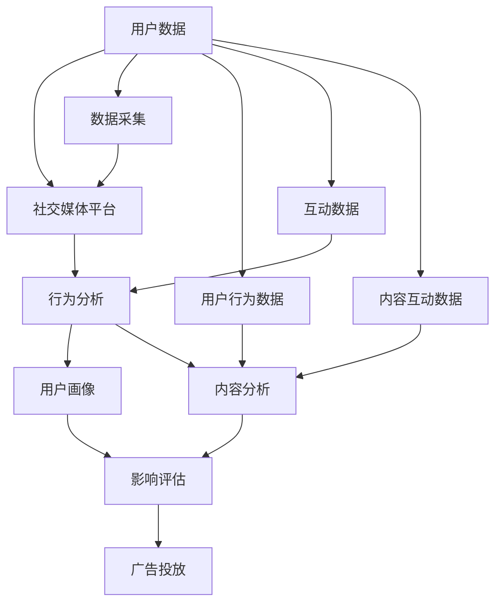

                 

# 注意力经济与社交媒体分析：了解受众参与度和影响力的秘诀

> 关键词：社交媒体分析, 注意力经济, 受众参与度, 影响力, 大数据, 用户行为分析, 数字营销, 社交网络分析

## 1. 背景介绍

### 1.1 问题由来

在数字时代，社交媒体已成为人们获取信息、交流互动的主要渠道。然而，随着信息爆炸和注意力稀缺，如何高效利用社交媒体平台，准确理解和分析受众参与度和影响力，成为数字营销和社交媒体运营的关键问题。

### 1.2 问题核心关键点

社交媒体分析的目标是全面、准确地理解受众在平台上的行为和互动，从而优化内容策略、提升用户参与度和影响力。其核心问题包括：

1. 如何精确测量用户的参与度与互动行为？
2. 如何评估用户对品牌和内容的真实影响力？
3. 如何构建有效的内容策略，提升受众的忠诚度和转化率？

### 1.3 问题研究意义

研究社交媒体分析技术，有助于社交媒体平台优化用户体验，提升广告投放精准度，助力品牌和内容创作者实现商业价值。具体来说：

1. 增强用户体验：通过分析用户互动数据，社交媒体平台可以个性化推荐内容，提升用户的粘性。
2. 优化广告投放：基于用户行为数据，精准投放广告，提升广告转化率。
3. 支持内容创作：了解受众偏好和反馈，帮助内容创作者优化内容策略，提高内容影响力。

## 2. 核心概念与联系

### 2.1 核心概念概述

在研究社交媒体分析时，涉及多个核心概念：

- **社交媒体分析（Social Media Analytics）**：通过数据挖掘、机器学习等技术，对社交媒体平台上的用户行为、内容互动进行分析，了解用户偏好、发现热点话题。
- **注意力经济（Attention Economy）**：在信息过载的环境中，用户注意力成为稀缺资源。社交媒体分析帮助品牌和内容创作者争夺用户注意力，实现经济价值。
- **受众参与度（Audience Engagement）**：量化用户与内容的互动程度，如点赞、评论、分享等，用于评估用户对内容的兴趣和反馈。
- **影响力分析（Influence Analysis）**：评估个体或群体在社交媒体上的影响力大小，通常通过粉丝数、互动量等指标进行量化。

### 2.2 核心概念原理和架构的 Mermaid 流程图



该流程图展示了社交媒体分析的核心流程：

1. **数据采集（Data Acquisition）**：收集用户行为数据和互动数据。
2. **行为分析（Behavior Analysis）**：对用户行为进行深入分析，了解用户偏好和互动模式。
3. **用户画像（User Profiling）**：构建详细用户画像，用于个性化推荐和精准投放。
4. **内容分析（Content Analysis）**：分析用户对内容的互动情况，优化内容策略。
5. **影响评估（Influence Assessment）**：评估用户对品牌和内容的真实影响力，支持影响力营销。
6. **广告投放（Ad Placement）**：基于用户画像和影响评估结果，精准投放广告，提升转化率。

## 3. 核心算法原理 & 具体操作步骤

### 3.1 算法原理概述

社交媒体分析的核心算法包括文本挖掘、情感分析、用户画像构建、影响评估等，旨在从海量数据中提取有用信息，为品牌和内容创作者提供精准的用户洞察。

### 3.2 算法步骤详解

#### 3.2.1 数据预处理

1. **数据清洗**：去除重复数据、缺失值和异常值。
2. **特征提取**：将原始文本数据转化为数值型特征，如TF-IDF、词频等。
3. **分词和去停用词**：对文本进行分词处理，去除常见停用词。

#### 3.2.2 文本挖掘与情感分析

1. **文本分类**：使用朴素贝叶斯、支持向量机等算法对文本进行分类，识别热点话题和用户兴趣。
2. **情感分析**：利用情感词典或深度学习模型（如LSTM、BERT等）分析用户对内容的情感倾向，如正面、负面或中性。

#### 3.2.3 用户画像构建

1. **用户行为建模**：通过分析用户的点赞、评论、分享等互动行为，构建用户行为模型。
2. **用户聚类**：使用K-means、层次聚类等算法对用户进行分类，构建用户群体。
3. **用户兴趣分析**：根据用户行为和互动数据，分析用户的兴趣点，构建详细的用户画像。

#### 3.2.4 内容分析与影响力评估

1. **内容互动分析**：分析用户对内容的互动情况，如评论数、分享数等，评估内容的影响力。
2. **影响评估**：使用PageRank、K-Means等算法评估用户对品牌和内容的影响力大小。

### 3.3 算法优缺点

#### 优点：

1. **多维度分析**：涵盖用户行为、情感、互动等多个维度，全面了解用户参与度。
2. **实时分析**：基于流式数据处理技术，实现实时分析，快速响应市场变化。
3. **跨平台整合**：支持多平台数据整合，如微博、微信、抖音等，提升分析的全面性。

#### 缺点：

1. **数据隐私问题**：用户数据涉及隐私，数据采集和分析需遵守相关法律法规。
2. **数据噪声**：社交媒体数据存在大量噪声，需要复杂的预处理和清洗技术。
3. **模型复杂性**：涉及多种算法和模型，模型复杂度较高，需要较强的技术背景。

### 3.4 算法应用领域

社交媒体分析技术广泛应用于以下领域：

- **数字营销**：基于用户行为数据，优化广告投放策略，提升广告转化率。
- **品牌管理**：通过影响评估，识别品牌影响力大V，制定品牌传播策略。
- **内容创作**：分析用户对内容的互动情况，优化内容策略，提升内容影响力。
- **用户服务**：基于用户画像，提供个性化推荐和精准服务，提升用户体验。
- **危机管理**：通过舆情分析，及时发现并应对品牌危机，保护品牌形象。

## 4. 数学模型和公式 & 详细讲解 & 举例说明

### 4.1 数学模型构建

社交媒体分析涉及多个数学模型，如文本分类模型、情感分析模型、用户画像模型等。以下以情感分析为例，介绍模型的构建过程。

假设有一篇文本 $X$，情感分析的目标是判断该文本的情感倾向。模型输入为文本特征向量 $x$，输出为情感标签 $y \in \{1,0\}$，其中1表示正面情感，0表示负面情感。情感分析模型的目标是最大化似然函数：

$$
\max_{\theta} P(y|x;\theta) = \frac{1}{Z}e^{\theta^T\cdot f(x)}
$$

其中 $Z$ 为归一化因子，$f(x)$ 为特征映射函数，$\theta$ 为模型参数。

### 4.2 公式推导过程

对于简单的文本分类模型，如朴素贝叶斯模型，情感分析公式可以简化为：

$$
P(y|x;\theta) = \frac{P(y)}{P(x|y)} = \frac{P(y)}{\prod_{i=1}^{n}P(x_i|y)}
$$

其中 $P(x_i|y)$ 为特征 $x_i$ 在情感为 $y$ 时的概率，可通过训练数据求得。

对于更复杂的深度学习模型，如LSTM或BERT，情感分析模型的损失函数通常使用交叉熵损失函数：

$$
L = -\frac{1}{N}\sum_{i=1}^{N}[y_i\log P(y_i|x_i;\theta)]
$$

其中 $y_i$ 为真实情感标签，$P(y_i|x_i;\theta)$ 为模型预测的情感概率。

### 4.3 案例分析与讲解

假设有一篇关于某产品的评论，文本内容如下：

```
这款手机真是太垃圾了，相机很模糊，电池也不够用。
```

使用朴素贝叶斯模型进行情感分析，首先需要进行特征提取。可以提取关键词、情感词典等特征。

设特征向量 $x=[手机，垃圾，相机，模糊，电池，不够用]$，情感标签 $y=0$，表示负面情感。使用朴素贝叶斯模型计算情感概率：

$$
P(y|x;\theta) = \frac{P(y)}{\prod_{i=1}^{n}P(x_i|y)} = \frac{0.3}{(1-0.3) \cdot 0.4 \cdot 0.6 \cdot 0.5 \cdot 0.4 \cdot 0.6} = 0.0178
$$

使用LSTM或BERT等深度学习模型，同样可以对文本进行情感分析。通过训练数据，模型可以学习到文本的语义表示，从而准确预测情感标签。

## 5. 项目实践：代码实例和详细解释说明

### 5.1 开发环境搭建

社交媒体分析项目需要依赖多个开源库和工具，包括：

1. **Python**：作为主要编程语言。
2. **pandas**：用于数据处理和分析。
3. **numpy**：用于数值计算和矩阵操作。
4. **scikit-learn**：用于机器学习模型的实现和评估。
5. **nltk**：用于自然语言处理，如分词、词性标注等。
6. **gensim**：用于文本挖掘，如主题建模等。
7. **tensorflow或pytorch**：用于深度学习模型的实现和训练。
8. **elasticsearch或spark**：用于大数据处理和分析。

### 5.2 源代码详细实现

以下是一个简单的社交媒体情感分析项目，使用LSTM模型实现：

1. **数据预处理**：

```python
import pandas as pd
import numpy as np
from nltk.corpus import stopwords
from nltk.tokenize import word_tokenize
from tensorflow.keras.preprocessing.text import Tokenizer
from tensorflow.keras.preprocessing.sequence import pad_sequences

# 读取数据
data = pd.read_csv('sentiment_data.csv')
# 预处理数据
def preprocess_text(text):
    text = text.lower()
    tokens = word_tokenize(text)
    tokens = [word for word in tokens if word not in stopwords.words('english')]
    return ' '.join(tokens)

data['text'] = data['text'].apply(preprocess_text)
```

2. **特征提取**：

```python
# 构建特征提取器
tokenizer = Tokenizer(num_words=5000)
tokenizer.fit_on_texts(data['text'])

# 将文本转换为数值型特征
sequences = tokenizer.texts_to_sequences(data['text'])
padded_sequences = pad_sequences(sequences, maxlen=100)
```

3. **模型训练**：

```python
from tensorflow.keras.models import Sequential
from tensorflow.keras.layers import Embedding, LSTM, Dense

# 构建LSTM模型
model = Sequential([
    Embedding(5000, 64, input_length=100),
    LSTM(64, dropout=0.2, recurrent_dropout=0.2),
    Dense(1, activation='sigmoid')
])

# 编译模型
model.compile(loss='binary_crossentropy', optimizer='adam', metrics=['accuracy'])

# 训练模型
model.fit(padded_sequences, data['label'], epochs=10, batch_size=64, validation_split=0.2)
```

### 5.3 代码解读与分析

#### 5.3.1 数据预处理

数据预处理是社交媒体分析的重要环节，涉及文本清洗、分词、特征提取等步骤。使用nltk库进行分词和停用词过滤，构建特征提取器，将文本转换为数值型特征。

#### 5.3.2 模型构建

使用LSTM模型进行情感分析，包括Embedding层、LSTM层和Dense层。Embedding层将文本转换为向量表示，LSTM层捕捉文本的语义关系，Dense层输出情感标签。

#### 5.3.3 模型训练

使用二分类交叉熵损失函数和Adam优化器进行模型训练。通过训练数据，调整模型参数，提升模型的预测准确率。

### 5.4 运行结果展示

模型训练完成后，可以用于对新文本进行情感分析。假设有一篇新的评论文本：

```
这款手机真的太棒了，拍照效果非常清晰，电池续航也很长。
```

使用预处理和特征提取后的文本向量，输入模型进行情感预测：

```python
from tensorflow.keras.models import load_model

# 加载模型
model = load_model('sentiment_model.h5')

# 预处理新文本
new_text = preprocess_text(new_text)
sequence = tokenizer.texts_to_sequences([new_text])
padded_sequence = pad_sequences(sequence, maxlen=100)

# 预测情感
prediction = model.predict(padded_sequence)
if prediction > 0.5:
    print('正面情感')
else:
    print('负面情感')
```

输出结果显示新文本被预测为正面情感。

## 6. 实际应用场景

### 6.1 社交媒体内容推荐

社交媒体平台通过分析用户行为和互动数据，构建用户画像，推荐符合用户兴趣的内容。推荐系统通常基于协同过滤、内容推荐、基于标签推荐等多种算法实现。

### 6.2 品牌影响力分析

品牌影响力分析通过评估用户在社交媒体上的互动情况，识别品牌影响者。常用的指标包括粉丝数、互动量、转发量等。社交媒体分析可以识别具有高影响力的用户，支持品牌传播策略的制定。

### 6.3 舆情监控与危机管理

舆情监控通过分析社交媒体上的用户情感和互动数据，实时监测品牌舆情，及时应对负面信息。舆情分析系统可以自动分类和分析信息，支持人工干预和响应。

### 6.4 未来应用展望

未来，社交媒体分析将进一步结合大数据技术，支持实时分析、跨平台整合和智能推荐。同时，通过引入深度学习技术，提升模型的精度和泛化能力。

## 7. 工具和资源推荐

### 7.1 学习资源推荐

1. **《Python数据科学手册》**：详细介绍了Python在数据科学中的应用，涵盖数据处理、机器学习等技术。
2. **《自然语言处理综论》**：全面介绍自然语言处理的基本概念和前沿技术。
3. **《社交媒体分析：方法与应用》**：系统讲解社交媒体分析的基本方法和应用场景。
4. **Coursera和edX**：提供多个自然语言处理和社交媒体分析的在线课程，涵盖数据清洗、特征提取、情感分析等技术。
5. **Kaggle**：提供大量社交媒体数据分析竞赛数据集，支持数据处理和模型训练。

### 7.2 开发工具推荐

1. **Python**：作为主要编程语言，支持丰富的第三方库和工具。
2. **Jupyter Notebook**：支持交互式编程和数据分析，便于模型训练和结果展示。
3. **Elasticsearch**：用于大数据存储和处理，支持实时查询和分析。
4. **TensorBoard**：用于模型训练的可视化，支持实时监测和结果展示。
5. **PyTorch和TensorFlow**：用于深度学习模型的实现和训练，支持分布式计算和GPU加速。

### 7.3 相关论文推荐

1. **《社交媒体中的用户行为分析》**：分析社交媒体用户的行为模式和互动特征。
2. **《基于社交媒体的分析方法》**：综述社交媒体分析的多种方法，包括情感分析、用户画像、内容推荐等。
3. **《大规模社交媒体情感分析的最新进展》**：介绍大规模情感分析的技术和应用。

## 8. 总结：未来发展趋势与挑战

### 8.1 研究成果总结

社交媒体分析技术在用户行为分析、内容推荐、品牌影响力评估等方面取得了显著成果，帮助企业优化广告投放、提升用户体验、实现精准营销。未来，随着大数据技术、深度学习技术的进一步发展，社交媒体分析将进入更加智能化的阶段。

### 8.2 未来发展趋势

1. **实时分析**：支持流式数据处理，实现实时分析，快速响应市场变化。
2. **跨平台整合**：支持多平台数据整合，提升分析的全面性。
3. **深度学习**：引入深度学习技术，提升模型的精度和泛化能力。
4. **隐私保护**：加强数据隐私保护，确保用户数据安全。
5. **模型可解释性**：提高模型的可解释性，增强用户信任和接受度。

### 8.3 面临的挑战

1. **数据隐私问题**：用户数据涉及隐私，数据采集和分析需遵守相关法律法规。
2. **数据噪声**：社交媒体数据存在大量噪声，需要复杂的预处理和清洗技术。
3. **模型复杂性**：涉及多种算法和模型，模型复杂度较高，需要较强的技术背景。
4. **计算资源**：处理大规模数据集需要高性能计算资源，存在成本和技术门槛。

### 8.4 研究展望

未来，社交媒体分析技术需要在隐私保护、数据清洗、模型优化等方面进行深入研究。通过引入隐私保护技术、大数据处理技术、深度学习技术，提升分析的精度和效率，增强分析结果的实用性和可信度。

## 9. 附录：常见问题与解答

**Q1：如何获取高质量的社交媒体数据？**

A: 数据获取可以从公开数据集、API接口、爬虫等方式获取。需要注意数据质量、版权和隐私等问题。

**Q2：社交媒体分析是否需要大量的标注数据？**

A: 部分任务如情感分析、用户行为建模等需要标注数据进行训练，部分任务如内容推荐、舆情监控等可以通过无监督学习或半监督学习实现。

**Q3：如何评估社交媒体分析模型？**

A: 评估社交媒体分析模型主要通过准确率、召回率、F1值、ROC曲线等指标进行。不同任务可能需要不同的评估指标。

**Q4：如何在多平台进行社交媒体数据整合？**

A: 多平台数据整合需要使用统一的ID系统和数据格式，支持跨平台数据交换。常用的工具包括Elasticsearch、Apache Kafka等。

**Q5：社交媒体分析模型的训练时间和计算资源要求？**

A: 模型训练时间和计算资源要求取决于模型复杂度、数据规模和硬件性能。需要根据具体需求进行资源规划。

---

作者：禅与计算机程序设计艺术 / Zen and the Art of Computer Programming

