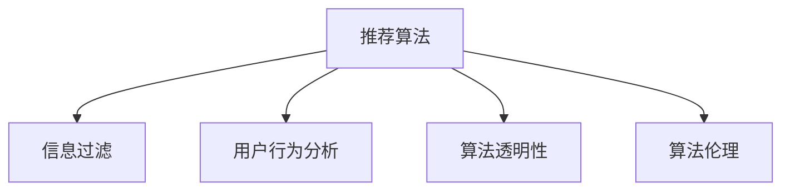

                 

# 注意力经济与社交媒体影响算法：谁在控制你看什么

> 关键词：注意力经济,社交媒体,推荐算法,信息过滤,算法伦理,用户行为,数据隐私,用户偏好

## 1. 背景介绍

### 1.1 问题由来
在信息爆炸的时代，人们每天都会接触到海量的内容，从新闻、博客、视频到社交媒体帖子。但在这海量的信息中，真正引起人们注意的却只是极小的一部分。这种注意力分配的现象，被经济学家称作"注意力经济"。而社交媒体和内容推荐系统的兴起，使得"注意力经济"的现象愈加显著。

"谁在控制你看什么"，成为了一个令人深思的问题。一方面，人们希望通过推荐系统获得更好的内容推荐，节省寻找优质信息的时间；另一方面，人们又担心推荐系统会限制其视野，甚至对其观点和行为产生影响。

这一问题引发了对推荐算法伦理、算法透明度、用户隐私保护等方面的讨论。如何设计出既能够满足用户需求，又能够保护用户隐私的推荐算法，成为了技术工作者和社会学家的重要课题。

### 1.2 问题核心关键点
为了回答"谁在控制你看什么"的问题，需要从以下几个关键点进行深入探讨：

1. **推荐算法的机制**：如何通过算法设计来影响用户的内容消费行为。
2. **用户行为分析**：如何通过用户行为数据来分析其偏好和兴趣。
3. **数据隐私保护**：如何在收集和处理用户数据时，保护用户的隐私。
4. **算法透明性**：推荐算法是否透明，用户是否能够理解其运作方式。
5. **推荐效果评估**：如何评估推荐系统的性能，尤其是在关注算法伦理方面。

通过回答这些问题，可以更深入地理解社交媒体和推荐算法在用户行为中的作用，以及如何设计和改进这些算法以更好地服务于用户。

## 2. 核心概念与联系

### 2.1 核心概念概述

为了更好地理解注意力经济和社交媒体影响算法，本节将介绍几个密切相关的核心概念：

- **推荐算法(Recommender Algorithm)**：通过分析用户行为数据，预测用户可能感兴趣的物品或内容，并将其推荐给用户。常见的推荐算法包括协同过滤、基于内容的推荐、混合推荐等。
- **信息过滤(Information Filtering)**：通过选择或过滤信息流，将用户感兴趣的内容展示给用户。信息过滤是推荐算法的核心目标之一。
- **用户行为分析(User Behavior Analysis)**：通过分析用户在平台上的行为数据，如浏览记录、点击行为、评分反馈等，来推断用户的兴趣和偏好。
- **算法透明性(Algorithm Transparency)**：推荐算法是否能够被用户理解，以及用户能否知道算法是如何做出推荐的。
- **算法伦理(Algorithm Ethics)**：推荐算法是否遵循了公平性、安全性、隐私保护等伦理准则。

这些核心概念之间的逻辑关系可以通过以下Mermaid流程图来展示：



这个流程图展示推荐算法的核心概念及其之间的关系：

1. 推荐算法通过用户行为分析来预测用户兴趣。
2. 信息过滤机制基于推荐算法的结果，选择并展示给用户。
3. 算法透明性决定了用户是否理解推荐过程。
4. 算法伦理则决定了推荐算法是否符合伦理准则。

## 3. 核心算法原理 & 具体操作步骤
### 3.1 算法原理概述

社交媒体和推荐算法背后的核心原理是"协同过滤"和"用户画像构建"。协同过滤算法通过分析用户行为数据，找出用户之间的相似性，从而推荐相似用户感兴趣的内容。而用户画像则是通过用户的历史行为和偏好数据，构建出一个全面的用户模型，用于指导推荐过程。

协同过滤算法一般分为两种类型：基于用户的协同过滤和基于物品的协同过滤。基于用户的协同过滤通过找到与目标用户最相似的用户群，来推荐其感兴趣的内容；基于物品的协同过滤则通过找到与目标物品最相似的物品群，来推荐目标用户可能感兴趣的其他物品。

用户画像的构建则通过收集用户的浏览记录、点击行为、评分反馈等数据，来分析用户的兴趣和偏好。这些数据可以用于生成用户的兴趣向量，进一步指导推荐算法。

### 3.2 算法步骤详解

社交媒体和推荐算法的实现一般包括以下几个关键步骤：

**Step 1: 数据收集与预处理**
- 收集用户的行为数据，如浏览记录、点击行为、评分反馈等。
- 清洗数据，去除噪声和不完整数据，保证数据的准确性和一致性。

**Step 2: 用户画像构建**
- 通过机器学习算法，如聚类、分类等，对用户数据进行分析，生成用户的兴趣向量。
- 可以使用协同过滤算法，找到与目标用户最相似的用户群，来构建用户画像。

**Step 3: 推荐算法实现**
- 根据用户画像和物品数据，选择合适的推荐算法进行计算。
- 对于协同过滤算法，使用相似度计算方法，如余弦相似度、皮尔逊相关系数等，来计算用户和物品的相似度。
- 对于基于内容的推荐，则需要分析物品的属性信息，如标签、关键词等，来构建推荐模型。

**Step 4: 结果展示与优化**
- 将推荐结果展示给用户，用户可以反馈其满意度，进一步优化推荐算法。
- 可以使用A/B测试等方法，来比较不同推荐算法的性能，选择最优方案。

**Step 5: 算法透明性与伦理审查**
- 提供算法透明性，让用户了解推荐过程和依据。
- 进行算法伦理审查，确保推荐算法符合公平性、安全性、隐私保护等伦理准则。

以上是社交媒体和推荐算法的一般流程。在实际应用中，还需要根据具体任务的特点，对各步骤进行优化设计，如改进相似度计算方法、优化用户画像构建等。

### 3.3 算法优缺点

社交媒体和推荐算法具有以下优点：

1. **高效性**：通过数据分析和算法优化，能够快速推荐高质量内容，节省用户时间。
2. **个性化**：根据用户的行为数据，提供个性化的推荐，满足用户独特需求。
3. **覆盖面广**：推荐算法能够覆盖海量内容，提供广泛的选择，增加用户接触新信息的概率。

同时，这些算法也存在以下缺点：

1. **过拟合风险**：推荐算法可能过度依赖于历史数据，对新内容和新用户适应性不足。
2. **隐私问题**：用户数据被用于推荐算法，可能暴露用户隐私。
3. **算法透明度不足**：用户难以理解推荐算法的工作机制，导致对算法的信任度降低。
4. **算法伦理挑战**：推荐算法可能存在偏见，加剧信息不平等。

尽管存在这些局限性，但就目前而言，社交媒体和推荐算法仍然是最主流的信息推荐方式。未来相关研究的重点在于如何进一步降低推荐算法的过拟合风险，保护用户隐私，提升算法透明性和伦理审查水平。

### 3.4 算法应用领域

社交媒体和推荐算法已经在诸多领域得到了广泛的应用，例如：

- **电商推荐**：根据用户浏览和购买记录，推荐商品或优惠信息。
- **新闻推荐**：分析用户阅读新闻的行为数据，推荐相关新闻或热门文章。
- **视频推荐**：通过用户观看历史和评分数据，推荐视频内容或频道。
- **音乐推荐**：根据用户听歌行为，推荐音乐或歌单。
- **电影推荐**：通过用户观看历史和评分，推荐电影或剧集。
- **社交网络**：根据用户互动和兴趣，推荐可能感兴趣的朋友或内容。

除了上述这些经典应用外，推荐算法还被创新性地应用到更多场景中，如广告定向、资源调度等，为信息推荐系统带来了新的突破。随着推荐算法的不断进步，相信信息推荐系统将在更广阔的应用领域大放异彩。

## 4. 数学模型和公式 & 详细讲解 & 举例说明
### 4.1 数学模型构建

为了更好地理解推荐算法的数学模型，本节将使用数学语言对推荐算法进行严格的刻画。

假设用户集合为 $U$，物品集合为 $I$，用户对物品的评分矩阵为 $R \in \mathbb{R}^{U \times I}$，其中 $R_{ui} = r_{ui}$ 表示用户 $u$ 对物品 $i$ 的评分。推荐算法的一般目标是最小化预测评分和实际评分之间的差异，即最小化损失函数：

$$
\min_{R'} \frac{1}{2} \sum_{u,i} ||R_u' - R_{ui}||^2
$$

其中 $R_u'$ 为用户 $u$ 对物品 $i$ 的预测评分。

### 4.2 公式推导过程

以协同过滤算法中的基于用户协同过滤为例，推导预测评分矩阵的计算公式。

假设目标用户 $u$ 与用户集合 $V$ 中最相似的 $k$ 个用户构成了一个用户群 $V_u$，对于用户群中的每个用户 $v \in V_u$，根据其对物品的评分 $R_{vi}$，计算目标用户 $u$ 对物品 $i$ 的预测评分 $R_u'$：

$$
R_u' = \alpha \sum_{v \in V_u} R_{vi} w_{uv}
$$

其中 $w_{uv}$ 表示用户 $u$ 和用户 $v$ 之间的相似度权重，$\alpha$ 为归一化系数。

对于基于物品的协同过滤，计算方式类似，只需要将用户群 $V_u$ 替换为物品群 $I_i$ 即可。

### 4.3 案例分析与讲解

假设有一个用户 $u$，其用户群 $V_u$ 包含三个用户 $v_1, v_2, v_3$，他们对物品 $i_1, i_2, i_3$ 的评分分别为 $R_{v_1i_1} = 4$, $R_{v_2i_2} = 3$, $R_{v_3i_3} = 5$。假设用户 $u$ 与用户 $v_1, v_2, v_3$ 之间的相似度权重分别为 $w_{uv_1} = 0.6$, $w_{uv_2} = 0.3$, $w_{uv_3} = 0.1$。

则用户 $u$ 对物品 $i_1, i_2, i_3$ 的预测评分分别为：

$$
R_u'(i_1) = 4 \times 0.6 + 3 \times 0.3 + 5 \times 0.1 = 3.5
$$

$$
R_u'(i_2) = 4 \times 0.6 + 3 \times 0.3 + 5 \times 0.1 = 3.5
$$

$$
R_u'(i_3) = 4 \times 0.6 + 3 \times 0.3 + 5 \times 0.1 = 3.5
$$

可以看到，用户 $u$ 对物品 $i_1, i_2, i_3$ 的预测评分均为 $3.5$，这表明协同过滤算法基于相似性进行推荐，能够较好地满足用户兴趣的一致性需求。

## 5. 项目实践：代码实例和详细解释说明
### 5.1 开发环境搭建

在进行推荐系统开发前，我们需要准备好开发环境。以下是使用Python进行PyTorch开发的环境配置流程：

1. 安装Anaconda：从官网下载并安装Anaconda，用于创建独立的Python环境。

2. 创建并激活虚拟环境：
```bash
conda create -n pytorch-env python=3.8 
conda activate pytorch-env
```

3. 安装PyTorch：根据CUDA版本，从官网获取对应的安装命令。例如：
```bash
conda install pytorch torchvision torchaudio cudatoolkit=11.1 -c pytorch -c conda-forge
```

4. 安装推荐算法库：
```bash
pip install Surprise scikit-learn pandas
```

5. 安装各类工具包：
```bash
pip install numpy matplotlib jupyter notebook ipython
```

完成上述步骤后，即可在`pytorch-env`环境中开始推荐系统开发。

### 5.2 源代码详细实现

下面我们以基于协同过滤算法的推荐系统为例，给出使用PyTorch和Surprise库对用户评分数据进行预测的PyTorch代码实现。

首先，定义推荐系统的评分数据：

```python
from surprise import Dataset, Reader, KNNBasic
from surprise.model_selection import cross_validate
from surprise.prediction_algorithms.matrix_factorization import SVD
from surprise.model_selection import train_test_split
import numpy as np

reader = Reader(rating_scale=(1, 5))
data = Dataset.load_from_file('ratings.csv', reader=reader)

# 将评分数据转化为numpy数组
R = np.array(data.raw_ratings)
U = data.user_ids
I = data.item_ids
```

然后，构建用户-物品评分矩阵并使用SVD算法进行矩阵分解：

```python
from surprise import Dataset, Reader, KNNBasic
from surprise.model_selection import cross_validate
from surprise.prediction_algorithms.matrix_factorization import SVD
from surprise.model_selection import train_test_split
import numpy as np

reader = Reader(rating_scale=(1, 5))
data = Dataset.load_from_file('ratings.csv', reader=reader)

# 将评分数据转化为numpy数组
R = np.array(data.raw_ratings)
U = data.user_ids
I = data.item_ids

# 分割数据集为训练集和测试集
trainset, testset = train_test_split(data, test_size=0.2)

# 使用SVD算法进行矩阵分解
algo = SVD()

# 计算评分预测结果
trainset.build_full_trainset(R)
trainset.add_validation_set(R)
algo.fit(trainset)
predictions = algo.test(testset)

# 计算平均绝对误差
mae = np.mean(np.abs(predictions.errors))
print(f'MAE: {mae:.2f}')
```

最后，评估预测结果并输出推荐结果：

```python
from surprise import Dataset, Reader, KNNBasic
from surprise.model_selection import cross_validate
from surprise.prediction_algorithms.matrix_factorization import SVD
from surprise.model_selection import train_test_split
import numpy as np

reader = Reader(rating_scale=(1, 5))
data = Dataset.load_from_file('ratings.csv', reader=reader)

# 将评分数据转化为numpy数组
R = np.array(data.raw_ratings)
U = data.user_ids
I = data.item_ids

# 分割数据集为训练集和测试集
trainset, testset = train_test_split(data, test_size=0.2)

# 使用SVD算法进行矩阵分解
algo = SVD()

# 计算评分预测结果
trainset.build_full_trainset(R)
trainset.add_validation_set(R)
algo.fit(trainset)
predictions = algo.test(testset)

# 输出推荐结果
for user, item in testset:
    predictions_dict = predictions.asdict(user)
    if predictions_dict:
        item_id, rating, confidence, prediction = max(predictions_dict.items(), key=lambda x: x[1].predict_confidence)
        print(f"User: {user}, Item: {item}, Prediction: {item_id}, Rating: {rating}, Confidence: {confidence}, Predicted Rating: {prediction}")
```

以上就是使用PyTorch和Surprise库对协同过滤算法进行推荐系统开发的完整代码实现。可以看到，得益于Surprise库的强大封装，我们可以用相对简洁的代码完成协同过滤算法的实现和评估。

### 5.3 代码解读与分析

让我们再详细解读一下关键代码的实现细节：

**Dataset类**：
- `load_from_file`方法：从文件加载评分数据集。
- `raw_ratings`属性：获取评分数据。
- `user_ids`和`item_ids`属性：获取用户和物品的ID。

**MatrixFactorization类**：
- `SVD`类：定义基于矩阵分解的协同过滤算法。

**train_test_split函数**：
- 用于分割数据集为训练集和测试集，方便评估模型性能。

**fit和test方法**：
- `fit`方法：训练模型。
- `test`方法：在测试集上进行评分预测。

**predictions.asdict方法**：
- 将预测结果转化为字典，方便后续分析。

可以看到，协同过滤算法的实现相对简单，但涉及数据加载、模型训练、评分预测等步骤。在实际应用中，还需要考虑数据清洗、模型调参、结果展示等环节，以确保推荐系统的效果和可用性。

## 6. 实际应用场景
### 6.1 电商推荐

电商推荐系统能够根据用户历史购买记录和浏览行为，推荐用户可能感兴趣的商品。这种推荐方式能够显著提高用户购买率，提升电商平台的用户粘性和满意度。

在技术实现上，可以通过收集用户的历史点击记录、浏览历史、评分反馈等数据，构建用户的兴趣向量，再将其输入推荐算法进行计算，输出推荐商品列表。推荐系统还可以结合实时数据，如促销活动、热门商品等，进行动态调整，增加推荐的及时性和相关性。

### 6.2 新闻推荐

新闻推荐系统通过分析用户阅读新闻的行为数据，推荐相关的新闻文章或热门报道。这种推荐方式能够帮助用户发现更多感兴趣的新闻，节省寻找优质内容的时间。

在技术实现上，可以收集用户的阅读历史、点击行为、评分反馈等数据，构建用户的兴趣向量，再将其输入推荐算法进行计算。推荐系统还可以结合实时数据，如热门话题、新闻热度等，进行动态调整，增加推荐的覆盖面和时效性。

### 6.3 视频推荐

视频推荐系统通过分析用户观看历史和评分数据，推荐用户可能感兴趣的视频内容或频道。这种推荐方式能够帮助用户发现更多感兴趣的视频，增加观看时间和满意度。

在技术实现上，可以收集用户的观看历史、评分反馈等数据，构建用户的兴趣向量，再将其输入推荐算法进行计算。推荐系统还可以结合实时数据，如热门视频、用户活跃度等，进行动态调整，增加推荐的及时性和相关性。

### 6.4 社交网络

社交网络推荐系统通过分析用户互动数据，推荐可能感兴趣的朋友或内容。这种推荐方式能够帮助用户发现更多志同道合的人，扩大社交圈子和信息获取渠道。

在技术实现上，可以收集用户的互动历史、兴趣标签等数据，构建用户的兴趣向量，再将其输入推荐算法进行计算。推荐系统还可以结合实时数据，如用户活跃度、好友互动等，进行动态调整，增加推荐的个性化和时效性。

### 6.5 音乐推荐

音乐推荐系统通过分析用户听歌历史和评分数据，推荐用户可能喜欢的音乐或歌单。这种推荐方式能够帮助用户发现更多感兴趣的音乐，增加听歌时间和满意度。

在技术实现上，可以收集用户的听歌历史、评分反馈等数据，构建用户的兴趣向量，再将其输入推荐算法进行计算。推荐系统还可以结合实时数据，如热门音乐、用户活跃度等，进行动态调整，增加推荐的及时性和相关性。

## 7. 工具和资源推荐
### 7.1 学习资源推荐

为了帮助开发者系统掌握推荐算法的理论基础和实践技巧，这里推荐一些优质的学习资源：

1. 《推荐系统实践》系列博文：由推荐系统专家撰写，深入浅出地介绍了推荐系统的工作原理和推荐算法，涵盖协同过滤、基于内容的推荐、混合推荐等多种算法。

2. 《Introduction to Recommender Systems》课程：斯坦福大学开设的推荐系统入门课程，有Lecture视频和配套作业，带你快速入门推荐系统领域。

3. 《Recommender Systems: Algorithms and Applications》书籍：推荐系统领域的经典著作，详细介绍了推荐系统的理论和实践。

4. TensorFlow推荐系统教程：TensorFlow官方提供的推荐系统教程，提供了丰富的样例代码和详细解释。

5. Surprise推荐系统库：开源的推荐系统库，提供了多种推荐算法和工具，是进行推荐系统开发的利器。

通过对这些资源的学习实践，相信你一定能够快速掌握推荐算法的精髓，并用于解决实际的推荐问题。
###  7.2 开发工具推荐

高效的开发离不开优秀的工具支持。以下是几款用于推荐系统开发的常用工具：

1. PyTorch：基于Python的开源深度学习框架，灵活动态的计算图，适合快速迭代研究。

2. TensorFlow：由Google主导开发的开源深度学习框架，生产部署方便，适合大规模工程应用。

3. Surprise：开源的推荐系统库，提供了多种推荐算法和工具，是进行推荐系统开发的利器。

4. Weights & Biases：模型训练的实验跟踪工具，可以记录和可视化模型训练过程中的各项指标，方便对比和调优。

5. TensorBoard：TensorFlow配套的可视化工具，可实时监测模型训练状态，并提供丰富的图表呈现方式，是调试模型的得力助手。

6. Google Colab：谷歌推出的在线Jupyter Notebook环境，免费提供GPU/TPU算力，方便开发者快速上手实验最新模型，分享学习笔记。

合理利用这些工具，可以显著提升推荐系统的开发效率，加快创新迭代的步伐。

### 7.3 相关论文推荐

推荐系统的发展源于学界的持续研究。以下是几篇奠基性的相关论文，推荐阅读：

1. "Collaborative Filtering Techniques"（协同过滤技术）：推荐系统的经典之作，详细介绍了协同过滤算法的原理和实现。

2. "Personalized Top-N Recommendation via Ranking with Mitigation of Latent View"（基于排序的个性化推荐）：提出了一种基于排序的个性化推荐算法，解决了推荐系统中的排序和多样性问题。

3. "Factorization Machines"（矩阵分解机）：提出了一种矩阵分解算法，用于推荐系统的矩阵分解和特征提取。

4. "Deep Interest Networks"（深度兴趣网络）：提出了一种基于深度学习的兴趣表示模型，用于推荐系统的兴趣抽取和用户画像构建。

5. "Matrix Factorization Techniques for Recommender Systems: A Survey"（推荐系统中的矩阵分解技术综述）：综述了矩阵分解技术在推荐系统中的应用，提供了丰富的算法和实现方案。

这些论文代表了大规模推荐系统的研究脉络。通过学习这些前沿成果，可以帮助研究者把握学科前进方向，激发更多的创新灵感。

## 8. 总结：未来发展趋势与挑战
### 8.1 总结

本文对基于协同过滤算法的推荐系统进行了全面系统的介绍。首先阐述了推荐算法的机制和用户行为分析，明确了推荐系统在注意力经济和社交媒体中的作用。其次，从原理到实践，详细讲解了推荐算法的数学模型和代码实现，给出了推荐系统开发的完整代码实例。同时，本文还广泛探讨了推荐算法在电商、新闻、视频、音乐、社交网络等多个领域的应用前景，展示了推荐算法的巨大潜力。

通过本文的系统梳理，可以看到，推荐系统通过协同过滤和用户画像构建，能够为用户提供个性化的内容推荐，满足其独特需求。推荐系统的高效性、个性化和覆盖面广等优点，使其在电商、新闻、视频、音乐、社交网络等多个领域得到了广泛应用。

### 8.2 未来发展趋势

展望未来，推荐系统的发展趋势主要包括以下几个方面：

1. **个性化推荐**：随着数据的积累和算法技术的进步，推荐系统将更加注重个性化推荐，进一步提升用户的满意度。

2. **实时推荐**：推荐系统将结合实时数据，如热门话题、用户活跃度等，进行动态调整，增加推荐的及时性和相关性。

3. **多模态推荐**：推荐系统将结合多模态数据，如文本、图像、视频等，进行联合建模，增加推荐的全面性和多样性。

4. **跨平台推荐**：推荐系统将跨平台集成，如将电商、新闻、视频、音乐、社交网络等平台的推荐系统进行融合，提供更加全面和一致的推荐服务。

5. **联邦学习**：推荐系统将采用联邦学习技术，在保护用户隐私的前提下，进行跨平台的数据融合和模型共享。

6. **可解释性**：推荐系统将引入可解释性技术，如因果分析、公平性评估等，增强推荐的透明性和可信度。

这些趋势凸显了推荐系统的未来发展方向，将进一步提升推荐系统的性能和应用范围。

### 8.3 面临的挑战

尽管推荐系统已经取得了显著的进展，但在迈向更加智能化、普适化应用的过程中，仍面临诸多挑战：

1. **过拟合风险**：推荐系统可能过度依赖于历史数据，对新内容和新用户适应性不足。

2. **隐私问题**：用户数据被用于推荐算法，可能暴露用户隐私。

3. **算法透明性不足**：用户难以理解推荐算法的工作机制，导致对算法的信任度降低。

4. **算法伦理挑战**：推荐算法可能存在偏见，加剧信息不平等。

5. **资源消耗大**：推荐系统需要处理海量数据和模型计算，对硬件资源要求较高。

6. **模型更新慢**：推荐系统需要不断更新模型，以适应用户行为的变化，但更新过程相对缓慢，难以及时反映最新的用户兴趣。

尽管存在这些挑战，但推荐系统仍然是最主流的信息推荐方式。未来相关研究的重点在于如何进一步降低推荐算法的过拟合风险，保护用户隐私，提升算法透明性和伦理审查水平，优化模型更新效率，以更好地服务于用户。

### 8.4 研究展望

面对推荐系统面临的诸多挑战，未来的研究需要在以下几个方面寻求新的突破：

1. **数据驱动与算法结合**：结合大数据和机器学习，进一步提升推荐系统的精度和实时性。

2. **多模态推荐**：结合多模态数据，进行联合建模，增加推荐的全面性和多样性。

3. **联邦学习**：采用联邦学习技术，在保护用户隐私的前提下，进行跨平台的数据融合和模型共享。

4. **可解释性**：引入可解释性技术，如因果分析、公平性评估等，增强推荐的透明性和可信度。

5. **跨平台推荐**：跨平台集成推荐系统，提供更加全面和一致的推荐服务。

6. **用户反馈循环**：结合用户反馈，进行模型更新和优化，进一步提升推荐效果。

这些研究方向将引领推荐系统技术的进步，为构建更加智能、普适、可信的推荐系统铺平道路。面向未来，推荐系统还需要与其他人工智能技术进行更深入的融合，如知识表示、因果推理、强化学习等，共同推动推荐系统的进步。

## 9. 附录：常见问题与解答

**Q1：推荐算法是否适用于所有用户？**

A: 推荐算法通常适用于大多数用户，但可能对某些特定用户群体（如新用户、冷启动用户）效果不佳。此时可以采用冷启动策略，如利用外部数据、多模态数据等，帮助推荐算法更快地获取用户画像。

**Q2：推荐算法如何应对新用户的挑战？**

A: 推荐算法应对新用户挑战的方法包括：

1. 利用人口统计特征，如年龄、性别、职业等，预测新用户的兴趣。
2. 结合外部数据，如用户的基本信息、行为数据等，进行推荐。
3. 采用多模态数据，如文本、图像、视频等，进行联合建模，提高推荐的全面性和准确性。

**Q3：推荐算法如何保护用户隐私？**

A: 保护用户隐私的方法包括：

1. 数据匿名化，去除用户标识信息。
2. 差分隐私，在推荐模型中加入噪声，保护用户数据不被泄露。
3. 联邦学习，在保护用户隐私的前提下，进行跨平台的数据融合和模型共享。

**Q4：推荐算法如何提升可解释性？**

A: 提升推荐算法可解释性的方法包括：

1. 利用因果分析方法，识别出推荐过程的关键特征，增强输出的因果性和逻辑性。
2. 引入公平性评估工具，确保推荐算法符合伦理准则，避免偏见和歧视。
3. 提供算法透明性，让用户了解推荐过程和依据。

**Q5：推荐算法如何应对多模态数据的挑战？**

A: 应对多模态数据挑战的方法包括：

1. 结合文本、图像、视频等多模态数据，进行联合建模，提高推荐的全面性和准确性。
2. 采用多模态数据融合技术，如特征提取、特征拼接等，增强模型的泛化能力。
3. 利用多模态数据，进行多任务学习和联合训练，提高推荐的性能。

这些方法将帮助推荐系统更好地应对多模态数据的挑战，提升推荐的全面性和准确性。

---

作者：禅与计算机程序设计艺术 / Zen and the Art of Computer Programming

