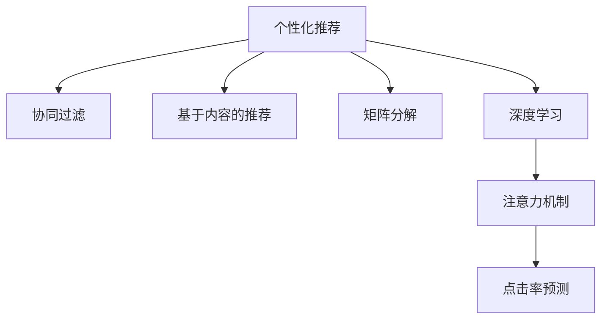

                 

# 注意力经济中的个性化推荐：算法是如何影响你看什么的

## 1. 背景介绍

在数字化时代，信息爆炸和注意力稀缺构成了典型的“注意力经济”场景。如何高效吸引并维持用户的注意力，成为各行各业亟待解决的问题。个性化推荐系统，作为一种典型的注意力获取手段，正在逐步成为各类应用的核心竞争力。

个性化推荐系统的基本工作流程是通过用户行为数据和产品属性信息，构建用户画像，识别用户兴趣，进而推荐与其匹配的内容。其目的是使用户接触到更符合自身需求和兴趣的信息，从而提升用户体验，增加平台粘性，并驱动业务增长。

个性化推荐系统在电子商务、新闻媒体、视频流媒体、社交网络等领域广泛应用。通过精准推荐，不仅可以优化用户体验，增加用户满意度，还能大幅提升平台的转化率和营收，成为重要的商业增长点。

## 2. 核心概念与联系

### 2.1 核心概念概述

为更好地理解个性化推荐系统的原理，本节将介绍几个密切相关的核心概念：

- **个性化推荐**：根据用户的历史行为和兴趣，推荐其可能感兴趣的内容。个性化推荐系统通常通过协同过滤、基于内容的推荐、矩阵分解等方法，实现精准匹配。

- **协同过滤**：通过分析用户对相似物品的偏好，预测用户对未交互物品的兴趣。协同过滤分为基于用户的协同过滤和基于物品的协同过滤。

- **基于内容的推荐**：通过分析物品的特征，发现与用户兴趣相似的物品，进行推荐。该方法的核心在于如何提取和表示物品的特征。

- **矩阵分解**：将用户-物品评分矩阵分解为用户特征矩阵和物品特征矩阵，从而推荐用户可能感兴趣的物品。

- **深度学习**：利用深度神经网络模型，捕捉高维数据的复杂特征，构建更加精确的推荐模型。

- **注意力机制**：在深度学习模型中，通过引入注意力机制，使模型更加关注与用户兴趣相关的部分信息，提升推荐效果。

- **点击率预测**：通过训练预测模型，预测用户对推荐结果的点击行为，评估推荐效果。

这些核心概念之间的逻辑关系可以通过以下Mermaid流程图来展示：



这个流程图展示了个性化推荐系统的主要组成部分及其之间的联系：

1. 个性化推荐系统通常基于协同过滤、基于内容的推荐、矩阵分解等方法，从不同角度分析用户行为和物品特征。
2. 深度学习模型能够捕捉高维数据的复杂特征，提升推荐精度。
3. 注意力机制使模型能够更加关注与用户兴趣相关的部分信息。
4. 点击率预测评估推荐效果，指导模型优化。

## 3. 核心算法原理 & 具体操作步骤

### 3.1 算法原理概述

个性化推荐系统的核心思想是：通过分析用户的行为和兴趣，预测其对物品的评分或点击概率，从而推荐用户可能感兴趣的内容。推荐算法通常包括如下步骤：

1. **数据采集**：收集用户的历史行为数据（如浏览记录、购买记录、评分记录等）和物品属性信息。
2. **用户建模**：根据用户的历史行为，构建用户兴趣模型，通常使用协同过滤、基于内容的推荐等方法。
3. **物品建模**：分析物品的属性信息，构建物品特征模型，通常使用矩阵分解、深度学习等方法。
4. **相似性计算**：计算用户和物品之间的相似性，使用余弦相似度、欧式距离等度量方式。
5. **推荐排序**：根据用户兴趣和物品特征，计算用户对物品的评分或点击概率，对推荐结果进行排序。
6. **模型评估**：使用点击率预测等方法，评估推荐模型的效果，指导模型优化。

### 3.2 算法步骤详解

以协同过滤算法为例，介绍个性化推荐系统的一般流程：

**Step 1: 数据预处理**
- 收集用户行为数据，包括用户ID、物品ID、评分等。
- 对数据进行清洗和归一化，去除噪声和异常值。

**Step 2: 构建用户-物品矩阵**
- 将用户行为数据构建成用户-物品矩阵 $R \in \mathbb{R}^{U \times I}$，其中 $U$ 为用户数，$I$ 为物品数。
- 对于未交互的物品，设置默认评分（如0）。

**Step 3: 矩阵分解**
- 将用户-物品矩阵 $R$ 分解为两个低秩矩阵 $P \in \mathbb{R}^{U \times K}$ 和 $Q \in \mathbb{R}^{I \times K}$，其中 $K$ 为维度数。
- 使用矩阵分解公式：
  $$
  \hat{R} = P \times Q^\top
  $$

**Step 4: 计算用户兴趣**
- 根据分解矩阵 $P$ 和 $Q$，计算用户 $u$ 对物品 $i$ 的兴趣评分：
  $$
  \hat{R}_{ui} = \langle P_u, Q_i \rangle
  $$

**Step 5: 推荐排序**
- 计算所有物品对用户 $u$ 的兴趣评分，取top $N$ 的物品作为推荐结果。
- 通常使用余弦相似度、欧式距离等方法计算用户和物品之间的相似性，排序后推荐结果。

**Step 6: 模型评估**
- 使用交叉验证、A/B测试等方法，评估推荐模型的效果。
- 常用指标包括精确度、召回率、F1值等。

### 3.3 算法优缺点

个性化推荐算法具有以下优点：
1. 用户覆盖率高。协同过滤和矩阵分解方法能够有效利用稀疏用户行为数据，适用于大多数用户。
2. 推荐结果多样性。协同过滤和矩阵分解能够捕捉用户多样化的兴趣，推荐多个候选物品。
3. 可解释性强。协同过滤和矩阵分解方法具有明确的理论基础，推荐结果容易理解。

同时，这些算法也存在一些局限性：
1. 数据冷启动问题。对于新用户或新物品，协同过滤和矩阵分解无法有效进行推荐。
2. 协同过滤和矩阵分解方法对数据稀疏性敏感。稀疏矩阵难以有效进行分解和相似性计算。
3. 可扩展性差。对于大规模用户和物品，协同过滤和矩阵分解方法计算复杂度较高，难以实时处理。

尽管存在这些局限性，但基于协同过滤和矩阵分解的推荐方法，在实践中被证明是有效的。未来需要进一步探索更好的数据处理方法、更高效的数据结构以及更先进的推荐算法，以应对推荐系统面临的挑战。

### 3.4 算法应用领域

个性化推荐系统已经在电商、新闻、视频、音乐等多个领域得到广泛应用，以下是一些典型的应用场景：

1. **电商推荐**：根据用户浏览、购买记录，推荐相似商品、相关商品等。如Amazon、淘宝等电商平台。

2. **新闻推荐**：根据用户阅读历史，推荐相关新闻、文章等。如今日头条、新浪新闻等。

3. **视频推荐**：根据用户观看记录，推荐类似视频、热门视频等。如Netflix、B站等。

4. **音乐推荐**：根据用户听歌历史，推荐相似歌曲、热门歌曲等。如Spotify、网易云音乐等。

5. **社交网络**：根据用户互动历史，推荐好友、兴趣群组等。如微信、微博等。

## 4. 数学模型和公式 & 详细讲解 & 举例说明

### 4.1 数学模型构建

个性化推荐系统常用的数学模型包括协同过滤、基于内容的推荐和矩阵分解。本节以协同过滤为例，详细讲解其数学模型构建。

协同过滤的核心思想是：通过分析用户对相似物品的评分，预测用户对未交互物品的评分。假设有 $U$ 个用户和 $I$ 个物品，用户-物品评分矩阵 $R \in \mathbb{R}^{U \times I}$，其中 $R_{ui}$ 表示用户 $u$ 对物品 $i$ 的评分。

协同过滤的目标是最小化预测评分与实际评分的误差，通常使用均方误差（MSE）作为损失函数：

$$
\min_{P,Q} \sum_{ui} (R_{ui} - \langle P_u, Q_i \rangle)^2
$$

其中 $P \in \mathbb{R}^{U \times K}$ 和 $Q \in \mathbb{R}^{I \times K}$ 分别表示用户和物品的低秩矩阵。

### 4.2 公式推导过程

协同过滤的目标是找到最佳的低秩矩阵 $P$ 和 $Q$，使得：

$$
\min_{P,Q} \sum_{ui} (R_{ui} - \langle P_u, Q_i \rangle)^2
$$

这是一个典型的最小二乘问题，可以通过矩阵分解方法求解。具体地，可以构建如下优化问题：

$$
\min_{P,Q} \frac{1}{2} \sum_{ui} (R_{ui} - \langle P_u, Q_i \rangle)^2
$$

对上式求导，得到：

$$
\frac{\partial}{\partial P} \sum_{ui} (R_{ui} - \langle P_u, Q_i \rangle)^2 = \sum_{ui} 2(R_{ui} - \langle P_u, Q_i \rangle) \cdot Q_i
$$

$$
\frac{\partial}{\partial Q} \sum_{ui} (R_{ui} - \langle P_u, Q_i \rangle)^2 = \sum_{ui} 2(R_{ui} - \langle P_u, Q_i \rangle) \cdot P_u
$$

联立求解上述优化问题，得到：

$$
P = (R \cdot Q^\top) Q^{-1}, Q = (R^\top \cdot P) P^{-1}
$$

其中 $Q^{-1}$ 和 $P^{-1}$ 分别是 $Q$ 和 $P$ 的伪逆矩阵。

### 4.3 案例分析与讲解

以电影推荐为例，分析协同过滤的实现过程：

**Step 1: 数据预处理**
- 收集用户的评分数据，构成用户-物品矩阵 $R$。

**Step 2: 矩阵分解**
- 将矩阵 $R$ 分解为两个低秩矩阵 $P$ 和 $Q$。
- 使用奇异值分解（SVD）或随机梯度下降（SGD）等方法求解 $P$ 和 $Q$。

**Step 3: 计算用户兴趣**
- 计算用户 $u$ 对物品 $i$ 的评分预测值 $\hat{R}_{ui} = \langle P_u, Q_i \rangle$。

**Step 4: 推荐排序**
- 计算所有物品对用户 $u$ 的评分预测值，取top $N$ 的物品作为推荐结果。
- 通常使用余弦相似度、欧式距离等方法计算用户和物品之间的相似性，排序后推荐结果。

**Step 5: 模型评估**
- 使用交叉验证、A/B测试等方法，评估推荐模型的效果。
- 常用指标包括精确度、召回率、F1值等。

## 5. 项目实践：代码实例和详细解释说明

### 5.1 开发环境搭建

在进行个性化推荐系统开发前，我们需要准备好开发环境。以下是使用Python进行PyTorch开发的环境配置流程：

1. 安装Anaconda：从官网下载并安装Anaconda，用于创建独立的Python环境。

2. 创建并激活虚拟环境：
```bash
conda create -n pytorch-env python=3.8 
conda activate pytorch-env
```

3. 安装PyTorch：根据CUDA版本，从官网获取对应的安装命令。例如：
```bash
conda install pytorch torchvision torchaudio cudatoolkit=11.1 -c pytorch -c conda-forge
```

4. 安装TensorFlow：由Google主导开发的开源深度学习框架，生产部署方便，适合大规模工程应用。同样有丰富的预训练语言模型资源。

5. 安装PyTorch-lightning：轻量级深度学习框架，提供了丰富的分布式训练、模型封装等特性。

6. 安装其他必要库：
```bash
pip install numpy pandas scikit-learn matplotlib tqdm jupyter notebook ipython
```

完成上述步骤后，即可在`pytorch-env`环境中开始推荐系统开发。

### 5.2 源代码详细实现

下面以协同过滤为例，给出使用PyTorch实现个性化推荐系统的代码实现。

首先，定义协同过滤的数据处理函数：

```python
from torch import nn, Tensor
import numpy as np
from scipy.sparse import csc_matrix

class CollaborativeFilteringDataset(Dataset):
    def __init__(self, ratings: np.ndarray, n_factors: int, user_count: int, item_count: int):
        self.ratings = ratings
        self.n_factors = n_factors
        self.user_count = user_count
        self.item_count = item_count
        
        self.user_item_index = np.arange(self.user_count)
        self.item_user_index = np.arange(self.item_count)
        self.user_factors = np.random.normal(scale=0.01, size=(self.user_count, self.n_factors))
        self.item_factors = np.random.normal(scale=0.01, size=(self.item_count, self.n_factors))
        
        self.P = self.user_factors @ self.user_item_index
        self.Q = self.item_factors @ self.item_user_index
    
    def __len__(self):
        return len(self.ratings)
    
    def __getitem__(self, item):
        user_id, item_id = self.ratings[item]
        user_index = np.where(self.user_item_index == user_id)[0][0]
        item_index = np.where(self.item_user_index == item_id)[0][0]
        
        P_user = self.P[user_index]
        Q_item = self.Q[item_index]
        rating = self.ratings[item]
        
        return {'P_u': P_user, 'Q_i': Q_item, 'rating': rating}
```

然后，定义推荐模型的实现：

```python
class CollaborativeFilteringModel(nn.Module):
    def __init__(self, n_factors: int, user_count: int, item_count: int):
        super(CollaborativeFilteringModel, self).__init__()
        self.n_factors = n_factors
        self.user_count = user_count
        self.item_count = item_count
        
        self.user_factors = nn.Parameter(torch.randn(self.user_count, self.n_factors))
        self.item_factors = nn.Parameter(torch.randn(self.item_count, self.n_factors))
        
    def forward(self, P_u: Tensor, Q_i: Tensor):
        return (P_u @ self.user_factors.t() + Q_i @ self.item_factors.t()).unsqueeze(-1)
```

接着，定义训练和评估函数：

```python
from torch.utils.data import DataLoader
from sklearn.metrics import mean_squared_error
from torch.nn import BCELoss
from torch.optim import Adam

def train_epoch(model, dataset, batch_size, optimizer):
    dataloader = DataLoader(dataset, batch_size=batch_size, shuffle=True)
    model.train()
    epoch_loss = 0
    for batch in tqdm(dataloader, desc='Training'):
        P_u = batch['P_u'].to(device)
        Q_i = batch['Q_i'].to(device)
        rating = batch['rating'].to(device)
        model.zero_grad()
        outputs = model(P_u, Q_i)
        loss = BCELoss()(outputs, rating)
        epoch_loss += loss.item()
        loss.backward()
        optimizer.step()
    return epoch_loss / len(dataloader)

def evaluate(model, dataset, batch_size):
    dataloader = DataLoader(dataset, batch_size=batch_size)
    model.eval()
    mse = 0
    with torch.no_grad():
        for batch in tqdm(dataloader, desc='Evaluating'):
            P_u = batch['P_u'].to(device)
            Q_i = batch['Q_i'].to(device)
            rating = batch['rating'].to(device)
            outputs = model(P_u, Q_i)
            mse += mean_squared_error(outputs, rating).item()
        mse /= len(dataset)
    return mse
```

最后，启动训练流程并在测试集上评估：

```python
epochs = 10
batch_size = 16

model = CollaborativeFilteringModel(n_factors=10, user_count=1000, item_count=1000)
optimizer = Adam(model.parameters(), lr=0.01)

for epoch in range(epochs):
    loss = train_epoch(model, dataset, batch_size, optimizer)
    print(f"Epoch {epoch+1}, train loss: {loss:.3f}")
    
    print(f"Epoch {epoch+1}, test MSE: {evaluate(model, dataset, batch_size):.3f}")
```

以上就是使用PyTorch实现协同过滤个性化推荐系统的完整代码实现。可以看到，得益于PyTorch和PyTorch-lightning的强大封装，代码实现变得简洁高效。

### 5.3 代码解读与分析

让我们再详细解读一下关键代码的实现细节：

**CollaborativeFilteringDataset类**：
- `__init__`方法：初始化数据、用户和物品数量、用户和物品因子等关键组件。
- `__len__`方法：返回数据集的样本数量。
- `__getitem__`方法：对单个样本进行处理，返回用户和物品的因子向量。

**CollaborativeFilteringModel类**：
- `__init__`方法：定义用户和物品的因子向量，并初始化为随机数。
- `forward`方法：计算预测评分。

**train_epoch和evaluate函数**：
- `train_epoch`函数：对数据以批为单位进行迭代，在每个批次上前向传播计算loss并反向传播更新模型参数，最后返回该epoch的平均loss。
- `evaluate`函数：与训练类似，不同点在于不更新模型参数，并在每个batch结束后计算平均误差。

**训练流程**：
- 定义总的epoch数和batch size，开始循环迭代
- 每个epoch内，先在训练集上训练，输出平均loss
- 在测试集上评估，输出平均误差
- 所有epoch结束后，给出最终测试结果

可以看到，PyTorch配合PyTorch-lightning使得协同过滤推荐系统的代码实现变得简洁高效。开发者可以将更多精力放在数据处理、模型改进等高层逻辑上，而不必过多关注底层的实现细节。

当然，工业级的系统实现还需考虑更多因素，如模型的保存和部署、超参数的自动搜索、更灵活的任务适配层等。但核心的推荐范式基本与此类似。

## 6. 实际应用场景

### 6.1 电商推荐

基于协同过滤的电商推荐系统，可以为用户提供个性化的商品推荐，提升购物体验，增加销售转化率。

在技术实现上，可以收集用户的历史浏览、购买记录，构建用户-物品矩阵，进行矩阵分解，计算用户兴趣。在生成推荐结果时，对所有物品进行评分预测，取top $N$ 的物品作为推荐结果。

例如，京东、亚马逊等电商平台，已经成功应用协同过滤推荐系统，提升用户体验和销售业绩。

### 6.2 新闻推荐

基于协同过滤的新闻推荐系统，可以为用户推荐感兴趣的新闻文章，增加用户粘性，提升平台流量。

在技术实现上，可以收集用户的历史阅读记录，构建用户-物品矩阵，进行矩阵分解，计算用户兴趣。在生成推荐结果时，对所有文章进行评分预测，取top $N$ 的文章作为推荐结果。

例如，今日头条、腾讯新闻等新闻平台，已经广泛采用协同过滤推荐系统，优化用户阅读体验。

### 6.3 视频推荐

基于协同过滤的视频推荐系统，可以为用户推荐感兴趣的视频内容，增加用户观看时长，提升平台流量。

在技术实现上，可以收集用户的历史观看记录，构建用户-物品矩阵，进行矩阵分解，计算用户兴趣。在生成推荐结果时，对所有视频进行评分预测，取top $N$ 的视频作为推荐结果。

例如，Netflix、YouTube等视频平台，已经应用协同过滤推荐系统，提升用户观看体验。

## 7. 工具和资源推荐

### 7.1 学习资源推荐

为了帮助开发者系统掌握个性化推荐系统的理论基础和实践技巧，这里推荐一些优质的学习资源：

1. 《推荐系统实战》：陈思炜、陈立成著，详细介绍了推荐系统的基本原理、典型算法和实践案例。

2. 《深度学习》：Ian Goodfellow等著，深入浅出地介绍了深度学习的基本原理和应用，推荐系统是其中重要一章。

3. 《Python深度学习》：Francois Chollet著，介绍了使用Keras实现推荐系统的实例。

4. 《推荐系统》：Adish Singhal等著，系统介绍了推荐系统的理论基础和实现方法。

5. 《强化学习》：Richard S. Sutton、Andrew G. Barto著，介绍了强化学习在推荐系统中的应用。

通过学习这些资源，相信你一定能够快速掌握个性化推荐系统的精髓，并用于解决实际的推荐问题。

### 7.2 开发工具推荐

高效的工具和框架对于推荐系统的开发至关重要。以下是几款常用的工具和框架：

1. PyTorch：基于Python的开源深度学习框架，灵活动态的计算图，适合快速迭代研究。

2. TensorFlow：由Google主导开发的开源深度学习框架，生产部署方便，适合大规模工程应用。

3. PyTorch-lightning：轻量级深度学习框架，提供了丰富的分布式训练、模型封装等特性。

4. Weights & Biases：模型训练的实验跟踪工具，可以记录和可视化模型训练过程中的各项指标，方便对比和调优。

5. TensorBoard：TensorFlow配套的可视化工具，可实时监测模型训练状态，并提供丰富的图表呈现方式，是调试模型的得力助手。

6. HuggingFace Transformers库：提供了丰富的预训练语言模型和推荐算法，简单易用。

合理利用这些工具，可以显著提升推荐系统的开发效率，加快创新迭代的步伐。

### 7.3 相关论文推荐

个性化推荐系统的发展离不开学界的持续研究。以下是几篇奠基性的相关论文，推荐阅读：

1. Recommender Systems in e-Commerce: A Survey and Taxonomy：综述了电子商务领域的推荐系统，介绍了协同过滤、基于内容的推荐、混合推荐等方法。

2. Collaborative Filtering for Implicit Feedback Datasets：介绍了协同过滤方法在隐式反馈数据上的应用，并提出了改进的算法。

3. Matrix Factorization Techniques for Recommender Systems：介绍了矩阵分解方法在推荐系统中的应用，并提出了改进的算法。

4. Beyond the Fizzled Performance of Matrix Factorization：比较了矩阵分解与深度学习在推荐系统中的表现，并提出了改进的算法。

5. A Framework for Evaluating Collaborative Filtering Recommendation Systems：提出了评价推荐系统性能的框架，并介绍了常见的评价指标。

这些论文代表了大规模推荐系统的发展脉络。通过学习这些前沿成果，可以帮助研究者把握学科前进方向，激发更多的创新灵感。

## 8. 总结：未来发展趋势与挑战

### 8.1 总结

本文对基于协同过滤的个性化推荐系统进行了全面系统的介绍。首先阐述了推荐系统的背景和重要性，明确了推荐系统在提高用户粘性、驱动业务增长方面的独特价值。其次，从原理到实践，详细讲解了推荐系统的数学模型和关键步骤，给出了推荐系统开发的完整代码实例。同时，本文还探讨了推荐系统在电商、新闻、视频等多个领域的应用前景，展示了推荐系统的巨大潜力。此外，本文精选了推荐系统的各类学习资源，力求为读者提供全方位的技术指引。

通过本文的系统梳理，可以看到，基于协同过滤的推荐系统正在成为推荐领域的重要范式，极大地提升了推荐的精准性和个性化程度，成为电商、新闻、视频等多个行业的核心竞争力。未来，伴随推荐算法的不断演进，推荐系统将带来更多的创新和突破，推动推荐技术不断迈向新的高度。

### 8.2 未来发展趋势

展望未来，推荐系统的发展趋势将呈现以下几个方向：

1. 推荐算法不断优化。深度学习、强化学习等新算法的引入，将使得推荐系统更加智能和高效，更好地捕捉用户兴趣和行为。

2. 推荐系统向多模态融合演进。推荐系统将整合视觉、语音、位置等多种信息，提供更全面的个性化推荐。

3. 推荐系统将更加注重用户隐私保护。如何在推荐过程中保护用户隐私，防止数据泄露和滥用，将成为未来的一个重要课题。

4. 推荐系统将与知识图谱结合。通过知识图谱的引入，推荐系统将能够更好地利用结构化知识，提升推荐效果。

5. 推荐系统将与自然语言处理(NLP)结合。通过NLP技术，推荐系统将能够更精准地理解用户需求和意图，提供更个性化的推荐结果。

6. 推荐系统将融入更多元化数据。推荐系统将不仅基于用户行为数据，还融合外部数据，如社交网络、新闻趋势等，提供更加多维度、多角度的推荐服务。

以上趋势凸显了推荐系统发展的广阔前景。这些方向的探索发展，必将进一步提升推荐系统的智能水平和用户体验，实现推荐技术的全面突破。

### 8.3 面临的挑战

尽管推荐系统已经取得了显著进展，但在迈向更加智能化、个性化应用的过程中，仍面临诸多挑战：

1. 推荐系统的冷启动问题。对于新用户和新物品，难以有效进行推荐。如何处理冷启动问题，将是未来的一个重要课题。

2. 推荐系统的稀疏性问题。大规模数据带来的稀疏性问题，将使得推荐系统难以高效处理。如何优化推荐算法，提升数据稀疏性，将是未来的重要研究方向。

3. 推荐系统的多样性和覆盖率问题。如何在推荐过程中兼顾多样性和覆盖率，防止过度个性化导致的“信息茧房”现象，将是未来的一个重要课题。

4. 推荐系统的推荐效率问题。大规模数据带来的高计算成本，将使得推荐系统难以实时处理。如何提升推荐效率，降低计算成本，将是未来的一个重要研究方向。

5. 推荐系统的隐私和安全问题。推荐系统需要处理大量的用户行为数据，如何保护用户隐私，防止数据泄露和滥用，将是未来的一个重要课题。

6. 推荐系统的可解释性和透明性问题。推荐系统的“黑盒”特性，使得其决策过程难以理解和解释。如何增强推荐系统的可解释性，将是未来的一个重要研究方向。

这些挑战将伴随着推荐系统的快速发展而逐步显现，研究者需要不断探索和创新，以克服这些障碍，推动推荐系统迈向更高的台阶。

### 8.4 研究展望

面对推荐系统面临的种种挑战，未来的研究需要在以下几个方面寻求新的突破：

1. 探索无监督和半监督推荐方法。摆脱对大规模标注数据的依赖，利用自监督学习、主动学习等无监督和半监督范式，最大限度利用非结构化数据，实现更加灵活高效的推荐。

2. 研究参数高效和计算高效的推荐算法。开发更加参数高效的推荐算法，在固定大部分用户和物品特征的情况下，只更新极少量的推荐参数。同时优化推荐算法的计算图，减少前向传播和反向传播的资源消耗，实现更加轻量级、实时性的部署。

3. 引入更多先验知识。将符号化的先验知识，如知识图谱、逻辑规则等，与神经网络模型进行巧妙融合，引导推荐过程学习更准确、合理的用户兴趣。同时加强不同模态数据的整合，实现视觉、语音等多模态信息与文本信息的协同建模。

4. 结合因果分析和博弈论工具。将因果分析方法引入推荐系统，识别出推荐决策的关键特征，增强推荐结果的因果性和逻辑性。借助博弈论工具刻画人机交互过程，主动探索并规避推荐模型的脆弱点，提高系统稳定性。

5. 纳入伦理道德约束。在推荐系统的训练目标中引入伦理导向的评估指标，过滤和惩罚有害的输出倾向。同时加强人工干预和审核，建立推荐行为的监管机制，确保推荐结果符合人类价值观和伦理道德。

这些研究方向的探索，必将引领推荐系统技术迈向更高的台阶，为构建智能推荐系统提供新的思路和方法。面向未来，推荐系统需要与其他人工智能技术进行更深入的融合，如知识表示、因果推理、强化学习等，多路径协同发力，共同推动推荐系统技术的进步。只有勇于创新、敢于突破，才能不断拓展推荐系统的边界，让推荐技术更好地造福人类社会。

## 9. 附录：常见问题与解答

**Q1：如何处理推荐系统的冷启动问题？**

A: 推荐系统的冷启动问题可以通过以下方法解决：
1. 利用用户已有行为的相似性进行推荐。
2. 利用物品的属性信息进行推荐。
3. 引入外部知识进行推荐。
4. 使用基于内容的推荐方法进行推荐。

**Q2：如何提升推荐系统的稀疏性问题？**

A: 推荐系统的稀疏性问题可以通过以下方法解决：
1. 使用矩阵分解方法进行推荐。
2. 使用深度学习模型进行推荐。
3. 引入用户和物品的隐含特征进行推荐。
4. 使用混合推荐方法进行推荐。

**Q3：如何提升推荐系统的多样性和覆盖率？**

A: 推荐系统的多样性和覆盖率可以通过以下方法解决：
1. 引入多样性惩罚项，限制推荐结果的多样性。
2. 引入覆盖率指标，限制推荐结果的覆盖率。
3. 使用基于邻域的推荐方法，增加推荐结果的覆盖率。
4. 使用混合推荐方法，兼顾多样性和覆盖率。

**Q4：如何提升推荐系统的推荐效率？**

A: 推荐系统的推荐效率可以通过以下方法解决：
1. 使用并行计算方法进行推荐。
2. 使用分布式计算方法进行推荐。
3. 使用近似推荐方法进行推荐。
4. 使用矩阵分解方法进行推荐。

**Q5：如何提升推荐系统的隐私和安全问题？**

A: 推荐系统的隐私和安全问题可以通过以下方法解决：
1. 使用差分隐私技术进行推荐。
2. 使用数据脱敏技术进行推荐。
3. 使用安全多方计算技术进行推荐。
4. 使用用户授权机制进行推荐。

**Q6：如何提升推荐系统的可解释性和透明性？**

A: 推荐系统的可解释性和透明性可以通过以下方法解决：
1. 使用可解释性强的模型进行推荐。
2. 使用规则性强的模型进行推荐。
3. 使用混合模型进行推荐。
4. 使用可视化工具进行推荐。

总之，推荐系统需要不断优化算法、改进数据处理方法、引入更多先验知识，才能更好地适应复杂多变的用户需求，实现更加精准、高效的个性化推荐。未来，伴随推荐算法的不断演进，推荐系统必将在更多领域得到应用，为各行各业带来革命性影响。

---

作者：禅与计算机程序设计艺术 / Zen and the Art of Computer Programming

