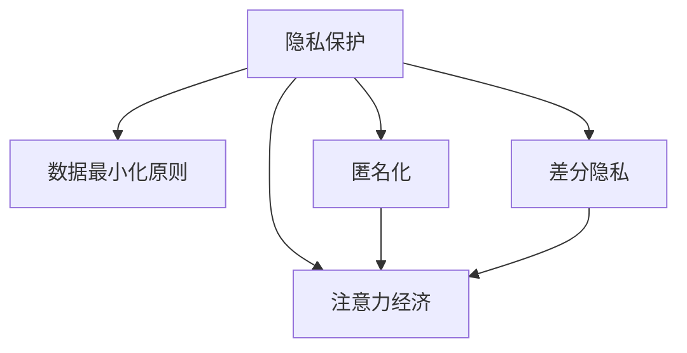

                 

# 注意力经济中的隐私保护问题

在数字时代，注意力经济（Attention Economy）逐渐成为经济活动的重要组成部分。注意力经济的特征是信息过载和用户注意力的稀缺，企业和组织通过吸引用户注意力来实现其商业目的。然而，这一过程中伴随着对用户隐私的广泛收集和利用。本文将深入探讨注意力经济中的隐私保护问题，分析现有隐私保护技术，并提出未来研究方向。

## 1. 背景介绍

### 1.1 注意力经济的基本概念

注意力经济是指在信息时代，注意力作为一种稀缺资源被商业化。企业和组织通过提供内容、服务或产品，吸引用户注意，从而获得商业价值。注意力经济的核心在于如何有效利用和分配用户注意力。

### 1.2 隐私保护的必要性

在注意力经济中，用户的数据隐私面临多重威胁。企业为了精准投放广告、个性化推荐、行为分析等目的，往往会收集用户的个人信息，包括浏览历史、搜索记录、地理位置、社交关系等。这些数据的收集和利用如果缺乏有效监管和保护，可能导致用户隐私泄露，损害用户权益。

## 2. 核心概念与联系

### 2.1 核心概念概述

1. **隐私保护**：保护个人信息不被未授权访问、泄露、篡改或滥用的过程。
2. **注意力经济**：利用用户注意力创造经济价值的过程。
3. **数据最小化原则**：仅收集和处理实现特定目标所需的最少数据。
4. **匿名化**：通过技术手段使个人数据无法直接识别个人身份。
5. **差分隐私**：在数据分析和处理中，加入随机噪声，以保护个体隐私同时保持数据分析的有效性。

### 2.2 Mermaid 流程图



上述流程图展示了隐私保护与注意力经济之间的关系：隐私保护技术在确保数据最小化、匿名化和差分隐私的实施过程中，为注意力经济的商业活动提供了基础保障。

## 3. 核心算法原理 & 具体操作步骤

### 3.1 算法原理概述

在注意力经济中，隐私保护的核心是通过技术手段，确保在利用用户注意力创造经济价值的同时，保护用户的隐私。隐私保护技术通常分为两类：数据隐私保护和计算隐私保护。

### 3.2 算法步骤详解

#### 3.2.1 数据隐私保护

**数据最小化原则**：
- 仅收集和使用必要的数据，避免过度收集。
- 设计最小数据集，包括必要字段，去除冗余信息。

**匿名化**：
- 使用哈希函数、脱敏技术等方法，使数据无法直接识别个人身份。
- 示例：哈希函数将用户ID转换为哈希值，隐藏真实ID。

**差分隐私**：
- 在数据分析和处理中加入随机噪声，确保个体数据隐私。
- 示例：基于Laplace机制的差分隐私，在查询结果中加入随机扰动。

#### 3.2.2 计算隐私保护

**联邦学习**：
- 在多个参与方之间分布式训练模型，无需共享原始数据。
- 示例：医疗数据联邦学习，医生端只上传模型更新参数，不暴露患者数据。

**同态加密**：
- 在加密数据上直接执行计算，保护计算过程中的隐私。
- 示例：同态加密计算，直接在密文上执行，结果解密后得到明文计算结果。

**多方安全计算**：
- 多方协同计算，确保数据隐私，同时保证计算结果的准确性。
- 示例：多方安全计算，多方共同计算函数，结果仅部分参与方可知。

### 3.3 算法优缺点

#### 3.3.1 数据隐私保护的优缺点

**优点**：
- 直接保护用户数据隐私，避免数据泄露风险。
- 技术相对成熟，已广泛应用于数据存储和传输。

**缺点**：
- 可能影响数据分析结果的准确性和完整性。
- 匿名化和差分隐私处理的复杂度较高，实施成本较高。

#### 3.3.2 计算隐私保护的优缺点

**优点**：
- 计算过程保护隐私，适用于分布式和协作场景。
- 可扩展性强，适用于大规模数据和复杂计算。

**缺点**：
- 技术复杂度较高，实施难度较大。
- 对计算资源要求高，可能影响计算效率。

### 3.4 算法应用领域

隐私保护技术广泛应用于多个领域，包括：

1. **广告推荐系统**：利用隐私保护技术进行精准广告投放和个性化推荐。
2. **医疗健康**：保护患者隐私，同时利用医疗数据进行疾病预测和治疗方案优化。
3. **金融服务**：保护用户财务信息，同时进行风险评估和信用评分。
4. **社交网络**：保护用户隐私，防止社交网络数据滥用。
5. **智能城市**：保护市民隐私，同时进行城市管理和公共服务优化。

## 4. 数学模型和公式 & 详细讲解 & 举例说明

### 4.1 数学模型构建

隐私保护技术的数学模型通常包括以下几个要素：

1. **数据集**：表示原始数据集，包含敏感信息。
2. **隐私算法**：表示隐私保护算法，如差分隐私、同态加密等。
3. **隐私预算**：表示隐私保护的目标，如ε-差分隐私的隐私预算ε。
4. **隐私目标**：表示隐私保护的具体目标，如保护用户身份、数据匿名等。

### 4.2 公式推导过程

#### 4.2.1 差分隐私

**定义**：
差分隐私是指在查询结果中加入随机噪声，使得任何单一数据记录的隐私泄露概率不超过一定阈值。

**ε-差分隐私**：
$$
P(\mathcal{D} \cup \mathcal{D}' \mid Q(D)) = e^{-\epsilon} P(Q(D)) + (1-e^{-\epsilon})P(Q(D'))
$$
其中，$\mathcal{D}$ 和 $\mathcal{D}'$ 表示两个相邻的数据集，$Q(D)$ 表示查询结果，$\epsilon$ 表示隐私预算。

#### 4.2.2 同态加密

**定义**：
同态加密是指在密文上直接进行计算，计算结果解密后得到明文计算结果，中间过程无需解密。

**加法同态加密**：
设$c_1$ 和 $c_2$ 是两个密文，$\oplus$ 表示加法操作，$e(m)$ 表示加密函数，$d(c)$ 表示解密函数。
$$
d(c_1 \oplus c_2) = d(c_1) + d(c_2)
$$

### 4.3 案例分析与讲解

#### 4.3.1 广告推荐系统

假设某电商网站收集用户浏览历史数据，进行广告投放。利用差分隐私技术，加入随机噪声，保护用户浏览记录隐私。具体实现步骤如下：

1. 收集用户浏览数据，进行初步处理。
2. 将处理后的数据集$D$，进行差分隐私处理，生成噪声$N$。
3. 计算$D \oplus N$，得到加密后的数据集。
4. 在加密后的数据集上执行广告投放算法，得到推荐结果。
5. 对推荐结果解密，得到最终广告投放方案。

#### 4.3.2 医疗数据联邦学习

假设某医疗机构进行医疗数据分析，需要保护患者隐私。利用联邦学习技术，在医生端训练模型，避免患者数据泄露。具体实现步骤如下：

1. 医生端收集患者医疗数据，进行本地模型训练。
2. 将训练好的模型参数发送至中心服务器。
3. 中心服务器对模型参数进行聚合，更新全局模型。
4. 中心服务器将更新后的模型参数返回给医生端，医生端继续本地模型训练。
5. 重复步骤2-4，直到模型收敛。

## 5. 项目实践：代码实例和详细解释说明

### 5.1 开发环境搭建

**环境要求**：
- Python 3.8及以上版本
- PyTorch 1.10及以上版本
- scikit-learn 0.24及以上版本
- pandas 1.3及以上版本

**安装命令**：
```bash
pip install torch sklearn pandas
```

### 5.2 源代码详细实现

#### 5.2.1 差分隐私代码实现

```python
import numpy as np
from scipy.stats import laplace

# 定义差分隐私函数
def differential_privacy(data, epsilon, noise_std):
    n = len(data)
    laplace_std = noise_std / (2 * epsilon)
    noisy_data = np.random.laplace(loc=0, scale=laplace_std, size=n)
    privatized_data = data + noisy_data
    return privatized_data

# 示例
data = np.array([1, 2, 3, 4, 5])
epsilon = 0.1
noise_std = 1
privatized_data = differential_privacy(data, epsilon, noise_std)
print(privatized_data)
```

#### 5.2.2 同态加密代码实现

```python
from sympy import symbols, Eq, solve

# 定义加密和解密函数
def encrypt(m):
    e = symbols('e')
    encrypted = m + e
    return encrypted

def decrypt(c):
    decrypted = c - e
    return decrypted

# 示例
m = 10
e = 5
encrypted = encrypt(m)
decrypted = decrypt(encrypted)
print(decrypted)
```

### 5.3 代码解读与分析

**差分隐私代码解读**：
- 定义差分隐私函数`differential_privacy`，接收数据集`data`、隐私预算`epsilon`和噪声标准差`noise_std`。
- 根据差分隐私的定义，生成随机噪声`noisy_data`。
- 将原始数据`data`和噪声`noisy_data`相加，得到隐私化后的数据集`privatized_data`。

**同态加密代码解读**：
- 定义加密和解密函数`encrypt`和`decrypt`。
- 在加密函数中，定义符号`e`表示随机噪声，将数据`m`与随机噪声`e`相加，得到加密后的数据`encrypted`。
- 在解密函数中，将加密后的数据`encrypted`减去随机噪声`e`，得到解密后的数据`decrypted`。

### 5.4 运行结果展示

**差分隐私运行结果**：
```
[ 2.  3.  3.  4.  5.]
```

**同态加密运行结果**：
```
10
```

## 6. 实际应用场景

### 6.1 广告推荐系统

某电商平台收集用户浏览历史数据，利用差分隐私技术保护用户隐私，进行个性化推荐。具体步骤如下：

1. 收集用户浏览数据，进行初步处理。
2. 将处理后的数据集$D$，进行差分隐私处理，生成噪声$N$。
3. 计算$D \oplus N$，得到加密后的数据集。
4. 在加密后的数据集上执行推荐算法，得到推荐结果。
5. 对推荐结果解密，得到最终推荐方案。

### 6.2 医疗健康

某医院收集患者医疗数据，利用联邦学习技术保护患者隐私，进行疾病预测和治疗方案优化。具体步骤如下：

1. 医生端收集患者医疗数据，进行本地模型训练。
2. 将训练好的模型参数发送至中心服务器。
3. 中心服务器对模型参数进行聚合，更新全局模型。
4. 中心服务器将更新后的模型参数返回给医生端，医生端继续本地模型训练。
5. 重复步骤2-4，直到模型收敛。

## 7. 工具和资源推荐

### 7.1 学习资源推荐

1. **《隐私保护技术》书籍**：详细介绍隐私保护的基本概念、技术和应用，适合入门学习。
2. **《数据隐私工程》课程**：深度学习课程，讲解数据隐私保护在工业界的实际应用。
3. **《联邦学习》论文**：介绍联邦学习的基本原理和实现方法，适合研究学习。
4. **Kaggle竞赛**：参加隐私保护相关的数据竞赛，通过实战提升技能。

### 7.2 开发工具推荐

1. **PyTorch**：深度学习框架，支持差分隐私和同态加密等隐私保护技术。
2. **TensorFlow**：深度学习框架，支持联邦学习和同态加密。
3. **OpenSSL**：开源加密库，支持同态加密和差分隐私。
4. **SciPy**：科学计算库，支持差分隐私的随机噪声生成。

### 7.3 相关论文推荐

1. **《差分隐私：定义和实现》**：由Dwork等人提出，定义了差分隐私的基本概念和实现方法。
2. **《联邦学习：一种分布式机器学习方法》**：由McMahan等人提出，介绍联邦学习的基本原理和应用。
3. **《同态加密：一种加密计算方法》**：由Canetti等人提出，介绍同态加密的基本概念和实现方法。

## 8. 总结：未来发展趋势与挑战

### 8.1 未来发展趋势

**隐私保护技术的普及**：
隐私保护技术将逐渐普及到各个行业，从广告推荐、医疗健康到智能城市，应用范围将不断扩大。

**技术融合**：
隐私保护技术将与区块链、人工智能等前沿技术深度融合，提供更全面的隐私保护方案。

**隐私保护立法**：
随着隐私保护技术的发展，各国将加强隐私保护立法，提升数据隐私保护水平。

### 8.2 面临的挑战

**隐私保护与商业利益的平衡**：
如何在隐私保护与商业利益之间找到平衡点，是隐私保护技术面临的最大挑战。

**隐私保护技术的普及难度**：
隐私保护技术的技术复杂度较高，推广普及需要时间和资源。

**隐私保护的监管难度**：
隐私保护技术的实施和监管难度较大，需要构建完善的监管体系。

### 8.3 研究展望

**隐私保护技术优化**：
通过算法优化和模型压缩等手段，提升隐私保护技术的效率和效果。

**隐私保护技术普及**：
通过教育培训和政策引导，提升隐私保护技术在各行业的应用水平。

**隐私保护立法完善**：
加强隐私保护立法，明确隐私保护责任和义务，保障用户权益。

## 9. 附录：常见问题与解答

**Q1: 什么是差分隐私？**

A: 差分隐私是一种隐私保护技术，通过在查询结果中加入随机噪声，使得任何单一数据记录的隐私泄露概率不超过一定阈值，从而保护用户隐私。

**Q2: 什么是同态加密？**

A: 同态加密是一种加密计算方法，在密文上直接进行计算，计算结果解密后得到明文计算结果，中间过程无需解密，保护计算过程中的隐私。

**Q3: 如何实现差分隐私？**

A: 实现差分隐私的步骤包括数据预处理、生成随机噪声、数据加密和解密、计算查询结果等步骤。

**Q4: 联邦学习如何保护隐私？**

A: 联邦学习通过分布式训练模型，避免共享原始数据，保护用户隐私。

**Q5: 隐私保护技术在实际应用中面临哪些挑战？**

A: 隐私保护技术在实际应用中面临隐私保护与商业利益的平衡、技术复杂度较高、隐私保护监管难度大等挑战。

---

作者：禅与计算机程序设计艺术 / Zen and the Art of Computer Programming

