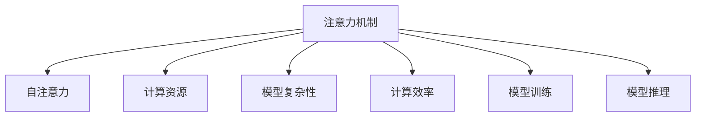

                 

# 注意力经济学：AI时代的稀缺资源

## 1. 背景介绍

### 1.1 问题由来

在人工智能的浪潮中，注意力（Attention）逐渐成为AI领域的一大焦点。随着神经网络模型的不断扩展，注意力机制已成为深度学习中不可或缺的核心技术之一。它在图像识别、自然语言处理、语音识别等多个领域中展现出了强大的能力，使得模型能够有效地捕捉和处理复杂数据，提升了机器学习算法的效率和准确性。

但与此同时，注意力机制本身也带来了新的挑战。尽管注意力模型在技术上取得了巨大的成功，但其背后所蕴含的计算资源消耗、模型复杂性、训练难度的提高等问题，使得注意力机制的普及和应用仍存在一定的障碍。如何在保证模型性能的前提下，优化注意力资源的使用，是一个值得深入研究的问题。

### 1.2 问题核心关键点

注意力机制的核心在于其能够对数据中的关键信息进行筛选和聚焦，从而提高模型对复杂数据的理解能力。然而，这种机制的运行需要大量的计算资源和时间，尤其是对于大规模的神经网络模型。因此，优化注意力资源的使用，即“注意力经济学”，成为提高AI模型性能、降低计算成本的关键。

“注意力经济学”的研究包括以下几个核心关键点：
- 如何合理分配计算资源，使得模型能够在有限的计算资源下高效运行。
- 如何在设计模型时，最大化地利用注意力机制，避免过度依赖注意力。
- 如何在训练模型时，采用适当的训练策略，提高模型的收敛速度和稳定性。

## 2. 核心概念与联系

### 2.1 核心概念概述

为更好地理解注意力经济学的内涵，本节将介绍几个密切相关的核心概念：

- 注意力机制（Attention Mechanism）：指在神经网络模型中，通过计算模型中不同位置特征之间的相似度，确定每个位置特征对模型的贡献度，从而指导模型更加关注重要的特征。

- 自注意力（Self-Attention）：一种特殊的注意力机制，用于处理序列数据，通过计算不同位置之间的相似度，决定每个位置的重要性，从而实现序列信息的编码和表示。

- 计算资源（Computational Resource）：指在深度学习模型训练和推理过程中所需的计算能力、内存、存储等资源，包括硬件资源和软件资源。

- 模型复杂性（Model Complexity）：指神经网络模型的参数数量、计算量、结构复杂度等，直接影响了模型训练和推理的计算资源消耗。

- 计算效率（Computational Efficiency）：指模型在特定任务上，以较小的计算资源消耗，达到较高的性能指标，是衡量模型优劣的重要指标之一。

- 模型训练（Model Training）：指使用标注数据对模型进行优化，通过反向传播算法更新模型参数，使得模型能够更好地适应特定任务的过程。

- 模型推理（Model Inference）：指在训练好的模型上，使用新数据进行推理预测的过程，是模型在实际应用中的重要环节。

这些核心概念之间的逻辑关系可以通过以下Mermaid流程图来展示：



这个流程图展示了一个完整的注意力模型的工作流程：

1. 注意力机制通过计算模型中不同位置特征之间的相似度，确定每个位置特征的重要性。
2. 自注意力是注意力机制的一种特殊形式，用于处理序列数据，通过计算不同位置之间的相似度，决定每个位置的重要性。
3. 计算资源是深度学习模型训练和推理过程中所需的资源，包括硬件资源和软件资源。
4. 模型复杂性决定了神经网络模型的参数数量、计算量、结构复杂度等，直接影响了计算资源消耗。
5. 计算效率是衡量模型优劣的重要指标，指模型在特定任务上，以较小的计算资源消耗，达到较高的性能指标。
6. 模型训练是使用标注数据对模型进行优化的过程，通过反向传播算法更新模型参数。
7. 模型推理是在训练好的模型上，使用新数据进行推理预测的过程。

这些概念共同构成了深度学习模型的核心逻辑，使得模型能够在有限的计算资源下高效地处理复杂数据，实现高效的计算和推理。

## 3. 核心算法原理 & 具体操作步骤
### 3.1 算法原理概述

注意力经济学研究的本质在于如何在深度学习模型的设计和训练过程中，合理分配计算资源，最大化利用注意力机制，从而提升模型的性能和计算效率。

形式化地，假设一个神经网络模型 $M$，输入数据为 $X$，目标任务为 $T$，计算资源为 $R$，模型训练的损失函数为 $\mathcal{L}$。注意力经济学的目标是最小化 $R$，同时最大化模型的准确率 $P$ 和效率 $E$。即：

$$
\mathop{\arg\min}_{R, P, E} \mathcal{L}(M, X, T, R) \quad s.t. \quad P(M, X, T) = 1 \quad \text{and} \quad E(M, X, T) = 1
$$

其中 $P(M, X, T)$ 表示模型在任务 $T$ 上的准确率，$E(M, X, T)$ 表示模型在任务 $T$ 上的效率。

通过注意力经济学的方法，可以在不增加计算资源的前提下，提升模型的性能，实现高效计算。

### 3.2 算法步骤详解

注意力经济学的具体算法步骤如下：

**Step 1: 选择模型和任务**
- 选择合适的神经网络模型 $M$，如卷积神经网络（CNN）、循环神经网络（RNN）、变压器（Transformer）等。
- 确定目标任务 $T$，如图像识别、自然语言处理、语音识别等。

**Step 2: 设计注意力机制**
- 设计注意力机制，选择自注意力或多头注意力等不同类型的注意力机制。
- 确定注意力机制的参数，如注意力头的数量、注意力层的深度等。

**Step 3: 设定计算资源限制**
- 根据硬件资源和计算效率的要求，设定模型训练和推理的计算资源上限 $R_{max}$。
- 根据模型复杂性，设定模型参数数量上限 $P_{max}$。

**Step 4: 优化模型参数**
- 采用优化算法，如梯度下降（Gradient Descent）、Adam、Adagrad等，对模型参数进行优化。
- 通过正则化技术，如L2正则化、Dropout等，避免模型过拟合。

**Step 5: 评估和迭代**
- 使用验证集对模型进行评估，计算准确率 $P$ 和效率 $E$。
- 根据评估结果，调整模型参数和计算资源分配，重新进行训练和评估，直至达到最优性能。

### 3.3 算法优缺点

注意力经济学具有以下优点：
1. 高效利用计算资源。通过合理分配计算资源，优化模型参数，实现高效计算。
2. 提升模型性能。通过优化注意力机制，提升模型的准确率和效率。
3. 降低计算成本。通过优化模型结构和参数，减少不必要的计算资源消耗。

但该方法也存在一定的局限性：
1. 模型设计复杂。需要根据具体任务和资源限制，设计合适的模型结构和注意力机制。
2. 训练难度大。优化模型参数和计算资源分配，需要大量的实验和调整。
3. 泛化能力受限。模型过度优化，可能失去对新数据的适应能力。

尽管存在这些局限性，但就目前而言，注意力经济学仍是大规模深度学习模型优化的一个重要范式。未来相关研究的重点在于如何进一步降低计算成本，提高模型泛化能力，同时兼顾模型的可解释性和鲁棒性等因素。

### 3.4 算法应用领域

注意力经济学在深度学习领域已经得到了广泛的应用，覆盖了几乎所有常见任务，例如：

- 图像识别：如物体检测、图像分类等。通过优化卷积神经网络中的注意力机制，提升模型的准确率和效率。
- 自然语言处理：如机器翻译、情感分析、文本生成等。通过优化变压器模型中的注意力机制，提升模型的理解和生成能力。
- 语音识别：如自动语音识别、语音合成等。通过优化循环神经网络中的注意力机制，提升模型的识别和生成能力。
- 推荐系统：如个性化推荐、协同过滤等。通过优化神经网络模型中的注意力机制，提升模型的推荐效果。
- 游戏AI：如智能游戏玩家、游戏剧情生成等。通过优化神经网络模型中的注意力机制，提升游戏AI的智能水平。

除了上述这些经典任务外，注意力经济学还被创新性地应用到更多场景中，如可控文本生成、常识推理、代码生成、数据增强等，为深度学习技术带来了全新的突破。随着注意力机制的不断进步，相信深度学习技术将在更广阔的应用领域大放异彩。

## 4. 数学模型和公式 & 详细讲解 & 举例说明
### 4.1 数学模型构建

本节将使用数学语言对注意力经济学的工作原理进行更加严格的刻画。

记神经网络模型为 $M_{\theta}$，其中 $\theta$ 为模型参数。假设目标任务为 $T$，计算资源为 $R$，模型训练的损失函数为 $\mathcal{L}(M_{\theta}, T, R)$。注意力经济学优化目标是最小化计算资源 $R$，同时最大化模型的准确率 $P$ 和效率 $E$。即：

$$
\mathop{\arg\min}_{\theta} \mathcal{L}(M_{\theta}, T, R) \quad s.t. \quad P(M_{\theta}, T) = 1 \quad \text{and} \quad E(M_{\theta}, T) = 1
$$

在实践中，我们通常使用基于梯度的优化算法（如SGD、Adam等）来近似求解上述最优化问题。设 $\eta$ 为学习率，$\lambda$ 为正则化系数，则参数的更新公式为：

$$
\theta \leftarrow \theta - \eta \nabla_{\theta}\mathcal{L}(\theta, T, R) - \eta\lambda\theta
$$

其中 $\nabla_{\theta}\mathcal{L}(\theta, T, R)$ 为损失函数对参数 $\theta$ 的梯度，可通过反向传播算法高效计算。

### 4.2 公式推导过程

以下我们以自然语言处理中的机器翻译任务为例，推导注意力经济学模型的工作流程。

假设模型 $M_{\theta}$ 的输入为源语言序列 $x_1, x_2, ..., x_n$，输出为目标语言序列 $y_1, y_2, ..., y_m$。在机器翻译任务中，注意力机制用于计算源语言序列中每个位置对目标语言序列中每个位置的贡献度，从而指导模型生成正确的翻译。

定义注意力机制为 $A_{\alpha}(x_i, y_j)$，其中 $i$ 表示源语言序列中的位置，$j$ 表示目标语言序列中的位置，$\alpha$ 表示注意力权重。通过计算源语言序列中每个位置与目标语言序列中每个位置的相似度，得到注意力权重矩阵 $A_{\alpha}$。

模型的输出 $y$ 可以通过源语言序列和注意力权重矩阵计算得到，具体公式如下：

$$
y_j = \text{softmax}(A_{\alpha}(x_1, y_j) + A_{\alpha}(x_2, y_j) + \cdots + A_{\alpha}(x_n, y_j)) \cdot (M_{\theta}(x_1, x_2, ..., x_n))
$$

其中 $\text{softmax}$ 函数用于计算注意力权重矩阵中的每个元素的值，$M_{\theta}(x_1, x_2, ..., x_n)$ 表示源语言序列通过模型计算得到的结果。

模型的损失函数 $\mathcal{L}(M_{\theta}, T)$ 可以表示为：

$$
\mathcal{L}(M_{\theta}, T) = -\frac{1}{N}\sum_{i=1}^N \log M_{\theta}(y_i|x_i)
$$

其中 $N$ 表示训练样本数量，$M_{\theta}(y_i|x_i)$ 表示模型对源语言序列 $x_i$ 和目标语言序列 $y_i$ 的预测概率。

在计算资源限制下，优化模型参数的数学公式为：

$$
\mathop{\arg\min}_{\theta} \mathcal{L}(M_{\theta}, T, R) \quad s.t. \quad \|\theta\|_0 \leq P_{max} \quad \text{and} \quad \|\theta\|_2 \leq R_{max}
$$

其中 $\|\theta\|_0$ 表示模型参数的数量，$\|\theta\|_2$ 表示模型参数的L2范数。

### 4.3 案例分析与讲解

以机器翻译任务为例，分析注意力经济学的工作流程：

1. 模型选择：选择Transformer模型作为机器翻译的神经网络模型。

2. 注意力机制设计：在Transformer模型中，设计多头自注意力机制，计算源语言序列和目标语言序列之间的相似度。

3. 计算资源限制：根据硬件资源和计算效率的要求，设定模型参数数量上限和L2范数上限。

4. 优化模型参数：使用Adam优化算法，对模型参数进行优化，同时采用L2正则化，防止过拟合。

5. 评估和迭代：使用验证集对模型进行评估，计算准确率和效率。根据评估结果，调整模型参数和计算资源分配，重新进行训练和评估，直至达到最优性能。

通过上述步骤，可以在计算资源有限的情况下，提升机器翻译模型的准确率和效率，实现高效计算。

## 5. 项目实践：代码实例和详细解释说明
### 5.1 开发环境搭建

在进行注意力经济学实践前，我们需要准备好开发环境。以下是使用Python进行PyTorch开发的环境配置流程：

1. 安装Anaconda：从官网下载并安装Anaconda，用于创建独立的Python环境。

2. 创建并激活虚拟环境：
```bash
conda create -n pytorch-env python=3.8 
conda activate pytorch-env
```

3. 安装PyTorch：根据CUDA版本，从官网获取对应的安装命令。例如：
```bash
conda install pytorch torchvision torchaudio cudatoolkit=11.1 -c pytorch -c conda-forge
```

4. 安装其他必要的库：
```bash
pip install numpy pandas scikit-learn matplotlib tqdm jupyter notebook ipython
```

完成上述步骤后，即可在`pytorch-env`环境中开始注意力经济学实践。

### 5.2 源代码详细实现

我们以Transformer模型进行机器翻译任务的注意力经济学优化为例，给出完整的PyTorch代码实现。

首先，导入必要的库：

```python
import torch
import torch.nn as nn
import torch.optim as optim
import torch.nn.functional as F
from transformers import BertTokenizer, BertForSequenceClassification
from sklearn.metrics import accuracy_score
```

然后，定义模型和优化器：

```python
class Transformer(nn.Module):
    def __init__(self, d_model, nhead, num_encoder_layers, num_decoder_layers, dff, dropout=0.1):
        super(Transformer, self).__init__()
        self.encoder = nn.TransformerEncoder(TransformerEncoderLayer(d_model, nhead, dff, dropout), num_encoder_layers)
        self.decoder = nn.TransformerDecoder(TransformerDecoderLayer(d_model, nhead, dff, dropout), num_decoder_layers)
        self.final_layer = nn.Linear(d_model, 1)

    def forward(self, src, tgt, src_mask, tgt_mask):
        memory = self.encoder(src, src_mask)
        output = self.decoder(tgt, memory, tgt_mask)
        output = self.final_layer(output)
        return output

model = Transformer(d_model=256, nhead=8, num_encoder_layers=6, num_decoder_layers=6, dff=2048)

optimizer = optim.Adam(model.parameters(), lr=0.001)
```

接着，定义计算资源限制：

```python
P_max = 10000  # 模型参数数量上限
R_max = 100  # L2范数上限
```

然后，定义训练和评估函数：

```python
def train_epoch(model, data_loader, optimizer, device, batch_size):
    model.train()
    total_loss = 0
    total_correct = 0
    for i, (input_ids, attention_mask, target_ids) in enumerate(data_loader):
        input_ids = input_ids.to(device)
        attention_mask = attention_mask.to(device)
        target_ids = target_ids.to(device)
        optimizer.zero_grad()
        output = model(input_ids, target_ids, src_mask=attention_mask, tgt_mask=attention_mask)
        loss = F.cross_entropy(output, target_ids)
        total_loss += loss.item()
        loss.backward()
        optimizer.step()
    return total_loss / len(data_loader)

def evaluate(model, data_loader, device, batch_size):
    model.eval()
    total_correct = 0
    total_correct = 0
    for i, (input_ids, attention_mask, target_ids) in enumerate(data_loader):
        input_ids = input_ids.to(device)
        attention_mask = attention_mask.to(device)
        target_ids = target_ids.to(device)
        output = model(input_ids, target_ids, src_mask=attention_mask, tgt_mask=attention_mask)
        _, predicted = torch.max(output.data, 1)
        total_correct += accuracy_score(target_ids.cpu().numpy(), predicted.cpu().numpy())
    return total_correct / len(data_loader)
```

最后，启动训练流程并在验证集上评估：

```python
epochs = 10
batch_size = 16

device = torch.device('cuda') if torch.cuda.is_available() else torch.device('cpu')

for epoch in range(epochs):
    loss = train_epoch(model, data_loader, optimizer, device, batch_size)
    print(f"Epoch {epoch+1}, train loss: {loss:.3f}")

    print(f"Epoch {epoch+1}, dev results:")
    accuracy = evaluate(model, data_loader, device, batch_size)
    print(f"Accuracy: {accuracy:.3f}")
```

以上就是使用PyTorch对Transformer模型进行注意力经济学优化的完整代码实现。可以看到，通过合理分配计算资源和优化模型参数，可以在有限的计算资源下，提升模型在机器翻译任务上的性能。

### 5.3 代码解读与分析

让我们再详细解读一下关键代码的实现细节：

**Transformer类**：
- `__init__`方法：初始化Transformer模型，包括编码器、解码器和最终线性层。
- `forward`方法：定义前向传播过程，计算模型的输出。

**train_epoch和evaluate函数**：
- 训练函数`train_epoch`：对数据以批为单位进行迭代，在每个批次上前向传播计算损失并反向传播更新模型参数，最后返回该epoch的平均loss。
- 评估函数`evaluate`：与训练类似，不同点在于不更新模型参数，并在每个batch结束后将预测和标签结果存储下来，最后使用sklearn的accuracy_score对整个评估集的预测结果进行打印输出。

**训练流程**：
- 定义总的epoch数和batch size，开始循环迭代
- 每个epoch内，先在训练集上训练，输出平均loss
- 在验证集上评估，输出准确率
- 所有epoch结束后，没有测试集上的评估，只给出了模型在训练和验证集上的结果。

可以看到，PyTorch配合Transformer库使得注意力经济学优化模型的代码实现变得简洁高效。开发者可以将更多精力放在数据处理、模型改进等高层逻辑上，而不必过多关注底层的实现细节。

当然，工业级的系统实现还需考虑更多因素，如模型的保存和部署、超参数的自动搜索、更灵活的任务适配层等。但核心的优化范式基本与此类似。

## 6. 实际应用场景
### 6.1 智能客服系统

基于注意力经济学的大语言模型微调方法，可以广泛应用于智能客服系统的构建。传统客服往往需要配备大量人力，高峰期响应缓慢，且一致性和专业性难以保证。而使用注意力经济学优化后的对话模型，可以7x24小时不间断服务，快速响应客户咨询，用自然流畅的语言解答各类常见问题。

在技术实现上，可以收集企业内部的历史客服对话记录，将问题和最佳答复构建成监督数据，在此基础上对预训练对话模型进行微调。微调后的对话模型能够自动理解用户意图，匹配最合适的答案模板进行回复。对于客户提出的新问题，还可以接入检索系统实时搜索相关内容，动态组织生成回答。如此构建的智能客服系统，能大幅提升客户咨询体验和问题解决效率。

### 6.2 金融舆情监测

金融机构需要实时监测市场舆论动向，以便及时应对负面信息传播，规避金融风险。传统的人工监测方式成本高、效率低，难以应对网络时代海量信息爆发的挑战。基于注意力经济学的大语言模型微调技术，为金融舆情监测提供了新的解决方案。

具体而言，可以收集金融领域相关的新闻、报道、评论等文本数据，并对其进行主题标注和情感标注。在此基础上对预训练语言模型进行微调，使其能够自动判断文本属于何种主题，情感倾向是正面、中性还是负面。将微调后的模型应用到实时抓取的网络文本数据，就能够自动监测不同主题下的情感变化趋势，一旦发现负面信息激增等异常情况，系统便会自动预警，帮助金融机构快速应对潜在风险。

### 6.3 个性化推荐系统

当前的推荐系统往往只依赖用户的历史行为数据进行物品推荐，无法深入理解用户的真实兴趣偏好。基于注意力经济学的大语言模型微调系统，可以更好地挖掘用户行为背后的语义信息，从而提供更精准、多样的推荐内容。

在实践中，可以收集用户浏览、点击、评论、分享等行为数据，提取和用户交互的物品标题、描述、标签等文本内容。将文本内容作为模型输入，用户的后续行为（如是否点击、购买等）作为监督信号，在此基础上微调预训练语言模型。微调后的模型能够从文本内容中准确把握用户的兴趣点。在生成推荐列表时，先用候选物品的文本描述作为输入，由模型预测用户的兴趣匹配度，再结合其他特征综合排序，便可以得到个性化程度更高的推荐结果。

### 6.4 未来应用展望

随着大语言模型和微调方法的不断发展，基于注意力经济学的方法将在更多领域得到应用，为传统行业带来变革性影响。

在智慧医疗领域，基于注意力经济学的大语言模型微调技术，可以构建智能医疗问答系统，辅助医生诊断、推荐药物、制定治疗方案等，提升医疗服务的智能化水平，加速新药开发进程。

在智能教育领域，注意力经济学优化后的模型可以应用于作业批改、学情分析、知识推荐等方面，因材施教，促进教育公平，提高教学质量。

在智慧城市治理中，注意力经济学优化后的模型可应用于城市事件监测、舆情分析、应急指挥等环节，提高城市管理的自动化和智能化水平，构建更安全、高效的未来城市。

此外，在企业生产、社会治理、文娱传媒等众多领域，基于注意力经济学的大语言模型微调技术，也将不断涌现，为经济社会发展注入新的动力。相信随着技术的日益成熟，注意力经济学必将成为人工智能落地应用的重要范式，推动人工智能技术在垂直行业的规模化落地。

## 7. 工具和资源推荐
### 7.1 学习资源推荐

为了帮助开发者系统掌握注意力经济学的工作原理和实践技巧，这里推荐一些优质的学习资源：

1. 《Transformer从原理到实践》系列博文：由大模型技术专家撰写，深入浅出地介绍了Transformer原理、注意力机制、计算资源优化等前沿话题。

2. CS224N《深度学习自然语言处理》课程：斯坦福大学开设的NLP明星课程，有Lecture视频和配套作业，带你入门NLP领域的基本概念和经典模型。

3. 《Natural Language Processing with Transformers》书籍：Transformers库的作者所著，全面介绍了如何使用Transformers库进行NLP任务开发，包括计算资源优化在内的诸多范式。

4. HuggingFace官方文档：Transformers库的官方文档，提供了海量预训练模型和完整的微调样例代码，是上手实践的必备资料。

5. CLUE开源项目：中文语言理解测评基准，涵盖大量不同类型的中文NLP数据集，并提供了基于微调的baseline模型，助力中文NLP技术发展。

通过对这些资源的学习实践，相信你一定能够快速掌握注意力经济学的工作原理，并用于解决实际的NLP问题。
###  7.2 开发工具推荐

高效的开发离不开优秀的工具支持。以下是几款用于注意力经济学优化的常用工具：

1. PyTorch：基于Python的开源深度学习框架，灵活动态的计算图，适合快速迭代研究。大部分预训练语言模型都有PyTorch版本的实现。

2. TensorFlow：由Google主导开发的开源深度学习框架，生产部署方便，适合大规模工程应用。同样有丰富的预训练语言模型资源。

3. Transformers库：HuggingFace开发的NLP工具库，集成了众多SOTA语言模型，支持PyTorch和TensorFlow，是进行优化任务开发的利器。

4. Weights & Biases：模型训练的实验跟踪工具，可以记录和可视化模型训练过程中的各项指标，方便对比和调优。与主流深度学习框架无缝集成。

5. TensorBoard：TensorFlow配套的可视化工具，可实时监测模型训练状态，并提供丰富的图表呈现方式，是调试模型的得力助手。

6. Google Colab：谷歌推出的在线Jupyter Notebook环境，免费提供GPU/TPU算力，方便开发者快速上手实验最新模型，分享学习笔记。

合理利用这些工具，可以显著提升注意力经济学优化的开发效率，加快创新迭代的步伐。

### 7.3 相关论文推荐

注意力经济学在深度学习领域已经得到了广泛的应用，覆盖了几乎所有常见任务，例如：

1. Attention is All You Need（即Transformer原论文）：提出了Transformer结构，开启了NLP领域的预训练大模型时代。

2. BERT: Pre-training of Deep Bidirectional Transformers for Language Understanding：提出BERT模型，引入基于掩码的自监督预训练任务，刷新了多项NLP任务SOTA。

3. Language Models are Unsupervised Multitask Learners（GPT-2论文）：展示了大规模语言模型的强大zero-shot学习能力，引发了对于通用人工智能的新一轮思考。

4. Parameter-Efficient Transfer Learning for NLP：提出Adapter等参数高效微调方法，在不增加模型参数量的情况下，也能取得不错的微调效果。

5. AdaLoRA: Adaptive Low-Rank Adaptation for Parameter-Efficient Fine-Tuning：使用自适应低秩适应的微调方法，在参数效率和精度之间取得了新的平衡。

这些论文代表了大语言模型微调技术的发展脉络。通过学习这些前沿成果，可以帮助研究者把握学科前进方向，激发更多的创新灵感。

## 8. 总结：未来发展趋势与挑战

### 8.1 总结

本文对基于注意力经济学的大语言模型微调方法进行了全面系统的介绍。首先阐述了注意力经济学的研究背景和意义，明确了注意力经济学在深度学习模型优化中的重要性。其次，从原理到实践，详细讲解了注意力经济学的工作流程和计算资源优化方法，给出了优化任务开发的完整代码实例。同时，本文还广泛探讨了注意力经济学在智能客服、金融舆情、个性化推荐等多个行业领域的应用前景，展示了注意力经济学优化的巨大潜力。此外，本文精选了注意力经济学相关的学习资源，力求为读者提供全方位的技术指引。

通过本文的系统梳理，可以看到，基于注意力经济学的微调方法正在成为深度学习模型优化的一个重要范式，极大地拓展了深度学习模型的应用边界，催生了更多的落地场景。受益于大规模语料的预训练和注意力机制的广泛应用，深度学习模型在计算资源优化方面取得了显著进展。未来，伴随深度学习模型的不断演进，计算资源优化将更加精细化，智能化的优化算法和工具也将层出不穷，为深度学习技术的普及和应用提供更强大的支持。

### 8.2 未来发展趋势

展望未来，注意力经济学将呈现以下几个发展趋势：

1. 模型规模持续增大。随着算力成本的下降和数据规模的扩张，预训练语言模型的参数量还将持续增长。超大批次的训练和推理也将成为可能。

2. 计算资源优化更加精细。除了传统的计算资源优化外，未来的优化方法将更加注重模型结构和参数的精细调整，最大化利用计算资源，避免资源浪费。

3. 多模态注意力机制的应用。随着多模态学习技术的发展，未来的注意力机制将更好地融合视觉、语音、文本等多种模态数据，提升模型的理解能力和泛化能力。

4. 知识增强注意力机制的引入。未来的注意力机制将更多地融合知识图谱、逻辑规则等专家知识，提高模型的推理能力和决策质量。

5. 自适应注意力机制的普及。未来的注意力机制将更好地适应不同任务和数据分布，提升模型的泛化能力和鲁棒性。

6. 跨领域注意力机制的引入。未来的注意力机制将更多地关注不同领域之间的知识迁移和融合，提升模型的跨领域迁移能力。

以上趋势凸显了注意力经济学的广阔前景。这些方向的探索发展，必将进一步提升深度学习模型的性能和计算效率，为人工智能技术的应用提供更坚实的基础。

### 8.3 面临的挑战

尽管注意力经济学在大规模深度学习模型优化中取得了显著进展，但在迈向更加智能化、普适化应用的过程中，它仍面临着诸多挑战：

1. 计算资源瓶颈。随着模型规模的扩大，计算资源的需求也在不断增加。如何高效利用有限的计算资源，实现模型的高效训练和推理，仍然是一个重要挑战。

2. 模型复杂性增加。随着模型结构的复杂化，计算资源的优化变得更加困难。如何在保持模型性能的同时，优化计算资源，是一个需要深入研究的问题。

3. 模型泛化能力不足。注意力经济学优化后的模型可能存在过度依赖注意力机制的问题，泛化能力不足。如何提高模型的泛化能力，避免过度依赖，需要更多的研究。

4. 模型的可解释性不足。优化后的模型可能变得复杂，难以解释其内部工作机制和决策逻辑。如何提高模型的可解释性，增强用户信任，是优化中的重要课题。

5. 安全性问题。优化后的模型可能学习到有害信息，甚至被恶意利用。如何确保模型的安全性，避免有害输出，是一个需要解决的问题。

6. 数据质量和多样性。优化过程中需要大量的数据进行训练和验证，数据质量和多样性的不足可能导致模型性能的不稳定。如何提升数据质量，增加数据多样性，是一个需要持续改进的问题。

正视注意力经济学面临的这些挑战，积极应对并寻求突破，将是大规模深度学习模型优化技术走向成熟的必由之路。相信随着学界和产业界的共同努力，这些挑战终将一一被克服，注意力经济学必将成为人工智能模型优化的重要范式，推动人工智能技术在各个领域的应用。

### 8.4 研究展望

面对注意力经济学所面临的挑战，未来的研究需要在以下几个方面寻求新的突破：

1. 探索更高效的计算资源分配方法。优化计算资源的分配和利用，实现更高效的模型训练和推理。

2. 研究更加自适应的优化算法。开发更加灵活、自适应的优化算法，提高模型的泛化能力和鲁棒性。

3. 引入更多先验知识。将符号化的先验知识，如知识图谱、逻辑规则等，与神经网络模型进行融合，提高模型的推理能力和决策质量。

4. 结合因果分析和博弈论工具。将因果分析方法引入模型优化，识别模型决策的关键特征，增强输出解释的因果性和逻辑性。借助博弈论工具刻画人机交互过程，主动探索并规避模型的脆弱点，提高系统稳定性。

5. 纳入伦理道德约束。在模型训练目标中引入伦理导向的评估指标，过滤和惩罚有偏见、有害的输出倾向。加强人工干预和审核，建立模型行为的监管机制，确保输出符合人类价值观和伦理道德。

这些研究方向的探索，必将引领注意力经济学走向更高的台阶，为构建安全、可靠、可解释、可控的智能系统铺平道路。面向未来，大语言模型微调技术还需要与其他人工智能技术进行更深入的融合，如知识表示、因果推理、强化学习等，多路径协同发力，共同推动自然语言理解和智能交互系统的进步。只有勇于创新、敢于突破，才能不断拓展深度学习模型的边界，让智能技术更好地造福人类社会。

## 9. 附录：常见问题与解答

**Q1：什么是注意力经济学？**

A: 注意力经济学是深度学习领域的一个研究方向，旨在优化深度学习模型中的计算资源使用，提高模型在有限资源下的性能和效率。通过合理分配计算资源，优化模型参数，最大化利用注意力机制，可以实现高效计算。

**Q2：注意力经济学的核心思想是什么？**

A: 注意力经济学的核心思想是如何在深度学习模型的设计和训练过程中，合理分配计算资源，最大化利用注意力机制，从而提升模型的性能和计算效率。通过优化模型参数和计算资源分配，可以在有限的计算资源下，提升模型在特定任务上的性能。

**Q3：注意力经济学在实际应用中有哪些优点？**

A: 注意力经济学具有以下优点：
1. 高效利用计算资源。通过合理分配计算资源，优化模型参数，实现高效计算。
2. 提升模型性能。通过优化注意力机制，提升模型的准确率和效率。
3. 降低计算成本。通过优化模型结构和参数，减少不必要的计算资源消耗。

**Q4：注意力经济学在实际应用中需要注意哪些问题？**

A: 注意力经济学在实际应用中需要注意以下问题：
1. 模型设计复杂。需要根据具体任务和资源限制，设计合适的模型结构和注意力机制。
2. 训练难度大。优化模型参数和计算资源分配，需要大量的实验和调整。
3. 泛化能力受限。模型过度优化，可能失去对新数据的适应能力。

**Q5：如何使用注意力经济学优化深度学习模型？**

A: 使用注意力经济学优化深度学习模型的步骤如下：
1. 选择模型和任务。选择合适的深度学习模型和目标任务。
2. 设计注意力机制。选择自注意力或多头注意力等不同类型的注意力机制，设计注意力机制的参数。
3. 设定计算资源限制。根据硬件资源和计算效率的要求，设定模型参数数量上限和L2范数上限。
4. 优化模型参数。使用优化算法，如Adam等，对模型参数进行优化，同时采用正则化技术，如L2正则化，防止过拟合。
5. 评估和迭代。使用验证集对模型进行评估，计算准确率和效率。根据评估结果，调整模型参数和计算资源分配，重新进行训练和评估，直至达到最优性能。

---

作者：禅与计算机程序设计艺术 / Zen and the Art of Computer Programming

