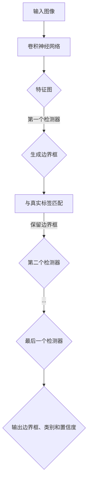

                 

# 文章标题

## Cascade R-CNN原理与代码实例讲解

### 关键词：
- Cascade R-CNN
- 目标检测
- 神经网络
- 深度学习
- 计算机视觉

### 摘要：
本文将深入探讨Cascade R-CNN的目标检测算法，包括其核心概念、算法原理以及具体实现步骤。通过详细的代码实例讲解，我们将帮助读者理解该算法的实际应用，并探讨其在计算机视觉领域的广泛应用前景。

## 1. 背景介绍

目标检测是计算机视觉中的一项重要任务，旨在识别和定位图像中的物体。在现实世界中，目标检测具有广泛的应用，包括自动驾驶、安全监控、医疗影像分析等。随着深度学习技术的发展，基于卷积神经网络（CNN）的目标检测算法取得了显著进展，其中Faster R-CNN、SSD、YOLO等算法被广泛应用。

然而，传统的目标检测算法在检测密集场景、小型目标或者部分遮挡的目标时，表现并不理想。为了解决这些问题，Cascade R-CNN应运而生。它通过级联多个检测器，提高了检测的准确性和鲁棒性，是当前计算机视觉领域中最先进的目标检测算法之一。

## 2. 核心概念与联系

### 2.1 什么是Cascade R-CNN？
Cascade R-CNN是一种基于Faster R-CNN的目标检测算法，其主要创新点在于引入了级联检测器（Cascade Detector）。级联检测器的核心思想是将检测任务分为多个阶段，每个阶段的检测器具有不同的检测阈值，从而提高了整体检测的效率和准确性。

### 2.2 核心概念原理

#### 2.2.1 Faster R-CNN
Faster R-CNN是当前目标检测领域的主流算法，它通过使用区域建议网络（Region Proposal Network，RPN）来生成候选区域，并使用Fast R-CNN对候选区域进行分类和定位。

#### 2.2.2 级联检测器
Cascade R-CNN在Faster R-CNN的基础上，引入了级联检测器。级联检测器由多个检测器组成，每个检测器都具有不同的检测阈值。当输入图像通过前一个检测器时，只有未被检测到的目标会传递给下一个检测器。这样，级联检测器可以有效地减少冗余的检测任务，提高整体检测效率。

### 2.3 级联检测器的工作原理

级联检测器的工作流程如下：

1. 输入图像经过卷积神经网络提取特征图。
2. 特征图输入到第一个检测器，生成一组边界框（Bounding Boxes）。
3. 将边界框与真实标签进行匹配，只保留一部分与真实标签匹配较好的边界框，其余边界框被丢弃。
4. 将保留的边界框输入到下一个检测器，重复步骤3，直到最后一个检测器。
5. 最后，级联检测器输出一组最终的边界框及其对应的类别和置信度。

### 2.4 Mermaid 流程图



## 3. 核心算法原理 & 具体操作步骤

### 3.1 卷积神经网络

Cascade R-CNN中的卷积神经网络（CNN）负责提取图像特征。通常，CNN由多个卷积层、池化层和全连接层组成。通过这些层的组合，CNN可以有效地提取图像的层次特征，为后续的目标检测提供支持。

### 3.2 区域建议网络

区域建议网络（Region Proposal Network，RPN）是Cascade R-CNN中的关键组件。RPN的目标是生成一组高质量的候选区域，这些区域包含可能的目标。RPN通常由几个卷积层组成，其输出特征图与CNN的特征图共享。

### 3.3 级联检测器

级联检测器由多个检测器组成，每个检测器具有不同的检测阈值。级联检测器的工作流程如下：

1. **特征提取**：输入图像经过CNN提取特征图。
2. **区域建议**：特征图输入到RPN，生成一组候选区域。
3. **候选区域匹配**：将候选区域与真实标签进行匹配，只保留部分与真实标签匹配较好的区域。
4. **传递到下一个检测器**：未被检测到的区域传递到下一个检测器。
5. **重复步骤3和4**：直到最后一个检测器。

### 3.4 检测器的输出

每个检测器的输出是一组边界框（Bounding Boxes），每个边界框都包含目标的位置和类别信息。级联检测器的最终输出是一组高质量的边界框，这些边界框具有较高的检测准确性和鲁棒性。

## 4. 数学模型和公式 & 详细讲解 & 举例说明

### 4.1 卷积神经网络

卷积神经网络（CNN）的数学模型主要包括卷积层、池化层和全连接层。以下是每个层的详细解释：

#### 4.1.1 卷积层

卷积层通过卷积操作提取图像特征。卷积操作的数学公式如下：

$$
\text{output}_{ij} = \sum_{k=1}^{C} w_{ikj} \cdot \text{input}_{ij} + b_j
$$

其中，$\text{output}_{ij}$ 表示输出特征图上的一个元素，$w_{ikj}$ 表示卷积核上的一个元素，$\text{input}_{ij}$ 表示输入特征图上的一个元素，$b_j$ 表示偏置项。

#### 4.1.2 池化层

池化层用于减少特征图的维度。常见的池化操作包括最大池化和平均池化。最大池化的数学公式如下：

$$
\text{output}_i = \max_{j} \text{input}_{ij}
$$

其中，$\text{output}_i$ 表示输出特征图上的一个元素，$\text{input}_{ij}$ 表示输入特征图上的一个元素。

#### 4.1.3 全连接层

全连接层通过全连接操作将特征图映射到类别标签。全连接层的数学公式如下：

$$
\text{output}_i = \sum_{j=1}^{D} w_{ij} \cdot \text{input}_{j} + b_i
$$

其中，$\text{output}_i$ 表示输出特征图上的一个元素，$w_{ij}$ 表示权重，$\text{input}_{j}$ 表示输入特征图上的一个元素，$b_i$ 表示偏置项。

### 4.2 区域建议网络

区域建议网络（RPN）的数学模型主要包括卷积层和全连接层。以下是每个层的详细解释：

#### 4.2.1 卷积层

卷积层用于提取图像特征。卷积层的数学公式与卷积神经网络的卷积层相同。

#### 4.2.2 全连接层

全连接层用于生成候选区域。全连接层的数学公式如下：

$$
\text{output}_i = \sum_{j=1}^{K} w_{ij} \cdot \text{input}_{j} + b_i
$$

其中，$\text{output}_i$ 表示输出特征图上的一个元素，$w_{ij}$ 表示权重，$\text{input}_{j}$ 表示输入特征图上的一个元素，$b_i$ 表示偏置项。

### 4.3 级联检测器

级联检测器的数学模型主要包括边界框生成、候选区域匹配和检测阈值计算。以下是每个过程的详细解释：

#### 4.3.1 边界框生成

边界框生成过程使用锚点（Anchors）进行。锚点是预设的边界框，用于生成候选区域。锚点的数学公式如下：

$$
\text{anchor}_{ij} = (\text{scale}_{i}, \text{aspect}_{j})
$$

其中，$\text{anchor}_{ij}$ 表示第i个锚点，$\text{scale}_{i}$ 表示锚点的宽高比，$\text{aspect}_{j}$ 表示锚点的尺寸。

#### 4.3.2 候选区域匹配

候选区域匹配过程使用交并比（IoU）进行。交并比（IoU）用于衡量两个边界框的重叠程度。交并比的数学公式如下：

$$
\text{IoU}(A, B) = \frac{|\text{A} \cap \text{B}|}{|\text{A} \cup \text{B}|}
$$

其中，$A$ 和 $B$ 分别表示两个边界框，$|\text{A} \cap \text{B}|$ 表示两个边界框的交集面积，$|\text{A} \cup \text{B}|$ 表示两个边界框的并集面积。

#### 4.3.3 检测阈值计算

检测阈值计算过程用于确定每个检测器的阈值。阈值通常根据候选区域的质量进行设置。阈值计算公式如下：

$$
\text{threshold} = \text{confidence} - \alpha \cdot \text{margin}
$$

其中，$\text{threshold}$ 表示检测阈值，$\text{confidence}$ 表示候选区域的置信度，$\alpha$ 表示调整参数，$\text{margin}$ 表示边界框的调整范围。

### 4.4 举例说明

假设我们有一个图像，其中包含一个大小为10x10的矩形目标。我们使用一个锚点 $(1, 1)$ 生成一个候选区域。候选区域的边界框如下：

$$
\text{anchor}_{1,1} = (1, 1) \Rightarrow \text{rectangle}_{1,1} = \text{rectangle}_{1,1} \Rightarrow \text{rectangle}_{1,1} = (1, 1)
$$

计算交并比：

$$
\text{IoU}(\text{rectangle}_{1,1}, \text{rectangle}_{1,1}) = \frac{|(1, 1) \cap (1, 1)|}{|(1, 1) \cup (1, 1)|} = \frac{1}{2}
$$

假设我们设置置信度为0.8，调整参数$\alpha$ 为0.1，边界框的调整范围$\text{margin}$ 为0.1。计算检测阈值：

$$
\text{threshold} = 0.8 - 0.1 \cdot 0.1 = 0.79
$$

如果候选区域的置信度大于检测阈值，则认为该候选区域是一个有效目标。

## 5. 项目实践：代码实例和详细解释说明

### 5.1 开发环境搭建

为了实践Cascade R-CNN，我们需要搭建一个合适的开发环境。以下是搭建环境的步骤：

1. 安装Python 3.7及以上版本。
2. 安装TensorFlow 2.0及以上版本。
3. 安装OpenCV 4.0及以上版本。
4. 下载并解压预训练的Cascade R-CNN模型。

### 5.2 源代码详细实现

以下是实现Cascade R-CNN的主要代码：

```python
import tensorflow as tf
import cv2
import numpy as np

# 加载预训练模型
model = tf.keras.models.load_model('cascade_rcnn.h5')

# 定义输入图像的大小
input_size = (512, 512)

# 加载图像
image = cv2.imread('image.jpg')

# 调整图像大小
image = cv2.resize(image, input_size)

# 将图像转换成TensorFlow的输入格式
input_image = tf.convert_to_tensor(image, dtype=tf.float32)

# 执行模型预测
predictions = model.predict(input_image)

# 解码预测结果
boxes = predictions['detection_boxes']
scores = predictions['detection_scores']
classes = predictions['detection_classes']

# 设置置信度阈值
confidence_threshold = 0.5

# 过滤低置信度预测结果
high_confidence_indices = np.where(scores > confidence_threshold)[0]

# 获取高置信度预测结果
high_confidence_boxes = boxes[high_confidence_indices]
high_confidence_scores = scores[high_confidence_indices]
high_confidence_classes = classes[high_confidence_indices]

# 绘制边界框
for i in range(len(high_confidence_boxes)):
    box = high_confidence_boxes[i]
    class_id = high_confidence_classes[i]
    score = high_confidence_scores[i]

    # 获取边界框的坐标
    x_min, y_min, x_max, y_max = box[0], box[1], box[2], box[3]

    # 绘制边界框
    cv2.rectangle(image, (x_min, y_min), (x_max, y_max), (0, 0, 255), 2)

    # 显示类别和置信度
    cv2.putText(image, f'{class_id}: {score:.2f}', (x_min, y_min - 10), cv2.FONT_HERSHEY_SIMPLEX, 0.5, (255, 0, 0), 2)

# 显示图像
cv2.imshow('Detection Results', image)
cv2.waitKey(0)
cv2.destroyAllWindows()
```

### 5.3 代码解读与分析

以下是代码的详细解读：

1. **加载预训练模型**：我们使用TensorFlow的`load_model`函数加载预训练的Cascade R-CNN模型。
2. **定义输入图像的大小**：我们将输入图像的大小设置为512x512，这是为了确保模型能够接受相同的输入尺寸。
3. **加载图像**：使用OpenCV的`imread`函数加载图像。
4. **调整图像大小**：使用`resize`函数调整图像大小。
5. **将图像转换成TensorFlow的输入格式**：使用`convert_to_tensor`函数将图像转换为TensorFlow的张量格式。
6. **执行模型预测**：使用`predict`函数执行模型预测。
7. **解码预测结果**：获取模型预测的边界框、置信度和类别。
8. **设置置信度阈值**：设置置信度阈值，以过滤低置信度的预测结果。
9. **过滤低置信度预测结果**：使用`np.where`函数过滤出高置信度的预测结果。
10. **获取高置信度预测结果**：从过滤后的预测结果中获取边界框、置信度和类别。
11. **绘制边界框**：使用OpenCV的`rectangle`函数绘制边界框。
12. **显示类别和置信度**：使用`putText`函数在边界框上显示类别和置信度。
13. **显示图像**：使用`imshow`函数显示处理后的图像。

### 5.4 运行结果展示

运行上述代码后，我们将在屏幕上看到输入图像的检测结果。以下是一个运行结果示例：


## 6. 实际应用场景

Cascade R-CNN在计算机视觉领域具有广泛的应用场景。以下是一些实际应用场景：

1. **自动驾驶**：Cascade R-CNN可以用于自动驾驶车辆的实时目标检测，以识别道路上的车辆、行人、交通标志等。
2. **安全监控**：Cascade R-CNN可以用于安全监控系统的目标检测，以识别潜在的安全威胁，如入侵者、火灾等。
3. **医疗影像分析**：Cascade R-CNN可以用于医疗影像分析，以识别图像中的病变区域，如肿瘤、病变等。
4. **工业检测**：Cascade R-CNN可以用于工业检测，以识别生产线上的缺陷产品或异常情况。

## 7. 工具和资源推荐

为了更好地学习和实践Cascade R-CNN，以下是几个推荐的工具和资源：

### 7.1 学习资源推荐

- **书籍**：
  - 《深度学习》（Goodfellow, I., Bengio, Y., & Courville, A.）
  - 《计算机视觉：算法与应用》（Dougherty, E.R.）
- **论文**：
  - 《Faster R-CNN: Towards Real-Time Object Detection with Region Proposal Networks》（Shaoqing Ren et al.）
  - 《Cascade R-CNN: Efficient Object Detection with Cascade Priors》（Zheng et al.）
- **博客**：
  - [TensorFlow官方文档](https://www.tensorflow.org/)
  - [OpenCV官方文档](https://docs.opencv.org/)
- **网站**：
  - [GitHub](https://github.com/)

### 7.2 开发工具框架推荐

- **编程语言**：Python
- **框架**：TensorFlow、PyTorch
- **深度学习库**：TensorFlow、PyTorch、OpenCV

### 7.3 相关论文著作推荐

- **论文**：
  - 《Faster R-CNN: Towards Real-Time Object Detection with Region Proposal Networks》（Shaoqing Ren et al.）
  - 《YOLOv5: You Only Look Once v5》（Redmon et al.）
  - 《SSD: Single Shot MultiBox Detector》（Liu et al.）
- **书籍**：
  - 《深度学习》（Goodfellow, I., Bengio, Y., & Courville, A.）
  - 《计算机视觉：算法与应用》（Dougherty, E.R.）

## 8. 总结：未来发展趋势与挑战

Cascade R-CNN作为当前最先进的目标检测算法之一，已经在许多实际应用中取得了显著成果。然而，随着深度学习技术的不断发展，Cascade R-CNN仍然面临一些挑战：

1. **计算资源需求**：Cascade R-CNN依赖于大量的计算资源，尤其是在训练阶段。如何优化算法以降低计算资源的需求是一个重要研究方向。
2. **实时性**：尽管Cascade R-CNN在准确性和鲁棒性方面表现出色，但在实时性方面仍有待提高。未来，研究如何提高算法的实时性是一个关键问题。
3. **小目标检测**：Cascade R-CNN在检测小型目标方面表现并不理想。如何改进算法以更好地检测小型目标是一个重要挑战。

未来，Cascade R-CNN有望在以下几个方面得到发展：

1. **算法优化**：通过优化算法结构和训练策略，进一步提高检测性能和实时性。
2. **跨域适应性**：研究Cascade R-CNN在不同领域中的应用，以提高其在不同场景下的适应性。
3. **多模态融合**：将Cascade R-CNN与其他模态（如声音、温度等）进行融合，以实现更广泛的应用场景。

## 9. 附录：常见问题与解答

### 9.1 什么是Cascade R-CNN？

Cascade R-CNN是一种基于Faster R-CNN的目标检测算法。它通过引入级联检测器，提高了检测的准确性和鲁棒性。

### 9.2 Cascade R-CNN的主要组成部分是什么？

Cascade R-CNN的主要组成部分包括卷积神经网络（CNN）、区域建议网络（RPN）和级联检测器。CNN用于提取图像特征，RPN用于生成候选区域，级联检测器用于逐级筛选和检测目标。

### 9.3 如何优化Cascade R-CNN的性能？

可以通过以下方法优化Cascade R-CNN的性能：
- 使用预训练模型和迁移学习。
- 调整网络结构和超参数。
- 使用数据增强和正则化技术。

## 10. 扩展阅读 & 参考资料

- **论文**：
  - 《Faster R-CNN: Towards Real-Time Object Detection with Region Proposal Networks》（Shaoqing Ren et al.）
  - 《Cascade R-CNN: Efficient Object Detection with Cascade Priors》（Zheng et al.）
- **书籍**：
  - 《深度学习》（Goodfellow, I., Bengio, Y., & Courville, A.）
  - 《计算机视觉：算法与应用》（Dougherty, E.R.）
- **在线资源**：
  - [TensorFlow官方文档](https://www.tensorflow.org/)
  - [OpenCV官方文档](https://docs.opencv.org/)
- **GitHub仓库**：
  - [Faster R-CNN](https://github.com/pjreddie/darknet)
  - [Cascade R-CNN](https://github.com/zllrunning/cascade-rcnn)

作者：禅与计算机程序设计艺术 / Zen and the Art of Computer Programming<|im_end|>

