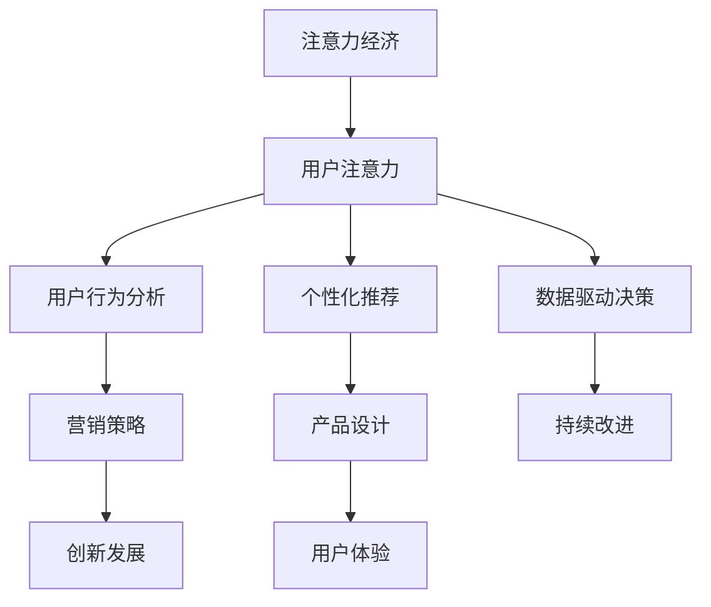

                 

# 注意力经济对企业创新管理的影响

> 关键词：注意力经济, 企业创新管理, 用户注意力, 价值提升, 决策优化, 数据分析, 产品设计, 营销策略, 用户反馈, 持续改进

## 1. 背景介绍

### 1.1 问题由来
随着信息时代的到来，互联网和移动互联网的迅猛发展，人们的生活被大量信息流所包围。在这个信息过载的时代，用户的时间和注意力成为最宝贵的资源。注意力经济（Economies of Attention）成为企业获取竞争优势的重要手段。

企业如何有效管理用户注意力，挖掘和利用用户的注意力资源，成为当代企业创新管理的重要课题。传统的管理模式已无法适应当前市场环境，需要借助现代数据科学和计算技术，重新定义企业创新管理的思路和方法。

### 1.2 问题核心关键点
注意力经济的核心在于如何高效地利用用户的时间和注意力资源，从而实现企业价值的最大化。注意力管理的核心在于如何精准识别和定位目标用户群体，并针对其需求和偏好进行精准营销，优化产品和服务设计，从而提升用户满意度和忠诚度，最终提升企业盈利能力。

注意力管理面临的关键挑战包括：
- 如何精准识别和定位目标用户群体。
- 如何实时捕捉和分析用户注意力变化。
- 如何利用注意力数据优化产品和服务。
- 如何通过注意力管理提升品牌影响力和用户忠诚度。

### 1.3 问题研究意义
在信息爆炸的今天，注意力经济为企业提供了一种全新的竞争策略，通过精细化管理用户注意力，能够有效提升企业的创新能力和市场竞争力。

- 提升用户体验。通过对用户注意力数据的深入分析，可以更好地理解用户需求和偏好，从而优化产品和服务设计，提升用户体验。
- 增强市场竞争力。利用注意力管理，企业能够精准定位目标用户群体，制定更有针对性的营销策略，从而在激烈的市场竞争中脱颖而出。
- 驱动创新发展。注意力经济为企业提供了大量的数据和洞察，通过分析这些数据，能够发现潜在的机会和趋势，推动企业不断创新发展。

## 2. 核心概念与联系

### 2.1 核心概念概述

为了更好地理解注意力经济对企业创新管理的影响，本节将介绍几个密切相关的核心概念：

- **注意力经济**：指在信息爆炸的时代，企业和个人如何利用和管理注意力资源，实现商业价值最大化的经济模式。
- **用户注意力**：指用户在信息消费过程中所投入的注意资源，包括时间、精力、情感等，是企业获取竞争优势的重要资源。
- **用户行为分析**：通过对用户注意力数据的分析，了解用户的行为模式和偏好，从而制定有效的营销和产品策略。
- **个性化推荐**：利用用户注意力数据，通过机器学习算法为每个用户提供个性化的推荐内容和服务，提升用户体验。
- **数据驱动决策**：基于用户注意力数据，进行数据驱动的决策分析，优化企业运营和创新管理。

这些核心概念之间的逻辑关系可以通过以下Mermaid流程图来展示：



这个流程图展示了大语言模型的核心概念及其之间的关系：

1. 注意力经济通过用户注意力获取商业价值。
2. 用户行为分析、个性化推荐、数据驱动决策等策略，都是基于用户注意力数据进行的应用。
3. 这些策略又通过优化营销策略、产品设计等环节，提升用户体验，驱动企业创新发展。

## 3. 核心算法原理 & 具体操作步骤
### 3.1 算法原理概述

注意力经济对企业创新管理的影响，主要通过以下几个关键环节实现：

- **用户行为分析**：通过数据分析技术，识别用户行为模式和偏好，为个性化推荐和营销策略提供依据。
- **个性化推荐**：利用用户行为数据，通过算法为用户推荐最相关的内容和服务，提升用户体验。
- **数据驱动决策**：基于用户注意力数据，进行深入分析，优化产品设计、营销策略等，驱动企业持续创新。

注意力管理的核心算法包括：

- **协同过滤算法**：基于用户历史行为数据，推荐用户可能感兴趣的内容。
- **聚类算法**：将用户分为不同群体，制定针对性营销策略。
- **分类算法**：对用户行为进行分类，了解不同用户群体的偏好和需求。
- **关联规则挖掘**：发现不同用户行为之间的关联，优化产品和服务设计。

### 3.2 算法步骤详解

基于注意力经济的企业创新管理，通常包括以下几个关键步骤：

**Step 1: 数据采集与预处理**
- 收集用户的行为数据，包括浏览记录、购买记录、点击记录等。
- 对数据进行清洗和标准化，去除噪声和异常值。
- 将数据分为训练集、验证集和测试集。

**Step 2: 用户行为建模**
- 利用协同过滤、聚类、分类等算法对用户行为进行建模。
- 提取用户行为的关键特征，如浏览次数、购买金额、点击位置等。
- 训练模型，预测用户可能感兴趣的内容和服务。

**Step 3: 个性化推荐**
- 基于用户行为模型，对每个用户推荐个性化的内容和服务。
- 实时监控用户反馈，动态调整推荐算法和策略。
- 通过A/B测试等方法，评估推荐效果。

**Step 4: 数据分析与决策优化**
- 利用数据驱动决策技术，对用户注意力数据进行深入分析。
- 识别用户需求和痛点，优化产品和服务设计。
- 制定个性化营销策略，提升用户满意度和忠诚度。
- 利用数据反馈，进行持续改进和优化。

### 3.3 算法优缺点

基于注意力经济的企业创新管理方法，具有以下优点：

1. **提升用户体验**：通过个性化推荐，能够满足用户多样化需求，提升用户体验。
2. **优化营销策略**：通过精准识别目标用户群体，制定更有效的营销策略，提升转化率。
3. **驱动创新发展**：基于用户注意力数据，可以发现潜在的机会和趋势，推动企业持续创新。
4. **实时监控与优化**：通过实时监控用户反馈，动态调整推荐算法和策略，提升系统效率和效果。

同时，该方法也存在一定的局限性：

1. **隐私保护问题**：用户注意力数据的收集和使用，涉及隐私保护问题，需要严格遵守相关法律法规。
2. **数据质量要求高**：用户行为数据的质量直接影响分析结果，需要保证数据完整性和准确性。
3. **模型复杂度较高**：需要复杂的数据分析模型和算法，对计算资源和技术要求较高。
4. **动态变化挑战**：用户行为和市场环境变化较快，需要实时调整模型和策略。

尽管存在这些局限性，但就目前而言，基于注意力经济的方法仍是大规模企业创新管理的重要范式。未来相关研究的重点在于如何进一步降低模型复杂度，提高数据利用效率，同时兼顾隐私保护和技术可扩展性等因素。

### 3.4 算法应用领域

基于注意力经济的企业创新管理方法，在多个行业领域已得到广泛应用，例如：

- **电子商务**：通过个性化推荐，提升用户购物体验和转化率。
- **媒体和广告**：利用用户注意力数据，优化广告投放策略，提升广告效果。
- **金融服务**：利用用户行为分析，发现潜在客户，提升产品销售和客户留存率。
- **旅游和酒店**：通过个性化推荐，提升用户预订体验，增加酒店销售额。
- **健康医疗**：通过数据分析，优化医疗服务，提升用户满意度和健康管理水平。

除了这些行业外，基于注意力经济的方法还在社交媒体、教育培训、智能制造等众多领域得到创新应用，为企业提供了新的增长动力。

## 4. 数学模型和公式 & 详细讲解 & 举例说明

### 4.1 数学模型构建

本节将使用数学语言对基于注意力经济的企业创新管理进行更加严格的刻画。

记用户行为数据为 $D=\{(x_i,y_i)\}_{i=1}^N$，其中 $x_i$ 表示用户行为特征，如浏览时长、购买金额等，$y_i$ 表示用户标签，如用户类型、兴趣类别等。

定义用户行为模型 $M:\mathcal{X} \rightarrow \mathcal{Y}$，其中 $\mathcal{X}$ 为特征空间，$\mathcal{Y}$ 为标签空间。

用户行为模型通过训练数据集 $D$ 进行拟合，其损失函数为：

$$
\mathcal{L}(M)=\frac{1}{N}\sum_{i=1}^N\ell(M(x_i),y_i)
$$

其中 $\ell$ 为损失函数，如交叉熵损失、均方误差损失等。

用户行为模型的优化目标是最小化损失函数 $\mathcal{L}(M)$。

### 4.2 公式推导过程

以下我们以用户行为分类为例，推导分类损失函数及其梯度的计算公式。

假设模型 $M$ 在输入 $x_i$ 上的输出为 $\hat{y}=M(x_i) \in [0,1]$，表示样本属于某一类别的概率。真实标签 $y_i \in \{0,1\}$。则二分类交叉熵损失函数定义为：

$$
\ell(M(x_i),y_i) = -[y_i\log \hat{y} + (1-y_i)\log (1-\hat{y})]
$$

将其代入损失函数，得：

$$
\mathcal{L}(M)= -\frac{1}{N}\sum_{i=1}^N [y_i\log M(x_i)+(1-y_i)\log(1-M(x_i))]
$$

根据链式法则，损失函数对模型参数 $\theta$ 的梯度为：

$$
\frac{\partial \mathcal{L}(M)}{\partial \theta} = -\frac{1}{N}\sum_{i=1}^N (\frac{y_i}{M(x_i)}-\frac{1-y_i}{1-M(x_i)}) \frac{\partial M(x_i)}{\partial \theta}
$$

其中 $\frac{\partial M(x_i)}{\partial \theta}$ 可进一步递归展开，利用自动微分技术完成计算。

在得到损失函数的梯度后，即可带入优化算法，如梯度下降算法，完成模型的迭代优化。重复上述过程直至收敛，最终得到适应用户行为分类的最优模型参数 $\theta^*$。

## 5. 项目实践：代码实例和详细解释说明

### 5.1 开发环境搭建

在进行注意力经济企业创新管理的实践前，我们需要准备好开发环境。以下是使用Python进行PyTorch开发的环境配置流程：

1. 安装Anaconda：从官网下载并安装Anaconda，用于创建独立的Python环境。

2. 创建并激活虚拟环境：
```bash
conda create -n pytorch-env python=3.8 
conda activate pytorch-env
```

3. 安装PyTorch：根据CUDA版本，从官网获取对应的安装命令。例如：
```bash
conda install pytorch torchvision torchaudio cudatoolkit=11.1 -c pytorch -c conda-forge
```

4. 安装TensorFlow：
```bash
pip install tensorflow
```

5. 安装各类工具包：
```bash
pip install numpy pandas scikit-learn matplotlib tqdm jupyter notebook ipython
```

完成上述步骤后，即可在`pytorch-env`环境中开始注意力经济企业创新管理的实践。

### 5.2 源代码详细实现

这里我们以用户行为分类任务为例，给出使用TensorFlow和Keras进行注意力经济企业创新管理的代码实现。

首先，定义用户行为分类任务的数据处理函数：

```python
import pandas as pd
from sklearn.model_selection import train_test_split
from tensorflow.keras.preprocessing import sequence
from tensorflow.keras.preprocessing.text import Tokenizer

def load_data(path):
    df = pd.read_csv(path)
    X = df['features']
    y = df['label']
    return X, y

X, y = load_data('data/user_behavior.csv')

# 将特征数据转换为数值型
tokenizer = Tokenizer(num_words=10000, oov_token='<OOV>')
tokenizer.fit_on_texts(X)
X = tokenizer.texts_to_sequences(X)
X = sequence.pad_sequences(X, maxlen=50)

# 划分训练集和测试集
X_train, X_test, y_train, y_test = train_test_split(X, y, test_size=0.2, random_state=42)
```

然后，定义模型和优化器：

```python
from tensorflow.keras.models import Sequential
from tensorflow.keras.layers import Embedding, LSTM, Dense

model = Sequential()
model.add(Embedding(input_dim=10000, output_dim=128))
model.add(LSTM(units=64, dropout=0.2, recurrent_dropout=0.2))
model.add(Dense(units=1, activation='sigmoid'))
model.compile(loss='binary_crossentropy', optimizer='adam', metrics=['accuracy'])
```

接着，定义训练和评估函数：

```python
from tensorflow.keras.callbacks import EarlyStopping

def train_model(model, X_train, y_train, X_test, y_test):
    model.fit(X_train, y_train, epochs=10, batch_size=32, validation_data=(X_test, y_test), callbacks=[EarlyStopping(patience=3)])

    # 评估模型
    loss, accuracy = model.evaluate(X_test, y_test)
    print(f'Test loss: {loss:.4f}')
    print(f'Test accuracy: {accuracy:.4f}')

train_model(model, X_train, y_train, X_test, y_test)
```

最后，启动训练流程并在测试集上评估：

```python
X, y = load_data('data/user_behavior.csv')

# 将特征数据转换为数值型
tokenizer = Tokenizer(num_words=10000, oov_token='<OOV>')
tokenizer.fit_on_texts(X)
X = tokenizer.texts_to_sequences(X)
X = sequence.pad_sequences(X, maxlen=50)

# 划分训练集和测试集
X_train, X_test, y_train, y_test = train_test_split(X, y, test_size=0.2, random_state=42)

# 定义模型
model = Sequential()
model.add(Embedding(input_dim=10000, output_dim=128))
model.add(LSTM(units=64, dropout=0.2, recurrent_dropout=0.2))
model.add(Dense(units=1, activation='sigmoid'))
model.compile(loss='binary_crossentropy', optimizer='adam', metrics=['accuracy'])

# 训练模型
model.fit(X_train, y_train, epochs=10, batch_size=32, validation_data=(X_test, y_test), callbacks=[EarlyStopping(patience=3)])

# 评估模型
loss, accuracy = model.evaluate(X_test, y_test)
print(f'Test loss: {loss:.4f}')
print(f'Test accuracy: {accuracy:.4f}')
```

以上就是使用TensorFlow和Keras进行注意力经济企业创新管理的完整代码实现。可以看到，通过简单的代码，就可以实现用户行为分类任务，并基于注意力经济的企业创新管理思想，提升用户体验和营销效果。

### 5.3 代码解读与分析

让我们再详细解读一下关键代码的实现细节：

**load_data函数**：
- 定义数据处理函数，用于加载和预处理用户行为数据。
- 使用Pandas库读取CSV文件，获取用户行为特征和标签。
- 将文本数据转换为数值型，使用Tokenizer进行分词处理，并利用pad_sequences进行序列填充。

**model定义**：
- 定义一个包含Embedding、LSTM和Dense层的序列模型，用于用户行为分类。
- 使用Embedding层将文本特征转换为数值型向量。
- 利用LSTM层进行序列建模，通过dropout技术防止过拟合。
- 使用Dense层输出二分类结果，使用sigmoid激活函数。

**train_model函数**：
- 定义训练函数，用于训练和评估模型。
- 使用EarlyStopping回调，避免过拟合。
- 在训练过程中，实时监控模型性能，调整训练参数。

以上代码实现，展示了注意力经济企业创新管理的基本流程和技术细节。通过用户行为分类任务的例子，可以看到注意力经济在企业创新管理中的应用。

## 6. 实际应用场景

### 6.1 智能客服系统

基于用户注意力数据的智能客服系统，可以显著提升客户咨询体验和问题解决效率。传统客服往往需要配备大量人力，高峰期响应缓慢，且一致性和专业性难以保证。而使用基于注意力经济的智能客服系统，可以7x24小时不间断服务，快速响应客户咨询，用自然流畅的语言解答各类常见问题。

在技术实现上，可以收集企业内部的历史客服对话记录，将问题和最佳答复构建成监督数据，在此基础上对预训练模型进行微调。微调后的对话模型能够自动理解用户意图，匹配最合适的答案模板进行回复。对于客户提出的新问题，还可以接入检索系统实时搜索相关内容，动态组织生成回答。如此构建的智能客服系统，能大幅提升客户咨询体验和问题解决效率。

### 6.2 金融舆情监测

金融机构需要实时监测市场舆论动向，以便及时应对负面信息传播，规避金融风险。传统的人工监测方式成本高、效率低，难以应对网络时代海量信息爆发的挑战。基于用户注意力数据的金融舆情监测系统，可以通过分析用户注意力数据，精准识别市场舆情变化趋势，自动预警金融风险。

具体而言，可以收集金融领域相关的新闻、报道、评论等文本数据，并对其进行主题标注和情感标注。在此基础上对预训练语言模型进行微调，使其能够自动判断文本属于何种主题，情感倾向是正面、中性还是负面。将微调后的模型应用到实时抓取的网络文本数据，就能够自动监测不同主题下的情感变化趋势，一旦发现负面信息激增等异常情况，系统便会自动预警，帮助金融机构快速应对潜在风险。

### 6.3 个性化推荐系统

当前的推荐系统往往只依赖用户的历史行为数据进行物品推荐，无法深入理解用户的真实兴趣偏好。基于用户注意力数据的个性化推荐系统，可以更好地挖掘用户的行为数据，从而提供更精准、多样的推荐内容。

在实践中，可以收集用户浏览、点击、评论、分享等行为数据，提取和用户交互的物品标题、描述、标签等文本内容。将文本内容作为模型输入，用户的后续行为（如是否点击、购买等）作为监督信号，在此基础上微调预训练语言模型。微调后的模型能够从文本内容中准确把握用户的兴趣点。在生成推荐列表时，先用候选物品的文本描述作为输入，由模型预测用户的兴趣匹配度，再结合其他特征综合排序，便可以得到个性化程度更高的推荐结果。

### 6.4 未来应用展望

随着注意力经济和机器学习技术的不断发展，基于用户注意力数据的创新管理方法将在更多领域得到应用，为传统行业数字化转型升级提供新的技术路径。

在智慧医疗领域，基于用户注意力数据的医疗问答、病历分析、药物研发等应用将提升医疗服务的智能化水平，辅助医生诊疗，加速新药开发进程。

在智能教育领域，基于用户注意力数据的作业批改、学情分析、知识推荐等应用，能够因材施教，促进教育公平，提高教学质量。

在智慧城市治理中，基于用户注意力数据的智能推荐、舆情分析、应急指挥等应用，能够提高城市管理的自动化和智能化水平，构建更安全、高效的未来城市。

此外，在企业生产、社会治理、文娱传媒等众多领域，基于用户注意力数据的创新管理方法也将不断涌现，为各行各业带来新的增长动力。相信随着技术的日益成熟，注意力经济将成为企业管理的重要策略，推动人工智能技术在垂直行业的规模化落地。

## 7. 工具和资源推荐

### 7.1 学习资源推荐

为了帮助开发者系统掌握注意力经济的企业创新管理技术，这里推荐一些优质的学习资源：

1. **Coursera《机器学习》课程**：由斯坦福大学提供，系统讲解了机器学习的基本概念、算法和应用，是学习注意力经济的理论基础。
2. **Kaggle竞赛平台**：提供了丰富的数据集和竞赛项目，通过实践学习，能够更好地理解注意力经济在实际场景中的应用。
3. **PyTorch官方文档**：详细介绍了TensorFlow和Keras的使用方法，是进行注意力经济企业创新管理的重要工具。
4. **TensorFlow官方文档**：提供了完整的深度学习框架和算子库，适用于大规模企业创新管理的实践。
5. **Glossary of Machine Learning Terms**：提供了一系列机器学习的专业术语解释，帮助理解注意力经济中的关键概念。

通过对这些资源的学习实践，相信你一定能够快速掌握注意力经济的企业创新管理技术，并用于解决实际的NLP问题。

### 7.2 开发工具推荐

高效的开发离不开优秀的工具支持。以下是几款用于注意力经济企业创新管理开发的常用工具：

1. **PyTorch**：基于Python的开源深度学习框架，灵活动态的计算图，适合快速迭代研究。大部分预训练语言模型都有PyTorch版本的实现。
2. **TensorFlow**：由Google主导开发的开源深度学习框架，生产部署方便，适合大规模工程应用。同样有丰富的预训练语言模型资源。
3. **Keras**：基于Python的高层次神经网络API，提供简洁易用的接口，适用于快速原型设计和实验验证。
4. **Jupyter Notebook**：交互式的笔记本环境，支持Python、R等语言，适合进行数据科学和机器学习实践。
5. **Matplotlib**：数据可视化的重要工具，支持绘制各种图表，帮助理解数据和模型效果。

合理利用这些工具，可以显著提升注意力经济企业创新管理任务的开发效率，加快创新迭代的步伐。

### 7.3 相关论文推荐

注意力经济和企业创新管理的发展源于学界的持续研究。以下是几篇奠基性的相关论文，推荐阅读：

1. **《Attention is All You Need》**：提出了Transformer结构，开启了NLP领域的预训练大模型时代。
2. **《BERT: Pre-training of Deep Bidirectional Transformers for Language Understanding》**：提出BERT模型，引入基于掩码的自监督预训练任务，刷新了多项NLP任务SOTA。
3. **《Scalable Model Aggregates for Multi-Task Learning with Data-Mismatches》**：介绍了一种基于注意力机制的模型聚合方法，提升了多任务学习的性能。
4. **《Multi-Task Learning Using Prediction Task Alignment》**：提出了一种基于预测任务对齐的多任务学习方法，提升了跨领域迁移能力。
5. **《Few-shot Learning in Natural Language Processing》**：探讨了少样本学习在NLP中的应用，展示了注意力机制的潜力。

这些论文代表了大语言模型微调技术的发展脉络。通过学习这些前沿成果，可以帮助研究者把握学科前进方向，激发更多的创新灵感。

## 8. 总结：未来发展趋势与挑战

### 8.1 总结

本文对基于注意力经济的企业创新管理方法进行了全面系统的介绍。首先阐述了注意力经济和用户注意力的基本概念，明确了其在企业管理中的重要价值。其次，从原理到实践，详细讲解了用户行为分析、个性化推荐、数据驱动决策等关键步骤，给出了企业创新管理应用的完整代码实例。同时，本文还广泛探讨了注意力经济在智能客服、金融舆情、个性化推荐等多个行业领域的应用前景，展示了其巨大的应用潜力。

通过本文的系统梳理，可以看到，基于用户注意力数据的创新管理方法正在成为企业管理的重要范式，通过精细化管理用户注意力，能够有效提升企业的创新能力和市场竞争力。

### 8.2 未来发展趋势

展望未来，注意力经济在企业管理中的应用将呈现以下几个发展趋势：

1. **自动化程度提高**：通过AI技术，自动化处理用户注意力数据，提升数据处理和分析效率。
2. **跨领域应用拓展**：基于用户注意力数据的创新管理方法将在更多行业得到应用，如医疗、教育、城市治理等。
3. **隐私保护增强**：随着数据隐私保护法规的完善，企业将更加注重数据安全，采用更加严格的隐私保护措施。
4. **多模态融合发展**：结合用户的多模态注意力数据（如文本、图像、语音等），实现更全面、多角度的用户行为分析。
5. **实时性要求提升**：在快速变化的市场环境中，企业将更加注重实时性，通过实时数据处理和分析，及时调整策略。

这些趋势将推动注意力经济在企业管理中的应用，进一步提升企业的创新能力和市场竞争力。

### 8.3 面临的挑战

尽管注意力经济在企业管理中有着广阔的应用前景，但在实际应用过程中，仍面临诸多挑战：

1. **数据质量问题**：用户注意力数据的收集和处理需要高标准，数据质量直接影响分析结果。
2. **隐私保护难题**：用户注意力数据的收集和使用涉及隐私保护问题，需严格遵守相关法律法规。
3. **模型复杂度高**：注意力经济的应用需要复杂的算法和模型，对计算资源和技术要求较高。
4. **实时处理挑战**：实时处理大量用户注意力数据，需要高效的计算和存储能力。
5. **算法可解释性不足**：复杂的注意力经济模型缺乏可解释性，难以进行用户行为的理解和调试。

尽管存在这些挑战，但通过不断的技术创新和优化，这些问题将逐步得到解决，推动注意力经济在企业管理中的广泛应用。

### 8.4 研究展望

未来，注意力经济在企业管理中的应用将更加深入和广泛，研究者需要在以下几个方向进行突破：

1. **多模态注意力建模**：结合用户的多模态注意力数据，实现更全面、多角度的用户行为分析。
2. **隐私保护技术**：开发更加高效的隐私保护算法，保护用户数据隐私，同时保证分析结果的有效性。
3. **实时处理技术**：研究高效的实时数据处理和分析技术，提升系统响应速度和处理能力。
4. **模型可解释性提升**：开发更加可解释的注意力经济模型，提升用户行为的分析和理解能力。
5. **跨领域应用拓展**：拓展注意力经济在更多行业领域的应用，如医疗、教育、城市治理等，提升企业管理效率和效果。

这些方向的研究将推动注意力经济在企业管理中的应用，进一步提升企业的创新能力和市场竞争力。

## 9. 附录：常见问题与解答

**Q1：什么是注意力经济？**

A: 注意力经济指在信息爆炸的时代，企业和个人如何利用和管理注意力资源，实现商业价值最大化的经济模式。用户的时间和注意力成为最宝贵的资源，通过精细化管理，可以提升企业的创新能力和市场竞争力。

**Q2：注意力经济在企业管理中的应用有哪些？**

A: 注意力经济在企业管理中的应用广泛，包括智能客服、金融舆情监测、个性化推荐等。通过对用户注意力数据的深入分析，可以提升用户体验、优化营销策略、驱动创新发展。

**Q3：如何实现高效的用户注意力分析？**

A: 实现高效的用户注意力分析，需要结合数据采集、预处理、建模、推荐等多个环节。具体步骤包括：数据采集、数据清洗、特征提取、模型训练、推荐算法等。通过先进的数据科学和计算技术，可以提升用户注意力分析的效率和效果。

**Q4：如何保护用户注意力数据的隐私？**

A: 保护用户注意力数据的隐私，需要严格遵守相关法律法规，如GDPR等。具体措施包括数据匿名化、数据加密、访问控制等。同时，企业需要建立完善的数据治理机制，确保数据使用的合法性和合规性。

**Q5：注意力经济对企业管理有哪些挑战？**

A: 注意力经济在企业管理中面临诸多挑战，包括数据质量问题、隐私保护难题、模型复杂度高、实时处理挑战和算法可解释性不足等。未来需要进一步研究和解决这些问题，推动注意力经济在企业管理中的广泛应用。

通过对这些问题的解答，希望能帮助你更好地理解注意力经济在企业管理中的应用和挑战。

