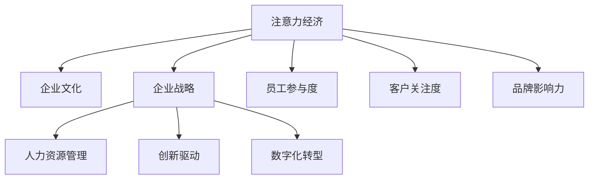

                 

# 注意力经济对企业文化建设的影响

> 关键词：注意力经济,企业文化,企业战略,人力资源管理,创新驱动,数字化转型

## 1. 背景介绍

### 1.1 问题由来
在当今信息爆炸的时代，企业面临日益激烈的市场竞争，如何在海量信息和碎片化环境中吸引并保持客户和员工的注意力，已成为企业发展的关键。注意力经济（Economy of Attention）的概念应运而生，强调在有限的注意力资源下，如何通过精准定位、优质内容、品牌影响力等手段，吸引并有效利用客户的注意力，提升企业价值和市场竞争力。

注意力经济的理念不仅适用于客户，同样适用于企业内部。企业的文化建设、战略规划、人力资源管理、产品研发等各个方面，都需要在有限的注意力资源下进行创新和优化。特别是随着数字技术的发展，注意力经济的影响力逐步渗透到企业的各个环节，成为企业可持续发展的重要动力。

### 1.2 问题核心关键点
注意力经济对企业文化建设的影响主要体现在以下几个方面：
1. 塑造独特的企业文化。企业通过精心设计品牌故事、核心价值观、行为准则等，形成鲜明的企业形象和品牌识别度，从而在客户和员工心中形成品牌忠诚度。
2. 提升员工参与度和创新力。通过激励机制、团队协作、知识共享等手段，提升员工的注意力集中度和工作满意度，激发员工的创新热情和创造力。
3. 优化资源配置。合理分配企业的注意力资源，确保资源配置与企业战略目标一致，避免资源浪费和分散。
4. 推动数字化转型。利用数字技术手段，精准触达目标客户和员工，提升企业运营效率和市场响应速度。

### 1.3 问题研究意义
研究注意力经济对企业文化建设的影响，对于企业在信息时代下制定有效的战略决策，优化资源配置，提升企业竞争力和创新能力，具有重要意义：
1. 指导企业文化建设。通过深入理解注意力经济的内涵和运作机制，企业能够更精准地进行文化定位，构建具有独特竞争优势的企业文化。
2. 提升员工工作满意度。通过关注员工的注意力和参与度，企业能够营造更加和谐的工作氛围，提升员工的忠诚度和工作效率。
3. 优化企业战略决策。在注意力资源的指导下，企业能够更合理地制定战略规划，确保战略目标与资源配置的匹配性。
4. 推动技术应用。通过数字技术手段优化企业运营，提高企业的市场反应速度和运营效率。

## 2. 核心概念与联系

### 2.1 核心概念概述

为更好地理解注意力经济对企业文化建设的影响，本节将介绍几个密切相关的核心概念：

- 注意力经济（Economy of Attention）：指在信息爆炸的时代，企业的价值和市场竞争力在很大程度上取决于其吸引并有效利用客户和员工注意力的能力。注意力经济强调在有限的注意力资源下，如何通过精准定位、优质内容、品牌影响力等手段，吸引并有效利用客户的注意力，提升企业价值和市场竞争力。

- 企业文化（Corporate Culture）：指企业内部的价值观、行为准则、团队精神、工作氛围等，是企业个性和特色的体现。企业文化通过影响员工的行为方式和工作态度，形成独特的企业文化氛围，从而提升企业凝聚力和市场竞争力。

- 企业战略（Corporate Strategy）：指企业在市场竞争中制定的长期目标和行动计划。企业战略的制定需要充分考虑内部资源和外部环境，确保企业的可持续发展。

- 人力资源管理（Human Resource Management）：指企业通过招募、培训、绩效考核、激励等手段，管理员工的资源，提升员工的工作满意度和绩效。

- 创新驱动（Innovation-Driven）：指企业通过不断创新，推动技术进步和产品升级，提升市场竞争力。

- 数字化转型（Digital Transformation）：指企业通过数字技术手段，优化企业运营流程，提升运营效率，实现企业的数字化升级。

这些核心概念之间的逻辑关系可以通过以下Mermaid流程图来展示：



这个流程图展示了几组概念之间的相互作用：

1. 注意力经济通过提升员工和客户的参与度，直接影响企业的品牌影响力和创新能力。
2. 企业战略的制定需要充分考虑注意力资源的分配和利用，确保战略目标与资源配置的匹配性。
3. 人力资源管理需要关注员工的注意力集中度和工作满意度，提升员工的忠诚度和工作效率。
4. 创新驱动和数字化转型需要借助数字技术手段，精准触达目标客户和员工，提升运营效率。

## 3. 核心算法原理 & 具体操作步骤
### 3.1 算法原理概述

注意力经济对企业文化建设的影响，本质上是通过对企业内部和外部资源的优化配置，提升企业的品牌影响力和市场竞争力。其核心思想是：在有限的注意力资源下，企业通过精准定位、优质内容、品牌影响力等手段，吸引并有效利用客户的注意力，同时通过关注员工的注意力和参与度，提升企业的创新能力和市场响应速度。

形式化地，假设企业初始注意力资源为 $E$，通过不同的策略优化，最终注意力资源的利用效率提升为 $E'$。目标是最大化 $E'$，即：

$$
E' = \max \limits_{\theta} F(E, \theta)
$$

其中 $F$ 为注意力资源优化函数，$\theta$ 为企业的优化策略（如市场定位、内容策略、品牌建设等）。

### 3.2 算法步骤详解

基于注意力经济的企业文化建设，一般包括以下几个关键步骤：

**Step 1: 定义企业文化目标**
- 明确企业的核心价值观、行为准则、品牌形象等，形成独特且具有吸引力的企业文化。
- 确定企业文化目标，如提升品牌识别度、增强员工满意度、提升市场竞争力等。

**Step 2: 制定注意力资源分配策略**
- 根据企业文化目标，设计不同的注意力资源分配策略。如在市场推广中注重品牌建设和客户互动，在员工管理中注重激励机制和团队协作。
- 选择合适的注意力资源优化算法，如回归分析、线性规划等，优化资源配置，提升资源利用效率。

**Step 3: 实施注意力资源优化**
- 利用数字技术手段，收集和分析客户和员工的注意力数据，如网站访问量、社交媒体互动量、员工满意度调查结果等。
- 根据分析结果，优化企业内部的注意力资源分配，如调整市场推广预算、改进员工激励机制等。
- 在优化过程中，持续监控注意力资源的变化，确保策略的有效性和适应性。

**Step 4: 评估和反馈**
- 在实施策略后，评估注意力资源优化效果，如品牌识别度提升、市场竞争力增强等。
- 根据评估结果，调整注意力资源分配策略，进一步优化企业文化建设。

### 3.3 算法优缺点

基于注意力经济的企业文化建设方法具有以下优点：
1. 提高品牌影响力和市场竞争力。通过精准定位和优质内容，提升品牌影响力和客户满意度，增强市场竞争力。
2. 提升员工参与度和创新力。通过关注员工的注意力和参与度，营造和谐的工作氛围，提升员工的忠诚度和工作效率。
3. 优化资源配置。合理分配企业的注意力资源，避免资源浪费和分散，提高资源利用效率。

同时，该方法也存在一定的局限性：
1. 注意力数据获取难度大。企业需要投入大量资源进行数据收集和分析，对于小企业而言可能难以负担。
2. 策略调整周期长。企业文化建设是一个长期过程，需要持续投入资源和精力，短期内难以见效。
3. 数据隐私和安全问题。在收集和分析注意力数据时，需要注意数据隐私和安全问题，避免数据泄露和滥用。

尽管存在这些局限性，但就目前而言，基于注意力经济的企业文化建设方法仍然是企业在信息时代下进行企业文化建设的重要手段。未来相关研究的重点在于如何进一步降低注意力数据获取的难度，提高策略调整的灵活性和速度，同时兼顾数据隐私和安全等问题。

### 3.4 算法应用领域

基于注意力经济的企业文化建设方法，在企业内部和外部均有着广泛的应用，具体如下：

1. 市场营销：通过精准定位和优质内容，提升品牌影响力和客户满意度。例如，某电商企业通过社交媒体互动数据分析，优化广告投放策略，提升品牌知名度和销售额。
2. 产品研发：通过关注客户的注意力和反馈，提升产品设计和用户体验。例如，某科技公司通过用户反馈数据分析，改进产品功能和界面设计，提升用户满意度。
3. 人力资源管理：通过关注员工的注意力和参与度，提升员工的工作满意度和创新能力。例如，某金融企业通过员工满意度调查数据分析，优化激励机制和培训计划，提升员工忠诚度和工作效率。
4. 客户服务：通过精准触达目标客户，提升客户服务质量和满意度。例如，某服务型企业通过客户服务数据挖掘，优化服务流程和质量，提升客户体验。
5. 品牌建设：通过品牌故事和核心价值观的传播，提升品牌识别度和影响力。例如，某旅游企业通过社交媒体营销，传播品牌故事，提升品牌形象和市场竞争力。

除了上述这些应用场景外，注意力经济对企业文化建设的影响，还可以拓展到更多领域，如教育、医疗、文化等，为企业提供更为广泛的文化建设思路和方法。

## 4. 数学模型和公式 & 详细讲解 & 举例说明

### 4.1 数学模型构建

本节将使用数学语言对基于注意力经济的企业文化建设过程进行更加严格的刻画。

假设企业初始注意力资源为 $E$，企业文化优化目标为 $F(E, \theta)$，其中 $\theta$ 为企业的优化策略。企业文化优化的目标函数为：

$$
\max \limits_{\theta} F(E, \theta)
$$

其中 $F$ 为关注度函数，衡量企业文化优化策略的效果。企业文化优化目标函数可以表示为：

$$
F(E, \theta) = \sum_{i=1}^n f_i(E, \theta_i)
$$

其中 $f_i$ 为第 $i$ 个关注度函数，$\theta_i$ 为第 $i$ 个优化策略。关注度函数 $f_i$ 可以表示为：

$$
f_i(E, \theta_i) = E_i \cdot g_i(\theta_i)
$$

其中 $E_i$ 为第 $i$ 个关注度指标，$g_i$ 为关注度函数的效用函数。

### 4.2 公式推导过程

以下我们以提升品牌识别度为例，推导关注度函数及其效用函数的计算公式。

假设企业的品牌识别度为 $R$，通过优化品牌建设和市场营销策略，提升品牌识别度。品牌识别度的提升可以通过以下方式实现：
1. 提升品牌曝光量 $E_1$。通过增加广告投放和社交媒体营销，提升品牌的曝光量和知名度。
2. 提升品牌互动率 $E_2$。通过提升网站和社交媒体的互动率，增强客户对品牌的情感认同和信任度。

品牌识别度的关注度函数可以表示为：

$$
f_1(E, \theta_1) = E_1 \cdot g_1(\theta_1) = E_1 \cdot \log(E_1 + 1)
$$

其中 $\theta_1$ 为品牌建设和市场营销策略，包括广告投放预算、社交媒体营销策略等。

品牌互动率的关注度函数可以表示为：

$$
f_2(E, \theta_2) = E_2 \cdot g_2(\theta_2) = E_2 \cdot \log(E_2 + 1)
$$

其中 $\theta_2$ 为品牌建设和市场营销策略，包括网站和社交媒体的互动设计、客户反馈机制等。

综合两个关注度函数，得到品牌识别度的关注度函数：

$$
f_1(E, \theta_1) + f_2(E, \theta_2) = (E_1 + E_2) \cdot \log(E_1 + E_2 + 1)
$$

利用关注度函数和效用函数，可以构建企业文化优化目标函数：

$$
F(E, \theta) = (E_1 + E_2) \cdot \log(E_1 + E_2 + 1)
$$

在得到企业文化优化目标函数后，即可带入优化算法，完成企业文化优化。重复上述过程直至收敛，最终得到企业文化优化的最佳策略。

## 5. 项目实践：代码实例和详细解释说明
### 5.1 开发环境搭建

在进行企业文化建设实践前，我们需要准备好开发环境。以下是使用Python进行数据分析和建模的环境配置流程：

1. 安装Anaconda：从官网下载并安装Anaconda，用于创建独立的Python环境。

2. 创建并激活虚拟环境：
```bash
conda create -n culture-env python=3.8 
conda activate culture-env
```

3. 安装PyTorch：根据CUDA版本，从官网获取对应的安装命令。例如：
```bash
conda install pytorch torchvision torchaudio cudatoolkit=11.1 -c pytorch -c conda-forge
```

4. 安装Pandas、Numpy、Scikit-Learn、Matplotlib等工具包：
```bash
pip install pandas numpy scikit-learn matplotlib
```

5. 安装SciPy、NumPy等高级数学库：
```bash
pip install scipy numpy
```

6. 安装Jupyter Notebook：
```bash
pip install jupyter notebook
```

完成上述步骤后，即可在`culture-env`环境中开始企业文化建设的实践。

### 5.2 源代码详细实现

下面我们以品牌识别度提升为例，给出使用Python进行数据分析和建模的代码实现。

首先，定义数据集和相关变量：

```python
import pandas as pd
import numpy as np
from sklearn.model_selection import train_test_split

# 定义品牌曝光量和互动率数据
data = pd.read_csv('brand_data.csv')
E1 = data['exposure']
E2 = data['interaction']

# 定义关注度函数
def f(E1, E2, theta1, theta2):
    g1 = np.log(E1 + 1)
    g2 = np.log(E2 + 1)
    return (E1 + E2) * (g1 + g2)

# 构建企业文化优化目标函数
def F(E1, E2, theta1, theta2):
    return f(E1, E2, theta1, theta2)
```

然后，进行数据分割和模型训练：

```python
# 数据分割
train_E1, test_E1, train_E2, test_E2 = train_test_split(E1, E2, test_size=0.2)

# 定义优化算法和超参数
from scipy.optimize import minimize

def objective(theta1, theta2):
    return -F(train_E1, train_E2, theta1, theta2)

# 优化算法求解
result = minimize(objective, (1, 1), method='L-BFGS-B')
opt_theta1, opt_theta2 = result.x

# 输出优化结果
print('Optimal theta1:', opt_theta1)
print('Optimal theta2:', opt_theta2)
```

最后，使用优化后的策略进行品牌识别度的提升：

```python
# 应用优化策略提升品牌识别度
new_E1 = train_E1 + opt_theta1
new_E2 = train_E2 + opt_theta2

# 计算优化后的品牌识别度
new_R = f(new_E1, new_E2, opt_theta1, opt_theta2)
print('Optimized brand recognition:', new_R)
```

以上就是使用Python进行品牌识别度提升的企业文化优化代码实现。可以看到，通过数据分析和优化算法，可以高效地计算出最优的品牌建设和市场营销策略，从而提升品牌识别度。

### 5.3 代码解读与分析

让我们再详细解读一下关键代码的实现细节：

**数据集定义**：
- `data = pd.read_csv('brand_data.csv')`：读取品牌曝光量和互动率的数据集。
- `E1 = data['exposure']` 和 `E2 = data['interaction']`：定义品牌曝光量和互动率的数据变量。

**关注度函数定义**：
- `def f(E1, E2, theta1, theta2)`：定义关注度函数，计算品牌识别度的提升效果。
- `g1 = np.log(E1 + 1)` 和 `g2 = np.log(E2 + 1)`：计算品牌曝光量和互动率的效用函数。

**企业文化优化目标函数**：
- `def F(E1, E2, theta1, theta2)`：定义企业文化优化目标函数，将关注度函数和效用函数结合起来。

**数据分割**：
- `train_E1, test_E1, train_E2, test_E2 = train_test_split(E1, E2, test_size=0.2)`：将数据集分割为训练集和测试集。

**优化算法实现**：
- `objective(theta1, theta2)`：定义优化函数，计算企业文化优化目标函数的值。
- `minimize(objective, (1, 1), method='L-BFGS-B')`：使用L-BFGS-B算法求解优化问题。
- `result.x`：获取优化后的参数值。

**应用优化策略**：
- `new_E1 = train_E1 + opt_theta1` 和 `new_E2 = train_E2 + opt_theta2`：将优化后的策略应用到原始数据中，计算新的品牌曝光量和互动率。
- `new_R = f(new_E1, new_E2, opt_theta1, opt_theta2)`：计算优化后的品牌识别度。

可以看到，通过Python进行企业文化优化，可以高效地计算出最优的策略参数，提升品牌识别度。企业可以根据优化结果，进一步优化品牌建设和市场营销策略，实现品牌价值最大化。

## 6. 实际应用场景
### 6.1 智能客服系统

智能客服系统在企业内部运营中起着至关重要的作用。通过提升品牌识别度和客户满意度，智能客服系统能够提升客户体验，增强客户忠诚度，降低运营成本。

在实际应用中，企业可以通过对客户服务数据的分析，优化客服策略和流程。例如，某金融企业通过客户服务数据分析，发现客户对于快速响应和准确回答的需求较高，因此在智能客服系统中引入实时监控和智能调度，提升客户满意度和忠诚度。此外，企业还可以通过智能客服系统进行品牌宣传和客户互动，提升品牌识别度，增强品牌价值。

### 6.2 市场营销

市场营销是企业品牌建设的重要手段，通过精准定位和优质内容，提升品牌识别度和客户满意度，增强市场竞争力。

在实际应用中，企业可以通过对客户行为数据的分析，优化广告投放和营销策略。例如，某电商企业通过社交媒体互动数据分析，优化广告投放策略，提升品牌知名度和销售额。此外，企业还可以通过数字营销手段，提升品牌曝光量和互动率，增强客户对品牌的情感认同和信任度。

### 6.3 人力资源管理

人力资源管理是企业文化建设的重要环节，通过关注员工的注意力和参与度，提升员工的工作满意度和创新能力，增强企业凝聚力和市场竞争力。

在实际应用中，企业可以通过员工满意度调查数据分析，优化激励机制和培训计划。例如，某科技企业通过员工满意度调查数据分析，优化激励机制和培训计划，提升员工忠诚度和工作效率。此外，企业还可以通过团队协作和知识共享，提升员工参与度和创新能力，增强企业创新能力和市场竞争力。

### 6.4 未来应用展望

随着数字技术的发展，基于注意力经济的企业文化建设将迎来更多的应用场景和创新方向：

1. 数据驱动决策：通过大数据分析手段，精准触达客户和员工，优化企业资源配置和战略决策。
2. 品牌价值衡量：利用量化方法衡量品牌价值，动态调整品牌建设和市场营销策略。
3. 客户洞察分析：通过客户行为数据分析，深入理解客户需求和偏好，提升客户体验和满意度。
4. 内部激励机制：利用数据驱动的激励机制，提升员工的参与度和工作满意度，增强企业凝聚力。
5. 数字文化建设：通过数字技术手段，实现企业文化的数字化和智能化，提升文化建设的效率和效果。

以上应用场景和创新方向，将进一步拓展企业文化的内涵和外延，为企业的数字化转型和智能化升级提供新的思路和方法。

## 7. 工具和资源推荐
### 7.1 学习资源推荐

为了帮助开发者系统掌握注意力经济对企业文化建设的影响，这里推荐一些优质的学习资源：

1. 《大数据时代的企业文化建设》系列博文：由企业文化建设专家撰写，深入浅出地介绍了大数据在企业文化建设中的应用和价值。

2. 《注意力经济与企业数字化转型》课程：知名大学开设的在线课程，涵盖注意力经济的概念、企业数字化转型的策略和方法，适合企业高管和中层管理者学习。

3. 《企业人力资源管理》书籍：介绍人力资源管理的理论和实践，涵盖激励机制、团队协作、知识共享等话题，帮助企业优化人力资源配置。

4. 《品牌战略与市场推广》书籍：介绍品牌建设和市场推广的策略和方法，帮助企业提升品牌影响力和市场竞争力。

5. HuggingFace官方文档：Transformer库的官方文档，提供了海量预训练模型和完整的微调样例代码，是企业深度学习开发的重要资源。

通过对这些资源的学习实践，相信你一定能够全面理解注意力经济对企业文化建设的影响，并应用于实际的NLP项目中。

### 7.2 开发工具推荐

高效的开发离不开优秀的工具支持。以下是几款用于企业文化建设开发的常用工具：

1. Jupyter Notebook：用于数据分析和模型训练的轻量级开发环境，支持代码和数据同步展示。
2. Matplotlib：用于数据可视化，帮助企业更好地理解数据趋势和变化。
3. Pandas：用于数据处理和分析，支持数据清洗、合并、切片等操作。
4. Scikit-Learn：用于机器学习模型的构建和评估，支持分类、回归、聚类等任务。
5. NumPy：用于数值计算和科学计算，支持高效的数组运算和矩阵计算。

合理利用这些工具，可以显著提升企业文化建设开发的效率和精度，快速实现模型优化和效果评估。

### 7.3 相关论文推荐

注意力经济对企业文化建设的影响，需要从理论和实践两个层面进行深入研究。以下是几篇奠基性的相关论文，推荐阅读：

1. Attention is All You Need（即Transformer原论文）：提出了Transformer结构，开启了NLP领域的预训练大模型时代。

2. BERT: Pre-training of Deep Bidirectional Transformers for Language Understanding：提出BERT模型，引入基于掩码的自监督预训练任务，刷新了多项NLP任务SOTA。

3. Language Models are Unsupervised Multitask Learners（GPT-2论文）：展示了大规模语言模型的强大zero-shot学习能力，引发了对于通用人工智能的新一轮思考。

4. Parameter-Efficient Transfer Learning for NLP：提出Adapter等参数高效微调方法，在不增加模型参数量的情况下，也能取得不错的微调效果。

5. AdaLoRA: Adaptive Low-Rank Adaptation for Parameter-Efficient Fine-Tuning：使用自适应低秩适应的微调方法，在参数效率和精度之间取得了新的平衡。

6. MindAligned: Harnessing Human-Centric Design for AI Alignment：探索如何通过人机协同的方式，实现AI系统的伦理导向和安全性，为AI系统的安全应用提供新思路。

这些论文代表了大语言模型和微调技术的发展脉络。通过学习这些前沿成果，可以帮助研究者把握学科前进方向，激发更多的创新灵感。

## 8. 总结：未来发展趋势与挑战
### 8.1 总结

本文对基于注意力经济的企业文化建设进行了全面系统的介绍。首先阐述了注意力经济对企业文化建设的影响，明确了企业文化在信息时代下的重要性。其次，从原理到实践，详细讲解了企业文化优化的数学模型和操作步骤，给出了企业文化优化的完整代码实现。同时，本文还广泛探讨了企业文化优化的实际应用场景，展示了企业文化优化在企业内部和外部各个环节的广泛应用。此外，本文精选了企业文化优化的各类学习资源，力求为读者提供全方位的技术指引。

通过本文的系统梳理，可以看到，基于注意力经济的企业文化建设，在提升品牌识别度和市场竞争力、优化人力资源管理等方面具有显著效果。通过合理的策略优化，企业能够更好地利用有限的注意力资源，实现文化建设的智能化和数字化，从而在激烈的市场竞争中占据优势。

### 8.2 未来发展趋势

展望未来，企业文化建设将呈现以下几个发展趋势：

1. 数据驱动决策：利用大数据分析手段，精准触达客户和员工，优化企业文化建设。
2. 品牌价值量化：通过量化方法衡量品牌价值，动态调整企业文化建设策略。
3. 客户洞察分析：深入理解客户需求和偏好，提升客户体验和满意度。
4. 内部激励机制：利用数据驱动的激励机制，提升员工参与度和工作满意度，增强企业凝聚力。
5. 数字化文化建设：通过数字技术手段，实现企业文化建设的智能化和数字化，提升文化建设的效率和效果。

以上趋势凸显了企业在信息时代下进行企业文化建设的新方向，企业需要在数据驱动、品牌价值、客户洞察、内部激励等多个环节进行全面优化，提升企业的市场竞争力和可持续发展能力。

### 8.3 面临的挑战

尽管企业文化建设在信息时代下具有重要的价值，但在实际操作中仍面临诸多挑战：

1. 数据隐私和安全问题：在收集和分析注意力数据时，需要注意数据隐私和安全问题，避免数据泄露和滥用。
2. 数据质量和准确性：企业需要投入大量资源进行数据收集和清洗，确保数据的准确性和完整性。
3. 策略调整周期长：企业文化建设是一个长期过程，需要持续投入资源和精力，短期内难以见效。
4. 资源优化难度大：企业需要平衡不同策略的资源投入，确保资源优化与企业战略目标一致。
5. 内部协同困难：企业文化建设需要跨部门、跨领域的协同合作，容易产生沟通障碍和执行偏差。

尽管存在这些挑战，但通过不断的技术创新和经验积累，企业文化建设的难题将逐步得到解决。企业需要在数据管理、策略优化、跨部门协同等方面进行系统优化，从而实现文化建设的智能化和高效化。

### 8.4 研究展望

未来研究需要在以下几个方面寻求新的突破：

1. 数据隐私和安全保护：开发更加高效的数据保护技术，确保数据隐私和安全。
2. 数据质量和准确性提升：利用先进的算法和技术，提高数据质量和准确性，降低数据收集和清洗的难度。
3. 多策略协同优化：通过优化算法和技术手段，实现多策略的协同优化，提高资源利用效率。
4. 内部协同机制优化：建立更加高效的内部协同机制，确保文化建设的执行力。
5. 企业文化建设量化评估：开发更加科学的企业文化建设评估方法，衡量企业文化建设的效果和价值。

这些研究方向将推动企业文化建设向更加智能化、科学化和系统化发展，为企业的数字化转型和可持续发展提供有力支持。

## 9. 附录：常见问题与解答

**Q1：企业文化建设如何与企业战略相一致？**

A: 企业文化建设需要与企业战略紧密结合，确保文化建设的导向与企业战略目标一致。具体措施包括：
1. 明确企业文化建设的目标和重点，确保与企业战略一致。
2. 制定企业文化建设的长期规划，确保文化建设与企业战略同步推进。
3. 定期评估企业文化建设的效果，根据企业战略调整文化建设策略。

**Q2：企业文化建设如何提升员工参与度和创新能力？**

A: 企业文化建设需要关注员工的注意力和参与度，营造良好的工作氛围，提升员工的工作满意度和创新能力。具体措施包括：
1. 优化激励机制，通过绩效奖励、职业发展、团队协作等方式，提升员工的工作满意度和参与度。
2. 建立知识共享机制，通过内部培训、跨部门协作等方式，促进员工的知识交流和技能提升。
3. 建立创新文化，通过鼓励创新、宽容失败等方式，激发员工的创新热情和创造力。

**Q3：企业文化建设如何提升品牌识别度和市场竞争力？**

A: 企业文化建设需要关注品牌建设和市场营销策略，提升品牌识别度和市场竞争力。具体措施包括：
1. 优化品牌建设和市场营销策略，通过精准定位和优质内容，提升品牌识别度和客户满意度。
2. 利用大数据分析手段，精准触达客户和员工，优化品牌建设和市场营销策略。
3. 利用数字技术手段，提升品牌曝光量和互动率，增强客户对品牌的情感认同和信任度。

**Q4：企业文化建设如何利用数据驱动决策？**

A: 企业文化建设需要利用大数据分析手段，精准触达客户和员工，优化企业文化建设。具体措施包括：
1. 利用大数据分析工具，收集和分析客户和员工的注意力数据，了解他们的需求和偏好。
2. 根据分析结果，优化企业文化建设策略，提升企业文化建设的效率和效果。
3. 利用数据可视化工具，展示企业文化建设的效果和价值，为决策提供科学依据。

**Q5：企业文化建设如何实现数字化转型？**

A: 企业文化建设需要利用数字技术手段，实现企业文化的智能化和数字化。具体措施包括：
1. 利用数字技术手段，优化企业文化建设的流程和环节，提高效率和效果。
2. 利用数字化工具，实时监控企业文化建设的效果和价值，为决策提供科学依据。
3. 利用数字化手段，推动企业文化建设的持续优化和创新，提升企业文化建设的适应性和灵活性。

这些常见问题的解答，展示了企业文化建设在实际应用中的关键点和实施策略。通过不断优化和创新，企业文化建设将更加科学化、智能化，为企业的可持续发展提供有力支持。

---

作者：禅与计算机程序设计艺术 / Zen and the Art of Computer Programming

