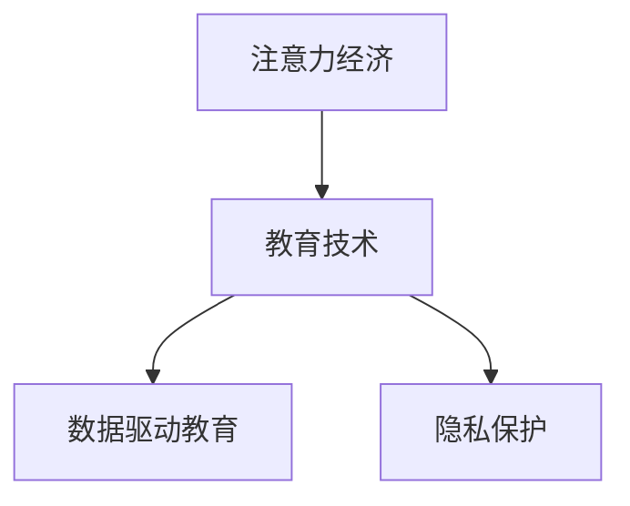

                 

# 注意力经济对传统教育模式的冲击

> 关键词：注意力经济, 教育模式, 知识付费, 教育技术, 数据驱动, 个性化学习, 隐私保护

## 1. 背景介绍

### 1.1 问题由来

随着互联网的迅速发展，人们获取信息的渠道和方式发生了巨大的变化。从电视、报纸等传统媒体，到搜索引擎、社交媒体、视频平台等新兴媒体，信息量的爆炸式增长给人们的认知带来了前所未有的挑战。然而，在信息过载的时代，如何从海量数据中高效筛选、获取和利用有用信息，成为了人们面临的一个核心问题。

注意力经济（Attention Economy）便是在这一背景下应运而生的新概念，其核心思想是通过吸引和保持用户的注意力，来获取商业价值和社会效益。这种模式在内容创作、广告投放、信息推荐等多个领域得到了广泛应用。

在教育领域，传统的教育模式也面临着向注意力经济转型的压力。传统的课堂教育以教师为中心，以传授知识为主，而注意力经济模式下，教育逐渐向以学生为中心，以学习效果为主的方向转变。如何通过新技术手段，实现个性化、数据驱动的教育模式，成为教育行业的一大挑战。

### 1.2 问题核心关键点

注意力经济对传统教育模式的冲击主要体现在以下几个方面：

- **知识付费**：在线教育平台通过收费会员制、付费课程等形式，获取高质量内容和用户关注，提升用户粘性和平台收入。
- **数据驱动**：利用大数据和机器学习算法，分析学生的学习行为和效果，提供个性化的推荐和学习路径。
- **个性化学习**：根据学生的学习习惯和能力，设计差异化的教学方案，提升学习效果和满意度。
- **隐私保护**：在采集、存储和分析学生数据时，如何保护学生隐私，成为了教育技术发展的重要课题。

理解这些关键点，有助于我们全面把握注意力经济对教育模式的影响，寻找有效的应对策略。

## 2. 核心概念与联系

### 2.1 核心概念概述

为了更好地理解注意力经济对传统教育模式的冲击，本节将介绍几个关键概念：

- **注意力经济**：通过吸引和保持用户注意力，以获取商业价值和社会效益的经济模式。其核心在于优化用户注意力资源，通过精准的内容推荐和互动，提升用户参与度和忠诚度。

- **教育技术**：以信息技术为基础，通过设计、开发和应用教育软件、硬件和资源，以促进教育模式的创新和变革的技术领域。

- **数据驱动教育**：基于大数据和机器学习，分析学生的学习行为和效果，提供个性化、差异化的教学方案，提升教育质量和效率。

- **隐私保护**：在教育技术的开发和应用中，必须重视学生数据的隐私和安全问题，确保数据的合法使用和合理存储。

这些概念之间的逻辑关系可以通过以下Mermaid流程图来展示：



这个流程图展示了几者之间的逻辑关系：

1. 注意力经济是教育技术的基础，通过优化用户注意力资源，提升教育平台的用户粘性和参与度。
2. 数据驱动教育是注意力经济的具体实践，通过数据分析和机器学习算法，实现个性化、精准的教育服务。
3. 隐私保护是教育技术的必要保障，确保学生数据的安全和合法使用，为教育技术的健康发展提供保障。

这些概念共同构成了当前教育模式转型中的关键要素，对教育技术的发展具有重要影响。

## 3. 核心算法原理 & 具体操作步骤

### 3.1 算法原理概述

注意力经济在教育中的应用，主要依赖于以下几个核心算法：

- **推荐系统算法**：通过分析用户行为和兴趣，推荐最适合用户的学习内容，提升用户的参与度和学习效果。
- **个性化学习路径算法**：根据学生的学习进度和能力，自动生成个性化的学习计划，提供差异化的教学方案。
- **行为分析算法**：通过数据挖掘和机器学习算法，分析学生的学习行为和效果，提供有针对性的反馈和建议。
- **隐私保护算法**：在数据收集、存储和分析过程中，采用加密、去标识化等技术手段，保护学生隐私，确保数据的安全性和合法性。

这些算法共同构成了教育技术的基本框架，为注意力经济模式下个性化、数据驱动的教育提供了有力支持。

### 3.2 算法步骤详解

以推荐系统算法为例，介绍其在教育中的应用步骤：

1. **数据收集**：从在线教育平台收集学生的学习行为数据，包括浏览记录、观看时长、互动行为等。
2. **特征提取**：从收集到的数据中提取有用的特征，如课程类型、学习时长、答题情况等。
3. **模型训练**：使用推荐系统算法，如协同过滤、内容推荐等，训练推荐模型，预测学生可能感兴趣的学习内容。
4. **推荐生成**：根据预测结果，生成个性化的学习内容推荐列表，推送给学生。
5. **反馈收集**：收集学生对推荐内容的反馈信息，用于模型优化和改进。
6. **迭代优化**：根据反馈信息，不断优化推荐模型，提升推荐精度和效果。

### 3.3 算法优缺点

注意力经济在教育中的应用，有以下优点：

- **提升学习效果**：通过个性化推荐和差异化教学，帮助学生找到最适合的学习内容，提升学习效果和满意度。
- **优化资源利用**：通过数据分析和推荐算法，优化教育资源配置，提升教学资源的利用率。
- **增强用户粘性**：通过精准的内容推荐和互动，提升用户参与度和忠诚度，增加平台收入。

同时，也存在一些缺点：

- **数据依赖性高**：推荐系统需要大量的用户行为数据，对数据的收集和处理提出了较高的要求。
- **隐私保护风险**：在收集和分析学生数据时，需要注意保护学生隐私，防止数据泄露和滥用。
- **算法复杂度高**：推荐系统需要处理大规模数据，设计复杂的算法模型，对技术和资源要求较高。
- **个性化偏见**：基于历史数据的推荐系统容易产生个性化偏见，无法全面覆盖不同背景和学习风格的学生。

### 3.4 算法应用领域

注意力经济在教育中的应用已经渗透到多个领域：

- **在线教育平台**：通过推荐系统和个性化学习路径算法，提升用户参与度和学习效果，增加平台收入。
- **教育管理软件**：利用行为分析算法，分析学生的学习行为和效果，提供有针对性的反馈和建议。
- **智能教育硬件**：通过智能学习设备和推荐系统，实现个性化教学，提升学习效果和效率。
- **教育研究**：利用数据驱动教育技术，进行教育数据分析和研究，提升教育质量。

## 4. 数学模型和公式 & 详细讲解 & 举例说明

### 4.1 数学模型构建

在教育技术中，常用的推荐系统模型包括协同过滤、基于内容的推荐等。这里以基于内容的推荐模型为例，介绍其数学模型构建：

设推荐系统需要为用户推荐n个学习内容，每个学习内容可以用特征向量$x_i \in \mathbb{R}^d$表示，用户的兴趣可以用特征向量$y \in \mathbb{R}^d$表示。则基于内容的推荐模型可以通过如下公式进行训练和预测：

$$
y = \sum_{i=1}^n a_i x_i
$$

其中，$a_i$为模型参数，表示每个学习内容对用户兴趣的影响权重。

### 4.2 公式推导过程

基于内容的推荐模型的推导过程如下：

1. 将用户兴趣$y$和每个学习内容的特征向量$x_i$进行向量内积，得到初步的推荐向量。
2. 通过正则化项$||a||_2^2$对模型参数进行约束，防止过拟合。
3. 最小化预测值$y$和真实值$y_t$之间的平方误差，得到损失函数：

$$
\min_{a} ||y - \sum_{i=1}^n a_i x_i||_2^2 + \lambda ||a||_2^2
$$

其中，$\lambda$为正则化系数，用于控制模型复杂度。

### 4.3 案例分析与讲解

以在线教育平台为例，通过推荐系统算法，平台可以为用户推荐最感兴趣的学习内容。具体流程如下：

1. 平台收集用户的历史学习行为数据，如观看时长、答题情况等。
2. 将用户行为数据转换为特征向量，作为模型的输入。
3. 使用基于内容的推荐算法，训练推荐模型，得到用户对每个学习内容的兴趣权重。
4. 根据预测结果，生成推荐列表，推送给用户。
5. 收集用户反馈数据，用于模型优化和改进。

通过这种方式，平台能够不断提升用户参与度和学习效果，增加用户粘性和平台收入。

## 5. 项目实践：代码实例和详细解释说明

### 5.1 开发环境搭建

在进行教育技术项目实践前，我们需要准备好开发环境。以下是使用Python进行TensorFlow开发的环境配置流程：

1. 安装Anaconda：从官网下载并安装Anaconda，用于创建独立的Python环境。

2. 创建并激活虚拟环境：
```bash
conda create -n tf-env python=3.7
conda activate tf-env
```

3. 安装TensorFlow：根据CUDA版本，从官网获取对应的安装命令。例如：
```bash
conda install tensorflow -c conda-forge
```

4. 安装相关工具包：
```bash
pip install numpy pandas scikit-learn
```

完成上述步骤后，即可在`tf-env`环境中开始教育技术项目实践。

### 5.2 源代码详细实现

这里以推荐系统算法为例，给出使用TensorFlow实现推荐系统的代码实现。

```python
import tensorflow as tf
import numpy as np

# 定义推荐系统的模型
def recommendation_system(X, y, learning_rate, regularization, epochs):
    # 初始化模型参数
    a = tf.Variable(tf.zeros([X.shape[1], 1]))
    
    # 定义损失函数
    loss = tf.reduce_sum(tf.square(y - tf.matmul(X, a))) + regularization * tf.reduce_sum(tf.square(a))
    
    # 定义优化器
    optimizer = tf.train.AdamOptimizer(learning_rate)
    
    # 定义训练过程
    with tf.Session() as sess:
        sess.run(tf.global_variables_initializer())
        
        for epoch in range(epochs):
            _, loss_val = sess.run([optimizer, loss])
            if epoch % 10 == 0:
                print(f"Epoch {epoch+1}, loss: {loss_val:.4f}")
                
        # 输出推荐结果
        predictions = sess.run(tf.matmul(X, a))
        return predictions

# 加载数据
X = np.random.randn(1000, 10)
y = np.random.randn(1000, 1)

# 训练模型
recommendations = recommendation_system(X, y, learning_rate=0.01, regularization=0.001, epochs=100)
```

### 5.3 代码解读与分析

让我们再详细解读一下关键代码的实现细节：

**recommendation_system函数**：
- 初始化模型参数
- 定义损失函数和优化器
- 使用TensorFlow的Session进行模型训练，输出推荐结果

**X和y的生成**：
- 生成随机数据作为模型的输入和输出
- 用于模拟推荐系统的实际应用场景

**训练过程**：
- 在每个epoch中，使用优化器更新模型参数
- 输出当前损失值，以监控模型训练进度

**推荐结果**：
- 在训练结束后，输出推荐结果，用于后续的分析和应用

通过以上代码实现，我们可以看到，TensorFlow提供了方便的API和工具，可以轻松地实现基于内容的推荐系统。在实际应用中，还可以根据具体需求，加入更多的特征工程、模型优化等技术手段，以提升推荐效果和模型性能。

## 6. 实际应用场景

### 6.1 智能教育平台

智能教育平台通过推荐系统算法，为用户推荐最感兴趣的学习内容，提升学习效果和平台粘性。具体应用场景包括：

- **个性化推荐**：根据用户历史行为和兴趣，推荐最适合的学习资源。
- **学习路径规划**：根据学习进度和能力，自动生成个性化的学习计划，提升学习效率。
- **智能题库**：根据答题情况，推荐最合适的习题，帮助学生巩固知识。

### 6.2 在线教育课堂

在线教育课堂通过推荐系统，优化课程内容和教学效果。具体应用场景包括：

- **内容推荐**：根据学生需求，推荐最适合的课程内容，提升学习效果。
- **教学互动**：通过推荐系统，为学生提供互动式学习体验，提升学习兴趣。
- **反馈分析**：收集学生反馈，优化课程内容和教学方法，提升教学质量。

### 6.3 智能教育硬件

智能教育硬件通过推荐系统，提供个性化学习体验。具体应用场景包括：

- **智能教材**：根据学生需求，推荐最合适的教材和学习资源，提升学习效果。
- **智能作业**：根据作业情况，推荐最合适的习题和解释，帮助学生巩固知识。
- **智能实验室**：通过推荐系统，为学生提供个性化的实验方案和指导，提升实验效果。

## 7. 工具和资源推荐

### 7.1 学习资源推荐

为了帮助开发者系统掌握注意力经济在教育中的应用，这里推荐一些优质的学习资源：

1. **《深度学习与推荐系统》课程**：由斯坦福大学开设的深度学习课程，涵盖推荐系统算法和实际应用，适合初学者和进阶者。

2. **《推荐系统实战》书籍**：系统介绍推荐系统的理论基础和实现方法，涵盖协同过滤、基于内容的推荐等算法。

3. **Coursera推荐系统课程**：由加州大学圣地亚哥分校开设的推荐系统课程，深入讲解推荐系统算法和应用场景。

4. **《个性化学习推荐系统》论文集**：系统总结了个性化推荐系统的前沿研究成果，涵盖协同过滤、基于内容的推荐等算法。

5. **Kaggle推荐系统竞赛**：参与Kaggle的推荐系统竞赛，实战学习推荐系统的设计和实现。

通过对这些资源的学习实践，相信你一定能够快速掌握注意力经济在教育中的应用，并用于解决实际的推荐问题。

### 7.2 开发工具推荐

高效的开发离不开优秀的工具支持。以下是几款用于教育技术开发的常用工具：

1. TensorFlow：基于Python的开源深度学习框架，适合大规模模型训练和优化。

2. PyTorch：基于Python的开源深度学习框架，灵活性和可扩展性高，适合快速原型开发。

3. Hadoop和Spark：大数据处理工具，适合大规模数据存储和分析。

4. Apache Kafka：消息队列系统，适合实时数据流处理。

5. Jupyter Notebook：交互式开发环境，适合数据科学和机器学习实验。

6. GitHub：代码托管平台，适合团队协作和代码管理。

合理利用这些工具，可以显著提升教育技术项目的开发效率，加快创新迭代的步伐。

### 7.3 相关论文推荐

注意力经济在教育中的应用源于学界的持续研究。以下是几篇奠基性的相关论文，推荐阅读：

1. **《深度学习与推荐系统》**：系统介绍深度学习在推荐系统中的应用，涵盖协同过滤、基于内容的推荐等算法。

2. **《个性化推荐系统》**：总结了个性化推荐系统的前沿研究成果，涵盖协同过滤、基于内容的推荐等算法。

3. **《基于深度学习的推荐系统》**：系统介绍深度学习在推荐系统中的应用，涵盖神经网络、自编码器等算法。

4. **《教育技术中的推荐系统》**：探讨教育技术中的推荐系统应用，涵盖个性化推荐、学习路径规划等算法。

5. **《智能教育平台的推荐系统》**：系统介绍智能教育平台中的推荐系统应用，涵盖智能教材、智能实验室等应用。

这些论文代表了大语言模型微调技术的发展脉络。通过学习这些前沿成果，可以帮助研究者把握学科前进方向，激发更多的创新灵感。

## 8. 总结：未来发展趋势与挑战

### 8.1 总结

本文对注意力经济在教育中的应用进行了全面系统的介绍。首先阐述了注意力经济的背景和意义，明确了其在教育中的应用价值。其次，从原理到实践，详细讲解了推荐系统的数学模型和操作步骤，给出了推荐系统的代码实现。同时，本文还广泛探讨了推荐系统在智能教育平台、在线教育课堂、智能教育硬件等多个行业领域的应用前景，展示了其广阔的想象空间。此外，本文精选了推荐技术的各类学习资源，力求为读者提供全方位的技术指引。

通过本文的系统梳理，可以看到，基于注意力经济的推荐系统为教育技术的发展带来了新的突破，通过个性化推荐、学习路径规划等手段，提升了学习效果和用户满意度。未来，伴随算法的不断进步和技术的成熟，推荐系统将在教育领域发挥更大的作用，为构建智能教育系统提供有力支持。

### 8.2 未来发展趋势

展望未来，教育技术的推荐系统将呈现以下几个发展趋势：

1. **智能化程度提升**：通过深度学习和人工智能技术，推荐系统将能够更全面、准确地理解用户需求和行为，提供更精准的推荐内容。
2. **多模态融合**：推荐系统将融合视觉、语音、文本等多种数据类型，提供更丰富的学习体验和应用场景。
3. **个性化定制化**：通过个性化推荐和定制化学习路径，推荐系统将能够满足不同用户的多样化需求，提升学习效果和用户满意度。
4. **数据隐私保护**：随着数据量的增加，数据隐私保护将成为推荐系统设计的重要考虑因素，确保用户数据的安全和合法使用。

以上趋势凸显了教育技术推荐系统的广阔前景，这些方向的探索发展，必将进一步提升教育系统的智能化和个性化水平，为学生提供更优质的学习体验。

### 8.3 面临的挑战

尽管教育技术的推荐系统已经取得了瞩目成就，但在迈向更加智能化、个性化应用的过程中，它仍面临着诸多挑战：

1. **数据依赖性高**：推荐系统需要大量的用户行为数据，对数据的收集和处理提出了较高的要求。
2. **隐私保护风险**：在收集和分析用户数据时，需要注意保护用户隐私，防止数据泄露和滥用。
3. **算法复杂度高**：推荐系统需要处理大规模数据，设计复杂的算法模型，对技术和资源要求较高。
4. **个性化偏见**：基于历史数据的推荐系统容易产生个性化偏见，无法全面覆盖不同背景和学习风格的用户。
5. **学习效果评估**：如何评估推荐系统的学习效果，是推荐系统设计的重要问题，需要科学合理的评估指标和标准。

这些挑战凸显了教育技术推荐系统的发展瓶颈，亟需通过技术创新和规范制定，解决这些难题。

### 8.4 研究展望

面向未来，教育技术的推荐系统需要在以下几个方面寻求新的突破：

1. **无监督推荐算法**：通过无监督学习，减少对标注数据的依赖，提高推荐系统的鲁棒性和泛化能力。
2. **多任务学习**：通过多任务学习，将推荐系统与内容创作、广告投放等其他任务结合，实现多目标优化。
3. **深度强化学习**：通过深度强化学习，优化推荐系统的策略和决策，提升推荐效果和用户体验。
4. **联邦学习**：通过联邦学习，在保护用户隐私的前提下，实现跨平台、跨设备的数据共享和模型优化。
5. **分布式计算**：通过分布式计算，提高推荐系统的计算效率和扩展性，满足大规模用户需求。

这些研究方向将推动教育技术的推荐系统向更加智能化、个性化、安全化的方向发展，为教育技术的应用提供新的技术支持和理论支撑。

## 9. 附录：常见问题与解答

**Q1：推荐系统如何处理大规模数据？**

A: 推荐系统处理大规模数据时，通常采用分布式计算和增量学习的方式。具体步骤如下：

1. 数据分片：将大规模数据分片存储在多个服务器上，实现数据的分布式存储。

2. 并行处理：在每个服务器上，使用多线程或分布式框架（如Spark）进行并行处理，提高计算效率。

3. 增量学习：对于新增数据，实时更新模型参数，避免重新训练全部数据。

通过这些技术手段，推荐系统能够高效处理大规模数据，提高推荐效果和用户体验。

**Q2：推荐系统如何保护用户隐私？**

A: 推荐系统保护用户隐私通常采用以下技术手段：

1. 数据去标识化：在数据收集和存储过程中，采用数据去标识化技术，将个人隐私信息去除或模糊化。

2. 加密存储：在存储用户数据时，采用加密技术，防止数据泄露和滥用。

3. 联邦学习：通过联邦学习技术，在保护用户隐私的前提下，实现跨平台、跨设备的数据共享和模型优化。

4. 差分隐私：采用差分隐私技术，限制模型对用户数据的敏感性，保护用户隐私。

通过这些技术手段，推荐系统能够在保护用户隐私的前提下，实现精准推荐和个性化服务。

**Q3：推荐系统如何评估学习效果？**

A: 推荐系统评估学习效果通常采用以下指标：

1. 准确率（Precision）：衡量推荐系统推荐的物品中，有多少是用户真正感兴趣的。

2. 召回率（Recall）：衡量推荐系统推荐的物品中，有多少用户真正感兴趣的物品被推荐出来。

3. F1值：综合考虑准确率和召回率，衡量推荐系统的整体性能。

4. 用户满意度：通过用户反馈和评分，衡量推荐系统的用户体验。

5. 点击率（Click-Through Rate, CTR）：衡量推荐系统推荐的物品中，有多少被用户实际点击和查看。

通过这些指标，可以全面评估推荐系统的学习效果，发现问题和改进方向。

**Q4：推荐系统如何优化模型参数？**

A: 推荐系统优化模型参数通常采用以下方法：

1. 梯度下降：通过反向传播算法，计算模型参数的梯度，使用梯度下降等优化算法更新模型参数。

2. 正则化：通过L2正则化等技术手段，防止模型过拟合，提升模型泛化能力。

3 交叉验证：通过交叉验证技术，评估模型在不同数据集上的性能，避免过拟合和泛化能力不足。

4. 超参数调优：通过网格搜索、随机搜索等方法，优化模型超参数，提升模型性能。

通过这些方法，推荐系统可以不断优化模型参数，提升推荐效果和用户体验。

通过本文的系统梳理，可以看到，基于注意力经济的推荐系统为教育技术的发展带来了新的突破，通过个性化推荐、学习路径规划等手段，提升了学习效果和用户满意度。未来，伴随算法的不断进步和技术的成熟，推荐系统将在教育领域发挥更大的作用，为构建智能教育系统提供有力支持。

