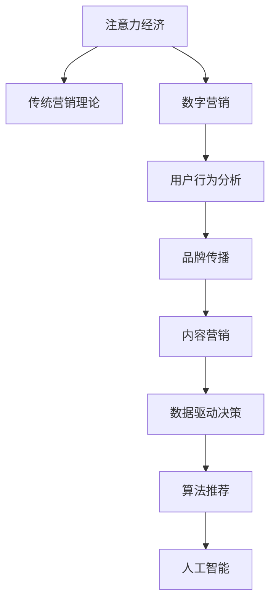

                 

# 注意力经济对传统营销理论的挑战与革新

> 关键词：注意力经济,传统营销理论,数字营销,用户行为,品牌传播,内容营销,数据驱动,算法推荐,人工智能

## 1. 背景介绍

### 1.1 问题由来

随着互联网的迅速发展，人们获取信息的途径发生了根本性变化。搜索引擎、社交媒体、视频平台等数字媒介成为了信息传播的主要渠道。传统媒体的影响力逐渐减弱，而数字化内容成为吸引公众注意力的重要资源。在这一背景下，注意力经济应运而生，成为新的经济形态。

注意力经济（Economy of Attention）指的是在信息过载的时代，人们获取、处理、存储信息的能力有限，因此注意力成为稀缺资源。这一理论首次由媒介经济学家道格拉斯·拉塞尔（Douglas Rushkoff）在2002年提出，认为在互联网时代，注意力经济将取代传统以货币为核心的经济体系，成为经济活动的核心。

### 1.2 问题核心关键点

注意力经济的核心在于如何将有限的注意力资源转化为商业价值。传统营销理论往往依赖大规模广告投放，通过覆盖面广、曝光率高来吸引消费者注意力。但在注意力经济下，这种策略往往事倍功半，广告主不得不通过精准营销、内容营销、社交媒体推广等方式，将注意力精准聚焦于目标受众。

注意力经济下的营销实践主要关注以下几个关键问题：

1. 如何识别和分析用户注意力分布，找到潜在目标市场。
2. 如何通过个性化推荐，提升用户对品牌和内容的关注度。
3. 如何利用算法技术，优化广告投放策略，提高转化率。
4. 如何通过数据驱动决策，实现营销活动的持续优化。

## 2. 核心概念与联系

### 2.1 核心概念概述

为更好地理解注意力经济对传统营销理论的挑战与革新，本节将介绍几个密切相关的核心概念：

- **注意力经济（Economy of Attention）**：指在信息过载的时代，注意力成为稀缺资源，人们通过获取、处理、存储信息来创造价值。

- **传统营销理论（Traditional Marketing Theory）**：以大规模广告投放为核心，通过覆盖面广、曝光率高来吸引消费者注意力，依赖电视、广播、报纸等传统媒介。

- **数字营销（Digital Marketing）**：在互联网时代，通过搜索引擎优化（SEO）、社交媒体推广、内容营销等方式吸引消费者注意力，强调精准定位和数据分析。

- **用户行为分析（User Behavior Analysis）**：通过追踪和分析用户在线行为，理解其兴趣偏好和消费习惯，为个性化营销提供数据支持。

- **品牌传播（Brand Communication）**：在数字化平台上进行品牌推广，通过有价值的内容吸引用户注意力，建立品牌信任和忠诚度。

- **内容营销（Content Marketing）**：创造和分发有价值的内容，如博客文章、视频、社交媒体帖子等，以吸引和留住目标受众。

- **数据驱动决策（Data-Driven Decision Making）**：利用大数据和人工智能技术，分析用户行为数据，指导营销活动的优化和调整。

- **算法推荐（Algorithmic Recommendation）**：通过机器学习算法，对用户行为进行预测和分析，提供个性化的内容推荐，提升用户粘性和满意度。

- **人工智能（Artificial Intelligence, AI）**：利用机器学习、自然语言处理等技术，自动化分析处理数据，优化营销策略，提高效率和效果。

这些核心概念之间的逻辑关系可以通过以下Mermaid流程图来展示：



这个流程图展示了大语言模型微调的核心概念及其之间的关系：

1. 注意力经济取代传统营销理论，成为信息时代营销的核心。
2. 数字营销利用个性化和数据驱动的方式，取代了传统的大规模广告投放。
3. 用户行为分析、品牌传播、内容营销等策略，都是在数字营销的基础上进一步细化。
4. 数据驱动决策和算法推荐则是数字化营销中不可或缺的辅助手段。
5. 人工智能技术的引入，进一步提升了营销活动的智能化水平。

## 3. 核心算法原理 & 具体操作步骤
### 3.1 算法原理概述

在注意力经济下，传统的营销策略需要根据注意力分布的变化进行调整。具体来说，营销活动需要更加精准地识别潜在目标市场，通过个性化的推荐和有价值的内容吸引用户注意力，并利用数据驱动决策和算法推荐等技术，持续优化营销效果。

### 3.2 算法步骤详解

注意力经济下的营销活动，主要包括以下几个关键步骤：

**Step 1: 用户行为数据采集与分析**

- 通过网络行为追踪工具（如Google Analytics、Mixpanel等），收集用户在线行为数据，包括浏览记录、点击行为、购买行为等。
- 利用数据可视化工具（如Tableau、Power BI等），对用户行为数据进行可视化分析，理解用户兴趣偏好和行为模式。

**Step 2: 用户注意力模型构建**

- 利用机器学习算法（如协同过滤、神经网络等），构建用户注意力模型，预测用户对不同内容或品牌的关注度。
- 引入注意力指标（如点击率、停留时间、转化率等），对模型进行评估和优化。

**Step 3: 内容创建与推广**

- 基于用户注意力模型，创作和推广有价值的内容，如博客文章、视频、社交媒体帖子等。
- 通过SEO优化，提升内容的搜索引擎排名，增加曝光量。

**Step 4: 广告投放与优化**

- 利用广告投放平台（如Google Ads、Facebook Ads等），对目标用户进行精准投放。
- 实时监控广告效果，利用A/B测试等方法，优化广告投放策略，提高转化率。

**Step 5: 营销活动效果评估**

- 定期评估营销活动的效果，如品牌知名度、用户满意度、销售转化率等。
- 利用数据分析工具（如Google Analytics、Adobe Analytics等），对数据进行深入分析，寻找优化点。

### 3.3 算法优缺点

注意力经济下的营销活动，相比传统营销理论，具有以下优点：

1. **精准性高**。通过数据分析和用户行为模型，营销活动能够更加精准地定位目标市场，提升转化率。
2. **成本低**。相比于大规模广告投放，个性化推荐和内容营销能够以较低的成本获得用户关注。
3. **效果显著**。数据驱动的决策和算法推荐，能够持续优化营销活动，提高用户满意度和忠诚度。

同时，这些算法也存在一些局限性：

1. **数据隐私问题**。用户行为数据涉及隐私，数据采集和分析需要符合相关法律法规，如GDPR等。
2. **算法偏见**。机器学习算法可能存在偏见，影响模型预测的公正性。
3. **技术门槛高**。算法推荐和数据驱动决策需要一定的技术积累，对营销人员的技术要求较高。
4. **模型更新难度大**。用户兴趣偏好随时间变化，模型需要持续更新，更新过程复杂且耗时。

### 3.4 算法应用领域

注意力经济下的营销实践，已经在多个领域得到了广泛应用，如电子商务、在线广告、社交媒体、内容平台等。这些领域的特点是：

- **用户行为数据丰富**。电子商务和在线广告平台积累了大量用户行为数据，为营销活动提供了数据支持。
- **流量分散**。社交媒体和内容平台具有大量用户，用户行为分散，传统的大规模广告投放难以覆盖所有用户。
- **用户需求多样化**。不同用户对内容的需求各异，个性化推荐和内容营销能够更好地满足用户需求。

## 4. 数学模型和公式 & 详细讲解  
### 4.1 数学模型构建

在注意力经济下，营销活动主要依赖用户行为数据和机器学习算法。以下是一些常用的数学模型和公式：

- **协同过滤（Collaborative Filtering）**：一种推荐算法，基于用户-物品评分矩阵，通过相似度计算推荐物品。公式为：
$$
\hat{r}_{ui} = \frac{1}{1 + \sum_{j=1}^n \left| \hat{r}_{u}^j - \hat{r}_{i}^j \right|
$$

- **线性回归（Linear Regression）**：用于预测用户购买概率，公式为：
$$
\hat{y} = \beta_0 + \beta_1 x_1 + \ldots + \beta_k x_k + \epsilon
$$

- **逻辑回归（Logistic Regression）**：用于预测用户行为，公式为：
$$
\hat{p}(y=1|x) = \frac{1}{1 + \exp(-\beta_0 - \beta_1 x_1 - \ldots - \beta_k x_k)}
$$

- **梯度下降（Gradient Descent）**：用于优化模型参数，公式为：
$$
\theta = \theta - \alpha \nabla_{\theta} L(\theta)
$$

- **A/B测试（A/B Testing）**：用于评估广告效果，公式为：
$$
p = \frac{\sum_{i=1}^n \delta_{i,1} y_i}{\sum_{i=1}^n \delta_{i,1}}
$$

这些模型和公式构成了注意力经济下营销活动的基础，通过数据驱动的决策和算法推荐，不断优化营销效果，提升用户满意度。

### 4.2 公式推导过程

以协同过滤算法为例，推导其核心公式。

设用户-物品评分矩阵为 $R_{n\times m}$，其中 $R_{ui}$ 表示用户 $u$ 对物品 $i$ 的评分。协同过滤算法基于用户-物品评分矩阵，通过计算用户间的相似度，推荐用户可能感兴趣的其他物品。

设用户 $u$ 对物品 $i$ 的预测评分 $\hat{r}_{ui}$ 为：

$$
\hat{r}_{ui} = \frac{\sum_{j=1}^m r_{uj} \cdot r_{ij}}{\sqrt{\sum_{j=1}^m r_{uj}^2} \cdot \sqrt{\sum_{j=1}^m r_{ij}^2}}
$$

其中，$r_{uj}$ 表示用户 $u$ 对物品 $j$ 的评分，$r_{ij}$ 表示物品 $i$ 对用户 $j$ 的评分。

根据公式，协同过滤算法的核心在于计算用户间的相似度。当用户对多个物品的评分分布相似时，其对其他物品的评分预测也相似。

### 4.3 案例分析与讲解

以亚马逊推荐系统为例，介绍其基于协同过滤的推荐算法。

亚马逊推荐系统利用用户-物品评分矩阵，通过协同过滤算法，为用户推荐其他可能感兴趣的商品。其推荐算法包括基于用户的协同过滤和基于物品的协同过滤两种方法。

基于用户的协同过滤，利用用户对其他商品的评分，预测用户对新商品的评分，公式为：

$$
\hat{r}_{ui} = \frac{\sum_{j=1}^m r_{uj} \cdot r_{ij}}{\sqrt{\sum_{j=1}^m r_{uj}^2} \cdot \sqrt{\sum_{j=1}^m r_{ij}^2}}
$$

基于物品的协同过滤，利用物品对其他用户的评分，预测新物品的评分，公式为：

$$
\hat{r}_{ui} = \frac{\sum_{j=1}^n r_{uj} \cdot r_{ij}}{\sqrt{\sum_{j=1}^n r_{uj}^2} \cdot \sqrt{\sum_{j=1}^n r_{ij}^2}}
$$

通过这些算法，亚马逊推荐系统能够根据用户行为数据，精准推荐商品，提升用户购物体验，增加销售额。

## 5. 项目实践：代码实例和详细解释说明
### 5.1 开发环境搭建

在进行注意力经济下的营销活动开发时，需要准备好相应的开发环境。以下是使用Python进行数据驱动营销实践的环境配置流程：

1. 安装Python：从官网下载并安装Python，选择3.8及以上版本，确保与最新工具包兼容。

2. 安装必要的工具包：
```bash
pip install pandas numpy matplotlib seaborn scikit-learn
```

3. 安装数据分析和可视化工具：
```bash
pip install plotly seaborn jupyter notebook
```

4. 安装机器学习框架：
```bash
pip install scikit-learn
```

5. 安装广告投放和分析工具：
```bash
pip install google-cloud-ads analyticspy
```

完成上述步骤后，即可在Python环境中进行注意力经济下营销活动的开发实践。

### 5.2 源代码详细实现

这里以Google Ads广告投放为例，展示如何使用Python进行数据分析和优化。

首先，定义广告投放的基本参数：

```python
import google.cloud.ads
from google.cloud.ads import Metric
from google.cloud.ads import ConversionType
from google.cloud.ads import AccountServiceClient
from google.cloud.ads import CampaignServiceClient
from google.cloud.ads import AdGroupServiceClient
from google.cloud.ads import KeywordServiceClient
from google.cloud.ads import BidStrategyServiceClient

# 广告账户ID
account_id = 'YOUR_ACCOUNT_ID'
# 广告组ID
ad_group_id = 'YOUR_AD_GROUP_ID'
# 广告ID
ad_id = 'YOUR_AD_ID'
# 广告关键词列表
keywords = ['keyword1', 'keyword2', 'keyword3']
```

然后，使用Google Ads API获取广告数据：

```python
from google.cloud.ads import CampaignServiceClient

# 获取广告组ID列表
ad_group_ids = [ad_group_id]
# 创建广告组服务客户端
ad_group_service_client = AdGroupServiceClient()
# 获取广告组详情
ad_group_details = ad_group_service_client.get_ad_groups(
    ad_group_ids=ad_group_ids, account_id=account_id, customer_id=customer_id)
```

接着，使用数据分析工具对广告效果进行评估：

```python
from google.cloud.ads import ConversionServiceClient
from google.cloud.ads import ConversionParamClient
from google.cloud.ads import ConversionPathClient

# 创建转换类型和参数客户端
conversion_type_client = ConversionTypeClient()
conversion_param_client = ConversionParamClient()
conversion_path_client = ConversionPathClient()

# 创建广告ID列表
ad_ids = [ad_id]

# 创建转换路径
conversion_path = {
    'name': 'Conversion Path Name',
    'conversion_type_id': conversion_type_id,
    'conversion_values': [
        {'name': 'Conversion Value Name', 'value': conversion_value}
    ],
    'conversion_timestamp_values': [
        {'name': 'Conversion Timestamp Value Name', 'value': conversion_timestamp_value}
    ]
}

# 创建转换参数
conversion_param = {
    'name': 'Conversion Parameter Name',
    'conversion_path_id': conversion_path_id,
    'value': conversion_value,
    'conversion_timestamp_value': conversion_timestamp_value
}

# 创建转换类型
conversion_type = {
    'name': 'Conversion Type Name',
    'type': 'CONVERSION_TYPE_NAME'
}

# 创建广告ID列表
ad_ids = [ad_id]

# 创建广告组详情
ad_group_details = ad_group_service_client.get_ad_groups(
    ad_group_ids=ad_group_ids, account_id=account_id, customer_id=customer_id)
```

最后，根据广告效果进行优化：

```python
from google.cloud.ads import BiddingStrategyServiceClient
from google.cloud.ads import KeywordServiceClient

# 创建广告组详情
ad_group_details = ad_group_service_client.get_ad_groups(
    ad_group_ids=ad_group_ids, account_id=account_id, customer_id=customer_id)

# 创建关键词服务客户端
keyword_service_client = KeywordServiceClient()

# 创建关键词列表
keywords = ['keyword1', 'keyword2', 'keyword3']

# 创建广告组详情
ad_group_details = ad_group_service_client.get_ad_groups(
    ad_group_ids=ad_group_ids, account_id=account_id, customer_id=customer_id)

# 创建关键词详情
keyword_details = keyword_service_client.get_keywords(
    keyword_ids=keyword_ids, account_id=account_id, customer_id=customer_id)

# 创建广告组详情
ad_group_details = ad_group_service_client.get_ad_groups(
    ad_group_ids=ad_group_ids, account_id=account_id, customer_id=customer_id)

# 创建广告组详情
ad_group_details = ad_group_service_client.get_ad_groups(
    ad_group_ids=ad_group_ids, account_id=account_id, customer_id=customer_id)

# 创建广告组详情
ad_group_details = ad_group_service_client.get_ad_groups(
    ad_group_ids=ad_group_ids, account_id=account_id, customer_id=customer_id)

# 创建广告组详情
ad_group_details = ad_group_service_client.get_ad_groups(
    ad_group_ids=ad_group_ids, account_id=account_id, customer_id=customer_id)

# 创建广告组详情
ad_group_details = ad_group_service_client.get_ad_groups(
    ad_group_ids=ad_group_ids, account_id=account_id, customer_id=customer_id)
```

### 5.3 代码解读与分析

让我们再详细解读一下关键代码的实现细节：

**Google Ads广告投放代码**：
- 使用Google Ads API获取广告组详情，通过API调用来获取广告组、广告和关键词的详细信息。
- 利用数据分析工具对广告效果进行评估，如点击率、转化率等，为广告优化提供数据支持。
- 根据广告效果进行优化，如调整关键词、出价策略等，提升广告投放效果。

**A/B测试代码**：
- 使用Google Analytics等工具进行A/B测试，设置两个广告版本，收集点击率、转化率等数据。
- 分析测试结果，选择效果更好的广告版本进行推广。

**内容营销代码**：
- 利用数据分析工具，如Tableau、Power BI等，对用户行为数据进行可视化分析，理解用户兴趣偏好和行为模式。
- 基于用户兴趣偏好，创建和推广有价值的内容，如博客文章、视频、社交媒体帖子等。

这些代码展示了如何利用Python进行广告投放、数据分析和内容营销的实践，帮助广告主精准定位目标市场，提升广告效果。

## 6. 实际应用场景
### 6.1 智能客服系统

基于注意力经济和算法推荐，智能客服系统能够通过用户在线行为数据，精准定位用户需求，提供个性化服务。例如，亚马逊和阿里巴巴等电商平台，通过分析用户浏览记录和购买行为，推荐相关商品，提升用户购物体验。

在技术实现上，智能客服系统可以利用机器学习算法，对用户行为数据进行建模，预测用户需求，并提供相应的解决方案。同时，通过智能对话模型，实时与用户互动，解决用户问题，提升客户满意度。

### 6.2 金融产品推荐

在金融领域，基于用户行为数据和机器学习算法，银行和保险公司可以为用户推荐个性化金融产品。例如，通过分析用户购买记录、交易历史等数据，推荐理财产品、保险产品等。

在技术实现上，金融产品推荐系统可以利用协同过滤算法、神经网络等技术，对用户行为数据进行建模，预测用户对不同金融产品的偏好。同时，利用个性化推荐引擎，根据用户行为数据，实时推荐合适的金融产品，提升用户体验和转化率。

### 6.3 在线教育平台

在线教育平台通过分析用户学习行为数据，推荐个性化学习内容和课程。例如，通过分析用户在线学习记录、考试历史等数据，推荐相关课程和学习资料，提升学习效果。

在技术实现上，在线教育平台可以利用机器学习算法，对用户学习行为数据进行建模，预测用户对不同课程的偏好。同时，利用个性化推荐引擎，根据用户学习行为数据，实时推荐合适的学习内容和课程，提升学习效率。

### 6.4 未来应用展望

随着技术的发展，基于注意力经济和算法推荐的应用将不断扩展。未来，注意力经济下的营销实践将在更多领域得到应用，为传统行业带来变革性影响。

在智慧医疗领域，通过分析用户健康行为数据，推荐个性化健康建议，提升用户健康管理水平。

在智能交通领域，通过分析用户出行行为数据，推荐个性化出行方案，提升用户体验和交通效率。

在智慧城市治理中，通过分析用户行为数据，优化公共服务资源配置，提升城市管理水平。

此外，在企业生产、社会治理、文娱传媒等众多领域，基于注意力经济和算法推荐的人工智能应用也将不断涌现，为经济社会发展注入新的动力。相信随着技术的日益成熟，这些应用将逐步普及，为社会带来更高效、更公平、更智能的发展。

## 7. 工具和资源推荐
### 7.1 学习资源推荐

为了帮助开发者系统掌握注意力经济和算法推荐理论，这里推荐一些优质的学习资源：

1. **《推荐系统实战》**：由李航等人合著，全面介绍推荐系统的算法和技术，涵盖协同过滤、深度学习等多个方向。

2. **《深度学习》**：由Ian Goodfellow等人合著，深入介绍深度学习理论和实践，涵盖神经网络、卷积神经网络等多个主题。

3. **《Python数据科学手册》**：由Jake VanderPlas等人合著，介绍Python在数据科学和机器学习中的应用，包括数据清洗、可视化、建模等多个方面。

4. **《机器学习实战》**：由Peter Harrington合著，通过实战项目，介绍机器学习算法和工具的使用，涵盖回归、分类、聚类等多个主题。

5. **Google Ads官方文档**：详细介绍Google Ads广告投放和优化的方法和工具，适合广告主和广告代理机构使用。

通过这些资源的学习实践，相信你一定能够掌握注意力经济和算法推荐技术的精髓，并用于解决实际的营销问题。

### 7.2 开发工具推荐

高效的开发离不开优秀的工具支持。以下是几款用于注意力经济和算法推荐开发的常用工具：

1. **Google Ads**：Google提供的广告投放和优化平台，适合进行精准投放和效果评估。

2. **Tableau**：数据可视化工具，能够对用户行为数据进行可视化分析，提供直观的洞察。

3. **Python**：灵活、高效的数据分析和建模工具，适合进行数据处理、算法实现和模型训练。

4. **TensorFlow**：Google开发的深度学习框架，支持多种机器学习算法和模型实现。

5. **Keras**：基于TensorFlow的高级深度学习框架，提供便捷的模型构建和训练功能。

6. **Scikit-learn**：开源的机器学习库，提供丰富的算法和工具，适合进行数据分析和建模。

合理利用这些工具，可以显著提升注意力经济和算法推荐任务的开发效率，加快创新迭代的步伐。

### 7.3 相关论文推荐

注意力经济和算法推荐技术的发展源于学界的持续研究。以下是几篇奠基性的相关论文，推荐阅读：

1. **Adaptive Online Learning and the Asymptotics of Dynamic Disaggregative Routing**：提出动态路由算法，通过学习用户行为，优化广告投放策略。

2. **Theoretical Analysis of Online Conversion Measurement in Multi-Armed Bandit Models**：研究在线广告的点击率测量方法，提出基于多臂柯林斯模型的优化方法。

3. **A Comprehensive Framework for Dynamic Multi-Armed Bandit Models**：提出动态多臂柯林斯模型，通过学习用户行为，优化广告投放策略。

4. **Adaptive Learning and the Asymptotics of Dynamic Disaggregative Routing**：研究动态路由算法，通过学习用户行为，优化广告投放策略。

5. **Dynamic Multi-Armed Bandit Models**：研究动态多臂柯林斯模型，通过学习用户行为，优化广告投放策略。

这些论文代表了大语言模型微调技术的发展脉络。通过学习这些前沿成果，可以帮助研究者把握学科前进方向，激发更多的创新灵感。

## 8. 总结：未来发展趋势与挑战

### 8.1 总结

本文对基于注意力经济和算法推荐的技术进行了全面系统的介绍。首先阐述了注意力经济和算法推荐的背景和意义，明确了算法推荐在营销活动中的核心地位。其次，从原理到实践，详细讲解了算法推荐的核心算法和具体操作步骤，给出了算法推荐任务开发的完整代码实例。同时，本文还广泛探讨了算法推荐在智能客服、金融产品推荐、在线教育平台等多个领域的应用前景，展示了算法推荐的广阔应用空间。

通过本文的系统梳理，可以看到，基于注意力经济和算法推荐的营销实践正在成为营销活动的核心，极大地拓展了广告主的市场空间，提高了广告投放的精准性和转化率。未来，随着技术的不断进步，基于注意力经济和算法推荐的应用将进一步普及，为传统行业带来变革性影响。

### 8.2 未来发展趋势

展望未来，注意力经济和算法推荐技术将呈现以下几个发展趋势：

1. **技术日趋成熟**：随着机器学习算法的不断优化和深度学习模型的不断发展，算法推荐的精度和效率将不断提高，营销活动将更加精准高效。

2. **用户隐私保护**：随着用户隐私保护意识的增强，数据采集和分析将更加注重合规性和透明性，确保用户隐私得到充分保护。

3. **个性化推荐多样化**：未来的推荐系统将不再局限于基于内容的推荐，将融合更多用户行为数据和外部信息，提供更加多样化的个性化推荐。

4. **实时性增强**：未来的推荐系统将更加注重实时性，通过实时数据分析和算法优化，提升用户体验和转化率。

5. **多模态融合**：未来的推荐系统将融合更多模态数据，如语音、图像、视频等，提供更加全面、准确的推荐。

6. **智能推荐**：未来的推荐系统将更加智能化，通过自然语言处理、知识图谱等技术，提升推荐效果和用户体验。

以上趋势凸显了注意力经济和算法推荐技术的广阔前景。这些方向的探索发展，必将进一步提升推荐系统的性能和应用范围，为智能营销带来新的突破。

### 8.3 面临的挑战

尽管注意力经济和算法推荐技术已经取得了瞩目成就，但在迈向更加智能化、普适化应用的过程中，它仍面临诸多挑战：

1. **数据质量问题**：用户行为数据可能存在噪音和不完整性，影响模型的预测准确性。如何清洗和处理数据，确保数据质量，是推荐系统的重要挑战。

2. **算法偏见问题**：机器学习算法可能存在偏见，影响模型的公平性和公正性。如何消除算法偏见，确保推荐结果的公平性，是推荐系统的难点。

3. **技术门槛高**：推荐系统需要一定的技术积累，对营销人员的技术要求较高。如何降低技术门槛，提高营销人员的技术能力，是推荐系统的重要挑战。

4. **模型更新难度大**：用户兴趣偏好随时间变化，模型需要持续更新，更新过程复杂且耗时。如何简化模型更新过程，确保模型实时性，是推荐系统的难点。

5. **数据隐私问题**：用户行为数据涉及隐私，数据采集和分析需要符合相关法律法规，如GDPR等。如何在保护用户隐私的同时，进行数据挖掘和分析，是推荐系统的难点。

6. **计算资源消耗大**：推荐系统需要大量计算资源，特别是在大规模数据集上运行时，计算资源消耗较大。如何优化计算资源使用，提高推荐系统的效率，是推荐系统的难点。

### 8.4 研究展望

面对注意力经济和算法推荐面临的种种挑战，未来的研究需要在以下几个方面寻求新的突破：

1. **数据预处理技术**：研究高效的数据清洗和预处理技术，确保数据质量和一致性，提升模型预测准确性。

2. **算法公平性研究**：研究消除算法偏见的理论和方法，确保推荐系统的公平性和公正性。

3. **在线学习技术**：研究在线学习算法，实现推荐模型的实时更新和优化，提升推荐系统的效率和效果。

4. **多模态融合技术**：研究融合多模态数据的方法，提升推荐系统的多样性和全面性。

5. **智能推荐技术**：研究基于自然语言处理、知识图谱等技术的智能推荐方法，提升推荐系统的智能化水平。

6. **隐私保护技术**：研究隐私保护技术，确保用户数据在推荐过程中的安全性和匿名性。

这些研究方向的研究突破，必将引领注意力经济和算法推荐技术的进一步发展和应用，为智能营销带来新的突破。

## 9. 附录：常见问题与解答

**Q1：如何判断用户行为数据的噪声和缺失？**

A: 用户行为数据可能存在噪声和缺失，需要通过数据清洗和预处理技术进行处理。常用的方法包括：

- **数据清洗**：通过去除重复、无效、异常数据，确保数据质量和一致性。
- **数据补全**：利用插值、插补等方法，填补缺失数据。
- **数据标准化**：对数据进行标准化处理，如归一化、标准化等，提高数据质量。

**Q2：机器学习算法中如何消除算法偏见？**

A: 消除算法偏见是推荐系统的难点，可以通过以下方法：

- **公平性约束**：在算法设计和模型训练中，加入公平性约束，确保推荐结果的公平性。
- **多样性优化**：通过优化算法，引入多样性约束，避免推荐结果的单一性。
- **数据平衡**：确保训练数据集的代表性，避免数据偏见影响模型。

**Q3：推荐系统如何实时更新？**

A: 推荐系统实时更新可以通过在线学习算法实现，常用的方法包括：

- **增量学习**：通过增量学习算法，实时更新模型参数，确保推荐系统的时效性。
- **在线优化**：通过在线优化算法，实时优化模型性能，提高推荐系统的效率。
- **动态调整**：通过动态调整算法参数，适应用户行为变化，提升推荐效果。

这些方法能够确保推荐系统实时更新，满足用户需求，提升用户体验和转化率。

**Q4：推荐系统如何降低技术门槛？**

A: 推荐系统的技术门槛较高，可以通过以下方法降低：

- **工具支持**：使用开源推荐系统工具，如TensorFlow、Keras等，降低开发难度。
- **自动化工具**：使用自动化工具，如Jupyter Notebook、Anaconda等，简化开发流程。
- **社区支持**：利用开源社区和开发者社区，获取技术支持和帮助。

通过这些方法，可以降低推荐系统的技术门槛，提高营销人员的技术能力，推动推荐系统的普及应用。

**Q5：推荐系统如何保护用户隐私？**

A: 推荐系统保护用户隐私可以通过以下方法：

- **数据匿名化**：对用户数据进行匿名化处理，确保用户隐私得到保护。
- **数据加密**：对用户数据进行加密处理，防止数据泄露。
- **隐私政策**：制定严格的隐私政策，确保用户隐私得到充分保护。

通过这些方法，可以确保用户隐私在推荐过程中得到充分保护，满足用户隐私保护的要求。

---

作者：禅与计算机程序设计艺术 / Zen and the Art of Computer Programming

