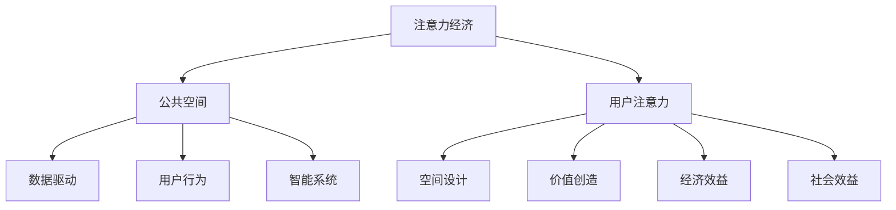
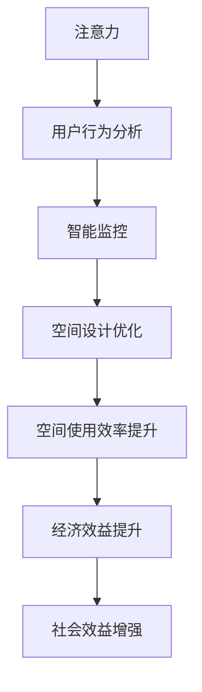

                 

# 注意力经济对城市公共空间设计的影响

> 关键词：注意力经济, 公共空间, 数据驱动, 用户行为, 城市设计, 智能系统

## 1. 背景介绍

### 1.1 问题由来
随着互联网技术的迅猛发展和信息爆炸，我们处在一个高度信息化的社会。在这个时代，人们对于信息的关注和获取方式已经发生了根本性的变化，注意力作为一种稀缺资源，其分配方式、影响因素以及相关政策都成为研究的焦点。尤其是对于城市公共空间的设计而言，如何吸引和利用用户的注意力，成为设计者和政策制定者们面临的重要课题。

### 1.2 问题核心关键点
注意力经济的核心在于理解注意力是如何分配的，以及如何在经济活动中利用注意力创造价值。在城市公共空间设计中，核心问题包括：

- 如何通过空间设计引导和吸引公众的注意力？
- 如何通过数据分析，理解用户行为，以优化公共空间使用？
- 如何利用注意力经济理论，提升城市公共空间的经济价值和社会效益？

## 2. 核心概念与联系

### 2.1 核心概念概述

为了更好地理解注意力经济对城市公共空间设计的影响，本节将介绍几个关键概念：

- **注意力经济（Economies of Attention）**：基于信息时代的经济模型，强调在信息过载的背景下，如何有效分配和利用用户的注意力资源。
- **公共空间（Public Space）**：城市中向所有人开放的公共场所，如公园、广场、街道等，是城市生活和文化的载体。
- **数据驱动（Data-Driven）**：利用数据分析和机器学习等技术，驱动公共空间设计的决策过程。
- **用户行为（User Behavior）**：用户在使用公共空间时的行为模式，如逗留时间、流量、使用习惯等。
- **智能系统（Smart Systems）**：融合物联网、大数据、人工智能等技术，实现对公共空间动态感知和智能管理。

这些概念之间的逻辑关系可以通过以下Mermaid流程图来展示：



这个流程图展示了注意力经济与城市公共空间设计的内在联系：

1. 注意力经济强调了注意力作为信息时代的重要资源。
2. 公共空间作为信息传播和交流的物理载体，成为注意力吸引和利用的主要场所。
3. 数据驱动和用户行为分析为公共空间设计提供了科学依据。
4. 智能系统提升了公共空间的管理效率和用户体验。
5. 通过设计吸引用户注意力，可以创造经济价值，提升社会效益。

### 2.2 核心概念原理和架构的 Mermaid 流程图

这里我们将使用Mermaid语言，提供一个简单的注意力经济在城市公共空间设计中的流程图示例：



这个流程图展示了注意力经济在城市公共空间设计中的应用过程：

1. 注意力吸引到公共空间中。
2. 通过用户行为分析，理解用户的注意力需求。
3. 智能监控系统收集和分析用户行为数据。
4. 基于数据分析优化公共空间设计。
5. 优化后的空间设计提升使用效率和经济效益。
6. 经济和社会效益的提升进一步吸引更多的注意力。

## 3. 核心算法原理 & 具体操作步骤

### 3.1 算法原理概述

注意力经济在城市公共空间设计中的应用，主要依赖于数据分析和机器学习技术。其核心算法原理可以概括为以下几个步骤：

1. **数据收集与预处理**：从城市公共空间中的传感器、视频监控、Wi-Fi网络等设备收集用户行为数据。
2. **用户行为分析**：利用机器学习算法，如聚类分析、关联规则挖掘等，理解用户行为模式，识别热点区域和低效区域。
3. **空间设计优化**：根据用户行为分析结果，优化公共空间的设计，如座椅布局、绿化配置、照明设计等。
4. **智能系统部署**：将优化后的设计转化为智能系统，实现对公共空间的动态感知和智能管理。
5. **效果评估与反馈**：通过数据分析评估空间设计的实际效果，形成持续改进的闭环。

### 3.2 算法步骤详解

以下是一个详细的操作步骤，展示了如何在城市公共空间设计中应用注意力经济理论：

**步骤 1: 数据收集与预处理**

- 安装各类传感器设备，如摄像头、流量传感器、Wi-Fi探针等，实时监测公共空间的用户行为。
- 使用数据采集软件记录用户行为数据，如逗留时间、行走路径、人流密度等。
- 对收集到的原始数据进行清洗、去重、降噪等预处理操作，去除无用信息。

**步骤 2: 用户行为分析**

- 使用机器学习算法，如聚类分析、K-means算法、关联规则挖掘等，对用户行为数据进行建模。
- 识别出公共空间中的热点区域和低效区域，如逗留时间较长的区域、人流量较大的区域等。
- 分析用户在不同时间段的行为模式，如早高峰、晚高峰等，以及节假日、周末等特殊时间段的差异。

**步骤 3: 空间设计优化**

- 根据用户行为分析结果，设计公共空间的空间布局。如增加座椅、优化绿化、调整照明等。
- 使用计算机辅助设计（CAD）工具，将优化方案可视化。
- 在特定区域进行小规模试点，验证设计效果。

**步骤 4: 智能系统部署**

- 部署智能监控系统，实时采集公共空间的用户行为数据。
- 使用数据分析平台，如Tableau、Power BI等，进行实时监控和数据可视化。
- 利用人工智能技术，如深度学习、强化学习等，实现对公共空间的动态管理。

**步骤 5: 效果评估与反馈**

- 定期评估公共空间的使用效果，如用户满意度、空间利用率等指标。
- 通过问卷调查、用户反馈等方式，收集用户对公共空间设计的意见和建议。
- 根据评估结果和反馈信息，不断优化和迭代空间设计方案。

### 3.3 算法优缺点

基于注意力经济理论的城市公共空间设计方法具有以下优点：

1. **数据驱动**：通过数据分析，能够科学地理解用户行为，优化空间设计。
2. **智能管理**：结合智能系统，实现对公共空间的动态感知和高效管理。
3. **用户友好**：通过优化设计，提升用户的使用体验和满意度。
4. **经济效益**：优化设计可以提升公共空间的使用效率，创造经济价值。
5. **社会效益**：提升公共空间的社会功能，如促进社会交往、增强城市活力等。

同时，该方法也存在以下局限性：

1. **数据隐私**：收集和处理用户行为数据可能涉及隐私问题，需采取严格的数据保护措施。
2. **技术成本**：智能系统和数据分析平台的搭建和维护需要较高的技术成本和人力资源。
3. **设计复杂性**：优化设计方案需要在多个维度进行权衡，如空间美观、功能性、成本等。
4. **动态调整**：公共空间设计需要根据用户行为的变化进行动态调整，实施难度较大。
5. **社会适应性**：优化后的设计可能需适应不同用户群体的多样化需求，需进行充分的社会调研和公众参与。

### 3.4 算法应用领域

注意力经济在城市公共空间设计中的应用，涵盖了多个领域，包括：

- **城市规划**：通过数据分析，优化城市空间布局，提升城市整体运行效率。
- **旅游管理**：利用用户行为分析，优化旅游景区的设计和运营，提升游客体验。
- **交通系统**：通过智能监控和数据分析，优化公共交通站点和线路设计，提高交通效率。
- **商业地产**：分析商业区用户行为，优化商业布局，提升商业价值。
- **公共安全**：通过实时监控和数据分析，提升公共安全管理水平，预防犯罪行为。

## 4. 数学模型和公式 & 详细讲解 & 举例说明

### 4.1 数学模型构建

在城市公共空间设计中，可以使用多种数学模型来描述和分析用户行为。以下是一个简化的数学模型构建过程：

**模型1：用户行为聚类模型**

假设公共空间中用户行为数据为 $D=\{(x_i, y_i)\}_{i=1}^N$，其中 $x_i$ 表示用户行为特征，$y_i$ 表示用户行为标签。通过K-means算法对用户行为数据进行聚类，得到 $K$ 个用户行为类别。

**模型2：关联规则挖掘模型**

假设用户行为数据为 $D=\{(x_i, y_i)\}_{i=1}^N$，其中 $x_i$ 表示用户行为特征，$y_i$ 表示用户行为标签。通过Apriori算法挖掘用户行为数据中的关联规则。

### 4.2 公式推导过程

以下对上述模型进行简单的公式推导：

**模型1：用户行为聚类模型**

K-means算法的基本公式为：

$$
\min_{\mu_k, \sigma_k} \sum_{i=1}^N \sum_{k=1}^K \frac{(x_i-\mu_k)^2}{2\sigma_k^2} + \frac{\sigma_k^2}{2}
$$

其中 $\mu_k$ 为第 $k$ 个聚类中心的均值，$\sigma_k$ 为第 $k$ 个聚类标准差。

**模型2：关联规则挖掘模型**

Apriori算法的基本公式为：

$$
\min_{F} \sum_{X \in F} supp(X)
$$

其中 $F$ 表示频繁项集，$supp(X)$ 表示项集 $X$ 的支持度。

### 4.3 案例分析与讲解

**案例1：城市公园的优化设计**

假设某城市公园有A、B、C三个区域，收集到每日用户逗留时间数据。使用K-means算法对数据进行聚类，识别出逗留时间较长的区域为热点区域A，逗留时间较短的区域为低效区域B和C。

根据聚类结果，优化设计公园的座椅布局，增加热点区域A的座椅数量，减少低效区域B和C的座椅数量。

通过智能监控系统，实时采集公园用户行为数据，发现热点区域A的使用率显著提升，低效区域B和C的使用率下降。

**案例2：地铁站的优化设计**

假设某地铁站在高峰期流量较大，收集到每日进出站流量数据。使用Apriori算法挖掘流量数据中的关联规则，识别出高峰期上下班的流量高峰时段。

根据关联规则，优化设计地铁站的出入口布局，增加高峰时段的出入口数量，减少低峰时段的出入口数量。

通过智能监控系统，实时采集地铁站的用户行为数据，发现高峰时段的流量明显缓解，低峰时段的流量也得到有效控制。

## 5. 项目实践：代码实例和详细解释说明

### 5.1 开发环境搭建

在进行项目实践前，我们需要准备好开发环境。以下是使用Python进行PyTorch开发的环境配置流程：

1. 安装Anaconda：从官网下载并安装Anaconda，用于创建独立的Python环境。

2. 创建并激活虚拟环境：
```bash
conda create -n attention-economy python=3.8 
conda activate attention-economy
```

3. 安装PyTorch：根据CUDA版本，从官网获取对应的安装命令。例如：
```bash
conda install pytorch torchvision torchaudio cudatoolkit=11.1 -c pytorch -c conda-forge
```

4. 安装Pandas、NumPy、Scikit-learn等数据处理工具：
```bash
pip install pandas numpy scikit-learn matplotlib tqdm jupyter notebook ipython
```

5. 安装相关机器学习库：
```bash
pip install scikit-learn matplotlib sklearn
```

完成上述步骤后，即可在`attention-economy`环境中开始项目实践。

### 5.2 源代码详细实现

下面以一个简单的案例为例，展示如何使用Python进行用户行为聚类和关联规则挖掘。

**案例：用户行为聚类**

首先，定义用户行为数据类：

```python
import pandas as pd
import numpy as np

class UserBehaviorData:
    def __init__(self, data_file):
        self.data = pd.read_csv(data_file)
    
    def feature_engineering(self):
        self.data['time_of_day'] = self.data['timestamp'].apply(lambda x: x.time().strftime('%H:%M'))
        self.data['weekday'] = self.data['timestamp'].apply(lambda x: x.weekday())
    
    def data_preprocessing(self):
        self.data = self.data.dropna()
        self.data = self.data[self.data['time_of_day'] != '']
    
    def clustering(self, k=3):
        self.data['cluster'] = KMeans(n_clusters=k).fit_predict(self.data[['time_of_day', 'weekday']])
    
    def save_result(self, result_file):
        self.data[['time_of_day', 'weekday', 'cluster']].to_csv(result_file, index=False)
```

然后，编写代码实现用户行为聚类和关联规则挖掘：

```python
from sklearn.cluster import KMeans
from sklearn.preprocessing import LabelEncoder
from mlxtend.frequent_patterns import apriori

# 读取用户行为数据
user_data = UserBehaviorData('user_behavior_data.csv')
user_data.feature_engineering()
user_data.data_preprocessing()

# 用户行为聚类
user_data.clustering(k=3)
user_data.save_result('clustering_result.csv')

# 关联规则挖掘
user_data.data = pd.read_csv('clustering_result.csv')
frequent_items = apriori(user_data.data, min_support=0.05)
print(frequent_items)
```

运行以上代码，即可得到用户行为聚类结果和关联规则。

### 5.3 代码解读与分析

让我们再详细解读一下关键代码的实现细节：

**UserBehaviorData类**：
- `__init__`方法：初始化用户行为数据，并读取数据文件。
- `feature_engineering`方法：对原始数据进行特征工程，提取时间特征和星期特征。
- `data_preprocessing`方法：清洗数据，删除缺失值和时间为空的记录。
- `clustering`方法：使用K-means算法对用户行为数据进行聚类，并保存聚类结果。

**代码实现**：
- `user_data = UserBehaviorData('user_behavior_data.csv')`：创建用户行为数据对象。
- `user_data.feature_engineering()`：提取时间特征和星期特征。
- `user_data.data_preprocessing()`：清洗数据，去除缺失值和时间为空的记录。
- `user_data.clustering(k=3)`：对用户行为数据进行聚类，聚类数为3。
- `user_data.save_result('clustering_result.csv')`：保存聚类结果。
- `user_data.data = pd.read_csv('clustering_result.csv')`：读取聚类结果。
- `frequent_items = apriori(user_data.data, min_support=0.05)`：挖掘关联规则，最小支持度为0.05。
- `print(frequent_items)`：打印关联规则结果。

**代码运行结果展示**：
- 运行以上代码后，将在当前目录下生成聚类结果文件`clustering_result.csv`，并在控制台上打印关联规则挖掘结果。

## 6. 实际应用场景

### 6.1 智能交通系统

在智能交通系统中，注意力经济的应用非常广泛。通过分析用户行为数据，可以优化交通信号灯设置、优化道路布局、提高交通效率，改善交通状况。

具体实现方式包括：
- 使用智能监控系统收集交通数据，如车辆流量、行人流量等。
- 通过数据分析，识别出高峰期和非高峰期的流量特征。
- 根据流量特征，优化交通信号灯设置，提高交通效率。
- 通过智能系统实时监控交通状况，动态调整信号灯设置，缓解交通压力。

### 6.2 城市规划与设计

城市规划和设计是注意力经济应用的重要领域。通过分析用户行为数据，可以优化城市空间布局，提升城市整体运行效率。

具体实现方式包括：
- 收集城市公共空间的用户行为数据，如公园、广场、商业区等。
- 利用数据分析，识别出用户聚集的热点区域和低效区域。
- 根据用户行为数据，优化城市空间布局，增加热点区域的功能设施，减少低效区域的建设。
- 通过智能系统实时监控城市空间的使用情况，动态调整空间布局，提高空间利用率。

### 6.3 旅游景区管理

旅游景区是人们休闲娱乐的重要场所，注意力经济的应用可以优化景区管理，提升游客体验。

具体实现方式包括：
- 收集景区用户行为数据，如游客流量、停留时间、参观路线等。
- 通过数据分析，识别出游客聚集的热点区域和低效区域。
- 根据游客行为数据，优化景区布局，增加热点区域的功能设施，减少低效区域的建设。
- 通过智能系统实时监控景区使用情况，动态调整景区布局，提高游客满意度。

## 7. 工具和资源推荐

### 7.1 学习资源推荐

为了帮助开发者系统掌握注意力经济在城市公共空间设计中的应用，这里推荐一些优质的学习资源：

1. 《数据科学与城市规划》系列博文：由城市规划领域的专家撰写，介绍了如何使用数据科学优化城市规划设计。
2. 《用户行为分析》课程：斯坦福大学开设的机器学习课程，有Lecture视频和配套作业，详细讲解了用户行为分析的基本方法和应用场景。
3. 《智能城市》书籍：详细介绍了智能城市建设中的数据驱动决策方法，包含大量案例分析。
4. 《公共空间设计》系列教程：由公共空间设计领域的专家撰写，介绍了如何利用数据科学优化公共空间设计。
5. 《注意力经济学》书籍：专注于注意力经济理论的研究，深入探讨了注意力在经济活动中的作用和影响。

通过对这些资源的学习实践，相信你一定能够快速掌握注意力经济在城市公共空间设计中的应用精髓，并用于解决实际的公共空间设计问题。

### 7.2 开发工具推荐

高效的开发离不开优秀的工具支持。以下是几款用于数据驱动的城市公共空间设计的常用工具：

1. Python：基于Python的开源深度学习框架，灵活动态的计算图，适合快速迭代研究。

2. PyTorch：由Facebook开发的开源深度学习框架，生产部署方便，适合大规模工程应用。

3. TensorFlow：由Google主导开发的开源深度学习框架，支持分布式训练，适合大规模数据处理。

4. Apache Spark：支持大规模数据处理和分析，适合处理用户行为数据。

5. Hadoop：支持分布式存储和计算，适合存储大规模数据。

6. Elasticsearch：支持分布式搜索和分析，适合实时监控和数据分析。

7. Tableau：数据可视化工具，适合实时监控和数据展示。

合理利用这些工具，可以显著提升数据驱动的城市公共空间设计的开发效率，加快创新迭代的步伐。

### 7.3 相关论文推荐

注意力经济在城市公共空间设计中的应用源于学界的持续研究。以下是几篇奠基性的相关论文，推荐阅读：

1. A Study on the Impact of Attention Economy on Public Space Design：介绍了注意力经济在公共空间设计中的应用，提出了基于用户行为数据的设计优化方法。

2. Data-Driven Public Space Design：详细介绍了数据驱动的公共空间设计方法，包括数据采集、数据处理、设计优化等环节。

3. The Role of Attention Economy in Urban Planning：分析了注意力经济在城市规划中的应用，提出了基于用户行为数据分析的城市规划优化方法。

4. The Economic Value of Public Space：通过实证研究，分析了公共空间对城市经济的贡献，探讨了如何利用注意力经济提升公共空间的经济价值。

5. Smart Cities and Attention Economy：探讨了智能城市建设中的注意力经济应用，提出了基于用户行为数据的城市管理优化方法。

这些论文代表了大语言模型微调技术的发展脉络。通过学习这些前沿成果，可以帮助研究者把握学科前进方向，激发更多的创新灵感。

## 8. 总结：未来发展趋势与挑战

### 8.1 总结

本文对注意力经济在城市公共空间设计中的应用进行了全面系统的介绍。首先阐述了注意力经济的核心概念和理论基础，明确了其对城市公共空间设计的独特价值。其次，从原理到实践，详细讲解了基于数据分析和机器学习的空间设计优化方法，给出了具体案例和代码实现。同时，本文还广泛探讨了注意力经济在智能交通系统、城市规划与设计、旅游景区管理等多个领域的应用前景，展示了其广阔的应用潜力。此外，本文精选了注意力经济相关的学习资源，力求为读者提供全方位的技术指引。

通过本文的系统梳理，可以看到，注意力经济在城市公共空间设计中的应用，已经成为一个热点研究方向，极大地拓展了公共空间设计的应用边界，提升了公共空间的使用效率和经济价值。未来，伴随技术的不断进步和数据的持续积累，注意力经济必将在更多的领域得到应用，为城市公共空间设计带来新的变革。

### 8.2 未来发展趋势

展望未来，注意力经济在城市公共空间设计中的应用将呈现以下几个发展趋势：

1. **数据融合与集成**：未来的城市公共空间设计将更加注重数据的融合与集成，结合多种数据源（如交通数据、气象数据、地理数据等）进行综合分析，提升决策的科学性和准确性。

2. **智能系统集成**：智能系统将在城市公共空间设计中扮演更加重要的角色，通过实时监控和数据分析，实现对公共空间的动态管理和优化。

3. **个性化设计**：基于用户行为数据，设计更加个性化的公共空间，满足不同用户的需求和偏好，提升用户体验。

4. **跨学科融合**：城市公共空间设计将与城市规划、交通工程、环境科学等多个学科进行深度融合，形成跨学科的协同创新。

5. **可持续发展**：城市公共空间设计将更加注重生态环保和社会可持续发展，通过优化空间布局，提高资源利用效率，减少环境污染。

6. **多模态信息融合**：未来的城市公共空间设计将结合多种数据模态（如视频、音频、位置数据等）进行综合分析，提升决策的全面性和准确性。

以上趋势凸显了注意力经济在城市公共空间设计中的广泛应用前景。这些方向的探索发展，必将进一步提升城市公共空间的设计质量和使用效率，为城市居民创造更加美好的人居环境。

### 8.3 面临的挑战

尽管注意力经济在城市公共空间设计中的应用已经取得显著成果，但在迈向更加智能化、普适化应用的过程中，它仍面临着诸多挑战：

1. **数据隐私与安全**：在收集和处理用户行为数据时，需采取严格的数据保护措施，确保用户隐私安全。

2. **技术复杂性**：智能系统和数据分析平台的搭建和维护需要较高的技术水平和资源投入，实施难度较大。

3. **社会适应性**：优化后的公共空间设计可能需适应不同用户群体的多样化需求，需进行充分的社会调研和公众参与。

4. **动态调整**：公共空间设计需要根据用户行为的变化进行动态调整，实施难度较大。

5. **经济效益**：优化后的公共空间设计需合理平衡经济效益和社会效益，避免过度商业化。

6. **伦理道德**：公共空间设计的优化需考虑伦理道德因素，确保设计的公正性和普适性。

面对这些挑战，未来的研究需要在数据保护、技术优化、社会适应性、经济效益、伦理道德等方面进行深入探索和创新。只有全面考虑这些因素，才能真正实现城市公共空间设计的智能化和人性化。

### 8.4 研究展望

未来在城市公共空间设计中，注意力经济的应用将不断深化，推动城市公共空间的智能化和人性化进程。研究展望如下：

1. **跨学科研究**：结合城市规划、交通工程、环境科学等多个学科，深入探讨注意力经济在公共空间设计中的应用。

2. **技术创新**：开发更加高效的数据分析算法和技术，提升智能系统的性能和稳定性。

3. **公众参与**：通过公众参与和反馈，优化公共空间设计方案，确保设计的社会适应性和公平性。

4. **多模态融合**：结合多种数据模态进行综合分析，提升公共空间设计的全面性和准确性。

5. **数据隐私保护**：研究数据隐私保护技术，确保用户行为数据的安全性。

6. **伦理道德研究**：探讨注意力经济在公共空间设计中的伦理道德问题，确保设计的公正性和普适性。

通过这些研究方向，相信注意力经济在城市公共空间设计中的应用将更加深入和广泛，为城市公共空间的设计和优化提供新的方法和思路，推动城市公共空间设计的不断进步。

## 9. 附录：常见问题与解答

**Q1：注意力经济在城市公共空间设计中如何应用？**

A: 注意力经济在城市公共空间设计中的应用，主要依赖于数据分析和机器学习技术。具体步骤如下：

1. **数据收集与预处理**：通过传感器、视频监控等设备收集用户行为数据，并进行清洗和预处理。
2. **用户行为分析**：利用机器学习算法，如聚类分析、关联规则挖掘等，理解用户行为模式，识别热点区域和低效区域。
3. **空间设计优化**：根据用户行为分析结果，优化公共空间的设计，如座椅布局、绿化配置、照明设计等。
4. **智能系统部署**：将优化后的设计转化为智能系统，实现对公共空间的动态感知和智能管理。
5. **效果评估与反馈**：通过数据分析评估空间设计的实际效果，形成持续改进的闭环。

**Q2：在实施注意力经济优化公共空间设计时，如何确保用户隐私保护？**

A: 在收集和处理用户行为数据时，需采取以下措施确保用户隐私保护：

1. **数据匿名化**：对用户数据进行匿名化处理，确保用户无法通过数据识别出个人身份。
2. **访问控制**：严格控制数据访问权限，确保只有授权人员可以访问和使用数据。
3. **数据加密**：对用户数据进行加密存储和传输，防止数据泄露。
4. **隐私协议**：制定并公布隐私协议，明确数据使用范围和保护措施，增强用户信任。
5. **定期审计**：定期对数据处理和保护措施进行审计，确保其合规性和有效性。

**Q3：如何提升注意力经济在城市公共空间设计中的应用效果？**

A: 要提升注意力经济在城市公共空间设计中的应用效果，需从以下几个方面进行优化：

1. **数据质量**：确保收集到的数据准确、全面，避免数据噪音对分析结果的影响。
2. **算法优化**：使用高效的数据分析算法和技术，提升数据处理和分析的精度和速度。
3. **智能系统集成**：结合智能系统进行实时监控和数据分析，提升决策的及时性和准确性。
4. **用户参与**：通过公众参与和反馈，优化公共空间设计方案，确保设计的社会适应性和公平性。
5. **多模态融合**：结合多种数据模态进行综合分析，提升公共空间设计的全面性和准确性。

**Q4：注意力经济在城市公共空间设计中的经济效益体现在哪些方面？**

A: 注意力经济在城市公共空间设计中的经济效益主要体现在以下几个方面：

1. **提高使用效率**：优化公共空间设计，提升空间利用率和用户满意度，创造更多的经济效益。
2. **促进商业发展**：优化商业区公共空间设计，吸引更多人流，促进商业繁荣。
3. **提升旅游价值**：优化景区公共空间设计，提升游客体验，促进旅游业发展。
4. **改善交通状况**：优化交通系统设计，提高交通效率，降低交通拥堵成本。
5. **增强城市活力**：优化城市公共空间设计，提升城市活力和吸引力，吸引更多人才和投资。

**Q5：注意力经济在城市公共空间设计中的社会效益体现在哪些方面？**

A: 注意力经济在城市公共空间设计中的社会效益主要体现在以下几个方面：

1. **促进社会交往**：优化公共空间设计，提供更多交流和互动的机会，促进社会交往和社区凝聚力。
2. **提升公共安全**：优化公共空间设计，提高公共安全管理水平，预防犯罪行为。
3. **增强环保意识**：优化公共空间设计，提高环保意识，促进环境保护。
4. **提升生活质量**：优化公共空间设计，提高城市居民的生活质量，增强幸福感。
5. **推动社会公平**：优化公共空间设计，促进社会公平，确保公共空间为所有居民服务。

这些研究成果总结、未来发展趋势、面临的挑战和研究展望，为我们全面理解注意力经济在城市公共空间设计中的应用提供了系统的指导和方向。未来，随着技术的不断进步和数据的持续积累，注意力经济必将在更多的领域得到应用，推动城市公共空间设计的智能化和人性化进程。

---

作者：禅与计算机程序设计艺术 / Zen and the Art of Computer Programming

