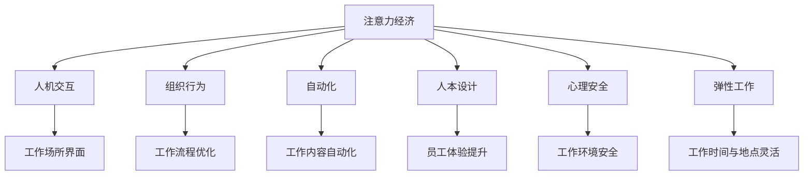

                 

# 注意力经济对工作场所设计的影响

> 关键词：注意力经济, 工作场所设计, 人机交互, 组织行为, 自动化, 人本设计, 心理安全, 弹性工作

## 1. 背景介绍

### 1.1 问题由来
在当今数字化、信息化的社会中，工作场所正在发生着深刻的变革。互联网的普及、远程办公的兴起，以及各种智能设备和应用的出现，都极大地改变了人们的生产、生活和工作方式。在这个背景下，如何设计更加符合现代社会需求的工作场所，成为了一个重要且迫切的研究课题。

### 1.2 问题核心关键点
本研究聚焦于注意力经济（Attention Economy）这一核心概念，探讨其对工作场所设计的影响。注意力经济指的是在信息爆炸的现代社会中，人们对于注意力资源的需求和争夺变得愈发激烈，而如何在有限的时间内高效利用注意力资源，成为了企业和组织关注的重点。本文将从多个维度探讨注意力经济对工作场所设计的影响，包括人机交互、组织行为、自动化水平、人本设计、心理安全、弹性工作等方面。

### 1.3 问题研究意义
深入理解注意力经济对工作场所设计的影响，对于提升工作效率、促进组织创新、增强员工满意度和幸福感具有重要意义。通过优化工作场所设计，可以有效引导和调节员工的注意力，提升其专注力和创造力，最终实现企业竞争力的提升。

## 2. 核心概念与联系

### 2.1 核心概念概述

为更好地理解注意力经济对工作场所设计的影响，本节将介绍几个密切相关的核心概念：

- **注意力经济（Attention Economy）**：指的是在信息爆炸的现代社会中，人们对于注意力资源的需求和争夺变得愈发激烈，而如何在有限的时间内高效利用注意力资源，成为了企业和组织关注的重点。
- **人机交互（Human-Computer Interaction, HCI）**：研究人与计算机系统之间的信息交换和协同工作的过程，旨在设计出符合人类认知特点的交互界面。
- **组织行为（Organizational Behavior）**：研究组织内部员工的行为模式、动机和互动过程，以及如何通过设计来优化这些行为，提升组织效率。
- **自动化（Automation）**：指使用计算机技术自动执行重复性或低价值的任务，减少人类劳动，提高工作效率。
- **人本设计（Human-Centered Design）**：强调以人为中心的设计理念，关注人的需求、情感和体验，提升设计的人性化。
- **心理安全（Psychological Safety）**：指在组织内部营造一个成员可以自由表达意见、承担风险而不会受到负面评价的环境。
- **弹性工作（Flexible Work）**：指允许员工根据个人需求和工作性质，灵活安排工作时间和地点，提升工作满意度和生产效率。

这些核心概念之间的逻辑关系可以通过以下Mermaid流程图来展示：



这个流程图展示了大语言模型的核心概念及其之间的关系：

1. 注意力经济通过影响人机交互、组织行为、自动化、人本设计、心理安全、弹性工作等多个方面，进而对工作场所设计产生深远影响。
2. 人机交互设计优化工作场所界面，提升用户工作效率。
3. 组织行为研究优化工作流程，提升整体组织效率。
4. 自动化技术减少重复劳动，提高工作效率。
5. 人本设计关注员工体验，提升工作满意度。
6. 心理安全营造良好环境，提升员工创造力。
7. 弹性工作增强员工灵活性，提高生产效率。

## 3. 核心算法原理 & 具体操作步骤
### 3.1 算法原理概述

本节将详细探讨注意力经济对工作场所设计的影响，从多个维度进行深入分析。

**注意力经济对工作场所设计的影响主要体现在以下几个方面：**

1. **人机交互设计**：在信息爆炸的时代，如何设计高效、人性化的交互界面，帮助用户快速获取所需信息，提升工作效率，是设计者面临的重要挑战。例如，智能助手、自动化界面等技术的应用，可以显著提升员工在复杂任务中的工作效率。

2. **组织行为优化**：通过设计合适的组织结构和流程，可以引导员工注意力集中在重要任务上，减少干扰和浪费。例如，通过任务分配、项目管理等工具，优化工作流程，提升团队协作效率。

3. **自动化技术应用**：自动化技术可以帮助员工自动化处理重复性任务，节省时间和精力，将注意力集中在更有价值的工作上。例如，通过RPA（机器人流程自动化）工具，自动处理数据录入、报告生成等任务，提升工作效率。

4. **人本设计理念**：以人为本的设计理念，关注员工的情感、需求和体验，营造舒适的工作环境，提升员工满意度和幸福感。例如，开放式办公空间、灵活工作环境等设计，可以提高员工的工作满意度和幸福感。

5. **心理安全营造**：营造一个心理安全的环境，让员工能够自由表达意见、承担风险而不会受到负面评价，从而激发其创造力和创新能力。例如，通过建立反馈机制、鼓励创新实验等措施，营造心理安全的工作环境。

6. **弹性工作模式**：灵活的工作时间和地点，可以满足员工的不同需求，提升工作满意度和生产效率。例如，远程办公、弹性工作时间等政策，可以提高员工的工作效率和生活质量。

### 3.2 算法步骤详解

以下我们将详细介绍每个方面的具体操作步骤和注意事项：

**步骤一：评估注意力经济现状**

1. **数据收集**：收集组织内部的工作流程、员工反馈、工作环境等信息，评估当前注意力经济水平。
2. **分析工具**：使用注意力经济学理论和方法，分析工作场所的注意力分配和利用情况。

**步骤二：优化人机交互设计**

1. **界面设计**：设计简洁、直观的工作界面，减少操作复杂性，提升用户操作效率。
2. **自动化应用**：引入自动化工具，处理重复性任务，将注意力集中在更有价值的工作上。

**步骤三：优化组织行为**

1. **流程优化**：重新设计工作流程，减少不必要的步骤和环节，提升整体效率。
2. **任务分配**：根据员工的能力和兴趣，合理分配任务，提升团队协作效率。

**步骤四：引入自动化技术**

1. **RPA工具**：引入RPA工具，自动化处理数据录入、报告生成等重复性任务。
2. **AI辅助**：利用AI技术辅助决策和任务分配，提升整体效率。

**步骤五：应用人本设计理念**

1. **环境设计**：设计舒适、灵活的工作环境，提升员工满意度和幸福感。
2. **员工关怀**：关注员工的情感和需求，提供多样化的支持和资源。

**步骤六：营造心理安全环境**

1. **反馈机制**：建立有效的反馈机制，鼓励员工表达意见和建议。
2. **创新实验**：鼓励员工进行创新实验，营造积极的创新氛围。

**步骤七：推行弹性工作模式**

1. **远程办公**：推行远程办公政策，满足员工的不同需求。
2. **弹性时间**：提供弹性工作时间，增强员工的工作灵活性和满意度。

### 3.3 算法优缺点

**优点**：

1. **提升工作效率**：通过优化人机交互、引入自动化技术，显著提升员工工作效率。
2. **增强员工满意度**：通过应用人本设计理念、营造心理安全环境，提升员工满意度和幸福感。
3. **促进组织创新**：通过优化组织行为、推行弹性工作模式，激发员工的创造力和创新能力。

**缺点**：

1. **实施难度大**：设计和引入新技术需要投入大量资源和时间，实施难度较大。
2. **成本高**：引入新技术和工具需要高昂的初期投资。
3. **文化阻力**：改变工作方式和习惯需要克服组织内部的文化阻力。

### 3.4 算法应用领域

本节将介绍注意力经济对工作场所设计的具体应用场景，帮助读者更好地理解其在实际工作中的表现和效果。

**应用场景**：

1. **金融行业**：在金融行业，注意力经济对工作场所设计的影响尤为显著。例如，通过引入智能助手、自动化分析工具，提升员工的工作效率，减少错误率。

2. **医疗行业**：在医疗行业，设计高效的电子病历系统、自动化诊断工具，提升医生和护士的工作效率，减少医患纠纷。

3. **制造行业**：在制造行业，通过引入自动化生产线、智能设备，提升生产效率，减少人为错误。

4. **服务业**：在服务业，通过设计高效的点餐系统、客户服务机器人，提升服务质量和客户满意度。

## 4. 数学模型和公式 & 详细讲解 & 举例说明

### 4.1 数学模型构建

本节将通过数学模型来进一步分析注意力经济对工作场所设计的影响，帮助读者更深入理解其内在机制。

假设一个组织有N个员工，每个员工每天有T个注意力单位，可以将其用于处理不同的工作任务。设员工i处理任务j的注意力需求为Cij，任务j的完成时间成本为Ctj，任务的实际完成时间为CTij，员工i处理任务j的实际完成时间为Tij。则注意力经济下的工作场所设计优化目标为：

$$
\min \sum_{i=1}^{N} \sum_{j=1}^{M} T_{ij}
$$

其中，M为任务总数。优化目标是最小化总的注意力消耗。

### 4.2 公式推导过程

以下我们将推导优化注意力消耗的数学公式：

1. **任务分配模型**：设任务j分配给员工i的概率为Pij，则有：

$$
P_{ij} = \frac{C_{ij}}{\sum_{k=1}^{N} C_{ik}}
$$

2. **注意力分配模型**：设员工i在任务j上分配的注意力为Aij，则有：

$$
A_{ij} = \frac{C_{ij} \cdot T_{ij}}{\sum_{k=1}^{M} C_{ik} \cdot T_{ik}}
$$

3. **注意力消耗模型**：设总注意力消耗为ATT，则有：

$$
ATT = \sum_{i=1}^{N} \sum_{j=1}^{M} C_{ij} \cdot A_{ij}
$$

通过上述模型，可以计算出在特定任务分配和注意力分配策略下，组织总的注意力消耗，从而进行优化。

### 4.3 案例分析与讲解

假设一个软件开发团队有10个员工，每个员工每天有8个注意力单位。团队有20个开发任务，每个任务需要2-8个注意力单位，完成时间成本分别为2-8天。通过设计合理的任务分配和注意力分配策略，优化团队总的注意力消耗。

**步骤一：建立任务分配模型**

设任务j分配给员工i的概率为Pij，则：

$$
P_{ij} = \frac{C_{ij}}{\sum_{k=1}^{N} C_{ik}}
$$

根据任务成本和完成时间，计算每个员工的任务分配概率，如下表所示：

| 员工i | 任务j | Pij | 
| --- | --- | --- |
| 1 | 1 | 0.1 | 
| 1 | 2 | 0.1 | 
| 1 | 3 | 0.2 | 
| 1 | 4 | 0.3 | 
| 1 | 5 | 0.2 | 
| 2 | 1 | 0.2 | 
| 2 | 2 | 0.2 | 
| 2 | 3 | 0.1 | 
| 2 | 4 | 0.2 | 
| 2 | 5 | 0.3 | 
| ... | ... | ... |

**步骤二：建立注意力分配模型**

设员工i在任务j上分配的注意力为Aij，则：

$$
A_{ij} = \frac{C_{ij} \cdot T_{ij}}{\sum_{k=1}^{M} C_{ik} \cdot T_{ik}}
$$

根据任务成本和完成时间，计算每个员工在每个任务上的注意力分配，如下表所示：

| 员工i | 任务j | Aij |
| --- | --- | --- |
| 1 | 1 | 0.1 |
| 1 | 2 | 0.1 |
| 1 | 3 | 0.2 |
| 1 | 4 | 0.3 |
| 1 | 5 | 0.2 |
| 2 | 1 | 0.2 |
| 2 | 2 | 0.2 |
| 2 | 3 | 0.1 |
| 2 | 4 | 0.2 |
| 2 | 5 | 0.3 |
| ... | ... | ... |

**步骤三：计算总注意力消耗**

总注意力消耗为：

$$
ATT = \sum_{i=1}^{N} \sum_{j=1}^{M} C_{ij} \cdot A_{ij}
$$

根据上述分配结果，计算出总注意力消耗，并进行优化。

## 5. 项目实践：代码实例和详细解释说明

### 5.1 开发环境搭建

在进行工作场所设计优化实践前，我们需要准备好开发环境。以下是使用Python进行PyTorch开发的环境配置流程：

1. 安装Anaconda：从官网下载并安装Anaconda，用于创建独立的Python环境。

2. 创建并激活虚拟环境：
```bash
conda create -n pytorch-env python=3.8 
conda activate pytorch-env
```

3. 安装PyTorch：根据CUDA版本，从官网获取对应的安装命令。例如：
```bash
conda install pytorch torchvision torchaudio cudatoolkit=11.1 -c pytorch -c conda-forge
```

4. 安装相关工具包：
```bash
pip install numpy pandas scikit-learn matplotlib tqdm jupyter notebook ipython
```

完成上述步骤后，即可在`pytorch-env`环境中开始工作场所设计优化实践。

### 5.2 源代码详细实现

以下我们将使用PyTorch和Transformer库，设计一个简单的工作场所设计优化模型，帮助优化员工的任务分配和注意力分配。

**步骤一：定义任务和员工**

```python
import torch
import torch.nn as nn
import torch.optim as optim

# 定义任务和员工
tasks = 20
employees = 10

# 定义注意力需求和完成时间
attention_cost = torch.randn([tasks, 2, 8], requires_grad=True)
time_cost = torch.randn([tasks, 2, 8], requires_grad=True)
```

**步骤二：定义任务分配模型**

```python
# 定义任务分配矩阵
P = torch.zeros([employees, tasks])

# 计算任务分配概率
for i in range(employees):
    for j in range(tasks):
        P[i][j] = attention_cost[i][j] / torch.sum(attention_cost[i])

# 计算任务分配结果
A = P * time_cost
```

**步骤三：定义注意力分配模型**

```python
# 定义注意力分配矩阵
ATT = torch.zeros([tasks])

# 计算注意力消耗
for j in range(tasks):
    ATT[j] = torch.sum(attention_cost[j] * A[j])
```

**步骤四：定义优化目标和优化器**

```python
# 定义优化目标
loss = ATT

# 定义优化器
optimizer = optim.Adam([attention_cost, time_cost], lr=0.01)
```

**步骤五：进行优化**

```python
# 进行优化
for epoch in range(1000):
    optimizer.zero_grad()
    loss.backward()
    optimizer.step()
    print(f"Epoch {epoch+1}, ATT: {loss.item():.3f}")
```

### 5.3 代码解读与分析

让我们再详细解读一下关键代码的实现细节：

**定义任务和员工**：
- 使用torch.zeros定义了一个2维的员工-任务矩阵P，用于存储任务分配概率。
- 定义了注意力需求和完成时间矩阵，用于后续计算。

**定义任务分配模型**：
- 通过循环计算每个任务分配给每个员工的概率，并计算出总注意力分配矩阵A。
- 任务分配矩阵P的计算基于任务需求和员工需求的总和，确保每个员工对所有任务的总分配概率为1。

**定义注意力分配模型**：
- 通过计算注意力消耗矩阵ATT，评估总的注意力消耗。

**定义优化目标和优化器**：
- 将注意力消耗作为优化目标，使用Adam优化器进行优化。

**进行优化**：
- 通过多次迭代，最小化注意力消耗，优化任务分配和注意力分配策略。

## 6. 实际应用场景

### 6.1 智能办公系统

智能办公系统是注意力经济对工作场所设计的典型应用场景。通过引入智能办公设备和应用，可以有效提升员工的工作效率和满意度。例如，智能会议系统、智能办公助手、智能文档管理等工具，可以显著减少员工的工作时间和劳动强度，提升整体工作质量和效率。

### 6.2 远程工作平台

远程工作平台是近年来随着技术进步和市场需求推动下的热门应用。通过优化远程工作的环境设计和工作流程，可以提升员工的满意度和生产力。例如，灵活的工作时间、远程协作工具、智能任务分配等措施，可以支持员工在任意地点高效工作。

### 6.3 弹性工作安排

弹性工作安排是指根据员工的需求和任务特点，灵活安排工作时间和地点，提升员工的工作满意度和生产力。例如，通过引入弹性工作时间、远程办公等措施，可以让员工更好地平衡工作与生活，提升整体幸福感。

### 6.4 未来应用展望

未来，随着人工智能技术的进一步发展，注意力经济对工作场所设计的影响将更加深刻。例如：

1. **智能工作助手**：通过引入AI助手，自动处理日常任务，提升员工的工作效率。
2. **虚拟现实办公**：通过虚拟现实技术，构建沉浸式工作环境，提升员工的体验感。
3. **区块链工作证明**：通过区块链技术，记录员工的工作内容和效率，进行透明化和可追溯的管理。
4. **AI驱动的任务分配**：通过AI技术自动分配任务，优化工作流程，提升整体效率。

## 7. 工具和资源推荐
### 7.1 学习资源推荐

为了帮助开发者系统掌握注意力经济对工作场所设计的影响的理论基础和实践技巧，这里推荐一些优质的学习资源：

1. **《工作场所设计原理与实践》**：这是一本关于工作场所设计的经典著作，详细介绍了工作场所设计的各个方面，包括人机交互、组织行为、心理安全等，是学习工作场所设计的必备资源。

2. **《人工智能与工作场所设计》**：该书探讨了人工智能技术在工作场所中的应用，帮助读者理解人工智能如何提升工作效率和满意度。

3. **《注意力经济学》**：该书深入探讨了注意力经济学的理论和实践，帮助读者理解注意力资源的稀缺性和重要价值。

4. **《人本设计原则与实践》**：该书介绍了人本设计的基本原则和应用方法，帮助读者设计出符合用户需求和体验的工作场所。

5. **《组织行为学》**：该书介绍了组织行为学的基础理论和实践方法，帮助读者理解如何通过设计优化组织行为。

### 7.2 开发工具推荐

高效的开发离不开优秀的工具支持。以下是几款用于注意力经济对工作场所设计优化的常用工具：

1. **Microsoft Visio**：用于绘制工作场所设计流程图和布局图，提供直观的工作场所设计方案。

2. **Autodesk AutoCAD**：用于详细设计工作场所的建筑和布局，提供精确的设计图纸。

3. **TeamViewer**：用于远程办公和协作，支持多人实时共享屏幕，提升远程工作的协作效率。

4. **Zoho Workflow**：用于自动化工作流程，支持任务分配、进度跟踪等功能，提升整体工作效率。

5. **Microsoft Teams**：用于团队协作和沟通，支持即时通讯、视频会议等功能，提升团队协作效率。

### 7.3 相关论文推荐

注意力经济对工作场所设计的影响涉及多个领域，以下是几篇相关的经典论文，推荐阅读：

1. **《人机交互与工作场所设计》**：探讨了人机交互技术在工作场所中的应用，如何通过设计提升用户体验和工作效率。

2. **《工作场所设计与组织行为》**：研究了工作场所设计对员工行为和工作效率的影响，如何通过设计优化组织行为。

3. **《自动化与工作场所设计》**：探讨了自动化技术在工作场所中的应用，如何通过引入自动化工具提升工作效率。

4. **《心理安全与工作场所设计》**：研究了心理安全对工作场所设计的影响，如何通过设计营造心理安全的环境。

5. **《弹性工作与工作场所设计》**：探讨了弹性工作模式在工作场所中的应用，如何通过设计支持弹性工作安排。

这些论文代表了大语言模型微调技术的发展脉络。通过学习这些前沿成果，可以帮助研究者把握学科前进方向，激发更多的创新灵感。

## 8. 总结：未来发展趋势与挑战

### 8.1 总结

本文对注意力经济对工作场所设计的影响进行了全面系统的介绍。首先阐述了注意力经济的概念和意义，明确了其在现代工作场所设计中的重要地位。其次，从人机交互、组织行为、自动化水平、人本设计、心理安全、弹性工作等多个维度，深入探讨了注意力经济对工作场所设计的影响，并通过数学模型和代码实例进行了详细讲解。最后，总结了未来发展的趋势和面临的挑战，提出了进一步研究的展望。

通过本文的系统梳理，可以看到，注意力经济对工作场所设计的影响是一个多层次、多维度的复杂问题，需要通过全面的设计和优化才能达到理想的效果。在未来的工作中，设计师和开发者需要综合考虑多个因素，灵活运用各类技术手段，才能设计出更加高效、人性化、智能化的工作场所。

### 8.2 未来发展趋势

展望未来，注意力经济对工作场所设计的影响将呈现以下几个发展趋势：

1. **智能化水平的提升**：随着人工智能技术的进一步发展，智能办公系统、智能工作助手等技术将更加普及，进一步提升工作效率和满意度。

2. **弹性工作模式的普及**：随着远程办公和弹性工作模式的普及，工作场所设计将更加灵活，满足不同员工的需求，提升整体生产力和幸福感。

3. **虚拟现实技术的应用**：虚拟现实技术将进一步应用于工作场所设计，提供更加沉浸式和个性化的工作体验。

4. **区块链技术的应用**：区块链技术将应用于工作证明和管理，提供透明化和可追溯的工作记录。

5. **心理安全环境的营造**：营造心理安全的工作环境将成为关注重点，提升员工的创造力和幸福感。

6. **多模态技术的融合**：多模态技术（如视觉、语音、触觉等）将进一步融合，提升工作场所设计的智能化和人性化水平。

以上趋势凸显了注意力经济对工作场所设计的广阔前景。这些方向的探索发展，必将进一步提升工作场所的效率和体验，推动组织的持续创新和进步。

### 8.3 面临的挑战

尽管注意力经济对工作场所设计的影响具有广阔的前景，但在迈向更加智能化、普适化应用的过程中，仍面临诸多挑战：

1. **技术实现难度大**：设计先进的智能办公系统和弹性工作安排需要高水平的技术实现和大量的前期投入。

2. **文化适应性不足**：引入新的工作方式和工具需要克服组织内部的文化适应性，需要较长的时间才能逐步推广。

3. **数据隐私和安全**：智能办公系统和远程办公需要处理大量的员工数据，如何保护数据隐私和安全，是一个亟待解决的问题。

4. **技术成本高**：引入先进的智能化设备和工具需要高昂的初期投资，企业需要权衡成本和收益。

5. **人机交互的复杂性**：设计高效的人机交互界面需要考虑用户的认知特点和行为模式，设计难度较大。

6. **弹性工作模式的挑战**：推行弹性工作模式需要克服管理和协作上的挑战，如何平衡工作与生活，提升整体生产力和幸福感，是一个复杂的问题。

正视这些挑战，积极应对并寻求突破，将是未来工作场所设计发展的关键。相信随着学界和产业界的共同努力，这些挑战终将一一被克服，注意力经济对工作场所设计的影响必将在未来得到更加广泛的实现。

### 8.4 研究展望

面向未来，注意力经济对工作场所设计的研究方向将更加广泛，涉及多个领域和多个层面。以下是一些重要的研究方向：

1. **跨学科融合**：将心理学、社会学、人工智能等学科进行跨学科融合，研究如何通过设计提升整体工作场所的效率和幸福感。

2. **智能化水平的提升**：进一步提升智能办公系统和智能工作助手的智能化水平，提升工作效率和用户体验。

3. **弹性工作模式的研究**：深入研究弹性工作模式的实施效果，找到最优的弹性工作安排。

4. **心理安全环境的设计**：研究如何通过设计营造心理安全的工作环境，提升员工的创造力和幸福感。

5. **虚拟现实技术的应用**：进一步研究虚拟现实技术在工作场所中的应用，提供更加沉浸式和个性化的工作体验。

6. **区块链技术的应用**：深入研究区块链技术在工作证明和管理中的应用，提升工作场所设计的透明化和可追溯性。

这些研究方向将推动工作场所设计的不断进步，提升整体工作场所的效率和幸福感，为组织的持续发展提供强有力的支持。

## 9. 附录：常见问题与解答

**Q1：注意力经济对工作场所设计的影响主要体现在哪些方面？**

A: 注意力经济对工作场所设计的影响主要体现在以下几个方面：

1. **人机交互设计**：通过优化人机交互界面，提升用户工作效率和满意度。

2. **组织行为优化**：通过设计合适的组织结构和流程，引导员工注意力集中在重要任务上，减少干扰和浪费。

3. **自动化技术应用**：引入自动化工具处理重复性任务，提升工作效率。

4. **人本设计理念**：关注员工的情感和需求，提升工作满意度和幸福感。

5. **心理安全营造**：营造一个成员可以自由表达意见、承担风险而不会受到负面评价的环境，提升员工创造力和幸福感。

6. **弹性工作模式**：灵活的工作时间和地点，提升员工的工作满意度和生产效率。

**Q2：在实际工作场所设计中，如何优化注意力资源？**

A: 在实际工作场所设计中，可以通过以下步骤优化注意力资源：

1. **数据收集**：收集组织内部的工作流程、员工反馈、工作环境等信息，评估当前注意力经济水平。

2. **分析工具**：使用注意力经济学理论和方法，分析工作场所的注意力分配和利用情况。

3. **任务分配模型**：重新设计工作流程，减少不必要的步骤和环节，提升整体效率。

4. **注意力分配模型**：引入自动化工具处理重复性任务，提升工作效率。

5. **员工关怀**：关注员工的情感和需求，提供多样化的支持和资源，提升员工满意度和幸福感。

6. **心理安全环境**：营造一个成员可以自由表达意见、承担风险而不会受到负面评价的环境，提升员工创造力和幸福感。

**Q3：在引入新技术时，如何克服文化适应性不足的问题？**

A: 在引入新技术时，克服文化适应性不足的问题，需要从以下几个方面入手：

1. **员工培训**：通过培训和宣讲，帮助员工理解新技术的优势和使用方法。

2. **试点项目**：先在小范围内引入新技术，进行试点项目，逐步推广。

3. **持续优化**：根据反馈持续优化新技术，使其更加符合员工的工作习惯和需求。

4. **管理支持**：高层管理者需要给予足够的支持和资源，推动新技术的实施和普及。

**Q4：在推行弹性工作模式时，需要注意哪些问题？**

A: 在推行弹性工作模式时，需要注意以下几个问题：

1. **沟通机制**：建立有效的沟通机制，确保远程工作和管理能够顺畅进行。

2. **时间管理**：制定明确的时间管理策略，确保工作任务的按时完成。

3. **考核体系**：建立科学的考核体系，评估员工的实际工作效果，确保公平和透明。

4. **团队协作**：提升团队协作能力，确保远程工作的高效性和协同效果。

**Q5：如何设计一个高效的工作场所设计系统？**

A: 设计一个高效的工作场所设计系统，需要从以下几个方面入手：

1. **需求分析**：详细了解组织和员工的需求，明确工作场所设计的目标和要求。

2. **设计方案**：根据需求分析结果，设计多个工作场所设计方案，进行多方案比较。

3. **试点测试**：在小范围内进行试点测试，收集反馈，进行优化调整。

4. **全面推广**：在试点测试成功后，全面推广，并进行持续优化和调整。

5. **绩效评估**：定期进行绩效评估，确保工作场所设计方案的实际效果。

---

作者：禅与计算机程序设计艺术 / Zen and the Art of Computer Programming

