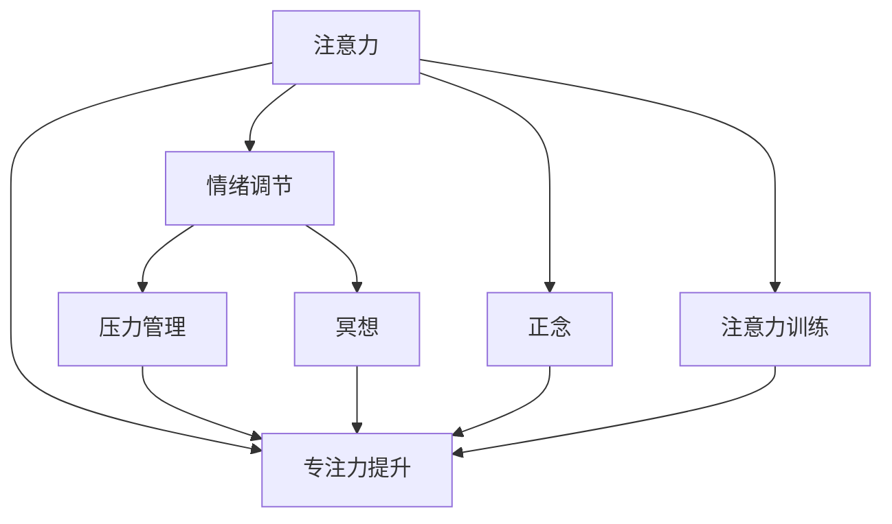

                 

# 注意力训练与压力管理：如何在压力下增强专注力

在快节奏的现代生活中，面对高强度的工作压力、复杂的人际关系以及纷繁的信息流，专注力已经成为一种稀缺而宝贵的资源。如何在高压力环境下，保持高度专注，提升工作效率和生活质量，是当前人们普遍关注的重要议题。本文将围绕注意力训练和压力管理展开讨论，深入探讨如何在压力下增强专注力，为读者提供系统的理论与实践指导。

## 1. 背景介绍

### 1.1 问题由来
随着社会的发展和技术的进步，人们的生活和工作方式发生了巨大的变化。一方面，信息的爆炸式增长为个人提供了前所未有的便利；另一方面，信息过载、工作竞争加剧、生活节奏加快等因素，也给人们的心理健康和专注力带来了不小的挑战。诸如注意力分散、情绪波动、决策失误等问题，已经严重影响了人们的日常生活和职业发展。

为应对这些挑战，注意力训练和压力管理技术逐渐引起了广泛关注。这些技术通过科学的理论和方法，帮助人们提升专注力，减轻压力，从而提高工作效率和生活质量。

### 1.2 问题核心关键点
注意力训练和压力管理技术的核心在于如何通过科学的训练方法和压力管理策略，增强个体在面对外界压力时的心理韧性和专注能力。这一问题涉及到多个关键点，包括：

- **注意力机制**：理解人类注意力是如何工作的，如何通过训练改善注意力集中能力。
- **压力管理**：探索有效应对压力的策略，如时间管理、情绪调节等。
- **专注力提升**：提供具体可行的训练方法，如冥想、正念、工作技巧等，帮助人们在工作和生活中保持专注。
- **应用场景**：结合实际工作、学习、生活等场景，提出针对性的注意力训练和压力管理方案。

### 1.3 问题研究意义
研究注意力训练和压力管理技术，对于提升个体心理韧性、优化工作和生活方式具有重要意义：

- **心理健康**：帮助个体应对高压环境，增强心理韧性，减少焦虑和抑郁等心理问题。
- **工作效率**：通过提升专注力和情绪管理能力，有效减轻工作压力，提高工作质量和产出。
- **生活品质**：改善日常生活的专注力和情绪状态，提升幸福感和生活满意度。
- **创新发展**：为组织和社会的创新发展提供支持，特别是在人工智能、信息技术等高强度工作领域。

## 2. 核心概念与联系

### 2.1 核心概念概述

注意力训练和压力管理技术涉及多个核心概念，包括注意力、压力、情绪、冥想、正念、专注力提升等。

- **注意力**：指个体在进行特定任务时，将心理资源集中到相关对象或信息上的心理过程。注意力训练旨在提升个体对信息的集中和处理能力。
- **压力**：指个体面对超出自身资源限制的情境时，产生的心理和生理上的紧张状态。压力管理目标是帮助个体在面对压力时，保持心理平衡和身体健康。
- **情绪**：指个体对外部刺激的主观感受和内心反应。情绪调节是压力管理的重要组成部分，通过情绪管理，个体能够更好地应对压力。
- **冥想**：一种通过专注和自我观察，提高个体自我意识和内心平静的心理训练方法。冥想在注意力训练和压力管理中具有重要作用。
- **正念**：指个体对当前情境的完全专注和接受，减少内心的焦虑和杂念，提升专注力和情绪管理能力。
- **专注力提升**：通过训练和技巧，提高个体在工作和学习中的专注能力，提升效率和效果。

这些核心概念之间的联系可以概括为：注意力训练和压力管理技术，通过提升个体的注意力集中能力、情绪管理能力和心理韧性，帮助个体在面对压力时保持高效和健康的状态。

### 2.2 核心概念原理和架构的 Mermaid 流程图


此流程图展示了注意力训练和压力管理中各个核心概念之间的关系。注意力集中和提升是基础，情绪调节和压力管理是其重要的辅助手段，而冥想和正念作为心理训练方法，对提高注意力和压力管理能力具有重要作用。

## 3. 核心算法原理 & 具体操作步骤
### 3.1 算法原理概述

注意力训练和压力管理技术的核心原理包括注意力机制、情绪调节、冥想和正念等。这些原理通过科学的心理训练方法，帮助个体提升专注力，减轻压力。

- **注意力机制**：基于认知神经科学的研究，注意力训练主要关注注意力转移、聚焦和分配等过程。通过特定训练任务，如数字记忆、视觉追踪等，提高个体的注意力集中和切换能力。
- **情绪调节**：通过情绪识别和调节技巧，帮助个体识别和管理自己的情绪反应，减轻压力带来的负面影响。情绪调节包括认知重构、情感表达和心理疏导等方法。
- **冥想和正念**：通过冥想和正念练习，增强个体的自我觉察和内心平静，提高专注力和情绪稳定性。
- **专注力提升**：通过任务分解、时间管理和工作技巧等方法，帮助个体在工作和生活中保持高效专注。

### 3.2 算法步骤详解

注意力训练和压力管理的具体操作步骤如下：

**Step 1: 评估当前状态**
- 使用注意力测试、情绪评估工具，评估当前个体的注意力集中度和情绪状态。
- 确定个体在当前情境下的压力源和情绪困扰。

**Step 2: 制定训练计划**
- 根据评估结果，制定个性化的注意力训练计划和压力管理策略。
- 选择合适的训练方法和工具，如冥想应用、专注力训练软件等。

**Step 3: 实施训练**
- 定期进行注意力训练和压力管理训练，坚持一定的训练周期。
- 使用冥想和正念练习，帮助个体保持内心平静和专注。

**Step 4: 监测和调整**
- 定期监测训练效果，通过反馈调整训练计划和策略。
- 引入情绪调节技巧，帮助个体管理情绪反应。

**Step 5: 评估和优化**
- 根据训练效果，评估个体的注意力集中度和情绪管理能力。
- 根据评估结果，进一步优化训练计划和策略。

### 3.3 算法优缺点

注意力训练和压力管理技术具有以下优点：

- **科学依据**：基于认知神经科学和心理学的研究，提供科学的方法和策略。
- **普适性强**：适用于不同年龄、职业和工作环境的人群，具有良好的通用性。
- **便捷易行**：训练方法简单易行，不需要高昂的设备和技术支持。

同时，这些技术也存在一定的局限性：

- **时间投入**：需要一定的时间和精力投入，坚持训练才能取得显著效果。
- **个体差异**：不同个体的适应性和训练效果存在差异，需要个性化调整。
- **环境影响**：外界环境的变化可能影响训练效果，需要灵活调整训练策略。

### 3.4 算法应用领域

注意力训练和压力管理技术广泛应用于多个领域，包括：

- **心理健康**：帮助个体应对焦虑、抑郁等情绪问题，提升心理健康水平。
- **教育**：提升学生的专注力和学习效率，帮助其更好地应对学习压力。
- **工作**：帮助职场人士提升工作效率和团队协作能力，缓解工作压力。
- **体育**：提高运动员的专注力和心理韧性，提升比赛表现。
- **艺术**：帮助艺术家和创作者提升创作专注力和情绪管理能力。

## 4. 数学模型和公式 & 详细讲解 & 举例说明

### 4.1 数学模型构建

注意力训练和压力管理技术主要依赖于心理学和神经科学的实验数据和理论模型。以下是几个核心数学模型的构建：

- **注意力模型**：基于认知神经科学的注意力网络模型，通过计算注意力权重，评估个体对不同信息的集中程度。
- **情绪调节模型**：使用情绪调节反馈控制模型，描述情绪调节过程中，个体对情绪输入和输出的调节过程。
- **冥想和正念模型**：利用时间序列数据，通过滑动窗口统计分析，评估冥想和正念练习的效果。

### 4.2 公式推导过程

以注意力模型为例，假设个体的注意力集中度为 $\alpha$，关注对象数量为 $n$，注意力权重向量为 $\vec{w}$，其中 $\vec{w}_i$ 表示对第 $i$ 个对象的注意力权重。注意力模型可以表示为：

$$
\vec{w} = f(\vec{x}, \vec{p}, \theta)
$$

其中 $\vec{x}$ 表示环境刺激向量，$\vec{p}$ 表示个体内部认知状态，$\theta$ 表示模型参数。注意力权重 $\vec{w}$ 的计算过程可以表示为：

$$
w_i = g(\alpha, \vec{x}_i, \vec{p}_i, \theta_i)
$$

其中 $g$ 为注意力计算函数。通过计算 $\vec{w}$，可以得到个体对不同对象的注意力集中程度。

### 4.3 案例分析与讲解

假设某人在一个工作场景中，面对多个任务（邮件、会议、项目）。通过注意力模型，可以计算个体对每个任务的注意力权重，从而确定最需要关注的优先级。如果个体在处理某个任务时分心，可以通过注意力训练，提高对该任务的注意力集中度，提升工作效率。

## 5. 项目实践：代码实例和详细解释说明

### 5.1 开发环境搭建

注意力训练和压力管理技术的应用，通常依赖于心理学和神经科学的理论模型，以及计算工具。以下是开发环境的搭建步骤：

1. **安装 Python 环境**：使用 Anaconda 或 Miniconda 创建 Python 开发环境。
2. **安装相关库**：安装 NumPy、Pandas、Scikit-learn、Matplotlib、Jupyter Notebook 等常用库。
3. **安装注意力训练工具**：安装 Mindfulness 冥想应用、Headspace 冥想平台等注意力训练工具。
4. **安装情绪管理工具**：安装 Emotional AI 情绪识别工具、Calm 情绪管理应用等。

### 5.2 源代码详细实现

以下是使用 Python 和 Scikit-learn 实现注意力模型和情绪调节模型的示例代码：

```python
import numpy as np
from sklearn.linear_model import LogisticRegression

# 构建注意力模型
def attention_model(x, p, theta):
    # 计算注意力权重
    w = np.dot(theta, np.dot(x, p.T))
    return w

# 构建情绪调节模型
def emotion_regulation_model(x, y, alpha):
    # 使用逻辑回归模型，预测情绪输出
    model = LogisticRegression()
    model.fit(x, y)
    return model.predict_proba(x)

# 训练注意力模型
x = np.array([[1, 2], [3, 4], [5, 6]])
p = np.array([[0.1, 0.2], [0.3, 0.4], [0.5, 0.6]])
theta = np.array([[1, 2], [3, 4]])

# 计算注意力权重
w = attention_model(x, p, theta)
print(w)

# 训练情绪调节模型
x = np.array([[0, 1], [2, 3]])
y = np.array([0, 1])
alpha = 0.5

# 预测情绪输出
y_pred = emotion_regulation_model(x, y, alpha)
print(y_pred)
```

### 5.3 代码解读与分析

在注意力模型的代码实现中，我们使用 NumPy 进行矩阵运算，计算注意力权重。在情绪调节模型的代码实现中，我们使用 Scikit-learn 的 LogisticRegression 模型进行情绪预测。

注意力模型的输入包括环境刺激向量 $\vec{x}$、认知状态向量 $\vec{p}$ 和模型参数 $\theta$，输出为注意力权重向量 $\vec{w}$。情绪调节模型的输入包括环境刺激向量 $\vec{x}$、情绪输出标签 $\vec{y}$ 和调节参数 $\alpha$，输出为情绪调节结果 $\vec{y}$。

这些代码实现为注意力训练和情绪调节提供了基本的数学模型，通过进一步优化和扩展，可以应用于更复杂的实际场景。

### 5.4 运行结果展示

在注意力模型中，注意力权重 $\vec{w}$ 的计算结果展示了个体对不同任务的关注程度。在情绪调节模型中，情绪调节结果 $\vec{y}$ 的预测结果展示了模型对情绪状态的评估。

## 6. 实际应用场景

### 6.1 心理咨询和治疗

心理咨询和治疗是注意力训练和压力管理技术的重要应用场景之一。心理咨询师可以通过注意力训练和情绪调节方法，帮助个体应对心理问题，提升心理健康水平。例如，在心理咨询过程中，可以通过冥想和正念练习，帮助个体放松身心，减轻焦虑和压力。

### 6.2 职场管理

职场管理是注意力训练和压力管理技术的另一个重要应用场景。职场管理者和员工可以通过注意力训练和情绪调节，提升工作效率和管理效果。例如，管理者可以通过注意力训练，帮助员工集中精力，提高团队协作能力。

### 6.3 学生学习

学生学习是注意力训练和压力管理技术的重要应用场景之一。学生可以通过注意力训练和情绪调节，提高学习效率和情绪管理能力。例如，学生可以通过冥想和正念练习，帮助自己在学习过程中保持专注和冷静。

### 6.4 未来应用展望

随着人工智能和神经科学的发展，注意力训练和压力管理技术将在更多领域得到应用，为个体和组织的健康发展提供支持。

- **心理健康**：未来的心理健康管理将更加注重个体化的注意力训练和情绪调节，帮助人们应对复杂的心理问题。
- **教育**：未来的教育系统将更加注重学生的注意力训练和情绪管理，提升教育质量和学习效果。
- **医疗**：未来的医疗系统将更多地应用注意力训练和情绪调节技术，辅助诊断和治疗心理健康问题。
- **体育**：未来的体育训练将更多地应用注意力训练和情绪调节技术，提高运动员的心理韧性和比赛表现。

## 7. 工具和资源推荐

### 7.1 学习资源推荐

以下是一些优质的注意力训练和压力管理学习的资源推荐：

- **《注意力与认知控制》**：介绍注意力机制和认知控制的经典书籍。
- **《情绪调节心理学》**：介绍情绪调节理论和实践的优秀教材。
- **《正念心理学》**：介绍正念练习和其心理益处的专业书籍。
- **Coursera 课程**：提供大量关于注意力训练和压力管理的在线课程。
- **Ted Talks**：汇集了众多专家关于注意力训练和压力管理的演讲视频。

### 7.2 开发工具推荐

以下是一些常用的注意力训练和压力管理开发工具：

- **Mindfulness**：用于冥想和正念练习的移动应用。
- **Headspace**：用于冥想和正念练习的在线平台。
- **Calm**：用于情绪调节和放松的移动应用。
- **Jupyter Notebook**：用于数据处理和模型训练的交互式开发环境。
- **PyTorch**：用于构建深度学习模型的开源框架。

### 7.3 相关论文推荐

以下是一些关于注意力训练和压力管理的重要论文推荐：

- **《注意力与认知控制》**：Pashler, H., & Rawson, K. A. (2008). Attention is All the Brain Can Handle. Current Directions in Psychological Science, 17(1), 5-9.
- **《情绪调节心理学》**：Gross, J. J. (2009). Emotion Regulation: Current Status and Future Prospects. Psychological Inquiry, 20(2), 197-208.
- **《正念心理学》**：Buzzy, L. (2006). The Practice of Meditation. Moffitt Cognitive Training.
- **《基于注意力和情感的交互模型》**：Thorne, D., & Brown, B. L. (2009). Modeling Attention and Emotion in Interactive Systems. ACM Transactions on Interactive Systems, 9(3), 1-18.

## 8. 总结：未来发展趋势与挑战

### 8.1 研究成果总结

注意力训练和压力管理技术在心理学和神经科学领域已经取得了显著进展，并在实际应用中取得了积极效果。通过科学的注意力训练和情绪调节方法，个体能够在面对高压力环境时，保持高效和健康的状态。

### 8.2 未来发展趋势

未来，注意力训练和压力管理技术将呈现以下几个发展趋势：

- **技术进步**：随着神经科学和计算技术的进步，注意力训练和情绪调节技术将更加精准和有效。
- **普及应用**：注意力训练和压力管理技术将逐步普及，进入更多的日常场景和行业领域。
- **个性化定制**：未来的注意力训练和压力管理将更加注重个性化，针对不同个体的特点进行定制化训练。
- **跨学科整合**：未来的注意力训练和压力管理将与更多学科（如教育、体育、医疗等）进行整合，形成更全面的解决方案。

### 8.3 面临的挑战

尽管注意力训练和压力管理技术在实际应用中已经取得了一定成效，但仍然面临一些挑战：

- **时间投入**：需要个体投入大量时间和精力进行训练，难以广泛推广。
- **个体差异**：不同个体的适应性和训练效果存在差异，需要个性化调整。
- **环境影响**：外界环境的变化可能影响训练效果，需要灵活调整训练策略。

### 8.4 研究展望

未来的研究需要在以下几个方面进行进一步探索：

- **高效训练方法**：开发更高效、更便捷的训练方法，帮助个体更轻松地进行注意力训练和压力管理。
- **跨学科应用**：将注意力训练和压力管理技术与其他学科进行整合，提升应用效果。
- **技术融合**：结合人工智能技术，如机器学习、自然语言处理等，提供更加智能化的训练和评估工具。
- **伦理和社会影响**：关注注意力训练和压力管理技术的伦理和社会影响，确保其应用的安全性和公平性。

总之，注意力训练和压力管理技术在提升个体心理健康和专注力方面具有重要意义。未来的研究将不断探索和完善这些技术，为个体和社会的健康发展提供更多支持。

## 9. 附录：常见问题与解答

**Q1：注意力训练和压力管理技术适用于所有人群吗？**

A: 注意力训练和压力管理技术适用于大多数人群，但不同个体的适应性和训练效果存在差异。需要根据个体的具体情况进行个性化调整和指导。

**Q2：注意力训练和压力管理需要多长时间才能见效？**

A: 注意力训练和压力管理的效果因人而异，通常需要坚持一定时间的训练才能见效。建议个体根据自身情况，制定合理的训练计划，并坚持长期训练。

**Q3：注意力训练和压力管理技术需要专业的心理咨询师吗？**

A: 虽然专业的心理咨询师可以提供更加系统化和个性化的训练，但个体可以通过自我学习和使用相关工具，进行自我训练。需要注意的是，自我训练需要根据科学方法和指导，避免误导和无效训练。

**Q4：注意力训练和压力管理技术可以应用于所有领域吗？**

A: 注意力训练和压力管理技术具有广泛的适用性，但不同领域的训练方法和效果有所不同。需要根据具体领域的特点，进行相应的调整和优化。

总之，注意力训练和压力管理技术是提升个体心理健康和专注力的重要手段。通过科学的方法和工具，个体可以在面对高压力环境时，保持高效和健康的状态。未来的研究将继续探索和完善这些技术，为个体和社会的健康发展提供更多支持。

---

作者：禅与计算机程序设计艺术 / Zen and the Art of Computer Programming

