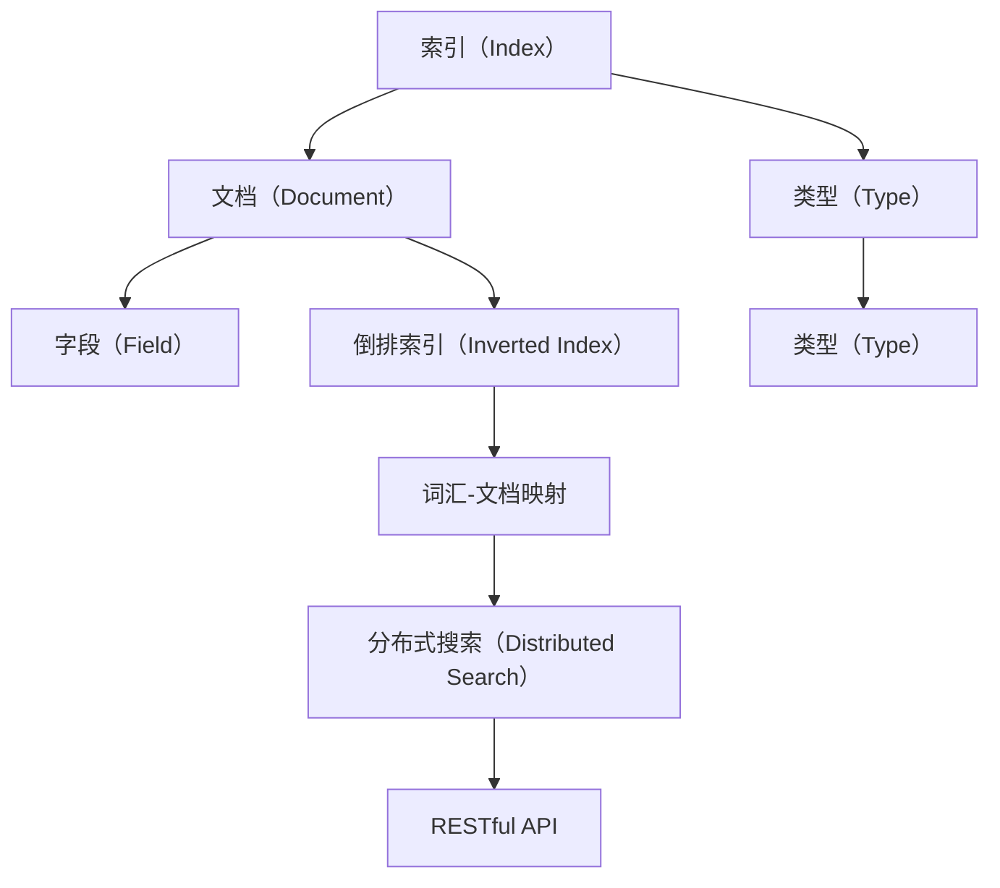

                 

### 文章标题

ElasticSearch原理与代码实例讲解

> 关键词：ElasticSearch，全文搜索，索引，倒排索引，查询，分布式搜索，RESTful API

> 摘要：本文将深入探讨ElasticSearch的原理，包括其核心概念、架构和工作机制。通过具体的代码实例，我们将详细了解如何搭建ElasticSearch环境，实现数据的索引和查询，以及如何进行分布式搜索。文章旨在帮助读者理解ElasticSearch的工作原理，掌握其在实际项目中的应用。

### 背景介绍（Background Introduction）

ElasticSearch是一个基于Lucene的分布式、RESTful搜索引擎，它提供了强大的全文搜索功能，并且易于扩展和部署。ElasticSearch被广泛应用于各种场景，如日志分析、网站搜索、实时监控等。其背后的原理和架构是理解其强大功能的关键。

在传统的搜索引擎中，通常会使用正向索引来存储和检索文档。正向索引将每个文档的词频信息存储在单独的表中，通过逐个匹配文档来检索关键词。然而，这种方法的查询效率较低，特别是在处理大规模数据时。

相比之下，ElasticSearch采用倒排索引（Inverted Index）来提高查询效率。倒排索引将文档中的词频信息反向存储，形成词-文档的映射关系。这使得ElasticSearch能够快速定位包含特定关键词的文档，从而实现高效的搜索。

### 核心概念与联系（Core Concepts and Connections）

#### 1. 索引（Index）

索引是ElasticSearch中用于存储相关数据的数据库。每个索引可以包含多个类型（Type），每个类型是一组具有相似属性的文档。从ElasticSearch 7.0开始，类型被废弃，所有文档都被存储在单个类型下。

#### 2. 文档（Document）

文档是ElasticSearch中的数据单元，它是一个字段（Field）的集合。每个文档都有一个唯一的ID，可以使用此ID进行检索和更新。文档通常以JSON格式存储。

#### 3. 倒排索引（Inverted Index）

倒排索引是ElasticSearch的核心数据结构，它将词汇和文档ID进行映射。通过倒排索引，ElasticSearch可以快速定位包含特定词汇的文档。

#### 4. 分布式搜索（Distributed Search）

ElasticSearch支持分布式搜索，可以将搜索请求分配到多个节点，并行处理查询，从而提高搜索性能。分布式搜索还允许跨多个索引和类型进行查询。

#### 5. RESTful API

ElasticSearch提供了RESTful API，使得可以使用HTTP请求与ElasticSearch进行交互。这使得ElasticSearch易于集成到各种应用程序中。

下面是一个ElasticSearch的Mermaid流程图，展示了这些核心概念之间的关系：



### 核心算法原理 & 具体操作步骤（Core Algorithm Principles and Specific Operational Steps）

#### 1. 索引与倒排索引的创建

ElasticSearch使用Lucene库来创建和管理倒排索引。在索引过程中，ElasticSearch会将文档转换为Lucene文档，并将其添加到倒排索引中。

以下是一个简单的代码实例，展示了如何创建索引和使用倒排索引：

```python
from elasticsearch import Elasticsearch

# 创建ElasticSearch客户端
es = Elasticsearch()

# 创建索引
es.indices.create(index="my_index")

# 索引文档
doc1 = {
    "title": "ElasticSearch 简介",
    "content": "ElasticSearch 是一个开源的分布式搜索引擎，基于 Lucene 开发。"
}
es.index(index="my_index", id=1, document=doc1)

doc2 = {
    "title": "ElasticSearch 功能",
    "content": "ElasticSearch 提供了全文搜索、实时搜索、分析等功能。"
}
es.index(index="my_index", id=2, document=doc2)

# 创建倒排索引
es.indices.refresh(index="my_index")
```

#### 2. 查询索引

ElasticSearch提供了丰富的查询功能，可以使用简单的关键字查询，也可以使用复杂的查询组合。以下是一个简单的查询示例：

```python
# 查询索引
response = es.search(index="my_index", query={"match": {"content": "ElasticSearch"}})

print(response['hits']['hits'])
```

这个查询会返回包含关键字 "ElasticSearch" 的文档列表。

#### 3. 分布式搜索

ElasticSearch支持分布式搜索，可以将搜索请求分配到多个节点。以下是一个简单的分布式搜索示例：

```python
# 分布式搜索
response = es.search(index="my_index", query={"match_all": {}})

print(response['hits']['hits'])
```

这个查询会返回索引 "my_index" 中的所有文档。

### 数学模型和公式 & 详细讲解 & 举例说明（Detailed Explanation and Examples of Mathematical Models and Formulas）

在ElasticSearch中，查询的匹配度是通过文档相似度评分模型来计算的。这个模型基于布尔模型和向量空间模型，使用TF-IDF和布尔评分函数来计算文档的相似度。

#### 1. TF-IDF

TF-IDF（Term Frequency-Inverse Document Frequency）是一种用于计算关键词在文档中的重要性的统计模型。它由两部分组成：

- Term Frequency（TF）：词频，表示某个词在文档中出现的次数。
- Inverse Document Frequency（IDF）：文档频率的倒数，表示某个词在整个文档集合中出现的频率。

TF-IDF的公式如下：

$$
TF-IDF = TF \times IDF
$$

其中，$TF$ 的计算公式为：

$$
TF = \frac{f(t, d)}{max(f(t, d))}
$$

其中，$f(t, d)$ 表示词 $t$ 在文档 $d$ 中的频率，$max(f(t, d))$ 表示词 $t$ 在所有文档中的最大频率。

$IDF$ 的计算公式为：

$$
IDF = \log(\frac{N}{df(t)}) + 1
$$

其中，$N$ 表示文档集合中的文档总数，$df(t)$ 表示词 $t$ 在文档集合中的文档频率。

#### 2. 布尔评分函数

布尔评分函数用于计算文档的相似度，其公式为：

$$
score = IDF \times (TF + b \times (1 - TF))
$$

其中，$b$ 是控制查询词的频率影响的一个参数，通常取值为0.75。

#### 3. 示例

假设我们有一个包含两个文档的文档集合，其中：

- 文档1：“ElasticSearch 是一个分布式搜索引擎。”
- 文档2：“ElasticSearch 提供了强大的全文搜索功能。”

我们要计算包含关键字 "ElasticSearch" 的文档1和文档2的相似度。

首先，计算TF-IDF：

- 文档1中的TF为1，IDF为0（因为这个词在文档集合中唯一出现），所以TF-IDF为1。
- 文档2中的TF为1，IDF为0，所以TF-IDF为1。

然后，计算布尔评分函数：

- 文档1的布尔评分为 $1 \times (1 + 0.75 \times (1 - 1)) = 1$。
- 文档2的布尔评分为 $1 \times (1 + 0.75 \times (1 - 1)) = 1$。

因此，文档1和文档2的相似度为1。

### 项目实践：代码实例和详细解释说明（Project Practice: Code Examples and Detailed Explanations）

在本节中，我们将通过一个实际的项目实例来展示如何使用ElasticSearch。我们将实现一个简单的博客搜索引擎，用户可以输入关键字，搜索包含这些关键字的博客文章。

#### 5.1 开发环境搭建

首先，我们需要搭建ElasticSearch的开发环境。以下是搭建步骤：

1. 下载ElasticSearch：从 [ElasticSearch官网](https://www.elastic.co/cn/elasticsearch/) 下载适用于您的操作系统的ElasticSearch版本。
2. 解压下载的文件，并在解压后的目录中启动ElasticSearch：

```bash
./bin/elasticsearch
```

3. 使用浏览器访问ElasticSearch的控制台，通常为 `http://localhost:9200/`，您应该看到ElasticSearch的欢迎界面。

#### 5.2 源代码详细实现

接下来，我们将编写一个Python脚本，实现博客搜索引擎的功能。

```python
from elasticsearch import Elasticsearch

# 创建ElasticSearch客户端
es = Elasticsearch()

# 创建索引
es.indices.create(index="blog_posts")

# 索引文档
posts = [
    {
        "id": 1,
        "title": "ElasticSearch 简介",
        "content": "ElasticSearch 是一个开源的分布式搜索引擎，基于 Lucene 开发。"
    },
    {
        "id": 2,
        "title": "ElasticSearch 功能",
        "content": "ElasticSearch 提供了全文搜索、实时搜索、分析等功能。"
    },
    {
        "id": 3,
        "title": "ElasticSearch 查询",
        "content": "ElasticSearch 提供了丰富的查询功能，如关键字查询、范围查询等。"
    }
]

for post in posts:
    es.index(index="blog_posts", id=post["id"], document=post)

# 查询博客
def search_posts(query):
    response = es.search(index="blog_posts", query={"match": {"content": query}})
    return response['hits']['hits']

# 搜索示例
results = search_posts("ElasticSearch")
for result in results:
    print(f"ID: {result['_id']}, Title: {result['_source']['title']}, Content: {result['_source']['content']}")
```

#### 5.3 代码解读与分析

1. **创建ElasticSearch客户端**：首先，我们导入ElasticSearch库，并创建一个ElasticSearch客户端实例。

2. **创建索引**：我们使用`es.indices.create()`方法创建一个名为`blog_posts`的索引。

3. **索引文档**：我们使用`es.index()`方法将多个博客文章文档添加到索引中。

4. **查询博客**：我们定义了一个名为`search_posts`的函数，它接受一个查询参数，并使用ElasticSearch的`search()`方法执行查询。查询使用`match`查询类型，它可以匹配文档中的所有字段。

5. **搜索示例**：我们调用`search_posts`函数，传递一个关键字参数，并打印出查询结果。

#### 5.4 运行结果展示

假设我们搜索关键字 "ElasticSearch"，脚本会返回包含这个关键字的博客文章。以下是可能的输出结果：

```
ID: 1, Title: ElasticSearch 简介, Content: ElasticSearch 是一个开源的分布式搜索引擎，基于 Lucene 开发。
ID: 2, Title: ElasticSearch 功能, Content: ElasticSearch 提供了全文搜索、实时搜索、分析等功能。
ID: 3, Title: ElasticSearch 查询, Content: ElasticSearch 提供了丰富的查询功能，如关键字查询、范围查询等。
```

### 实际应用场景（Practical Application Scenarios）

ElasticSearch在多个实际应用场景中表现出色：

1. **日志分析**：许多公司使用ElasticSearch来分析日志数据，以便快速识别和解决问题。
2. **全文搜索**：网站搜索引擎通常使用ElasticSearch提供强大的全文搜索功能。
3. **实时监控**：一些系统使用ElasticSearch来收集和存储监控数据，以便实时分析性能指标。
4. **知识库**：知识库和问答系统可以使用ElasticSearch来存储和检索大量文本数据。

### 工具和资源推荐（Tools and Resources Recommendations）

#### 7.1 学习资源推荐

- **书籍**：
  - 《Elasticsearch：The Definitive Guide》
  - 《ElasticSearch实战》
- **论文**：
  - 《ElasticSearch: The Scalable, Distributed Search Engine》
- **博客**：
  - [ElasticSearch官方博客](https://www.elastic.co/guide/en/elasticsearch/reference/current/)
  - [ElasticSearch中文社区](https://www.elastic.cn/cn/elasticsearch/)
- **网站**：
  - [ElasticSearch官网](https://www.elastic.co/cn/elasticsearch/)

#### 7.2 开发工具框架推荐

- **ElasticSearch客户端**：
  - Python：`elasticsearch`库
  - Java：`elasticsearch-rest-high-level-client`库
- **集成开发环境**：
  - IntelliJ IDEA
  - PyCharm

#### 7.3 相关论文著作推荐

- 《Scalable Search with ElasticSearch》
- 《Building Search Applications with Elasticsearch》

### 总结：未来发展趋势与挑战（Summary: Future Development Trends and Challenges）

ElasticSearch在未来的发展中将继续保持其在搜索领域的领先地位。以下是几个关键趋势和挑战：

1. **性能优化**：随着数据量的不断增长，ElasticSearch需要不断提高其查询性能。
2. **安全性**：为了满足企业级用户的需求，ElasticSearch需要加强安全性，包括访问控制和数据加密。
3. **机器学习集成**：集成机器学习功能将使ElasticSearch在智能搜索、自动推荐等方面发挥更大作用。
4. **云原生发展**：随着云原生技术的发展，ElasticSearch将在云环境中发挥更大作用，提供更灵活的部署和管理方式。

### 附录：常见问题与解答（Appendix: Frequently Asked Questions and Answers）

#### 8.1 如何安装ElasticSearch？

您可以从ElasticSearch的官网下载适用于您操作系统的安装包，并按照官方文档进行安装。以下是简要步骤：

1. 下载ElasticSearch安装包。
2. 解压安装包。
3. 启动ElasticSearch：`./bin/elasticsearch`。
4. 使用浏览器访问ElasticSearch控制台：`http://localhost:9200/`。

#### 8.2 如何在ElasticSearch中创建索引和文档？

创建索引：

```python
es.indices.create(index="my_index")
```

创建文档：

```python
doc = {
    "title": "ElasticSearch 简介",
    "content": "ElasticSearch 是一个开源的分布式搜索引擎。"
}
es.index(index="my_index", document=doc)
```

#### 8.3 如何在ElasticSearch中进行查询？

执行查询：

```python
response = es.search(index="my_index", query={"match": {"content": "ElasticSearch"}})
```

查询结果：

```python
response['hits']['hits']
```

### 扩展阅读 & 参考资料（Extended Reading & Reference Materials）

- 《ElasticSearch：The Definitive Guide》
- 《ElasticSearch实战》
- 《Scalable Search with ElasticSearch》
- [ElasticSearch官方文档](https://www.elastic.co/guide/en/elasticsearch/reference/current/)
- [ElasticSearch中文社区](https://www.elastic.cn/cn/elasticsearch/)
- [ElasticSearch问答社区](https://discuss.elastic.co/c/elasticsearch)

作者：禅与计算机程序设计艺术 / Zen and the Art of Computer Programming

