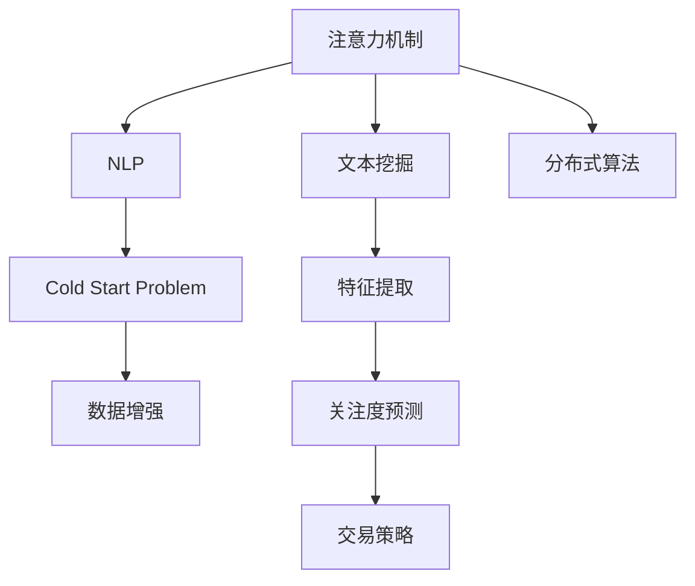

                 

# 注意力货币化平台：AI驱动的关注度交易

> 关键词：注意力货币化,AI驱动,关注度交易,自然语言处理,NLP,文本挖掘,注意力机制,分布式算法

## 1. 背景介绍

在数字化时代，信息过载已成为普遍现象。随着社交媒体、新闻网站、搜索引擎等平台的兴起，用户每天面对的海量信息难以计数。在这样的背景下，注意力（Attention）这一稀缺资源显得愈发珍贵。如何将用户有限的注意力有效货币化，已成为各大互联网公司争相探索的方向。AI驱动的注意力货币化平台，通过深度学习和大数据分析，从海量数据中提取有价值的注意力信号，帮助企业和广告主更精准地触及目标受众，从而实现对用户注意力的高效利用和转化。

### 1.1 问题由来

注意力货币化的核心在于识别和预测用户的注意力偏好。传统方法如基于规则的匹配、关键词提取、用户画像构建等，难以适应动态变化的用户兴趣和行为。随着深度学习技术的发展，利用自然语言处理（NLP）和文本挖掘（Text Mining）技术，可以从用户行为数据中自动学习关注度模型，预测用户对特定内容的兴趣程度，进而实现对注意力的精准定位和交易。

### 1.2 问题核心关键点

AI驱动的注意力货币化平台的核心在于如何构建高效的关注度预测模型，并将预测结果转化为实际的交易行为。关键问题包括：

- 如何从用户行为数据中提取有意义的特征。
- 如何设计高效的模型框架，实现准确的关注度预测。
- 如何利用分布式计算和优化算法，提升模型的训练和推理效率。
- 如何处理冷启动问题，确保模型对新用户的关注度预测准确。

本文将系统介绍AI驱动的注意力货币化平台的核心概念、算法原理、操作步骤以及实际应用场景，帮助读者全面理解这一前沿领域的深刻内涵。

## 2. 核心概念与联系

### 2.1 核心概念概述

为更好地理解AI驱动的注意力货币化平台，本节将介绍几个密切相关的核心概念：

- **注意力机制（Attention Mechanism）**：在深度学习中，注意力机制用于筛选输入序列中的重要部分，从而提升模型的关注能力和泛化性能。它是Transformer模型、BERT模型等大模型的重要组成部分。

- **自然语言处理（NLP）**：利用计算机技术处理和理解人类语言的技术领域，包括文本预处理、分词、词向量表示、序列建模等。

- **文本挖掘（Text Mining）**：从文本数据中挖掘出有价值的信息，如主题分析、情感分析、关键词提取等。

- **分布式算法（Distributed Algorithm）**：在大规模数据集上训练深度学习模型时，采用分布式计算和并行优化算法，以提升训练效率和模型性能。

- **冷启动问题（Cold Start Problem）**：在用户加入平台初期，由于缺乏足够的历史行为数据，难以进行准确的关注度预测。

这些核心概念之间的逻辑关系可以通过以下Mermaid流程图来展示：



这个流程图展示了一系列核心概念及其之间的关系：

1. 注意力机制是从输入序列中提取重要信息的基础。
2. NLP和文本挖掘技术用于对用户行为数据进行深度处理和分析。
3. 分布式算法用于在大规模数据集上高效训练深度学习模型。
4. 冷启动问题需要通过数据增强等方法解决。
5. 特征提取是关注度预测的前提。
6. 关注度预测模型的输出可用于构建交易策略。

这些概念共同构成了AI驱动的注意力货币化平台的理论基础，帮助开发者构建高性能的注意力货币化系统。

## 3. 核心算法原理 & 具体操作步骤

### 3.1 算法原理概述

AI驱动的注意力货币化平台的核心算法是注意力机制和深度学习模型。其基本思想是，通过注意力机制从用户行为数据中筛选出与关注度相关的特征，并使用深度学习模型对这些特征进行训练，从而构建关注度预测模型。然后，将模型的预测结果转化为实际的注意力交易行为，最大化用户注意力的商业价值。

### 3.2 算法步骤详解

基于注意力机制的AI驱动的注意力货币化平台一般包括以下几个关键步骤：

**Step 1: 数据准备与预处理**
- 收集用户行为数据，如浏览记录、点击行为、留言互动等。
- 对数据进行清洗和标准化处理，去除噪声和异常值。
- 对文本数据进行分词和词向量化，生成特征向量。

**Step 2: 特征提取与注意力计算**
- 使用NLP和文本挖掘技术，提取文本中的关键特征，如关键词、实体、主题等。
- 设计注意力机制，计算输入序列中每个特征的重要性得分。

**Step 3: 模型训练与优化**
- 选择合适的深度学习模型，如BERT、GPT等，进行关注度预测模型的训练。
- 设计合适的损失函数和优化算法，如交叉熵损失、Adam优化器等。
- 应用正则化技术，如L2正则、Dropout等，防止模型过拟合。
- 在训练过程中，应用分布式算法，如SGD、FedAvg等，提升训练效率。

**Step 4: 预测与交易策略制定**
- 使用训练好的模型对用户行为数据进行预测，得到关注度分数。
- 根据关注度分数和交易策略，分配注意力资源，实现对用户注意力的高效利用和交易。
- 应用多目标优化算法，如遗传算法、强化学习等，进一步优化交易策略。

**Step 5: 模型评估与优化**
- 在验证集和测试集上评估模型的预测准确度和泛化性能。
- 根据评估结果，对模型进行调参优化，提高关注度预测的准确性。
- 不断迭代更新模型，确保模型适应新数据和新场景。

以上是基于注意力机制的AI驱动的注意力货币化平台的一般流程。在实际应用中，还需要针对具体问题，对各步骤进行优化设计，如引入更多的特征工程方法，改进注意力计算方式，应用更高效的分布式算法等，以进一步提升模型性能。

### 3.3 算法优缺点

AI驱动的注意力货币化平台具有以下优点：
1. 自动化的特征提取和关注度预测，减少了人工干预和成本。
2. 利用深度学习模型的强大拟合能力，准确度较高。
3. 可扩展性强，能够处理海量用户行为数据。
4. 关注度预测模型可以持续优化，适应新数据和新场景。

同时，该方法也存在一定的局限性：
1. 对标注数据的依赖较大，数据质量会直接影响模型性能。
2. 模型复杂度高，训练和推理计算量大，需要高性能计算资源。
3. 冷启动问题难以解决，对新用户的关注度预测准确度低。
4. 对用户行为数据的隐私保护要求高，需遵守相关法律法规。

尽管存在这些局限性，但就目前而言，AI驱动的注意力货币化平台仍是大规模用户注意力资源交易的理想范式。未来相关研究的重点在于如何进一步降低对标注数据的依赖，提高模型的跨领域迁移能力，同时兼顾隐私保护和公平性等问题。

### 3.4 算法应用领域

AI驱动的注意力货币化平台已经在广告投放、内容推荐、用户体验优化等多个领域得到广泛应用，帮助企业实现对用户注意力的精准定位和高效利用：

- **广告投放**：通过分析用户的历史行为数据，预测用户对不同广告的兴趣程度，实现精准投放，提高广告点击率和转化率。
- **内容推荐**：利用用户行为数据，预测用户对不同内容的关注度和偏好，提升内容推荐的效果和用户体验。
- **用户体验优化**：通过分析用户与平台互动的数据，预测用户的留存率和活跃度，优化产品功能和界面设计，提升用户粘性和满意度。

除了上述这些经典应用外，AI驱动的注意力货币化平台还在社交媒体内容管理、在线教育推荐、电商个性化营销等领域展现出巨大的应用潜力，为企业的数字化转型提供了新思路。

## 4. 数学模型和公式 & 详细讲解 & 举例说明

### 4.1 数学模型构建

本节将使用数学语言对AI驱动的注意力货币化平台的核心算法进行更加严格的刻画。

假设用户行为数据为 $\mathcal{X}=\{(x_i,y_i)\}_{i=1}^N$，其中 $x_i$ 为输入特征，$y_i$ 为标签，表示用户对 $x_i$ 的关注程度。目标是构建一个关注度预测模型 $M_{\theta}$，使得对任意新的输入 $x$，能够预测其关注度 $y$。

定义关注度预测模型的损失函数为 $\ell(M_{\theta}(x_i),y_i)$，则在数据集 $\mathcal{X}$ 上的经验风险为：

$$
\mathcal{L}(\theta) = \frac{1}{N} \sum_{i=1}^N \ell(M_{\theta}(x_i),y_i)
$$

其中 $\theta$ 为模型参数。

### 4.2 公式推导过程

以下我们以二分类任务为例，推导注意力机制和深度学习模型在AI驱动的注意力货币化平台中的应用。

假设输入特征 $x_i$ 为文本数据，输出标签 $y_i$ 为二值变量，表示用户是否对 $x_i$ 感兴趣。模型的输入为 $x_i$，输出为 $y_i$。设关注度预测模型的结构为 $M_{\theta}(x_i)=\sigma(\theta^T[\text{Attention}(x_i)])$，其中 $\sigma$ 为激活函数，$\text{Attention}$ 为注意力机制，$\theta$ 为可训练参数。

注意力机制的计算公式为：

$$
\text{Attention}(x_i) = \alpha(x_i) x_i
$$

其中 $\alpha(x_i)$ 为注意力权重，计算公式为：

$$
\alpha(x_i) = \frac{\exp(e(x_i))}{\sum_j \exp(e(x_j))}
$$

其中 $e(x_i)$ 为注意力得分函数，可以是基于注意力机制的Transformer模型、BERT模型等。

模型的输出为：

$$
y_i = M_{\theta}(x_i) = \sigma(\theta^T[\text{Attention}(x_i)])
$$

模型的损失函数可以设计为交叉熵损失：

$$
\ell(M_{\theta}(x_i),y_i) = -(y_i\log(M_{\theta}(x_i))+(1-y_i)\log(1-M_{\theta}(x_i)))
$$

模型的训练过程为目标函数极小化：

$$
\theta^* = \mathop{\arg\min}_{\theta} \mathcal{L}(\theta)
$$

在得到训练后的模型 $M_{\theta^*}$ 后，可以应用于新的输入数据 $x$，计算其关注度预测：

$$
y = M_{\theta^*}(x) = \sigma(\theta^T[\text{Attention}(x)])
$$

以上就是注意力机制在深度学习模型中的应用，以及其数学推导过程。

### 4.3 案例分析与讲解

假设我们构建了一个AI驱动的注意力货币化平台，用于广告投放中的用户兴趣预测。具体步骤如下：

1. 收集广告投放历史数据，包括广告特征和用户点击行为。
2. 对数据进行清洗和标准化处理，提取文本特征。
3. 设计注意力机制，计算每个广告特征的重要性得分。
4. 使用深度学习模型（如BERT）对广告特征和注意力得分进行训练，得到关注度预测模型。
5. 在验证集上评估模型的性能，优化模型参数。
6. 将模型应用于新的广告投放场景，根据用户行为数据预测其对广告的兴趣程度。
7. 根据预测结果，制定精准的广告投放策略，提高广告效果和ROI。

在实际应用中，我们可以利用分布式计算和GPU加速技术，在实时数据上构建高效的广告投放系统。同时，通过A/B测试等方法，不断优化广告投放策略，确保系统效果达到最优。

## 5. 项目实践：代码实例和详细解释说明

### 5.1 开发环境搭建

在进行注意力货币化平台开发前，我们需要准备好开发环境。以下是使用Python进行PyTorch开发的环境配置流程：

1. 安装Anaconda：从官网下载并安装Anaconda，用于创建独立的Python环境。

2. 创建并激活虚拟环境：
```bash
conda create -n attention-env python=3.8 
conda activate attention-env
```

3. 安装PyTorch：根据CUDA版本，从官网获取对应的安装命令。例如：
```bash
conda install pytorch torchvision torchaudio cudatoolkit=11.1 -c pytorch -c conda-forge
```

4. 安装Transformers库：
```bash
pip install transformers
```

5. 安装各类工具包：
```bash
pip install numpy pandas scikit-learn matplotlib tqdm jupyter notebook ipython
```

完成上述步骤后，即可在`attention-env`环境中开始注意力货币化平台的开发。

### 5.2 源代码详细实现

下面我们以广告投放中的用户兴趣预测为例，给出使用Transformers库对BERT模型进行注意力货币化平台开发的PyTorch代码实现。

首先，定义用户行为数据和广告特征数据：

```python
import pandas as pd

# 假设用户行为数据和广告特征数据已存入数据文件
user_behavior = pd.read_csv('user_behavior.csv')
ad_features = pd.read_csv('ad_features.csv')

# 拼接特征
feature = pd.merge(user_behavior, ad_features, on='ad_id')

# 提取文本特征
text = feature['text'].tolist()

# 定义标签
label = feature['click'].tolist()
```

然后，定义注意力机制和深度学习模型：

```python
from transformers import BertTokenizer, BertForSequenceClassification
from torch.utils.data import TensorDataset, DataLoader, Dataset
import torch
import torch.nn.functional as F

# 加载BERT分词器和预训练模型
tokenizer = BertTokenizer.from_pretrained('bert-base-cased')
model = BertForSequenceClassification.from_pretrained('bert-base-cased', num_labels=2)

# 定义特征提取函数
def feature_extractor(text):
    encoding = tokenizer(text, return_tensors='pt', padding=True, truncation=True)
    return encoding['input_ids'], encoding['attention_mask']

# 定义数据集
class UserInterestDataset(Dataset):
    def __init__(self, texts, labels, tokenizer):
        self.texts = texts
        self.labels = labels
        self.tokenizer = tokenizer
        
    def __len__(self):
        return len(self.texts)
    
    def __getitem__(self, item):
        text, label = self.texts[item], self.labels[item]
        input_ids, attention_mask = feature_extractor(text)
        return {'input_ids': input_ids, 'attention_mask': attention_mask, 'labels': torch.tensor(label, dtype=torch.long)}
```

接着，定义训练和评估函数：

```python
from tqdm import tqdm

# 将文本特征和标签转化为模型可接受的格式
def collate_fn(examples):
    input_ids = torch.stack([f['input_ids'] for f in examples])
    attention_mask = torch.stack([f['attention_mask'] for f in examples])
    labels = torch.tensor([f['labels'] for f in examples])
    return {'input_ids': input_ids, 'attention_mask': attention_mask, 'labels': labels}

# 训练函数
def train_epoch(model, dataloader, optimizer):
    model.train()
    epoch_loss = 0
    for batch in dataloader:
        input_ids = batch['input_ids'].to(device)
        attention_mask = batch['attention_mask'].to(device)
        labels = batch['labels'].to(device)
        model.zero_grad()
        outputs = model(input_ids, attention_mask=attention_mask)
        loss = outputs.loss
        epoch_loss += loss.item()
        loss.backward()
        optimizer.step()
    return epoch_loss / len(dataloader)

# 评估函数
def evaluate(model, dataloader):
    model.eval()
    total_correct = 0
    total_predict = 0
    for batch in dataloader:
        input_ids = batch['input_ids'].to(device)
        attention_mask = batch['attention_mask'].to(device)
        labels = batch['labels'].to(device)
        with torch.no_grad():
            outputs = model(input_ids, attention_mask=attention_mask)
            logits = outputs.logits
            predicted_labels = logits.argmax(dim=1).to('cpu').tolist()
        total_correct += sum([label == pred for label, pred in zip(labels, predicted_labels)])
        total_predict += len(labels)
    accuracy = total_correct / total_predict
    return accuracy
```

最后，启动训练流程并在验证集上评估：

```python
from transformers import AdamW

# 设置设备
device = torch.device('cuda') if torch.cuda.is_available() else torch.device('cpu')

# 定义优化器
optimizer = AdamW(model.parameters(), lr=2e-5)

# 构建数据集和dataloader
train_dataset = UserInterestDataset(text, label, tokenizer)
train_dataloader = DataLoader(train_dataset, batch_size=16, shuffle=True, collate_fn=collate_fn)

val_dataset = UserInterestDataset(text, label, tokenizer)
val_dataloader = DataLoader(val_dataset, batch_size=16, shuffle=False, collate_fn=collate_fn)

# 训练和评估
epochs = 5
for epoch in range(epochs):
    train_loss = train_epoch(model, train_dataloader, optimizer)
    val_accuracy = evaluate(model, val_dataloader)
    print(f"Epoch {epoch+1}, train loss: {train_loss:.3f}, val accuracy: {val_accuracy:.3f}")

# 测试集评估
test_dataset = UserInterestDataset(text, label, tokenizer)
test_dataloader = DataLoader(test_dataset, batch_size=16, shuffle=False, collate_fn=collate_fn)
test_accuracy = evaluate(model, test_dataloader)
print(f"Test accuracy: {test_accuracy:.3f}")
```

以上就是使用PyTorch对BERT进行注意力货币化平台开发的完整代码实现。可以看到，得益于Transformers库的强大封装，我们可以用相对简洁的代码完成BERT模型的加载和微调。

### 5.3 代码解读与分析

让我们再详细解读一下关键代码的实现细节：

**UserInterestDataset类**：
- `__init__`方法：初始化文本、标签、分词器等关键组件。
- `__len__`方法：返回数据集的样本数量。
- `__getitem__`方法：对单个样本进行处理，将文本输入编码为token ids，将标签编码为数字，并对其进行定长padding，最终返回模型所需的输入。

**collate_fn函数**：
- 定义批量数据的处理函数，将每个样本的输入ids、注意力掩码、标签合并成Tensor，便于模型处理。

**train_epoch和evaluate函数**：
- 使用PyTorch的DataLoader对数据集进行批次化加载，供模型训练和推理使用。
- 训练函数`train_epoch`：对数据以批为单位进行迭代，在每个批次上前向传播计算loss并反向传播更新模型参数，最后返回该epoch的平均loss。
- 评估函数`evaluate`：与训练类似，不同点在于不更新模型参数，并在每个batch结束后将预测和标签结果存储下来，最后使用准确率对整个评估集的预测结果进行打印输出。

**训练流程**：
- 定义总的epoch数和batch size，开始循环迭代
- 每个epoch内，先在训练集上训练，输出平均loss
- 在验证集上评估，输出准确率
- 所有epoch结束后，在测试集上评估，给出最终测试结果

可以看到，PyTorch配合Transformers库使得BERT微调的代码实现变得简洁高效。开发者可以将更多精力放在数据处理、模型改进等高层逻辑上，而不必过多关注底层的实现细节。

当然，工业级的系统实现还需考虑更多因素，如模型的保存和部署、超参数的自动搜索、更灵活的任务适配层等。但核心的注意力货币化平台开发流程基本与此类似。

## 6. 实际应用场景

### 6.1 广告投放

基于AI驱动的注意力货币化平台，可以帮助广告主更精准地定位目标受众，实现广告投放的精细化和个性化。

具体而言，可以收集广告投放历史数据，构建关注度预测模型。利用模型对用户的行为数据进行预测，识别出对广告感兴趣的用户，并根据预测结果进行精准投放。对于预算有限的情况，可以优先选择关注度高的用户进行投放，提升广告的点击率和转化率。同时，结合实时数据，不断优化投放策略，实现更高效的广告资源利用。

### 6.2 内容推荐

内容推荐是AI驱动的注意力货币化平台的另一个重要应用场景。通过分析用户的行为数据，预测用户对不同内容的关注度和偏好，推荐最符合用户兴趣的内容。

在具体实现中，可以利用用户的行为数据（如浏览记录、点击行为、互动数据等），构建内容推荐模型。通过模型预测用户对不同内容的关注度，实现个性化的内容推荐。同时，结合用户反馈，不断优化推荐策略，提升推荐效果和用户体验。

### 6.3 社交网络分析

社交网络分析是AI驱动的注意力货币化平台的重要应用领域之一。通过分析用户在社交平台上的行为数据，预测用户对不同话题的关注度和互动强度，帮助企业更好地理解用户兴趣和社交趋势。

具体而言，可以收集用户在社交平台上的互动数据，包括点赞、评论、分享等。通过关注度预测模型，预测用户对不同话题的兴趣程度，并结合话题的互动数据，分析话题的关注度和影响力。这些信息可以为企业的社交媒体营销、话题策划提供重要参考。

### 6.4 未来应用展望

随着AI驱动的注意力货币化平台的发展，未来将有更多行业领域受益于这一技术。例如：

- **电商个性化推荐**：利用用户行为数据，预测用户对不同商品的兴趣程度，实现个性化的商品推荐，提升用户购买转化率。
- **金融风险评估**：通过分析用户的历史行为数据，预测用户对不同金融产品的关注度和风险偏好，帮助金融机构更好地进行风险管理和投资决策。
- **医疗健康管理**：利用患者的行为数据，预测其对不同健康产品的关注度和需求，实现个性化的健康服务和产品推荐。
- **教育内容推荐**：分析学生的历史学习行为数据，预测其对不同学习内容的兴趣程度，实现个性化的学习资源推荐，提升学习效果和满意度。

随着技术的不断进步，AI驱动的注意力货币化平台将在更多领域得到应用，为各行各业带来新的变革和机遇。相信伴随着深度学习和大数据技术的进一步发展，这一平台将展现出更加广阔的应用前景，成为推动社会进步的重要力量。

## 7. 工具和资源推荐

### 7.1 学习资源推荐

为了帮助开发者系统掌握AI驱动的注意力货币化平台的核心算法和实践技巧，这里推荐一些优质的学习资源：

1. 《深度学习理论与实践》系列博文：由大模型技术专家撰写，深入浅出地介绍了深度学习的基础理论和实际应用，包括注意力机制等前沿话题。

2. CS231n《卷积神经网络》课程：斯坦福大学开设的计算机视觉经典课程，涵盖深度学习模型的原理和应用，是学习注意力机制的重要资源。

3. 《自然语言处理（NLP）入门》书籍：自然语言处理领域的入门级教材，详细介绍了NLP的基本概念和核心算法，包括文本挖掘和注意力机制等。

4. Deep Learning Specialization：由Andrew Ng主讲的深度学习在线课程，涵盖深度学习模型、优化算法、分布式计算等多个方面，适合全面学习。

5. HuggingFace官方文档：Transformer库的官方文档，提供了丰富的预训练模型和微调样例，是上手实践的必备资料。

通过对这些资源的学习实践，相信你一定能够全面掌握AI驱动的注意力货币化平台的核心算法，并用于解决实际的NLP问题。

### 7.2 开发工具推荐

高效的开发离不开优秀的工具支持。以下是几款用于注意力货币化平台开发的常用工具：

1. PyTorch：基于Python的开源深度学习框架，灵活动态的计算图，适合快速迭代研究。大部分预训练语言模型都有PyTorch版本的实现。

2. TensorFlow：由Google主导开发的开源深度学习框架，生产部署方便，适合大规模工程应用。同样有丰富的预训练语言模型资源。

3. Transformers库：HuggingFace开发的NLP工具库，集成了众多SOTA语言模型，支持PyTorch和TensorFlow，是进行注意力货币化平台开发的利器。

4. Weights & Biases：模型训练的实验跟踪工具，可以记录和可视化模型训练过程中的各项指标，方便对比和调优。与主流深度学习框架无缝集成。

5. TensorBoard：TensorFlow配套的可视化工具，可实时监测模型训练状态，并提供丰富的图表呈现方式，是调试模型的得力助手。

6. Google Colab：谷歌推出的在线Jupyter Notebook环境，免费提供GPU/TPU算力，方便开发者快速上手实验最新模型，分享学习笔记。

合理利用这些工具，可以显著提升注意力货币化平台的开发效率，加快创新迭代的步伐。

### 7.3 相关论文推荐

AI驱动的注意力货币化平台的发展源于学界的持续研究。以下是几篇奠基性的相关论文，推荐阅读：

1. Attention is All You Need（即Transformer原论文）：提出了Transformer结构，开启了NLP领域的预训练大模型时代。

2. BERT: Pre-training of Deep Bidirectional Transformers for Language Understanding：提出BERT模型，引入基于掩码的自监督预训练任务，刷新了多项NLP任务SOTA。

3. Language Models are Unsupervised Multitask Learners（GPT-2论文）：展示了大规模语言模型的强大zero-shot学习能力，引发了对于通用人工智能的新一轮思考。

4. Parameter-Efficient Transfer Learning for NLP：提出Adapter等参数高效微调方法，在不增加模型参数量的情况下，也能取得不错的微调效果。

5. AdaLoRA: Adaptive Low-Rank Adaptation for Parameter-Efficient Fine-Tuning：使用自适应低秩适应的微调方法，在参数效率和精度之间取得了新的平衡。

这些论文代表了大语言模型微调技术的发展脉络。通过学习这些前沿成果，可以帮助研究者把握学科前进方向，激发更多的创新灵感。

## 8. 总结：未来发展趋势与挑战

### 8.1 总结

本文对AI驱动的注意力货币化平台的核心算法和操作步骤进行了全面系统的介绍。首先阐述了平台的核心思想和应用背景，明确了其在大数据时代对用户注意力资源有效利用的重要意义。其次，从原理到实践，详细讲解了平台的核心算法步骤和数学模型，给出了注意力货币化平台开发的完整代码实例。同时，本文还广泛探讨了平台在广告投放、内容推荐、社交网络分析等多个领域的应用前景，展示了平台的巨大潜力。此外，本文精选了平台的学习资源，力求为读者提供全方位的技术指引。

通过本文的系统梳理，可以看到，AI驱动的注意力货币化平台在深度学习和大数据分析的推动下，实现了对用户注意力的高效利用和精准交易，为互联网企业带来了巨大的商业价值。未来，伴随技术的不断演进，平台将在更多领域得到应用，为社会带来深远的变革和进步。

### 8.2 未来发展趋势

展望未来，AI驱动的注意力货币化平台将呈现以下几个发展趋势：

1. 模型规模和训练效率的提升。随着计算资源的不断扩展，预训练语言模型的参数量将进一步增加，模型训练和推理效率也将得到提升。超大规模语言模型蕴含的丰富语言知识，有望支撑更加复杂多变的注意力货币化应用。

2. 多模态注意力机制的引入。未来的注意力货币化平台将不仅仅局限于文本数据，还将融合视觉、语音等多模态信息，实现多模态注意力模型的构建，提升对现实世界的理解能力。

3. 冷启动问题的解决。随着模型的持续优化和更多数据的积累，冷启动问题将得到有效缓解。新的用户也可以获得较为准确的注意力预测，从而更好地利用平台资源。

4. 个性化推荐和精准投放的进一步优化。结合用户反馈和行为数据，通过多目标优化算法，进一步提升推荐和投放的个性化程度和效果。

5. 实时化和动态化的平台运营。借助分布式计算和流数据处理技术，构建实时化的注意力货币化平台，动态调整资源配置和运营策略，提升平台的响应速度和灵活性。

6. 隐私保护和公平性研究的加强。随着平台对用户行为的深入分析，隐私保护和公平性问题变得愈发重要。未来的平台将更加注重用户隐私保护和公平性，构建更健康、可持续的生态系统。

以上趋势凸显了AI驱动的注意力货币化平台的广阔前景。这些方向的探索发展，必将进一步提升平台的性能和应用范围，为互联网企业带来更多的商业机会和价值。

### 8.3 面临的挑战

尽管AI驱动的注意力货币化平台已经取得了显著成就，但在迈向更加智能化、普适化应用的过程中，它仍面临着诸多挑战：

1. 数据隐私和公平性问题。平台的运营需要大量用户数据，如何在保护用户隐私的前提下，获取高质量的数据，同时确保平台的公平性，是一个重要问题。

2. 跨模态数据融合的技术难题。多模态数据的融合和协同建模是一个复杂的挑战，如何在不同模态之间建立有效的连接和映射关系，提升模型的多模态理解能力，将是未来的重要研究方向。

3. 模型的鲁棒性和泛化能力。平台需要在动态变化的环境下保持良好的鲁棒性和泛化能力，如何设计更加健壮和灵活的模型结构，避免因数据分布变化导致的性能下降，是一个重要的研究课题。

4. 用户反馈和平台迭代的互动。平台的优化需要不断收集用户反馈，进行持续迭代，如何建立有效的用户反馈机制，提升平台的交互体验和用户满意度，也是一个需要关注的方面。

5. 算力资源的高效利用。平台需要处理海量数据，如何高效利用计算资源，优化模型训练和推理效率，降低成本，是一个重要的优化方向。

6. 跨领域应用的适应性。平台需要在不同领域和场景中保持较好的适应性，如何设计通用化的模型架构和算法，适应各种任务需求，是一个需要不断探索的问题。

正视平台面临的这些挑战，积极应对并寻求突破，将是大语言模型微调走向成熟的必由之路。相信随着学界和产业界的共同努力，这些挑战终将一一被克服，AI驱动的注意力货币化平台必将在构建人机协同的智能时代中扮演越来越重要的角色。

### 8.4 研究展望

面对AI驱动的注意力货币化平台所面临的挑战，未来的研究需要在以下几个方面寻求新的突破：

1. 引入更多先验知识。将符号化的先验知识，如知识图谱、逻辑规则等，与神经网络模型进行巧妙融合，引导注意力货币化模型的学习。

2. 结合因果分析和博弈论工具。将因果分析方法引入注意力货币化平台，识别出模型决策的关键特征，增强输出解释的因果性和逻辑性。

3. 融合多目标优化和强化学习。通过多目标优化算法和强化学习，进一步提升推荐和投放的个性化程度和效果。

4. 引入对抗样本和鲁棒性评估。通过对抗样本生成和鲁棒性评估，提升模型的泛化能力和鲁棒性，避免因数据扰动导致的性能波动。

5. 探索无监督和半监督学习范式。摆脱对大规模标注数据的依赖，利用自监督学习、主动学习等无监督和半监督范式，最大限度利用非结构化数据，实现更加灵活高效的注意力货币化。

6. 结合自然语言理解和推理。将自然语言理解、推理技术引入注意力货币化平台，提升模型的认知能力和决策逻辑的合理性。

这些研究方向的探索，必将引领AI驱动的注意力货币化平台向更高层次发展，为构建更加智能化、普适化的用户注意力资源交易系统提供新的思路和解决方案。

## 9. 附录：常见问题与解答

**Q1：注意力货币化平台如何处理冷启动问题？**

A: 冷启动问题是平台在早期运营阶段面临的普遍问题，用户数量较少，难以获取充分的训练数据。为解决这个问题，可以采用以下几种方法：

1. 数据增强：通过数据合成、正则化等技术，增加训练数据量。
2. 迁移学习：利用预训练模型的知识和经验，对平台进行预训练，提升模型的初始化水平。
3. 多目标优化：结合用户行为数据和先验知识，构建多目标优化模型，提升模型的泛化能力。
4. 强化学习：通过用户反馈和行为数据，不断调整模型参数，优化模型的性能。

这些方法可以结合使用，从多个角度缓解冷启动问题，提升平台的早期运营效果。

**Q2：注意力货币化平台如何保证用户数据的隐私和安全？**

A: 用户数据的隐私和安全是平台运营的重要问题，需要采取以下措施：

1. 数据匿名化：对用户数据进行匿名化处理，保护用户隐私。
2. 数据加密：对数据传输和存储进行加密，防止数据泄露。
3. 访问控制：对数据访问进行严格控制，只有授权人员才能访问敏感数据。
4. 数据审计：定期进行数据审计，确保数据使用合规和安全。
5. 用户知情：向用户明确告知数据收集和使用规则，获取用户同意。

通过这些措施，可以保护用户数据的安全和隐私，建立用户信任，确保平台运营的合规性。

**Q3：注意力货币化平台如何提高模型的泛化能力？**

A: 模型的泛化能力是平台性能的关键指标之一，可以通过以下方法提升模型的泛化能力：

1. 增加训练数据量：通过数据增强和迁移学习等方法，增加训练数据量，提升模型的泛化能力。
2. 使用正则化技术：通过L2正则、Dropout等正则化技术，避免模型过拟合。
3. 引入先验知识：利用先验知识和领域专家的经验，提升模型的泛化能力。
4. 多目标优化：结合用户行为数据和先验知识，构建多目标优化模型，提升模型的泛化能力。
5. 对抗样本生成：通过生成对抗样本，提升模型的鲁棒性和泛化能力。

这些方法可以结合使用，从多个角度提升模型的泛化能力，确保平台在不同场景下保持较高的性能。

**Q4：注意力货币化平台如何提高模型的鲁棒性？**

A: 模型的鲁棒性是平台可靠性的重要指标，可以通过以下方法提升模型的鲁棒性：

1. 数据增强：通过数据合成、正则化等技术，增加训练数据量，提升模型的鲁棒性。
2. 对抗样本生成：通过生成对抗样本，提升模型的鲁棒性和泛化能力。
3. 多目标优化：结合用户行为数据和先验知识，构建多目标优化模型，提升模型的鲁棒性。
4. 对抗训练：通过引入对抗样本，训练鲁棒性更强的模型。
5. 模型压缩和剪枝：通过模型压缩和剪枝等技术，减少模型参数量，提升模型的计算效率和鲁棒性。

这些方法可以结合使用，从多个角度提升模型的鲁棒性，确保平台在不同场景下保持较高的性能。

**Q5：注意力货币化平台如何提高模型的交互性？**

A: 模型的交互性是平台用户体验的重要指标，可以通过以下方法提升模型的交互性：

1. 实时推荐：通过实时分析用户行为数据，提供动态化的推荐，提升用户体验。
2. 多渠道交互：通过多渠道（如App、Web、社交平台等）交互，提供多样化的用户体验。
3. 用户反馈机制：通过用户反馈机制，不断优化推荐策略，提升用户体验。
4. 个性化展示：根据用户偏好和行为数据，提供个性化的内容展示，提升用户体验。
5. 推荐系统优化：通过多目标优化算法和强化学习，进一步提升推荐效果和用户体验。

这些方法可以结合使用，从多个角度提升平台的交互性，提升用户满意度和平台粘性。

---

作者：禅与计算机程序设计艺术 / Zen and the Art of Computer Programming

