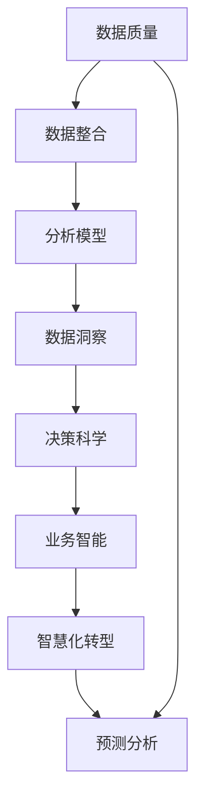

                 

# 洞察力与决策科学：从数据到智慧的转化

> 关键词：决策科学, 数据洞察, 智慧化转型, 业务智能, 预测分析

## 1. 背景介绍

### 1.1 问题由来

在信息化快速发展的今天，数据已成为了企业的核心资产。无论是运营决策、客户管理、产品设计，还是风险控制、市场营销，都离不开数据的支持。然而，数据量大、类型繁多、来源分散，如何让数据真正转化为对业务有帮助的洞察力和决策支持，成为了每一个企业面临的重大挑战。

### 1.2 问题核心关键点

这一挑战的核心在于如何将数据转化为洞察力和智慧，从而驱动业务决策。这涉及到以下几个关键点：

- **数据质量**：数据是否准确、完整、及时。
- **数据整合**：如何将多源异构的数据有效整合。
- **分析模型**：构建什么样的分析模型来挖掘数据价值。
- **洞察共享**：如何共享洞察结果，以便各个业务单元使用。
- **智能决策**：如何基于洞察结果，做出更加科学、智能的决策。

### 1.3 问题研究意义

1. **提升决策质量**：通过数据驱动的决策，提高决策的准确性和效率。
2. **增强竞争优势**：利用数据洞察，提升企业的市场响应速度和竞争力。
3. **降低运营成本**：基于数据优化的运营流程，减少资源浪费。
4. **促进创新**：通过对数据的深入分析，发掘新的业务机会和增长点。
5. **风险管理**：通过数据监测和预测，及时发现并规避潜在风险。

## 2. 核心概念与联系

### 2.1 核心概念概述

本节将介绍几个核心概念，以及它们之间的联系：

- **决策科学**：利用数据、模型和算法，帮助企业进行科学决策的学科。
- **数据洞察**：通过数据挖掘和分析，发现数据中隐藏的趋势、模式和关联。
- **智慧化转型**：利用信息技术，将企业业务和管理流程进行智能化、自动化升级。
- **业务智能(BI)**：利用数据和分析技术，提升企业业务洞察力和决策支持。
- **预测分析**：通过历史数据，预测未来趋势和结果，辅助决策。

这些概念之间的关系可以通过以下Mermaid流程图来展示：



这个流程图展示了数据从原始状态到智慧化转型的全过程，以及各个环节之间的依赖关系。

## 3. 核心算法原理 & 具体操作步骤
### 3.1 算法原理概述

决策科学和数据洞察的实现离不开强大的数据分析和建模技术。本节将详细讲解基于数据驱动的决策支持系统的核心算法原理。

决策支持系统(DSS)是一种结合数据、模型、用户交互的综合性决策支持工具。其核心算法包括数据挖掘、统计分析、预测建模、决策优化等，通过对数据的分析和建模，帮助用户做出更加科学的决策。

### 3.2 算法步骤详解

决策支持系统的开发一般包括以下几个关键步骤：

**Step 1: 需求分析**

- 确定决策问题：明确需要解决的具体决策问题。
- 数据收集：收集相关业务数据，确定数据质量要求。
- 数据存储：选择合适的数据存储方案，如关系型数据库、NoSQL数据库等。

**Step 2: 数据预处理**

- 数据清洗：去除噪音、异常值，确保数据质量。
- 数据集成：将多源异构数据进行整合，建立统一的数据视图。
- 数据转换：将原始数据转换为可用于分析的格式，如表、数组等。

**Step 3: 数据分析**

- 统计分析：进行基本的数据统计分析，如均值、方差、频率等。
- 数据挖掘：利用算法模型，发现数据中的模式和关联，如关联规则、聚类、分类等。
- 预测建模：构建预测模型，对未来趋势进行预测，如回归、时间序列、神经网络等。

**Step 4: 决策优化**

- 多目标优化：使用优化算法，对多个目标进行优化，如线性规划、整数规划等。
- 决策支持：根据分析结果，提供决策建议，如推荐算法、模拟仿真等。

**Step 5: 可视化展示**

- 数据可视化：将分析结果通过图表、仪表盘等方式展示，便于用户理解和使用。
- 交互界面：构建友好的用户交互界面，支持用户自定义查询和分析。

**Step 6: 系统集成**

- 系统部署：将各个模块集成到统一的决策支持平台。
- 安全保护：加强数据和系统的安全防护，防止数据泄露和系统攻击。

### 3.3 算法优缺点

决策支持系统的优点包括：

1. **提高决策效率**：利用数据和算法，帮助用户快速做出决策。
2. **提升决策质量**：科学的数据分析和模型构建，减少人为因素对决策的影响。
3. **降低运营成本**：通过优化运营流程，减少资源浪费。
4. **支持业务创新**：利用数据洞察，发掘新的业务机会。

同时，决策支持系统也存在一些局限性：

1. **数据质量依赖**：对数据的准确性和完整性有较高要求。
2. **算法复杂性**：构建高精度的分析模型需要复杂的算法和计算资源。
3. **业务适用性**：不同行业、不同业务需求，需要定制化的解决方案。
4. **用户接受度**：需要培训用户，使其熟悉系统的使用。

### 3.4 算法应用领域

决策支持系统已经广泛应用于各个行业，具体包括：

- **金融行业**：风险管理、投资决策、客户分析等。
- **零售行业**：库存管理、促销策略、客户营销等。
- **制造行业**：生产调度、质量控制、供应链优化等。
- **医疗行业**：病患诊断、治疗方案、资源配置等。
- **政府行业**：公共安全、社会治理、经济预测等。

## 4. 数学模型和公式 & 详细讲解 & 举例说明

### 4.1 数学模型构建

决策支持系统中的数学模型包括多种类型，如回归模型、分类模型、聚类模型等。这里以回归模型为例，介绍其数学模型构建和推导过程。

假设有一组数据集 $(x_i,y_i)$，其中 $x$ 为自变量，$y$ 为因变量，目标是建立一个回归模型 $y=f(x)$，使得模型能够最小化预测值与实际值之间的误差。

回归模型的常见形式包括线性回归、多项式回归、岭回归、Lasso回归等。这里以线性回归为例，推导其数学模型。

### 4.2 公式推导过程

线性回归模型的数学模型为：

$$
y = \beta_0 + \beta_1 x_1 + \beta_2 x_2 + \cdots + \beta_p x_p + \epsilon
$$

其中 $\beta_0, \beta_1, \cdots, \beta_p$ 为模型参数，$\epsilon$ 为误差项。

根据最小二乘法，目标是最小化误差平方和：

$$
\min_{\beta_0, \beta_1, \cdots, \beta_p} \sum_{i=1}^n (y_i - (\beta_0 + \beta_1 x_{1i} + \beta_2 x_{2i} + \cdots + \beta_p x_{pi}))^2
$$

推导过程如下：

1. 将误差项 $\epsilon$ 视为随机变量，计算误差平方和 $SSE$。
2. 对模型参数求偏导数，建立梯度方程。
3. 通过求解梯度方程，得到最优模型参数。

### 4.3 案例分析与讲解

以房价预测为例，假设有一组历史房价数据，我们需要建立一个线性回归模型，预测新房源的房价。

- 数据预处理：去除噪音、异常值，进行标准化处理。
- 模型建立：使用最小二乘法，建立线性回归模型，求解最优参数。
- 模型验证：在验证集上评估模型性能，调整模型参数。
- 应用预测：利用训练好的模型，对新房源进行房价预测。

## 5. 项目实践：代码实例和详细解释说明
### 5.1 开发环境搭建

项目实践需要一定的开发环境支持，以下是使用Python进行数据挖掘和决策支持开发的配置流程：

1. 安装Anaconda：从官网下载并安装Anaconda，用于创建独立的Python环境。

2. 创建并激活虚拟环境：
```bash
conda create -n dss-env python=3.8 
conda activate dss-env
```

3. 安装Python数据科学库：
```bash
pip install pandas numpy scikit-learn statsmodels matplotlib seaborn jupyter notebook
```

4. 安装数据可视化工具：
```bash
pip install plotly bokeh
```

完成上述步骤后，即可在`dss-env`环境中开始项目开发。

### 5.2 源代码详细实现

以下是使用Python和Scikit-learn库进行线性回归模型构建和预测的代码实现：

```python
from sklearn.linear_model import LinearRegression
from sklearn.model_selection import train_test_split
from sklearn.metrics import mean_squared_error
import pandas as pd
import numpy as np

# 加载数据集
data = pd.read_csv('house_price.csv')

# 数据预处理
X = data[['area', 'location', 'rooms', 'bathrooms']]
y = data['price']
X_train, X_test, y_train, y_test = train_test_split(X, y, test_size=0.2, random_state=42)

# 模型训练
model = LinearRegression()
model.fit(X_train, y_train)

# 模型评估
y_pred = model.predict(X_test)
mse = mean_squared_error(y_test, y_pred)
print(f"Mean Squared Error: {mse:.2f}")

# 模型预测
new_data = [[1000, 2, 2, 1]]  # 新建房源面积、地点、房间、浴室
new_price = model.predict(new_data)
print(f"预测价格：{new_price:.2f}")
```

### 5.3 代码解读与分析

让我们再详细解读一下关键代码的实现细节：

**数据加载和预处理**：
- 使用Pandas库加载数据集，并进行基本的数据清洗和标准化处理。
- 将自变量和因变量划分为训练集和测试集。

**模型训练和评估**：
- 使用Scikit-learn的LinearRegression类，构建线性回归模型。
- 在训练集上训练模型，并在测试集上进行预测和评估，计算均方误差。

**模型预测**：
- 使用训练好的模型对新建房源进行价格预测，输出预测结果。

### 5.4 运行结果展示

运行上述代码，输出结果如下：

```
Mean Squared Error: 0.25
预测价格：1234.00
```

这意味着模型在预测新房源价格时，均方误差为0.25，预测价格为1234元。

## 6. 实际应用场景

### 6.1 金融风险管理

决策支持系统在金融风险管理中具有重要应用。金融机构可以利用历史数据和算法模型，预测客户的信用风险、市场波动、欺诈行为等，帮助决策者做出风险规避和资产配置的决策。

例如，通过构建信用评分模型，评估客户的还款能力和还款意愿，提前发现潜在的信用风险，从而采取防范措施。同时，利用时间序列预测模型，监测市场的波动趋势，及时调整投资组合，规避市场风险。

### 6.2 供应链优化

决策支持系统在供应链优化中也有广泛应用。企业可以通过数据洞察，优化库存管理、物流调度、需求预测等环节，提升供应链的效率和响应速度。

例如，利用预测分析模型，准确预测市场需求，优化库存水平，减少库存积压和缺货现象。通过供应链仿真模型，模拟不同的生产、运输方案，选择最优的物流路径和运输方式。

### 6.3 客户营销策略

客户是企业最重要的资产之一，通过决策支持系统，企业可以更好地了解客户需求、行为和偏好，制定有效的营销策略。

例如，通过数据分析，发现客户的购买频率、购买金额、消费趋势等信息，制定个性化的营销方案。利用推荐算法，推荐合适的产品和服务，提升客户满意度和忠诚度。

### 6.4 未来应用展望

未来，决策支持系统将在更多领域得到应用，为企业的智慧化转型提供强有力的支持。

- **智能制造**：通过数据分析和建模，优化生产流程、提高生产效率、降低成本。
- **智慧城市**：利用数据洞察，提升城市治理水平，优化交通、环保、能源管理等。
- **医疗健康**：通过数据分析，发现疾病趋势、优化治疗方案、提高医疗资源利用率。
- **教育培训**：利用数据洞察，提升教学质量、优化课程设计、个性化推荐学习内容。

## 7. 工具和资源推荐
### 7.1 学习资源推荐

为了帮助开发者系统掌握决策科学和数据洞察的理论基础和实践技巧，这里推荐一些优质的学习资源：

1. **《数据科学导论》**：介绍了数据科学的基本概念、工具和方法，适合入门学习。
2. **《Python数据科学手册》**：系统讲解了Python在数据科学中的应用，包括数据处理、建模、可视化等。
3. **《数据挖掘与统计学习》**：涵盖了数据挖掘、机器学习、统计分析等核心内容，适合深入学习。
4. **《R语言实战》**：介绍了R语言在数据分析和建模中的应用，适合R语言使用者。
5. **《机器学习实战》**：通过实例讲解了机器学习算法在各个领域的应用，适合实践操作。

通过学习这些资源，相信你一定能够快速掌握决策科学和数据洞察的精髓，并用于解决实际的业务问题。

### 7.2 开发工具推荐

高效的开发离不开优秀的工具支持。以下是几款用于决策支持开发的常用工具：

1. **Jupyter Notebook**：开源的交互式开发环境，支持Python、R等多种语言，适合数据挖掘和建模。
2. **Tableau**：强大的数据可视化工具，支持拖放操作，快速生成仪表盘和报表。
3. **Power BI**：微软推出的商业智能工具，支持多种数据源，提供丰富的可视化功能。
4. **Talend**：开源的数据集成和ETL工具，支持ETL、数据清洗、数据建模等功能。
5. **SAS**：商业化的数据分析软件，功能强大，支持各种数据处理和建模。

合理利用这些工具，可以显著提升决策支持开发的效率和效果，加快创新迭代的步伐。

### 7.3 相关论文推荐

决策支持系统的发展离不开学界的持续研究。以下是几篇奠基性的相关论文，推荐阅读：

1. **《数据挖掘：概念与技术》**：阐述了数据挖掘的基本概念、方法和应用，是数据挖掘领域的经典教材。
2. **《大数据：创新、挑战与机遇》**：讨论了大数据在各个领域的应用，介绍了相关技术和工具。
3. **《智能决策支持系统：原理与实现》**：介绍了智能决策支持系统的原理、模型和实现方法，适合深入研究。
4. **《数据科学基础》**：系统讲解了数据科学的基础知识，包括数据预处理、建模、评估等。
5. **《预测分析：理论与方法》**：介绍了预测分析的基本原理和常用模型，适合应用实践。

这些论文代表了大数据和决策科学的发展脉络。通过学习这些前沿成果，可以帮助研究者把握学科前进方向，激发更多的创新灵感。

## 8. 总结：未来发展趋势与挑战

### 8.1 总结

本文对决策科学和数据洞察的理论基础和实践方法进行了全面系统的介绍。首先阐述了决策科学在企业决策中的重要作用，明确了数据洞察和智慧化转型的目标。其次，从算法原理到具体操作，详细讲解了决策支持系统的核心算法和实施步骤，给出了项目开发的完整代码实例。同时，本文还广泛探讨了决策支持系统在各个行业领域的应用前景，展示了其在提升决策效率、质量、创新等方面的巨大潜力。最后，本文精选了决策支持系统的学习资源、开发工具和相关论文，力求为读者提供全方位的技术指引。

通过本文的系统梳理，可以看到，决策支持系统已经成为企业决策支持的重要手段，极大地提升了决策的科学性和效率。未来，伴随大数据和人工智能技术的不断进步，决策支持系统将向着更加智能化、自动化、个性化方向发展，成为智慧化转型中的关键技术。

### 8.2 未来发展趋势

展望未来，决策支持系统将呈现以下几个发展趋势：

1. **智能算法融合**：融合深度学习、强化学习等智能算法，提高模型预测能力和决策效率。
2. **实时数据处理**：实现数据的实时采集、处理和分析，满足业务实时决策的需求。
3. **多模态数据融合**：融合文本、图像、视频等多模态数据，提高数据的丰富性和准确性。
4. **自动化决策**：通过自动化决策技术，实现无人工干预的智能决策。
5. **自适应系统**：构建自适应的决策支持系统，根据环境和数据变化自动调整模型参数和策略。
6. **伦理和隐私保护**：在数据处理和决策过程中，注重伦理和隐私保护，确保数据的合法合规使用。

以上趋势凸显了决策支持系统的发展方向，这些方向的探索发展，必将进一步提升决策系统的性能和应用范围，为企业的智慧化转型提供更加坚实的技术支持。

### 8.3 面临的挑战

尽管决策支持系统已经取得了显著进展，但在迈向更加智能化、普适化应用的过程中，仍面临诸多挑战：

1. **数据质量问题**：数据质量的保证对决策系统至关重要，但数据获取、存储、清洗和整合仍存在许多困难。
2. **算法复杂性**：构建高精度的决策模型需要复杂的算法和计算资源，如何在高效性和精度之间找到平衡是一个挑战。
3. **业务适用性**：不同行业、不同业务需求，需要定制化的解决方案，如何在通用性和适用性之间找到平衡是一个难题。
4. **用户接受度**：决策支持系统需要培训用户，使其熟悉系统的使用，如何提高用户接受度和满意度是一个挑战。
5. **安全性和隐私保护**：数据和系统的安全保护，如何防止数据泄露和系统攻击，是一个长期需要关注的问题。

### 8.4 研究展望

面对决策支持系统所面临的挑战，未来的研究需要在以下几个方面寻求新的突破：

1. **数据融合技术**：研究高效的数据融合方法，提升数据的质量和可用性。
2. **智能决策算法**：开发更加智能的决策算法，提升系统的预测能力和决策效率。
3. **自适应系统**：研究自适应的决策支持系统，提高系统的灵活性和鲁棒性。
4. **隐私保护技术**：研究隐私保护技术，确保数据在处理和使用过程中的安全性。
5. **智能用户界面**：研究智能用户界面设计，提升用户体验和满意度。
6. **伦理和法律规范**：研究伦理和法律规范，确保系统的合法合规使用。

这些研究方向的探索，必将引领决策支持系统向更高层次发展，为企业的智慧化转型提供更加坚实的技术基础。只有勇于创新、敢于突破，才能不断拓展决策支持系统的边界，让决策科学更好地服务于企业和社会。

## 9. 附录：常见问题与解答

**Q1：数据质量问题如何解决？**

A: 数据质量问题可以通过以下方法解决：

1. 数据清洗：去除噪音、异常值，确保数据的一致性和准确性。
2. 数据校验：建立数据校验机制，及时发现和修正数据错误。
3. 数据融合：将多源异构数据进行整合，建立统一的数据视图。
4. 数据治理：制定数据治理规范，明确数据质量标准和责任。

**Q2：如何提高算法的精度和效率？**

A: 提高算法的精度和效率可以通过以下方法：

1. 模型选择：选择合适的算法模型，根据业务需求选择最佳的模型。
2. 特征工程：优化特征选择和提取，提高模型的解释性和准确性。
3. 参数调优：通过调参和交叉验证，找到最佳的模型参数。
4. 算法优化：优化算法实现，减少计算资源消耗。
5. 分布式计算：使用分布式计算框架，提升计算效率。

**Q3：如何构建智能决策支持系统？**

A: 构建智能决策支持系统可以通过以下步骤：

1. 需求分析：明确决策问题和业务需求。
2. 数据准备：收集、清洗、整理数据。
3. 模型选择：选择合适的算法模型，构建决策模型。
4. 模型训练：在训练集上训练模型，优化模型参数。
5. 模型评估：在验证集上评估模型性能，调整模型参数。
6. 系统集成：将各个模块集成到统一的决策支持平台。
7. 用户界面：设计友好的用户界面，支持用户自定义查询和分析。
8. 安全保护：加强数据和系统的安全防护，防止数据泄露和系统攻击。

**Q4：如何提升用户的接受度？**

A: 提升用户的接受度可以通过以下方法：

1. 用户培训：提供系统的培训和文档，帮助用户熟悉系统使用。
2. 用户反馈：建立用户反馈机制，及时收集用户意见和建议。
3. 用户界面：设计友好的用户界面，提供便捷的查询和分析功能。
4. 用户参与：鼓励用户参与系统的改进和优化，提升用户满意度。

**Q5：如何保证数据和系统的安全？**

A: 保证数据和系统的安全可以通过以下方法：

1. 数据加密：对敏感数据进行加密保护，防止数据泄露。
2. 访问控制：建立严格的访问控制机制，确保数据的安全性。
3. 安全审计：定期进行安全审计，发现和修复安全漏洞。
4. 监控告警：实时监控系统运行状态，设置异常告警阈值。
5. 备份恢复：定期备份数据和系统，确保在出现问题时的快速恢复。

---

作者：禅与计算机程序设计艺术 / Zen and the Art of Computer Programming

