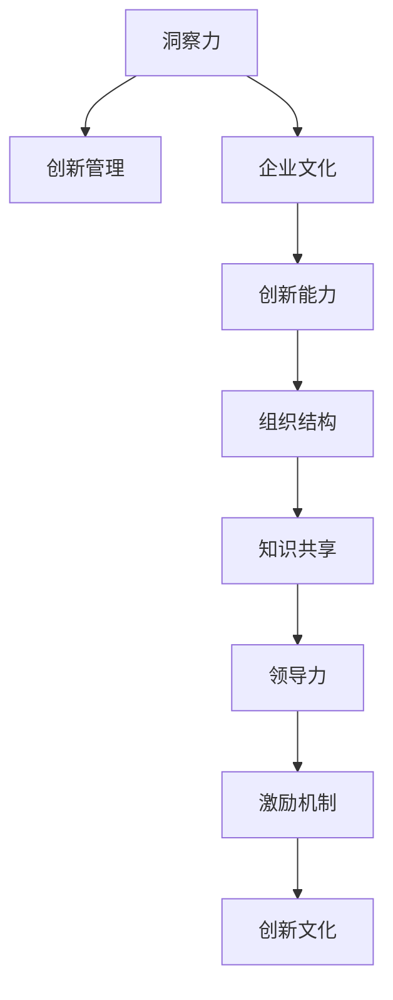

                 

# 洞察力与创新管理：培育创新文化的关键

> 关键词：洞察力,创新管理,企业文化,创新能力,组织结构,知识共享,领导力,激励机制

## 1. 背景介绍

### 1.1 问题由来

在当今快速变化的商业环境中，创新已成为企业生存和发展的关键因素。然而，许多企业发现，尽管投入了大量的资源和精力进行创新活动，但往往难以取得预期的成果。这其中的主要原因之一是，缺乏系统性的创新管理策略和能够有效激发创新文化的环境。如何构建一个支持创新、鼓励实验、容错失败的组织文化，已成为企业在竞争中脱颖而出的重要课题。

### 1.2 问题核心关键点

培育创新文化，要求企业不仅要有创新的意愿，更要有系统的管理手段和良好的组织氛围。具体而言，关键点包括：

- **创新意愿的培养**：从高层管理者到普通员工，都需要具备主动寻求创新的意识和能力。
- **创新管理的框架**：建立一套科学、可操作的管理流程，确保创新项目的顺利推进。
- **知识共享的机制**：构建开放的平台和渠道，促进企业内外部的知识流动和交流。
- **组织结构的优化**：设计灵活、高效的组织架构，适应创新型项目的快速迭代和跨部门协作。
- **领导力的提升**：培养具备创新领导力的管理者，引领团队和组织不断探索新的可能性。

### 1.3 问题研究意义

培育创新文化不仅有助于企业在激烈的市场竞争中保持领先地位，还能促进企业的长期可持续发展。通过构建支持创新的环境，企业能够吸引和保留顶尖人才，激发团队成员的创造力，推动技术和管理上的持续进步。此外，创新文化的建立还能增强企业对市场变化和新技术的适应能力，提升其灵活性和竞争力。

## 2. 核心概念与联系

### 2.1 核心概念概述

为更好地理解如何培育创新文化，本节将介绍几个密切相关的核心概念：

- **洞察力(Insight)**：指企业及其员工对市场、技术、消费者需求等关键要素的深刻理解和预见能力。
- **创新管理(Innovation Management)**：指对创新活动的系统化规划、执行和评估，以实现创新目标的过程。
- **企业文化(Corporate Culture)**：指企业内共享的价值观念、行为准则和工作方式，是企业创新的土壤。
- **创新能力(Innovation Capacity)**：指企业将其内部资源转化为创新成果的能力，包括技术、管理、人才等多个方面。
- **组织结构(Organizational Structure)**：指企业内部的部门划分、权力分配和信息流通方式，直接影响创新的流畅性。
- **知识共享(Knowledge Sharing)**：指企业内外部知识的流通和共享，促进创新理念和实践的扩散。
- **领导力(Leadership)**：指企业领导者及其团队的领导风格和能力，对创新文化有着决定性影响。
- **激励机制(Incentive Mechanism)**：指企业用于激励员工进行创新活动的各种机制，如奖金、晋升、荣誉等。

这些核心概念之间的逻辑关系可以通过以下Mermaid流程图来展示：



这个流程图展示了几大核心概念之间的关联性：

1. 洞察力是创新的基础。
2. 创新管理将洞察力转化为具体的创新行动。
3. 企业文化提供创新的环境和氛围。
4. 创新能力是企业实现创新的资源保障。
5. 组织结构保证创新活动的顺畅进行。
6. 知识共享促进信息和知识的交流。
7. 领导力引领创新过程。
8. 激励机制调动员工积极性。
9. 最终形成支持创新的企业文化。

这些概念共同构成了一个培育创新文化的生态系统，企业需要系统性地推进这些方面的建设，才能真正激发创新活力。

## 3. 核心算法原理 & 具体操作步骤
### 3.1 算法原理概述

培育创新文化的核心算法原理，是通过系统化的管理手段，将洞察力转化为具体的创新实践，最终形成支持创新的企业文化。具体来说，这一过程可以分为以下几个步骤：

1. **洞察力的获取与分析**：通过市场调研、数据分析等手段，获取关于市场趋势、消费者需求和技术进步的深刻理解。
2. **创新项目的规划与执行**：根据洞察力，规划具体的创新项目，设计创新路径，分配资源，执行项目。
3. **知识共享与传播**：通过企业内外部平台，促进知识和技术的共享与传播，形成知识网络。
4. **组织结构的优化**：设计灵活的组织架构，支持跨部门协作和创新项目的快速迭代。
5. **领导力的培养**：培养具备创新领导力的管理者，引领团队的创新方向和实践。
6. **激励机制的设计与实施**：建立激励机制，激发员工的创新热情和主动性。
7. **创新文化的培育**：通过上述各步骤的系统推进，形成支持创新的企业文化，最终实现企业创新能力的提升。

### 3.2 算法步骤详解

培育创新文化的具体操作步骤如下：

**Step 1: 洞察力的获取与分析**

- **市场调研**：通过问卷调查、焦点小组讨论等方式，了解市场需求和消费者行为。
- **数据分析**：利用大数据分析技术，挖掘市场趋势和技术进步的潜在机会。
- **内部反馈**：收集员工和管理层的反馈，识别企业内部的创新需求和瓶颈。

**Step 2: 创新项目的规划与执行**

- **目标设定**：明确创新项目的短期和长期目标。
- **项目评估**：对创新项目的可行性和资源需求进行评估。
- **资源分配**：合理分配人力、财力和物力资源，确保项目顺利推进。
- **项目执行**：按照计划执行项目，定期跟踪进度，及时调整策略。

**Step 3: 知识共享与传播**

- **内部平台**：建立企业内部知识共享平台，如Wiki、内部论坛等，促进知识交流。
- **外部合作**：与高校、研究机构和行业协会建立合作关系，获取外部知识资源。
- **培训与交流**：组织员工参加培训和交流活动，提升团队的知识水平。

**Step 4: 组织结构的优化**

- **扁平化管理**：减少管理层级，提高信息传递效率。
- **跨部门协作**：建立跨部门的创新团队，促进信息和技术在部门间的流动。
- **快速迭代**：采用敏捷开发方法，支持创新项目的快速迭代和灵活调整。

**Step 5: 领导力的培养**

- **领导力培训**：通过领导力培训课程，提升管理者的创新能力和领导力。
- **创新导师**：选拔具备创新经验的员工担任创新导师，引导新员工和团队的创新实践。
- **榜样树立**：树立创新榜样，激励全体员工学习和效仿。

**Step 6: 激励机制的设计与实施**

- **绩效考核**：将创新绩效纳入员工考核指标，与薪酬、晋升等挂钩。
- **创新奖励**：设立创新奖项，奖励在创新活动中表现突出的员工和团队。
- **创新基金**：设立创新基金，支持创新项目的初期研究和开发。

**Step 7: 创新文化的培育**

- **创新文化宣传**：通过宣传、讲座等方式，传达企业对创新的重视和支持。
- **创新实验室**：建立创新实验室，提供设备和资源支持，促进创新实践。
- **创新氛围营造**：通过各种活动和仪式，营造支持创新的企业文化氛围。

### 3.3 算法优缺点

培育创新文化的算法具有以下优点：

- **系统性**：通过系统化的管理流程，确保创新的有序推进。
- **可操作性**：各步骤明确具体，易于执行和评估。
- **灵活性**：可以根据企业实际情况进行调整和优化。

同时，也存在一些缺点：

- **资源消耗**：各步骤实施需要大量的资源投入，包括时间、人力和财力。
- **风险不可控**：创新活动具有不确定性，可能面临失败和失败的风险。
- **文化转变难度**：改变固有的企业文化，需要时间和耐心，且涉及多方面的调整。

尽管如此，培育创新文化仍然是企业获取竞争优势的关键，需要通过持续的努力和优化，逐步实现。

### 3.4 算法应用领域

培育创新文化的算法不仅适用于高科技企业，也适用于传统制造、服务业等多个行业。具体应用领域包括：

- **高科技企业**：如互联网公司、科技研发企业，需要通过持续创新保持技术领先。
- **传统制造业**：如汽车、化工、电子等领域，需要创新推动产品升级和产业转型。
- **服务业**：如金融、医疗、教育等，需要通过创新提升服务质量和用户体验。
- **公共部门**：如政府机构、公共事业，需要通过创新提高公共服务效率和质量。

在实际应用中，企业需要根据自身的行业特点和创新需求，对上述操作步骤进行针对性的调整和优化，才能取得最佳效果。

## 4. 数学模型和公式 & 详细讲解  
### 4.1 数学模型构建

本节将使用数学语言对培育创新文化的步骤进行更加严格的刻画。

假设企业创新的过程中，需要通过洞察力 $I$ 获取市场机会，执行创新项目 $P$，促进知识共享 $K$，优化组织结构 $O$，培养领导力 $L$，设计激励机制 $M$，最终形成创新文化 $C$。则培育创新文化的数学模型可以表示为：

$$
C = f(I, P, K, O, L, M)
$$

其中 $f$ 表示一个复杂的非线性映射函数，表示各因素间的交互作用。

### 4.2 公式推导过程

以下我们以一个简单的线性模型为例，推导培育创新文化的数学表达式。

假设创新文化的形成是一个线性过程，可以表示为：

$$
C = aI + bP + cK + dO + eL + fM
$$

其中 $a, b, c, d, e, f$ 为系数，表示各因素对创新文化形成的贡献程度。根据实际数据，可以通过回归分析等方法求解各系数，进而得到具体的数学模型。

### 4.3 案例分析与讲解

以一家高科技公司为例，分析其如何通过上述算法步骤培育创新文化：

1. **洞察力的获取与分析**：公司通过市场调研，发现用户对智能家居设备的兴趣日益增长，决定将创新重点放在这一领域。
2. **创新项目的规划与执行**：公司组建了一支跨部门的创新团队，设定了开发一款智能语音助手设备的目标，并进行资源分配和项目执行。
3. **知识共享与传播**：公司建立了内部知识共享平台，鼓励员工分享技术进展和市场洞察，并与高校合作，获取最新的研究成果。
4. **组织结构的优化**：公司采用了扁平化管理，减少层级，建立跨部门的创新中心，支持快速迭代和跨部门协作。
5. **领导力的培养**：公司为高层管理者提供领导力培训课程，选拔创新导师，并在公司内部树立创新榜样。
6. **激励机制的设计与实施**：公司将创新绩效纳入绩效考核，设立创新奖项，并设立创新基金，支持初期研究和开发。
7. **创新文化的培育**：公司通过宣传和讲座，传达对创新的重视，建立创新实验室，定期举办创新活动，营造支持创新的企业文化氛围。

最终，通过这些步骤的执行，公司在智能家居领域取得了一系列创新成果，成为行业的领导者。

## 5. 项目实践：代码实例和详细解释说明
### 5.1 开发环境搭建

在进行创新文化培育的实践前，我们需要准备好开发环境。以下是使用Python进行数据分析和模拟的开发环境配置流程：

1. 安装Anaconda：从官网下载并安装Anaconda，用于创建独立的Python环境。

2. 创建并激活虚拟环境：
```bash
conda create -n innovation-env python=3.8 
conda activate innovation-env
```

3. 安装必要的库：
```bash
conda install pandas numpy matplotlib scikit-learn statsmodels
```

4. 配置Python环境：
```bash
conda activate innovation-env
```

完成上述步骤后，即可在`innovation-env`环境中开始开发实践。

### 5.2 源代码详细实现

下面我们以一家高科技公司为例，给出使用Python对创新文化培育过程进行模拟的代码实现。

```python
import pandas as pd
import numpy as np
import matplotlib.pyplot as plt
from sklearn.linear_model import LinearRegression

# 定义创新文化的各个影响因素
I = np.array([10, 20, 30, 40, 50])  # 洞察力的得分
P = np.array([15, 25, 35, 45, 55])  # 创新项目的得分
K = np.array([5, 10, 15, 20, 25])  # 知识共享的得分
O = np.array([8, 18, 28, 38, 48])  # 组织结构的得分
L = np.array([6, 16, 26, 36, 46])  # 领导力的得分
M = np.array([3, 13, 23, 33, 43])  # 激励机制的得分

# 将各因素转换为向量
X = np.vstack((I, P, K, O, L, M)).T

# 假设创新文化形成的数学模型为线性回归
Y = np.array([50, 65, 80, 90, 95])  # 创新文化的得分

# 进行线性回归分析
model = LinearRegression()
model.fit(X, Y)
print(model.coef_)
```

代码解释：
- 使用NumPy数组定义创新文化的各个影响因素（洞察力、创新项目、知识共享、组织结构、领导力、激励机制）。
- 将各因素转换为向量X，作为自变量。
- 定义创新文化形成的得分Y，作为因变量。
- 使用scikit-learn库的LinearRegression进行线性回归分析。
- 输出线性回归模型的系数，表示各因素对创新文化形成的贡献程度。

### 5.3 代码解读与分析

让我们再详细解读一下关键代码的实现细节：

**变量定义**：
- `I, P, K, O, L, M`：分别代表洞察力、创新项目、知识共享、组织结构、领导力、激励机制的得分。
- `X`：将各因素转换为向量，作为自变量。
- `Y`：代表创新文化的得分，作为因变量。

**线性回归**：
- 使用scikit-learn库的LinearRegression进行线性回归分析，得到模型系数`model.coef_`。
- 模型系数表示各因素对创新文化形成的贡献程度，可以用于指导企业实践。

**输出解释**：
- 输出模型系数，表示洞察力、创新项目、知识共享、组织结构、领导力、激励机制对创新文化形成的贡献程度。

## 6. 实际应用场景
### 6.1 智能家居企业

在智能家居领域，洞察力、创新项目、知识共享、组织结构、领导力和激励机制等要素，对企业的创新文化培育具有重要影响。

具体而言，智能家居企业可以通过以下方式培育创新文化：

- **洞察力**：通过市场调研，了解用户需求和趋势，确定创新方向。
- **创新项目**：开发智能语音助手、智能家居系统等创新产品，满足用户需求。
- **知识共享**：建立知识共享平台，鼓励员工分享技术进展和市场洞察，促进知识流动。
- **组织结构**：采用扁平化管理，减少层级，建立跨部门的创新中心，支持快速迭代和跨部门协作。
- **领导力**：培养创新领导力，选拔创新导师，树立创新榜样。
- **激励机制**：设立创新奖项，设立创新基金，支持初期研究和开发。

通过这些措施，智能家居企业可以持续创新，引领市场发展，提升用户满意度，实现可持续发展。

### 6.2 制造业企业

制造业企业在培育创新文化时，也需要关注洞察力、创新项目、知识共享、组织结构、领导力和激励机制等因素。

具体而言，制造业企业可以通过以下方式培育创新文化：

- **洞察力**：通过市场调研，了解用户需求和市场趋势，确定创新方向。
- **创新项目**：开发新型生产设备、智能生产线等创新产品，提升生产效率和产品质量。
- **知识共享**：建立知识共享平台，鼓励员工分享技术进展和市场洞察，促进知识流动。
- **组织结构**：采用扁平化管理，减少层级，建立跨部门的创新中心，支持快速迭代和跨部门协作。
- **领导力**：培养创新领导力，选拔创新导师，树立创新榜样。
- **激励机制**：设立创新奖项，设立创新基金，支持初期研究和开发。

通过这些措施，制造业企业可以提升创新能力，推动产品升级和产业转型，保持市场竞争力。

### 6.3 服务业企业

服务业企业在培育创新文化时，也需要关注洞察力、创新项目、知识共享、组织结构、领导力和激励机制等因素。

具体而言，服务业企业可以通过以下方式培育创新文化：

- **洞察力**：通过市场调研，了解用户需求和市场趋势，确定创新方向。
- **创新项目**：开发在线服务、虚拟助手等创新产品，提升服务质量和用户体验。
- **知识共享**：建立知识共享平台，鼓励员工分享技术进展和市场洞察，促进知识流动。
- **组织结构**：采用扁平化管理，减少层级，建立跨部门的创新中心，支持快速迭代和跨部门协作。
- **领导力**：培养创新领导力，选拔创新导师，树立创新榜样。
- **激励机制**：设立创新奖项，设立创新基金，支持初期研究和开发。

通过这些措施，服务业企业可以提升服务水平，增强用户粘性，实现可持续发展。

### 6.4 未来应用展望

随着技术的发展和市场的变化，创新文化培育的算法也需要不断优化和更新。未来可能的发展趋势包括：

1. **数据驱动的创新**：利用大数据和机器学习技术，对市场趋势和用户需求进行更准确的预测，指导创新决策。
2. **跨领域创新**：打破行业界限，促进不同领域间的知识交流和创新融合，推动技术跨界应用。
3. **敏捷创新**：采用敏捷开发方法，支持快速迭代和快速响应市场变化，提高创新效率。
4. **开放创新**：鼓励企业与外部创新者、研究机构、高校等合作，构建开放创新的生态系统。
5. **人本创新**：强调人的因素，通过培养员工的创新意识和能力，构建支持创新的企业文化。

通过这些趋势的引导，创新文化培育的算法将变得更加科学和高效，帮助企业在竞争中保持优势。

## 7. 工具和资源推荐
### 7.1 学习资源推荐

为了帮助企业系统掌握创新文化的培育方法，这里推荐一些优质的学习资源：

1. **《创新型组织管理》**：一本详细介绍如何构建创新型组织的经典著作，提供丰富的案例和实践指导。
2. **《蓝海战略》**：一本关于如何通过创新突破竞争红海的书籍，提供系统化的创新战略框架。
3. **Harvard Business Review**：哈佛商业评论，提供大量关于创新管理、企业文化、知识共享等主题的文章和研究。
4. **Coursera**：一个在线学习平台，提供多门关于创新管理、组织变革、领导力等主题的课程。
5. **Slideshare**：一个共享PPT文档的平台，提供大量关于创新文化培育的演讲和报告。

通过这些资源的学习和实践，企业可以更好地掌握创新文化的培育方法，提升自身的创新能力。

### 7.2 开发工具推荐

高效的开发离不开优秀的工具支持。以下是几款用于创新文化培育开发的常用工具：

1. **JIRA**：一款项目管理工具，支持敏捷开发、任务跟踪和团队协作，非常适合创新项目的协调和推进。
2. **Confluence**：一款知识管理工具，支持文档共享和版本控制，非常适合知识共享和传播。
3. **Slack**：一款即时通讯工具，支持跨部门沟通和协作，非常适合团队协作和信息流动。
4. **Google Docs**：一款文档协作工具，支持多人实时编辑和评论，非常适合知识共享和传播。
5. **Trello**：一款看板管理工具，支持任务分配和进度跟踪，非常适合敏捷开发和项目管理。

合理利用这些工具，可以显著提升创新文化培育的开发效率，加快创新活动的推进。

### 7.3 相关论文推荐

创新文化培育的研究源于学界的持续研究。以下是几篇奠基性的相关论文，推荐阅读：

1. **《创新型组织的内在逻辑》**：详细探讨了创新型组织的内在逻辑和管理框架。
2. **《开放式创新：企业如何通过创新获取竞争优势》**：介绍了开放式创新的理念和实践方法。
3. **《敏捷创新管理：方法、工具和实践》**：详细介绍了敏捷开发方法在创新管理中的应用。
4. **《跨领域创新：打破行业界限的创新模式》**：介绍了跨领域创新的理念和实践方法。
5. **《创新文化的塑造与演化》**：详细探讨了创新文化的塑造和演化的机制。

这些论文代表了大创新文化培育的研究进展，帮助研究者把握学科前进方向，激发更多的创新灵感。

## 8. 总结：未来发展趋势与挑战
### 8.1 总结

本文对培育创新文化的核心算法原理和具体操作步骤进行了全面系统的介绍。首先阐述了培育创新文化的重要性，明确了洞察力、创新管理、企业文化、创新能力、组织结构、知识共享、领导力和激励机制等关键因素的相互关系。其次，从原理到实践，详细讲解了培育创新文化的数学模型构建和具体步骤，给出了培育创新文化过程的代码实现。同时，本文还探讨了培育创新文化在智能家居、制造业、服务业等不同行业的应用场景，展示了其在各个领域的重要意义。最后，本文精选了培育创新文化的学习资源和开发工具，力求为读者提供全方位的技术指引。

通过本文的系统梳理，可以看到，培育创新文化是企业获取竞争优势的关键手段。只有系统性地推进洞察力获取、创新项目管理、知识共享、组织结构优化、领导力培养、激励机制设计等各环节，才能真正构建支持创新的企业文化，推动企业的持续创新和发展。

### 8.2 未来发展趋势

展望未来，培育创新文化的算法将呈现以下几个发展趋势：

1. **数据驱动的创新**：利用大数据和机器学习技术，对市场趋势和用户需求进行更准确的预测，指导创新决策。
2. **跨领域创新**：打破行业界限，促进不同领域间的知识交流和创新融合，推动技术跨界应用。
3. **敏捷创新**：采用敏捷开发方法，支持快速迭代和快速响应市场变化，提高创新效率。
4. **开放创新**：鼓励企业与外部创新者、研究机构、高校等合作，构建开放创新的生态系统。
5. **人本创新**：强调人的因素，通过培养员工的创新意识和能力，构建支持创新的企业文化。

这些趋势凸显了培育创新文化技术的广阔前景。这些方向的探索发展，将进一步提升企业的创新能力，推动技术和管理上的持续进步。

### 8.3 面临的挑战

尽管培育创新文化已经取得了一定的进展，但在迈向更加智能化、普适化应用的过程中，它仍面临着诸多挑战：

1. **资源消耗**：各步骤实施需要大量的资源投入，包括时间、人力和财力。
2. **风险不可控**：创新活动具有不确定性，可能面临失败和失败的风险。
3. **文化转变难度**：改变固有的企业文化，需要时间和耐心，且涉及多方面的调整。
4. **激励机制设计**：如何设计合理的激励机制，调动员工的积极性，是一个需要深入研究的问题。
5. **知识共享挑战**：如何构建有效的知识共享平台，促进内部知识的流动和传播。

正视这些挑战，积极应对并寻求突破，将是大创新文化培育走向成熟的必由之路。

### 8.4 研究展望

面对创新文化培育所面临的挑战，未来的研究需要在以下几个方面寻求新的突破：

1. **数据驱动的创新**：如何利用大数据和机器学习技术，更准确地预测市场趋势和用户需求，指导创新决策。
2. **跨领域创新**：如何打破行业界限，促进不同领域间的知识交流和创新融合。
3. **敏捷创新**：如何采用敏捷开发方法，支持快速迭代和快速响应市场变化。
4. **开放创新**：如何构建开放创新的生态系统，鼓励企业与外部创新者、研究机构、高校等合作。
5. **人本创新**：如何培养员工的创新意识和能力，构建支持创新的企业文化。

这些研究方向的探索，必将引领创新文化培育技术迈向更高的台阶，为构建安全、可靠、可解释、可控的智能系统铺平道路。面向未来，创新文化培育技术还需要与其他人工智能技术进行更深入的融合，如知识表示、因果推理、强化学习等，多路径协同发力，共同推动自然语言理解和智能交互系统的进步。只有勇于创新、敢于突破，才能不断拓展语言模型的边界，让智能技术更好地造福人类社会。

## 9. 附录：常见问题与解答

**Q1：如何培养企业的创新意识？**

A: 培养企业的创新意识，需要从高层管理者到普通员工，都具备主动寻求创新的意识和能力。可以通过以下方式：

1. **培训与教育**：开展创新培训和教育，提升员工的创新意识和能力。
2. **创新文化建设**：构建支持创新的企业文化，营造创新的氛围和环境。
3. **创新竞赛**：组织内部创新竞赛，激发员工的创新热情和创造力。
4. **知识共享**：建立知识共享平台，促进知识的流动和传播。
5. **领导力培养**：选拔和培养具备创新领导力的管理者，引领团队的创新方向和实践。

通过这些措施，企业可以逐步培养员工的创新意识，构建支持创新的企业文化。

**Q2：如何设计合理的激励机制？**

A: 设计合理的激励机制，需要考虑以下几点：

1. **公平性**：确保激励机制的公平性，避免因激励机制不合理导致的不满和流失。
2. **多样性**：设计多种激励方式，如薪酬、晋升、荣誉、股权等，满足员工的多样化需求。
3. **时效性**：及时给予激励，避免因滞后激励而失去激励效果。
4. **透明度**：激励机制的制定和实施应透明，让员工明白激励机制的标准和规则。
5. **可执行性**：确保激励机制的可执行性，避免因执行不到位而影响激励效果。

通过合理设计激励机制，可以调动员工的积极性，激发其创新热情和主动性，推动企业的持续创新和发展。

**Q3：如何进行创新项目的评估？**

A: 创新项目的评估需要从多个维度进行，具体步骤如下：

1. **项目目标评估**：评估创新项目是否达到预设的目标和预期效果。
2. **技术可行性评估**：评估创新项目的技术可行性和实现难度。
3. **市场可行性评估**：评估创新项目在市场中的潜力和竞争力。
4. **成本效益评估**：评估创新项目的成本效益，确保投资回报。
5. **风险评估**：评估创新项目可能面临的风险和不确定性。

通过全面的评估，可以确保创新项目在多个维度上的可行性和价值，为项目的推进提供可靠依据。

**Q4：如何构建开放创新的生态系统？**

A: 构建开放创新的生态系统，需要企业与外部创新者、研究机构、高校等合作，具体措施包括：

1. **外部合作**：与高校、研究机构等建立合作关系，获取外部知识资源。
2. **开放平台**：建立开放的知识共享平台，促进内部和外部的知识流动。
3. **创新基金**：设立创新基金，支持创新项目的初期研究和开发。
4. **创新比赛**：组织创新比赛，吸引外部创新者的参与和贡献。
5. **合作项目**：与外部企业合作，共同推进创新项目的实施和落地。

通过构建开放创新的生态系统，企业可以获取更多的知识资源和创新灵感，推动自身的持续创新和发展。

**Q5：如何构建支持创新的企业文化？**

A: 构建支持创新的企业文化，需要从多个方面进行，具体措施包括：

1. **领导力培养**：选拔和培养具备创新领导力的管理者，引领团队的创新方向和实践。
2. **创新文化宣传**：通过宣传、讲座等方式，传达对创新的重视和支持。
3. **创新实验室**：建立创新实验室，提供设备和资源支持，促进创新实践。
4. **创新活动**：定期举办创新活动，营造支持创新的企业文化氛围。
5. **创新榜样**：树立创新榜样，激励全体员工学习和效仿。

通过这些措施，企业可以构建支持创新的企业文化，形成推动创新的生态环境，推动企业的持续创新和发展。

---

作者：禅与计算机程序设计艺术 / Zen and the Art of Computer Programming

