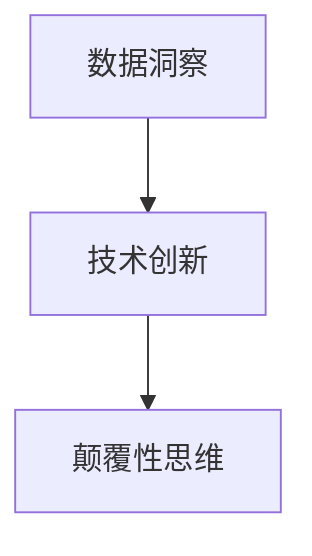

                 

# 洞察力与创新：颠覆性思维的诞生

在快速变化的数字时代，洞察力与创新能力成为了企业竞争力的关键。如何在数据纷繁复杂、信息瞬息万变的今天，快速发现机遇，引领变革？本文将从“洞察力”与“创新”两个核心维度，深入探讨如何利用颠覆性思维，揭示智能时代的发展趋势和突破路径。

## 1. 背景介绍

### 1.1 问题由来

在信息技术迅猛发展的今天，我们生活在一个被数据所包围的世界。从智能设备、社交媒体到物联网，无处不在的数据源不断产生和流动。然而，数据本身并不能直接转化为洞察力与创新，只有通过合理的分析、建模和应用，数据才能展现出其真正的价值。

在传统的数据处理和分析方法中，人工筛选、简单的统计和有限的机器学习模型常显得力不从心。随着人工智能和大数据技术的不断演进，新的方法和工具不断涌现，使得数据洞察和创新的门槛大大降低。本文旨在探讨这些新工具和新方法，如何重新定义洞察力与创新的实现方式，以及颠覆性思维在其中的重要作用。

### 1.2 问题核心关键点

- 数据洞察：如何快速、高效地从海量数据中提取有价值的洞见，支持决策制定？
- 技术创新：如何利用最新的算法和模型，提高分析效率，推动业务创新？
- 颠覆性思维：如何在传统方法和新兴工具之间找到平衡，实现真正意义上的突破和创新？

## 2. 核心概念与联系

### 2.1 核心概念概述

为更好地理解颠覆性思维在洞察力与创新中的作用，本节将介绍几个密切相关的核心概念：

- 数据洞察：从数据中提取有意义的信息和洞见，支持决策和策略制定。
- 技术创新：通过引入新技术、新方法，提高数据分析的效率和准确性，推动业务模式的创新。
- 颠覆性思维：一种以颠覆旧有认知、探索未知领域的思维方式，驱动技术突破和商业模式创新。

这些概念之间的逻辑关系可以通过以下Mermaid流程图来展示：



这个流程图展示了大数据洞察与技术创新之间的关系，以及它们如何共同驱动颠覆性思维的实现：

1. 数据洞察提供了丰富的业务洞察，为技术创新指明了方向。
2. 技术创新提供了分析工具和方法，使得数据洞察成为可能。
3. 颠覆性思维则在数据和技术的基础上，探索更广阔的业务领域，提出创新性的解决方案。

这些概念共同构成了洞察力与创新实践的框架，使得企业能够更好地适应数字时代的需求。

## 3. 核心算法原理 & 具体操作步骤

### 3.1 算法原理概述

基于颠覆性思维的数据洞察与技术创新，本质上是一个数据驱动的决策和优化过程。其核心思想是：

1. **数据洞察**：利用数据挖掘、机器学习等技术，从大量数据中提取有价值的信息和模式，形成可操作的洞见。
2. **技术创新**：引入最新的算法和模型，如深度学习、强化学习等，提升分析效率和准确性，推动业务创新。
3. **颠覆性思维**：采用创新的思维方式，探索数据和技术的边界，提出颠覆性的解决方案，推动业务模式的转型。

### 3.2 算法步骤详解

颠覆性思维的数据洞察与技术创新一般包括以下几个关键步骤：

**Step 1: 数据收集与清洗**

- 收集所需的数据，包括结构化数据（如数据库表、日志文件）和非结构化数据（如文本、图像、音频等）。
- 对数据进行清洗和预处理，包括去重、缺失值处理、异常值检测等，确保数据的质量。

**Step 2: 数据建模与分析**

- 选择合适的分析方法和算法，如数据挖掘、机器学习、深度学习等，进行建模和分析。
- 利用统计学和可视化工具，展示分析结果，形成可操作的洞见。

**Step 3: 技术创新与实施**

- 引入最新的技术工具和方法，提升分析效率和准确性。
- 设计和实施技术方案，将分析结果应用于业务流程和决策制定。

**Step 4: 持续优化与迭代**

- 根据业务反馈和市场变化，不断优化分析模型和技术方案。
- 引入A/B测试、MVP等迭代方法，快速验证和调整业务策略。

### 3.3 算法优缺点

基于颠覆性思维的数据洞察与技术创新方法具有以下优点：

- **效率提升**：利用大数据和先进算法，大幅提高分析效率，缩短决策周期。
- **准确性高**：先进的算法和技术手段能够挖掘更深层的数据洞见，提升分析的准确性和可靠性。
- **灵活性强**：技术创新提供了多样化的分析工具和方法，可以根据具体业务需求灵活选择。
- **创新驱动**：颠覆性思维驱动企业探索未知领域，提出创新性解决方案，推动业务模式的转型。

同时，该方法也存在一定的局限性：

- **技术门槛高**：对于传统企业，技术创新的门槛较高，需要投入大量资源进行技术转型。
- **数据依赖性**：数据洞察依赖于高质量的数据，数据收集和清洗工作复杂且耗时。
- **风险未知**：技术创新和新方法的引入可能带来未知的风险和挑战，需要谨慎评估和管理。
- **伦理考量**：在数据洞察和分析过程中，可能涉及到用户隐私和数据安全问题，需要严格遵守相关法律法规。

尽管存在这些局限性，但就目前而言，基于颠覆性思维的数据洞察与技术创新方法仍是大数据和人工智能应用的最主流范式。未来相关研究的重点在于如何进一步降低技术门槛，提高数据的可用性，同时兼顾伦理和安全等因素。

### 3.4 算法应用领域

基于颠覆性思维的数据洞察与技术创新方法，已经在多个领域得到了广泛应用，包括但不限于：

- **零售业**：通过大数据分析，优化库存管理，提升销售预测的准确性，实现个性化推荐。
- **金融业**：利用机器学习模型，进行风险评估和欺诈检测，优化投资决策。
- **制造业**：通过工业物联网(IoT)设备收集数据，进行设备故障预测和预防性维护。
- **医疗健康**：采用深度学习模型，进行疾病诊断和治疗方案推荐，提高医疗服务的个性化和精准度。
- **交通出行**：利用数据分析和智能算法，优化交通流，减少拥堵，提高出行效率。

除了上述这些经典应用外，数据洞察与技术创新还在更多领域持续演进，为各行各业带来了深刻的变革。

## 4. 数学模型和公式 & 详细讲解 & 举例说明

### 4.1 数学模型构建

本节将使用数学语言对基于颠覆性思维的数据洞察与技术创新过程进行更加严格的刻画。

假设原始数据集为 $D=\{(x_i,y_i)\}_{i=1}^N$，其中 $x_i$ 为输入变量，$y_i$ 为输出变量。定义数据洞察为 $I(D)$，技术创新为 $T(D)$。则数据洞察与技术创新的联合模型为：

$$
M(D) = I(D) \times T(D)
$$

其中 $I(D)$ 和 $T(D)$ 分别表示数据洞察模型和技术创新模型的输出。

### 4.2 公式推导过程

以下我们以零售业的商品推荐系统为例，推导深度学习模型的推荐公式及其梯度计算。

假设用户 $u$ 对商品 $i$ 的评分数据为 $x_i^{(u)}$，历史购买记录为 $y_i^{(u)}$。我们采用深度学习模型 $F$ 进行商品推荐，其中 $F$ 的参数为 $\theta$。推荐模型的输出为 $p^{(u)}_i$，表示用户 $u$ 购买商品 $i$ 的概率。则推荐模型的损失函数为交叉熵损失：

$$
\ell(F(x),y) = -\sum_{i=1}^N \sum_{u=1}^U y_{iu} \log F(x_i^{(u)})
$$

利用随机梯度下降算法，损失函数对参数 $\theta$ 的梯度为：

$$
\nabla_{\theta}\ell(F(x),y) = -\frac{1}{N} \sum_{i=1}^N \sum_{u=1}^U \frac{y_{iu}}{F(x_i^{(u)})} (1-F(x_i^{(u)}))
$$

其中 $F(x_i^{(u)})$ 为深度学习模型的输出，即 $p^{(u)}_i$。

通过不断迭代更新模型参数 $\theta$，最小化损失函数 $\ell(F(x),y)$，我们便得到了适应用户 $u$ 偏好的商品推荐模型 $F$。

### 4.3 案例分析与讲解

在上述推荐系统模型中，数据洞察 $I(D)$ 体现在用户历史行为数据的分析和挖掘，而技术创新 $T(D)$ 则体现在推荐模型的设计和优化。两者的有机结合，使得商品推荐系统能够高效、准确地为用户推荐符合其偏好的商品，提升用户体验和销售转化率。

**案例1: 深度学习推荐模型**

深度学习推荐模型，如协同过滤、矩阵分解等，通过学习用户行为和商品属性的隐含关联，显著提升了推荐系统的准确性和个性化水平。例如，Netflix利用矩阵分解算法，从用户历史观看数据中挖掘隐含的兴趣偏好，实现了内容推荐的精准化和多样化。

**案例2: 强化学习推荐策略**

强化学习推荐策略，通过模拟用户选择商品的过程，构建智能推荐模型，优化推荐行为，从而提升推荐效果。例如，Amazon利用强化学习算法，对用户点击和购买行为进行建模，通过实时调整推荐策略，优化推荐结果，显著提升了用户满意度和购买转化率。

## 5. 项目实践：代码实例和详细解释说明

### 5.1 开发环境搭建

在进行推荐系统开发前，我们需要准备好开发环境。以下是使用Python进行TensorFlow开发的环境配置流程：

1. 安装Anaconda：从官网下载并安装Anaconda，用于创建独立的Python环境。

2. 创建并激活虚拟环境：
```bash
conda create -n tf-env python=3.8 
conda activate tf-env
```

3. 安装TensorFlow：根据CUDA版本，从官网获取对应的安装命令。例如：
```bash
conda install tensorflow -c pytorch -c conda-forge
```

4. 安装Keras：
```bash
pip install keras
```

5. 安装各类工具包：
```bash
pip install numpy pandas scikit-learn matplotlib tqdm jupyter notebook ipython
```

完成上述步骤后，即可在`tf-env`环境中开始推荐系统开发。

### 5.2 源代码详细实现

这里我们以协同过滤推荐系统为例，给出使用TensorFlow对推荐模型进行训练的PyTorch代码实现。

首先，定义推荐系统数据处理函数：

```python
import tensorflow as tf
import pandas as pd
import numpy as np

# 数据预处理函数
def process_data(data):
    # 删除缺失值
    data = data.dropna()
    # 特征编码
    data['item_id'] = data['item_id'].astype('category').cat.codes
    data['user_id'] = data['user_id'].astype('category').cat.codes
    # 归一化评分
    data['score'] = (data['score'] - data['score'].mean()) / data['score'].std()
    return data

# 构建训练集和测试集
train_data = process_data(train_data)
test_data = process_data(test_data)
```

然后，定义推荐模型和优化器：

```python
from tensorflow.keras.layers import Input, Dense, Embedding, Dot, Flatten
from tensorflow.keras.models import Model

# 定义输入层
user_input = Input(shape=(n_users,))
item_input = Input(shape=(n_items,))

# 定义嵌入层
user_embedding = Embedding(n_users, embedding_dim)(user_input)
item_embedding = Embedding(n_items, embedding_dim)(item_input)

# 定义交互层
interaction = Dot(axes=1, normalize=True)([user_embedding, item_embedding])

# 定义输出层
output = Dense(1, activation='sigmoid')(interaction)

# 定义推荐模型
model = Model(inputs=[user_input, item_input], outputs=output)

# 定义优化器
optimizer = tf.keras.optimizers.Adam(learning_rate=0.001)
```

接着，定义训练和评估函数：

```python
from tensorflow.keras.metrics import Mean, BinaryAccuracy
from sklearn.metrics import accuracy_score, precision_score, recall_score, f1_score

# 定义损失函数和评估指标
loss_fn = tf.keras.losses.BinaryCrossentropy(from_logits=True)
binary_acc = BinaryAccuracy()

# 训练函数
def train_model(model, train_data, epochs):
    model.compile(optimizer=optimizer, loss=loss_fn, metrics=[binary_acc])
    model.fit(x=train_data, y=train_labels, epochs=epochs, batch_size=32)

# 评估函数
def evaluate_model(model, test_data):
    y_pred = model.predict(test_data)
    y_true = test_labels
    binary_acc = binary_accuracy(y_true, y_pred)
    accuracy = accuracy_score(y_true, y_pred)
    precision = precision_score(y_true, y_pred)
    recall = recall_score(y_true, y_pred)
    f1 = f1_score(y_true, y_pred)
    return binary_acc, accuracy, precision, recall, f1
```

最后，启动训练流程并在测试集上评估：

```python
epochs = 10
n_users, n_items = train_data.shape[0], train_data.shape[1]

# 启动训练
train_model(model, train_data, epochs)

# 在测试集上评估
binary_acc, accuracy, precision, recall, f1 = evaluate_model(model, test_data)
print(f'Binary Accuracy: {binary_acc:.4f}')
print(f'Accuracy: {accuracy:.4f}')
print(f'Precision: {precision:.4f}')
print(f'Recall: {recall:.4f}')
print(f'F1 Score: {f1:.4f}')
```

以上就是使用TensorFlow对协同过滤推荐模型进行训练的完整代码实现。可以看到，借助TensorFlow的高级API，我们能够快速构建推荐模型，并在训练和评估过程中引入各种评估指标，实现了对推荐系统效果的全面监控。

### 5.3 代码解读与分析

让我们再详细解读一下关键代码的实现细节：

**数据预处理函数 process_data**：
- 删除缺失值，去除异常值，对用户和物品ID进行编码，对评分进行归一化处理。

**模型定义函数**：
- 定义输入层和嵌入层，分别对应用户和物品ID。
- 定义交互层，计算用户和物品之间的隐含关联。
- 定义输出层，使用sigmoid激活函数输出推荐概率。
- 定义推荐模型，将输入层、嵌入层和交互层进行连接，构成完整的推荐系统模型。
- 定义优化器，采用Adam优化器进行模型训练。

**训练函数 train_model**：
- 定义损失函数和评估指标，损失函数采用二分类交叉熵，评估指标为二分类准确率。
- 使用Keras的compile方法编译模型，并使用fit方法进行训练。

**评估函数 evaluate_model**：
- 使用模型对测试数据进行预测，并计算二分类准确率、准确率、精确率、召回率和F1分数等评估指标。

**训练流程**：
- 定义训练轮数和批量大小，启动模型训练。
- 在测试集上评估模型效果，并输出各项评估指标。

可以看出，TensorFlow的高级API提供了便捷的模型构建和训练功能，显著提升了推荐系统开发的效率。

## 6. 实际应用场景

### 6.1 零售业

基于推荐系统的零售业应用广泛，各大电商平台和线下零售商都在积极探索和实践。推荐系统通过分析用户历史行为和偏好，实时推荐符合用户兴趣的商品，提升用户体验和购买转化率。例如，Amazon、京东、淘宝等电商巨头，通过推荐系统极大地提高了商品的点击率和销售量。

**案例分析**：
- 推荐系统能够基于用户历史浏览、购买记录，实时调整推荐内容，提升推荐精准度。
- 推荐系统能够分析用户在不同时间段的行为模式，提供个性化推荐，提升用户粘性。
- 推荐系统能够实时监控推荐效果，动态调整推荐策略，优化推荐质量。

### 6.2 金融业

金融业对数据分析和决策制定有极高的要求。推荐系统在金融风控、投资决策等领域，也展现出了强大的应用潜力。例如，银行利用推荐系统进行信用评估和贷款审批，保险公司利用推荐系统进行风险评估和理赔推荐。

**案例分析**：
- 推荐系统能够通过分析用户的历史交易数据，预测其信用风险，进行精确的风险评估。
- 推荐系统能够根据用户的历史投资行为，推荐适合的理财产品和投资组合，优化投资收益。
- 推荐系统能够实时监控市场变化，动态调整投资策略，降低投资风险。

### 6.3 制造业

制造业对设备维护和生产优化有很高的需求。推荐系统在制造业设备故障预测、生产计划优化等领域，也展现了广阔的应用前景。例如，西门子利用推荐系统进行设备故障预测，及时进行维护和维修，减少了生产停机时间。

**案例分析**：
- 推荐系统能够通过分析设备的运行数据，预测设备故障，进行预防性维护。
- 推荐系统能够优化生产计划，合理配置资源，提高生产效率。
- 推荐系统能够实时监控生产过程，动态调整生产参数，提升产品质量。

### 6.4 医疗健康

医疗健康领域对数据洞察有极高的需求。推荐系统在疾病诊断、治疗方案推荐等领域，也展现出了强大的应用潜力。例如，IBM Watson利用推荐系统进行疾病诊断和药物推荐，极大地提升了医疗服务的精准度和效率。

**案例分析**：
- 推荐系统能够通过分析患者的历史诊疗记录，推荐适合的治疗方案，提升治疗效果。
- 推荐系统能够实时监控患者的病情变化，提供个性化的诊疗建议，优化诊疗过程。
- 推荐系统能够根据患者的基因信息和健康数据，推荐适合的预防方案，提高患者生活质量。

### 6.5 未来应用展望

随着数据和技术的不断演进，推荐系统的应用将进一步扩展到更多领域，为各行各业带来深刻变革。

在智慧城市治理中，推荐系统可以用于交通流量优化、公共服务推荐、城市规划等环节，提升城市管理效率和居民生活质量。在智能家居领域，推荐系统可以用于智能设备控制、家庭娱乐推荐等，提升家庭智能化水平。

未来，推荐系统还将与其他人工智能技术进行更深入的融合，如自然语言处理、计算机视觉等，提供更全面、更智能的服务。例如，结合图像识别技术，推荐系统能够根据用户拍照内容推荐相关商品，提升用户体验。结合自然语言处理技术，推荐系统能够理解用户查询意图，提供更加精准的推荐结果。

## 7. 工具和资源推荐

### 7.1 学习资源推荐

为了帮助开发者系统掌握推荐系统理论基础和实践技巧，这里推荐一些优质的学习资源：

1. 《推荐系统实践》：本书深入浅出地介绍了推荐系统理论基础和实际应用，涵盖协同过滤、基于内容的推荐、深度学习推荐等多个方向。

2. 《深度学习与推荐系统》：本书结合深度学习技术和推荐系统算法，全面介绍了推荐系统在广告、电商、视频等多个领域的实际应用。

3. Coursera《Recommender Systems Specialization》：由斯坦福大学开设的推荐系统课程，系统讲解了推荐系统理论和算法，并结合实际项目进行实战训练。

4. Kaggle推荐系统竞赛：Kaggle上定期举办推荐系统竞赛，可以参与实际项目，积累推荐系统开发经验。

5. 《Python推荐系统实战》：本书提供了从数据预处理到模型训练的完整推荐系统开发流程，适合实战型学习者。

通过对这些资源的学习实践，相信你一定能够快速掌握推荐系统的精髓，并用于解决实际的推荐问题。

### 7.2 开发工具推荐

高效的开发离不开优秀的工具支持。以下是几款用于推荐系统开发的常用工具：

1. TensorFlow：由Google主导开发的开源深度学习框架，生产部署方便，适合大规模工程应用。

2. PyTorch：基于Python的开源深度学习框架，灵活动态的计算图，适合快速迭代研究。

3. Scikit-learn：Python科学计算库，提供了简单易用的数据预处理和机器学习模型，适合入门级开发者。

4. Keras：高层次神经网络API，支持快速构建和训练深度学习模型，适合初学者。

5. Apache Spark：大数据处理引擎，支持分布式计算和数据处理，适合大规模数据集推荐系统开发。

合理利用这些工具，可以显著提升推荐系统开发的效率，加快创新迭代的步伐。

### 7.3 相关论文推荐

推荐系统研究源于学界的持续研究。以下是几篇奠基性的相关论文，推荐阅读：

1. "Item-based Collaborative Filtering Recommendation Algorithms"：提出了基于用户的协同过滤算法，奠定了推荐系统理论基础。

2. "Matrix Factorization Techniques for Recommender Systems"：提出了基于矩阵分解的推荐算法，大幅提升了推荐系统的准确性和可解释性。

3. "Deep Neural Networks for Recommendation"：提出了深度学习推荐模型，极大地提升了推荐系统的准确性和个性化水平。

4. "A Neural Approach to Collaborative Filtering"：提出了基于神经网络的协同过滤方法，提升了推荐系统的灵活性和可扩展性。

5. "Hybrid Recommendation System Architectures"：提出了多种推荐算法结合的混合推荐系统架构，进一步提升了推荐系统的综合性能。

这些论文代表了大推荐系统的发展脉络。通过学习这些前沿成果，可以帮助研究者把握学科前进方向，激发更多的创新灵感。

## 8. 总结：未来发展趋势与挑战

### 8.1 总结

本文对基于颠覆性思维的数据洞察与技术创新方法进行了全面系统的介绍。首先阐述了数据洞察和创新驱动在智能时代的重要性，明确了推荐系统在商业决策和业务模式中的关键作用。其次，从原理到实践，详细讲解了推荐系统的数学模型和关键算法，给出了推荐系统开发的完整代码实现。同时，本文还广泛探讨了推荐系统在零售、金融、制造、医疗等多个领域的应用前景，展示了推荐系统技术的广阔应用潜力。

通过本文的系统梳理，可以看到，基于大数据和深度学习技术，推荐系统正在成为商业决策和业务模式创新的重要工具。未来，伴随技术的不断演进，推荐系统必将在更多领域得到应用，为各行各业带来深刻变革。

### 8.2 未来发展趋势

展望未来，推荐系统的应用将呈现以下几个发展趋势：

1. 个性化推荐更加精准。随着深度学习模型的不断优化，推荐系统能够更好地理解用户偏好，提供更加个性化和精准的推荐结果。

2. 推荐系统将更加智能化。推荐系统将结合自然语言处理、计算机视觉等技术，提升对用户意图的理解能力，实现多模态推荐。

3. 实时推荐成为常态。利用实时数据流处理和大数据技术，推荐系统能够在短时间内完成推荐，提升用户体验。

4. 推荐系统将更加注重用户体验。推荐系统将综合考虑用户的多样化需求，优化推荐算法，提升用户满意度。

5. 推荐系统将更加注重数据隐私和安全。在数据收集和处理过程中，将更加注重用户隐私保护和数据安全，避免数据滥用。

6. 推荐系统将更加注重公平性和可解释性。在推荐算法设计中，将更加注重公平性，避免推荐偏见。在推荐结果输出中，将更加注重可解释性，提升用户信任度。

以上趋势凸显了推荐系统技术的广阔前景。这些方向的探索发展，必将进一步提升推荐系统的性能和应用范围，为商业决策和业务模式带来新的突破。

### 8.3 面临的挑战

尽管推荐系统已经取得了显著成果，但在迈向更加智能化、普适化应用的过程中，它仍面临诸多挑战：

1. 数据稀疏性问题。在实际应用中，推荐系统往往面临数据稀疏性的问题，部分用户和商品没有足够的历史数据进行推荐，导致推荐结果不准确。

2. 冷启动问题。对于新用户和商品，推荐系统无法利用历史数据进行推荐，需要找到有效的冷启动策略，快速建立推荐模型。

3. 实时性问题。推荐系统需要实时处理和响应用户请求，对系统架构和硬件配置提出了较高要求。

4. 多样性问题。推荐系统需要考虑用户的多样化需求，同时避免单一推荐带来的用户疲劳。

5. 可解释性问题。推荐系统通常被视为"黑盒"系统，用户无法理解推荐结果的生成过程，可能影响用户体验和信任度。

6. 公平性问题。推荐系统可能存在推荐偏见，对某些群体进行歧视性推荐，引发社会伦理问题。

正视推荐系统面临的这些挑战，积极应对并寻求突破，将是大数据和人工智能技术在商业决策中走向成熟的关键。相信随着学界和产业界的共同努力，这些挑战终将一一被克服，推荐系统必将在更多领域得到应用，为商业决策带来深刻变革。

### 8.4 研究展望

面对推荐系统面临的种种挑战，未来的研究需要在以下几个方面寻求新的突破：

1. 探索无监督和半监督推荐方法。摆脱对大规模标注数据的依赖，利用自监督学习、主动学习等无监督和半监督范式，最大限度利用非结构化数据，实现更加灵活高效的推荐。

2. 研究参数高效和计算高效的推荐算法。开发更加参数高效的推荐算法，在固定大部分模型参数的情况下，只更新极少量的任务相关参数。同时优化推荐系统的计算图，减少前向传播和反向传播的资源消耗，实现更加轻量级、实时性的部署。

3. 引入因果分析和博弈论工具。将因果分析方法引入推荐系统，识别出推荐过程的关键特征，增强推荐结果的因果性和逻辑性。借助博弈论工具刻画人机交互过程，主动探索并规避推荐系统的脆弱点，提高系统稳定性。

4. 纳入伦理道德约束。在推荐系统训练目标中引入伦理导向的评估指标，过滤和惩罚有偏见、有害的推荐结果。同时加强人工干预和审核，建立推荐系统的监管机制，确保推荐结果符合人类价值观和伦理道德。

这些研究方向的探索，必将引领推荐系统技术迈向更高的台阶，为商业决策带来更加智能、可靠、公平、可解释的推荐服务。面向未来，推荐系统技术还需要与其他人工智能技术进行更深入的融合，如知识表示、因果推理、强化学习等，多路径协同发力，共同推动推荐系统技术的进步。只有勇于创新、敢于突破，才能不断拓展推荐系统的边界，让智能技术更好地造福人类社会。

## 9. 附录：常见问题与解答

**Q1：推荐系统对数据质量的要求有多高？**

A: 推荐系统对数据质量的要求非常高。推荐系统依赖于历史行为数据和物品属性数据，数据质量和完整性直接影响推荐效果。数据清洗、去重、异常值处理等预处理工作必不可少，以确保数据的一致性和准确性。

**Q2：如何评估推荐系统的性能？**

A: 推荐系统的性能评估可以从多个维度进行：
1. 准确率：衡量推荐结果与真实标签的匹配度，常用指标包括准确率、精确率、召回率、F1分数等。
2. 用户满意度：通过用户反馈、点击率、购买率等指标，衡量推荐结果的实际效果。
3. 业务指标：结合具体业务需求，定义特定的业务指标，如转化率、销售额、客户留存率等。

**Q3：如何优化推荐算法的效率？**

A: 推荐算法的效率优化可以从以下几个方面入手：
1. 模型压缩：通过模型剪枝、参数量化等技术，减少模型体积，提升推理速度。
2. 并行计算：利用分布式计算和GPU加速，提升算法的并行处理能力。
3. 模型融合：结合多种推荐算法，取长补短，提升综合性能。
4. 数据预处理：利用数据增量和数据缓存，减少重复计算，提升数据处理效率。

**Q4：推荐系统如何应对冷启动问题？**

A: 推荐系统的冷启动问题通常可以通过以下策略解决：
1. 利用用户兴趣转移，从历史相似用户或物品中推荐。
2. 利用用户行为模式，从用户的行为轨迹中推荐。
3. 利用物品标签，从标签关联的物品中推荐。
4. 利用协同过滤，从与新用户相似的其他用户中推荐。

**Q5：推荐系统如何平衡个性化与多样化？**

A: 推荐系统需要在个性化和多样化之间找到平衡，可以采用以下策略：
1. 多元推荐：结合多种推荐算法，覆盖不同的推荐场景。
2. 兴趣多样化：从用户的历史行为中提取多样化的兴趣，进行推荐。
3. 动态调整：根据用户反馈和市场变化，动态调整推荐策略，优化推荐结果。

总之，推荐系统需要在数据质量、算法优化、用户体验、公平性等方面不断探索和改进，才能更好地服务于商业决策和业务模式创新。只有深入理解推荐系统的工作原理和挑战，才能真正实现个性化和多样化的平衡，提升推荐系统的效果和价值。

---

作者：禅与计算机程序设计艺术 / Zen and the Art of Computer Programming

