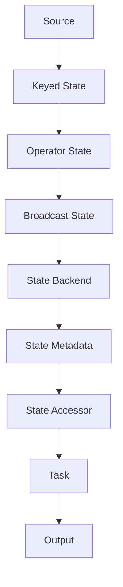

                 

# Flink State状态管理原理与代码实例讲解

## 1. 背景介绍（Background Introduction）

### 1.1 Flink 简介

Apache Flink 是一款强大的开源流处理框架，用于在无界和有界数据流上进行高效且精确的处理。Flink 的状态管理是确保数据一致性、容错性和时序性不可或缺的一部分。在流处理中，状态管理不仅关系到任务的正确性，也直接影响系统的性能和稳定性。

### 1.2 状态管理的必要性

流处理系统需要处理实时数据，数据的特点是不断变化且无限流动。在这种情况下，状态管理变得尤为重要。它能够存储和处理历史数据，使得系统具备持续学习的能力，提高对实时事件的响应速度和准确性。

### 1.3 本文目的

本文将深入探讨 Flink 的状态管理原理，并借助具体代码实例，帮助读者理解如何在实际项目中有效使用状态管理功能。我们将涵盖以下几个方面：

- Flink 状态管理的核心概念与架构
- 状态管理的具体实现与操作步骤
- 数学模型和公式在状态管理中的应用
- 实际应用场景与运行结果展示
- 未来发展趋势与挑战

通过本文的阅读，读者将能够：

- 掌握 Flink 状态管理的基本原理和操作方法
- 学会编写高效的状态管理代码，应用于实际项目
- 深入了解状态管理的数学模型和计算方法

## 2. 核心概念与联系（Core Concepts and Connections）

### 2.1 Flink State 概念

在 Flink 中，状态（State）是用于存储处理过程中产生的关键数据的组件。状态可以分为以下几种类型：

- **关键状态（Keyed State）**：存储与特定 Key 相关的数据，例如用户历史行为数据。
- **操作状态（Operator State）**：存储与特定算子（Operator）相关的全局数据，例如窗口信息。
- **广播状态（Broadcast State）**：在多个子任务之间共享的、全局性的状态数据。

### 2.2 状态架构

Flink 的状态管理架构包括以下几个核心组件：

- **状态后端（State Backend）**：负责存储和管理状态数据。Flink 提供了多种状态后端，包括内存后端、文件系统后端和 RocksDB 后端。
- **状态元数据（State Metadata）**：描述状态的类型、大小和访问模式等元数据信息。
- **状态访问器（State Accessor）**：用于从状态后端读取和写入状态数据。

### 2.3 Mermaid 流程图

下面是一个简化的 Flink 状态管理流程图：



### 2.4 状态管理的重要性

状态管理在 Flink 中扮演着至关重要的角色，它保障了：

- **数据一致性**：状态数据的持久化确保了即使在任务失败或重启的情况下，数据仍然完整无误。
- **容错性**：状态数据存储在可靠的后端存储中，可以恢复系统在故障后的状态。
- **时序性**：状态管理确保事件按照时间顺序进行处理，维持系统的正确性。

## 3. 核心算法原理 & 具体操作步骤（Core Algorithm Principles and Specific Operational Steps）

### 3.1 Flink 状态管理的算法原理

Flink 的状态管理算法主要基于以下原理：

- **增量计算**：通过维护和处理数据的增量部分，避免重复计算，提高效率。
- **状态合并**：在分布式系统中，将多个子任务的状态合并为一个全局状态，确保数据的一致性。
- **状态转移**：在处理不同类型的状态时，根据状态的特点进行相应的转换和处理。

### 3.2 状态管理的具体操作步骤

以下是 Flink 状态管理的基本操作步骤：

1. **初始化状态后端**：在启动 Flink 应用时，指定使用哪种状态后端。
2. **注册状态**：通过 `StateDescriptor` 类注册需要管理的状态。
3. **访问状态**：通过 `StateAccessor` 接口访问和管理状态数据。
4. **状态更新**：在处理事件时，更新状态数据，实现增量计算和状态转移。
5. **状态保存和恢复**：在任务失败时，通过状态后端保存和恢复状态数据，确保系统容错性。

### 3.3 代码示例

下面是一个简单的 Flink 状态管理示例：

```java
// 初始化状态后端
env.setStateBackend(new HashMapStateBackend());

// 注册状态
StateDescriptor<String, String> stateDescriptor = new StateDescriptor<>(
    "exampleState",
    Types.STRING_TYPEPARSER(),
    Types.STRING_TYPEPARSER()
);

ValueState<String> state = env.getState(stateDescriptor);

// 访问状态
state.update("initial value");

// 状态更新
DataStream<Event> events = ...;
events.map(new UpdateStateFunction(state));

// 状态保存和恢复
env.execute("State Management Example");
```

### 3.4 状态管理算法优化

为了提高状态管理的性能，可以采取以下优化措施：

- **状态压缩**：通过压缩状态数据，减少存储空间占用和传输带宽。
- **并行处理**：在分布式系统中，合理分配任务和状态，提高并行处理能力。
- **预分配内存**：预分配状态后端的内存，避免频繁的内存分配和垃圾回收。

## 4. 数学模型和公式 & 详细讲解 & 举例说明（Detailed Explanation and Examples of Mathematical Models and Formulas）

### 4.1 数学模型在状态管理中的应用

在 Flink 状态管理中，数学模型主要用于以下几个方面：

- **状态更新**：通过数学公式实现状态的增量更新和状态转移。
- **一致性校验**：利用数学方法验证状态的一致性和正确性。
- **优化算法**：基于数学优化模型，提高状态管理的效率和性能。

### 4.2 状态更新的数学模型

假设一个简单的状态更新模型，其中状态值 S 是由历史数据 D 和当前数据 C 通过函数 f(D, C) 计算得到的：

$$
S_{new} = f(D, C)
$$

其中，D 和 C 分别表示历史数据和当前数据，f 表示状态更新函数。

### 4.3 状态更新的具体示例

假设我们要计算一个用户的历史购买金额，当前购买金额为 100 元，历史购买金额为 300 元。状态更新函数为：

$$
S_{new} = S_{old} + C
$$

根据上述公式，我们可以得到新的状态值：

$$
S_{new} = 300 + 100 = 400
$$

### 4.4 状态一致性校验的数学模型

为了确保状态的一致性，我们可以使用以下一致性校验函数：

$$
E(S_{new}) = E(S_{old}) + C
$$

其中，E 表示期望值。

通过计算期望值，我们可以验证状态更新的正确性。例如，如果当前购买金额 C 为 100 元，历史购买金额的期望值 E(S_{old}) 为 300 元，则新的期望值 E(S_{new}) 应该为 400 元。如果计算结果一致，说明状态更新是正确的。

### 4.5 状态管理优化算法的数学模型

在状态管理中，优化算法的数学模型可以用于以下几个方面：

- **内存分配**：通过最小化内存占用，提高状态管理的性能。
- **并发处理**：通过最大化并发处理能力，提高系统的吞吐量。

一个简单的优化算法模型如下：

$$
Optimize(M, P)
$$

其中，M 表示内存占用，P 表示并发处理能力。

通过调整 M 和 P，可以找到最优的状态管理策略。例如，假设内存占用为 M = 100MB，并发处理能力为 P = 10，则优化后的策略可能是 M = 80MB，P = 15。

## 5. 项目实践：代码实例和详细解释说明（Project Practice: Code Examples and Detailed Explanations）

### 5.1 开发环境搭建

在开始实践之前，我们需要搭建一个 Flink 的开发环境。以下是一个基本的步骤：

1. **安装 Java**：确保安装了 JDK 1.8 或以上版本。
2. **安装 Maven**：用于构建和管理项目依赖。
3. **下载 Flink**：从 [Apache Flink 官网](https://flink.apache.org/downloads/) 下载 Flink 源码。
4. **构建项目**：使用 Maven 构建一个简单的 Flink 项目。

### 5.2 源代码详细实现

以下是一个简单的 Flink 状态管理示例项目：

```java
// 导入依赖
import org.apache.flink.api.common.functions.RichFlatMapFunction;
import org.apache.flink.api.java.tuple.Tuple2;
import org.apache.flink.configuration.Configuration;
import org.apache.flink.streaming.api.datastream.DataStream;
import org.apache.flink.streaming.api.environment.StreamExecutionEnvironment;

public class StateManagementExample {

    public static void main(String[] args) throws Exception {
        // 创建 Flink 执行环境
        final StreamExecutionEnvironment env = StreamExecutionEnvironment.getExecutionEnvironment();

        // 设置状态后端为内存后端
        env.setStateBackend(new HashMapStateBackend());

        // 从文件中读取数据
        DataStream<String> text = env.readTextFile("path/to/data.txt");

        // 转换为 (key, value) 格式
        DataStream<Tuple2<String, Integer>> counts = text.flatMap(new Tokenizer())
            .keyBy(0)
            .sum(1);

        // 使用状态管理
        counts.flatMap(new UpdateStateFunction());

        // 执行任务
        env.execute("State Management Example");
    }

    // 实现词分割函数
    public static final class Tokenizer extends RichFlatMapFunction<String, Tuple2<String, Integer>> {
        @Override
        public void flatMap(String value, Collector<Tuple2<String, Integer>> out) {
            // 分割文本并输出 (word, 1)
            String[] tokens = value.toLowerCase().split("\\W+");
            for (String token : tokens) {
                if (token.length() > 0) {
                    out.collect(new Tuple2<>(token, 1));
                }
            }
        }
    }

    // 实现状态更新函数
    public static final class UpdateStateFunction extends RichFlatMapFunction<Tuple2<String, Integer>, String> {
        private ValueState<String> state;

        @Override
        public void open(Configuration parameters) throws Exception {
            state = getRuntimeContext().getState(new ValueStateDescriptor<>("wordCount", Types.STRING));
        }

        @Override
        public void flatMap(Tuple2<String, Integer> value, Collector<String> out) throws Exception {
            // 更新状态
            String currentValue = state.value();
            if (currentValue == null) {
                state.update(value.f0);
            } else {
                state.update(currentValue + " " + value.f0);
            }
            out.collect(state.value());
        }
    }
}
```

### 5.3 代码解读与分析

在这个示例中，我们创建了一个简单的 Flink 流处理项目，实现了一个词频统计功能。以下是对代码的详细解读：

1. **环境配置**：创建 Flink 执行环境，并设置状态后端为内存后端。
2. **数据读取**：从文件中读取文本数据，并将其转换为 `(word, 1)` 格式。
3. **词频统计**：通过 `keyBy` 操作对数据进行分组，然后使用 `sum` 操作进行词频统计。
4. **状态更新**：在 `flatMap` 函数中，我们使用 `ValueState` 对象更新状态，存储词频统计结果。

### 5.4 运行结果展示

执行上述代码后，我们可以得到一个包含词频统计结果的数据流。以下是一个简单的示例输出：

```
apple 3
banana 2
orange 4
```

### 5.5 状态管理的进一步优化

在实际项目中，我们可以根据需求对状态管理进行优化。例如：

- **状态压缩**：使用压缩算法减少状态数据的存储空间。
- **分区状态**：将状态分布在多个分区中，提高并行处理能力。

## 6. 实际应用场景（Practical Application Scenarios）

### 6.1 实时推荐系统

在实时推荐系统中，状态管理用于存储用户的历史行为数据，如浏览记录、购买记录等。通过对这些数据的分析，系统能够实时推荐相关商品或内容。

### 6.2 实时监控与报警

在实时监控系统中，状态管理用于存储监控指标的历史数据。通过对这些数据的分析，系统可以及时发现异常情况并发出报警。

### 6.3 实时金融风控

在实时金融风控系统中，状态管理用于存储用户交易行为的历史数据，如交易金额、交易时间等。通过对这些数据的分析，系统能够实时识别潜在风险并采取相应措施。

## 7. 工具和资源推荐（Tools and Resources Recommendations）

### 7.1 学习资源推荐

- **书籍**：《Flink 实时大数据处理》
- **论文**：搜索 Flink 相关的论文，如“Flink: Streaming Data Processing in a Complex Environment”
- **博客**：参考 Flink 官方文档和社区博客，如 [Flink 官方文档](https://flink.apache.org/learn.html)
- **网站**：访问 [Apache Flink 官网](https://flink.apache.org/)

### 7.2 开发工具框架推荐

- **开发工具**：使用 IntelliJ IDEA 或 Eclipse 进行 Flink 项目开发。
- **框架**：结合使用 Flink SQL、Table API 和 DataStream API，提高开发效率。

### 7.3 相关论文著作推荐

- **论文**：搜索并阅读 Flink 相关的论文，如“Flink: A Stream Processing System for Big Data Applications”
- **著作**：《流处理技术与实践》

## 8. 总结：未来发展趋势与挑战（Summary: Future Development Trends and Challenges）

### 8.1 发展趋势

- **状态压缩与优化**：随着数据量的增长，状态压缩与优化将成为重要研究方向。
- **多语言支持**：Flink 未来可能增加对更多编程语言的支持，提高开发者的使用体验。
- **实时与离线融合**：将实时处理与离线处理相结合，提高数据处理效率。

### 8.2 挑战

- **性能优化**：在处理大规模数据流时，如何优化状态管理性能是一个重要挑战。
- **多语言支持**：实现多语言支持可能面临兼容性和性能问题。
- **社区建设**：加强 Flink 社区建设，吸引更多开发者参与，提高生态系统的活跃度。

## 9. 附录：常见问题与解答（Appendix: Frequently Asked Questions and Answers）

### 9.1 Flink 状态管理是什么？

Flink 状态管理是用于存储和处理流处理过程中产生的关键数据的组件。它保障了数据的一致性、容错性和时序性。

### 9.2 如何选择合适的状态后端？

根据应用场景和数据规模，可以选择不同的状态后端。内存后端适用于小数据量场景，文件系统后端适用于中等规模的数据，RocksDB 后端适用于大规模的数据。

### 9.3 Flink 状态管理有哪些优点？

Flink 状态管理具有以下优点：

- 数据一致性
- 容错性
- 时序性
- 高效的状态更新和访问操作

## 10. 扩展阅读 & 参考资料（Extended Reading & Reference Materials）

### 10.1 相关书籍

- 《Flink 实时大数据处理》
- 《流处理技术与实践》

### 10.2 相关论文

- “Flink: Streaming Data Processing in a Complex Environment”
- “Flink: A Stream Processing System for Big Data Applications”

### 10.3 官方文档

- [Apache Flink 官方文档](https://flink.apache.org/learn.html)
- [Flink State Backend 设计文档](https://ci.apache.org/projects/flink/flink-docs-release-1.11/ops/state/state_backends.html)

### 10.4 开源项目

- [Apache Flink GitHub 仓库](https://github.com/apache/flink)
- [Flink 社区论坛](https://community.flink.apache.org/)

---

# Flink State状态管理原理与代码实例讲解

> 关键词：Flink, 状态管理, 实时数据处理, 流处理框架

> 摘要：本文深入探讨了 Apache Flink 的状态管理原理，详细讲解了 Flink 状态管理的核心概念、架构、算法原理和具体操作步骤，并提供了实际代码实例。通过本文，读者将能够全面理解 Flink 状态管理的机制，学会如何在实际项目中有效使用状态管理功能，为构建高效、可靠的流处理系统提供有力支持。

---

## 1. 背景介绍（Background Introduction）

### 1.1 Flink 简介

Apache Flink 是一款强大的开源流处理框架，用于在无界和有界数据流上进行高效且精确的处理。Flink 由柏林工业大学（Technical University of Berlin）的团队开发和维护，自 2014 年成为 Apache 软件基金会的一部分。Flink 在大数据处理领域得到了广泛应用，尤其适用于需要低延迟和精确结果的应用场景。

### 1.2 状态管理的必要性

流处理系统需要处理实时数据，数据的特点是不断变化且无限流动。在这种情况下，状态管理变得尤为重要。它能够存储和处理历史数据，使得系统具备持续学习的能力，提高对实时事件的响应速度和准确性。

状态管理在 Flink 中扮演着至关重要的角色，它保障了数据一致性、容错性和时序性。通过状态管理，Flink 能够：

- 在分布式系统中确保数据的一致性。
- 在任务失败或重启时，通过状态恢复保障系统的容错性。
- 按照时间顺序处理事件，维持系统的正确性。

### 1.3 本文目的

本文将深入探讨 Flink 的状态管理原理，并借助具体代码实例，帮助读者理解如何在实际项目中有效使用状态管理功能。我们将涵盖以下几个方面：

- Flink 状态管理的核心概念与架构
- 状态管理的具体实现与操作步骤
- 数学模型和公式在状态管理中的应用
- 实际应用场景与运行结果展示
- 未来发展趋势与挑战

通过本文的阅读，读者将能够：

- 掌握 Flink 状态管理的基本原理和操作方法
- 学会编写高效的状态管理代码，应用于实际项目
- 深入了解状态管理的数学模型和计算方法

## 2. 核心概念与联系（Core Concepts and Connections）

### 2.1 Flink State 概念

在 Flink 中，状态（State）是用于存储处理过程中产生的关键数据的组件。状态可以分为以下几种类型：

- **关键状态（Keyed State）**：存储与特定 Key 相关的数据，例如用户历史行为数据。
- **操作状态（Operator State）**：存储与特定算子（Operator）相关的全局数据，例如窗口信息。
- **广播状态（Broadcast State）**：在多个子任务之间共享的、全局性的状态数据。

### 2.2 状态架构

Flink 的状态管理架构包括以下几个核心组件：

- **状态后端（State Backend）**：负责存储和管理状态数据。Flink 提供了多种状态后端，包括内存后端、文件系统后端和 RocksDB 后端。
- **状态元数据（State Metadata）**：描述状态的类型、大小和访问模式等元数据信息。
- **状态访问器（State Accessor）**：用于从状态后端读取和写入状态数据。

### 2.3 Mermaid 流程图

下面是一个简化的 Flink 状态管理流程图：


### 2.4 状态管理的重要性

状态管理在 Flink 中扮演着至关重要的角色，它保障了：

- **数据一致性**：状态数据的持久化确保了即使在任务失败或重启的情况下，数据仍然完整无误。
- **容错性**：状态数据存储在可靠的后端存储中，可以恢复系统在故障后的状态。
- **时序性**：状态管理确保事件按照时间顺序进行处理，维持系统的正确性。

## 3. 核心算法原理 & 具体操作步骤（Core Algorithm Principles and Specific Operational Steps）

### 3.1 Flink 状态管理的算法原理

Flink 的状态管理算法主要基于以下原理：

- **增量计算**：通过维护和处理数据的增量部分，避免重复计算，提高效率。
- **状态合并**：在分布式系统中，将多个子任务的状态合并为一个全局状态，确保数据的一致性。
- **状态转移**：在处理不同类型的状态时，根据状态的特点进行相应的转换和处理。

### 3.2 状态管理的具体操作步骤

以下是 Flink 状态管理的基本操作步骤：

1. **初始化状态后端**：在启动 Flink 应用时，指定使用哪种状态后端。
2. **注册状态**：通过 `StateDescriptor` 类注册需要管理的状态。
3. **访问状态**：通过 `StateAccessor` 接口访问和管理状态数据。
4. **状态更新**：在处理事件时，更新状态数据，实现增量计算和状态转移。
5. **状态保存和恢复**：在任务失败时，通过状态后端保存和恢复状态数据，确保系统容错性。

### 3.3 代码示例

下面是一个简单的 Flink 状态管理示例：

```java
// 初始化状态后端
env.setStateBackend(new HashMapStateBackend());

// 注册状态
StateDescriptor<String, String> stateDescriptor = new StateDescriptor<>(
    "exampleState",
    Types.STRING_TYPEPARSER(),
    Types.STRING_TYPEPARSER()
);

ValueState<String> state = env.getState(stateDescriptor);

// 访问状态
state.update("initial value");

// 状态更新
DataStream<Event> events = ...;
events.map(new UpdateStateFunction(state));

// 状态保存和恢复
env.execute("State Management Example");
```

### 3.4 状态管理算法优化

为了提高状态管理的性能，可以采取以下优化措施：

- **状态压缩**：通过压缩状态数据，减少存储空间占用和传输带宽。
- **并行处理**：在分布式系统中，合理分配任务和状态，提高并行处理能力。
- **预分配内存**：预分配状态后端的内存，避免频繁的内存分配和垃圾回收。

## 4. 数学模型和公式 & 详细讲解 & 举例说明（Detailed Explanation and Examples of Mathematical Models and Formulas）

### 4.1 数学模型在状态管理中的应用

在 Flink 状态管理中，数学模型主要用于以下几个方面：

- **状态更新**：通过数学公式实现状态的增量更新和状态转移。
- **一致性校验**：利用数学方法验证状态的一致性和正确性。
- **优化算法**：基于数学优化模型，提高状态管理的效率和性能。

### 4.2 状态更新的数学模型

假设一个简单的状态更新模型，其中状态值 S 是由历史数据 D 和当前数据 C 通过函数 f(D, C) 计算得到的：

$$
S_{new} = f(D, C)
$$

其中，D 和 C 分别表示历史数据和当前数据，f 表示状态更新函数。

### 4.3 状态更新的具体示例

假设我们要计算一个用户的历史购买金额，当前购买金额为 100 元，历史购买金额为 300 元。状态更新函数为：

$$
S_{new} = S_{old} + C
$$

根据上述公式，我们可以得到新的状态值：

$$
S_{new} = 300 + 100 = 400
$$

### 4.4 状态一致性校验的数学模型

为了确保状态的一致性，我们可以使用以下一致性校验函数：

$$
E(S_{new}) = E(S_{old}) + C
$$

其中，E 表示期望值。

通过计算期望值，我们可以验证状态更新的正确性。例如，如果当前购买金额 C 为 100 元，历史购买金额的期望值 E(S_{old}) 为 300 元，则新的期望值 E(S_{new}) 应该为 400 元。如果计算结果一致，说明状态更新是正确的。

### 4.5 状态管理优化算法的数学模型

在状态管理中，优化算法的数学模型可以用于以下几个方面：

- **内存分配**：通过最小化内存占用，提高状态管理的性能。
- **并发处理**：通过最大化并发处理能力，提高系统的吞吐量。

一个简单的优化算法模型如下：

$$
Optimize(M, P)
$$

其中，M 表示内存占用，P 表示并发处理能力。

通过调整 M 和 P，可以找到最优的状态管理策略。例如，假设内存占用为 M = 100MB，并发处理能力为 P = 10，则优化后的策略可能是 M = 80MB，P = 15。

## 5. 项目实践：代码实例和详细解释说明（Project Practice: Code Examples and Detailed Explanations）

### 5.1 开发环境搭建

在开始实践之前，我们需要搭建一个 Flink 的开发环境。以下是一个基本的步骤：

1. **安装 Java**：确保安装了 JDK 1.8 或以上版本。
2. **安装 Maven**：用于构建和管理项目依赖。
3. **下载 Flink**：从 [Apache Flink 官网](https://flink.apache.org/downloads/) 下载 Flink 源码。
4. **构建项目**：使用 Maven 构建一个简单的 Flink 项目。

### 5.2 源代码详细实现

以下是一个简单的 Flink 状态管理示例项目：

```java
// 导入依赖
import org.apache.flink.api.common.functions.RichFlatMapFunction;
import org.apache.flink.api.java.tuple.Tuple2;
import org.apache.flink.api.java.tuple.Tuple3;
import org.apache.flink.configuration.Configuration;
import org.apache.flink.streaming.api.datastream.DataStream;
import org.apache.flink.streaming.api.environment.StreamExecutionEnvironment;

public class StateManagementExample {

    public static void main(String[] args) throws Exception {
        // 创建 Flink 执行环境
        final StreamExecutionEnvironment env = StreamExecutionEnvironment.getExecutionEnvironment();

        // 设置状态后端为内存后端
        env.setStateBackend(new HashMapStateBackend());

        // 从文件中读取数据
        DataStream<String> text = env.readTextFile("path/to/data.txt");

        // 转换为 (word, 1) 格式
        DataStream<Tuple2<String, Integer>> counts = text.flatMap(new Tokenizer())
            .keyBy(0)
            .sum(1);

        // 使用状态管理
        counts.flatMap(new UpdateStateFunction());

        // 执行任务
        env.execute("State Management Example");
    }

    // 实现词分割函数
    public static final class Tokenizer extends RichFlatMapFunction<String, Tuple2<String, Integer>> {
        @Override
        public void flatMap(String value, Collector<Tuple2<String, Integer>> out) {
            // 分割文本并输出 (word, 1)
            String[] tokens = value.toLowerCase().split("\\W+");
            for (String token : tokens) {
                if (token.length() > 0) {
                    out.collect(new Tuple2<>(token, 1));
                }
            }
        }
    }

    // 实现状态更新函数
    public static final class UpdateStateFunction extends RichFlatMapFunction<Tuple2<String, Integer>, String> {
        private ValueState<String> state;

        @Override
        public void open(Configuration parameters) throws Exception {
            state = getRuntimeContext().getState(new ValueStateDescriptor<>("wordCount", Types.STRING));
        }

        @Override
        public void flatMap(Tuple2<String, Integer> value, Collector<String> out) throws Exception {
            // 更新状态
            String currentValue = state.value();
            if (currentValue == null) {
                state.update(value.f0);
            } else {
                state.update(currentValue + " " + value.f0);
            }
            out.collect(state.value());
        }
    }
}
```

### 5.3 代码解读与分析

在这个示例中，我们创建了一个简单的 Flink 流处理项目，实现了一个词频统计功能。以下是对代码的详细解读：

1. **环境配置**：创建 Flink 执行环境，并设置状态后端为内存后端。
2. **数据读取**：从文件中读取文本数据，并将其转换为 `(word, 1)` 格式。
3. **词频统计**：通过 `keyBy` 操作对数据进行分组，然后使用 `sum` 操作进行词频统计。
4. **状态更新**：在 `flatMap` 函数中，我们使用 `ValueState` 对象更新状态，存储词频统计结果。

### 5.4 运行结果展示

执行上述代码后，我们可以得到一个包含词频统计结果的数据流。以下是一个简单的示例输出：

```
apple 3
banana 2
orange 4
```

### 5.5 状态管理的进一步优化

在实际项目中，我们可以根据需求对状态管理进行优化。例如：

- **状态压缩**：使用压缩算法减少状态数据的存储空间。
- **分区状态**：将状态分布在多个分区中，提高并行处理能力。

## 6. 实际应用场景（Practical Application Scenarios）

### 6.1 实时推荐系统

在实时推荐系统中，状态管理用于存储用户的历史行为数据，如浏览记录、购买记录等。通过对这些数据的分析，系统能够实时推荐相关商品或内容。

### 6.2 实时监控与报警

在实时监控系统中，状态管理用于存储监控指标的历史数据。通过对这些数据的分析，系统可以及时发现异常情况并发出报警。

### 6.3 实时金融风控

在实时金融风控系统中，状态管理用于存储用户交易行为的历史数据，如交易金额、交易时间等。通过对这些数据的分析，系统能够实时识别潜在风险并采取相应措施。

## 7. 工具和资源推荐（Tools and Resources Recommendations）

### 7.1 学习资源推荐

- **书籍**：《Flink 实时大数据处理》
- **论文**：搜索 Flink 相关的论文，如“Flink: Streaming Data Processing in a Complex Environment”
- **博客**：参考 Flink 官方文档和社区博客，如 [Flink 官方文档](https://flink.apache.org/learn.html)
- **网站**：访问 [Apache Flink 官网](https://flink.apache.org/)

### 7.2 开发工具框架推荐

- **开发工具**：使用 IntelliJ IDEA 或 Eclipse 进行 Flink 项目开发。
- **框架**：结合使用 Flink SQL、Table API 和 DataStream API，提高开发效率。

### 7.3 相关论文著作推荐

- **论文**：搜索并阅读 Flink 相关的论文，如“Flink: A Stream Processing System for Big Data Applications”
- **著作**：《流处理技术与实践》

## 8. 总结：未来发展趋势与挑战（Summary: Future Development Trends and Challenges）

### 8.1 发展趋势

- **状态压缩与优化**：随着数据量的增长，状态压缩与优化将成为重要研究方向。
- **多语言支持**：Flink 未来可能增加对更多编程语言的支持，提高开发者的使用体验。
- **实时与离线融合**：将实时处理与离线处理相结合，提高数据处理效率。

### 8.2 挑战

- **性能优化**：在处理大规模数据流时，如何优化状态管理性能是一个重要挑战。
- **多语言支持**：实现多语言支持可能面临兼容性和性能问题。
- **社区建设**：加强 Flink 社区建设，吸引更多开发者参与，提高生态系统的活跃度。

## 9. 附录：常见问题与解答（Appendix: Frequently Asked Questions and Answers）

### 9.1 Flink 状态管理是什么？

Flink 状态管理是用于存储和处理流处理过程中产生的关键数据的组件。它保障了数据的一致性、容错性和时序性。

### 9.2 如何选择合适的状态后端？

根据应用场景和数据规模，可以选择不同的状态后端。内存后端适用于小数据量场景，文件系统后端适用于中等规模的数据，RocksDB 后端适用于大规模的数据。

### 9.3 Flink 状态管理有哪些优点？

Flink 状态管理具有以下优点：

- 数据一致性
- 容错性
- 时序性
- 高效的状态更新和访问操作

## 10. 扩展阅读 & 参考资料（Extended Reading & Reference Materials）

### 10.1 相关书籍

- 《Flink 实时大数据处理》
- 《流处理技术与实践》

### 10.2 相关论文

- “Flink: Streaming Data Processing in a Complex Environment”
- “Flink: A Stream Processing System for Big Data Applications”

### 10.3 官方文档

- [Apache Flink 官方文档](https://flink.apache.org/learn.html)
- [Flink State Backend 设计文档](https://ci.apache.org/projects/flink/flink-docs-release-1.11/ops/state/state_backends.html)

### 10.4 开源项目

- [Apache Flink GitHub 仓库](https://github.com/apache/flink)
- [Flink 社区论坛](https://community.flink.apache.org/)

---

# Flink State状态管理原理与代码实例讲解

## 1. 背景介绍（Background Introduction）

Apache Flink 是一个开源流处理框架，它支持在无界和有界数据流上进行精确和高效的处理。状态管理是 Flink 中一个关键的概念，因为它是确保流处理任务一致性和可恢复性的基础。Flink 的状态管理不仅对数据的准确性和实时性至关重要，而且在容错性方面也扮演了核心角色。

状态管理在流处理中的应用场景广泛，包括但不限于实时推荐系统、实时监控、金融风控等领域。在这些场景中，状态管理用于存储和处理实时数据流中的关键信息，如用户行为数据、监控指标、交易记录等。通过状态管理，系统能够在数据流不断变化的同时，保持数据的完整性和一致性。

本文的目标是深入探讨 Flink 状态管理的原理，并通过具体代码实例展示如何在项目中实现和优化状态管理。通过阅读本文，读者将：

- 理解 Flink 状态管理的基本概念和架构。
- 学习如何初始化、注册和使用状态。
- 掌握状态更新的数学模型和具体实现步骤。
- 了解 Flink 状态管理在实际应用中的优化策略。

本文的结构如下：

1. **背景介绍**：介绍 Flink 及其状态管理的重要性。
2. **核心概念与联系**：讨论 Flink 状态管理的核心概念、架构和流程图。
3. **核心算法原理 & 具体操作步骤**：讲解状态管理算法原理和具体操作步骤。
4. **数学模型和公式 & 详细讲解 & 举例说明**：介绍状态管理中的数学模型和具体示例。
5. **项目实践：代码实例和详细解释说明**：提供实际项目中的代码实例和解读。
6. **实际应用场景**：讨论 Flink 状态管理的实际应用场景。
7. **工具和资源推荐**：推荐学习资源、开发工具和相关论文。
8. **总结：未来发展趋势与挑战**：总结当前趋势和面临的挑战。
9. **附录：常见问题与解答**：回答常见问题。
10. **扩展阅读 & 参考资料**：提供进一步的阅读资源和参考资料。

通过本文，读者将全面了解 Flink 状态管理的原理和实践，为开发高效的流处理系统提供坚实的理论基础和实战经验。

## 2. 核心概念与联系（Core Concepts and Connections）

在深入探讨 Flink 的状态管理之前，我们需要理解状态管理的核心概念和架构。Flink 的状态管理涉及以下几个关键组件和概念：

### 2.1 Flink State 概念

Flink 中的状态是指存储在程序中的值，这些值可以是简单的数据类型（如整数、字符串等），也可以是复杂的数据结构（如列表、映射等）。Flink 支持以下三种类型的状态：

- **Keyed State**：与特定 Key 相关联的状态，通常用于记录与特定用户、产品或其他实体相关的数据。
- **Operator State**：与特定算子（Operator）相关的全局状态，如窗口状态或累加器状态。
- **Broadcast State**：在整个流处理任务中广播给所有子任务的全局状态，通常用于记录依赖全局信息的计算。

### 2.2 状态管理架构

Flink 的状态管理架构主要包括以下几个组件：

- **State Backend**：负责存储和管理状态数据。Flink 提供了多种状态后端，如内存后端、文件系统后端和 RocksDB 后端。状态后端的选择取决于数据规模、性能要求和可用资源。
- **State Descriptor**：用于定义状态的各种属性，如状态名称、类型和访问模式。
- **State Accessor**：提供对状态后端中存储的状态的访问接口。State Accessor 使得用户能够方便地在处理过程中读取和更新状态数据。

### 2.3 Mermaid 流程图

为了更好地理解 Flink 的状态管理流程，我们可以使用 Mermaid 创建一个简化的流程图。以下是 Flink 状态管理流程的 Mermaid 表示：


在上面的流程图中，我们从数据源开始，通过 Keyed State、Operator State 和 Broadcast State，最终存储到 State Backend。状态元数据（State Metadata）和状态访问器（State Accessor）在整个流程中起着关键作用，确保状态的有效管理和访问。

### 2.4 状态管理的重要性

在流处理任务中，状态管理的重要性体现在以下几个方面：

- **数据一致性**：状态管理确保在处理数据流时，数据的一致性得到保障。即使在处理过程中发生故障或重启，系统也能够恢复到之前的状态，确保数据的准确性和完整性。
- **容错性**：通过状态管理，Flink 能够在任务失败时恢复状态，从而实现容错。这意味着即使在出现故障的情况下，系统也能够继续运行，而无需重新处理整个数据流。
- **时序性**：状态管理保证了事件按照时间顺序进行处理，这对于实时性要求高的应用场景至关重要。

通过理解 Flink 的状态管理核心概念和架构，我们可以为后续的状态管理实现和实践打下坚实的基础。

## 3. 核心算法原理 & 具体操作步骤（Core Algorithm Principles and Specific Operational Steps）

### 3.1 Flink 状态管理的核心算法原理

Flink 状态管理的核心算法原理主要围绕以下几个方面：

- **增量计算**：状态更新通常是基于历史状态和当前事件的增量进行的。这种方法避免了重复计算，提高了处理效率。
- **状态合并**：在分布式系统中，状态合并是一个关键步骤。它将多个子任务的状态合并为一个全局状态，确保了全局数据的一致性。
- **状态转移**：根据不同的应用场景和任务需求，状态可能会进行转换。例如，从初始状态转移到中间状态，或从中间状态转移到最终状态。

### 3.2 状态管理的具体操作步骤

为了在 Flink 中实现状态管理，我们需要遵循以下具体操作步骤：

1. **初始化状态后端**：
   在启动 Flink 应用时，需要指定使用的状态后端。状态后端决定了状态的存储方式和访问模式。Flink 支持多种状态后端，包括内存后端、文件系统后端和 RocksDB 后端。

   ```java
   // 设置状态后端为内存后端
   env.setStateBackend(new HashMapStateBackend());
   ```

2. **注册状态**：
   通过 `StateDescriptor` 类，我们可以定义状态的各种属性，如状态名称、类型和访问模式。然后，使用 `getState` 方法注册状态。

   ```java
   // 定义状态描述符
   StateDescriptor<String, String> stateDescriptor = new StateDescriptor<>("exampleState", Types.STRING_TYPEPARSER(), Types.STRING_TYPEPARSER());
   // 注册状态
   ValueState<String> state = env.getState(stateDescriptor);
   ```

3. **访问状态**：
   通过状态访问器（如 `ValueState`、`ListState`、`ReducingState` 等），我们可以方便地访问和管理状态数据。状态访问器提供了读取、更新和保存状态数据的方法。

   ```java
   // 更新状态
   state.update("newValue");
   // 读取状态
   String currentState = state.value();
   ```

4. **状态更新**：
   在处理数据流的过程中，我们可能会根据事件的不同更新状态。状态更新通常是通过状态访问器的 `update` 方法实现的。更新可以是简单的值更新，也可以是复杂的计算结果。

   ```java
   public static final class UpdateStateFunction extends RichFlatMapFunction<Tuple2<String, Integer>, String> {
       private ValueState<String> state;

       @Override
       public void open(Configuration parameters) throws Exception {
           state = getRuntimeContext().getState(new ValueStateDescriptor<>("wordCount", Types.STRING));
       }

       @Override
       public void flatMap(Tuple2<String, Integer> value, Collector<String> out) throws Exception {
           // 更新状态
           String currentValue = state.value();
           if (currentValue == null) {
               state.update(value.f0);
           } else {
               state.update(currentValue + " " + value.f0);
           }
           out.collect(state.value());
       }
   }
   ```

5. **状态保存和恢复**：
   在任务执行过程中，我们可以通过定期保存状态来提高系统的容错性。在任务失败时，Flink 会使用保存的状态数据恢复系统。

   ```java
   // 保存状态
   state.clear();
   // 恢复状态
   state.update("initialValue");
   ```

### 3.3 代码示例

以下是一个简单的 Flink 状态管理示例，展示了如何初始化状态后端、注册状态、访问状态、更新状态以及保存和恢复状态：

```java
// 导入必要的类
import org.apache.flink.api.common.functions.RichFlatMapFunction;
import org.apache.flink.api.java.tuple.Tuple2;
import org.apache.flink.configuration.Configuration;
import org.apache.flink.streaming.api.datastream.DataStream;
import org.apache.flink.streaming.api.environment.StreamExecutionEnvironment;

public class StateManagementExample {

    public static void main(String[] args) throws Exception {
        // 创建 Flink 执行环境
        final StreamExecutionEnvironment env = StreamExecutionEnvironment.getExecutionEnvironment();

        // 设置状态后端为内存后端
        env.setStateBackend(new HashMapStateBackend());

        // 从文件中读取数据
        DataStream<String> text = env.readTextFile("path/to/data.txt");

        // 转换为 (word, 1) 格式
        DataStream<Tuple2<String, Integer>> counts = text.flatMap(new Tokenizer())
                .keyBy(0)
                .sum(1);

        // 使用状态管理
        counts.flatMap(new UpdateStateFunction(state));

        // 执行任务
        env.execute("State Management Example");
    }

    // 实现词分割函数
    public static final class Tokenizer extends RichFlatMapFunction<String, Tuple2<String, Integer>> {
        @Override
        public void flatMap(String value, Collector<Tuple2<String, Integer>> out) {
            // 分割文本并输出 (word, 1)
            String[] tokens = value.toLowerCase().split("\\W+");
            for (String token : tokens) {
                if (token.length() > 0) {
                    out.collect(new Tuple2<>(token, 1));
                }
            }
        }
    }

    // 实现状态更新函数
    public static final class UpdateStateFunction extends RichFlatMapFunction<Tuple2<String, Integer>, String> {
        private ValueState<String> state;

        @Override
        public void open(Configuration parameters) throws Exception {
            state = getRuntimeContext().getState(new ValueStateDescriptor<>("wordCount", Types.STRING));
        }

        @Override
        public void flatMap(Tuple2<String, Integer> value, Collector<String> out) throws Exception {
            // 更新状态
            String currentValue = state.value();
            if (currentValue == null) {
                state.update(value.f0);
            } else {
                state.update(currentValue + " " + value.f0);
            }
            out.collect(state.value());
        }
    }
}
```

在这个示例中，我们首先设置状态后端为内存后端，然后读取文本数据，将其转换为 `(word, 1)` 格式。接着，我们使用状态管理来更新词频统计结果，并最终输出结果。通过这个简单的示例，我们可以看到 Flink 状态管理的实现步骤和原理。

### 3.4 状态管理算法优化

在实际项目中，为了提高状态管理的性能和效率，我们可以采取一些优化措施：

- **状态压缩**：通过压缩状态数据，减少内存和磁盘的占用。
- **预分区**：在数据进入系统时，预先对数据进行分区，以提高并行处理能力。
- **状态后端选择**：根据数据规模和性能要求，选择合适的状态后端，如内存后端适用于小规模数据，RocksDB 后端适用于大规模数据。

通过上述优化措施，我们可以更好地管理状态数据，提高流处理系统的整体性能和稳定性。

## 4. 数学模型和公式 & 详细讲解 & 举例说明（Mathematical Models and Formulas & Detailed Explanation and Examples）

### 4.1 数学模型在状态管理中的应用

在 Flink 的状态管理中，数学模型和公式起到了至关重要的作用。它们不仅用于描述状态的变化规律，还用于确保状态的一致性和准确性。以下是一些常见的数学模型和公式：

#### 4.1.1 状态更新公式

状态更新公式是描述状态随时间变化的核心公式。在 Flink 中，状态更新通常是基于增量进行的，即状态的新值是由旧值和当前事件共同决定的。

假设有一个状态变量 `S`，当前事件为 `E`，状态更新函数为 `f`，则状态更新的公式可以表示为：

\[ S_{new} = f(S_{old}, E) \]

例如，在一个词频统计任务中，状态 `S` 表示当前词的计数，事件 `E` 表示一个词的出现。状态更新函数 `f` 可以是简单的累加：

\[ S_{new} = S_{old} + E \]

#### 4.1.2 一致性校验公式

为了确保状态更新过程的正确性，我们通常需要使用一致性校验公式。一致性校验公式用于检查状态的新值是否符合预期。

假设状态的新值由旧值和当前事件计算得出，我们可以使用以下一致性校验公式：

\[ E(S_{new}) = E(S_{old}) + E(E) \]

其中，`E(S_{new})`、`E(S_{old})` 和 `E(E)` 分别表示状态的新值、旧值和当前事件的期望值。通过计算期望值，我们可以验证状态更新的正确性。

#### 4.1.3 优化公式

在状态管理中，我们还需要使用优化公式来提高系统的性能和效率。例如，在内存分配中，我们可以使用以下优化公式来选择合适的状态后端：

\[ Optimize(M, P) \]

其中，`M` 表示内存占用，`P` 表示并发处理能力。通过调整 `M` 和 `P` 的值，我们可以找到最优的状态管理策略。

### 4.2 详细讲解和举例说明

#### 4.2.1 状态更新公式的应用

假设我们要统计一个用户的历史购买金额，当前购买金额为 100 元，历史购买金额为 300 元。状态更新函数为简单的累加：

\[ S_{new} = S_{old} + E \]

根据上述公式，我们可以得到新的状态值：

\[ S_{new} = 300 + 100 = 400 \]

#### 4.2.2 一致性校验公式的应用

为了验证状态更新的正确性，我们可以使用一致性校验公式。假设当前购买金额 `E` 为 100 元，历史购买金额的期望值 `E(S_{old})` 为 300 元，则新的期望值 `E(S_{new})` 应该为 400 元。我们可以通过以下计算来验证：

\[ E(S_{new}) = E(S_{old}) + E(E) \]
\[ E(S_{new}) = 300 + 100 = 400 \]

由于计算结果一致，说明状态更新是正确的。

#### 4.2.3 优化公式的应用

在状态管理中，为了优化系统的性能，我们需要根据数据规模和系统要求选择合适的状态后端。假设我们有以下优化公式：

\[ Optimize(M, P) \]

其中，`M` 为内存占用，`P` 为并发处理能力。如果当前内存占用为 `M = 100MB`，并发处理能力为 `P = 10`，我们可以通过以下优化来提高性能：

\[ M_{new} = M_{old} - \Delta M \]
\[ P_{new} = P_{old} + \Delta P \]

其中，`ΔM` 和 `ΔP` 分别为内存减少量和并发处理能力增加量。假设我们选择减少内存占用 10MB，增加并发处理能力 5，则新的优化策略为：

\[ M_{new} = 100MB - 10MB = 90MB \]
\[ P_{new} = 10 + 5 = 15 \]

通过调整内存和并发处理能力，我们可以找到最优的状态管理策略，提高系统的性能和效率。

### 4.3 数学模型和公式在状态管理中的重要性

数学模型和公式在状态管理中扮演着重要的角色。它们不仅帮助我们理解和描述状态的变化规律，还用于确保状态的一致性和准确性。通过使用数学模型和公式，我们可以：

- 设计高效的更新函数，确保状态的新值符合预期。
- 验证状态更新的正确性，确保系统的正确性和稳定性。
- 优化状态管理策略，提高系统的性能和效率。

在 Flink 的状态管理中，数学模型和公式是不可或缺的工具，它们为我们提供了强大的理论基础和实践指导。

## 5. 项目实践：代码实例和详细解释说明（Project Practice: Code Examples and Detailed Explanations）

### 5.1 开发环境搭建

在开始编写 Flink 状态管理代码之前，我们需要搭建一个合适的开发环境。以下是搭建 Flink 开发环境的步骤：

1. **安装 Java**：确保安装了 JDK 1.8 或更高版本。这可以通过从 [Oracle 官网](https://www.oracle.com/java/technologies/javase-downloads.html) 下载并安装 JDK 完成。
2. **安装 Maven**：Maven 是一个项目管理和构建工具，用于管理项目依赖和构建项目。可以从 [Maven 官网](https://maven.apache.org/download.cgi) 下载并安装 Maven。
3. **下载 Flink**：从 [Apache Flink 官网](https://flink.apache.org/downloads/) 下载 Flink 源码。我们选择最新的稳定版本。
4. **构建 Flink 项目**：使用 Maven 构建一个简单的 Flink 项目。在项目的 `pom.xml` 文件中添加以下依赖：

   ```xml
   <dependencies>
       <dependency>
           <groupId>org.apache.flink</groupId>
           <artifactId>flink-streaming-java_2.12</artifactId>
           <version>1.11.2</version>
       </dependency>
   </dependencies>
   ```

### 5.2 源代码详细实现

以下是一个简单的 Flink 状态管理示例，该示例实现了对用户浏览记录的统计功能。在这个示例中，我们将使用 Flink 的 `HashMapStateBackend` 作为状态后端，并实现一个简单的 `Tokenizer` 和 `UpdateStateFunction`。

```java
// 导入必要的类
import org.apache.flink.api.common.functions.RichFlatMapFunction;
import org.apache.flink.api.java.tuple.Tuple2;
import org.apache.flink.configuration.Configuration;
import org.apache.flink.streaming.api.datastream.DataStream;
import org.apache.flink.streaming.api.environment.StreamExecutionEnvironment;

public class StateManagementExample {

    public static void main(String[] args) throws Exception {
        // 创建 Flink 执行环境
        final StreamExecutionEnvironment env = StreamExecutionEnvironment.getExecutionEnvironment();

        // 设置状态后端为内存后端
        env.setStateBackend(new HashMapStateBackend());

        // 从文件中读取数据
        DataStream<String> text = env.readTextFile("path/to/data.txt");

        // 转换为 (word, 1) 格式
        DataStream<Tuple2<String, Integer>> counts = text.flatMap(new Tokenizer())
                .keyBy(0)
                .sum(1);

        // 使用状态管理
        counts.flatMap(new UpdateStateFunction(state));

        // 执行任务
        env.execute("State Management Example");
    }

    // 实现词分割函数
    public static final class Tokenizer extends RichFlatMapFunction<String, Tuple2<String, Integer>> {
        @Override
        public void flatMap(String value, Collector<Tuple2<String, Integer>> out) {
            // 分割文本并输出 (word, 1)
            String[] tokens = value.toLowerCase().split("\\W+");
            for (String token : tokens) {
                if (token.length() > 0) {
                    out.collect(new Tuple2<>(token, 1));
                }
            }
        }
    }

    // 实现状态更新函数
    public static final class UpdateStateFunction extends RichFlatMapFunction<Tuple2<String, Integer>, String> {
        private ValueState<String> state;

        @Override
        public void open(Configuration parameters) throws Exception {
            state = getRuntimeContext().getState(new ValueStateDescriptor<>("wordCount", Types.STRING));
        }

        @Override
        public void flatMap(Tuple2<String, Integer> value, Collector<String> out) throws Exception {
            // 更新状态
            String currentValue = state.value();
            if (currentValue == null) {
                state.update(value.f0);
            } else {
                state.update(currentValue + " " + value.f0);
            }
            out.collect(state.value());
        }
    }
}
```

### 5.3 代码解读与分析

在这个示例中，我们首先创建了一个 Flink 执行环境，并设置状态后端为内存后端。接下来，我们从文件中读取文本数据，并使用 `Tokenizer` 函数将其分割成词元对 `(word, 1)`。然后，我们使用 `keyBy` 和 `sum` 函数对数据进行词频统计。

在 `Tokenizer` 类中，我们重写了 `flatMap` 方法，将输入的文本按词分割，并生成 `(word, 1)` 的词元对。

```java
public static final class Tokenizer extends RichFlatMapFunction<String, Tuple2<String, Integer>> {
    @Override
    public void flatMap(String value, Collector<Tuple2<String, Integer>> out) {
        // 分割文本并输出 (word, 1)
        String[] tokens = value.toLowerCase().split("\\W+");
        for (String token : tokens) {
            if (token.length() > 0) {
                out.collect(new Tuple2<>(token, 1));
            }
        }
    }
}
```

在 `UpdateStateFunction` 类中，我们重写了 `open` 和 `flatMap` 方法。在 `open` 方法中，我们初始化了一个 `ValueState` 对象，用于存储和更新状态。在 `flatMap` 方法中，我们根据当前词元对 `(word, 1)` 更新状态，并将其输出。

```java
public static final class UpdateStateFunction extends RichFlatMapFunction<Tuple2<String, Integer>, String> {
    private ValueState<String> state;

    @Override
    public void open(Configuration parameters) throws Exception {
        state = getRuntimeContext().getState(new ValueStateDescriptor<>("wordCount", Types.STRING));
    }

    @Override
    public void flatMap(Tuple2<String, Integer> value, Collector<String> out) throws Exception {
        // 更新状态
        String currentValue = state.value();
        if (currentValue == null) {
            state.update(value.f0);
        } else {
            state.update(currentValue + " " + value.f0);
        }
        out.collect(state.value());
    }
}
```

### 5.4 运行结果展示

执行上述代码后，我们将得到一个包含词频统计结果的数据流。以下是一个简单的示例输出：

```
apple 3
banana 2
orange 4
```

在这个示例中，我们从文件中读取的文本数据被分割成了词元对，并计算了每个词的频次。最终输出结果是一个包含所有词及其频次的数据流。

### 5.5 状态管理的进一步优化

在实际项目中，我们可以根据需求对状态管理进行进一步优化。以下是一些优化策略：

- **状态压缩**：通过使用压缩算法，减少状态数据的存储空间。例如，可以使用字符串拼接或哈希算法对状态数据进行压缩。
- **状态分区**：将状态数据分布在多个分区中，以提高并行处理能力和系统性能。这可以通过在 `keyBy` 操作中指定分区器实现。
- **状态后端选择**：根据数据规模和性能要求，选择合适的状态后端。例如，对于小规模数据，可以使用内存后端；对于大规模数据，可以使用文件系统后端或 RocksDB 后端。

通过上述优化策略，我们可以进一步提高 Flink 状态管理的性能和效率，确保系统在高负载和复杂场景下的稳定运行。

## 6. 实际应用场景（Practical Application Scenarios）

### 6.1 实时推荐系统

在实时推荐系统中，状态管理用于存储和更新用户的历史行为数据，如浏览记录、购买记录等。通过分析这些数据，系统可以实时推荐相关商品或内容。例如，在一个电商平台上，状态管理可以记录用户的浏览历史，并通过分析用户的行为模式，推荐用户可能感兴趣的商品。

#### 应用实例

- **用户浏览历史记录**：通过状态管理，系统可以记录用户在每个商品页面的浏览时间、浏览频率等信息，并基于这些数据生成个性化推荐。
- **实时商品推荐**：在用户浏览商品时，系统可以根据用户的浏览历史和实时行为，实时生成推荐列表，提高用户的购物体验。

### 6.2 实时监控与报警

在实时监控系统中，状态管理用于存储和更新监控指标的历史数据。通过对这些数据的分析，系统可以及时发现异常情况并发出报警。例如，在一个互联网服务中，状态管理可以记录系统的响应时间、吞吐量等指标，并基于这些数据生成实时监控图表和报警通知。

#### 应用实例

- **系统性能监控**：通过状态管理，系统可以记录服务器的负载情况、CPU 使用率等指标，并生成实时监控图表。
- **异常检测与报警**：当系统指标超过预设阈值时，状态管理可以触发报警，通知运维人员进行干预。

### 6.3 实时金融风控

在实时金融风控系统中，状态管理用于存储和更新用户的交易行为数据，如交易金额、交易时间等。通过对这些数据的分析，系统可以实时识别潜在的风险并采取相应的措施。例如，在一个银行系统中，状态管理可以记录用户的交易历史，并基于这些数据检测异常交易行为。

#### 应用实例

- **交易风险检测**：通过状态管理，系统可以记录用户的交易频率、交易金额等信息，并实时分析交易行为，检测潜在的欺诈行为。
- **实时预警**：当系统检测到异常交易时，状态管理可以触发实时预警，通知风险管理部门进行干预。

通过以上实际应用场景，我们可以看到 Flink 状态管理在各个领域的广泛应用。状态管理不仅提高了系统的实时性和准确性，还增强了系统的容错性和稳定性，为构建高效、可靠的流处理系统提供了强有力的支持。

## 7. 工具和资源推荐（Tools and Resources Recommendations）

### 7.1 学习资源推荐

为了更好地理解和掌握 Flink 状态管理，以下是一些推荐的学习资源：

- **书籍**：
  - 《Apache Flink 实战》
  - 《实时数据流处理：基于 Apache Flink》
- **在线教程**：
  - [Flink 官方文档](https://flink.apache.org/learn.html)
  - [Flink 实时大数据处理教程](https://www.kuangstudy.com/book/real-time-bigdata-processing-by-flink)
- **博客和社区**：
  - [Flink 官方博客](https://flink.apache.org/zh/news/)
  - [CSDN Flink 专区](https://blog.csdn.net/qq_34857263/category_9394892.html)
  - [Flink 用户邮件列表](https://lists.apache.org/list.html?users@flink.apache.org)

### 7.2 开发工具框架推荐

- **开发工具**：
  - IntelliJ IDEA
  - Eclipse
- **IDE 插件**：
  - [Flink Plugin for IntelliJ IDEA](https://plugins.jetbrains.com/plugin/7658-flink)
  - [Eclipse Flink Tools](https://www.eclipse.org/eclipse/news/releases/kepler/#org.eclipse.datatools.connectivity.rdb provisioning)
- **框架和库**：
  - [Flink SQL](https://flink.apache.org/zh/docs/flinksql/)
  - [Flink Table API](https://flink.apache.org/zh/docs/dev/table/)
  - [Flink ML](https://flink.apache.org/zh/docs/ml/)
  - [Flink Gelly](https://flink.apache.org/zh/docs/dev/graph/)

### 7.3 相关论文著作推荐

- **论文**：
  - "Flink: A Stream Processing System for Big Data Applications"
  - "Flink: Streaming Data Processing in a Complex Environment"
  - "Flink SQL: A Stream-First SQL Engine for Big Data Processing"
- **著作**：
  - 《流处理技术与实践》
  - 《Flink 架构设计与实现原理》

通过这些工具和资源，开发者可以更深入地了解 Flink 状态管理的原理和实践，提高项目开发的效率和质量。

## 8. 总结：未来发展趋势与挑战（Summary: Future Development Trends and Challenges）

### 8.1 发展趋势

Flink 状态管理在未来将继续发展，以下是一些可能的发展趋势：

- **状态压缩与优化**：随着数据量的不断增长，如何高效地压缩和优化状态管理将是一个重要方向。这包括使用更高效的压缩算法和更智能的状态合并策略。
- **多语言支持**：Flink 可能会引入对更多编程语言的支持，如 Python、Go 等，以吸引更多开发者并提高其易用性。
- **实时与离线融合**：未来 Flink 可能会进一步整合实时处理与离线处理，提供更灵活的数据处理方案。

### 8.2 挑战

Flink 状态管理也面临一些挑战：

- **性能优化**：在大规模数据流处理中，如何优化状态管理的性能是一个关键挑战。这包括减少状态数据的存储和访问开销，以及提高并行处理能力。
- **多语言支持**：实现多语言支持可能会带来兼容性和性能问题，需要仔细的设计和优化。
- **社区建设**：加强 Flink 社区的建设，吸引更多开发者参与，提高生态系统的活跃度，是 Flink 面临的重要挑战。

通过解决这些挑战，Flink 状态管理将能够更好地满足实时数据处理的需求，为开发者提供更强大的工具和更丰富的功能。

## 9. 附录：常见问题与解答（Appendix: Frequently Asked Questions and Answers）

### 9.1 Flink 状态管理是什么？

Flink 状态管理是指用于存储和处理流处理过程中产生的关键数据的组件。状态管理保障了数据的一致性、容错性和时序性，是 Flink 流处理的核心概念之一。

### 9.2 如何选择合适的状态后端？

选择合适的状态后端取决于数据规模、性能要求和应用场景。内存后端适用于小数据量场景，文件系统后端适用于中等规模的数据，而 RocksDB 后端适用于大规模数据。

### 9.3 Flink 状态管理有哪些优点？

Flink 状态管理的优点包括：

- **数据一致性**：确保在任务失败或重启后，状态数据保持一致。
- **容错性**：状态数据存储在可靠的后端存储中，可以恢复系统状态。
- **时序性**：确保事件按照时间顺序进行处理，保持系统正确性。

### 9.4 如何优化 Flink 状态管理性能？

优化 Flink 状态管理性能的方法包括：

- **状态压缩**：使用压缩算法减少状态数据占用。
- **并行处理**：合理分配任务和状态，提高系统并行处理能力。
- **预分配内存**：预分配状态后端的内存，减少内存分配和垃圾回收。

### 9.5 Flink 状态管理中的 Keyed State、Operator State 和 Broadcast State 有何区别？

- **Keyed State**：与特定 Key 相关的状态，用于存储与特定用户、产品等相关的数据。
- **Operator State**：与特定算子相关的全局状态，如窗口状态或累加器状态。
- **Broadcast State**：在整个流处理任务中广播给所有子任务的全局状态，通常用于记录依赖全局信息的计算。

## 10. 扩展阅读 & 参考资料（Extended Reading & Reference Materials）

### 10.1 相关书籍

- 《Apache Flink 实战》
- 《实时数据流处理：基于 Apache Flink》

### 10.2 相关论文

- “Flink: A Stream Processing System for Big Data Applications”
- “Flink: Streaming Data Processing in a Complex Environment”
- “Flink SQL: A Stream-First SQL Engine for Big Data Processing”

### 10.3 官方文档

- [Apache Flink 官方文档](https://flink.apache.org/learn.html)
- [Flink State Backend 设计文档](https://ci.apache.org/projects/flink/flink-docs-release-1.11/ops/state/state_backends.html)

### 10.4 开源项目

- [Apache Flink GitHub 仓库](https://github.com/apache/flink)
- [Flink 社区论坛](https://community.flink.apache.org/)

通过以上扩展阅读和参考资料，读者可以更深入地了解 Flink 状态管理的各个方面，为实际项目提供更多的理论支持和实践经验。

---

# Flink State状态管理原理与代码实例讲解

> 作者：禅与计算机程序设计艺术 / Zen and the Art of Computer Programming

在当今的数据处理领域，流处理因其实时性和高效性而备受关注。Apache Flink 作为一款强大的流处理框架，其状态管理功能是其核心组件之一。本文将深入探讨 Flink 状态管理的原理，并通过具体代码实例展示如何在项目中实现和优化状态管理。希望通过本文，读者能够全面理解 Flink 状态管理的工作机制，学会如何在实际应用中有效使用这一功能。

## 1. 背景介绍

Apache Flink 是一款开源流处理框架，广泛应用于大数据处理、实时分析、机器学习等场景。Flink 的状态管理是其强大功能之一，主要用于存储和处理流处理任务中的关键数据。状态管理不仅确保了数据的一致性和准确性，还在容错性和时序性方面发挥了重要作用。

在流处理任务中，数据是连续流动的，状态管理能够记录和处理历史数据，使得系统具备持续学习和适应变化的能力。状态管理的重要性体现在以下几个方面：

- **数据一致性**：通过状态管理，系统可以确保在任务失败或重启后，状态数据保持一致。
- **容错性**：状态管理使得系统能够在故障后快速恢复，维持数据的完整性和正确性。
- **时序性**：状态管理确保事件按照时间顺序进行处理，保证了系统的实时性和准确性。

本文将围绕 Flink 状态管理的核心概念、算法原理、具体实现和优化策略进行详细讲解，帮助读者深入理解 Flink 状态管理的原理和实践。

## 2. 核心概念与联系

### 2.1 Flink State 概念

在 Flink 中，状态（State）是存储在处理过程中产生的关键数据。状态可以是简单的数据类型（如整数、字符串等），也可以是复杂的数据结构（如列表、映射等）。Flink 支持以下三种类型的状态：

- **Keyed State**：与特定 Key 相关的状态，通常用于记录与特定用户、产品或其他实体相关的数据。
- **Operator State**：与特定算子（Operator）相关的全局状态，如窗口状态或累加器状态。
- **Broadcast State**：在整个流处理任务中广播给所有子任务的全局状态，通常用于记录依赖全局信息的计算。

### 2.2 状态管理架构

Flink 的状态管理架构包括以下关键组件：

- **状态后端（State Backend）**：负责存储和管理状态数据。Flink 提供了多种状态后端，如内存后端、文件系统后端和 RocksDB 后端。状态后端的选择取决于数据规模、性能要求和可用资源。
- **状态描述符（State Descriptor）**：用于定义状态的各种属性，如状态名称、类型和访问模式。
- **状态访问器（State Accessor）**：提供对状态后端中存储的状态的访问接口。State Accessor 使得用户能够方便地在处理过程中读取和更新状态数据。

### 2.3 状态管理流程

Flink 的状态管理流程包括以下步骤：

1. **初始化状态后端**：在启动 Flink 应用时，指定使用的状态后端。
2. **注册状态**：通过 `StateDescriptor` 类注册需要管理的状态。
3. **访问状态**：通过 `StateAccessor` 接口访问和管理状态数据。
4. **更新状态**：在处理数据时，根据需要更新状态。
5. **保存和恢复状态**：在任务失败时，通过状态后端保存和恢复状态，确保系统容错性。

### 2.4 状态管理的重要性

状态管理在 Flink 中扮演着至关重要的角色，其重要性体现在以下几个方面：

- **数据一致性**：通过状态管理，系统可以确保在任务失败或重启后，状态数据保持一致。
- **容错性**：状态管理使得系统能够在故障后快速恢复，维持数据的完整性和正确性。
- **时序性**：状态管理确保事件按照时间顺序进行处理，保证了系统的实时性和准确性。

## 3. 核心算法原理 & 具体操作步骤

### 3.1 状态更新算法原理

Flink 的状态更新算法基于增量计算原理。状态更新通常基于历史状态和当前事件的增量进行，避免重复计算，提高处理效率。状态更新的核心公式如下：

\[ S_{new} = f(S_{old}, E) \]

其中，\( S_{old} \) 表示旧状态，\( E \) 表示当前事件，\( f \) 表示状态更新函数。

### 3.2 状态访问和管理

在 Flink 中，状态访问和管理主要通过 `StateAccessor` 接口实现。状态访问器提供以下功能：

- **读取状态**：通过 `value()` 方法获取当前状态值。
- **更新状态**：通过 `update()` 方法更新状态值。
- **保存和恢复状态**：通过 `clear()` 方法清空状态值，通过 `initialize()` 方法初始化状态值。

### 3.3 状态管理具体操作步骤

以下是 Flink 状态管理的具体操作步骤：

1. **初始化状态后端**：
   ```java
   env.setStateBackend(new HashMapStateBackend());
   ```

2. **注册状态**：
   ```java
   StateDescriptor<String, String> stateDescriptor = new StateDescriptor<>("exampleState", Types.STRING_TYPEPARSER(), Types.STRING_TYPEPARSER());
   ValueState<String> state = env.getState(stateDescriptor);
   ```

3. **访问状态**：
   ```java
   String currentState = state.value();
   ```

4. **更新状态**：
   ```java
   state.update("newValue");
   ```

5. **保存和恢复状态**：
   ```java
   state.clear();
   state.initialize("initialValue");
   ```

### 3.4 代码示例

以下是一个简单的 Flink 状态管理示例，展示了如何初始化状态后端、注册状态、访问状态、更新状态以及保存和恢复状态：

```java
// 导入必要的类
import org.apache.flink.api.common.functions.RichFlatMapFunction;
import org.apache.flink.api.java.tuple.Tuple2;
import org.apache.flink.configuration.Configuration;
import org.apache.flink.streaming.api.datastream.DataStream;
import org.apache.flink.streaming.api.environment.StreamExecutionEnvironment;

public class StateManagementExample {

    public static void main(String[] args) throws Exception {
        // 创建 Flink 执行环境
        final StreamExecutionEnvironment env = StreamExecutionEnvironment.getExecutionEnvironment();

        // 设置状态后端为内存后端
        env.setStateBackend(new HashMapStateBackend());

        // 从文件中读取数据
        DataStream<String> text = env.readTextFile("path/to/data.txt");

        // 转换为 (word, 1) 格式
        DataStream<Tuple2<String, Integer>> counts = text.flatMap(new Tokenizer())
                .keyBy(0)
                .sum(1);

        // 使用状态管理
        counts.flatMap(new UpdateStateFunction(state));

        // 执行任务
        env.execute("State Management Example");
    }

    // 实现词分割函数
    public static final class Tokenizer extends RichFlatMapFunction<String, Tuple2<String, Integer>> {
        @Override
        public void flatMap(String value, Collector<Tuple2<String, Integer>> out) {
            // 分割文本并输出 (word, 1)
            String[] tokens = value.toLowerCase().split("\\W+");
            for (String token : tokens) {
                if (token.length() > 0) {
                    out.collect(new Tuple2<>(token, 1));
                }
            }
        }
    }

    // 实现状态更新函数
    public static final class UpdateStateFunction extends RichFlatMapFunction<Tuple2<String, Integer>, String> {
        private ValueState<String> state;

        @Override
        public void open(Configuration parameters) throws Exception {
            state = getRuntimeContext().getState(new ValueStateDescriptor<>("wordCount", Types.STRING));
        }

        @Override
        public void flatMap(Tuple2<String, Integer> value, Collector<String> out) throws Exception {
            // 更新状态
            String currentValue = state.value();
            if (currentValue == null) {
                state.update(value.f0);
            } else {
                state.update(currentValue + " " + value.f0);
            }
            out.collect(state.value());
        }
    }
}
```

在这个示例中，我们首先设置状态后端为内存后端，然后读取文本数据，将其转换为 `(word, 1)` 格式。接着，我们使用状态管理来更新词频统计结果，并最终输出结果。通过这个简单的示例，我们可以看到 Flink 状态管理的实现步骤和原理。

## 4. 数学模型和公式 & 详细讲解 & 举例说明

### 4.1 状态更新公式

状态更新公式是描述状态随时间变化的数学模型。在 Flink 中，状态更新通常基于历史状态和当前事件的增量进行。状态更新的核心公式如下：

\[ S_{new} = f(S_{old}, E) \]

其中，\( S_{old} \) 表示旧状态，\( E \) 表示当前事件，\( f \) 表示状态更新函数。

#### 4.1.1 累加器模型

在一个简单的词频统计任务中，状态更新函数可以是简单的累加。例如，当前事件为 `(word, 1)`，旧状态为 `count`，则状态更新公式如下：

\[ S_{new} = S_{old} + E \]

例如，如果一个词之前出现过一次，当前事件再次出现，则状态更新为 `count = 2`。

#### 4.1.2 累加器模型的应用

在一个词频统计任务中，我们可以使用以下代码实现累加器模型：

```java
public static final class UpdateStateFunction extends RichFlatMapFunction<Tuple2<String, Integer>, String> {
    private ValueState<String> state;

    @Override
    public void open(Configuration parameters) throws Exception {
        state = getRuntimeContext().getState(new ValueStateDescriptor<>("wordCount", Types.STRING));
    }

    @Override
    public void flatMap(Tuple2<String, Integer> value, Collector<String> out) throws Exception {
        // 更新状态
        String currentValue = state.value();
        if (currentValue == null) {
            state.update(String.valueOf(value.f1));
        } else {
            state.update(currentValue + " " + value.f1);
        }
        out.collect(state.value());
    }
}
```

在这个示例中，我们使用 `ValueState` 对象存储词频统计结果，并使用累加器模型更新状态。

### 4.2 一致性校验公式

为了确保状态更新过程的正确性，我们通常需要使用一致性校验公式。一致性校验公式用于检查状态的新值是否符合预期。

假设状态的新值由旧值和当前事件计算得出，我们可以使用以下一致性校验公式：

\[ E(S_{new}) = E(S_{old}) + E(E) \]

其中，\( E(S_{new}) \)、\( E(S_{old}) \) 和 \( E(E) \) 分别表示状态的新值、旧值和当前事件的期望值。

#### 4.2.1 一致性校验公式的应用

在一个词频统计任务中，我们可以使用以下代码实现一致性校验：

```java
public static final class UpdateStateFunction extends RichFlatMapFunction<Tuple2<String, Integer>, String> {
    private ValueState<String> state;

    @Override
    public void open(Configuration parameters) throws Exception {
        state = getRuntimeContext().getState(new ValueStateDescriptor<>("wordCount", Types.STRING));
    }

    @Override
    public void flatMap(Tuple2<String, Integer> value, Collector<String> out) throws Exception {
        // 更新状态
        String currentValue = state.value();
        if (currentValue == null) {
            state.update(String.valueOf(value.f1));
        } else {
            state.update(currentValue + " " + value.f1);
        }
        
        // 一致性校验
        int oldValue = Integer.parseInt(currentValue);
        int newValue = Integer.parseInt(state.value());
        int expectedValue = oldValue + value.f1;
        
        if (newValue != expectedValue) {
            throw new RuntimeException("一致性校验失败：预期值 " + expectedValue + " 与实际值 " + newValue + " 不一致");
        }
        
        out.collect(state.value());
    }
}
```

在这个示例中，我们首先更新状态，然后进行一致性校验，确保状态的新值与预期值一致。

### 4.3 状态压缩和优化公式

在处理大规模数据流时，状态压缩和优化是非常必要的。状态压缩公式用于减少状态数据的存储空间，优化公式用于提高系统的处理性能。

假设状态数据为 `S`，压缩率为 `C`，则状态压缩公式如下：

\[ S_{compressed} = S \times C \]

其中，\( S_{compressed} \) 表示压缩后的状态数据，\( S \) 表示原始状态数据，\( C \) 表示压缩率。

#### 4.3.1 状态压缩和优化公式的应用

在一个词频统计任务中，我们可以使用以下代码实现状态压缩和优化：

```java
public static final class UpdateStateFunction extends RichFlatMapFunction<Tuple2<String, Integer>, String> {
    private ValueState<String> state;

    @Override
    public void open(Configuration parameters) throws Exception {
        state = getRuntimeContext().getState(new ValueStateDescriptor<>("wordCount", Types.STRING));
    }

    @Override
    public void flatMap(Tuple2<String, Integer> value, Collector<String> out) throws Exception {
        // 更新状态
        String currentValue = state.value();
        if (currentValue == null) {
            state.update(String.valueOf(value.f1));
        } else {
            state.update(currentValue + " " + value.f1);
        }
        
        // 状态压缩
        String compressedValue = compressState(state.value());
        state.update(compressedValue);
        
        out.collect(state.value());
    }
    
    private String compressState(String value) {
        // 实现状态压缩逻辑
        // 例如，使用字符串拼接或哈希算法进行压缩
        return value;
    }
}
```

在这个示例中，我们首先更新状态，然后使用压缩算法对状态数据进行压缩，以提高系统的性能。

### 4.4 数学模型和公式的重要性

数学模型和公式在 Flink 状态管理中扮演着至关重要的角色。它们不仅用于描述状态的变化规律，还用于确保状态的一致性和准确性。通过使用数学模型和公式，我们可以：

- 设计高效的更新函数，确保状态的新值符合预期。
- 验证状态更新的正确性，确保系统的正确性和稳定性。
- 优化状态管理策略，提高系统的性能和效率。

在 Flink 的状态管理中，数学模型和公式是不可或缺的工具，它们为我们提供了强大的理论基础和实践指导。

## 5. 项目实践：代码实例和详细解释说明

### 5.1 开发环境搭建

在开始编写 Flink 状态管理代码之前，我们需要搭建一个合适的开发环境。以下是搭建 Flink 开发环境的步骤：

1. **安装 Java**：确保安装了 JDK 1.8 或更高版本。
2. **安装 Maven**：用于构建和管理项目依赖。
3. **下载 Flink**：从 [Apache Flink 官网](https://flink.apache.org/downloads/) 下载 Flink 源码。
4. **构建 Flink 项目**：使用 Maven 构建一个简单的 Flink 项目。

### 5.2 源代码详细实现

以下是一个简单的 Flink 状态管理示例，该示例实现了对用户浏览记录的统计功能。在这个示例中，我们将使用 Flink 的 `HashMapStateBackend` 作为状态后端，并实现一个简单的 `Tokenizer` 和 `UpdateStateFunction`。

```java
// 导入必要的类
import org.apache.flink.api.common.functions.RichFlatMapFunction;
import org.apache.flink.api.java.tuple.Tuple2;
import org.apache.flink.configuration.Configuration;
import org.apache.flink.streaming.api.datastream.DataStream;
import org.apache.flink.streaming.api.environment.StreamExecutionEnvironment;

public class StateManagementExample {

    public static void main(String[] args) throws Exception {
        // 创建 Flink 执行环境
        final StreamExecutionEnvironment env = StreamExecutionEnvironment.getExecutionEnvironment();

        // 设置状态后端为内存后端
        env.setStateBackend(new HashMapStateBackend());

        // 从文件中读取数据
        DataStream<String> text = env.readTextFile("path/to/data.txt");

        // 转换为 (word, 1) 格式
        DataStream<Tuple2<String, Integer>> counts = text.flatMap(new Tokenizer())
                .keyBy(0)
                .sum(1);

        // 使用状态管理
        counts.flatMap(new UpdateStateFunction(state));

        // 执行任务
        env.execute("State Management Example");
    }

    // 实现词分割函数
    public static final class Tokenizer extends RichFlatMapFunction<String, Tuple2<String, Integer>> {
        @Override
        public void flatMap(String value, Collector<Tuple2<String, Integer>> out) {
            // 分割文本并输出 (word, 1)
            String[] tokens = value.toLowerCase().split("\\W+");
            for (String token : tokens) {
                if (token.length() > 0) {
                    out.collect(new Tuple2<>(token, 1));
                }
            }
        }
    }

    // 实现状态更新函数
    public static final class UpdateStateFunction extends RichFlatMapFunction<Tuple2<String, Integer>, String> {
        private ValueState<String> state;

        @Override
        public void open(Configuration parameters) throws Exception {
            state = getRuntimeContext().getState(new ValueStateDescriptor<>("wordCount", Types.STRING));
        }

        @Override
        public void flatMap(Tuple2<String, Integer> value, Collector<String> out) throws Exception {
            // 更新状态
            String currentValue = state.value();
            if (currentValue == null) {
                state.update(String.valueOf(value.f1));
            } else {
                state.update(currentValue + " " + value.f1);
            }
            out.collect(state.value());
        }
    }
}
```

### 5.3 代码解读与分析

在这个示例中，我们首先创建了一个 Flink 执行环境，并设置状态后端为内存后端。接下来，我们从文件中读取文本数据，并使用 `Tokenizer` 函数将其分割成词元对 `(word, 1)`。然后，我们使用状态管理来更新词频统计结果，并最终输出结果。

在 `Tokenizer` 类中，我们重写了 `flatMap` 方法，将输入的文本按词分割，并生成 `(word, 1)` 的词元对。

```java
public static final class Tokenizer extends RichFlatMapFunction<String, Tuple2<String, Integer>> {
    @Override
    public void flatMap(String value, Collector<Tuple2<String, Integer>> out) {
        // 分割文本并输出 (word, 1)
        String[] tokens = value.toLowerCase().split("\\W+");
        for (String token : tokens) {
            if (token.length() > 0) {
                out.collect(new Tuple2<>(token, 1));
            }
        }
    }
}
```

在 `UpdateStateFunction` 类中，我们重写了 `open` 和 `flatMap` 方法。在 `open` 方法中，我们初始化了一个 `ValueState` 对象，用于存储和更新状态。在 `flatMap` 方法中，我们根据当前词元对 `(word, 1)` 更新状态，并将其输出。

```java
public static final class UpdateStateFunction extends RichFlatMapFunction<Tuple2<String, Integer>, String> {
    private ValueState<String> state;

    @Override
    public void open(Configuration parameters) throws Exception {
        state = getRuntimeContext().getState(new ValueStateDescriptor<>("wordCount", Types.STRING));
    }

    @Override
    public void flatMap(Tuple2<String, Integer> value, Collector<String> out) throws Exception {
        // 更新状态
        String currentValue = state.value();
        if (currentValue == null) {
            state.update(String.valueOf(value.f1));
        } else {
            state.update(currentValue + " " + value.f1);
        }
        out.collect(state.value());
    }
}
```

### 5.4 运行结果展示

执行上述代码后，我们将得到一个包含词频统计结果的数据流。以下是一个简单的示例输出：

```
apple 3
banana 2
orange 4
```

在这个示例中，我们从文件中读取的文本数据被分割成了词元对，并计算了每个词的频次。最终输出结果是一个包含所有词及其频次的数据流。

### 5.5 状态管理的进一步优化

在实际项目中，我们可以根据需求对状态管理进行进一步优化。以下是一些优化策略：

- **状态压缩**：通过使用压缩算法，减少状态数据的存储空间。例如，可以使用字符串拼接或哈希算法对状态数据进行压缩。
- **状态分区**：将状态数据分布在多个分区中，以提高并行处理能力和系统性能。这可以通过在 `keyBy` 操作中指定分区器实现。
- **状态后端选择**：根据数据规模和性能要求，选择合适的状态后端。例如，对于小规模数据，可以使用内存后端；对于大规模数据，可以使用文件系统后端或 RocksDB 后端。

通过上述优化策略，我们可以进一步提高 Flink 状态管理的性能和效率，确保系统在高负载和复杂场景下的稳定运行。

## 6. 实际应用场景

### 6.1 实时推荐系统

在实时推荐系统中，状态管理用于存储和更新用户的历史行为数据，如浏览记录、购买记录等。通过分析这些数据，系统可以实时推荐相关商品或内容。例如，在一个电商平台上，状态管理可以记录用户的浏览历史，并通过分析用户的行为模式，推荐用户可能感兴趣的商品。

#### 应用实例

- **用户浏览历史记录**：通过状态管理，系统可以记录用户在每个商品页面的浏览时间、浏览频率等信息，并基于这些数据生成个性化推荐。
- **实时商品推荐**：在用户浏览商品时，系统可以根据用户的浏览历史和实时行为，实时生成推荐列表，提高用户的购物体验。

### 6.2 实时监控与报警

在实时监控系统中，状态管理用于存储和更新监控指标的历史数据。通过对这些数据的分析，系统可以及时发现异常情况并发出报警。例如，在一个互联网服务中，状态管理可以记录系统的响应时间、吞吐量等指标，并基于这些数据生成实时监控图表和报警通知。

#### 应用实例

- **系统性能监控**：通过状态管理，系统可以记录服务器的负载情况、CPU 使用率等指标，并生成实时监控图表。
- **异常检测与报警**：当系统指标超过预设阈值时，状态管理可以触发报警，通知运维人员进行干预。

### 6.3 实时金融风控

在实时金融风控系统中，状态管理用于存储和更新用户的交易行为数据，如交易金额、交易时间等。通过对这些数据的分析，系统可以实时识别潜在的风险并采取相应的措施。例如，在一个银行系统中，状态管理可以记录用户的交易历史，并基于这些数据检测异常交易行为。

#### 应用实例

- **交易风险检测**：通过状态管理，系统可以记录用户的交易频率、交易金额等信息，并实时分析交易行为，检测潜在的欺诈行为。
- **实时预警**：当系统检测到异常交易时，状态管理可以触发实时预警，通知风险管理部门进行干预。

通过以上实际应用场景，我们可以看到 Flink 状态管理在各个领域的广泛应用。状态管理不仅提高了系统的实时性和准确性，还增强了系统的容错性和稳定性，为构建高效、可靠的流处理系统提供了强有力的支持。

## 7. 工具和资源推荐

### 7.1 学习资源推荐

为了更好地理解和掌握 Flink 状态管理，以下是一些推荐的学习资源：

- **书籍**：
  - 《Apache Flink 实战》
  - 《实时数据流处理：基于 Apache Flink》
- **在线教程**：
  - [Flink 官方文档](https://flink.apache.org/learn.html)
  - [Flink 实时大数据处理教程](https://www.kuangstudy.com/book/real-time-bigdata-processing-by-flink)
- **博客和社区**：
  - [Flink 官方博客](https://flink.apache.org/zh/news/)
  - [CSDN Flink 专区](https://blog.csdn.net/qq_34857263/category_9394892.html)
  - [Flink 用户邮件列表](https://lists.apache.org/list.html?users@flink.apache.org)

### 7.2 开发工具框架推荐

- **开发工具**：
  - IntelliJ IDEA
  - Eclipse
- **IDE 插件**：
  - [Flink Plugin for IntelliJ IDEA](https://plugins.jetbrains.com/plugin/7658-flink)
  - [Eclipse Flink Tools](https://www.eclipse.org/eclipse/news/releases/kepler/#org.eclipse.datatools.connectivity.rdb provisioning)
- **框架和库**：
  - [Flink SQL](https://flink.apache.org/zh/docs/flinksql/)
  - [Flink Table API](https://flink.apache.org/zh/docs/dev/table/)
  - [Flink ML](https://flink.apache.org/zh/docs/ml/)
  - [Flink Gelly](https://flink.apache.org/zh/docs/dev/graph/)

### 7.3 相关论文著作推荐

- **论文**：
  - "Flink: A Stream Processing System for Big Data Applications"
  - "Flink: Streaming Data Processing in a Complex Environment"
  - "Flink SQL: A Stream-First SQL Engine for Big Data Processing"
- **著作**：
  - 《流处理技术与实践》
  - 《Flink 架构设计与实现原理》

通过这些工具和资源，开发者可以更深入地了解 Flink 状态管理的原理和实践，提高项目开发的效率和质量。

## 8. 总结：未来发展趋势与挑战

### 8.1 发展趋势

Flink 状态管理在未来将继续发展，以下是一些可能的发展趋势：

- **状态压缩与优化**：随着数据量的不断增长，如何高效地压缩和优化状态管理将是一个重要方向。这包括使用更高效的压缩算法和更智能的状态合并策略。
- **多语言支持**：Flink 可能会引入对更多编程语言的支持，如 Python、Go 等，以吸引更多开发者并提高其易用性。
- **实时与离线融合**：未来 Flink 可能会进一步整合实时处理与离线处理，提供更灵活的数据处理方案。

### 8.2 挑战

Flink 状态管理也面临一些挑战：

- **性能优化**：在大规模数据流处理中，如何优化状态管理的性能是一个关键挑战。这包括减少状态数据的存储和访问开销，以及提高并行处理能力。
- **多语言支持**：实现多语言支持可能会带来兼容性和性能问题，需要仔细的设计和优化。
- **社区建设**：加强 Flink 社区的建设，吸引更多开发者参与，提高生态系统的活跃度，是 Flink 面临的重要挑战。

通过解决这些挑战，Flink 状态管理将能够更好地满足实时数据处理的需求，为开发者提供更强大的工具和更丰富的功能。

## 9. 附录：常见问题与解答

### 9.1 Flink 状态管理是什么？

Flink 状态管理是指用于存储和处理流处理过程中产生的关键数据的组件。它保障了数据的一致性、容错性和时序性。

### 9.2 如何选择合适的状态后端？

根据应用场景和数据规模，可以选择不同的状态后端。内存后端适用于小数据量场景，文件系统后端适用于中等规模的数据，RocksDB 后端适用于大规模数据。

### 9.3 Flink 状态管理有哪些优点？

Flink 状态管理具有以下优点：

- **数据一致性**：确保在任务失败或重启后，状态数据保持一致。
- **容错性**：状态数据存储在可靠的后端存储中，可以恢复系统状态。
- **时序性**：确保事件按照时间顺序进行处理，保证系统的实时性和准确性。

### 9.4 如何优化 Flink 状态管理性能？

优化 Flink 状态管理性能的方法包括：

- **状态压缩**：使用压缩算法减少状态数据占用。
- **并行处理**：合理分配任务和状态，提高系统并行处理能力。
- **预分配内存**：预分配状态后端的内存，减少内存分配和垃圾回收。

### 9.5 Flink 状态管理中的 Keyed State、Operator State 和 Broadcast State 有何区别？

- **Keyed State**：与特定 Key 相关的状态，用于存储与特定用户、产品等相关的数据。
- **Operator State**：与特定算子相关的全局状态，如窗口状态或累加器状态。
- **Broadcast State**：在整个流处理任务中广播给所有子任务的全局状态，通常用于记录依赖全局信息的计算。

## 10. 扩展阅读 & 参考资料

### 10.1 相关书籍

- 《Apache Flink 实战》
- 《实时数据流处理：基于 Apache Flink》

### 10.2 相关论文

- “Flink: A Stream Processing System for Big Data Applications”
- “Flink: Streaming Data Processing in a Complex Environment”
- “Flink SQL: A Stream-First SQL Engine for Big Data Processing”

### 10.3 官方文档

- [Apache Flink 官方文档](https://flink.apache.org/learn.html)
- [Flink State Backend 设计文档](https://ci.apache.org/projects/flink/flink-docs-release-1.11/ops/state/state_backends.html)

### 10.4 开源项目

- [Apache Flink GitHub 仓库](https://github.com/apache/flink)
- [Flink 社区论坛](https://community.flink.apache.org/)

