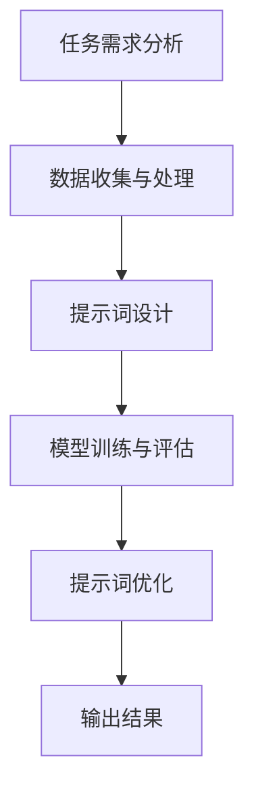
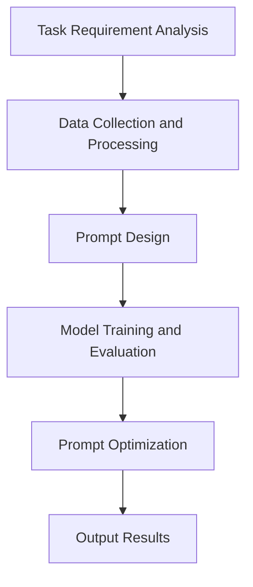

                 

### 文章标题

## GPT 原理与代码实例讲解

本文将深入探讨 GPT（Generative Pre-trained Transformer）模型的工作原理，并通过代码实例讲解如何实现一个简单的 GPT 模型。我们将从背景介绍开始，逐步深入核心概念与联系，算法原理与操作步骤，数学模型与公式，再到项目实践和实际应用场景。最后，我们将总结未来发展趋势与挑战，并提供相关工具和资源的推荐。

关键词：GPT、Transformer、自然语言处理、深度学习、代码实例

摘要：本文将详细介绍 GPT 模型的工作原理和实现方法，帮助读者更好地理解 GPT 在自然语言处理中的应用。通过代码实例讲解，读者将能够亲手实现一个简单的 GPT 模型，掌握 GPT 模型的基础知识。

<|assistant|>### 1. 背景介绍

#### 1.1 GPT 模型的发展历程

GPT（Generative Pre-trained Transformer）是由 OpenAI 于 2018 年提出的一种基于 Transformer 架构的预训练语言模型。它是继 2017 年提出的 BERT 模型后，自然语言处理领域的重要突破。GPT 的出现，标志着预训练语言模型进入了一个新的时代，极大地提高了语言模型的性能和表达能力。

GPT 模型的发展历程可以分为以下几个阶段：

1. **GPT（2018）**：最初的 GPT 模型使用了 Transformer 架构，对大量文本数据进行预训练，实现了优异的自然语言处理能力。
2. **GPT-2（2019）**：GPT-2 在 GPT 的基础上进行了扩展，预训练数据量更大，模型参数更多，性能进一步提升。
3. **GPT-3（2020）**：GPT-3 是目前最先进的预训练语言模型，其参数规模达到了 1750 亿，具有惊人的自然语言理解与生成能力。

#### 1.2 GPT 模型在自然语言处理中的应用

GPT 模型在自然语言处理领域具有广泛的应用，包括文本生成、机器翻译、文本分类、问答系统等。以下是一些典型的应用场景：

1. **文本生成**：GPT 模型可以生成各种类型的文本，如诗歌、故事、新闻报道等。通过输入一段文本，GPT 模型可以预测下一个词，从而生成连贯的文本。
2. **机器翻译**：GPT 模型在机器翻译任务中表现优异，可以实现高质量的双语翻译。通过将源语言和目标语言的文本输入到 GPT 模型中，模型可以生成目标语言的文本。
3. **文本分类**：GPT 模型可以用于对文本进行分类，如情感分析、主题分类等。通过训练 GPT 模型对大量标签化的文本数据进行分类，模型可以学会根据输入文本的语义特征进行分类。
4. **问答系统**：GPT 模型可以用于构建问答系统，如智能客服、知识图谱问答等。通过将问题和答案输入到 GPT 模型中，模型可以生成与问题相关的答案。

#### 1.3 GPT 模型的工作原理

GPT 模型是基于 Transformer 架构的深度学习模型，其工作原理可以分为以下几个步骤：

1. **输入处理**：将输入的文本序列转换为词向量表示，并将其输入到 Transformer 模型中。
2. **编码器解码器结构**：Transformer 模型由编码器和解码器组成，编码器负责将输入序列编码为固定长度的向量表示，解码器则根据编码器的输出和已经生成的文本生成下一个词。
3. **多头注意力机制**：解码器中的每个词都通过多头注意力机制与编码器的所有词进行交互，从而获取全局信息。
4. **生成输出**：解码器根据已经生成的文本和编码器的输出，预测下一个词，并更新解码器的状态。这个过程不断重复，直到生成完整的输出序列。

#### 1.4 GPT 模型的优势与挑战

GPT 模型在自然语言处理领域具有以下优势：

1. **强大的语义理解能力**：GPT 模型通过预训练，具有强大的语义理解能力，能够对文本进行深入分析，从而生成高质量的文本。
2. **广泛的适应性**：GPT 模型可以应用于各种自然语言处理任务，如文本生成、机器翻译、文本分类等，具有广泛的适应性。
3. **高效的计算性能**：GPT 模型采用 Transformer 架构，具有较高的计算性能，能够在较短的时间内完成大量的文本处理任务。

然而，GPT 模型也存在一些挑战：

1. **训练成本高**：GPT 模型需要大量的训练数据和高性能的计算资源，导致训练成本较高。
2. **模型可解释性差**：GPT 模型是一种黑箱模型，其内部决策过程难以解释，给模型的可解释性带来了挑战。
3. **数据隐私问题**：GPT 模型在训练过程中需要大量的用户数据，可能导致数据隐私问题。

总之，GPT 模型在自然语言处理领域具有巨大的潜力，但同时也面临着一系列挑战。在未来的发展中，我们需要不断改进 GPT 模型，提高其性能和可解释性，以更好地服务于自然语言处理任务。

-----------------------

## 2. 核心概念与联系

### 2.1 什么是提示词工程？

#### 2.1.1 提示词工程的基本概念

提示词工程（Prompt Engineering）是指设计和优化输入给语言模型的文本提示，以引导模型生成符合预期结果的过程。在 GPT 模型中，提示词工程尤为重要，因为一个好的提示词可以显著提高模型的输出质量和相关性。

提示词工程涉及以下几个方面：

1. **理解模型的工作原理**：了解 GPT 模型的内部结构和运作机制，包括编码器和解码器、多头注意力机制等。
2. **分析任务需求**：明确任务的目标和要求，例如生成文本、翻译、分类等。
3. **设计提示词**：根据任务需求，设计符合预期的文本提示，引导模型生成高质量的输出。
4. **评估和优化**：通过评估模型输出的质量，对提示词进行优化，以提高输出效果。

#### 2.1.2 提示词工程的重要性

一个精心设计的提示词可以显著提高 GPT 模型的输出质量和相关性。例如，在文本生成任务中，一个合适的提示词可以帮助模型更好地理解文本的主题和内容，从而生成更连贯、更有趣的文本。相反，模糊或不完整的提示词可能会导致模型生成不准确、不相关或不完整的输出。

#### 2.1.3 提示词工程与传统编程的关系

提示词工程可以被视为一种新型的编程范式，其中我们使用自然语言而不是代码来指导模型的行为。我们可以将提示词看作是传递给模型的函数调用，而输出则是函数的返回值。这种编程范式在某种程度上与传统编程有相似之处，但又有本质的区别。

在传统编程中，程序员使用代码来直接控制程序的执行流程和计算过程。而在提示词工程中，程序员（或用户）通过设计提示词来间接指导模型的行为，模型则根据提示词生成输出。这种间接控制方式使得提示词工程更具灵活性和适应性，但同时也增加了设计复杂度和优化难度。

### 2.2 GPT 模型的核心概念

#### 2.2.1 Transformer 架构

GPT 模型基于 Transformer 架构，这是一种用于序列到序列学习的深度学习模型。Transformer 架构由编码器和解码器两部分组成，通过多头注意力机制和位置编码技术，实现了对输入序列的高效编码和解码。

1. **编码器（Encoder）**：编码器将输入序列编码为固定长度的向量表示，用于捕捉序列中的全局信息。
2. **解码器（Decoder）**：解码器根据编码器的输出和已经生成的文本，生成下一个词，并更新解码器的状态。

#### 2.2.2 多头注意力机制

多头注意力机制是 Transformer 模型的一个重要组件，它允许模型在解码过程中关注输入序列中的不同部分，从而提高输出的质量和相关性。

多头注意力机制通过多个注意力头对输入序列进行加权求和，每个注意力头关注输入序列的不同部分。这样，模型可以同时关注多个不同的信息来源，从而提高输出效果。

#### 2.2.3 位置编码

位置编码用于捕捉输入序列中的位置信息，因为在 Transformer 模型中，输入序列的位置是未知的。位置编码通过在输入序列中添加位置嵌入向量，为每个词赋予位置信息。

位置编码有多种实现方法，如绝对位置编码和相对位置编码。绝对位置编码将位置信息直接嵌入到词嵌入中，而相对位置编码则通过计算词之间的相对位置来实现位置编码。

### 2.3 提示词工程的 Mermaid 流程图

下面是一个简化的提示词工程流程图，展示了从任务需求分析、提示词设计到模型评估和优化的全过程。

在这个流程图中，任务需求分析是整个过程的起点，通过分析任务需求，确定模型的训练目标和数据需求。接下来是数据收集与处理，包括数据清洗、数据预处理和特征提取等步骤。然后是提示词设计，根据任务需求设计合适的提示词。模型训练与评估阶段，使用训练数据和提示词对模型进行训练，并评估模型的性能。最后，通过提示词优化，进一步改进模型的输出效果。

-----------------------

## 2. Core Concepts and Connections

### 2.1 What is Prompt Engineering?

#### 2.1.1 Basic Concepts of Prompt Engineering

Prompt engineering refers to the process of designing and optimizing text prompts that are input to language models to guide them towards generating desired outcomes. In the context of GPT models, prompt engineering is particularly important because a well-crafted prompt can significantly improve the quality and relevance of the model's outputs.

Prompt engineering involves the following aspects:

1. **Understanding the Model's Working Principle**: Gaining insight into the internal structure and working mechanisms of GPT models, including the encoder-decoder structure, multi-head attention mechanism, and so on.
2. **Analyzing Task Requirements**: Clarifying the goals and requirements of the task at hand, such as text generation, machine translation, text classification, and so forth.
3. **Designing Prompts**: Crafting text prompts that align with the task requirements to guide the model towards generating high-quality outputs.
4. **Evaluating and Optimizing**: Assessing the quality of the model's outputs and optimizing the prompts to improve the generated results.

#### 2.1.2 The Importance of Prompt Engineering

A carefully designed prompt can significantly enhance the quality and relevance of a GPT model's outputs. For instance, in text generation tasks, an appropriate prompt can help the model better understand the subject and content of the text, leading to more coherent and engaging outputs. Conversely, vague or incomplete prompts can result in inaccurate, irrelevant, or incomplete outputs from the model.

#### 2.1.3 The Relationship between Prompt Engineering and Traditional Programming

Prompt engineering can be seen as a new paradigm of programming where we use natural language instead of code to direct the behavior of models. We can think of prompts as function calls made to the model, and the outputs as the return values of the function. This programming paradigm has similarities with traditional programming but also fundamental differences.

In traditional programming, programmers directly control the execution flow and computational processes of a program using code. In prompt engineering, however, programmers (or users) indirectly guide the model's behavior through the design of prompts. The model then generates outputs based on the prompts. This indirect approach provides more flexibility and adaptability but also introduces complexities in design and optimization.

### 2.2 Core Concepts of GPT Models

#### 2.2.1 Transformer Architecture

GPT models are based on the Transformer architecture, a deep learning model designed for sequence-to-sequence learning. The Transformer architecture consists of an encoder and a decoder, which work together through multi-head attention mechanisms and positional encoding techniques to efficiently encode and decode input sequences.

1. **Encoder (Encoder)**: The encoder encodes input sequences into fixed-length vector representations, capturing global information from the sequence.
2. **Decoder (Decoder)**: The decoder generates the next word based on the encoder's outputs and the already generated text, updating its state in the process.

#### 2.2.2 Multi-Head Attention Mechanism

The multi-head attention mechanism is a key component of the Transformer model, allowing the model to focus on different parts of the input sequence during the decoding process, thereby enhancing the quality and relevance of the outputs.

The multi-head attention mechanism applies weighted summations across multiple attention heads, each focusing on different parts of the input sequence. This enables the model to simultaneously attend to multiple information sources, improving the output quality.

#### 2.2.3 Positional Encoding

Positional encoding is used to capture the positional information within input sequences, as the positions of words in the sequence are unknown in the Transformer model. Positional encoding is achieved by adding positional embedding vectors to the input sequence, assigning positional information to each word.

There are various methods for implementing positional encoding, such as absolute positional encoding and relative positional encoding. Absolute positional encoding directly embeds positional information into the word embeddings, while relative positional encoding computes relative positions between words to achieve positional encoding.

### 2.3 Mermaid Flowchart of Prompt Engineering

The following is a simplified flowchart of the prompt engineering process, illustrating the entire journey from task requirement analysis, prompt design, model training and evaluation, to prompt optimization and output generation.

In this flowchart, task requirement analysis is the starting point of the process, where the training goals and data requirements of the model are determined. The next step is data collection and processing, which includes data cleaning, preprocessing, and feature extraction. Then comes prompt design, where text prompts are crafted based on the task requirements. The model training and evaluation phase involves training the model using the training data and prompts and assessing the model's performance. Finally, prompt optimization is performed to further enhance the model's output quality.

