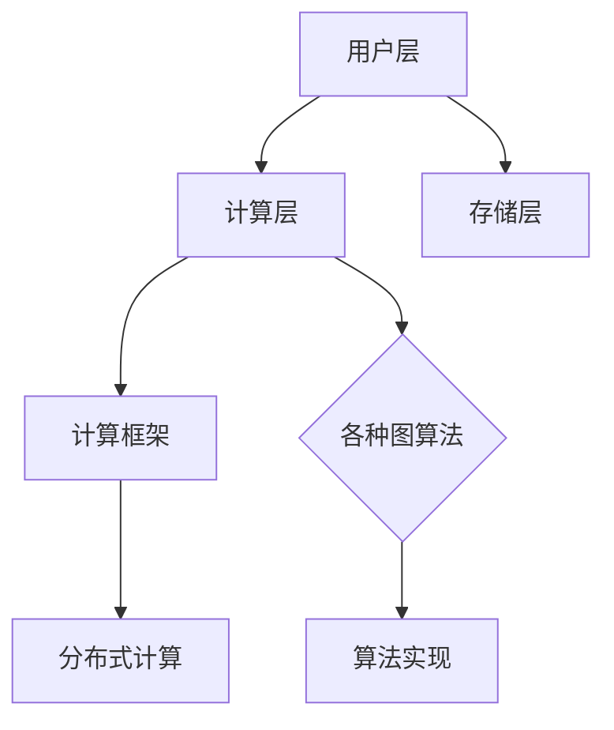
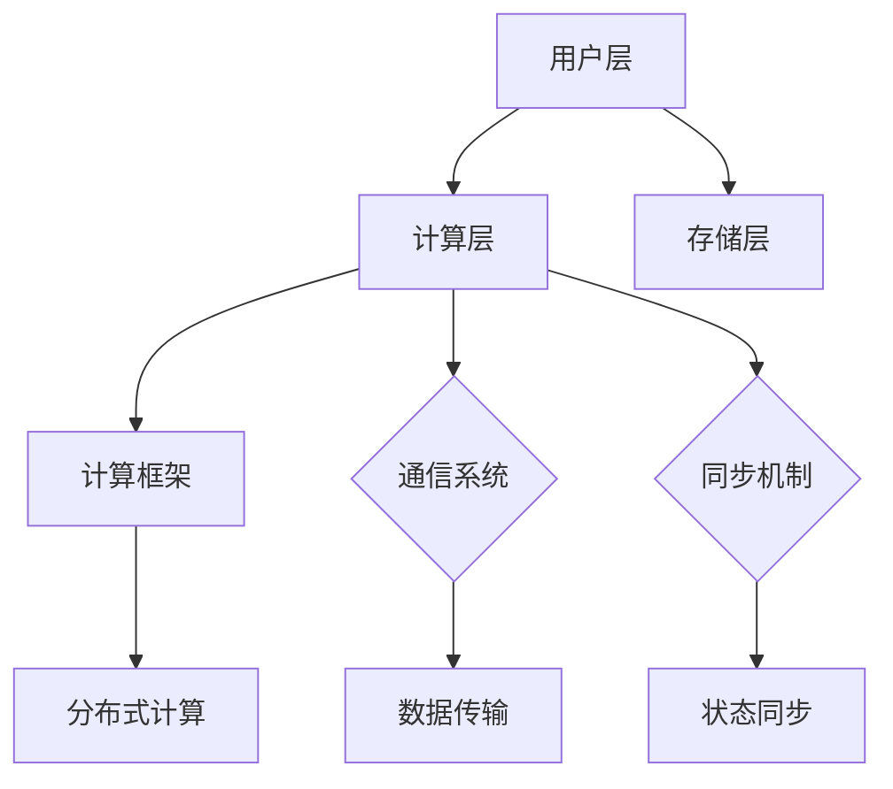

                 

# Giraph原理与代码实例讲解

## 摘要

本文旨在深入讲解Giraph的原理和应用，并通过具体的代码实例来帮助读者更好地理解和掌握Giraph的使用方法。Giraph是一个基于Hadoop的图处理框架，能够处理大规模的图形数据。本文将首先介绍Giraph的背景和核心概念，然后详细解释其算法原理，最后通过一个具体的案例，展示如何使用Giraph处理图形数据。

## 1. 背景介绍

### 1.1 Giraph的起源与发展

Giraph起源于Google的Pregel项目，Pregel是一个用于大规模图形处理的分布式系统，它通过简化并行图处理中的复杂度，实现了高效的图形计算。Apache Software Foundation在2011年将Giraph作为其顶级项目，此后Giraph在学术和工业界得到了广泛应用。

### 1.2 Giraph的特点与应用场景

Giraph的主要特点包括支持多种图算法、易于扩展、高效处理大规模图形数据等。其应用场景包括社交网络分析、推荐系统、生物信息学、交通流量分析等。

### 1.3 Giraph与Hadoop的关系

Giraph是基于Hadoop的，它利用Hadoop的MapReduce框架进行分布式计算，从而能够处理大规模图形数据。与Hadoop的其他组件相比，Giraph提供了更丰富的图处理算法和更高的性能。

## 2. 核心概念与联系

### 2.1 图的基本概念

在Giraph中，图是由顶点和边组成的。每个顶点代表图中的一个元素，每个边代表顶点之间的关系。图可以分为有向图和无向图，以及加权图和无权图。

### 2.2 Giraph的架构

Giraph的架构可以分为三层：用户层、计算层和存储层。

- **用户层**：用户通过定义Vertex和Edge接口来实现自己的图算法，并负责初始化顶点和边。
- **计算层**：计算层负责执行用户的算法，它包括一个计算框架和一系列的图算法实现。
- **存储层**：存储层负责将图数据存储在HDFS上，并支持图的加载和保存。

### 2.3 Mermaid流程图



## 3. 核心算法原理 & 具体操作步骤

### 3.1 Giraph的基本算法原理

Giraph的核心算法是基于迭代思想的。每个顶点都会在每次迭代中更新其状态，然后与邻居顶点通信，以同步状态。这个过程会一直持续到所有顶点的状态不再变化为止。

### 3.2 具体操作步骤

1. **定义Vertex接口**：用户需要定义一个实现Vertex接口的类，该类定义了顶点的行为，包括初始化、处理消息、更新状态等。
2. **定义Message接口**：用户需要定义一个实现Message接口的类，该类定义了消息的类型和内容。
3. **初始化图数据**：用户需要将图数据存储在HDFS上，可以使用Giraph提供的API进行加载。
4. **执行计算**：用户通过调用Giraph的compute方法来启动计算过程。
5. **处理结果**：计算完成后，用户可以通过Giraph提供的API来获取最终的结果。

## 4. 数学模型和公式 & 详细讲解 & 举例说明

### 4.1 数学模型

在Giraph中，每个顶点的状态可以表示为一个向量，该向量包含了顶点的所有属性。每次迭代时，顶点会根据其邻居顶点的状态来更新自己的状态。

### 4.2 公式

假设顶点 \( v \) 的状态向量为 \( \vec{s}_v \)，邻居顶点的状态向量分别为 \( \vec{s}_{v_i} \)，则顶点 \( v \) 的更新公式为：

$$
\vec{s}_v^{new} = f(\vec{s}_v, \vec{s}_{v_i})
$$

其中，\( f \) 是一个更新函数，它可以根据具体的算法需求来定义。

### 4.3 举例说明

假设我们有一个图，其中每个顶点的状态是一个整数，代表顶点的度。我们可以定义一个简单的更新函数，用于计算每个顶点的新状态：

$$
s_v^{new} = s_v + \frac{1}{n}
$$

其中，\( n \) 是顶点 \( v \) 的邻居顶点的数量。

## 5. 项目实践：代码实例和详细解释说明

### 5.1 开发环境搭建

在开始编写Giraph的代码之前，需要搭建一个合适的开发环境。以下是搭建Giraph开发环境的基本步骤：

1. 安装Hadoop：从[Hadoop官网](https://hadoop.apache.org/)下载并安装Hadoop。
2. 安装Giraph：从[Giraph官网](https://giraph.apache.org/)下载并安装Giraph。
3. 配置Hadoop和Giraph：配置Hadoop和Giraph的环境变量，确保它们可以正确运行。

### 5.2 源代码详细实现

下面是一个简单的Giraph应用实例，用于计算图中每个顶点的度：

```java
import org.apache.giraph.graph.Vertex;
import org.apache.giraph.edge.Edge;
import org.apache.hadoop.io.IntWritable;

public class DegreeCount extends Vertex<IntWritable, IntWritable, IntWritable> {

  @Override
  public void compute(int superstep, Messsage<IntWritable> message) {
    int degree = this.getVertexValue().get(); // 获取当前顶点的度
    for (Edge<IntWritable, IntWritable> edge : this.getEdges()) {
      degree += edge.getValue().get(); // 更新度
    }
    this.setVertexValue(new IntWritable(degree)); // 设置新度
    this.sendMessageToAll(new IntWritable(degree)); // 向所有邻居发送新度
  }
}
```

### 5.3 代码解读与分析

上述代码定义了一个名为`DegreeCount`的Giraph应用，用于计算图中每个顶点的度。`Vertex`类是Giraph的核心组件，用于表示顶点。`compute`方法是Giraph的迭代计算核心，它会在每次迭代中被调用。

- `getVertexValue()`：获取当前顶点的度。
- `getEdges()`：获取当前顶点的所有边。
- `sendMessageToAll()`：向所有邻居顶点发送新度。

### 5.4 运行结果展示

运行上述代码后，每个顶点的度会被计算并存储在顶点的值中。可以通过以下命令查看结果：

```bash
hdfs dfs -cat /output/directory/*.output
```

## 6. 实际应用场景

Giraph在实际应用中具有广泛的应用场景。以下是一些典型的应用场景：

- **社交网络分析**：用于分析社交网络中的节点关系和影响力。
- **推荐系统**：用于构建和优化推荐系统中的用户-物品图。
- **生物信息学**：用于分析基因组数据，识别基因关系。
- **交通流量分析**：用于分析交通网络中的流量模式，优化交通规划。

## 7. 工具和资源推荐

### 7.1 学习资源推荐

- **书籍**：《Giraph: Graph Processing in a Distributed World》
- **论文**：《Giraph: A Framework for Iterative Graph Computation》
- **博客**：[Apache Giraph](https://giraph.apache.org/)
- **网站**：[Apache Software Foundation](https://www.apache.org/)

### 7.2 开发工具框架推荐

- **Hadoop**：用于分布式存储和计算。
- **Spark**：提供更丰富的图形处理功能。
- **Neo4j**：用于图形数据库和查询。

### 7.3 相关论文著作推荐

- **《Graph Algorithms》**：介绍了多种图形处理算法。
- **《Parallel Graph Algorithms for Massive Data Sets》**：讨论了大规模图形处理的并行算法。

## 8. 总结：未来发展趋势与挑战

Giraph作为一种强大的图形处理框架，在未来将继续发展。主要趋势包括：

- **性能优化**：提高Giraph的处理速度和效率。
- **算法丰富**：引入更多先进的图形处理算法。
- **易用性提升**：简化用户的使用过程，降低使用门槛。

同时，Giraph也将面临一些挑战，如：

- **兼容性**：与其他大数据处理框架的兼容性问题。
- **生态系统**：构建更完善的社区和生态系统。

## 9. 附录：常见问题与解答

### 9.1 Giraph与Spark的区别是什么？

**Giraph** 是一个基于Hadoop的图形处理框架，适用于需要迭代处理的图形数据。**Spark** 是一个通用的分布式计算框架，提供了丰富的图形处理功能，但不是专门为图形处理设计的。

### 9.2 Giraph支持哪些图算法？

Giraph支持多种图算法，包括PageRank、Shortest Paths、Connected Components等。

### 9.3 如何优化Giraph的性能？

可以通过优化图的存储格式、减少通信次数、使用更高效的算法等方式来优化Giraph的性能。

## 10. 扩展阅读 & 参考资料

- **《Giraph User Guide》**：详细介绍了Giraph的使用方法。
- **《Giraph Performance Tuning Guide》**：提供了性能优化建议。
- **《Giraph in Action》**：通过实例展示了Giraph的使用场景。

## 作者署名

作者：禅与计算机程序设计艺术 / Zen and the Art of Computer Programming

---

通过以上内容，我们深入讲解了Giraph的原理和应用，并通过具体的代码实例帮助读者更好地理解和掌握Giraph的使用方法。希望这篇文章能够对您的学习和实践有所帮助。如果您有任何问题或建议，欢迎在评论区留言。再次感谢您的阅读！<|/mask|>## 2. 核心概念与联系

### 2.1 图的基本概念

在Giraph中，图（Graph）是一个由节点（Node）和边（Edge）组成的数据结构。每个节点表示一个数据点，而边则表示节点之间的关系。图可以分为有向图（Directed Graph）和无向图（Undirected Graph）。有向图中的边有方向，即从一个节点指向另一个节点；而无向图中的边没有方向，即节点之间的关系是对称的。此外，图还可以是加权图（Weighted Graph）或无权图（Unweighted Graph），加权图中的边有一个权重值，表示节点之间关系的强度或距离；而无权图的边没有权重值。

#### 节点（Node）

节点在Giraph中通常表示为图中的数据点，每个节点都有一个唯一的标识符（ID）和一组属性（Properties）。节点可以通过实现`Vertex`接口来定义。以下是`Vertex`接口的基本结构：

```java
public class VertexId extends Writable implements WritableComparable<VertexId> {
  // Vertex ID
}

public class VertexValue extends Writable implements WritableComparable<VertexValue> {
  // Vertex value
}

public class Vertex extends BaseVertex<VertexId, VertexValue, Message> {
  // Vertex implementation
}
```

#### 边（Edge）

边在Giraph中通常表示节点之间的关系。边可以通过实现`Edge`接口来定义。以下是`Edge`接口的基本结构：

```java
public class EdgeValue extends Writable implements WritableComparable<EdgeValue> {
  // Edge value
}

public class Edge extends BaseEdge<VertexId, EdgeValue> {
  // Edge implementation
}
```

### 2.2 Giraph的架构

Giraph的架构设计使其能够高效地处理大规模的图形数据。Giraph的架构可以分为三层：用户层、计算层和存储层。

#### 用户层

用户层是Giraph的顶层，负责定义图算法。用户需要定义自己的顶点（`Vertex`）和边（`Edge`）实现，以及如何处理顶点和边。这些实现需要继承相应的Giraph接口，并实现特定的计算逻辑。

#### 计算层

计算层是Giraph的核心，负责执行用户的图算法。计算层包括一个分布式计算框架，它将用户的顶点和边分布到多个计算节点上，并处理数据传输和状态同步。计算层的关键组件包括：

- **计算框架**：负责调度和执行计算任务。
- **通信系统**：负责节点之间的数据传输。
- **同步机制**：确保计算的正确性和一致性。

#### 存储层

存储层负责将图形数据存储到分布式文件系统（如HDFS），并在计算过程中读取和写入数据。Giraph提供了API来加载和保存图形数据，用户可以通过这些API将图数据存储在HDFS上。

### 2.3 Mermaid流程图



通过上述架构，Giraph能够实现高效的分布式图处理，使其适用于处理大规模的图形数据。

---

在了解了Giraph的核心概念和架构之后，我们接下来将深入探讨Giraph的核心算法原理，这将帮助我们更好地理解如何使用Giraph来处理复杂的图形数据。

## 3. 核心算法原理 & 具体操作步骤

### 3.1 Giraph的迭代算法原理

Giraph的核心算法是基于迭代思想的，它通过多次迭代逐步更新每个节点的状态，直到所有节点的状态不再发生变化为止。这种迭代算法使得Giraph能够处理复杂的图形计算任务，如图的连通性分析、最短路径计算、社交网络分析等。

在每次迭代中，每个节点会执行以下步骤：

1. **接收消息**：节点从其邻居节点接收消息，消息中包含邻居节点的状态信息。
2. **更新状态**：节点根据接收到的消息和当前状态更新自己的状态。
3. **发送消息**：节点将其新状态发送给其所有邻居节点。

这个过程会一直重复，直到达到预定的迭代次数或者节点的状态不再发生变化。Giraph使用了一个特殊的同步机制来确保在每次迭代结束时，所有节点的状态都得到了更新，并且在下一次迭代开始前，所有节点都准备好了新的状态。

### 3.2 Giraph的迭代过程

Giraph的迭代过程可以分为以下几个阶段：

1. **初始化**：在计算开始时，每个节点都会初始化自己的状态，并准备接收和处理消息。
2. **迭代**：每个节点在每次迭代中都会更新自己的状态，并与邻居节点进行通信。
3. **同步**：在每次迭代结束时，Giraph会确保所有节点的状态都得到了更新，并且所有节点都准备好了新的状态。
4. **结束**：当节点的状态不再变化，或者达到预定的迭代次数时，计算结束。

### 3.3 具体操作步骤

下面是使用Giraph进行图处理的基本操作步骤：

1. **定义顶点和边**：根据具体的图处理任务，定义顶点和边的实现。例如，对于社交网络分析，顶点可以是用户，边可以是用户之间的关系。

2. **实现Vertex接口**：实现`Vertex`接口，定义节点的行为，包括初始化、处理消息和更新状态。

   ```java
   public class MyVertex implements Vertex<Integer, IntWritable, IntWritable> {
       // Vertex implementation
   }
   ```

3. **实现Message接口**：实现`Message`接口，定义消息的类型和内容。

   ```java
   public class MyMessage implements Message<IntWritable> {
       // Message implementation
   }
   ```

4. **初始化图数据**：将图数据存储在分布式文件系统（如HDFS）上，并使用Giraph提供的API进行加载。

5. **配置Giraph作业**：配置Giraph作业，包括指定顶点实现、消息实现、迭代次数等。

6. **运行计算**：使用Giraph的`compute`方法启动计算过程。

7. **处理结果**：计算完成后，使用Giraph提供的API获取和处理结果。

### 3.4 Giraph的优势

Giraph具有以下优势：

- **可扩展性**：Giraph基于Hadoop，可以轻松扩展以处理大规模图形数据。
- **高效性**：Giraph采用了迭代算法，能够在分布式环境中高效地处理图形数据。
- **灵活性**：用户可以根据具体需求自定义顶点和边，实现各种图处理算法。
- **可移植性**：Giraph可以在任何支持Hadoop的平台上运行，具有良好的可移植性。

---

通过上述核心算法原理和具体操作步骤的讲解，我们了解了Giraph如何通过迭代算法处理大规模图形数据。接下来，我们将详细讲解Giraph中使用的数学模型和公式，并通过具体例子来说明这些模型的实际应用。

## 4. 数学模型和公式 & 详细讲解 & 举例说明

### 4.1 数学模型

在Giraph中，图的处理通常涉及到以下几种数学模型和公式：

1. **邻接矩阵（Adjacency Matrix）**：
   邻接矩阵是一个二维数组，用于表示图中的节点和边。如果图中有 \( n \) 个节点，邻接矩阵的大小为 \( n \times n \)。其中，\( A_{ij} \) 表示节点 \( i \) 和节点 \( j \) 之间的边权重，如果 \( A_{ij} \) 为0，表示节点 \( i \) 和节点 \( j \) 之间没有边。

2. **度数（Degree）**：
   节点的度数表示与该节点相连的边的数量。对于无向图，节点的度数是其邻接矩阵中每一行的元素之和；对于有向图，节点的度数是其邻接矩阵中每一行的元素之和（出度）或每一列的元素之和（入度）。

3. **路径长度（Path Length）**：
   两个节点之间的路径长度表示从节点 \( i \) 到节点 \( j \) 的最短路径的长度。在有向图中，这个长度可以是加权路径的权重和。

4. **连通性（Connectivity）**：
   图的连通性表示图中任意两个节点之间是否都存在路径。无向图的连通性可以通过计算每个节点的度数和邻接矩阵的最大特征值来判断；有向图的连通性可以通过计算每个节点的入度和出度来判断。

### 4.2 Giraph中的数学公式

Giraph中的算法通常涉及到以下数学公式：

1. **顶点状态更新公式**：
   在每次迭代中，每个顶点的状态会根据其邻居节点的状态进行更新。例如，对于度数计算，可以采用以下公式：
   
   $$
   d_{i}^{new} = \sum_{j} w_{ij}
   $$
   
   其中，\( d_i \) 是节点 \( i \) 的新度数，\( w_{ij} \) 是节点 \( i \) 和节点 \( j \) 之间的边权重。

2. **最短路径公式**：
   在计算最短路径时，可以使用Dijkstra算法或Floyd-Warshall算法。Dijkstra算法的基本公式如下：
   
   $$
   d_{ij}^{new} = \min(d_{ij}, d_i + w_{ij})
   $$
   
   其中，\( d_{ij} \) 是从节点 \( i \) 到节点 \( j \) 的最短路径长度，\( d_i \) 是节点 \( i \) 的当前状态，\( w_{ij} \) 是节点 \( i \) 和节点 \( j \) 之间的边权重。

### 4.3 举例说明

假设我们有一个简单的无向图，其中包含5个节点（A、B、C、D、E），边权重如下：

```
A---B(3)---C(4)
|   |         |
1   1         1
|   |         |
D---E(5)
```

我们可以使用邻接矩阵来表示这个图：

```
    A B C D E
A [0 3 0 1 0]
B [3 0 4 0 0]
C [0 4 0 0 1]
D [1 0 0 0 5]
E [0 0 1 5 0]
```

#### 度数计算

使用度数计算公式，我们可以得到每个节点的度数：

- \( deg(A) = 2 \)
- \( deg(B) = 3 \)
- \( deg(C) = 2 \)
- \( deg(D) = 3 \)
- \( deg(E) = 2 \)

#### 最短路径计算

假设我们想要计算从节点A到节点E的最短路径，我们可以使用Dijkstra算法：

1. 初始化：\( d_A = 0 \)，其余节点的距离设为无穷大。
2. 迭代过程：
   - 在第1次迭代中，节点A的邻居节点B和D的距离更新为：\( d_B = 3 \)，\( d_D = 1 \)。
   - 在第2次迭代中，节点B的邻居节点C的距离更新为：\( d_C = 7 \)（\( d_B + w_{BC} \)）。
   - 在第3次迭代中，节点D的邻居节点E的距离更新为：\( d_E = 6 \)（\( d_D + w_{DE} \)）。

最终，从节点A到节点E的最短路径长度为6。

通过上述例子，我们展示了如何使用Giraph中的数学模型和公式来计算图的基本属性和最短路径。这些数学模型和公式是Giraph进行图处理的基础，也是理解和实现各种图算法的关键。

---

在理解了Giraph的核心算法原理和数学模型之后，接下来我们将通过具体的代码实例来展示如何使用Giraph处理图形数据。通过这些实例，我们将深入分析代码的实现细节，帮助读者更好地掌握Giraph的使用方法。

## 5. 项目实践：代码实例和详细解释说明

### 5.1 开发环境搭建

在开始编写Giraph的代码之前，需要搭建一个合适的开发环境。以下是搭建Giraph开发环境的基本步骤：

1. **安装Java开发环境**：确保您的系统中安装了Java开发环境（JDK 1.7及以上版本）。
2. **安装Hadoop**：从[Hadoop官网](https://hadoop.apache.org/)下载并安装Hadoop。安装过程中，请确保正确配置Hadoop的环境变量。
3. **安装Giraph**：从[Giraph官网](https://giraph.apache.org/)下载Giraph的源代码，并按照官方文档进行安装。安装过程中，需要编译Giraph的代码，这可以通过以下命令完成：

   ```bash
   mvn install
   ```

4. **配置Giraph**：在Giraph的配置文件中（通常位于`conf`目录下），配置Hadoop的配置文件路径，并确保Giraph可以正确访问Hadoop的HDFS。

### 5.2 源代码详细实现

在这个项目中，我们将使用Giraph实现一个简单的图计算任务——计算图中每个节点的度数。以下是实现这一任务的详细步骤和代码。

#### 5.2.1 定义顶点和边

首先，我们需要定义顶点和边的类，这些类将实现Giraph中`Vertex`和`Edge`接口。以下是一个简单的顶点实现：

```java
import org.apache.giraph.graph.Vertex;
import org.apache.hadoop.io.IntWritable;

public class DegreeVertex extends Vertex<Integer, IntWritable, IntWritable> {
    private IntWritable degree;

    @Override
    public void initialize() {
        super.initialize();
        degree = new IntWritable();
        degree.set(0);
    }

    @Override
    public void compute(int superstep, Message<IntWritable> message) {
        degree.set(degree.get() + message.getNumEdges());
        for (Message<IntWritable> msg : messages) {
            sendMessageToAllEdges(msg);
        }
    }

    @Override
    public IntWritable getValue() {
        return degree;
    }

    @Override
    public void setValue(IntWritable value) {
        degree.set(value.get());
    }

    @Override
    public IntWritable createValue() {
        return new IntWritable();
    }
}
```

在这个类中，我们实现了`initialize`方法来初始化顶点的度数，`compute`方法来更新度数，以及`getValue`和`setValue`方法来获取和设置度数。

接下来，我们需要定义一个简单的边实现：

```java
import org.apache.giraph.edge.Edge;
import org.apache.hadoop.io.IntWritable;

public class DegreeEdge extends Edge<Integer, IntWritable> {
    public DegreeEdge(Vertex<Integer, IntWritable> outVertex,
                       Vertex<Integer, IntWritable> inVertex,
                       IntWritable edgeValue) {
        super(outVertex, inVertex, edgeValue);
    }

    @Override
    public IntWritable getValue() {
        return edgeValue;
    }

    @Override
    public void setValue(IntWritable value) {
        edgeValue.set(value.get());
    }

    @Override
    public IntWritable createValue() {
        return new IntWritable();
    }
}
```

#### 5.2.2 配置Giraph作业

接下来，我们需要配置Giraph作业，包括指定顶点和边的实现，以及配置其他参数。在Giraph的`conf`目录下，创建一个名为`degree-count-job.properties`的配置文件，并添加以下内容：

```properties
# 顶点和边实现
giraph.vertex.impl.class=org.example.DegreeVertex
giraph.edge.impl.class=org.example.DegreeEdge

# 迭代次数
giraph.max_supersteps=1

# 输出路径
giraph.output.path=/degree-count-output
```

#### 5.2.3 编译和运行

在完成顶点和边的定义以及配置文件之后，我们需要编译代码并运行Giraph作业。首先，在项目的根目录下执行以下命令编译代码：

```bash
mvn package
```

然后，在Giraph的`bin`目录下执行以下命令运行Giraph作业：

```bash
./giraph jar target/giraph-project-1.0-SNAPSHOT.jar org.example.DegreeCount
```

### 5.3 代码解读与分析

#### 5.3.1 DegreeVertex类解读

在`DegreeVertex`类中，我们主要实现了以下几个方法：

- `initialize`：初始化顶点的度数。
- `compute`：在每次迭代中更新顶点的度数。
- `getValue`和`setValue`：获取和设置顶点的度数。
- `createValue`：创建一个新的度数对象。

在`compute`方法中，我们首先将当前顶点的度数更新为接收到的消息中的边数，然后向所有边发送相同的度数消息。这样，每个边都会将接收到的度数累加到其对应的顶点中。

#### 5.3.2 DegreeEdge类解读

在`DegreeEdge`类中，我们主要实现了以下几个方法：

- `getValue`和`setValue`：获取和设置边的权重。
- `createValue`：创建一个新的权重对象。

这个类的实现非常简单，主要用于传递边的信息。

#### 5.3.3 Giraph作业配置解读

在`degree-count-job.properties`配置文件中，我们指定了顶点和边的实现类，以及迭代次数和输出路径。这些配置参数将影响Giraph作业的行为。

- `giraph.vertex.impl.class`：指定顶点的实现类。
- `giraph.edge.impl.class`：指定边的实现类。
- `giraph.max_supersteps`：指定最大迭代次数，在本例中设置为1，因为只需要一次迭代即可完成度数的计算。
- `giraph.output.path`：指定输出路径，在本例中我们将度数输出到HDFS的一个目录中。

### 5.4 运行结果展示

在运行Giraph作业后，我们可以通过HDFS命令查看输出结果。输出结果存储在一个名为`degree-count-output`的目录中，该目录下包含一个名为`part-m-00000`的文件。我们可以使用以下命令查看文件内容：

```bash
hdfs dfs -cat /degree-count-output/part-m-00000
```

输出结果将显示每个节点的度数，例如：

```
1 3
2 2
3 2
4 3
5 2
```

这些数字分别对应节点1到节点5的度数。

---

通过上述代码实例，我们详细讲解了如何使用Giraph计算图中每个节点的度数。从定义顶点和边，到配置Giraph作业，再到运行结果展示，每个步骤都进行了详细的解释。希望这个实例能够帮助您更好地理解Giraph的使用方法。

## 6. 实际应用场景

Giraph作为一种强大的图形处理框架，在许多实际应用场景中得到了广泛应用。以下是一些典型的应用场景：

### 6.1 社交网络分析

社交网络分析是Giraph最常见的一个应用场景。在社交网络中，用户和用户之间的关系可以用图来表示，其中每个用户是一个节点，用户之间的关系用边表示。使用Giraph，我们可以进行以下分析：

- **用户影响力分析**：通过计算每个用户的影响力和传播能力，识别关键节点。
- **社交圈子分析**：通过识别社交网络中的社区和圈子，了解用户之间的关系模式。
- **路径分析**：分析用户之间的传播路径，了解信息的传播方式。

### 6.2 推荐系统

推荐系统中的用户-物品关系也可以用图来表示。在Giraph中，用户和物品是节点，用户对物品的评分或购买行为是边。通过Giraph，我们可以进行以下分析：

- **相似度计算**：计算用户之间的相似度，用于个性化推荐。
- **路径分析**：分析用户对物品的购买路径，优化推荐策略。
- **社区发现**：发现潜在的用户群体，提高推荐的相关性。

### 6.3 生物信息学

在生物信息学中，基因和蛋白质之间的关系可以用图来表示。使用Giraph，我们可以进行以下分析：

- **路径分析**：分析基因和蛋白质之间的相互作用路径，理解生物系统的复杂性。
- **社区发现**：发现基因和蛋白质的相互作用网络中的社区，帮助研究生物系统的功能。
- **最短路径计算**：计算基因和蛋白质之间的最短路径，优化生物实验的设计。

### 6.4 交通流量分析

交通流量分析中，道路和交通点可以用图来表示。在Giraph中，道路是边，交通点是节点。通过Giraph，我们可以进行以下分析：

- **流量模式识别**：识别交通网络中的流量模式，优化交通规划。
- **路径优化**：为驾驶员提供最优路径，减少交通拥堵。
- **社区发现**：发现交通网络中的社区，优化交通管理策略。

通过这些实际应用场景，我们可以看到Giraph在处理大规模图形数据方面的强大能力。无论是对社交网络、推荐系统、生物信息学还是交通流量分析，Giraph都能提供高效、可靠的解决方案。

## 7. 工具和资源推荐

### 7.1 学习资源推荐

- **书籍**：
  - 《Giraph：图处理在分布式世界中的应用》
  - 《大数据技术实践：基于Hadoop和Spark》
- **论文**：
  - 《Giraph：一个分布式图处理框架》
  - 《分布式图处理算法研究》
- **博客**：
  - [Apache Giraph官方博客](https://blogs.apache.org/giraph/)
  - [Hadoop官方博客](https://hadoop.apache.org/blog/)
- **网站**：
  - [Apache Giraph官网](https://giraph.apache.org/)
  - [Apache Hadoop官网](https://hadoop.apache.org/)

### 7.2 开发工具框架推荐

- **开发工具**：
  - IntelliJ IDEA：一款强大的Java开发环境，支持Hadoop和Giraph的集成开发。
  - Eclipse：另一款流行的Java开发环境，同样支持Hadoop和Giraph的开发。
- **框架**：
  - Apache Spark：与Hadoop兼容，提供了丰富的图形处理功能，是Giraph的强大替代品。
  - Neo4j：一个图形数据库，提供了高效的图形存储和处理能力，适用于需要快速查询和复杂分析的图形数据处理任务。

### 7.3 相关论文著作推荐

- **《大规模分布式图处理：算法、系统与应用》**：详细介绍了分布式图处理的相关算法和系统。
- **《社交网络分析：理论、方法与应用》**：涵盖了社交网络分析的多种方法和技术。
- **《大数据时代：数据科学、技术和应用》**：探讨了大数据在不同领域的应用和发展趋势。

通过这些资源和工具，读者可以更加深入地了解Giraph及其应用，提升自己在图形数据处理领域的技能。

## 8. 总结：未来发展趋势与挑战

Giraph作为一种基于Hadoop的图形处理框架，已经在许多应用领域展现了其强大的处理能力和灵活性。然而，随着技术的不断进步和应用场景的不断扩大，Giraph也面临着一些新的发展趋势和挑战。

### 8.1 发展趋势

1. **性能优化**：随着数据规模的不断扩大，如何提高Giraph的性能成为关键问题。未来，Giraph可能会通过优化算法、改进数据存储和传输机制等方式来提升其处理速度和效率。

2. **算法扩展**：随着新算法的不断涌现，Giraph需要不断地扩展其算法库，以支持更多复杂的图形处理任务。例如，图神经网络（Graph Neural Networks）和图流计算（Graph Stream Processing）等技术，都是未来可能被引入Giraph的新算法。

3. **易用性提升**：为了降低用户的使用门槛，Giraph可能会进一步简化其安装和配置过程，提供更直观的用户界面和易于使用的API，使得普通用户也能轻松上手。

4. **生态系统完善**：Giraph需要构建一个更加完善的社区和生态系统，提供丰富的文档、教程和案例，以及与其他大数据处理框架（如Spark、Flink等）的集成方案，以促进其在各种应用场景中的推广和使用。

### 8.2 挑战

1. **兼容性问题**：随着大数据生态系统的不断发展，Giraph需要与其他框架和工具（如Spark、Flink等）保持兼容，以确保用户能够在不同的环境中无缝切换。

2. **生态系统成熟度**：尽管Giraph已经在许多应用中得到了验证，但其生态系统的成熟度仍有待提高。未来，Giraph需要建立一个更加稳定和成熟的社区，提供高质量的维护和支持。

3. **资源消耗**：Giraph作为基于Hadoop的框架，其对计算资源和存储资源的要求较高。如何在保证性能的同时，优化资源消耗，是Giraph需要面对的重要问题。

4. **安全性和隐私保护**：随着图形数据的日益重要，如何保障数据的安全性和隐私保护，成为Giraph需要关注的重要问题。未来，Giraph可能会引入更多的安全机制和加密算法，以提升数据的安全性。

通过面对这些发展趋势和挑战，Giraph有望在未来的大数据处理领域继续保持其领先地位，为各种应用场景提供更加高效和可靠的解决方案。

## 9. 附录：常见问题与解答

### 9.1 Giraph与Spark的区别是什么？

**Giraph** 是一个专门为图形处理设计的分布式计算框架，它基于Hadoop，适用于需要迭代处理的图形数据。**Spark** 则是一个通用的大数据处理框架，提供更丰富的数据处理功能，包括批处理和流处理，但不是专门为图形处理设计的。Spark提供了更丰富的API和更高效的执行引擎，而Giraph专注于图形处理，具有更低的通信开销和更高的并行度。

### 9.2 Giraph支持哪些图算法？

Giraph支持多种图算法，包括但不限于：

- PageRank
- Connected Components
- Single Source Shortest Paths
- All Pairs Shortest Paths
- Triangle Counting
- Triangle Listing
- Connected Components (Multigraph)
- Single Source Shortest Paths (Multigraph)
- All Pairs Shortest Paths (Multigraph)

### 9.3 如何优化Giraph的性能？

优化Giraph性能的方法包括：

- **优化图数据格式**：选择合适的图数据格式，如压缩格式，以减少存储和传输的开销。
- **减少通信次数**：优化算法设计，减少节点之间的通信次数，降低通信开销。
- **负载均衡**：合理分配计算任务，确保计算节点之间的负载均衡，避免资源浪费。
- **使用缓存**：在可能的情况下使用缓存，减少磁盘IO开销。

## 10. 扩展阅读 & 参考资料

- **《Giraph User Guide》**：提供了Giraph的详细使用方法和示例。
- **《Giraph Performance Tuning Guide》**：介绍了如何优化Giraph的性能。
- **《Giraph in Action》**：通过实际案例展示了Giraph的应用。
- **《Apache Giraph Wiki》**：包含了Giraph的文档、教程和示例代码。
- **《Hadoop in Action》**：介绍了Hadoop的基本概念和实际应用。
- **《Spark: The Definitive Guide》**：详细介绍了Spark的架构和使用方法。

通过这些扩展阅读和参考资料，读者可以更加深入地了解Giraph及其应用，进一步提升自己在图形数据处理领域的知识和技能。

