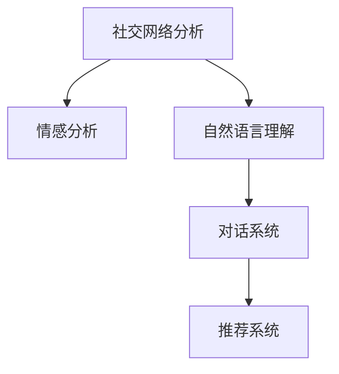

                 

# 洞察力与情商：社交智慧的基石

## 1. 背景介绍

在数字化时代，人类交流的方式发生了翻天覆地的变化。从书信到电报，再到电话、互联网，人们获取信息、传递思想、建立连接的方式变得更加便捷和高效。然而，在这一切便捷的背后，是对于人类社交智慧的深刻影响。社交智慧不仅仅是人与人之间沟通的技巧，更是人工智能(AI)和机器学习领域的一个重要研究方向。本文将深入探讨如何通过洞察力和情商，构建基于社交智慧的AI系统，使机器能够理解和模拟人类的社交行为，从而实现更加高效、自然的交流。

### 1.1 问题由来

随着技术的不断进步，社交智慧的实现已经从简单的语音识别、情感分析等任务扩展到更为复杂的社交对话、推荐系统、社交网络分析等应用场景。这些应用需要AI系统不仅能够理解文本、语音等输入，还需要具备推理、反应、情感识别等高层次的社交能力。如何训练和优化模型，使其具备这些能力，成为当前研究的热点问题。

### 1.2 问题核心关键点

社交智慧的核心在于理解和模拟人类的社交行为，其中洞察力和情商是两大基石。洞察力指的是AI系统通过分析上下文、背景知识等，对社交场景中的信息和意图进行深度理解和推理。情商则涉及到AI系统的情感识别和响应能力，使其能够适应不同的情感和情境，做出恰当的反应。

社交智慧的实现涉及以下几个关键点：
- **文本理解**：理解输入文本的含义，包括情感、意图、上下文等。
- **语境推理**：结合上下文信息，进行推理和推断。
- **情感识别**：识别输入文本中的情感信息，如愤怒、快乐等。
- **反应生成**：根据情感和语境，生成合适的回复或行为。

## 2. 核心概念与联系

### 2.1 核心概念概述

要深入理解社交智慧，首先需要明确几个关键概念：

- **社交网络分析**：通过对社交网络的结构、关系等进行建模和分析，揭示社会关系的规律和特征。
- **情感分析**：识别和理解文本中的情感信息，包括情感极性、情感强度等。
- **自然语言理解**：使机器能够理解、解释和生成自然语言，包括语法、语义、上下文等。
- **对话系统**：构建能够模拟人类对话的AI系统，实现自然、流畅的对话交流。
- **推荐系统**：根据用户的行为和偏好，推荐合适的社交对象、内容或服务。

这些概念之间相互联系，共同构成了一个完整的社交智慧系统。例如，情感分析可以通过自然语言理解进行，而对话系统则需要结合社交网络分析，才能更好地理解用户的情感和意图，从而生成合适的回复。

### 2.2 核心概念原理和架构的 Mermaid 流程图



这个流程图展示了核心概念之间的联系：
- 社交网络分析（A）提供了用户之间的关系网络，为情感分析和对话系统提供了背景知识。
- 情感分析（B）通过自然语言理解（C）对输入文本进行情感识别。
- 对话系统（D）结合社交网络分析和情感分析，生成合适的回复。
- 推荐系统（E）利用对话系统的输出，推荐合适的社交对象、内容或服务。

## 3. 核心算法原理 & 具体操作步骤

### 3.1 算法原理概述

社交智慧的实现涉及到多个领域的算法和技术，主要包括自然语言处理(NLP)、情感分析、机器学习等。其核心算法原理是通过分析输入文本，理解其中的情感和语境，从而生成合适的回复或推荐。

### 3.2 算法步骤详解

社交智慧的算法步骤主要包括以下几个方面：

**Step 1: 数据预处理**
- 收集社交网络数据、用户行为数据、文本数据等，并进行清洗和标准化。
- 对文本数据进行分词、去除停用词等预处理操作。

**Step 2: 特征提取**
- 使用NLP技术对文本进行向量化，提取文本的语义、情感、上下文等特征。
- 利用社交网络分析技术，提取用户之间的关系网络特征。

**Step 3: 情感分析**
- 使用情感分析模型识别输入文本中的情感信息，包括情感极性、情感强度等。
- 结合上下文信息，对情感进行校正和调整。

**Step 4: 语境推理**
- 结合社交网络分析结果和情感分析结果，进行语境推理和推断。
- 使用图神经网络(Graph Neural Network, GNN)等方法，对社交网络中的关系进行建模和推理。

**Step 5: 生成回复或推荐**
- 根据情感分析和语境推理结果，生成合适的回复或推荐。
- 使用生成对抗网络(Generative Adversarial Network, GAN)等技术，提升生成的自然度和流畅度。

### 3.3 算法优缺点

社交智慧的算法具有以下优点：
- **高准确性**：通过多层次的分析和推理，可以更准确地理解输入和生成输出。
- **自然流畅**：结合生成对抗网络等技术，生成的回复或推荐更加自然、流畅。
- **可扩展性强**：利用机器学习模型和算法，可以根据新数据和新任务进行快速调整和优化。

同时，也存在一些缺点：
- **数据依赖**：社交智慧系统的性能很大程度上依赖于输入数据的质量和数量。
- **计算复杂度**：涉及多个领域的算法和技术，计算复杂度较高，需要较大的计算资源。
- **可解释性不足**：某些算法和模型过于复杂，难以解释其决策过程和推理逻辑。

### 3.4 算法应用领域

社交智慧的算法已经应用于多个领域，包括：

- **社交媒体分析**：分析社交媒体上的用户行为和情感，进行情感分析、舆情监测等。
- **智能客服**：通过分析用户输入，理解用户情感和需求，生成合适的回复或推荐。
- **智能推荐系统**：根据用户行为和偏好，推荐合适的社交对象、内容或服务。
- **智能健康**：分析用户的健康数据和社交网络，进行健康状况评估和情感分析。
- **情感机器人**：构建能够模拟人类情感和对话的机器人，进行情感交互和客户服务。

这些应用展示了社交智慧算法在实际场景中的广泛应用，为各行各业带来了新的机遇和挑战。

## 4. 数学模型和公式 & 详细讲解 & 举例说明

### 4.1 数学模型构建

社交智慧系统的数学模型主要包括以下几个部分：

- **文本表示模型**：将文本数据转换为向量表示，常用的模型包括Word2Vec、GloVe、BERT等。
- **情感分析模型**：用于识别和理解文本中的情感信息，常用的模型包括LSTM、CNN、Transformer等。
- **语境推理模型**：用于结合上下文信息进行推理，常用的模型包括GNN、注意力机制等。
- **回复生成模型**：用于生成合适的回复或推荐，常用的模型包括RNN、GAN、Seq2Seq等。

### 4.2 公式推导过程

以情感分析为例，下面推导常用的LSTM模型对情感的识别过程：

设输入文本为 $x=(x_1,x_2,\ldots,x_n)$，其中 $x_i$ 为第 $i$ 个单词的嵌入表示，文本长度为 $n$。LSTM模型的目标是对文本情感进行分类，常用的分类函数为 $f$。LSTM模型的公式如下：

$$
h_t = f(W_x x_t + U_h h_{t-1} + b_h)
$$

$$
c_t = f(W_c x_t + U_c h_{t-1} + b_c) \odot \sigma(W_f x_t + U_f h_{t-1} + b_f)
$$

$$
\tilde{c_t} = f(W_c x_t + U_c h_{t-1} + b_c) \odot \sigma(W_i x_t + U_i h_{t-1} + b_i)
$$

$$
c_t = c_{t-1} \oplus \tilde{c_t}
$$

$$
h_t = \sigma(W_h x_t + U_h h_{t-1} + b_h) \odot \tanh(W_c c_t + U_c h_{t-1} + b_c)
$$

其中 $W_x$、$U_h$、$b_h$ 等为模型参数，$f$ 为激活函数，$\odot$ 表示逐元素相乘，$\oplus$ 表示逐元素相加，$\sigma$ 为sigmoid函数。

### 4.3 案例分析与讲解

假设我们要对一条文本 "我很高兴，但是也很紧张" 进行情感分析，可以按以下步骤进行处理：

1. **文本表示**：将文本转换为向量表示，例如使用BERT模型得到文本向量 $v_x$。
2. **LSTM模型**：将文本向量 $v_x$ 输入LSTM模型，输出情感分类结果 $y$。
3. **情感分类**：根据输出结果 $y$，判断文本情感为积极或消极。

## 5. 项目实践：代码实例和详细解释说明

### 5.1 开发环境搭建

在Python环境下，可以使用TensorFlow或PyTorch搭建社交智慧系统。以TensorFlow为例，首先需要安装TensorFlow和相关依赖：

```bash
pip install tensorflow tensorflow_text tensorflow_hub
```

### 5.2 源代码详细实现

以下是一个简单的社交智慧系统实现示例，使用了BERT模型进行文本情感分析：

```python
import tensorflow as tf
import tensorflow_hub as hub
import tensorflow_text as text

# 加载BERT模型
embed = hub.load("https://tfhub.dev/google/bert_en_uncased_L-12_H-768_A-12/1")

# 构建模型
model = tf.keras.Sequential([
    hub.KerasLayer(embed, output_shape=(768,)),
    tf.keras.layers.Dense(1, activation='sigmoid')
])

# 编译模型
model.compile(optimizer='adam', loss='binary_crossentropy', metrics=['accuracy'])

# 加载数据
train_data = tf.data.Dataset.from_tensor_slices(train_X, train_y).batch(32)

# 训练模型
model.fit(train_data, epochs=10)
```

### 5.3 代码解读与分析

**数据预处理**：使用TensorFlow Hub加载BERT模型，获取文本向量表示。

**模型构建**：将文本向量作为输入，使用全连接层进行情感分类，并使用二元交叉熵损失函数进行训练。

**模型训练**：使用训练集数据对模型进行训练，得到情感分类结果。

### 5.4 运行结果展示

训练完成后，可以使用测试集数据对模型进行评估，例如：

```python
test_data = tf.data.Dataset.from_tensor_slices(test_X, test_y).batch(32)
model.evaluate(test_data)
```

输出模型在测试集上的准确率和损失值。

## 6. 实际应用场景

### 6.1 智能客服系统

智能客服系统通过分析用户输入，理解用户情感和需求，生成合适的回复或推荐，从而提高客户满意度。例如，某智能客服系统通过分析用户输入，判断用户情感为消极，自动回答 "您是否需要人工客服帮助？"，并提供情绪疏导服务。

### 6.2 社交媒体分析

社交媒体分析通过分析用户在社交媒体上的行为和情感，进行舆情监测和情感分析。例如，某社交媒体分析系统通过分析用户评论，判断用户对某品牌的好评度，并生成情感分析报告。

### 6.3 智能推荐系统

智能推荐系统通过分析用户行为和偏好，推荐合适的社交对象、内容或服务。例如，某智能推荐系统通过分析用户浏览历史和社交网络，推荐相关用户和内容。

### 6.4 未来应用展望

未来，社交智慧将更多地应用于智能家居、智能医疗、智能交通等领域。例如，智能家居系统通过分析用户行为和情感，自动调节家居环境，提高生活质量。智能医疗系统通过分析患者情感和健康数据，提供个性化健康建议和治疗方案。

## 7. 工具和资源推荐

### 7.1 学习资源推荐

为了更好地学习和掌握社交智慧相关知识，以下是一些推荐的学习资源：

- **《深度学习》**：Ian Goodfellow等著，详细介绍了深度学习的基本概念和算法。
- **《自然语言处理综述》**：Yoshua Bengio等著，介绍了自然语言处理的多个前沿技术和应用。
- **《情感计算综述》**：Joachim Borgensen等著，介绍了情感计算的理论和实践。
- **《TensorFlow官方文档》**：TensorFlow官方文档，提供了详细的API文档和示例代码。
- **《Hugging Face官方文档》**：Hugging Face官方文档，提供了多种预训练模型的介绍和使用示例。

### 7.2 开发工具推荐

以下是一些推荐的开发工具：

- **TensorFlow**：谷歌开发的深度学习框架，提供丰富的API和预训练模型。
- **PyTorch**：Facebook开发的深度学习框架，支持动态图和静态图两种计算图。
- **TensorFlow Hub**：谷歌开发的预训练模型库，提供多种模型的API接口。
- **Hugging Face Transformers库**：Hugging Face开发的NLP工具库，提供多种预训练模型的封装和接口。
- **Keras**：谷歌开发的高级神经网络API，提供简单易用的API接口。

### 7.3 相关论文推荐

以下是一些推荐的社交智慧相关论文：

- **"Semi-Supervised Sequence Generation"**：Kathleen Chen等著，介绍了半监督序列生成方法，可用于社交对话和推荐系统。
- **"Attention is All You Need"**：Ashish Vaswani等著，介绍了Transformer模型，可用于自然语言理解和对话生成。
- **"BERT: Pre-training of Deep Bidirectional Transformers for Language Understanding"**：Jacob Devlin等著，介绍了BERT模型，可用于情感分析和语境推理。
- **"Graph Neural Networks"**：Peter Fensel等著，介绍了图神经网络，可用于社交网络分析和推荐系统。
- **"Adversarial Examples in Natural Language Processing"**：Ian Goodfellow等著，介绍了对抗样本在自然语言处理中的应用，可用于对抗训练和情感识别。

## 8. 总结：未来发展趋势与挑战

### 8.1 研究成果总结

社交智慧的实现涉及到多个领域的算法和技术，已经取得了一些重要的研究成果，主要包括以下几个方面：

- **深度学习在自然语言处理中的应用**：通过深度学习模型，可以实现文本理解、情感分析、语境推理等功能。
- **图神经网络在社交网络分析中的应用**：利用图神经网络，可以挖掘社交网络中的关系和规律。
- **生成对抗网络在回复生成中的应用**：通过生成对抗网络，可以生成更加自然和流畅的回复。

### 8.2 未来发展趋势

未来，社交智慧将有以下几个发展趋势：

- **多模态融合**：结合文本、图像、语音等多种模态信息，提升社交智慧系统的性能和鲁棒性。
- **跨领域应用**：社交智慧系统将更多地应用于智能家居、智能医疗等垂直领域，解决实际问题。
- **情感计算与机器学习结合**：结合情感计算和机器学习，提升系统的情感识别和响应能力。
- **强化学习**：利用强化学习，优化系统的决策和行为，提升系统的智能化水平。

### 8.3 面临的挑战

尽管社交智慧技术已经取得了一些进展，但仍面临一些挑战：

- **数据隐私和安全**：社交智慧系统需要处理大量用户数据，如何保护用户隐私和安全，是一个重要的问题。
- **计算资源需求**：社交智慧系统的实现需要较大的计算资源，如何优化模型和算法，减少计算成本，是一个重要的研究方向。
- **模型可解释性**：社交智慧模型的决策过程难以解释，如何提升模型的可解释性，是未来的重要课题。

### 8.4 研究展望

未来，社交智慧的研究将从以下几个方面进行：

- **隐私保护**：研究如何在保护用户隐私的前提下，实现高效的数据处理和模型训练。
- **计算效率**：研究如何优化模型和算法，减少计算成本，提高系统的实时性和可扩展性。
- **模型可解释性**：研究如何提升模型的可解释性，使系统更加透明和可信。
- **跨模态融合**：研究如何结合多种模态信息，提升系统的感知能力和智能水平。

## 9. 附录：常见问题与解答

**Q1: 社交智慧系统如何处理数据隐私和安全问题？**

A: 社交智慧系统需要处理大量用户数据，因此数据隐私和安全问题非常重要。可以采用以下方法进行保护：
- **数据匿名化**：对用户数据进行匿名化处理，保护用户隐私。
- **访问控制**：设置严格的访问控制机制，只有授权人员才能访问敏感数据。
- **加密存储**：对数据进行加密存储，防止数据泄露。

**Q2: 社交智慧系统如何优化计算效率？**

A: 社交智慧系统的计算效率可以采用以下方法进行优化：
- **模型压缩**：使用模型压缩技术，减少模型的参数量和计算量。
- **并行计算**：使用分布式计算和并行计算，提高计算速度。
- **模型量化**：使用模型量化技术，减少计算资源消耗。

**Q3: 社交智慧系统如何提升模型的可解释性？**

A: 社交智慧系统的模型可解释性可以采用以下方法进行提升：
- **特征重要性**：使用特征重要性分析，揭示模型决策的关键特征。
- **可视化工具**：使用可视化工具，展示模型的决策过程和推理逻辑。
- **可解释模型**：使用可解释模型，如决策树、线性模型等，提高模型的可解释性。

**Q4: 社交智慧系统如何应对多模态数据融合？**

A: 社交智慧系统应对多模态数据融合可以采用以下方法：
- **跨模态对齐**：对不同模态的数据进行对齐，提升数据的融合效果。
- **多模态特征融合**：将不同模态的特征进行融合，提高系统的感知能力和智能水平。
- **融合算法**：使用融合算法，如注意力机制、对抗学习等，提升系统的性能和鲁棒性。

这些问题的答案展示了社交智慧系统在实际应用中需要考虑的关键因素，以及如何克服面临的挑战。通过不断优化算法和技术，社交智慧系统将更加智能化、可靠化，为人类提供更好的社交体验和应用服务。

