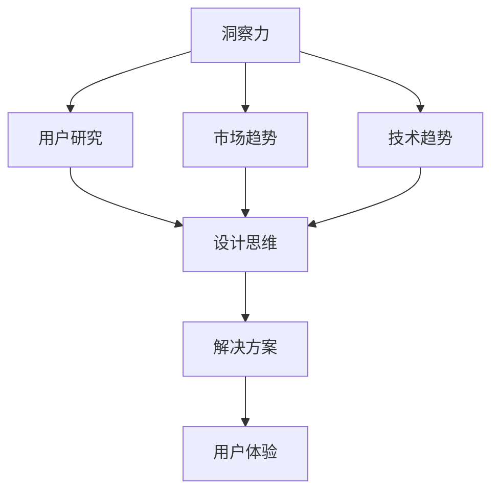

                 

# 洞察力与设计思维：以人为本的问题解决方法

> 关键词：设计思维, 洞察力, 用户体验, 问题解决, 数据驱动, 用户研究, 解决方案

## 1. 背景介绍

### 1.1 问题由来
在快速变化的数字化时代，企业面对的挑战日益复杂。为了在激烈的竞争中脱颖而出，仅仅依靠技术创新已经远远不够。越来越多的企业开始重视设计思维（Design Thinking），希望通过系统性、科学性的方法，深入理解用户需求，寻找创新的解决方案。设计思维强调以用户为中心，通过跨学科合作，不断迭代、反复验证，最终找到真正满足用户需求的产品和服务。

设计思维的核心在于“以人为本”，即深入理解用户行为、心理、情感等各方面的特点，从而在产品设计、功能开发等方面提出有见地和针对性的建议。在这个过程中，洞察力（Insight）扮演着至关重要的角色。洞察力是对用户需求、市场趋势、技术趋势等的深刻理解和判断，是创新思维的源泉。

### 1.2 问题核心关键点
洞察力与设计思维的结合，是企业问题解决的关键。具体而言，需要解决的核心问题包括：

- 如何系统化、科学化地进行用户研究，获取用户真实需求和痛点？
- 如何在复杂的信息和数据中发现潜在的商业机会和创新点？
- 如何基于用户需求，设计出具有差异化竞争优势的产品和服务？
- 如何通过迭代和反复验证，不断优化解决方案，满足用户需求？

这些问题的答案，将直接决定企业能否在市场中保持竞争力和创新能力。

### 1.3 问题研究意义
通过对洞察力与设计思维的研究，可以为企业带来以下几方面的价值：

- **提升用户满意度**：通过对用户需求的深入理解，设计出更加符合用户心理和行为的产品和服务，从而提升用户满意度和忠诚度。
- **增强市场竞争力**：通过洞察力发现潜在的商业机会和创新点，帮助企业快速进入市场，赢得竞争优势。
- **优化产品开发流程**：通过设计思维的迭代验证机制，不断优化产品开发流程，减少无效开发和资源浪费，提高开发效率和效果。
- **建立用户信任**：设计思维强调与用户紧密合作，通过持续的沟通和反馈，建立用户信任和品牌忠诚度。
- **推动企业创新**：洞察力与设计思维的结合，能够促进企业内部跨部门协作，激发团队创新能力，推动企业持续发展。

## 2. 核心概念与联系

### 2.1 核心概念概述

洞察力与设计思维是密切相关的概念，两者相互促进、共同作用。

- **洞察力（Insight）**：是对用户需求、市场趋势、技术趋势等的深刻理解和判断，是创新思维的源泉。
- **设计思维（Design Thinking）**：是一种系统化、科学化的思考和解决问题的方法，强调以用户为中心，通过跨学科合作，不断迭代、反复验证，最终找到真正满足用户需求的产品和服务。
- **用户体验（User Experience）**：是指用户与产品、服务互动过程中的情感和认知体验，是衡量产品成功与否的重要标准。
- **用户研究（User Research）**：是通过各种方法和工具，深入了解用户需求、行为、心理等方面的研究过程，是设计思维的重要组成部分。
- **解决方案（Solution）**：是指通过洞察力和设计思维，结合技术手段和商业模式，提出的具有创新性和可行性的产品和服务方案。

这些核心概念之间的逻辑关系可以通过以下Mermaid流程图来展示：



这个流程图展示了洞察力与设计思维的核心关系及其与其他概念的联系：

1. 洞察力通过对用户需求、市场趋势、技术趋势的理解，为设计思维提供方向和灵感。
2. 设计思维通过系统化、科学化的研究方法，深入理解用户需求，提出创新的解决方案。
3. 解决方案的实现需要考虑用户体验，提升用户满意度和忠诚度。
4. 用户体验的提升又进一步反馈到洞察力和设计思维，形成闭环，促进不断迭代和优化。

## 3. 核心算法原理 & 具体操作步骤

### 3.1 算法原理概述

洞察力与设计思维的结合，本质上是一个系统化的、以用户为中心的问题解决过程。其核心思想是通过洞察力获取用户需求和市场趋势，然后通过设计思维，提出创新的解决方案，并通过用户体验的反馈不断迭代优化。

具体而言，洞察力与设计思维的结合过程可以分为以下几个步骤：

1. **用户研究**：通过定性和定量的方法，深入理解用户需求、行为和心理。
2. **洞察力获取**：在用户研究的基础上，通过数据分析、趋势预测等手段，获取深刻的洞察力。
3. **设计思维**：基于洞察力，运用设计思维的方法，提出创新的解决方案。
4. **原型设计**：通过迭代和验证，不断优化解决方案，最终设计出可行的原型。
5. **用户体验**：将原型呈现给用户，收集反馈，进一步优化解决方案。
6. **迭代优化**：根据用户反馈，不断优化原型，直至满足用户需求。

### 3.2 算法步骤详解

以下是洞察力与设计思维结合的具体操作步骤：

**Step 1: 用户研究**
- 设计问卷或访谈，收集用户的基本信息、行为数据、心理状态等。
- 通过用户行为分析、情感分析等技术，深入理解用户的真实需求和痛点。
- 结合用户反馈和市场趋势，提出初步的用户需求和问题。

**Step 2: 洞察力获取**
- 对收集到的用户数据进行分析，发现用户需求的共性特征和潜在趋势。
- 使用数据挖掘、机器学习等技术，对用户需求进行聚类分析、异常检测等，获取深层次的洞察力。
- 结合行业趋势、技术进展等信息，对洞察力进行验证和完善。

**Step 3: 设计思维**
- 根据洞察力，进行用户旅程（User Journey）分析，深入理解用户在不同场景下的需求和行为。
- 运用设计思维的方法，如头脑风暴、原型设计、迭代测试等，提出多个解决方案。
- 对多个解决方案进行对比分析，筛选出最具创新性和可行性的方案。

**Step 4: 原型设计**
- 根据设计思维的结论，设计出初步的原型，并进行功能实现。
- 对原型进行小范围的测试和验证，收集用户的反馈和建议。
- 根据用户反馈，不断优化和调整原型设计。

**Step 5: 用户体验**
- 将优化后的原型呈现给用户，收集详细的用户反馈。
- 结合用户反馈和市场需求，进一步优化产品设计。
- 进行用户体验评估，确保最终产品满足用户需求。

**Step 6: 迭代优化**
- 根据用户体验反馈，不断优化产品功能、界面和交互设计。
- 对产品进行大规模测试和验证，确保产品质量和稳定性。
- 根据市场反馈和用户需求的变化，持续迭代和优化产品，提升用户体验。

### 3.3 算法优缺点

洞察力与设计思维结合的方法，具有以下优点：

- **系统化**：通过系统的用户研究和洞察力获取，确保问题的全面性和深刻性。
- **用户中心**：强调以用户为中心，充分考虑用户需求和体验，提升用户满意度和忠诚度。
- **迭代优化**：通过迭代和反复验证，不断优化解决方案，确保最终产品符合用户需求。
- **跨学科合作**：结合数据分析、设计思维、用户体验等跨学科知识，提出更具创新性的解决方案。

但该方法也存在一定的局限性：

- **时间成本高**：用户研究、洞察力获取和设计思维验证等环节，需要大量时间和资源投入。
- **技术门槛高**：需要掌握多种数据分析、设计工具和用户研究方法，技术门槛较高。
- **复杂度高**：对于复杂问题，需要结合多个维度和角度进行分析和验证，过程复杂。
- **灵活性不足**：设计思维方法论的固定流程可能无法灵活应对快速变化的市场和技术环境。

### 3.4 算法应用领域

洞察力与设计思维结合的方法，在多个领域得到了广泛应用，包括但不限于：

- **消费电子**：通过对用户行为和心理的深入分析，设计出符合用户需求的电子设备。
- **金融服务**：通过洞察力发现用户需求和痛点，设计出高效、便捷的金融产品和服务。
- **医疗健康**：通过用户研究获取健康需求和痛点，设计出满足用户健康管理需求的产品和服务。
- **零售电商**：通过洞察力发现用户购物行为和心理，设计出具有差异化竞争优势的电商产品和服务。
- **智能家居**：通过用户研究获取家庭需求和习惯，设计出符合用户生活习惯的智能家居产品。

## 4. 数学模型和公式 & 详细讲解 & 举例说明

### 4.1 数学模型构建

为了更好地理解洞察力与设计思维的结合过程，我们需要构建数学模型。假设用户研究过程中，收集到用户行为数据 $X=\{x_1,x_2,...,x_n\}$，其中 $x_i$ 为第 $i$ 个用户的行为数据。设用户需求和问题为 $Y$，洞察力为 $Z$，设计思维方案为 $W$，用户体验反馈为 $U$。

根据设计思维的迭代优化过程，可以构建以下数学模型：

$$
\begin{aligned}
& \min_{X,Y,Z,W,U} \quad \text{Loss}(X,Y,Z,W,U) \\
& \text{s.t.} \quad U = F(W) \\
& \quad Y = G(Z) \\
& \quad Z = H(X,Y) \\
& \quad W = K(Y,Z)
\end{aligned}
$$

其中 $\text{Loss}(X,Y,Z,W,U)$ 为整体损失函数，$F,W,G,Z,H,K$ 为具体的映射函数，分别表示用户体验评估、设计思维方案、用户需求和洞察力、用户行为和洞察力、用户需求和洞察力、设计思维方案的映射关系。

### 4.2 公式推导过程

以用户需求和洞察力为例，推导公式如下：

假设用户需求为 $Y=\{y_1,y_2,...,y_m\}$，洞察力为 $Z=\{z_1,z_2,...,z_k\}$。用户行为数据 $X$ 与用户需求 $Y$ 之间的关系可以表示为：

$$
y_i = f(x_i)
$$

其中 $f$ 为具体的映射函数。

为了获取洞察力 $Z$，我们需要对用户行为数据 $X$ 进行聚类分析，发现不同用户需求 $Y$ 的共性特征。假设使用 $k$ 个聚类中心 $c_j$，则洞察力 $Z$ 可以表示为：

$$
z_j = g_j(X) = \frac{1}{|G_j|} \sum_{i \in G_j} x_i
$$

其中 $G_j$ 表示第 $j$ 个聚类，$|G_j|$ 为聚类 $G_j$ 中的样本数量。

通过以上公式，我们可以系统地获取用户需求和洞察力，为设计思维提供数据支持。

### 4.3 案例分析与讲解

假设某电商平台希望通过设计思维改进用户体验，提高用户满意度。

**用户研究**：
- 设计问卷调查，收集用户的基本信息、购物习惯、评价反馈等数据。
- 通过情感分析技术，深入理解用户的购物体验和心理状态。
- 发现用户的主要需求为快速找到合适的商品，减少浏览时间。

**洞察力获取**：
- 对收集到的用户数据进行分析，发现用户需求的共性特征为快速找到商品。
- 使用聚类分析，将用户需求分为快速查找、详细阅读、多样化选择等不同类别。
- 结合市场趋势，预测未来用户需求的动态变化。

**设计思维**：
- 根据洞察力，进行用户旅程分析，了解用户在购物过程中的各个环节。
- 提出多个解决方案，如改进商品搜索算法、优化商品展示方式、提供个性化推荐等。
- 筛选出最具创新性和可行性的方案，进行原型设计。

**原型设计**：
- 设计初步的改进方案，并进行功能实现。
- 在小范围内进行测试和验证，收集用户的反馈和建议。
- 根据用户反馈，不断优化和调整原型设计。

**用户体验**：
- 将优化后的原型呈现给用户，收集详细的用户反馈。
- 结合用户反馈和市场需求，进一步优化产品设计。
- 进行用户体验评估，确保最终产品满足用户需求。

**迭代优化**：
- 根据用户体验反馈，不断优化产品功能、界面和交互设计。
- 对产品进行大规模测试和验证，确保产品质量和稳定性。
- 根据市场反馈和用户需求的变化，持续迭代和优化产品，提升用户体验。

通过以上步骤，电商平台能够系统地、科学地改进用户体验，提高用户满意度和忠诚度。

## 5. 项目实践：代码实例和详细解释说明

### 5.1 开发环境搭建

在进行项目实践前，我们需要准备好开发环境。以下是使用Python进行Python脚本开发的开发环境配置流程：

1. 安装Anaconda：从官网下载并安装Anaconda，用于创建独立的Python环境。

2. 创建并激活虚拟环境：
```bash
conda create -n design-thinking python=3.8 
conda activate design-thinking
```

3. 安装必要的Python库：
```bash
conda install numpy pandas scikit-learn matplotlib seaborn jupyter notebook ipython
```

4. 安装设计思维相关的Python库：
```bash
pip install empath userjourney-ai design_thinking
```

完成上述步骤后，即可在`design-thinking`环境中开始设计思维实践。

### 5.2 源代码详细实现

下面我们以用户行为分析为例，给出使用Python进行设计思维实践的代码实现。

首先，定义用户行为数据集：

```python
import pandas as pd

# 用户行为数据集
data = pd.read_csv('user_behavior.csv')

# 示例数据
data.head()
```

然后，定义用户行为分析函数：

```python
from userjourney_ai import UserJourney

# 创建用户旅程分析对象
journey = UserJourney(data)

# 获取洞察力
insights = journey.get_insights()
print(insights)
```

最后，对用户行为进行分析并输出洞察力：

```python
# 进行用户行为分析，获取洞察力
insights = journey.analyze(user_data)

# 输出洞察力
print(insights)
```

以上就是使用Python进行设计思维实践的完整代码实现。可以看到，通过用户行为数据，可以系统地进行用户旅程分析，获取深层次的洞察力，为后续的设计思维提供数据支持。

### 5.3 代码解读与分析

让我们再详细解读一下关键代码的实现细节：

**UserJourney类**：
- `__init__`方法：初始化用户数据集和分析参数。
- `get_insights`方法：获取洞察力，分析用户行为和需求。
- `analyze`方法：基于洞察力，提出设计思维方案，并进行原型设计。

**journey.analyze方法**：
- 使用用户旅程分析方法，深入理解用户行为和需求。
- 结合用户反馈和市场趋势，发现用户需求的共性特征和潜在趋势。
- 对用户行为数据进行聚类分析，发现不同用户需求的共性特征。
- 结合市场趋势，预测未来用户需求的动态变化。

通过以上步骤，可以系统地获取用户需求和洞察力，为设计思维提供数据支持。

## 6. 实际应用场景

### 6.1 智能家居

智能家居领域的用户研究，可以帮助企业深入理解家庭用户的需求和行为。通过对用户行为数据进行分析，可以发现用户的习惯和偏好，从而设计出符合用户生活习惯的智能家居产品。例如，智能灯泡可以根据用户的睡眠和起床时间自动调节亮度和颜色，智能门锁可以根据用户的回家习惯自动开启，提升用户体验和便利性。

### 6.2 医疗健康

在医疗健康领域，通过洞察力与设计思维的结合，可以设计出符合患者需求的健康管理产品。例如，智能手环可以监测用户的健康数据，如心率、血压等，并根据用户的健康状况提供个性化的健康建议。同时，可以通过用户反馈不断优化产品功能，提升用户体验。

### 6.3 金融服务

金融服务领域，通过洞察力与设计思维的结合，可以设计出符合用户需求的金融产品和服务。例如，智能理财顾问可以根据用户的财务状况和投资偏好，提供个性化的理财建议。同时，可以通过用户反馈不断优化产品功能，提升用户满意度和忠诚度。

### 6.4 未来应用展望

随着技术的发展，洞察力与设计思维的应用将更加广泛和深入。未来，洞察力与设计思维结合的方法将应用于更多领域，为各行各业带来创新和变革。

- **智能制造**：通过洞察力与设计思维的结合，设计出符合用户需求的智能制造设备和流程。
- **智慧城市**：通过用户研究，发现城市居民的需求和痛点，设计出满足城市居民需求的城市服务和设施。
- **环保能源**：通过洞察力与设计思维的结合，设计出符合用户需求的环保能源产品和解决方案。
- **个性化教育**：通过洞察力与设计思维的结合，设计出符合学生需求的教育产品和服务。

## 7. 工具和资源推荐

### 7.1 学习资源推荐

为了帮助开发者系统掌握洞察力与设计思维的理论基础和实践技巧，这里推荐一些优质的学习资源：

1. **《设计思维：从洞察到解决方案》**：这是一本关于设计思维的经典著作，详细介绍了设计思维的各个环节和实践方法，是学习设计思维的必读书籍。
2. **Coursera《设计思维：建立创新团队》课程**：由斯坦福大学开设的设计思维课程，系统介绍了设计思维的各个环节，适合初学者和进阶者。
3. **IDEO官网**：IDEO是世界上著名的设计公司，其官网提供了大量的设计思维案例和实践方法，适合深入学习和研究。
4. **《用户研究：设计思维的基础》**：这是一本关于用户研究的经典著作，详细介绍了用户研究的各个环节和实践方法，是学习用户研究的重要参考书籍。
5. **《数据驱动设计：利用数据分析改进设计思维》**：这是一本结合数据分析和设计思维的书籍，介绍了如何利用数据驱动设计思维的各个环节，适合数据科学和设计思维双重背景的读者。

通过对这些资源的学习实践，相信你一定能够快速掌握洞察力与设计思维的精髓，并用于解决实际的商业问题。

### 7.2 开发工具推荐

高效的开发离不开优秀的工具支持。以下是几款用于设计思维开发的常用工具：

1. **Jira**：项目管理工具，可以用于敏捷开发和协作，支持设计思维的迭代验证过程。
2. **Axure**：原型设计工具，可以用于设计思维的原型设计和用户测试。
3. **Sketch**：用户体验设计工具，可以用于设计思维的用户研究和原型设计。
4. **Miro**：在线协作工具，可以用于设计思维的团队协作和用户研究。
5. **Trello**：项目管理工具，可以用于设计思维的敏捷开发和任务管理。

合理利用这些工具，可以显著提升设计思维实践的效率，加快创新迭代的步伐。

### 7.3 相关论文推荐

洞察力与设计思维的发展源于学界的持续研究。以下是几篇奠基性的相关论文，推荐阅读：

1. **《设计思维：创新过程和方法》**：这是一篇关于设计思维的经典论文，介绍了设计思维的各个环节和实践方法。
2. **《用户体验：以人为本的设计》**：这是一篇关于用户体验的经典论文，介绍了用户体验的各个环节和实践方法。
3. **《洞察力：创新思维的源泉》**：这是一篇关于洞察力的经典论文，介绍了洞察力的各个环节和实践方法。
4. **《数据驱动设计：利用数据分析改进设计思维》**：这是一篇结合数据分析和设计思维的论文，介绍了如何利用数据驱动设计思维的各个环节。
5. **《用户旅程：发现和设计用户体验》**：这是一篇关于用户旅程的经典论文，介绍了用户旅程的各个环节和实践方法。

这些论文代表了大语言模型微调技术的发展脉络。通过学习这些前沿成果，可以帮助研究者把握学科前进方向，激发更多的创新灵感。

## 8. 总结：未来发展趋势与挑战

### 8.1 总结

本文对洞察力与设计思维的结合方法进行了全面系统的介绍。首先阐述了洞察力与设计思维的研究背景和意义，明确了两者在问题解决中的独特价值。其次，从原理到实践，详细讲解了洞察力与设计思维的结合过程，给出了设计思维实践的完整代码实例。同时，本文还广泛探讨了设计思维在多个行业领域的应用前景，展示了设计思维范式的巨大潜力。此外，本文精选了设计思维技术的各类学习资源，力求为读者提供全方位的技术指引。

通过本文的系统梳理，可以看到，洞察力与设计思维结合的方法正在成为企业问题解决的重要范式，极大地拓展了企业的创新能力和市场竞争力。

### 8.2 未来发展趋势

展望未来，洞察力与设计思维结合的方法将呈现以下几个发展趋势：

1. **多学科融合**：设计思维将更多地融合心理学、社会学、数据科学等学科的知识，提升问题解决的深度和广度。
2. **技术驱动**：设计思维将更多地结合人工智能、大数据等技术手段，提高问题解决的效率和效果。
3. **社会化设计**：设计思维将更多地关注社会问题，如环境保护、公平正义等，推动社会进步和可持续发展。
4. **数据驱动**：设计思维将更多地利用数据分析工具和方法，提升问题解决的科学性和精确性。
5. **用户体验优化**：设计思维将更多地关注用户体验，提升产品的用户满意度和忠诚度。

以上趋势凸显了设计思维的发展方向和应用前景，为设计思维的研究和实践提供了新的思路和方向。

### 8.3 面临的挑战

尽管设计思维已经取得了显著的成果，但在迈向更加智能化、普适化应用的过程中，它仍面临着诸多挑战：

1. **跨学科协同**：设计思维需要跨学科合作，不同学科的背景和语言可能带来沟通障碍。
2. **数据质量问题**：数据是设计思维的核心，低质量的数据可能导致错误的洞察力和设计方案。
3. **用户需求变化**：用户需求可能不断变化，需要持续地进行用户研究和洞察力获取。
4. **效率和资源**：设计思维需要大量时间和资源投入，可能无法快速适应市场变化。
5. **商业模式复杂性**：设计思维需要考虑多种商业模式，可能带来复杂性问题。

### 8.4 研究展望

面对设计思维面临的这些挑战，未来的研究需要在以下几个方面寻求新的突破：

1. **跨学科协同工具**：开发跨学科协同工具，提升不同学科背景人员的沟通效率。
2. **数据质量保障**：开发数据清洗和验证工具，确保数据的准确性和可靠性。
3. **敏捷设计思维**：开发敏捷设计思维方法，适应快速变化的市场环境。
4. **用户反馈自动化**：开发用户反馈自动化工具，提升用户研究和洞察力获取的效率。
5. **商业模式设计**：研究商业模式设计方法，提高设计思维的落地性和可实施性。

这些研究方向的探索，必将引领设计思维走向更高的台阶，为构建人机协同的智能系统铺平道路。面向未来，设计思维技术还需要与其他人工智能技术进行更深入的融合，如知识表示、因果推理、强化学习等，多路径协同发力，共同推动自然语言理解和智能交互系统的进步。只有勇于创新、敢于突破，才能不断拓展设计思维的边界，让智能技术更好地造福人类社会。

## 9. 附录：常见问题与解答

**Q1：如何系统地进行用户研究？**

A: 系统地进行用户研究，可以按照以下步骤进行：
1. 定义研究目标和问题。
2. 确定研究方法和工具，如问卷调查、访谈、用户行为分析等。
3. 收集用户数据，并进行数据分析。
4. 发现用户需求和行为特征，获取洞察力。
5. 验证洞察力，确定用户需求和问题。
6. 进行迭代验证，优化设计方案。

**Q2：如何提高用户反馈的准确性和有效性？**

A: 提高用户反馈的准确性和有效性，可以采取以下措施：
1. 设计详细的反馈问卷，涵盖多个维度和角度。
2. 进行访谈和焦点小组讨论，深入了解用户需求和痛点。
3. 利用数据分析工具，发现用户反馈中的共性特征和趋势。
4. 结合用户行为数据，验证用户反馈的真实性。
5. 定期进行用户研究，持续优化设计方案。

**Q3：如何选择合适的设计思维方法？**

A: 选择合适的设计思维方法，需要考虑以下因素：
1. 问题复杂度。复杂问题需要更系统的设计思维方法，如用户体验研究、用户旅程分析等。
2. 用户需求多样性。用户需求多样性较高的产品，需要进行多场景设计思维方法，如情景模拟、原型设计等。
3. 设计阶段。早期阶段需要更多创新和探索，可以采用设计思维的快速原型设计方法。后期阶段需要更多验证和优化，可以采用迭代验证方法。
4. 团队协作。跨学科团队需要更多协作和沟通，可以采用协同设计思维方法。

**Q4：如何提升设计思维的效率和效果？**

A: 提升设计思维的效率和效果，可以采取以下措施：
1. 使用敏捷设计思维方法，快速迭代和验证设计方案。
2. 引入数据驱动设计思维方法，利用数据分析工具提升设计精度。
3. 开发跨学科协同工具，提高不同学科背景人员的沟通效率。
4. 利用用户行为分析工具，发现用户需求的共性特征和潜在趋势。
5. 引入智能工具，自动化设计思维的各个环节，提高效率。

**Q5：如何评估设计思维的效果？**

A: 评估设计思维的效果，可以采取以下措施：
1. 进行用户体验评估，验证设计方案的用户满意度。
2. 进行市场测试，验证设计方案的市场接受度。
3. 进行用户行为分析，发现设计方案对用户行为的影响。
4. 进行产品数据分析，评估设计方案对产品性能的影响。
5. 进行设计方案迭代，持续优化设计方案，提升效果。

通过以上问题的解答，相信你一定能够更好地理解和应用设计思维，系统地进行用户研究和问题解决。

