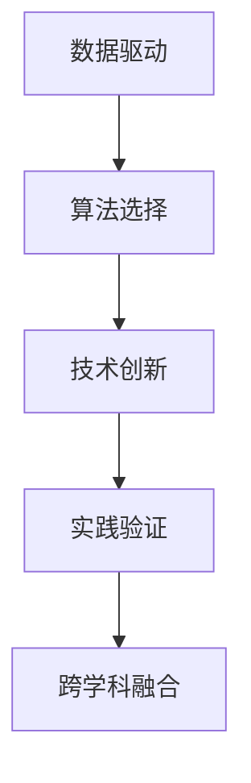

                 

# 洞察力培养：从观察到创新

> 关键词：洞察力,创新,观察,学习,算法,实践

## 1. 背景介绍

### 1.1 问题由来

在当前数据驱动的科技时代，洞察力（Insight）成为了企业和个人获取竞争优势的关键能力。然而，数据量的爆炸式增长，使得人们往往陷入信息过载和数据噪音的困扰中。如何从海量数据中提取有价值的洞察，洞察到真实世界的本质，成为了推动创新和决策的重要问题。

洞察力（Insight），本质上是一种将复杂现象简化为可理解模式的能力。它涉及到观察、分析、推理、创意等多重过程，需要多学科的知识和技能。在技术领域，洞察力更是推动算法创新、提升系统性能的重要驱动力。

### 1.2 问题核心关键点

洞察力的培养不仅需要对数据进行观察和分析，还需要创新性地应用算法和技术，实现对数据的深度挖掘和有效利用。其关键点包括：

1. **数据驱动**：利用数据进行观察，提取有价值的特征和模式。
2. **算法选择**：选择合适的算法和模型，进行数据的分析和建模。
3. **技术创新**：在现有技术的基础上，进行新的方法和工具的创新和应用。
4. **实践验证**：将理论应用于实际问题，进行反复迭代和优化。
5. **跨学科融合**：结合多领域的知识和技能，综合提升洞察力。

### 1.3 问题研究意义

培养洞察力不仅是科技工作者的职业要求，更是推动社会进步和个人发展的重要能力。对于企业来说，具备高洞察力的团队能够更快地响应市场变化，预测趋势，提升竞争力。而对于个人而言，洞察力是提升自我认知、实现职业突破的关键。

在技术领域，洞察力能够帮助研究者突破现有技术瓶颈，开发出更高效、更创新的算法。因此，培养和提升洞察力，对于技术的发展和应用具有重要意义。

## 2. 核心概念与联系

### 2.1 核心概念概述

为了更好地理解洞察力的培养过程，本节将介绍几个密切相关的核心概念：

- **数据驱动**：利用数据进行观察和分析，提取有价值的特征和模式。
- **算法选择**：根据数据特点和分析目标，选择合适的算法和模型。
- **技术创新**：在现有技术的基础上，进行新的方法和工具的创新和应用。
- **实践验证**：将理论应用于实际问题，进行反复迭代和优化。
- **跨学科融合**：结合多领域的知识和技能，综合提升洞察力。

这些核心概念之间的逻辑关系可以通过以下Mermaid流程图来展示：



这个流程图展示了洞察力培养的基本流程：

1. 首先，通过数据驱动的方式进行观察和分析。
2. 其次，根据分析目标和数据特点，选择合适的算法和模型。
3. 然后，在现有技术的基础上进行技术创新，应用新的方法和工具。
4. 最后，通过实践验证和跨学科融合，综合提升洞察力。

## 3. 核心算法原理 & 具体操作步骤

### 3.1 算法原理概述

洞察力的培养涉及多学科的算法和技术，其核心原理是利用数据驱动，通过观察和分析，提取有价值的特征和模式。在这一过程中，算法的选择和创新应用至关重要。

算法的选择和创新应用，依赖于对数据的理解和对问题的建模。一般来说，洞察力的培养流程可以概括为以下几个步骤：

1. **数据预处理**：清洗、标准化数据，准备数据集。
2. **特征提取**：提取数据中的关键特征，进行特征选择和特征工程。
3. **模型选择**：根据问题的特点和数据的性质，选择合适的算法和模型。
4. **模型训练**：使用训练集对模型进行训练，优化模型参数。
5. **模型评估**：使用验证集和测试集对模型进行评估，选择最优模型。
6. **模型应用**：将训练好的模型应用于实际问题，进行预测和推理。

### 3.2 算法步骤详解

下面详细讲解洞察力培养中的算法步骤：

**Step 1: 数据预处理**

数据预处理是洞察力培养的第一步。在这一步骤中，需要完成数据的清洗、标准化和特征提取。具体步骤如下：

1. **数据清洗**：去除重复、噪声数据，处理缺失值和异常值。
2. **数据标准化**：对数据进行归一化、标准化等预处理，确保数据的一致性和可比性。
3. **特征提取**：通过统计、转换等方式，提取数据中的关键特征，进行特征选择和特征工程。

**Step 2: 特征提取与选择**

特征提取是洞察力培养的核心环节。在这一步骤中，需要根据问题的特点和数据的性质，选择合适的特征，进行特征选择和特征工程。具体步骤如下：

1. **特征选择**：通过统计、相关性分析等方式，选择最具代表性的特征。
2. **特征工程**：对原始特征进行转换、组合等操作，生成新的特征。

**Step 3: 模型选择与训练**

模型选择和训练是洞察力培养的关键步骤。在这一步骤中，需要根据问题的特点和数据的性质，选择合适的算法和模型，进行训练和优化。具体步骤如下：

1. **模型选择**：根据问题的特点和数据的性质，选择合适的算法和模型。
2. **模型训练**：使用训练集对模型进行训练，优化模型参数。
3. **模型评估**：使用验证集和测试集对模型进行评估，选择最优模型。

**Step 4: 模型应用**

模型应用是将洞察力转化为实际应用的重要步骤。在这一步骤中，需要将训练好的模型应用于实际问题，进行预测和推理。具体步骤如下：

1. **模型部署**：将训练好的模型部署到生产环境中，进行实际应用。
2. **模型监控**：实时监控模型的性能和效果，进行迭代和优化。
3. **模型更新**：根据新数据和业务需求，更新和优化模型，提升洞察力。

### 3.3 算法优缺点

洞察力培养的算法具有以下优点：

1. **数据驱动**：通过数据驱动的方式，能够准确地提取和利用数据中的关键信息，提升洞察力。
2. **模型灵活**：根据问题的特点和数据的性质，选择合适的算法和模型，灵活应对各种复杂问题。
3. **可解释性强**：模型训练和应用的过程透明可解释，便于理解和调试。

然而，该方法也存在一些缺点：

1. **数据依赖性强**：洞察力培养依赖于高质量的数据，数据质量的好坏直接影响洞察力的效果。
2. **算法复杂度高**：洞察力培养涉及多学科的算法和技术，算法复杂度高，难以理解和实现。
3. **模型易过拟合**：模型训练过程中容易过拟合，需要进行仔细的参数调优和验证。

尽管存在这些局限性，但就目前而言，数据驱动的洞察力培养方法仍是最主流范式。未来相关研究的重点在于如何进一步降低数据依赖，提高模型的泛化能力，同时兼顾可解释性和鲁棒性等因素。

### 3.4 算法应用领域

洞察力培养的算法和技术在多个领域得到了广泛的应用，例如：

- **金融风控**：通过数据分析和建模，预测金融风险，提升风险管理能力。
- **医疗诊断**：通过数据挖掘和模型训练，辅助医生进行疾病诊断和治疗方案制定。
- **市场营销**：通过数据分析和客户行为建模，制定精准营销策略，提升客户满意度。
- **智能推荐**：通过数据分析和模型训练，推荐个性化产品和服务，提升用户体验。
- **网络安全**：通过数据分析和威胁建模，预测和防御网络攻击，提升安全防护能力。

除了上述这些经典应用外，洞察力培养的算法和技术还在更多场景中得到应用，如工业制造、城市治理、环境保护等，为各行各业带来了新的解决方案和创新机遇。

## 4. 数学模型和公式 & 详细讲解 & 举例说明

### 4.1 数学模型构建

本节将使用数学语言对洞察力培养的算法步骤进行更加严格的刻画。

假设有一组数据集 $D=\{(x_i,y_i)\}_{i=1}^N$，其中 $x_i \in \mathbb{R}^d$ 为输入，$y_i \in \mathbb{R}$ 为输出。定义模型 $M_{\theta}:\mathbb{R}^d \rightarrow \mathbb{R}$，其中 $\theta$ 为模型参数。

定义模型 $M_{\theta}$ 在数据样本 $(x,y)$ 上的损失函数为 $\ell(M_{\theta}(x),y)$，则在数据集 $D$ 上的经验风险为：

$$
\mathcal{L}(\theta) = \frac{1}{N} \sum_{i=1}^N \ell(M_{\theta}(x_i),y_i)
$$

通过梯度下降等优化算法，最小化损失函数，更新模型参数 $\theta$：

$$
\theta \leftarrow \theta - \eta \nabla_{\theta}\mathcal{L}(\theta)
$$

其中 $\eta$ 为学习率，$\nabla_{\theta}\mathcal{L}(\theta)$ 为损失函数对参数 $\theta$ 的梯度。

### 4.2 公式推导过程

以下我们以线性回归为例，推导最小二乘法的损失函数及其梯度计算公式。

假设模型 $M_{\theta}$ 为线性模型，即 $M_{\theta}(x)=\theta^Tx$，其中 $\theta \in \mathbb{R}^d$。假设样本 $(x_i,y_i)$ 服从高斯分布：

$$
y_i = \theta^Tx_i + \epsilon_i, \quad \epsilon_i \sim N(0,\sigma^2)
$$

则样本的误差为：

$$
\epsilon_i = y_i - \theta^Tx_i
$$

最小二乘法的损失函数为：

$$
\ell(M_{\theta}(x),y) = \frac{1}{2}(y - \theta^Tx)^2
$$

则在数据集 $D$ 上的经验风险为：

$$
\mathcal{L}(\theta) = \frac{1}{2N} \sum_{i=1}^N (y_i - \theta^Tx_i)^2
$$

根据链式法则，损失函数对参数 $\theta_k$ 的梯度为：

$$
\frac{\partial \mathcal{L}(\theta)}{\partial \theta_k} = \frac{1}{N} \sum_{i=1}^N (x_{ik}(y_i - \theta^Tx_i))
$$

在得到损失函数的梯度后，即可带入参数更新公式，完成模型的迭代优化。重复上述过程直至收敛，最终得到适应数据集 $D$ 的最优模型参数 $\theta^*$。

### 4.3 案例分析与讲解

假设有一组房价数据集 $D=\{(x_i,y_i)\}_{i=1}^N$，其中 $x_i$ 为房屋面积，$y_i$ 为房价。使用最小二乘法对数据集进行建模，具体步骤如下：

1. **数据预处理**：清洗数据，去除重复和噪声，标准化数据。
2. **特征提取**：选择房屋面积作为特征，进行特征选择和特征工程。
3. **模型选择**：选择线性回归模型，进行训练和优化。
4. **模型评估**：使用验证集和测试集对模型进行评估，选择最优模型。
5. **模型应用**：将训练好的模型应用于新房屋的房价预测。

通过数据分析和建模，可以得到房价与房屋面积之间的线性关系，从而实现房价预测，提升洞察力。

## 5. 项目实践：代码实例和详细解释说明

### 5.1 开发环境搭建

在进行洞察力培养的实践前，我们需要准备好开发环境。以下是使用Python进行Scikit-learn开发的开发环境配置流程：

1. 安装Anaconda：从官网下载并安装Anaconda，用于创建独立的Python环境。

2. 创建并激活虚拟环境：
```bash
conda create -n scikit-learn-env python=3.8 
conda activate scikit-learn-env
```

3. 安装Scikit-learn：
```bash
pip install scikit-learn
```

4. 安装各类工具包：
```bash
pip install numpy pandas matplotlib scikit-learn
```

完成上述步骤后，即可在`scikit-learn-env`环境中开始洞察力培养的实践。

### 5.2 源代码详细实现

下面我们以线性回归为例，给出使用Scikit-learn进行洞察力培养的代码实现。

首先，准备数据集：

```python
import pandas as pd

# 读取数据集
data = pd.read_csv('data.csv')

# 划分训练集和测试集
train_data = data[:800]
test_data = data[800:]

# 标准化数据
from sklearn.preprocessing import StandardScaler
scaler = StandardScaler()
train_data = scaler.fit_transform(train_data[['area']])
test_data = scaler.transform(test_data[['area']])

# 提取特征和标签
X_train = train_data[:, [0]]
y_train = train_data[:, [1]]
X_test = test_data[:, [0]]
y_test = test_data[:, [1]]
```

然后，定义模型并进行训练：

```python
from sklearn.linear_model import LinearRegression
from sklearn.metrics import mean_squared_error

# 定义模型
model = LinearRegression()

# 训练模型
model.fit(X_train, y_train)

# 评估模型
y_pred = model.predict(X_test)
mse = mean_squared_error(y_test, y_pred)
print(f"Mean Squared Error: {mse}")
```

最后，展示模型训练效果：

```python
import matplotlib.pyplot as plt

# 绘制训练曲线
plt.plot(range(len(train_data)), y_train, label='Training')
plt.plot(range(len(test_data)), y_test, label='Testing')
plt.legend()
plt.show()
```

以上就是使用Scikit-learn进行洞察力培养的完整代码实现。可以看到，Scikit-learn库提供了丰富的数据处理和模型训练功能，使得洞察力培养的代码实现变得简洁高效。

### 5.3 代码解读与分析

让我们再详细解读一下关键代码的实现细节：

**数据准备**：
- 使用pandas库读取数据集，并进行标准化处理。
- 将数据集划分为训练集和测试集。

**模型定义与训练**：
- 使用Scikit-learn的LinearRegression类定义线性回归模型。
- 使用训练集数据对模型进行训练，并计算训练误差。
- 使用测试集数据对模型进行评估，计算测试误差。

**结果展示**：
- 使用matplotlib库绘制训练曲线，展示模型训练效果。

通过上述代码实现，可以看到Scikit-learn库的强大封装，使得洞察力培养的代码实现变得简洁高效。开发者可以将更多精力放在数据处理、模型改进等高层逻辑上，而不必过多关注底层的实现细节。

当然，工业级的系统实现还需考虑更多因素，如模型的保存和部署、超参数的自动搜索、更灵活的任务适配层等。但核心的洞察力培养流程基本与此类似。

## 6. 实际应用场景

### 6.1 金融风控

金融风控是洞察力培养的一个重要应用场景。金融行业的风险管理依赖于大量的数据，需要对客户的信用历史、交易记录等进行深度分析，从而预测其信用风险。

在实践中，可以通过收集客户的信用历史、交易记录、社会关系等数据，构建洞察力培养模型。模型通过分析这些数据，提取有价值的特征，建立客户信用风险的预测模型。通过持续的数据输入和模型训练，提升模型的预测准确性，实现金融风险的早期预警和风险管理。

### 6.2 医疗诊断

医疗诊断是洞察力培养的另一个重要应用场景。现代医疗诊断依赖于大量的数据，需要对患者的病历、影像等数据进行深度分析，从而辅助医生进行疾病诊断和治疗方案制定。

在实践中，可以通过收集患者的病历、影像、基因等数据，构建洞察力培养模型。模型通过分析这些数据，提取有价值的特征，建立疾病的预测模型。通过持续的数据输入和模型训练，提升模型的预测准确性，实现疾病的早期诊断和治疗方案的优化。

### 6.3 市场营销

市场营销是洞察力培养的广泛应用场景。市场营销依赖于大量的数据，需要对客户的消费行为、偏好等进行深度分析，从而制定精准营销策略，提升客户满意度。

在实践中，可以通过收集客户的消费记录、社交媒体行为、人口统计信息等数据，构建洞察力培养模型。模型通过分析这些数据，提取有价值的特征，建立客户消费行为和偏好的预测模型。通过持续的数据输入和模型训练，提升模型的预测准确性，实现精准营销策略的制定，提升客户满意度。

### 6.4 智能推荐

智能推荐是洞察力培养的典型应用场景。智能推荐依赖于大量的数据，需要对用户的浏览、点击、购买等行为进行深度分析，从而推荐个性化产品和服务，提升用户体验。

在实践中，可以通过收集用户的浏览、点击、购买等行为数据，构建洞察力培养模型。模型通过分析这些数据，提取有价值的特征，建立用户的兴趣和行为的预测模型。通过持续的数据输入和模型训练，提升模型的预测准确性，实现个性化推荐，提升用户体验。

## 7. 工具和资源推荐

### 7.1 学习资源推荐

为了帮助开发者系统掌握洞察力培养的理论基础和实践技巧，这里推荐一些优质的学习资源：

1. 《机器学习实战》系列博文：由机器学习专家撰写，深入浅出地介绍了机器学习的基本概念和经典模型。

2. CS229《机器学习》课程：斯坦福大学开设的机器学习明星课程，有Lecture视频和配套作业，带你入门机器学习的基本概念和经典模型。

3. 《Pattern Recognition and Machine Learning》书籍：机器学习领域的经典教材，全面介绍了机器学习的基本理论和算法。

4. Scikit-learn官方文档：Scikit-learn库的官方文档，提供了丰富的机器学习模型和工具，是进行机器学习开发的重要参考资料。

5. Kaggle平台：数据科学竞赛平台，提供大量的数据集和竞赛，有助于提升数据处理和机器学习的能力。

通过对这些资源的学习实践，相信你一定能够快速掌握洞察力培养的精髓，并用于解决实际的机器学习问题。

### 7.2 开发工具推荐

高效的开发离不开优秀的工具支持。以下是几款用于洞察力培养开发的常用工具：

1. Python：作为一种通用的编程语言，Python在机器学习和数据科学领域应用广泛。其丰富的第三方库和框架，如Scikit-learn、TensorFlow等，使得机器学习开发变得高效便捷。

2. Scikit-learn：一个基于Python的机器学习库，提供丰富的模型和算法，支持数据预处理、特征提取、模型训练等环节。

3. TensorFlow：由Google主导开发的开源机器学习框架，支持深度学习模型训练和推理，具有丰富的优化器和正则化技术。

4. Keras：一个高层次的深度学习框架，支持快速原型设计和模型训练，具有丰富的预训练模型和可视化工具。

5. Jupyter Notebook：一个交互式的开发环境，支持实时代码执行和结果展示，便于数据探索和模型验证。

6. Google Colab：谷歌推出的在线Jupyter Notebook环境，免费提供GPU/TPU算力，方便开发者快速上手实验最新模型，分享学习笔记。

合理利用这些工具，可以显著提升洞察力培养任务的开发效率，加快创新迭代的步伐。

### 7.3 相关论文推荐

洞察力培养的算法和技术的发展源于学界的持续研究。以下是几篇奠基性的相关论文，推荐阅读：

1. "The Elements of Statistical Learning"：机器学习领域的经典教材，涵盖了统计学习的基本理论和算法。

2. "Deep Learning"：深度学习领域的经典教材，介绍了深度神经网络的基本理论和算法。

3. "Pattern Recognition and Machine Learning"：机器学习领域的经典教材，全面介绍了机器学习的基本理论和算法。

4. "Machine Learning Yearning"：Facebook首席AI工程师Andrew Ng的机器学习实战指南，涵盖机器学习的基本概念和实践技巧。

5. "Large Scale Machine Learning"：机器学习领域的经典论文，介绍了大规模机器学习的基本理论和算法。

这些论文代表了大语言模型微调技术的发展脉络。通过学习这些前沿成果，可以帮助研究者把握学科前进方向，激发更多的创新灵感。

## 8. 总结：未来发展趋势与挑战

### 8.1 总结

本文对洞察力培养的算法和实践进行了全面系统的介绍。首先阐述了洞察力的重要性，明确了数据驱动和算法创新的关键作用。其次，从原理到实践，详细讲解了洞察力培养的数学原理和关键步骤，给出了洞察力培养任务开发的完整代码实例。同时，本文还广泛探讨了洞察力培养在金融风控、医疗诊断、市场营销等多个行业领域的应用前景，展示了洞察力培养的巨大潜力。此外，本文精选了洞察力培养的各类学习资源，力求为读者提供全方位的技术指引。

通过本文的系统梳理，可以看到，洞察力培养的算法和技术正在成为机器学习领域的重要范式，极大地提升了数据驱动的能力，推动了算法创新和业务应用。未来，伴随机器学习的发展和应用，洞察力培养必将在更多领域得到应用，为各行各业带来变革性影响。

### 8.2 未来发展趋势

展望未来，洞察力培养的算法和技术将呈现以下几个发展趋势：

1. **数据质量提升**：随着数据采集和处理技术的进步，数据质量将得到显著提升，洞察力培养的效果也将更上一层楼。
2. **模型复杂度提高**：随着深度学习技术的发展，模型的复杂度将不断提升，能够处理更加复杂和多样化的问题。
3. **跨学科融合**：跨学科融合将进一步加深，洞察力培养将与更多领域的知识和技术相结合，提升综合能力。
4. **自动化和可解释性**：洞察力培养将更多地利用自动化工具和可解释性方法，提升模型应用的灵活性和可解释性。
5. **模型集成**：模型集成技术将得到广泛应用，通过多种模型的组合，提升模型的泛化能力和鲁棒性。

以上趋势凸显了洞察力培养技术的广阔前景。这些方向的探索发展，必将进一步提升机器学习系统的性能和应用范围，为各行各业带来新的解决方案和创新机遇。

### 8.3 面临的挑战

尽管洞察力培养的算法和技术已经取得了瞩目成就，但在迈向更加智能化、普适化应用的过程中，它仍面临着诸多挑战：

1. **数据质量瓶颈**：数据采集和处理过程中容易引入噪声和错误，数据质量的好坏直接影响洞察力的效果。
2. **模型复杂度高**：洞察力培养涉及多学科的算法和技术，算法复杂度高，难以理解和实现。
3. **模型鲁棒性不足**：模型面对域外数据时，泛化性能往往大打折扣。对于测试样本的微小扰动，模型的预测也容易发生波动。
4. **自动化水平低**：洞察力培养过程依赖人工干预，自动化水平低，难以高效应对大规模问题。
5. **模型可解释性差**：洞察力培养模型往往具有黑盒特性，难以解释其内部工作机制和决策逻辑。

尽管存在这些局限性，但就目前而言，数据驱动的洞察力培养方法仍是最主流范式。未来相关研究的重点在于如何进一步降低数据依赖，提高模型的泛化能力，同时兼顾可解释性和鲁棒性等因素。

### 8.4 研究展望

面对洞察力培养面临的挑战，未来的研究需要在以下几个方面寻求新的突破：

1. **无监督学习和半监督学习**：摆脱对大规模标注数据的依赖，利用自监督学习、主动学习等无监督和半监督范式，最大限度利用非结构化数据，实现更加灵活高效的洞察力培养。
2. **参数高效和计算高效**：开发更加参数高效的洞察力培养方法，在固定大部分预训练参数的同时，只更新极少量的任务相关参数。同时优化洞察力培养模型的计算图，减少前向传播和反向传播的资源消耗，实现更加轻量级、实时性的部署。
3. **因果推断和对比学习**：引入因果推断和对比学习思想，增强洞察力培养模型建立稳定因果关系的能力，学习更加普适、鲁棒的语言表征，从而提升模型泛化性和抗干扰能力。
4. **跨模态数据融合**：将符号化的先验知识，如知识图谱、逻辑规则等，与神经网络模型进行巧妙融合，引导洞察力培养过程学习更准确、合理的语言模型。同时加强不同模态数据的整合，实现视觉、语音等多模态信息与文本信息的协同建模。
5. **多模型集成与可解释性**：将因果分析方法引入洞察力培养模型，识别出模型决策的关键特征，增强输出解释的因果性和逻辑性。借助博弈论工具刻画人机交互过程，主动探索并规避模型的脆弱点，提高系统稳定性。
6. **跨学科融合**：结合多领域的知识和技能，综合提升洞察力培养模型的能力和效果。

这些研究方向的探索，必将引领洞察力培养技术迈向更高的台阶，为构建安全、可靠、可解释、可控的智能系统铺平道路。面向未来，洞察力培养技术还需要与其他人工智能技术进行更深入的融合，如知识表示、因果推理、强化学习等，多路径协同发力，共同推动人工智能技术的发展。

## 9. 附录：常见问题与解答

**Q1：如何选择合适的洞察力培养模型？**

A: 选择合适的洞察力培养模型需要考虑多个因素，包括数据特点、问题类型、计算资源等。一般来说，可以根据以下步骤进行模型选择：

1. **理解数据特点**：分析数据的分布、特征、噪声等特性，选择适合的数据处理方法。
2. **理解问题类型**：根据问题的类型（如回归、分类、聚类等），选择相应的模型和算法。
3. **理解计算资源**：考虑模型的计算复杂度和资源需求，选择合适的模型和算法。

**Q2：洞察力培养过程中如何降低数据依赖性？**

A: 降低数据依赖性是洞察力培养中的一个重要研究方向。以下是一些可行的方法：

1. **利用无监督学习**：采用无监督学习的方法，如自编码器、GAN等，从数据中提取有意义的特征，减少对标注数据的依赖。
2. **利用半监督学习**：结合少量标注数据和大量无标注数据，利用半监督学习的方法，如协同训练、自训练等，提升模型的泛化能力。
3. **利用迁移学习**：利用预训练模型在不同任务之间的迁移学习，减少对标注数据的依赖，提升模型的泛化能力。
4. **利用主动学习**：通过主动学习的方法，选择最有价值的数据进行标注，减少标注数据的数量。

**Q3：洞察力培养中如何提升模型的泛化能力？**

A: 提升模型的泛化能力是洞察力培养中的一个重要研究方向。以下是一些可行的方法：

1. **数据增强**：通过数据增强的方法，如数据扩充、合成数据等，增加训练数据的多样性，提升模型的泛化能力。
2. **正则化技术**：采用正则化技术，如L2正则、Dropout等，减少模型的过拟合，提升模型的泛化能力。
3. **多模型集成**：通过多模型集成的方法，结合多个模型的预测结果，提升模型的泛化能力和鲁棒性。
4. **交叉验证**：采用交叉验证的方法，评估模型的泛化能力，选择最优的模型。

这些方法需要根据具体任务和数据特点进行灵活组合。只有在数据、模型、训练、推理等各环节进行全面优化，才能最大限度地提升洞察力的效果。

**Q4：洞察力培养中的模型可解释性如何提升？**

A: 提升模型的可解释性是洞察力培养中的重要研究方向。以下是一些可行的方法：

1. **可解释性算法**：采用可解释性较强的算法，如线性模型、决策树等，提升模型的可解释性。
2. **模型可视化**：利用模型可视化的工具，如图表、特征图等，直观展示模型的决策过程，提升模型的可解释性。
3. **特征重要性分析**：通过特征重要性分析的方法，识别模型决策的关键特征，提升模型的可解释性。
4. **解释性模型集成**：将解释性较强的模型与深度学习模型结合，提升模型的可解释性。

这些方法需要根据具体任务和模型特点进行灵活组合。只有在数据、模型、训练、推理等各环节进行全面优化，才能最大限度地提升模型的可解释性。

**Q5：洞察力培养中的模型鲁棒性如何提升？**

A: 提升模型的鲁棒性是洞察力培养中的重要研究方向。以下是一些可行的方法：

1. **数据增强**：通过数据增强的方法，如数据扩充、合成数据等，增加训练数据的多样性，提升模型的鲁棒性。
2. **正则化技术**：采用正则化技术，如L2正则、Dropout等，减少模型的过拟合，提升模型的鲁棒性。
3. **对抗训练**：采用对抗训练的方法，如对抗样本生成、生成对抗网络等，提升模型的鲁棒性。
4. **多模型集成**：通过多模型集成的方法，结合多个模型的预测结果，提升模型的鲁棒性和泛化能力。

这些方法需要根据具体任务和数据特点进行灵活组合。只有在数据、模型、训练、推理等各环节进行全面优化，才能最大限度地提升模型的鲁棒性。

**Q6：洞察力培养中的自动化水平如何提升？**

A: 提升洞察力培养的自动化水平是洞察力培养中的重要研究方向。以下是一些可行的方法：

1. **自动化数据预处理**：利用自动化工具和算法，自动进行数据清洗、标准化、特征提取等预处理操作。
2. **自动化模型选择和训练**：利用自动化工具和算法，自动进行模型选择、参数调优等训练操作。
3. **自动化评估和验证**：利用自动化工具和算法，自动进行模型评估和验证，选择最优的模型。

这些方法需要结合具体任务和数据特点进行灵活组合。只有在数据、模型、训练、推理等各环节进行全面优化，才能最大限度地提升自动化水平。

总之，洞察力培养需要开发者根据具体任务，不断迭代和优化模型、数据和算法，方能得到理想的效果。只有在数据、模型、训练、推理等各环节进行全面优化，才能最大限度地提升洞察力的效果。

---

作者：禅与计算机程序设计艺术 / Zen and the Art of Computer Programming

