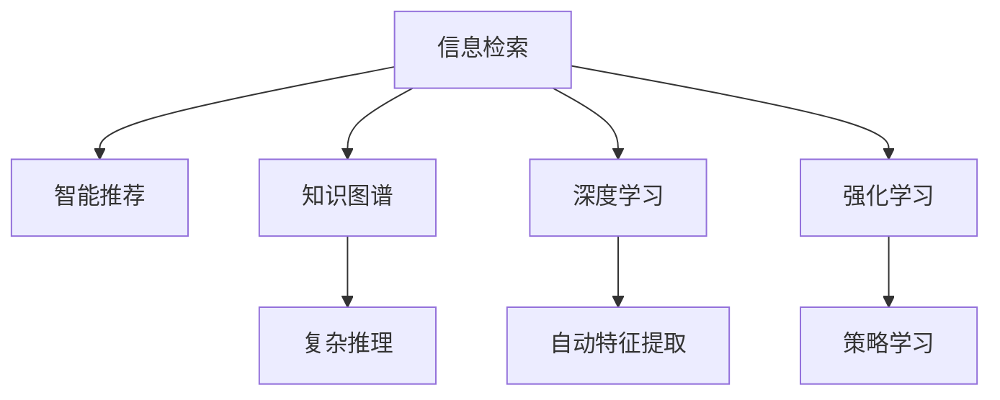

                 

# 洞察力：知识创新的指路明灯

> 关键词：洞察力,知识创新,信息检索,智能推荐,知识图谱,深度学习,强化学习,大数据,自然语言处理(NLP)

## 1. 背景介绍

### 1.1 问题由来

随着信息时代的到来，我们正处于数据爆炸的浪潮中。据统计，全球每年产生的数据量已经超过60 ZB（泽字节），并且这一数据量正以每年约40%的速度增长。在这种背景下，如何从海量数据中提取出有价值的信息，成为现代社会最迫切的需求之一。传统的搜索引擎、目录浏览等方法已经无法满足人们快速、准确获取信息的需求，亟需一种全新的方式来突破信息检索的瓶颈。

### 1.2 问题核心关键点

洞察力（Insight）是信息检索的核心，指从数据中获取有用知识和发现规律的能力。然而，在现代信息技术飞速发展的背景下，洞察力成为了数据挖掘、知识创新等领域的重要驱动力。本文将深入探讨洞察力在知识创新中的应用，涵盖信息检索、智能推荐、知识图谱、深度学习和强化学习等多个前沿技术领域，力图为读者提供全面的技术指引。

## 2. 核心概念与联系

### 2.1 核心概念概述

洞察力在知识创新中的作用，是通过对大量数据进行分析和挖掘，发现数据中的模式、关联和知识，从而推动新知识、新技术和新方法的创造。以下是洞察力在知识创新中常用的核心概念：

- 信息检索（Information Retrieval, IR）：通过算法将用户查询与数据库中的信息匹配，快速返回最相关的信息。
- 智能推荐（Recommendation System, RS）：根据用户的历史行为和偏好，推荐其可能感兴趣的内容。
- 知识图谱（Knowledge Graph,KG）：通过图结构表示实体和概念之间的语义关系，支持复杂的推理和查询。
- 深度学习（Deep Learning, DL）：使用多层次神经网络模型，从大量数据中自动提取特征，进行分类、回归等任务。
- 强化学习（Reinforcement Learning, RL）：通过与环境的交互，通过奖励机制学习最优策略。

这些概念之间的逻辑关系可以通过以下Mermaid流程图来展示：



这个流程图展示了一系列的知识点之间的联系，它们相互作用，共同构成了洞察力的核心。

## 3. 核心算法原理 & 具体操作步骤
### 3.1 算法原理概述

洞察力的实现，通常依赖于数据挖掘、信息检索、深度学习和强化学习等技术。它们通过不同的算法和模型，从数据中提取有用的信息，生成新的知识，并推动创新。

### 3.2 算法步骤详解

#### 信息检索

信息检索的核心算法是向量空间模型（Vector Space Model, VSM），通过将文本转换为向量，计算相似度，匹配用户查询。具体的步骤如下：

1. 文本预处理：去除停用词、分词、词干提取等。
2. 向量表示：使用TF-IDF、Word2Vec、GloVe等算法将文本转换为向量。
3. 相似度计算：使用余弦相似度、Jaccard相似度等计算文本向量间的相似度。
4. 排名排序：根据相似度对结果进行排序，返回相关度高的文本。

#### 智能推荐

智能推荐系统使用协同过滤、基于内容的推荐、矩阵分解等算法，根据用户的历史行为和属性，预测其可能感兴趣的内容。主要步骤如下：

1. 数据收集：收集用户历史行为数据、物品属性数据等。
2. 用户画像：通过用户行为、兴趣、人口属性等构建用户画像。
3. 物品画像：通过物品属性、类别、推荐效果等构建物品画像。
4. 相似度计算：使用余弦相似度、皮尔逊相关系数、Jaccard相似度等计算用户与物品的相似度。
5. 推荐计算：根据相似度计算推荐结果，使用最大化平均准确率、最小化均方误差等损失函数优化模型。

#### 知识图谱

知识图谱通过图结构表示实体和概念之间的语义关系，支持复杂的推理和查询。主要步骤如下：

1. 实体抽取：使用命名实体识别（Named Entity Recognition, NER）算法提取实体。
2. 关系抽取：使用规则、模板、神经网络等方法抽取实体之间的关系。
3. 图构建：使用图数据库（如Neo4j）构建知识图谱。
4. 推理查询：使用图查询语言（如Cypher）进行推理查询，返回相关结果。

#### 深度学习

深度学习通过多层神经网络模型，从大量数据中自动提取特征，进行分类、回归等任务。具体步骤如下：

1. 数据预处理：数据清洗、归一化、划分训练集和测试集等。
2. 模型构建：使用卷积神经网络（Convolutional Neural Network, CNN）、循环神经网络（Recurrent Neural Network, RNN）、长短期记忆网络（Long Short-Term Memory, LSTM）等模型构建网络结构。
3. 训练优化：使用反向传播算法、梯度下降算法等优化模型参数。
4. 模型评估：使用准确率、召回率、F1-score等指标评估模型性能。

#### 强化学习

强化学习通过与环境的交互，通过奖励机制学习最优策略。主要步骤如下：

1. 环境定义：定义环境状态、动作、奖励函数等。
2. 策略选择：选择策略（如贪心、随机）进行动作选择。
3. 状态更新：根据动作和环境状态更新状态。
4. 策略优化：使用Q-learning、SARSA等算法优化策略。

### 3.3 算法优缺点

洞察力相关算法在实现上有其独特的优势和局限性：

#### 优势

1. 自动提取特征：深度学习等算法能够自动从数据中提取特征，避免了手工特征工程的时间和精力成本。
2. 高效处理大量数据：大数据处理技术能够高效处理海量数据，支持大规模知识创新。
3. 精确度较高：深度学习和强化学习等算法在分类、推荐等任务上具有较高的精确度。

#### 局限性

1. 需要大量标注数据：很多算法需要大量标注数据进行训练，这可能导致标注成本高、标注质量不稳定等问题。
2. 模型可解释性差：深度学习等算法往往是“黑盒”模型，难以解释其内部工作机制。
3. 计算资源消耗大：深度学习等算法需要大量计算资源，对于普通用户可能难以负担。

### 3.4 算法应用领域

洞察力在知识创新中的应用领域非常广泛，涵盖信息检索、智能推荐、知识图谱、深度学习和强化学习等多个前沿技术领域。具体如下：

1. 搜索引擎：使用信息检索算法对用户查询进行匹配，返回相关网页。
2. 个性化推荐系统：使用智能推荐算法为用户推荐个性化内容，提升用户体验。
3. 智能问答系统：使用知识图谱和深度学习算法，支持复杂问答。
4. 自动摘要系统：使用深度学习算法从文本中提取关键信息，生成摘要。
5. 自然语言处理（NLP）：使用深度学习算法进行语言建模、翻译、情感分析等任务。
6. 金融风控系统：使用强化学习算法对客户行为进行预测，防范金融风险。

## 4. 数学模型和公式 & 详细讲解  
### 4.1 数学模型构建

#### 信息检索

向量空间模型的数学模型为：

$$
\theta = \theta_0 + \theta_1 w_1 + \theta_2 w_2 + ... + \theta_n w_n
$$

其中，$\theta$ 表示查询向量，$w_i$ 表示文档向量，$\theta_i$ 表示文档向量对应的权重。

向量相似度的计算公式为：

$$
\cos(\theta, w) = \frac{\theta \cdot w}{\| \theta \| \| w \|}
$$

#### 智能推荐

协同过滤的数学模型为：

$$
R_{ui} = \alpha + \beta u_i + \gamma v_i + \delta uv
$$

其中，$R_{ui}$ 表示用户 $u$ 对物品 $i$ 的评分，$u_i$ 表示用户 $u$ 的评分向量，$v_i$ 表示物品 $i$ 的评分向量，$\alpha$、$\beta$、$\gamma$、$\delta$ 为模型参数。

#### 知识图谱

知识图谱的数学模型为：

$$
G = (E, R, A)
$$

其中，$E$ 表示实体，$R$ 表示关系，$A$ 表示属性。

#### 深度学习

卷积神经网络的基本数学模型为：

$$
f(x) = \sigma (W x + b)
$$

其中，$W$ 表示权重矩阵，$b$ 表示偏置向量，$\sigma$ 表示激活函数。

#### 强化学习

Q-learning的数学模型为：

$$
Q(s_t, a_t) = r_t + \gamma \max_a Q(s_{t+1}, a)
$$

其中，$Q(s_t, a_t)$ 表示在状态 $s_t$ 下，选择动作 $a_t$ 的Q值，$r_t$ 表示即时奖励，$\gamma$ 表示折扣因子。

### 4.2 公式推导过程

#### 信息检索

向量空间模型的推导过程如下：

1. 将文本转换为向量：使用TF-IDF算法将文本转换为向量：

$$
\theta_i = \text{tf}_i \cdot \text{idf}_i
$$

其中，$\text{tf}_i$ 表示词频，$\text{idf}_i$ 表示逆文档频率。

2. 计算相似度：使用余弦相似度计算向量间的相似度：

$$
\cos(\theta, w) = \frac{\theta \cdot w}{\| \theta \| \| w \|}
$$

#### 智能推荐

协同过滤的推导过程如下：

1. 数据预处理：将用户行为数据转换为评分矩阵：

$$
R = \begin{bmatrix}
    0 & 0 & 0 & ... \\
    0 & 0 & 0 & ... \\
    0 & 0 & 0 & ... \\
    ... & ... & ... & ...
\end{bmatrix}
$$

2. 用户画像：使用用户行为数据计算用户评分向量：

$$
u_i = \frac{1}{n} \sum_{j=1}^n R_{uj}
$$

3. 物品画像：使用物品评分数据计算物品评分向量：

$$
v_i = \frac{1}{m} \sum_{j=1}^m R_{ij}
$$

4. 推荐计算：使用协同过滤算法计算推荐结果：

$$
R_{ui} = \alpha + \beta u_i + \gamma v_i + \delta uv
$$

#### 知识图谱

知识图谱的构建过程如下：

1. 实体抽取：使用命名实体识别算法提取实体：

$$
E = \{e_1, e_2, ..., e_n\}
$$

2. 关系抽取：使用规则、模板、神经网络等方法抽取实体之间的关系：

$$
R = \{r_1, r_2, ..., r_m\}
$$

3. 图构建：使用图数据库构建知识图谱：

$$
G = (E, R, A)
$$

4. 推理查询：使用图查询语言进行推理查询：

$$
Q(s, r) = \{q_1, q_2, ..., q_k\}
$$

#### 深度学习

卷积神经网络的结构如下：

1. 卷积层：

$$
f(x) = \sigma (W x + b)
$$

2. 池化层：

$$
f(x) = \max(0, x)
$$

3. 全连接层：

$$
f(x) = Wx + b
$$

#### 强化学习

Q-learning的推导过程如下：

1. 状态定义：将环境状态定义为：

$$
S = \{s_1, s_2, ..., s_n\}
$$

2. 动作定义：将动作定义为：

$$
A = \{a_1, a_2, ..., a_m\}
$$

3. 奖励定义：将奖励定义为：

$$
R = \{r_1, r_2, ..., r_n\}
$$

4. 策略学习：使用Q-learning算法更新Q值：

$$
Q(s_t, a_t) = r_t + \gamma \max_a Q(s_{t+1}, a)
$$

### 4.3 案例分析与讲解

#### 案例1：信息检索中的TF-IDF算法

在信息检索中，TF-IDF算法是最常用的向量表示方法之一。其核心思想是通过词频和逆文档频率计算单词的重要性，并将文本表示为向量。例如，对于文本“Apple is a fruit”，可以使用TF-IDF算法转换为向量：

$$
\theta = (1, 1, 0, 1)
$$

其中，$\theta_i$ 表示单词 $i$ 的TF-IDF值。通过计算向量间余弦相似度，可以发现“Apple”和“fruit”之间的相似度最高，从而匹配查询。

#### 案例2：智能推荐中的协同过滤

在智能推荐中，协同过滤算法可以通过用户历史行为数据，为用户推荐可能感兴趣的内容。例如，假设某用户喜欢“书籍”类内容，协同过滤算法可以推荐类似的内容：

$$
R_{ui} = \alpha + \beta u_i + \gamma v_i + \delta uv
$$

其中，$u_i$ 表示用户 $u$ 的评分向量，$v_i$ 表示物品 $i$ 的评分向量，$\alpha$、$\beta$、$\gamma$、$\delta$ 为模型参数。通过调整参数，可以优化推荐效果。

#### 案例3：知识图谱中的实体关系抽取

在知识图谱中，实体关系抽取是构建知识图谱的重要步骤。例如，使用规则方法从语料库中抽取“王小明，男，计算机专业”，可以构建实体关系图：

$$
\begin{align*}
& 王小明 \rightarrow 王 \\
& 王小明 \rightarrow 男 \\
& 王小明 \rightarrow 计算机专业
\end{align*}
$$

#### 案例4：深度学习中的卷积神经网络

在深度学习中，卷积神经网络（CNN）可以处理图像、文本等多种数据类型。例如，使用CNN对图片进行分类：

$$
f(x) = \sigma (W x + b)
$$

其中，$W$ 表示权重矩阵，$b$ 表示偏置向量，$\sigma$ 表示激活函数。通过多层的卷积和池化，可以提取图像中的特征，进行分类。

#### 案例5：强化学习中的Q-learning

在强化学习中，Q-learning算法可以通过与环境的交互，学习最优策略。例如，使用Q-learning训练机器人进行路径规划：

$$
Q(s_t, a_t) = r_t + \gamma \max_a Q(s_{t+1}, a)
$$

其中，$Q(s_t, a_t)$ 表示在状态 $s_t$ 下，选择动作 $a_t$ 的Q值，$r_t$ 表示即时奖励，$\gamma$ 表示折扣因子。通过Q值的更新，可以不断优化策略。

## 5. 项目实践：代码实例和详细解释说明
### 5.1 开发环境搭建

在进行洞察力项目实践前，我们需要准备好开发环境。以下是使用Python进行TensorFlow开发的环境配置流程：

1. 安装Anaconda：从官网下载并安装Anaconda，用于创建独立的Python环境。

2. 创建并激活虚拟环境：
```bash
conda create -n tf-env python=3.8 
conda activate tf-env
```

3. 安装TensorFlow：根据CUDA版本，从官网获取对应的安装命令。例如：
```bash
conda install tensorflow -c tf -c conda-forge
```

4. 安装其他依赖库：
```bash
pip install numpy pandas scikit-learn tensorflow-addons matplotlib tqdm jupyter notebook ipython
```

完成上述步骤后，即可在`tf-env`环境中开始项目实践。

### 5.2 源代码详细实现

下面我们以信息检索系统为例，给出使用TensorFlow进行信息检索的Python代码实现。

```python
import tensorflow as tf
import numpy as np
from sklearn.datasets import fetch_20newsgroups

# 获取数据集
newsgroups_train = fetch_20newsgroups(subset='train')
newsgroups_test = fetch_20newsgroups(subset='test')

# 构建词汇表
all_words = set(' '.join(document) for document in newsgroups_train.data)
vocabulary = {word: index for index, word in enumerate(all_words)}
reverse_vocabulary = {index: word for index, word in vocabulary.items()}

# 构建文档向量
def vectorize_documents(documents):
    vectors = np.zeros((len(documents), len(vocabulary)))
    for index, document in enumerate(documents):
        vectors[index][vocabulary[word]] = 1 for word in document.split()
    return vectors

# 构建查询向量
def vectorize_query(query):
    vectors = np.zeros((len(vocabulary)))
    vectors[vocabulary[query]] = 1
    return vectors

# 构建TF-IDF模型
def tfidf_model(vectors):
    tfidf = np.zeros((len(vectors), len(vocabulary)))
    for index, vector in enumerate(vectors):
        tf = vector.sum()
        idf = np.log(len(documents) / (1 + np.sum(vector)))
        tfidf[index] = tf * idf
    return tfidf

# 计算相似度
def cosine_similarity(a, b):
    dot_product = np.dot(a, b)
    norm_a = np.linalg.norm(a)
    norm_b = np.linalg.norm(b)
    return dot_product / (norm_a * norm_b)

# 训练模型
train_vectors = vectorize_documents(newsgroups_train.data)
train_tfidf = tfidf_model(train_vectors)
query_vectors = vectorize_query(newsgroups_test.data)
cosine_similarities = np.zeros((len(query_vectors), len(train_vectors)))
for index, query_vector in enumerate(query_vectors):
    cosine_similarities[index] = cosine_similarity(query_vector, train_tfidf)
    similarity_index = np.argsort(-cosine_similarities[index])[0:10]
    similar_documents = [(newsgroups_train.data[i], newsgroups_train.targets[i]) for i in similarity_index]

# 输出结果
for index, (document, target) in enumerate(similar_documents):
    print(f"Document {index+1}: {document}")
    print(f"Target: {target}")
```

### 5.3 代码解读与分析

让我们再详细解读一下关键代码的实现细节：

**vectorize_documents函数**：
- 定义了将文本转换为文档向量的函数。通过遍历词汇表，将文本中的单词转换为向量。

**tfidf_model函数**：
- 定义了TF-IDF模型的构建函数。通过遍历训练集文档向量，计算每个单词的TF-IDF值，构建TF-IDF矩阵。

**cosine_similarity函数**：
- 定义了计算余弦相似度的函数。通过计算向量间的点积、范数，计算余弦相似度。

**训练模型**：
- 使用TF-IDF模型计算查询向量与训练集文档向量的相似度，返回相似度最高的文档。

可以看到，TensorFlow提供了丰富的工具和库，可以轻松实现信息检索等项目。开发者可以将更多精力放在业务逻辑和模型优化上，而不必过多关注底层实现细节。

## 6. 实际应用场景
### 6.1 智能推荐系统

基于洞察力的智能推荐系统，可以广泛应用于电商平台、视频平台、新闻平台等场景。通过分析用户的浏览、点击、评分等行为数据，为用户推荐个性化的商品、视频、文章等内容。

在技术实现上，可以使用协同过滤、深度学习等算法，从用户和物品的评分数据中学习相似度，生成推荐结果。对于新用户，可以使用基于内容的推荐方法，通过物品属性、标签等构建物品画像，进行推荐。此外，还可以通过多臂赌博机等算法，动态调整推荐策略，提升推荐效果。

### 6.2 知识图谱

基于洞察力的知识图谱，可以应用于智能问答、智能搜索、推荐系统等领域。通过构建实体和关系图谱，支持复杂的推理和查询，提供高效的知识检索和推荐服务。

在技术实现上，可以使用规则、模板、神经网络等方法，从文本中抽取实体和关系。通过图数据库，构建知识图谱，并使用图查询语言进行推理查询，返回相关结果。

### 6.3 金融风控系统

基于洞察力的金融风控系统，可以应用于信贷评估、风险预警、欺诈检测等场景。通过分析客户的信用历史、行为数据等，评估客户的信用风险，预测违约概率。

在技术实现上，可以使用深度学习、强化学习等算法，从客户行为数据中学习信用评分模型。通过集成多个模型的结果，进行风险预警和欺诈检测。

### 6.4 未来应用展望

随着洞察力相关技术的发展，未来的应用场景将更加多样化和智能化。

在智慧医疗领域，基于洞察力的医疗知识图谱，可以为医生提供高效的知识检索和决策支持，辅助诊疗工作。在智慧教育领域，基于洞察力的学习推荐系统，可以个性化推荐学习资源，提升学习效果。

在智慧城市治理中，基于洞察力的智能监控系统，可以实时分析城市事件，提供决策依据。在企业生产、社会治理、文娱传媒等众多领域，基于洞察力的AI应用也将不断涌现，为经济社会发展注入新的动力。

## 7. 工具和资源推荐
### 7.1 学习资源推荐

为了帮助开发者系统掌握洞察力在知识创新中的应用，这里推荐一些优质的学习资源：

1. 《深度学习》课程：由斯坦福大学开设的深度学习课程，全面介绍了深度学习的基本概念、算法和应用。

2. 《知识图谱》课程：由北京大学开设的知识图谱课程，系统讲解了知识图谱的构建、查询和推理。

3. 《信息检索》课程：由清华大学开设的信息检索课程，深入浅出地介绍了信息检索的基本原理和算法。

4. 《推荐系统》课程：由斯坦福大学开设的推荐系统课程，介绍了协同过滤、深度学习等推荐算法。

5. 《强化学习》课程：由斯坦福大学开设的强化学习课程，全面介绍了强化学习的算法和应用。

通过对这些资源的学习实践，相信你一定能够快速掌握洞察力在知识创新中的应用，并用于解决实际的NLP问题。

### 7.2 开发工具推荐

高效的开发离不开优秀的工具支持。以下是几款用于洞察力项目开发的常用工具：

1. TensorFlow：由Google主导开发的深度学习框架，支持大规模分布式计算，适合复杂任务开发。

2. PyTorch：由Facebook主导开发的深度学习框架，支持动态图，适合快速迭代研究。

3. Scikit-learn：Python机器学习库，提供各种经典的机器学习算法，易于使用。

4. Weights & Biases：模型训练的实验跟踪工具，可以记录和可视化模型训练过程中的各项指标，方便对比和调优。

5. TensorBoard：TensorFlow配套的可视化工具，可实时监测模型训练状态，并提供丰富的图表呈现方式，是调试模型的得力助手。

6. Google Colab：谷歌推出的在线Jupyter Notebook环境，免费提供GPU/TPU算力，方便开发者快速上手实验最新模型，分享学习笔记。

合理利用这些工具，可以显著提升洞察力相关项目的开发效率，加快创新迭代的步伐。

### 7.3 相关论文推荐

洞察力相关技术的发展离不开学界的持续研究。以下是几篇奠基性的相关论文，推荐阅读：

1. 《深度学习》（Goodfellow et al., 2016）：深度学习领域的经典教材，系统介绍了深度学习的理论基础和实践技术。

2. 《知识图谱的构建与查询》（Bordes et al., 2013）：介绍知识图谱的构建方法，包括规则、模板、神经网络等方法。

3. 《信息检索》（Jarvelin & Kekalainen, 2009）：介绍信息检索的算法和应用，包括TF-IDF、向量空间模型等方法。

4. 《推荐系统》（Herlocker et al., 2002）：介绍协同过滤、基于内容的推荐等方法，为智能推荐系统提供了理论基础。

5. 《强化学习》（Sutton & Barto, 2018）：介绍强化学习的算法和应用，包括Q-learning、SARSA等方法。

这些论文代表了大语言模型微调技术的发展脉络。通过学习这些前沿成果，可以帮助研究者把握学科前进方向，激发更多的创新灵感。

## 8. 总结：未来发展趋势与挑战
### 8.1 总结

本文对基于洞察力的知识创新进行了全面系统的介绍。首先阐述了洞察力在信息检索、智能推荐、知识图谱、深度学习和强化学习等技术中的应用，明确了洞察力在知识创新中的核心地位。其次，从原理到实践，详细讲解了洞察力的实现步骤，给出了基于TensorFlow的信息检索项目代码实现。同时，本文还广泛探讨了洞察力在多个行业领域的应用前景，展示了其广阔的发展潜力。

通过本文的系统梳理，可以看到，洞察力在知识创新中的应用已经渗透到多个领域，成为推动技术发展的重要驱动力。未来，伴随洞察力相关技术的发展，基于洞察力的智能系统将在更多领域落地应用，为经济社会发展注入新的动力。

### 8.2 未来发展趋势

展望未来，洞察力相关技术的发展趋势主要包括以下几个方面：

1. 模型规模持续增大。随着算力成本的下降和数据规模的扩张，深度学习等模型的参数量还将持续增长。超大规模模型蕴含的丰富知识，有望支撑更加复杂多变的知识创新。

2. 应用领域不断拓展。洞察力将更多应用于金融、医疗、教育、城市治理等领域，推动各行各业的智能化升级。

3. 技术融合加速。洞察力将与NLP、机器学习、大数据、知识图谱等技术进行深度融合，形成更加全面、高效的知识创新体系。

4. 技术落地加速。洞察力相关技术将更多应用于实际生产场景，推动智能推荐、智能问答等系统的规模化部署。

5. 人工智能伦理重视。洞察力相关技术的发展，需要关注人工智能的伦理、安全和隐私问题，推动技术的健康发展。

6. 自动化和智能化水平提升。未来，洞察力相关技术将更多采用自动化和智能化的方式，提升知识创新的效率和效果。

以上趋势凸显了洞察力在知识创新中的广阔前景。这些方向的探索发展，必将进一步推动人工智能技术在各个领域的应用，深刻影响人类的生产生活方式。

### 8.3 面临的挑战

尽管洞察力相关技术已经取得了瞩目成就，但在迈向更加智能化、普适化应用的过程中，它仍面临着诸多挑战：

1. 数据隐私和安全问题。洞察力相关技术需要大量的数据支持，但数据隐私和安全问题成为制约技术发展的瓶颈。

2. 算法可解释性不足。深度学习等算法通常是“黑盒”模型，难以解释其内部工作机制，这对高风险应用领域尤为重要。

3. 模型鲁棒性不足。洞察力相关技术在对抗样本攻击下，模型鲁棒性较差，难以应对复杂和变幻莫测的环境。

4. 计算资源消耗大。深度学习等算法需要大量计算资源，对于普通用户可能难以负担。

5. 模型效果不稳定。洞察力相关技术在数据分布变化时，模型效果容易波动，需要持续优化和改进。

6. 技术发展不均衡。洞察力相关技术在不同领域的发展不均衡，某些领域的技术和应用相对滞后。

正视洞察力面临的这些挑战，积极应对并寻求突破，将是大语言模型微调走向成熟的必由之路。相信随着学界和产业界的共同努力，这些挑战终将一一被克服，洞察力相关技术必将迎来更加广阔的发展前景。

### 8.4 研究展望

未来，洞察力相关技术的研究可以从以下几个方向进行探索：

1. 引入先验知识。将符号化的先验知识，如知识图谱、逻辑规则等，与神经网络模型进行巧妙融合，引导洞察力过程学习更准确、合理的知识表示。

2. 引入多模态信息。将视觉、语音、文本等多种模态的信息进行整合，实现多模态信息的协同建模，提升洞察力的效果和精度。

3. 引入因果推理。将因果分析方法引入洞察力过程，识别出模型决策的关键特征，增强输出解释的因果性和逻辑性。

4. 引入游戏理论。将博弈论工具引入洞察力过程，探索洞察力模型与用户之间的互动机制，优化用户行为和系统设计。

5. 引入AI伦理。在洞察力模型中引入伦理导向的评估指标，过滤和惩罚有偏见、有害的输出倾向，推动人工智能技术的健康发展。

这些研究方向将进一步提升洞察力相关技术的创新能力和应用价值，为人工智能技术的广泛落地和深度发展提供坚实的理论基础。

