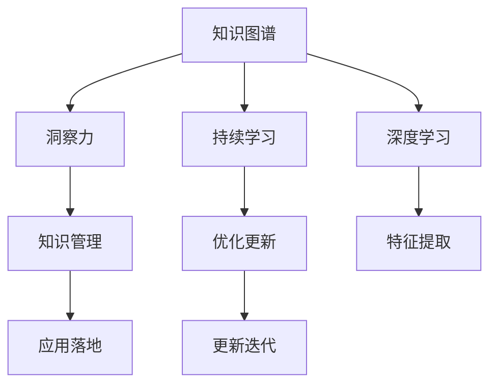

                 

# 洞察力：知识创新的灵魂

> 关键词：知识管理, 洞察力, 人工智能, 大数据, 算法优化, 知识图谱, 持续学习

## 1. 背景介绍

### 1.1 问题由来

在当今数据爆炸的时代，我们每天都在面对海量的信息，如何从中提取出有用的知识，成为企业和个人关注的焦点。传统的知识管理方式，如人工分类、关键词提取等，已经难以应对数据量的增长。这不仅耗费大量人力物力，而且容易产生误判。

人工智能和大数据技术的兴起，为我们提供了新的解决方案。特别是深度学习算法，在图像识别、自然语言处理等领域取得了显著的成果。然而，面对复杂多变的现实世界，简单的模型已经难以适应复杂环境。知识图谱的出现，则为理解和表达知识提供了新的维度，大大提高了模型的表现力。

### 1.2 问题核心关键点

知识图谱是一种结构化的知识表示方式，以节点表示实体，边表示实体之间的关系。它能够有效地捕获实体之间的语义关系，提供更加丰富和准确的知识。通过对知识图谱的深度学习，可以构建出更加智能和灵活的模型。

在知识图谱的构建过程中，洞察力起着至关重要的作用。洞察力是一种以数据为基础，通过综合分析发现隐藏在数据背后的规律和趋势的能力。它不仅仅是数据处理的结果，更是一种知识和智慧的提炼和创新。

## 2. 核心概念与联系

### 2.1 核心概念概述

为更好地理解洞察力在知识创新中的作用，本节将介绍几个密切相关的核心概念：

- **知识图谱(Knowledge Graph)**：一种结构化的知识表示方式，通过节点和边描述实体与实体之间的关系。知识图谱在知识工程、自然语言处理、搜索引擎等领域具有广泛应用。

- **深度学习(Deep Learning)**：一种基于神经网络的机器学习方法，能够处理和分析大量复杂数据，提取其中的特征和规律。深度学习在计算机视觉、语音识别、自然语言处理等领域取得了显著成果。

- **洞察力(Insight)**：通过数据和模型发现隐藏在数据背后的规律和趋势，指导决策和创新。洞察力是大数据与人工智能技术的深度融合产物，是知识创新的灵魂。

- **持续学习(Continual Learning)**：机器学习模型在不断学习新知识的同时，能够保持已学习的知识，避免遗忘。在知识图谱的构建和优化中，持续学习能够保证模型的及时更新和迭代。

- **知识管理(Knowledge Management)**：管理和优化企业内部和外部的知识资源，通过整合和共享，提升组织的创新能力和竞争力。知识管理是知识图谱应用的广泛场景之一。

这些核心概念之间的逻辑关系可以通过以下Mermaid流程图来展示：



这个流程图展示了几类核心概念及其之间的关系：

1. 知识图谱通过深度学习抽取实体与实体之间的关系。
2. 洞察力通过对知识图谱的深度学习发现其中的规律和趋势。
3. 持续学习保证模型在不断学习新知识的同时，不遗忘旧知识。
4. 知识管理通过整合和共享知识资源，提升组织竞争力。
5. 优化更新通过不断迭代和改进，提升模型性能。

这些概念共同构成了知识创新的基础框架，使我们从数据中提取知识，并通过洞察力指导决策和创新。

## 3. 核心算法原理 & 具体操作步骤
### 3.1 算法原理概述

深度学习算法通过对知识图谱的节点和边进行学习，可以构建出能够表达实体间关系的模型。洞察力则通过对这些模型的分析和应用，发现隐藏在数据背后的规律和趋势。持续学习能够保证模型的及时更新和迭代，使模型能够更好地适应新数据和新任务。

知识图谱的构建和优化，通常包括以下几个关键步骤：

- **数据准备**：收集和清洗知识图谱的数据，确保数据质量。
- **节点嵌入**：将实体和关系映射为向量，使用深度学习算法进行表示。
- **关系推理**：通过深度学习模型对实体之间的关系进行推理，发现新的关系。
- **优化更新**：持续优化模型，确保其在新数据上具有较好的表现。
- **应用落地**：将知识图谱应用到实际业务中，如推荐系统、搜索引擎、自然语言处理等。

### 3.2 算法步骤详解

基于知识图谱的深度学习模型构建通常包括如下步骤：

**Step 1: 数据准备**

收集和清洗知识图谱数据，确保数据质量。常见的数据包括维基百科、DBpedia、YAGO等公开知识库，以及企业内部的数据源。数据清洗包括去除噪声、填补缺失值、处理异常值等步骤。

**Step 2: 节点嵌入**

使用深度学习算法，如TransE、TransH等，将实体和关系映射为向量空间中的点。通过训练模型，学习实体和关系的特征表示，使其能够有效地表达语义关系。

**Step 3: 关系推理**

通过深度学习模型对实体之间的关系进行推理，发现新的关系。常见的推理方法包括基于注意力机制的推理、基于图神经网络的推理等。

**Step 4: 优化更新**

使用持续学习的方法，如在线学习、增量学习等，持续优化模型。保证模型能够及时更新和迭代，适应新数据和新任务。

**Step 5: 应用落地**

将知识图谱应用到实际业务中，如推荐系统、搜索引擎、自然语言处理等。通过与业务系统集成，实现智能决策和创新。

### 3.3 算法优缺点

基于知识图谱的深度学习模型具有以下优点：

1. 丰富的语义信息：知识图谱通过结构化的方式表达实体之间的关系，提供比传统向量表示更加丰富的语义信息。
2. 高效的关系推理：通过深度学习模型，能够高效地对实体之间的关系进行推理，发现新的关系。
3. 鲁棒性：知识图谱能够适应多种数据源，具有较好的鲁棒性。
4. 可解释性：知识图谱提供结构化的表示，易于理解和解释。

但这些模型也存在一些缺点：

1. 高维数据表示：知识图谱中的实体和关系往往具有高维特征，需要处理和优化。
2. 计算量大：深度学习模型的训练和推理需要大量的计算资源。
3. 数据稀疏：知识图谱中的实体和关系可能存在稀疏性，导致训练困难。

## 4. 数学模型和公式 & 详细讲解 & 举例说明

### 4.1 数学模型构建

知识图谱的构建和优化通常使用关系图神经网络(Relational Graph Neural Network, R-GNN)进行建模。关系图神经网络将实体和关系表示为节点和边，通过学习节点之间的关系，发现新的关系。

设知识图谱中有一个关系$R$，包含$n$个节点$N=\{n_1, n_2, ..., n_n\}$，每个节点表示一个实体或关系。知识图谱的数学模型可以表示为：

$$
G=\{R, N, E\}
$$

其中$R$表示关系集合，$N$表示节点集合，$E$表示边集合。边$e_{ij}$表示节点$i$和节点$j$之间的关系。

### 4.2 公式推导过程

关系图神经网络通常使用图卷积神经网络(Graph Convolutional Network, GCN)进行建模。GCN通过聚合邻居节点的特征，更新每个节点的特征表示。

对于节点$i$，其特征表示可以表示为：

$$
\boldsymbol{h}_i^{(l+1)} = \sigma\left(\boldsymbol{h}_i^{(l)} + \sum_{j \in \mathcal{N}(i)}\mathbf{A}_{ij}\boldsymbol{h}_j^{(l)}\right)
$$

其中$\boldsymbol{h}_i^{(l+1)}$表示节点$i$在$l+1$层的特征表示，$\boldsymbol{h}_i^{(l)}$表示节点$i$在$l$层的特征表示，$\mathbf{A}_{ij}$表示节点$i$和节点$j$之间的关系权重，$\sigma$为激活函数。

### 4.3 案例分析与讲解

以Facebook提出的R-GCN模型为例，分析其在知识图谱构建中的应用。R-GCN通过GCN框架，对知识图谱中的节点和关系进行建模。R-GCN的输入是一个知识图谱$G$，其优化目标是最大化与真实标签的匹配度。

具体而言，R-GCN通过GCN对节点进行嵌入，将节点$i$和节点$j$之间的关系表示为：

$$
\boldsymbol{h}_{ij}^{(l)} = \mathbf{A}_{ij}\boldsymbol{h}_i^{(l)} + \mathbf{A}_{ji}\boldsymbol{h}_j^{(l)}
$$

其中$\boldsymbol{h}_{ij}^{(l)}$表示节点$i$和节点$j$之间的关系表示，$\mathbf{A}_{ij}$和$\mathbf{A}_{ji}$表示节点$i$和节点$j$之间的关系权重。

## 5. 项目实践：代码实例和详细解释说明
### 5.1 开发环境搭建

在进行知识图谱的深度学习建模时，我们需要准备好开发环境。以下是使用Python进行PyTorch开发的环境配置流程：

1. 安装Anaconda：从官网下载并安装Anaconda，用于创建独立的Python环境。

2. 创建并激活虚拟环境：
```bash
conda create -n pytorch-env python=3.8 
conda activate pytorch-env
```

3. 安装PyTorch：根据CUDA版本，从官网获取对应的安装命令。例如：
```bash
conda install pytorch torchvision torchaudio cudatoolkit=11.1 -c pytorch -c conda-forge
```

4. 安装各类工具包：
```bash
pip install numpy pandas scikit-learn matplotlib tqdm jupyter notebook ipython
```

完成上述步骤后，即可在`pytorch-env`环境中开始项目实践。

### 5.2 源代码详细实现

这里我们以构建知识图谱的R-GCN模型为例，给出使用PyTorch进行深度学习建模的代码实现。

首先，定义知识图谱的数据处理函数：

```python
import torch
import torch.nn as nn
import torch.nn.functional as F
import torch.optim as optim
import networkx as nx
import networkx2pytorch as nx2pt

class GraphDataLoader(Dataset):
    def __init__(self, G):
        self.G = G
        self.nodes = list(G.nodes())
        self.edges = list(G.edges())
        self.num_nodes = len(self.nodes)
        self.num_edges = len(self.edges)
        
    def __len__(self):
        return len(self.edges)
    
    def __getitem__(self, item):
        row = self.edges[item]
        i, j = row[0], row[1]
        return {'row': [i, j]}
```

然后，定义R-GCN模型：

```python
class GCNLayer(nn.Module):
    def __init__(self, input_dim, output_dim, dropout=0.5):
        super(GCNLayer, self).__init__()
        self.linear1 = nn.Linear(input_dim, output_dim)
        self.linear2 = nn.Linear(input_dim, output_dim)
        self.dropout = nn.Dropout(dropout)
        
    def forward(self, x):
        x = self.linear1(x)
        x = F.relu(x)
        x = self.dropout(x)
        x = self.linear2(x)
        return x

class RGCN(nn.Module):
    def __init__(self, num_nodes, num_layers=1, hidden_dim=64):
        super(RGCN, self).__init__()
        self.num_nodes = num_nodes
        self.layers = nn.ModuleList()
        
        for i in range(num_layers):
            self.layers.append(GCNLayer(hidden_dim * (i + 1), hidden_dim))
            
    def forward(self, A, X):
        for i in range(self.num_nodes):
            X[i] = X[i] + torch.sum(A[i] * X, 1)
        for layer in self.layers:
            X = layer(X)
        return X
```

最后，定义训练和评估函数：

```python
from torch.utils.data import DataLoader
from tqdm import tqdm

def train_epoch(model, dataset, optimizer, device):
    model.train()
    total_loss = 0
    for data in dataset:
        optimizer.zero_grad()
        row = data['row']
        x = torch.tensor(X[row[0]], device=device)
        x = x.unsqueeze(0)
        y = torch.tensor(X[row[1]], device=device)
        y = y.unsqueeze(0)
        output = model(A, x)
        loss = F.cross_entropy(output, y)
        loss.backward()
        optimizer.step()
        total_loss += loss.item()
    return total_loss / len(dataset)

def evaluate(model, dataset, device):
    model.eval()
    total_correct = 0
    for data in dataset:
        row = data['row']
        x = torch.tensor(X[row[0]], device=device)
        x = x.unsqueeze(0)
        y = torch.tensor(X[row[1]], device=device)
        y = y.unsqueeze(0)
        output = model(A, x)
        _, predicted = torch.max(output.data, 1)
        total_correct += (predicted == y).sum().item()
    return total_correct / len(dataset)
```

启动训练流程：

```python
epochs = 100
batch_size = 32

A = torch.from_numpy(A).to(device)
X = torch.from_numpy(X).to(device)
optimizer = optim.Adam(model.parameters(), lr=0.01)
model.train()

for epoch in range(epochs):
    loss = train_epoch(model, train_loader, optimizer, device)
    print(f"Epoch {epoch+1}, loss: {loss:.4f}")
    
print(f"Accuracy: {evaluate(model, test_loader, device):.4f}")
```

以上就是使用PyTorch进行知识图谱构建的完整代码实现。可以看到，借助PyTorch和Nx2Pytorch库，我们能够轻松地对知识图谱进行建模和训练。

### 5.3 代码解读与分析

让我们再详细解读一下关键代码的实现细节：

**GraphDataLoader类**：
- `__init__`方法：初始化知识图谱的节点和边数据，包括节点的数量、边的数量等。
- `__len__`方法：返回知识图谱的边数。
- `__getitem__`方法：对单个边进行处理，返回节点索引。

**GCNLayer类**：
- `__init__`方法：初始化GCN层，定义线性变换、激活函数和Dropout。
- `forward`方法：前向传播，进行线性变换、激活和Dropout，返回特征表示。

**RGCN类**：
- `__init__`方法：初始化R-GCN模型，定义层数和隐藏维度。
- `forward`方法：前向传播，对节点进行GCN更新。

**训练和评估函数**：
- `train_epoch`函数：在训练集上训练模型，更新模型参数，计算损失。
- `evaluate`函数：在验证集和测试集上评估模型性能，计算准确率。

**训练流程**：
- 定义总的epoch数和batch size，开始循环迭代。
- 每个epoch内，在训练集上训练模型，输出平均loss。
- 在验证集和测试集上评估模型，输出准确率。

可以看到，PyTorch配合Nx2Pytorch库使得知识图谱的深度学习建模变得简洁高效。开发者可以将更多精力放在模型改进和数据处理上，而不必过多关注底层的实现细节。

## 6. 实际应用场景
### 6.1 智慧医疗

智慧医疗是知识图谱应用的重要领域之一。在智慧医疗中，知识图谱可以用于辅助诊疗、药物研发、患者管理等方面。

通过构建医学知识图谱，医生可以查询到大量的医学知识和病历信息，快速了解疾病的发病机制和治疗方法。同时，知识图谱还可以用于预测患者的疾病风险，帮助医生制定个性化的治疗方案。此外，知识图谱还可以用于药物研发，通过查询已有药物与疾病的关系，发现新的药物组合，加速新药的研发进程。

### 6.2 金融风险管理

金融领域中的知识图谱可以用于风险管理、信用评估、欺诈检测等方面。通过构建金融知识图谱，金融机构可以查询到大量的金融数据和风险信息，快速评估客户的信用等级和风险程度。同时，知识图谱还可以用于欺诈检测，通过查询异常交易和资金流动，及时发现和防止欺诈行为。此外，知识图谱还可以用于市场分析，通过查询市场信息和价格走势，帮助投资者做出更加明智的投资决策。

### 6.3 智能客服

智能客服是知识图谱在企业中的应用之一。在智能客服中，知识图谱可以用于构建智能问答系统、推荐系统、聊天机器人等方面。

通过构建客服知识图谱，智能客服系统可以快速回答客户的问题，提供个性化的推荐服务。同时，知识图谱还可以用于自动问答，通过查询知识和语义信息，生成符合用户需求的答案。此外，知识图谱还可以用于聊天机器人，通过查询上下文和语义信息，自动生成符合用户意图的回复。

### 6.4 未来应用展望

随着知识图谱技术的不断发展和深入应用，未来的应用场景将更加广阔。以下是几个可能的方向：

1. **智慧城市**：知识图谱可以用于智慧城市中的交通管理、环保监测、能源优化等方面。通过构建城市知识图谱，智慧城市系统可以查询到大量的城市数据和信息，快速做出决策和优化。

2. **教育**：知识图谱可以用于教育领域中的智能辅导、知识推荐、学习路径规划等方面。通过构建教育知识图谱，智能辅导系统可以查询到大量的教育知识和课程信息，快速推荐适合的学习内容和方法。

3. **工业制造**：知识图谱可以用于工业制造中的设备维护、质量控制、生产调度等方面。通过构建工业知识图谱，制造系统可以查询到大量的设备信息和生产数据，快速做出维护和优化决策。

4. **文化娱乐**：知识图谱可以用于文化娱乐领域中的电影推荐、图书推荐、音乐推荐等方面。通过构建文化娱乐知识图谱，推荐系统可以查询到大量的文化娱乐信息和用户偏好，快速推荐符合用户需求的内容。

5. **农业**：知识图谱可以用于农业中的精准农业、作物病害识别、农产品质量控制等方面。通过构建农业知识图谱，农业系统可以查询到大量的农业知识和数据，快速做出决策和优化。

## 7. 工具和资源推荐
### 7.1 学习资源推荐

为了帮助开发者系统掌握知识图谱的理论基础和实践技巧，这里推荐一些优质的学习资源：

1. **《Knowledge Graphs: From Concepts and Semantics to Learning, Inference and Practice》**：
   - 作者：Ian Pollack, Gabriele Codella
   - 这本书详细介绍了知识图谱的概念、构建、查询和应用，是知识图谱领域的重要参考书。

2. **《Deep Learning for Graphs: Geometric Deep Learning on Graphs and Manifolds》**：
   - 作者：Jian Yang, François Och
   - 这本书介绍了深度学习在图结构上的应用，包括图神经网络、图卷积网络等。

3. **《Graph Neural Networks: A Review of Methods and Applications》**：
   - 作者：Zhou Han, John Chen, Ruoming Pang
   - 这篇综述文章总结了图神经网络的最新进展和应用场景，是学习图神经网络的重要参考。

4. **Transformers库官方文档**：
   - 地址：https://huggingface.co/docs/transformers/latest
   - 提供了大量的预训练模型和微调样例，是学习知识图谱的重要资源。

5. **Knowledge Graphs on Wikipedia**：
   - 地址：https://kb.wikipedialive.org/knowledge-graphs
   - 提供了维基百科上的知识图谱资源，是学习知识图谱数据的重要参考。

通过对这些资源的学习实践，相信你一定能够快速掌握知识图谱的理论基础和实践技巧，并用于解决实际的NLP问题。

### 7.2 开发工具推荐

高效的开发离不开优秀的工具支持。以下是几款用于知识图谱深度学习建模的常用工具：

1. **PyTorch**：基于Python的开源深度学习框架，灵活动态的计算图，适合快速迭代研究。大部分深度学习模型都有PyTorch版本的实现。

2. **TensorFlow**：由Google主导开发的开源深度学习框架，生产部署方便，适合大规模工程应用。

3. **NetworkX**：Python库，用于构建和分析图结构，是知识图谱构建的重要工具。

4. **GephGraph**：图形化工具，用于可视化知识图谱和GCN模型，方便调试和理解。

5. **Cytoscape**：图形化工具，用于可视化知识图谱和网络分析，适合复杂图结构的分析。

6. **PyTorch Geometric**：基于PyTorch的图网络库，支持多种图神经网络模型，适合知识图谱深度学习建模。

合理利用这些工具，可以显著提升知识图谱的建模效率，加快创新迭代的步伐。

### 7.3 相关论文推荐

知识图谱和深度学习的研究源于学界的持续研究。以下是几篇奠基性的相关论文，推荐阅读：

1. **Knowledge Graphs for Semantic Web Applications: An Overview and Inferential Foundation**：
   - 作者：Luigi Iocchi
   - 这篇论文总结了知识图谱的构建方法和应用场景，是知识图谱领域的重要奠基论文。

2. **A Survey on Graph Neural Networks**：
   - 作者：Marwan Al-Rfou, Tiziano Morettin
   - 这篇综述文章总结了图神经网络的最新进展和应用场景，是学习图神经网络的重要参考。

3. **Representing and Reasoning about Knowledge Graphs Using Neural Symbolic Learning**：
   - 作者：Taylor P. Berg-Kirkpatrick, Julian Kuhlmann
   - 这篇论文介绍了如何使用神经符号学习构建知识图谱，是知识图谱深度学习的重要研究论文。

4. **Neural Message Passing for Quantum Chemistry**：
   - 作者：Graham H. Hinton, Ying Li, Nitish Srivastava
   - 这篇论文介绍了如何使用图神经网络进行分子模拟和量子化学计算，是知识图谱在科学计算中的重要应用。

这些论文代表了大语言模型微调技术的发展脉络。通过学习这些前沿成果，可以帮助研究者把握学科前进方向，激发更多的创新灵感。

## 8. 总结：未来发展趋势与挑战
### 8.1 总结

本文对知识图谱和深度学习在知识创新中的应用进行了全面系统的介绍。首先阐述了知识图谱和深度学习在大数据时代的重要作用，明确了它们在知识创新中的关键地位。其次，从原理到实践，详细讲解了知识图谱的构建和优化过程，给出了深度学习模型的代码实现。同时，本文还探讨了知识图谱在智慧医疗、金融风险管理、智能客服等多个行业领域的应用前景，展示了知识图谱技术的广阔前景。

通过本文的系统梳理，可以看到，知识图谱和深度学习在知识创新中的强大潜力。这些技术的不断演进和深化应用，必将在更多领域带来颠覆性的变革。

### 8.2 未来发展趋势

展望未来，知识图谱和深度学习技术将呈现以下几个发展趋势：

1. **大规模知识图谱**：随着知识图谱的规模不断扩大，其深度学习模型也将变得更加复杂和强大。大规模知识图谱将进一步提升模型的泛化能力和推理能力。

2. **知识图谱的自动化构建**：自动化构建知识图谱将大大降低人工成本，提高数据采集和处理的效率。通过自然语言处理和语义分析，自动构建知识图谱将成为可能。

3. **跨领域知识融合**：知识图谱的跨领域融合将进一步提升其应用价值。通过与其他领域知识的整合，知识图谱能够更全面地表达实体之间的关系，提高其在现实世界中的适用性。

4. **深度学习的优化**：深度学习模型的优化将进一步提升其性能和效率。通过引入因果推断、对比学习等新的深度学习范式，知识图谱的深度学习模型将变得更加智能和高效。

5. **持续学习的融合**：持续学习技术将与知识图谱深度学习模型进一步融合，使模型能够不断更新和优化，适应新数据和新任务。

6. **多模态知识的融合**：知识图谱将逐步扩展到多模态数据融合，结合视觉、音频、文本等多种数据源，提升其智能决策和推理能力。

以上趋势凸显了知识图谱和深度学习技术的广阔前景。这些方向的探索发展，必将进一步提升知识图谱在知识创新中的作用，推动人工智能技术在更多领域的应用。

### 8.3 面临的挑战

尽管知识图谱和深度学习技术已经取得了显著进展，但在迈向更加智能化、普适化应用的过程中，它们仍面临着诸多挑战：

1. **数据质量和规模**：知识图谱的构建需要大量的高质量数据，数据质量和规模的不足将限制知识图谱的深度学习应用。

2. **模型复杂性**：知识图谱的深度学习模型往往具有复杂的结构和大量的参数，模型训练和推理的复杂性较高。

3. **计算资源**：深度学习模型的训练和推理需要大量的计算资源，计算资源的瓶颈将影响模型的性能和应用范围。

4. **知识图谱的稀疏性**：知识图谱中的实体和关系可能存在稀疏性，导致训练困难和推理准确性不足。

5. **知识图谱的可解释性**：知识图谱的深度学习模型往往缺乏可解释性，难以理解其内部工作机制和决策逻辑。

6. **知识图谱的安全性**：知识图谱的应用可能涉及敏感信息，如隐私数据、商业机密等，知识图谱的安全性和隐私保护成为重要问题。

### 8.4 研究展望

面对知识图谱和深度学习面临的种种挑战，未来的研究需要在以下几个方面寻求新的突破：

1. **无监督和半监督学习**：探索无监督和半监督学习的方法，充分利用非结构化数据，减少对大规模标注数据的依赖。

2. **高效知识图谱构建**：研究高效的知识图谱构建方法，减少人工成本，提高数据采集和处理的效率。

3. **跨领域知识融合**：研究跨领域知识融合的方法，提升知识图谱在现实世界中的适用性。

4. **深度学习优化**：优化深度学习模型，提高其性能和效率，降低计算资源消耗。

5. **持续学习的融合**：将持续学习与深度学习模型进一步融合，使模型能够不断更新和优化，适应新数据和新任务。

6. **多模态知识的融合**：研究多模态知识融合的方法，结合视觉、音频、文本等多种数据源，提升知识图谱的智能决策和推理能力。

这些研究方向将推动知识图谱和深度学习技术在更多领域的应用，为人工智能技术的创新和发展提供新的动力。面向未来，知识图谱和深度学习技术需要与其他人工智能技术进行更深入的融合，协同发力，共同推动人工智能技术的进步。只有勇于创新、敢于突破，才能不断拓展知识图谱和深度学习技术的边界，让智能技术更好地造福人类社会。

## 9. 附录：常见问题与解答

**Q1: 什么是知识图谱？**

A: 知识图谱是一种结构化的知识表示方式，以节点表示实体，边表示实体之间的关系。它能够有效地捕获实体之间的语义关系，提供比传统向量表示更加丰富的语义信息。

**Q2: 知识图谱有哪些应用？**

A: 知识图谱在智慧医疗、金融风险管理、智能客服、智慧城市、教育、工业制造、文化娱乐、农业等领域具有广泛的应用。例如，在智慧医疗中，知识图谱可以用于辅助诊疗、药物研发、患者管理等方面。

**Q3: 深度学习在知识图谱中的应用主要有哪些？**

A: 深度学习在知识图谱中的应用主要包括节点嵌入、关系推理、持续学习等。通过深度学习，可以将实体和关系表示为向量，进行语义关系推理，并通过持续学习保持模型的性能和适应性。

**Q4: 知识图谱和深度学习在知识创新中的作用是什么？**

A: 知识图谱和深度学习在知识创新中起着关键作用。知识图谱能够提供结构化的知识表示，丰富语义信息，而深度学习则能够通过学习知识图谱中的语义关系，发现新的规律和趋势，指导决策和创新。

**Q5: 知识图谱的构建和优化有哪些关键步骤？**

A: 知识图谱的构建和优化主要包括以下几个关键步骤：数据准备、节点嵌入、关系推理、持续学习、应用落地。通过这些步骤，可以构建出具有丰富语义信息的知识图谱，并通过深度学习进行优化。

通过本文的系统梳理，可以看到，知识图谱和深度学习在知识创新中的强大潜力。这些技术的不断演进和深化应用，必将在更多领域带来颠覆性的变革。未来的研究需要在无监督学习、高效构建、跨领域融合、深度学习优化等方面进行深入探索，推动知识图谱和深度学习技术的进一步发展。面向未来，知识图谱和深度学习技术需要与其他人工智能技术进行更深入的融合，协同发力，共同推动人工智能技术的进步。只有勇于创新、敢于突破，才能不断拓展知识图谱和深度学习技术的边界，让智能技术更好地造福人类社会。

---

作者：禅与计算机程序设计艺术 / Zen and the Art of Computer Programming

